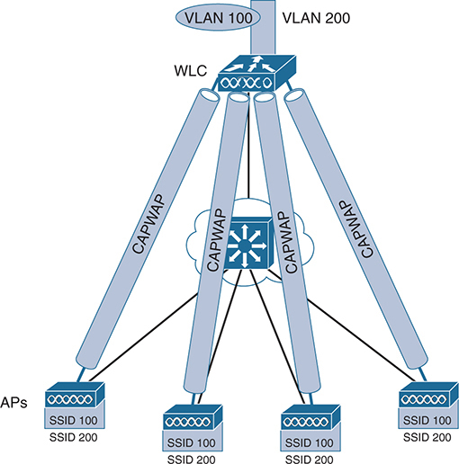

# Chapter 2

## Analyzing Cisco Wireless Architectures

This chapter covers the following exam topics:

2.0 Network Access

2.6 Compare Cisco Wireless Architectures and AP modes

In [Chapter 1](vol2_ch01.xhtml#ch01), "[Fundamentals of Wireless Networks](vol2_ch01.xhtml#ch01)," you learned how a single access point (AP) can provide a basic service set (BSS) for a cell area and how multiple APs can be connected to form an extended service set (ESS) for a larger network. In this chapter, you learn more about different approaches or architectures that allow APs to be networked together for an enterprise. You also learn how some architectures are more scalable than others and how to manage each type of wireless network architecture.

As you work through this chapter, think about how each architecture can be applied to specific environments—how easy it would be to manage, deploy, and troubleshoot the network, how the APs can be controlled, and how data would move through the network.

### "Do I Know This Already?" Quiz

Take the quiz (either here or use the PTP software) if you want to use the score to help you decide how much time to spend on this chapter. The letter answers are listed at the bottom of the page following the quiz. [Appendix C](vol2_appc.xhtml#appc), found both at the end of the book as well as on the companion website, includes both the answers and explanations. You can also find both answers and explanations in the PTP testing software.

**Table 2-1** "Do I Know This Already?" Section-to-Question Mapping

| Foundation Topics Section | Questions |
| --- | --- |
| Autonomous AP Architecture | 1 |
| Cloud-based AP Architecture | 2 |
| Split-MAC Architectures | 3–5 |
| Comparing Cisco Wireless LAN Controller Deployments | 6 |
| Cisco AP Modes | 7, 8 |

**[1](vol2_ch02.xhtml#ques2_1a).** Which one of the following terms best describes a Cisco wireless access point that operates in a standalone, independent manner?

1. Autonomous AP
2. Independent AP
3. Lightweight AP
4. Embedded AP

**[2](vol2_ch02.xhtml#ques2_2a).** The Cisco Meraki cloud-based APs are most accurately described by which one of the following statements?

1. Autonomous APs joined to a WLC
2. Autonomous APs centrally managed
3. Lightweight APs joined to a WLC
4. Lightweight APs centrally managed

**[3](vol2_ch02.xhtml#ques2_3a).** A "lightweight" access point is said to participate in which one of the following architectures?

1. Light-MAC
2. Tunnel-MAC
3. Split-MAC
4. Big-MAC

**[4](vol2_ch02.xhtml#ques2_4a).** How does an access point communicate with a wireless LAN controller?

1. Through an IPsec tunnel
2. Through a CAPWAP tunnel
3. Through a GRE tunnel
4. Directly over Layer 2

**[5](vol2_ch02.xhtml#ques2_5a).** Which one of the following is not needed for a Cisco AP in default local mode to be able to support three SSIDs that are bound to three VLANs?

1. A trunk link carrying three VLANs
2. An access link bound to a single VLAN
3. A WLC connected to three VLANs
4. A CAPWAP tunnel to a WLC

**[6](vol2_ch02.xhtml#ques2_6a).** Which one of the following WLC deployment models would be best for a large enterprise with around 3000 APs?

1. Cisco Mobility Express
2. Embedded
3. Centralized
4. Cloud-based

**[7](vol2_ch02.xhtml#ques2_7a).** If a Cisco AP provides at least one BSS for wireless clients, which one of the following modes does it use?

1. Local
2. Normal
3. Monitor
4. Client

**[8](vol2_ch02.xhtml#ques2_8a).** Regarding Cisco AP modes, which one of the following is true?

1. An AP can operate in multiple modes at the same time.
2. An AP has only one possible mode of operation.
3. The Run mode is the default mode.
4. The SE-Connect mode is used for spectrum analysis.

Answers to the "Do I Know This Already?" quiz:

**[1](vol2_appc.xhtml#ques2_1)** A

**[2](vol2_appc.xhtml#ques2_2)** B

**[3](vol2_appc.xhtml#ques2_3)** C

**[4](vol2_appc.xhtml#ques2_4)** B

**[5](vol2_appc.xhtml#ques2_5)** A

**[6](vol2_appc.xhtml#ques2_6)** C

**[7](vol2_appc.xhtml#ques2_7)** A

**[8](vol2_appc.xhtml#ques2_8)** D

### Foundation Topics

### Autonomous AP Architecture

An access point's primary function is to bridge wireless data from the air to a normal wired network. An AP can accept "connections" from a number of wireless clients so that they become members of the LAN, as if the same clients were using wired connections.

APs act as the central point of access (hence the AP name), controlling client access to the wireless LAN. An [autonomous AP](vol2_gloss.xhtml#gloss_049) is self-contained; it is equipped with both wired and wireless hardware so that the wireless client associations can be terminated onto a wired connection locally at the AP. The APs and their data connections must be distributed across the coverage area and across the network.

Autonomous APs offer one or more fully functional, standalone basic service sets (BSSs). They are also a natural extension of a switched network, connecting wireless Service Set Identifiers (SSIDs) to wired virtual LANs (VLANs) at the access layer. [Figure 2-1](vol2_ch02.xhtml#ch02fig01) shows the basic architecture; even though only four APs are shown across the bottom, a typical enterprise network could consist of hundreds or thousands of APs.

The diagram shows a hierarchical network structure with four layers: Core, Distribution, Access layer, and Autonomous Access Points. At the top, there is a Core Layer shows a Layer 3 Switch connected to two Layer 3 Switches in the Distribution Layer below. Each Layer 3 Switch in the Distribution Layer connects to two Layer 3 Switches under the Access Layer icons. Below the Access Layer are four Access Points in Autonomous APs are individually connects to each Layer 3 Switch of the Access Layer. The Layer 3 Switches includes structural information such as V LAN 10: 10.10.10.1/24, V LAN 100: 192.168.100.1/24, and V LAN 10: 10.10.10.1/24. A trunk link is shown from the right Distribution layer to the right Autonomous Aps marked with Trunk Links: V LANs 10, 100, 200; and the layer of Autonomous Aps marked with Management IP address: 10.10.10.10. with S S I Ds are listed below: wlan100 and wlan200.

**Figure 2-1** *Wireless Network Architecture with Autonomous APs*

What exactly does an autonomous AP need to become a part of the network? The wireless network in [Figure 2-1](vol2_ch02.xhtml#ch02fig01) consists of two SSIDs: wlan100 and wlan200. They correspond to wired VLANs 100 and 200, respectively. As shown by the shaded links, the VLANs must be trunked from the distribution layer switch (where routing commonly takes place) to the access layer, where they are extended further over a trunk link to the AP.

An autonomous AP offers a short and simple path for data to travel between the wireless and wired networks. Data has to travel only through the AP to reach the network on the other side. Two wireless users that are associated to the same autonomous AP can reach each other through the AP without having to pass up into the wired network. As you work through the wireless architectures discussed in the rest of the chapter, notice the data path that is required for each.

An autonomous AP must also be configured with a management IP address (10.10.10.10 in [Figure 2-1](vol2_ch02.xhtml#ch02fig01)) so that you can remotely manage it. After all, you will want to configure SSIDs, VLANs, and many RF parameters like the channel and transmit power to be used. The management address is not normally part of any of the data VLANs, so a dedicated management VLAN (i.e., VLAN 10) must be added to the trunk links to reach the AP. Each AP must be configured and maintained individually unless you leverage a management platform such as Cisco Prime Infrastructure or Cisco Catalyst Center.

Because the data and management VLANs may need to reach every autonomous AP, the network configuration and efficiency can become cumbersome as the network scales. For example, you will likely want to offer the same SSID on many APs so that wireless clients can associate with that SSID in most any location or while roaming between any two APs. You might also want to extend the corresponding VLAN (and IP subnet) to each and every AP so that clients do not have to request a new IP address for each new association.

Because SSIDs and their VLANs must be extended at Layer 2, you should consider how they are extended throughout the switched network. The shaded links in [Figure 2-2](vol2_ch02.xhtml#ch02fig02) show an example of a single VLAN's extent in the data plane. Working top to bottom, follow VLAN 100 as it reaches through the network. VLAN 100 is routed within the distribution layer and must be carried over trunk links to the access layer switches and then to each autonomous AP. In effect, VLAN 100 must extend end to end across the whole infrastructure—something that is usually considered to be a bad practice.

That approach might sound straightforward until you have to add a new VLAN and configure every switch and AP in your network to carry and support it. Even worse, suppose your network has redundant links between each layer of switches. The Spanning Tree Protocol (STP) running on each switch becomes a vital ingredient to prevent bridging loops from forming and corrupting the network. For these reasons, client roaming across autonomous APs is typically limited to the Layer 2 domain, or the extent of a single VLAN. As the wireless network expands, the infrastructure becomes more difficult to configure correctly and becomes less efficient.

The diagram shows a hierarchical network structure with four layers: Core, Distribution, Access layer, and Autonomous Access Points. At the top, there is a Core Layer shows a Layer 3 Switch connected to two Layer 3 Switches in the Distribution Layer below. Each Layer 3 Switch in the Distribution Layer connects to two Layer 3 Switches under the Access Layer icons. Below the Access Layer are four Access Points in Autonomous APs are individually connects to each Layer 3 Switch of the Access Layer. The Layer 3 Switches includes structural information such as V LAN 10: 10.10.10.1/24, V LAN 100: 192.168.100.1/24, and V LAN 10: 10.10.10.1/24. A trunk link is shown between the layers from the Distribution layer to the Autonomous Aps marked with Trunk Links carrying V LANs 10, 100, and 200 and the layer of Autonomous Aps marked with Management IP address: 10.10.10.10. with S S I Ds are listed below: wlan100 and wlan200 for each column.

**Figure 2-2** *Extent of a Data VLAN in a Network of Autonomous APs*

### Cloud-based AP Architecture

Recall that an autonomous AP needs quite a bit of configuration and management. To help manage more and more autonomous APs as the wireless network grows, you could place an AP management platform such Cisco Catalyst Center (also known as DNA Center) in a central location within the enterprise. The management platform would need to be purchased, configured, and maintained too.

A simpler approach is a [cloud-based AP](vol2_gloss.xhtml#gloss_076) architecture, where the AP management function is pushed out of the enterprise and into the Internet cloud. Cisco Meraki is cloud-based and offers centralized management of wireless, switched, and security networks built from Meraki products. For example, through the cloud networking service, you can configure and manage APs, monitor wireless performance and activity, generate reports, and so on.

Cisco Meraki APs can be deployed automatically, after you register with the Meraki cloud. Each AP will contact the cloud when it powers up and will self-configure. From that point on, you can manage the AP through the Meraki cloud dashboard.

[Figure 2-3](vol2_ch02.xhtml#ch02fig03) illustrates the basic cloud-based architecture. Notice that the network is arranged identically to that of the autonomous AP network. The reason is that the APs in a cloud-based network are all autonomous too. The most visible difference is that all of the APs are managed, controlled, and monitored centrally from the cloud.

The diagram shows a hierarchical network structure with three layers: Core, Distribution, and Access. At the top, the Core Layer features a Layer 3 switch connected to two Layer 3 switches in the Distribution Layer below. Each Layer 3 switch in the Distribution Layer connects to two Layer 3 switches in the Access Layer. Below the Access Layer, four Cisco Meraki Access Points are connected individually to each Layer 3 switch in the Access Layer. A network cloud labeled "Cisco Meraki Cloud" is connected to the Layer 3 switch in the Core Layer and to each Cisco Meraki Access Point individually. Trunk links are shown between the layers, from the Distribution Layer to the Cisco Meraki Access Points. An arrow indicates the data flow from the Cisco Meraki Access Points upward.

**Figure 2-3** *Cisco Meraki Cloud-Based Wireless Network Architecture*

From the cloud, you can push out code upgrades and configuration changes to the APs in the enterprise. The Cisco Meraki cloud also adds the intelligence needed to automatically instruct each AP on which channel and transmit power level to use. It can also collect information from all of the APs about things such as RF interference, rogue or unexpected wireless devices that were overheard, and wireless usage statistics.

Finally, there are a couple of things you should observe about the cloud-based architecture. The data path from the wireless network to the wired network is very short; the autonomous AP directly links the two networks. Data to and from wireless clients does not have to travel up into the cloud and back; the cloud is used only to bring management functions into the data plane.

Also, notice that the network in [Figure 2-3](vol2_ch02.xhtml#ch02fig03) consists of two distinct paths—one for data traffic and another for management traffic, corresponding to the following two functions:

* **A control plane:** Traffic used to control, configure, manage, and monitor the AP itself
* **A data plane:** End-user traffic passing through the AP

This division will become important in the following sections as other types of architecture are discussed.

### Split-MAC Architectures

Because autonomous APs are…well, autonomous, managing their RF operation can be quite difficult. As a network administrator, you are in charge of selecting and configuring the channel used by each AP and detecting and dealing with any rogue APs that might be interfering. You must also manage things such as the transmit power level to make sure that the wireless coverage is sufficient, it does not overlap too much, and there aren't any coverage holes—even when an AP's radio fails.

Managing wireless network security can also be difficult. Each autonomous AP handles its own security policies, with no central point of entry between the wireless and wired networks. That means there is no convenient place to monitor traffic for things such as intrusion detection and prevention, quality of service, bandwidth policing, and so on.

To overcome the limitations of distributed autonomous APs, many of the functions found within autonomous APs have to be shifted toward some central location. In [Figure 2-4](vol2_ch02.xhtml#ch02fig04), most of the activities performed by an autonomous AP on the left are broken up into two groups—management functions on the top and real-time processes on the bottom.

On the left, an Autonomous Access Point connected to a two-headed vertical arrow via a dashed line represents the bidirectional communication between the Autonomous Access Point and other network components. On the right, within a network cloud, a Layer 3 switch connected to a Wireless LAN Controller (WLC) at the top and a Cisco AP at the bottom represents the network infrastructure. A connection path labeled as CAPWAP (Control and Provisioning of Wireless Access Points) extending from the WLC to the Cisco AP. The Wireless LAN Controller shows the Management Functions as follows: R F Management, Association and Roaming Management, Client Authentication, Security Management, and QoS. The Cisco AP shows the Real-Time Functions as follows: R F Transmit or Receive, M A C Management, and Encryption.

**Figure 2-4** *Autonomous Versus Cisco Access Point*

The real-time processes involve sending and receiving 802.11 frames, beacons, and probe messages. The 802.11 data encryption is also handled in real time, on a per-packet basis. The AP must interact with wireless clients on some low level, known as the [Media Access Control (MAC) layer](vol2_gloss.xhtml#gloss_206). These functions must stay with the AP hardware, closest to the clients.

The management functions are not integral to handling frames over the RF channels, but are things that should be centrally administered. Therefore, those functions can be moved to a centrally located platform away from the AP.

When the functions of an autonomous AP are divided, the Cisco AP hardware performs only the real-time 802.11 operation. Its code image and local intelligence are stripped down, or lightweight, compared to the traditional autonomous AP.

The management functions are usually performed on a [wireless LAN controller (WLC)](vol2_gloss.xhtml#gloss_378), which controls many Cisco APs. This is shown in the bottom right portion of [Figure 2-4](vol2_ch02.xhtml#ch02fig04). Notice that the AP is left with duties in Layers 1 and 2, where frames are moved into and out of the RF domain. The AP becomes totally dependent on the WLC for every other WLAN function, such as authenticating users, managing security policies, and even selecting RF channels and output power.

Note

Remember that a Cisco AP cannot normally operate on its own; it is very dependent on a WLC somewhere in the network. That means the AP will become nonfunctional if it loses connectivity to its WLC. The only exception is the FlexConnect AP mode, which is discussed later in this chapter.

The AP-WLC division of labor is known as a [split-MAC architecture](vol2_gloss.xhtml#gloss_330), where the normal MAC operations are pulled apart into two distinct locations. This occurs for every AP in the network; each one must boot and bind itself to a WLC to support wireless clients. The WLC becomes the central hub that supports a number of APs scattered about in the network.

How does an AP bind with a WLC to form a complete working access point? The two devices must use a tunneling protocol between them, to carry 802.11-related messages and also client data. Remember that the AP and WLC can be located on the same VLAN or IP subnet, but they do not have to be. Instead, they can be located on two entirely different IP subnets in two entirely different locations.

The Control and Provisioning of Wireless Access Points ([CAPWAP](vol2_gloss.xhtml#gloss_058)) tunneling protocol makes this all possible by encapsulating the data between the LAP and WLC within new IP packets. The tunneled data can then be switched or routed across the campus network. As [Figure 2-5](vol2_ch02.xhtml#ch02fig05) shows, the CAPWAP relationship actually consists of two separate tunnels, as follows:

* **CAPWAP control messages**: Carry exchanges that are used to configure the AP and manage its operation. The control messages are authenticated and encrypted, so the AP is securely controlled by only the appropriate WLC, then transported over the control tunnel.
* **CAPWAP data**: Used for packets traveling to and from wireless clients that are associated with the AP. Data packets are transported over the data tunnel but are not encrypted by default. When data encryption is enabled for an AP, packets are protected with Datagram Transport Layer Security (DTLS).

Note

CAPWAP is defined in RFCs 5415, 5416, 5417, and 5418. CAPWAP is based on the Lightweight Access Point Protocol (LWAPP), which was a legacy Cisco proprietary solution.

The A P and W L C are connected through a cloud icon, representing the network infrastructure. Two vertical lines labeled C A P W A P Control - U D P 5 2 4 6 and C A P W A P Data - U D P 5 2 4 7 show the communication channels between the A P and W L C. The C A P W A P Control channel uses User Datagram Protocol (U D P) port 5 2 4 6. The C A P W A P Data channel uses U D P port 5 2 4 7.

**Figure 2-5** *Linking an AP and WLC with CAPWAP*

Every AP and WLC must also authenticate each other with digital certificates. An X.509 certificate is preinstalled in each device when it is purchased. By using certificates behind the scenes, every device is properly authenticated before becoming part of the wireless network. This process helps assure that no one can add an unauthorized AP to your network.

The CAPWAP tunneling allows the AP and WLC to be separated geographically and logically. It also breaks the dependence on Layer 2 connectivity between them. For example, [Figure 2-6](vol2_ch02.xhtml#ch02fig06) uses shaded areas to show the extent of VLAN 100. Notice how VLAN 100 exists at the WLC and in the air as SSID 100, near the wireless clients—but not in between the AP and the WLC. Instead, traffic to and from clients associated with SSID 100 is transported across the network infrastructure encapsulated inside the CAPWAP data tunnel. The tunnel exists between the IP address of the WLC and the IP address of the AP, which allows all of the tunneled packets to be routed at Layer 3.

Also, notice how the AP is known by only a single IP address: 10.10.10.10. Because the AP sits on the access layer where its CAPWAP tunnels terminate, it can use one IP address for both management and tunneling. No trunk link is needed because all of the VLANs it supports are encapsulated and tunneled as Layer 3 IP packets, rather than individual Layer 2 VLANs.

As the wireless network grows, the WLC simply builds more CAPWAP tunnels to reach more APs. [Figure 2-7](vol2_ch02.xhtml#ch02fig07) depicts a network with four APs. Each AP has a control and a data tunnel back to the centralized WLC. SSID 100 can exist on every AP, and VLAN 100 can reach every AP through the network of tunnels.

The A P is connected to the W L C through an access link, with the network infrastructure depicted as a cloud. The A P is broadcasting two Service Set Identifiers (S S I Ds): S S I D 1 0 0 and S S I D 2 0 0. The W L C has two V L A Ns: V L A N 1 0 0 and V L A N 2 0 0. V L A N 1 0 0 is shown with the I P address 1 0 dot 1 dot 1 dot 5 and V L A N 2 0 0 with the I P address 1 0 dot 1 0 dot 1 0 dot 1 0. The C A P W A P tunnel connects the A P to the W L C, carrying traffic for both V L A Ns.

**Figure 2-6** *Extent of VLAN 100 in a Cisco Wireless Network*

At the top, the W L C is connected to two V L A Ns: V L A N 1 0 0 and V L A N 2 0 0. Four C A P W A P tunnels emanate from the W L C, each connecting to an individual A P. The A Ps are labeled with their respective S S I Ds (Service Set Identifiers): S S I D 1 0 0 and S S I D 2 0 0. Each A P broadcasts two S S I Ds, corresponding to V L A N 1 0 0 and V L A N 2 0 0. The C A P W A P tunnels ensure secure and efficient management of wireless traffic between the W L C and the A Ps.

**Figure 2-7** *Using CAPWAP Tunnels to Connect APs to One Central WLC*

After CAPWAP tunnels are built from a WLC to one or more lightweight APs, the WLC can begin offering a variety of additional functions. Think of all the puzzles and shortcomings that were discussed for the traditional autonomous WLAN architecture as you read over the following list of WLC activities:

* **Dynamic channel assignment:** The WLC can automatically choose and configure the RF channel used by each AP, based on other active access points in the area.
* **Transmit power optimization:** The WLC can automatically set the transmit power of each AP based on the coverage area needed.
* **Self-healing wireless coverage:** If an AP radio dies, the coverage hole can be "healed" by turning up the transmit power of surrounding APs automatically.
* **Flexible client roaming:** Clients can roam between APs with very fast roaming times.
* **Dynamic client load balancing:** If two or more APs are positioned to cover the same geographic area, the WLC can associate clients with the least used AP. This approach distributes the client load across the APs.
* **RF monitoring:** The WLC manages each AP so that it scans channels to monitor the RF usage. By listening to a channel, the WLC can remotely gather information about RF interference, noise, signals from neighboring APs, and signals from rogue APs or ad hoc clients.
* **Security management:** The WLC can authenticate clients from a central service and can require wireless clients to obtain an IP address from a trusted DHCP server before allowing them to associate and access the WLAN.
* **Wireless intrusion prevention (or protection) system:** Leveraging its central location, the WLC can monitor client data to detect and prevent malicious activity.

### Comparing Cisco Wireless LAN Controller Deployments

Suppose you want to deploy a WLC to support multiple lightweight APs in your network. Where should you put the WLC? The split-MAC concept can be applied to several different network architectures. Each architecture places the WLC in a different location within the network—a choice that also affects how many WLCs might be needed to support the number of APs required.

One approach is to locate the WLC in a central location so that you can maximize the number of APs joined to it. This is usually called a [centralized WLC deployment](vol2_gloss.xhtml#gloss_064) or *unified WLC deployment*, which tends to follow the concept that most of the resources users need to reach are located in a central location such as a data center or the Internet. Traffic to and from wireless users would travel over CAPWAP tunnels that reach into the center of the network, near the core, as shown in [Figure 2-8](vol2_ch02.xhtml#ch02fig08). A centralized WLC also provides a convenient place to enforce security policies that affect all wireless users.

[Figure 2-8](vol2_ch02.xhtml#ch02fig08) shows four APs joined to a single WLC. Your network might have more APs—many, many more. A large enterprise network might have thousands of APs connected to its access layer. Scalability then becomes an important factor in the centralized design. Typical centralized WLCs can support a maximum of around 6000 APs. If you have more APs than the maximum, you will need to add more WLCs to the design, each located centrally.

Core Layer: At the top, consisting of core switches that provide high-speed, highly available connections. Distribution Layer: Below the core layer, consisting of distribution switches that aggregate traffic from the access layer. Access Layer: Below the distribution layer, consisting of access switches that connect directly to end devices and A Ps. A Ps: At the bottom, multiple A Ps are connected to the access switches, providing wireless coverage to users. The centralized W L C is connected at the core layer, ensuring that it can manage all A Ps in the network efficiently. A user with a device is shown in the coverage area of the A Ps, indicating how end-users connect to the network.

**Figure 2-8** *WLC Location in a Centralized Deployment*

When a WLC is centrally located inside a public or private cloud, it is known as a [cloud-based WLC deployment](vol2_gloss.xhtml#gloss_077). Because a private cloud is usually part of the enterprise network, the WLC can stay relatively close to its APs and minimize the length of the data path between them. However, locating the WLC in a public cloud brings an interesting twist—the controller can be quite a distance from the APs that join to it. The APs can maintain a CAPWAP control tunnel to the controller, but all wireless data passing through the APs must be locally switched in and out of the VLANs directly connected to the APs. Therefore, the APs must operate only in [FlexConnect mode](vol2_gloss.xhtml#gloss_145), which is described later in this chapter in the section titled "[FlexConnect Mode](vol2_ch02.xhtml#ch02lev2sec2)." Cloud-based controllers can typically support up to 6000 APs, as of this writing.

For small campuses or distributed branch locations, where the number of APs is relatively small in each, WLCs can be located further down in the network, as shown in [Figure 2-9](vol2_ch02.xhtml#ch02fig09). This is known as a [distributed WLC deployment](vol2_gloss.xhtml#gloss_117) because multiple controllers are distributed within the network. Typical distributed WLCs can support up to 250 APs. As the number of APs grows, additional WLCs can be added by locating them in other strategic areas of the network.

Finally, in small-scale environments, such as small, midsize, or multisite branch locations, you might not want to invest in dedicated WLCs at all. In this case, the WLC function can be co-located with an AP that is installed at the branch site. This is known as an [embedded wireless controller (EWC) deployment](vol2_gloss.xhtml#gloss_129), as shown in [Figure 2-10](vol2_ch02.xhtml#ch02fig10). It is also called a [controller-less wireless deployment](vol2_gloss.xhtml#gloss_095) because it does not involve a discrete physical controller at all. The AP that hosts the WLC forms a CAPWAP tunnel with the WLC, along with any other APs at the same location. An EWC can support up to 100 APs.

The diagram is divided into four layers: Core Layer: At the top of the hierarchy, consisting of core network switches. Distribution Layer: Below the core layer, containing distribution switches that aggregate access switches. Access Layer: This layer includes access switches connected to the distribution layer. A Ps (Access Points): Connected to the access layer switches, providing wireless connectivity to end devices. In this deployment, the Distributed W L C is positioned alongside the distribution layer switches. The W L C manages multiple access points across the network.

**Figure 2-9** *WLC Location in a Distributed Deployment*

Similar to the previous diagram, it is structured into four layers: Core Layer: The topmost layer with core network switches. Distribution Layer: Positioned below the core layer, containing distribution switches. Access Layer: Consists of access switches connected to the distribution layer. A Ps (Access Points): Access points connected to the access switches, providing wireless connectivity. In this deployment, the Embedded Wireless Controller (E W C) is integrated within one of the access layer switches. This embedded approach consolidates the wireless control functions within the access layer switch itself.

**Figure 2-10** *WLC Location in an Embedded Wireless Deployment*

Refer to [Table 2-2](vol2_ch02.xhtml#ch02tab02) for a summary of WLC deployment models, WLC locations, and a typical maximum number of APs and clients that each one supports.

**Table 2-2** Summary of WLC Deployment Models

| Deployment Model | WLC Location | APs Supported | Clients Supported | Typical Use |
| --- | --- | --- | --- | --- |
| Centralized | Central | 6000 | 64,000 | Large enterprise |
| Cloud-based | Public or private cloud | 6000 | 64,000 | Large enterprise |
| Distributed | Access | 250 | 5000 | Small campus |
| Embedded | Other | 100 | 2000 | Branch location |
| Autonomous | N/A | N/A | N/A | N/A |

#### Cisco AP Modes

Cisco APs can operate in one of the following modes, depending on how they are configured:

* **Local:** This default lightweight mode offers one or more functioning BSSs on a specific channel. During times that it is not transmitting, the AP will scan the other channels to measure the level of noise, measure interference, discover rogue devices, and match against wireless intrusion detection system (WIDS) events.
* **Monitor:** The AP does not transmit at all, but its receiver is enabled to act as a dedicated sensor. The AP checks for IDS events, detects rogue access points, and determines the position of stations through location-based services.
* **FlexConnect:** An AP at a remote site can locally switch traffic between an SSID and a VLAN if its CAPWAP tunnel to the WLC is down and if it is configured to do so.
* **Sniffer:** An AP dedicates its radios to receiving 802.11 traffic from other sources, much like a sniffer or packet capture device. The captured traffic is then forwarded to a PC running network analyzer software such as WireShark, where it can be analyzed further.
* **Rogue detector:** An AP dedicates itself to detecting rogue devices by correlating MAC addresses heard on the wired network with those heard over the air. Rogue devices are those that appear on both networks.
* **Bridge:** An AP becomes a dedicated bridge (point-to-point or point-to-multipoint) between two networks. Two APs in bridge mode can be used to link two locations separated by a distance. Multiple APs in bridge mode can form an indoor or outdoor mesh network.
* **Flex+Bridge:** FlexConnect operation is enabled on a mesh AP.
* **SE-Connect:** The AP dedicates its radios to spectrum analysis on all wireless channels. You can remotely connect a PC running software such as MetaGeek Chanalyzer or Cisco Spectrum Expert to the AP to collect and analyze the spectrum analysis data to discover sources of interference.

Note

Remember that a Cisco AP is normally in [local mode](vol2_ch02.xhtml#key_036a) when it is providing BSSs and allowing client devices to associate to wireless LANs. When an AP is configured to operate in one of the other modes, local mode is disabled.

#### FlexConnect Mode

In a switched campus infrastructure, the split-MAC traffic pattern is efficient because the WLC can be located reasonably close to the APs. That pattern tends to minimize latency and maximize bandwidth between them. Suppose that the network grows to include some remote branch sites. APs are placed at the branch sites, but the only WLC is located back at the main site. This scenario forces wireless traffic to traverse the CAPWAP tunnel between the branch and main sites to reach centralized resources, as shown in the left portion of [Figure 2-11](vol2_ch02.xhtml#ch02fig11). Even traffic between two wireless users has to follow the tunnel to the controller and back, which might not be ideal.

The diagram is divided into two sections. Centrally Switched (Left Side). Main Site: Includes a Wireless L A N Controller (W L C) and a switch, connected to the Wide Area Network (W A N). Branch Site: Contains a FlexConnect A P and a switch, with the FlexConnect A P connected to a printer and a client device (laptop). Data Flow: Data from the client device travels through the FlexConnect A P, over the W A N, to the W L C at the main site. The connection is represented by a solid arrow labeled C A P W A P, indicating that the data is centrally switched. Locally Switched (Right Side). Main Site: Includes a W L C and a switch, connected to the W A N. Branch Site: Contains a FlexConnect A P and a switch, with the FlexConnect A P connected to a printer and a client device (laptop). Data Flow: In FlexConnect connected mode, data from the client device travels through the FlexConnect A P directly to the local switch and printer without traversing the W A N. This is shown with a solid arrow. In FlexConnect standalone mode, the A P continues to function independently even if the W A N link fails, represented by a dashed arrow.

**Figure 2-11** *FlexConnect AP Operating in Centrally and Locally Switched Modes*

Now consider the importance of the WAN link connecting the remote site. An AP at the branch site is normally completely dependent on the WLC to form the split-MAC relationship. If the WAN link goes down, and the WLC is unreachable, as shown in the right portion of [Figure 2-11](vol2_ch02.xhtml#ch02fig11), then the AP ceases to operate.

The FlexConnect AP mode can make the most of each situation, whether the WAN link is up or down. In [connected mode](vol2_gloss.xhtml#gloss_089), the AP joins the WLC, and all wireless traffic flows over the CAPWAP tunnel. However, if the WAN link is down, the AP can use its [standalone mode](vol2_gloss.xhtml#gloss_332) to keep operating independently from the WLC, supporting wireless users locally and allowing them to communicate with other local devices.

Switching between connected and standalone modes is automatic, based on connectivity to the WLC. Even better, you can configure FlexConnect APs to locally switch traffic that needs to stay within the remote site on a per-wireless LAN basis, even if the controller is still reachable. That approach avoids the long and unnecessary hairpin path to and from the controller for local traffic, while maintaining the CAPWAP tunnel for traffic that needs to be centrally switched at the main site.

Cisco OfficeExtend is another solution for connecting remote sites to a main location but is meant to be used at teleworkers' homes. Like FlexConnect, OfficeExtend can present the same corporate wireless LANs at the remote site. However, the two solutions are very different in terms of scale. A FlexConnect AP is meant to support a large number of wireless users and can co-exist with other FlexConnect APs, allowing wireless users to roam between APs. An OfficeExtend AP is meant to exist as a single AP at the teleworker's home, so roaming is not supported.

The two solutions also differ in the way that user data traffic is protected between the AP and the WLC. FlexConnect protects and encrypts only control traffic by default; user data is not protected. Because OfficeExtend is designed to handle a small number of users on a single AP, both the control and data traffic are always encrypted with DTLS. [Table 2-3](vol2_ch02.xhtml#ch02tab03) summarizes the differences between the two solutions.

**Table 2-3** Comparing FlexConnect and OfficeExtend APs

|  | FlexConnect | OfficeExtend |
| --- | --- | --- |
| Does AP join a WLC? | Yes | Yes |
| Is data traffic protected? | Optional | Yes, with DTLS |
| Typical number of APs at remote site | No limit | One |
| Is roaming supported? | Yes | No |

### Chapter Review

Review this chapter's material using either the tools in the book or the interactive tools for the same material found on the book's companion website. [Table 2-4](vol2_ch02.xhtml#ch02tab04) outlines the key review elements and where you can find them. To better track your study progress, record when you completed these activities in the second column.

**Table 2-4** Chapter Review Tracking

| Review Element | Review Date(s) | Resource Used |
| --- | --- | --- |
| Review key topics |  | Book, website |
| Review key terms |  | Book, website |
| Answer DIKTA questions |  | Book, PTP |
| Review memory tables |  | Website |

### Review All the Key Topics

Review the most important topics in this chapter, noted with the Key Topic icon in the outer margin of the page. [Table 2-5](vol2_ch02.xhtml#ch02tab05) lists a reference of these key topics and the page numbers on which each is found.

**Table 2-5** Key Topics for [Chapter 2](vol2_ch02.xhtml#ch02)

| Key Topic Element | Description | Page Number |
| --- | --- | --- |
| [Figure 2-1](vol2_ch02.xhtml#ch02fig01) | Autonomous AP architecture | [24](vol2_ch02.xhtml#page_24) |
| [Figure 2-3](vol2_ch02.xhtml#ch02fig03) | Cloud-based AP architecture | [27](vol2_ch02.xhtml#page_27) |
| [Figure 2-4](vol2_ch02.xhtml#ch02fig04) | Split-MAC architecture | [28](vol2_ch02.xhtml#page_28) |
| [Figure 2-5](vol2_ch02.xhtml#ch02fig05) | CAPWAP tunnels | [30](vol2_ch02.xhtml#page_30) |
| [Figure 2-8](vol2_ch02.xhtml#ch02fig08) | Centralized WLC deployment | [33](vol2_ch02.xhtml#page_33) |
| [Figure 2-9](vol2_ch02.xhtml#ch02fig09) | Distributed WLC deployment | [34](vol2_ch02.xhtml#page_34) |
| [Figure 2-10](vol2_ch02.xhtml#ch02fig10) | Embedded WLC deployment | [34](vol2_ch02.xhtml#page_34) |
| List | Cisco AP modes | [35](vol2_ch02.xhtml#page_35) |

### Key Terms You Should Know

[autonomous AP](vol2_ch02.xhtml#key_026)

[CAPWAP](vol2_ch02.xhtml#key_027)

[centralized WLC deployment](vol2_ch02.xhtml#key_028)

[cloud-based AP](vol2_ch02.xhtml#key_029)

[cloud-based WLC deployment](vol2_ch02.xhtml#key_030)

[connected mode](vol2_ch02.xhtml#key_031)

[controller-less wireless deployment](vol2_ch02.xhtml#key_032)

[distributed WLC deployment](vol2_ch02.xhtml#key_033)

[embedded wireless controller (EWC) deployment](vol2_ch02.xhtml#key_034)

[FlexConnect mode](vol2_ch02.xhtml#key_035)

[local mode](vol2_ch02.xhtml#key_036)

[Media Access Control (MAC) layer](vol2_ch02.xhtml#key_037)

[split-MAC architecture](vol2_ch02.xhtml#key_038)

[standalone mode](vol2_ch02.xhtml#key_039)

[wireless LAN controller (WLC)](vol2_ch02.xhtml#key_040)