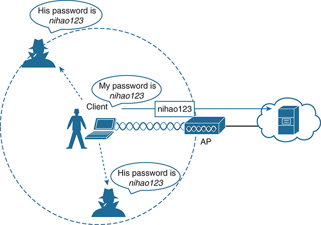
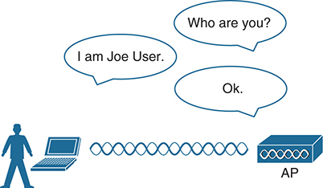
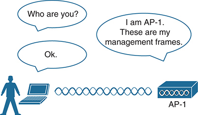
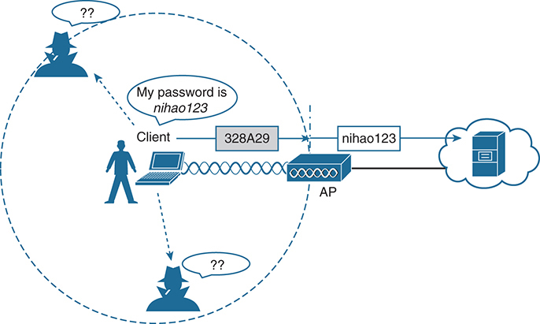
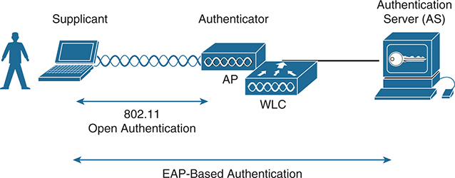

# Chapter 3

## Securing Wireless Networks

This chapter covers the following exam topics:

1.0 Network Fundamentals

1.11 Describe Wireless Principles

1.11.d Encryption

5.0 Security Fundamentals

5.9 Describe wireless security protocols (WPA, WPA2, and WPA3)

As you know by now, wireless networks are complex. Many technologies and protocols work behind the scenes to give end users a stable, yet mobile, connection to a wired network infrastructure. From the user's perspective, a wireless connection should seem no different than a wired connection. A wired connection can give users a sense of security; data traveling over a wire is probably not going to be overheard by others. A wireless connection is inherently different; data traveling over the air can be overheard by anyone within range.

Therefore, securing a wireless network becomes just as important as any other aspect. A comprehensive approach to wireless security focuses on the following areas:

* Identifying the endpoints of a wireless connection
* Identifying the end user
* Protecting the wireless data from eavesdroppers
* Protecting the wireless data from tampering

The identification process is performed through various authentication schemes. Protecting wireless data involves security functions like encryption and frame authentication.

This chapter covers many of the methods you can use to secure a wireless network. Be warned: wireless security can be a confusing topic because it is filled with many acronyms. Some of the acronyms rhyme like words from a children's book. In fact, this chapter is a story about WEP, PSK, TKIP, MIC, AES, EAP, EAP-FAST, EAP-TLS, LEAP, PEAP, WPA, WPA2, WPA3, CCMP, GCMP, and on and on it goes. When you finish with this chapter, though, you will come away with a clearer view of what these terms mean and how they all fit together. You might even be ready to configure a wireless LAN with effective security.

### "Do I Know This Already?" Quiz

Take the quiz (either here or use the PTP software) if you want to use the score to help you decide how much time to spend on this chapter. The letter answers are listed at the bottom of the page following the quiz. [Appendix C](vol2_appc.xhtml#appc), found both at the end of the book as well as on the companion website, includes both the answers and explanations. You can also find both answers and explanations in the PTP testing software.

**Table 3-1** "Do I Know This Already?" Foundation Topics Section-to-Question Mapping

| Foundation Topics Section | Questions |
| --- | --- |
| Anatomy of a Secure Connection | 1, 2 |
| Wireless Client Authentication Methods | 3, 4 |
| Wireless Privacy and Integrity Methods | 5, 6 |
| WPA, WPA2, and WPA3 | 7, 8 |

**[1](vol2_ch03.xhtml#ques3_1a).** Which of the following are necessary components of a secure wireless connection? (Choose all that apply.)

1. Encryption
2. MIC
3. Authentication
4. All of these answers are correct.

**[2](vol2_ch03.xhtml#ques3_2a).** Which one of the following is used to protect the integrity of data in a wireless frame?

1. WIPS
2. WEP
3. MIC
4. EAP

**[3](vol2_ch03.xhtml#ques3_3a).** Which one of the following is a wireless encryption method that has been found to be vulnerable and is not recommended for use?

1. AES
2. WPA
3. EAP
4. WEP

**[4](vol2_ch03.xhtml#ques3_4a).** Which one of the following is used as the authentication framework when 802.1x is used on a WLAN?

1. Open authentication
2. WEP
3. EAP
4. WPA

**[5](vol2_ch03.xhtml#ques3_5a).** Suppose you would like to select a method to protect the privacy and integrity of wireless data. Which one of the following methods should you avoid because it has been deprecated ?

1. TKIP
2. CCMP
3. GCMP
4. EAP

**[6](vol2_ch03.xhtml#ques3_6a).** Which one of the following is the data encryption and integrity method used by WPA2?

1. WEP
2. TKIP
3. CCMP
4. WPA

**[7](vol2_ch03.xhtml#ques3_7a).** The Wi-Fi Alliance offers which of the following certifications for wireless devices that correctly implement security standards? (Choose all that apply.)

1. WEP
2. WPA2
3. 802.11
4. AES

**[8](vol2_ch03.xhtml#ques3_8a).** A pre-shared key is used in which of the following wireless security configurations? (Choose all that apply.)

1. WPA2 personal mode
2. WPA2 enterprise mode
3. WPA3 personal mode
4. WPA3 enterprise mode

Answers to the "Do I Know This Already?" quiz:

**[1](vol2_appc.xhtml#ques3_1)** D

**[2](vol2_appc.xhtml#ques3_2)** C

**[3](vol2_appc.xhtml#ques3_3)** D

**[4](vol2_appc.xhtml#ques3_4)** C

**[5](vol2_appc.xhtml#ques3_5)** A

**[6](vol2_appc.xhtml#ques3_6)** C

**[7](vol2_appc.xhtml#ques3_7)** B

**[8](vol2_appc.xhtml#ques3_8)** A, C

### Foundation Topics

### Anatomy of a Secure Connection

In the previous chapters of this book, you learned about wireless clients forming associations with wireless access points (APs) and passing data back and forth across the air.

As long as all clients and APs conform to the 802.11 standard, they can all coexist—even on the same channel. Not every 802.11 device is friendly and trustworthy, however. Sometimes it is easy to forget that transmitted frames do not just go directly from the sender to the receiver, as in a wired or switched connection. Instead, they travel according to the transmitter's antenna pattern, potentially reaching any receiver that is within range.

Consider the scenario in [Figure 3-1](vol2_ch03.xhtml#ch03fig01). The wireless client opens a session with some remote entity and shares a confidential password. Because two untrusted users are also located within range of the client's signal, they may also learn the password by capturing frames that have been sent on the channel. The convenience of wireless communication also makes it easy for transmissions to be overheard and exploited by malicious users.

If data is sent through open space, how can it be secured so that it stays private and intact? The 802.11 standard offers a framework of wireless security mechanisms that can be used to add trust, privacy, and integrity to a wireless network. The following sections give an overview of the wireless security framework.

The diagram includes the following elements: Client: A user with a laptop, connected to an Access Point (A P) via a wireless connection. A P: The Access Point, connected to a server in the cloud, facilitates the wireless communication. Unintended Recipients: Two malicious entities, depicted as silhouettes with hats, positioned to intercept the wireless communication. The communication between the client and the A P involves the transmission of a password, shown as nihao 1 2 3. The client is seen saying, My password is nihao 1 2 3, while the A P transmits the same password to the server. The two malicious entities are positioned within the wireless range and are intercepting the password, each saying, His password is nihao 1 2 3.

**Figure 3-1** *Wireless Transmissions Reaching Unintended Recipients*

#### Authentication

To use a wireless network, clients must first discover a basic service set (BSS) and then request permission to associate with it. Clients should be authenticated by some means before they can become functioning members of the wireless LAN. Why?

Suppose that your wireless network connects to corporate resources where confidential information can be accessed. In that case, only devices known to be trusted and expected should be given access. Guest users, if they are permitted at all, should be allowed to join a different guest WLAN where they can access nonconfidential or public resources. Rogue clients, which are not expected or welcomed, should not be permitted to associate at all. After all, they are not affiliated with the corporate network and are likely to be unknown devices that happen to be within range of your network.

To control access, wireless networks can authenticate the client devices before they are allowed to associate. Potential clients must identify themselves by presenting some form of credentials to the APs. [Figure 3-2](vol2_ch03.xhtml#ch03fig02) shows the basic client authentication process.

On the left, there is an icon of a person standing next to a laptop, representing a user. The laptop is connected wirelessly, depicted by a series of wavy lines, to an access point (A P) on the right. Above the laptop and access point, three speech bubbles are shown to represent the exchange of authentication messages. The first speech bubble, originating from the access point, asks, Who are you? The second speech bubble, coming from the user, responds, I am Joe User. The third speech bubble, from the access point, simply states, Ok.

**Figure 3-2** *Authenticating a Wireless Client*

Wireless authentication can take many forms. Some methods require only a static text string that is common across all trusted clients and APs. The text string is stored on the client device and presented directly to the AP when needed. What might happen if the device was stolen or lost? Most likely, any user who possessed the device could still authenticate to the network. Other more stringent authentication methods require interaction with a corporate user database. In those cases, the end user must enter a valid username and password—something that would not be known to a thief or an imposter.

If you have ever joined a wireless network, you might have focused on authenticating your device or yourself, while implicitly trusting the nearest AP. For example, if you turn on your wireless device and find a wireless network that is available at your workplace, you probably join it without hesitating. The same is true for wireless networks in an airport, a hotel, a hot spot, or in your home—you expect the AP that is advertising the SSID to be owned and operated by the entity where you are located. But how can you be sure?

Normally, the only piece of information you have is the SSID being broadcast or advertised by an AP. If the SSID looks familiar, you will likely choose to join it. Perhaps your computer is configured to automatically connect to a known SSID so that it associates without your intervention. Either way, you might unwittingly join the same SSID even if it was being advertised by an imposter.

Some common attacks focus on a malicious user pretending to be an AP. The fake AP can send beacons, answer probes, and associate clients just like the real AP it is impersonating. Once a client associates with the fake AP, the attacker can easily intercept all communication to and from the client from its central position. A fake AP could also send spoofed management frames to disassociate or deauthenticate legitimate and active clients, just to disrupt normal network operation.

To prevent this type of man-in-the-middle attack, the client should authenticate the AP before the client itself is authenticated. [Figure 3-3](vol2_ch03.xhtml#ch03fig03) shows a simple scenario. Even further, any management frames received by a client should be authenticated too, as proof that they were sent by a legitimate and expected AP.

On the left, there is an icon of a person standing next to a laptop, representing a user. The laptop is connected wirelessly, depicted by a series of wavy lines, to an access point on the right, labeled A P dash 1. Above the laptop and access point, three speech bubbles are shown to represent the exchange of authentication messages. The first speech bubble, originating from the laptop, asks, Who are you? The second speech bubble, coming from the access point, responds, I am A P dash 1. These are my management frames. The third speech bubble, from the laptop, simply states, Ok.

**Figure 3-3** *Authenticating a Wireless AP*

#### Message Privacy

Suppose that the client in [Figure 3-3](vol2_ch03.xhtml#ch03fig03) must authenticate before joining the wireless network. It might also authenticate the AP and its management frames after it associates but before it is itself authenticated. The client's relationship with the AP might become much more trusted, but data passing to and from the client is still available to eavesdroppers on the same channel.

To protect data privacy on a wireless network, the data should be encrypted for its journey through free space. This task is accomplished by encrypting the data payload in each wireless frame just prior to being transmitted, then decrypting it as it is received. The idea is to use an encryption method that the transmitter and receiver share, so the data can be encrypted and decrypted successfully by them and nobody else.

In wireless networks, each WLAN may support only one authentication and encryption scheme, so all clients must use the same encryption method when they associate. You might think that having one encryption method in common would allow every client to eavesdrop on every other client. That is not necessarily the case because the AP should securely negotiate a unique encryption key to use for each associated client.

Ideally, the AP and a client are the only two devices that have the encryption keys in common so that they can understand each other's data. No other device should know about or be able to use the same keys to eavesdrop and decrypt the data. In [Figure 3-4](vol2_ch03.xhtml#ch03fig04), the client's confidential password information has been encrypted before being transmitted. The AP can decrypt it successfully before forwarding it onto the wired network, but other wireless devices and users cannot.

A client device is shown attempting to connect to an Access Point, A P, with the message My password is nihao123. The A P is connected to a server through a network depicted as a cloud. The client device sends an encrypted message 328 A 29 to the A P. The A P decrypts this message back to nihao123 and forwards it to the server. Two malicious entities are depicted as trying to intercept the communication but are shown with question mark, question mark to indicate that they cannot understand the encrypted data.

**Figure 3-4** *Encrypting Wireless Data to Protect Data Privacy*

The AP also maintains a "group key" that it uses when it needs to send encrypted data to all clients in its cell at one time. Each of the associated clients uses the same group key to decrypt the data.

#### Message Integrity

Encrypting data obscures it from view while it is traveling over a public or untrusted network. The intended recipient should be able to decrypt the message and recover the original contents, but what if someone managed to alter the contents along the way? The recipient would have a very difficult time discovering that the original data had been modified.

A [message integrity check (MIC)](vol2_ch03.xhtml#key_053a) is a security tool that can protect against data tampering. You can think of a MIC as a way for the sender to add a secret stamp inside the encrypted data frame. The stamp is based on the contents of the data bits to be transmitted. After the recipient decrypts the frame, it can compare the secret stamp to its own idea of what the stamp should be, based on the data bits that were received. If the two stamps are identical, the recipient can safely assume that the data has not been tampered with. [Figure 3-5](vol2_ch03.xhtml#ch03fig05) shows the MIC process.

Original Data: The client begins with the original data, which in this example is nihao123. Compute M I C: The client computes the Message Integrity Check, M I C, for the data nihao123, resulting in a M I C value of f7. Encrypt Data plus M I C: The original data nihao123 and the M I C f7 are then encrypted together. The encrypted data along with its M I C is transmitted over the wireless network. Decrypt: Upon receiving the encrypted data, the access point, A P, decrypts it to retrieve the original data nihao123 and the M I C f7. Compute M I C: The access point then computes the M I C for the decrypted data nihao123, which should yield f7 if the data is intact and untampered. Compare M I Cs: The access point compares the received M I C f7 with the computed M I C f7. Match Indicator: If the M I Cs match, the data integrity is confirmed, as indicated by a checkmark and the matching M I C values f7 next to each other. Visual Elements. Client: Represented by a person with a laptop, indicating the source of the original data. Wireless Transmission: Illustrated by a wavy line with a label 741 fcb 649 01 d representing the encrypted data being sent over the wireless network. Access Point, A P: Depicted as a network device receiving and processing the data.

**Figure 3-5** *Checking Message Integrity over a Wireless Network*

### Wireless Client Authentication Methods

You can use many different methods to authenticate wireless clients as they try to associate with the network. The methods have been introduced over time and have evolved as security weaknesses have been exposed and wireless hardware has advanced. This section covers the most common authentication methods you might encounter.

#### Open Authentication

The original 802.11 standard offered only two choices to authenticate a client: open authentication and WEP.

[Open authentication](vol2_gloss.xhtml#gloss_046) is true to its name; it offers open access to a WLAN. The only requirement is that a client must use an 802.11 authentication request before it attempts to associate with an AP. No other credentials are needed.

When would you want to use open authentication? After all, it does not sound very secure because it is not. With no challenge, any 802.11 client may authenticate to access the network. That is, in fact, the whole purpose of open authentication—to validate that a client is a valid 802.11 device by authenticating the wireless hardware and the protocol. Authenticating the user's identity is handled as a true security process through other means.

You have probably seen a WLAN with open authentication when you have visited a public location. If any client screening is used at all, it comes in the form of web authentication. A client can associate right away but must open a web browser to see and accept the terms for use and enter basic credentials. From that point, network access is opened up for the client. Most client operating systems flag such networks to warn you that your wireless data will not be secured in any way if you join.

#### WEP

As you might expect, open authentication offers nothing that can obscure or encrypt the data being sent between a client and an AP. As an alternative, the 802.11 standard has traditionally defined [Wired Equivalent Privacy (WEP)](vol2_ch03.xhtml#key_065a) as a method to make a wireless link more like or equivalent to a wired connection.

WEP uses the RC4 cipher algorithm to make every wireless data frame private and hidden from eavesdroppers. The same algorithm encrypts data at the sender and decrypts it at the receiver. The algorithm uses a string of bits as a key, commonly called a WEP key, to derive other encryption keys—one per wireless frame. As long as the sender and receiver have an identical key, one can decrypt what the other encrypts.

WEP is known as a shared-key security method. The same key must be shared between the sender and receiver ahead of time so that each can derive other mutually agreeable encryption keys. In fact, every potential client and AP must share the same key ahead of time so that any client can associate with the AP.

The WEP key can also be used as an optional authentication method as well as an encryption tool. Unless a client can use the correct WEP key, it cannot associate with an AP. The AP tests the client's knowledge of the WEP key by sending it a random challenge phrase. The client encrypts the challenge phrase with WEP and returns the result to the AP. The AP can compare the client's encryption with its own to see whether the two WEP keys yield identical results.

WEP keys can be either 40 or 104 bits long, represented by a string of 10 or 26 hex digits. As a rule of thumb, longer keys offer more unique bits for the algorithm, resulting in more robust encryption. Except in WEP's case, that is. Because WEP was defined in the original 802.11 standard in 1999, every wireless adapter was built with encryption hardware specific to WEP. In 2001, a number of weaknesses were discovered and revealed, so work began to find better wireless security methods. By 2004, the 802.11i amendment was ratified, and WEP was officially deprecated. Both WEP encryption and WEP shared-key authentication are widely considered to be weak methods to secure a wireless LAN.

#### 802.1x/EAP

With only open authentication and WEP available in the original 802.11 standard, a more secure authentication method was needed. Client authentication generally involves some sort of challenge, a response, and then a decision to grant access. Behind the scenes, it can also involve an exchange of session or encryption keys, in addition to other parameters needed for client access. Each authentication method might have unique requirements as a unique way to pass information between the client and the AP.

Rather than build additional authentication methods into the 802.11 standard, a more flexible and scalable authentication framework, the [Extensible Authentication Protocol (EAP)](vol2_ch03.xhtml#key_049a), was chosen. As its name implies, EAP is extensible and does not consist of any one authentication method. Instead, EAP defines a set of common functions that actual authentication methods can use to authenticate users. As you read through this section, notice how many authentication methods have EAP in their names. Each method is unique and different, but each one follows the EAP framework.

EAP has another interesting quality: it can integrate with the IEEE [802.1x](vol2_ch03.xhtml#key_041a) port-based access control standard. When 802.1x is enabled, it limits access to network media until a client authenticates. This means that a wireless client might be able to associate with an AP but will not be able to pass data to any other part of the network until it successfully authenticates.

With open and WEP authentication, wireless clients are authenticated locally at the AP without further intervention. The scenario changes with 802.1x; the client uses open authentication to associate with the AP, and then the actual client authentication process occurs at a dedicated authentication server. [Figure 3-6](vol2_ch03.xhtml#ch03fig06) shows the three-party 802.1x arrangement that consists of the following entities:

* [Supplicant](vol2_ch03.xhtml#key_062a)**:** The client device that is requesting access
* [Authenticator](vol2_gloss.xhtml#gloss_046)**:** The network device that provides access to the network (usually a wireless LAN controller [WLC])
* [Authentication server (AS)](vol2_gloss.xhtml#gloss_047)**:** The device that takes user or client credentials and permits or denies network access based on a user database and policies (usually a [RADIUS server](vol2_gloss.xhtml#gloss_278))

The diagram depicts the interaction between a supplicant, authenticator, and authentication server, A S, within a wireless network. Supplicant: Represented by a person using a laptop, the supplicant is the client device seeking network access. The laptop is shown initiating the authentication process through 8 0 2 dot 1 1 open authentication to establish a connection with the network. Authenticator: The authenticator, depicted as an access point, A P, and a Wireless L A N Controller, W L C, is responsible for facilitating the authentication process. The A P receives the authentication request from the supplicant and communicates with the W L C to process the request. Authentication Server, A S: The authentication server, shown as a computer with a key symbol, is responsible for validating the supplicant's credentials. The A S performs the actual authentication using Extensible Authentication Protocol, E A P, based methods. The diagram includes arrows to indicate the direction of communication and the flow of the authentication process: 8 0 2 dot 1 1 Open Authentication: This bidirectional arrow represents the initial connection establishment between the supplicant and the authenticator. E A P-Based Authentication: This bidirectional arrow shows the exchange of authentication messages between the supplicant, authenticator, and the authentication server.

**Figure 3-6** *802.1x Client Authentication Roles*

The wireless LAN controller becomes a middleman in the client authentication process, controlling user access with 802.1x and communicating with the authentication server using the EAP framework.

The following sections provide an overview of several common EAP-based authentication methods. The goal here is to become aware of the many methods without trying to memorize them all. In fact, even when you configure user authentication on a wireless LAN, you will not have to select a specific method. Instead, you select "802.1x" on the WLC so that it is ready to handle a variety of EAP methods. It is then up to the client and the authentication server to use a compatible method. You will learn more about configuring security on a wireless LAN in [Chapter 4](vol2_ch04.xhtml#ch04), "[Building a Wireless LAN](vol2_ch04.xhtml#ch04)."

##### LEAP

As an early attempt to address the weaknesses in WEP, Cisco developed a proprietary wireless authentication method called [Lightweight EAP (LEAP)](vol2_ch03.xhtml#key_052a). To authenticate, the client must supply username and password credentials. Both the authentication server and the client exchange challenge messages that are then encrypted and returned. This process provides mutual authentication; as long as the messages can be decrypted successfully, the client and the AS have essentially authenticated each other.

At the time, WEP-based hardware was still widely used. Therefore, LEAP attempted to overcome WEP weaknesses by using dynamic WEP keys that changed frequently. Nevertheless, the method used to encrypt the challenge messages was found to be vulnerable, so LEAP has since been deprecated. Even though wireless clients and controllers still offer LEAP, you should not use it.

##### EAP-FAST

Cisco developed a more secure method called [EAP Flexible Authentication by Secure Tunneling (EAP-FAST)](vol2_ch03.xhtml#key_046a). Authentication credentials are protected by passing a [protected access credential (PAC)](vol2_ch03.xhtml#key_056a) between the AS and the supplicant. The PAC is a form of shared secret that is generated by the AS and used for mutual authentication. EAP-FAST is a sequence of three phases:

* **Phase 0:** The PAC is generated or provisioned and installed on the client.
* **Phase 1:** After the supplicant and AS have authenticated each other, they negotiate a Transport Layer Security (TLS) tunnel.
* **Phase 2:** The end user can then be authenticated through the TLS tunnel for additional security.

Notice that two separate authentication processes occur in EAP-FAST: one between the AS and the supplicant and another with the end user. These occur in a nested fashion, as an outer authentication (outside the TLS tunnel) and an inner authentication (inside the TLS tunnel).

As with other EAP-based methods, a RADIUS server is required. However, the RADIUS server must also operate as an EAP-FAST server to be able to generate PACs, one per user.

##### PEAP

Like EAP-FAST, the [Protected EAP (PEAP)](vol2_ch03.xhtml#key_057a) method uses an inner and outer authentication; however, the AS presents a digital certificate to authenticate itself with the supplicant in the outer authentication. If the supplicant is satisfied with the identity of the AS, the two will build a TLS tunnel to be used for the inner client authentication and encryption key exchange.

The digital certificate of the AS consists of data in a standard format that identifies the owner and is "signed" or validated by a third party. The third party is known as a [certificate authority (CA)](vol2_ch03.xhtml#key_044a) and is known and trusted by both the AS and the supplicants. The supplicant must also possess the CA certificate just so that it can validate the one it receives from the AS. The certificate is also used to pass a public key, in plain view, which can be used to help decrypt messages from the AS.

Notice that only the AS has a certificate for PEAP. That means the supplicant can readily authenticate the AS. The client does not have or use a certificate of its own, so it must be authenticated within the TLS tunnel using one of the following two methods:

* **MSCHAPv2:** Microsoft Challenge Authentication Protocol version 2
* **GTC:** Generic Token Card; a hardware device that generates one-time passwords for the user or a manually generated password

##### EAP-TLS

PEAP leverages a digital certificate on the AS as a robust method to authenticate the RADIUS server. It is easy to obtain and install a certificate on a single server, but the clients are left to identify themselves through other means. [EAP Transport Layer Security (EAP-TLS)](vol2_gloss.xhtml#gloss_343) goes one step further by requiring certificates on the AS and on every client device.

With EAP-TLS, the AS and the supplicant exchange certificates and can authenticate each other. A TLS tunnel is built afterward so that encryption key material can be securely exchanged.

EAP-TLS is considered to be the most secure wireless authentication method available; however, implementing it can sometimes be complex. Along with the AS, each wireless client must obtain and install a certificate. Manually installing certificates on hundreds or thousands of clients can be impractical. Instead, you would need to implement a [Public Key Infrastructure (PKI)](vol2_ch03.xhtml#key_059a) that could supply certificates securely and efficiently and revoke them when a client or user should no longer have access to the network. This usually involves setting up your own CA or building a trust relationship with a third-party CA that can supply certificates to your clients.

Note

EAP-TLS is practical only if the wireless clients can accept and use digital certificates. Many wireless devices, such as communicators, medical devices, and RFID tags, have an underlying operating system that cannot interface with a CA or use certificates.

### Wireless Privacy and Integrity Methods

The original 802.11 standard supported only one method to secure wireless data from eavesdroppers: WEP. As you have learned in this chapter, WEP has been compromised, deprecated, and can no longer be recommended. What other options are available to encrypt data and protect its integrity as it travels through free space?

#### TKIP

During the time when WEP was embedded in wireless client and AP hardware, yet was known to be vulnerable, the [Temporal Key Integrity Protocol (TKIP)](vol2_ch03.xhtml#key_063a) was developed.

TKIP adds the following security features using legacy hardware and the underlying WEP encryption:

* **MIC:** This efficient algorithm adds a hash value to each frame as a message integrity check to prevent tampering; commonly called "Michael" as an informal reference to MIC.
* **Time stamp:** A time stamp is added into the MIC to prevent replay attacks that attempt to reuse or replay frames that have already been sent.
* **Sender's MAC address:** The MIC also includes the sender's MAC address as evidence of the frame source.
* **TKIP sequence counter:** This feature provides a record of frames sent by a unique MAC address, to prevent frames from being replayed as an attack.
* **Key mixing algorithm:** This algorithm computes a unique 128-bit WEP key for each frame.
* **Longer initialization vector (IV):** The IV size is doubled from 24 to 48 bits, making it virtually impossible to exhaust all WEP keys by brute-force calculation.

TKIP became a reasonably secure stopgap security method, buying time until the 802.11i standard could be ratified. Some attacks have been created against TKIP, so it, too, should be avoided if a better method is available. In fact, TKIP was deprecated in the 802.11-2012 standard.

#### CCMP

The [Counter/CBC-MAC Protocol (CCMP)](vol2_ch03.xhtml#key_045a) is considered to be more secure than TKIP. CCMP consists of two algorithms:

* AES counter mode encryption
* Cipher Block Chaining Message Authentication Code (CBC-MAC) used as a message integrity check (MIC)

The Advanced Encryption Standard (AES) is the current encryption algorithm adopted by the U.S. National Institute of Standards and Technology (NIST) and the U.S. government, and widely used around the world. In other words, AES is open, publicly accessible, and represents the most secure encryption method available today.

Before CCMP can be used to secure a wireless network, the client devices and APs must support the AES counter mode and CBC-MAC in hardware. CCMP cannot be used on legacy devices that support only WEP or TKIP. How can you know if a device supports CCMP? Look for the WPA2 designation, which is described in the following section.

#### GCMP

The [Galois/Counter Mode Protocol (GCMP)](vol2_ch03.xhtml#key_051a) is a robust authenticated encryption suite that is more secure and more efficient than CCMP. GCMP consists of two algorithms:

* AES counter mode encryption
* Galois Message Authentication Code (GMAC) used as a message integrity check (MIC)

GCMP is used in WPA3, which is described in the following section.

### WPA, WPA2, and WPA3

This chapter covers a variety of authentication methods and encryption and message integrity algorithms. When it comes time to configure a WLAN with wireless security, should you try to select some combination of schemes based on which one is best or which one is not deprecated? Which authentication methods are compatible with which encryption algorithms?

The Wi-Fi Alliance (<http://wi-fi.org>), a nonprofit wireless industry association, has worked out straightforward ways to do that through its [Wi-Fi Protected Access (WPA)](vol2_ch03.xhtml#key_064a) industry certifications. To date, there are three different versions: WPA, WPA2, and WPA3. Wireless products are tested in authorized testing labs against stringent criteria that represent correct implementation of a standard. As long as the Wi-Fi Alliance has certified a wireless client device and an AP and its associated WLC for the same WPA version, they should be compatible and offer the same security components.

The Wi-Fi Alliance introduced its first generation WPA certification (known simply as WPA and not WPA1) while the IEEE 802.11i amendment for best practice security methods was still being developed. WPA was based on parts of 802.11i and included 802.1x authentication, TKIP, and a method for dynamic encryption key management.

After 802.11i was ratified and published, the Wi-Fi Alliance included it in full in its [WPA Version 2 (WPA2)](vol2_ch03.xhtml#key_066a) certification. WPA2 is based around the superior AES CCMP algorithms, rather than the deprecated TKIP from WPA. It should be obvious that WPA2 was meant as a replacement for WPA.

In 2018, the Wi-Fi Alliance introduced [WPA Version 3 (WPA3)](vol2_ch03.xhtml#key_067a) as a future replacement for WPA2, adding several important and superior security mechanisms. WPA3 leverages stronger encryption by AES with the Galois/Counter Mode Protocol (GCMP). It also uses [Protected Management Frames (PMF)](vol2_ch03.xhtml#key_058a) to secure important 802.11 management frames between APs and clients, to prevent malicious activity that might spoof or tamper with a BSS's operation.

[Table 3-2](vol2_ch03.xhtml#ch03tab02) summarizes the basic differences between WPA, WPA2, and WPA3. Each successive version is meant to replace prior versions by offering better security features. You should use WPA3 if it is widely available on all the wireless client devices, APs, and WLCs in your network; otherwise, use WPA2 and avoid WPA.

**Table 3-2** Comparing WPA, WPA2, and WPA3

| Authentication and Encryption Feature Support | WPA | WPA2 | WPA3[\*](vol2_ch03.xhtml#tfn3_2_1a) |
| --- | --- | --- | --- |
| Authentication with **pre-shared keys**? | Yes | Yes | Yes |
| Authentication with **802.1x**? | Yes | Yes | Yes |
| Encryption and MIC with **TKIP**? | Yes | No | No |
| Encryption and MIC with **AES and CCMP**? | Yes | Yes | No |
| Encryption and MIC with **AES and GCMP**? | No | No | Yes |

[\*](vol2_ch03.xhtml#tfn3_2_1) WPA3 includes other features beyond WPA and WPA2, such as Simultaneous Authentication of Equals (SAE), forward secrecy, and Protected Management Frames (PMF).

Notice that all three WPA versions support two client authentication modes: a pre-shared key (PSK) or 802.1x, based on the scale of the deployment. These are also known as [personal mode](vol2_ch03.xhtml#key_055a) and [enterprise mode](vol2_ch03.xhtml#key_048a), respectively.

With personal mode, a key string must be shared or configured on every client and AP before the clients can connect to the wireless network. The pre-shared key is normally kept confidential so that unauthorized users have no knowledge of it. The key string is never sent over the air. Instead, clients and APs work through a four-way handshake procedure that uses the pre-shared key string to construct and exchange encryption key material that can be openly exchanged. When that process is successful, the AP can authenticate the client, and the two can secure data frames that are sent over the air.

With WPA-Personal and WPA2-Personal modes, a malicious user can eavesdrop and capture the four-way handshake between a client and an AP. That user can then use a dictionary attack to automate guessing the pre-shared key. If successful, that user can then decrypt the wireless data or even join the network posing as a legitimate user.

WPA3-Personal avoids such an attack by strengthening the key exchange between clients and APs through a method known as [Simultaneous Authentication of Equals (SAE)](vol2_ch03.xhtml#key_061a). Rather than a client authenticating against a server or AP, the client and AP can initiate the authentication process equally and even simultaneously.

Even if a password or key is compromised, WPA3-Personal offers [forward secrecy](vol2_ch03.xhtml#key_050a), which prevents attackers from being able to use a key to unencrypt data that has already been transmitted over the air.

Tip

The Personal mode of any WPA version is usually easy to deploy in a small environment or with clients that are embedded in certain devices because a simple text key string is all that is needed to authenticate the clients. Be aware that every device using the WLAN must be configured with an identical pre-shared key. If you ever need to update or change the key, you must touch every device to do so. As well, the pre-shared key should remain a well-kept secret; you should never divulge the pre-shared key to any unauthorized person.

Notice from [Table 3-2](vol2_ch03.xhtml#ch03tab02) that WPA, WPA2, and WPA3 also support 802.1x or enterprise authentication. This support implies EAP-based authentication, but the WPA versions do not require any specific EAP method. Instead, the Wi-Fi Alliance certifies interoperability with well-known EAP methods like EAP-TLS, PEAP, EAP-TTLS, and EAP-SIM. Enterprise authentication is more complex to deploy than personal mode because authentication servers must be set up and configured as a critical enterprise resource.

Tip

The Wi-Fi Alliance has made wireless security configuration straightforward and consistent through its WPA, WPA2, and WPA3 certifications. Each version is meant to replace its predecessors because of improved security mechanisms. You should always select the highest WPA version that the clients and wireless infrastructure in your environment will support.

### Chapter Review

At this point in the chapter, you might still be a little overwhelmed with the number of acronyms and security terms to learn and keep straight in your mind. Spend some time reviewing [Table 3-3](vol2_ch03.xhtml#ch03tab03), which lists all of the topics described in this chapter. The table is organized in a way that should help you remember how the acronyms and functions are grouped together. Remember that an effective wireless security strategy includes a method to authenticate clients and a method to provide data privacy and integrity. These two types of methods are listed in the leftmost column. Work your way to the right to remember what types of authentication and privacy/integrity are available. The table also expands the name of each acronym as a memory tool.

Also remember that WPA, WPA2, and WPA3 simplify wireless network configuration and compatibility because they limit which authentication and privacy/integrity methods can be used.

**Table 3-3** Review of Wireless Security Mechanisms and Options

| Security Mechanism | Type |  | Type Expansion | Credentials Used |
| --- | --- | --- | --- | --- |
| Authentication Methods | Open | | Open Authentication | None, other than 802.11 protocol |
| WEP | | Wired Equivalent Privacy | Static WEP keys |
| 802.1x/EAP  (Extensible Authentication Protocol) | LEAP | Lightweight EAP | Deprecated; uses dynamic WEP keys |
| EAP-FAST | EAP Flexible Authentication by Secure Tunneling | Uses protected access credential (PAC) |
| PEAP | Protected EAP | AS authenticated by digital certificate |
| EAP-TLS | EAP Transport Layer Security | Client and AS authenticated by digital certificate |
| Privacy & Integrity Methods | TKIP | | Temporal Key Integrity Protocol | N/A |
| CCMP | | Counter/CBC-MAC Protocol | N/A |
| GCMP | | Galois/Counter Mode Protocol | N/A |

You should also review this chapter's material using either the tools in the book or the interactive tools for the same material found on the book's companion website. [Table 3-4](vol2_ch03.xhtml#ch03tab04) outlines the key review elements and where you can find them. To better track your study progress, record when you completed these activities in the second column.

**Table 3-4** Chapter Review Tracking

| Review Element | Review Date(s) | Resource Used |
| --- | --- | --- |
| Review key topics |  | Book, website |
| Review key terms |  | Book, website |
| Answer DIKTA questions |  | Book, PTP |
| Review memory tables |  | Website |

### Review All the Key Topics

Review the most important topics in this chapter, noted with the Key Topic icon in the outer margin of the page. [Table 3-5](vol2_ch03.xhtml#ch03tab05) lists a reference of these key topics and the page numbers on which each is found.

**Table 3-5** Key Topics for [Chapter 3](vol2_ch03.xhtml#ch03)

| Key Topic Element | Description | Page Number |
| --- | --- | --- |
| List | 802.1x entities | [48](vol2_ch03.xhtml#page_48) |
| [Table 3-2](vol2_ch03.xhtml#ch03tab02) | WPA, WPA2, and WPA3 comparison | [52](vol2_ch03.xhtml#page_52) |
| [Table 3-3](vol2_ch03.xhtml#ch03tab03) | Wireless security mechanism review | [54](vol2_ch03.xhtml#page_54) |

### Key Terms You Should Know

[802.1x](vol2_ch03.xhtml#key_041)

[authentication server (AS)](vol2_ch03.xhtml#key_042)

[authenticator](vol2_ch03.xhtml#key_043)

[certificate authority (CA)](vol2_ch03.xhtml#key_044)

[Counter/CBC-MAC Protocol (CCMP)](vol2_ch03.xhtml#key_045)

[EAP Flexible Authentication by Secure Tunneling (EAP-FAST)](vol2_ch03.xhtml#key_046)

[EAP Transport Layer Security (EAP-TLS)](vol2_ch03.xhtml#key_047)

[enterprise mode](vol2_ch03.xhtml#key_048)

[Extensible Authentication Protocol (EAP)](vol2_ch03.xhtml#key_049)

[forward secrecy](vol2_ch03.xhtml#key_050)

[Galois/Counter Mode Protocol (GCMP)](vol2_ch03.xhtml#key_051)

[Lightweight EAP (LEAP)](vol2_ch03.xhtml#key_052)

[message integrity check (MIC)](vol2_ch03.xhtml#key_053)

[open authentication](vol2_ch03.xhtml#key_054)

[personal mode](vol2_ch03.xhtml#key_055)

[protected access credential (PAC)](vol2_ch03.xhtml#key_056)

[Protected EAP (PEAP)](vol2_ch03.xhtml#key_057)

[Protected Management Frame (PMF)](vol2_ch03.xhtml#key_058)

[Public Key Infrastructure (PKI)](vol2_ch03.xhtml#key_059)

[RADIUS server](vol2_ch03.xhtml#key_060)

[Simultaneous Authentication of Equals (SAE)](vol2_ch03.xhtml#key_061)

[supplicant](vol2_ch03.xhtml#key_062)

[Temporal Key Integrity Protocol (TKIP)](vol2_ch03.xhtml#key_063)

[Wi-Fi Protected Access (WPA)](vol2_ch03.xhtml#key_064)

[Wired Equivalent Privacy (WEP)](vol2_ch03.xhtml#key_065)

[WPA Version 2 (WPA2)](vol2_ch03.xhtml#key_066)

[WPA Version 3 (WPA3)](vol2_ch03.xhtml#key_067)