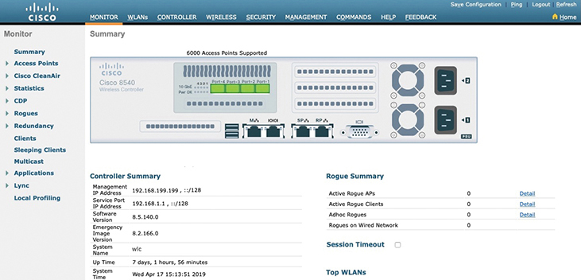

# Chapter 4

## Building a Wireless LAN

This chapter covers the following exam topics:

1.0 Network Fundamentals

1.1 Explain the role and function of network components

1.1.e Controllers

2.0 Network Access

2.7 Describe physical infrastructure connections of WLAN components (AP, WLC, access/trunk ports, and LAG)

2.8 Describe network device management access (Telnet, SSH, HTTP, HTTPS, console, and TACACS+/RADIUS)

2.9 Interpret the wireless LAN GUI configuration for client connectivity, such as WLAN creation, security settings, QoS profiles, and advanced settings

5.0 Security Fundamentals

5.10 Configure and verify WLAN within the GUI using WPA2 PSK

In [Chapters 1](vol2_ch01.xhtml#ch01) through [3](vol2_ch03.xhtml#ch03), you learned about the fundamentals of wireless networks. As a CCNA, you will also need to know how to apply that knowledge toward building a functioning network with APs and a WLC.

In addition, based on the concepts you learned in [Chapter 3](vol2_ch03.xhtml#ch03), "[Securing Wireless Networks](vol2_ch03.xhtml#ch03)," you will be able to configure the WLAN to use WPA2-Personal (WPA2-PSK).

Before getting into the chapter, be aware that Cisco no longer uses the original WLC operating system, AireOS. Instead, WLCs run IOS XE. Newer WLCs with IOS XE have a CLI, as do many enterprise-class Cisco routers, but you configure WLANs from the WLC GUI. However, the AireOS and IOS XE GUIs differ, both in the GUI pages' styling and configuration elements. This chapter moves back and forth through examples of each so you can learn the ideas and compare the differences and similarities.

For the exam, exam topics 2.9 and 5.10 refer to details visible from the WLC—but they do not mention for which operating system. You should be ready for both, so we include both.

### "Do I Know This Already?" Quiz

Take the quiz (either here or use the PTP software) if you want to use the score to help you decide how much time to spend on this chapter. The letter answers are listed at the bottom of the page following the quiz. [Appendix C](vol2_appc.xhtml#appc), found both at the end of the book as well as on the companion website, includes both the answers and explanations. You can also find both answers and explanations in the PTP testing software.

**Table 4-1** "Do I Know This Already?" Foundation Topics Section-to-Question Mapping

| Foundation Topics Section | Questions |
| --- | --- |
| Connecting a Cisco AP | 1, 2 |
| Accessing a Cisco WLC | 3 |
| Connecting a Cisco WLC | 4, 5 |
| Configuring a WLAN | 6–8 |

**[1](vol2_ch04.xhtml#ques4_1a).** Suppose you need to connect a Cisco AP to a network. Which one of the following link types would be necessary?

1. Access mode link
2. Trunk mode link
3. LAG mode link
4. EtherChannel link

**[2](vol2_ch04.xhtml#ques4_2a).** An autonomous AP will be configured to support three WLANs that correspond to three VLANs. The AP will connect to the network over which one of the following?

1. Access mode link
2. Trunk mode link
3. LAG mode link
4. EtherChannel link

**[3](vol2_ch04.xhtml#ques4_3a).** Suppose you would like to connect to a WLC to configure a new WLAN on it. Which one of the following protocols can be used to access the WLC?

1. SSH
2. HTTPS
3. HTTP
4. All of these answers are correct.

**[4](vol2_ch04.xhtml#ques4_4a).** Which one of the following correctly describes the single logical link formed by bundling all of a controller's distribution system ports together?

1. PHY
2. DSP
3. LAG
4. GEC

**[5](vol2_ch04.xhtml#ques4_5a).** Which one of the following controller interfaces is used on an AireOS controller to map a WLAN to a VLAN?

1. Bridge interface
2. Virtual interface
3. WLAN interface
4. Dynamic interface

**[6](vol2_ch04.xhtml#ques4_6a).** Which of the following things are bound together when a new WLAN is created? (Choose two answers.)

1. VLAN
2. AP
3. CAPWAP tunnel
4. SSID

**[7](vol2_ch04.xhtml#ques4_7a).** What is the maximum number of WLANs you can configure on a Cisco wireless controller?

1. 8
2. 16
3. 512
4. 1024

**[8](vol2_ch04.xhtml#ques4_8a).** Which of the following parameters are necessary when creating a new WLAN on an IOS-XE controller? (Choose all that apply.)

1. WLAN profile
2. Channel number
3. Policy profile
4. BSSID
5. IP subnet

Answers to the "Do I Know This Already?" quiz:

**[1](vol2_appc.xhtml#ques4_1)** A

**[2](vol2_appc.xhtml#ques4_2)** B

**[3](vol2_appc.xhtml#ques4_3)** D

**[4](vol2_appc.xhtml#ques4_4)** C

**[5](vol2_appc.xhtml#ques4_5)** D

**[6](vol2_appc.xhtml#ques4_6)** A, D

**[7](vol2_appc.xhtml#ques4_7)** C

**[8](vol2_appc.xhtml#ques4_8)** A, C

### Foundation Topics

### Connecting a Cisco AP

A Cisco wireless network consists of APs that are coupled with one or more wireless LAN controllers. An AP's most basic function is to connect wireless devices to a wired network. Therefore, you should understand how to connect the wired side of an AP so that it can pass traffic between the appropriate WLANs and VLANs.

Recall that an autonomous AP is a standalone device; nothing else is needed to forward Ethernet frames from a wired VLAN to a wireless LAN, and vice versa. In effect, the AP maps each VLAN to a WLAN and BSS. The autonomous AP has a single wired Ethernet interface, as shown in the left portion of [Figure 4-1](vol2_ch04.xhtml#ch04fig01), which means that multiple VLANs must be brought to it over a trunk link.

Tip

A switch port providing a wired connection to an AP must be configured to support either access or trunk mode. In trunk mode, 802.1Q encapsulation tags each frame according to the VLAN number it came from. The wireless side of an AP inherently trunks 802.11 frames by marking them with the BSSID of the WLAN where they belong.

A Cisco AP also has a single wired Ethernet interface; however, it must be paired with a WLC to be fully functional. Wired VLANs that terminate at the WLC can be mapped to WLANs that emerge at the AP. Even though multiple VLANs are being extended from the WLC to the AP, they are all carried over the CAPWAP tunnel between the two. That means the AP needs only an access link to connect to the network infrastructure and terminate its end of the tunnel, as shown in the right portion of [Figure 4-1](vol2_ch04.xhtml#ch04fig01).

The diagram is divided into two sections. Left Side: Autonomous A P Connection. Switched L A N: Connected to a network switch within a Local Area Network, L A N. Trunk Link: The connection type between the switch and the Autonomous A P is labeled as a Trunk Link. Autonomous A P: An Access Point operating independently. Client: A user with a device connected to the Autonomous A P, depicted within a cone-shaped coverage area. Right Side: Cisco A P Connection. W L C, Wireless L A N Controller: The centralized controller managing multiple Cisco A Ps. Switched L A N: Connected to a network switch within a Local Area Network, L A N. Access Link: The connection type between the switch and the Cisco A P is labeled as an Access Link. C A P W A P Tunnel: Represents the Control And Provisioning of Wireless Access Points protocol used to manage the Cisco A P, indicated by a vertical dashed line labeled C A P W A P. Cisco A P: An Access Point managed by the Wireless L A N Controller. Client: A user with a device connected to the Cisco A P, depicted within a cone-shaped coverage area. This diagram highlights the different network configurations and connection types used for Autonomous A Ps and Cisco A Ps. The Autonomous A P operates independently with a trunk link connection to the switched L A N, while the Cisco A P is managed by a Wireless L A N Controller through a C A P W A P tunnel, using an access link connection to the switched L A N.

**Figure 4-1** *Comparing Connections to Autonomous and Cisco APs*

Cisco APs are normally and most efficiently managed via a browser session to the WLC; however, you can directly connect a serial console cable from your PC to the console port on the AP to monitor its bootup process or to make some basic configuration changes if needed. When the AP is operational and has an IP address, you can also use Telnet or SSH to connect to its CLI over the wired network.

### Accessing a Cisco WLC

To connect and configure a WLC, you need to open a web browser to the WLC's management address using either HTTP or HTTPS. You can do this only after the WLC has an initial configuration, a management IP address assigned to its management interface, and has built a valid SSL certificate for HTTPS use. The web-based GUI provides an effective way to monitor, configure, and troubleshoot a wireless network. You can also connect to a WLC with an SSH session, where you can use its CLI to monitor, configure, and debug activity.

Both the web-based GUI and the CLI require management users to log in. Users can be authenticated against an internal list of local usernames or against an authentication, authorization, and accounting (AAA) server, such as TACACS+ or RADIUS.

When you first open a web browser to the management address, you will see the initial login screen. Click the **Login** button, as shown in [Figure 4-2](vol2_ch04.xhtml#ch04fig02) (IOS-XE controller) and [Figure 4-3](vol2_ch04.xhtml#ch04fig03) (AireOS controller); then enter your user credentials as you are prompted for them.

The website is accessed through a web browser. The interface shows fields for username and password, options for language selection (English and Japanese), and a Log In button. The background features a city skyline at night.

**Figure 4-2** *Accessing an IOS-XE WLC with a Web Browser*

The website is accessed through a web browser. The interface shows a welcome message and a green Login button. The Cisco logo is displayed at the top. At the bottom, there is a copyright notice from 2005-2019 stating that Cisco, the Cisco logo, and Cisco Systems are registered trademarks or trademarks of Cisco Systems, Inc. and/or its affiliates in the United States and certain other countries. All third-party trademarks are the property of their respective owners.

**Figure 4-3** *Accessing an AireOS WLC with a Web Browser*

Note

The CCNA exam objectives focus on using the WLC GUI to configure a WLAN and a security suite. Therefore, the examples in this section assume that someone has already entered an initial configuration to give the WLC a working IP address for management.

When you are successfully logged in, the WLC will display a monitoring dashboard similar to the one shown in [Figure 4-4](vol2_ch04.xhtml#ch04fig04) (IOS-XE) and [Figure 4-5](vol2_ch04.xhtml#ch04fig05) (AireOS). You will not be able to make any configuration changes there, so you must select **Configuration** in the left column (IOS-XE) or click on the **Advanced** link in the upper-right corner (AireOS).

The header section features the Cisco logo with the text Cisco Wireless Controller beside it, a greeting message Welcome admin, and a search bar labeled Search any A P Is and Clicks. Various icons for notifications, settings, help, and user feedback options are in the top right corner. The left sidebar contains a vertical menu with options including Dashboard, Monitoring, Configuration (highlighted with a red circle), Administration, Licensing, and Troubleshooting. In the main dashboard area, the top section is divided into several rectangular sections displaying various metrics and statuses: Network (showing two network icons), Wireless LANs (indicating one active Wireless Local Area Network), Access Points (with one access point labeled as Not Joined), Clients (with metrics such as Active: 0, Excluded: 0, Sleeping: 0), Rogues (showing Ad H o c: 0, Self: 0), and Interference (with 0 indicators for 2.4 G H z and 5 G H z frequencies). The overview section includes a radio panel containing two circular gauges labeled Up and Down for 5 GHz and 2.4 G H z frequencies, both showing the number 1 indicating active radios. The Top Access Points panel currently displays a message No Top A Ps data available. The primary action highlighted in the image is selecting the Configuration option in the left sidebar to access the I O S-X E W L C configuration menus.

**Figure 4-4** *Accessing the IOS-XE WLC Configuration Menus*

At the top of the image, the URL bar reads h t t p s colon forward slash forward slash 192 dot 168 dot 199 dot 199, indicating a web-based interface. Below this, the Cisco logo and the text Cisco 8540 Wireless Controller are displayed on the left side, while on the right, there are options for A P or Client Search and an Advanced link, which is circled in red to highlight the method for accessing advanced settings. The interface is divided into a left-hand sidebar and a central content area. The sidebar, labeled Monitoring, includes a menu with options such as Network Summary, Access Points, Clients, Rogues (with sub-options for Access Points and Clients), Interferers, Wireless Dashboard (with sub-options for AP Performance and Client Performance), and Best Practices. The central content area, titled Network Summary, features several status indicators at the top, including the number of Wireless Networks (5), Access Points (6), Active Clients (0), APs in 2.4GHz and 5GHz bands (0 each), Rogues (0), and Interferers (0). Below these indicators are four main panels: Access Points by Usage (currently displaying NO DATA TO DISPLAY), Operating Systems (an empty panel without any data), Applications by Usage (another empty panel with no data), and Clients (also empty with no data).

**Figure 4-5** *Accessing the AireOS WLC Advanced Configuration Interface*

On an IOS-XE WLC, you can select from a large list of configuration categories, as shown in [Figure 4-6](vol2_ch04.xhtml#ch04fig06). In contrast, an AireOS WLC displays tabs across the top of the screen, as shown in [Figure 4-7](vol2_ch04.xhtml#ch04fig07), which presents a list of functions on the left side of the screen. You will get a feel for which menu and list items you should use on both types of controller as you work through the remainder of the chapter.

The left sidebar displays several menu options listed vertically: Dashboard (selected), Monitoring, Configuration (selected and highlighted with a cursor pointing at it), Administration, Licensing, and Troubleshooting. Below these menu items, there is a blue button labeled Walk Me Through. The main section on the right side expands upon the Configuration menu, showcasing various configuration options categorized under Interface, Layer 2, Radio Configurations, Security, Services, Tags and Profiles, Wireless, and Wireless Setup. The Interface category includes Logical, Ethernet, and Wireless options. The Layer2 category lists V LAN (Virtual Local Area Network). Radio Configurations encompass Clean Air, High Throughput, Network, Parameters, and RRM (Radio Resource Management). The Security section features A A A (Authentication, Authorization, and Accounting), A C L (Access Control List), Advanced EAP (Extensible Authentication Protocol), AP Management, Guest User, Local EAP, Peer to Peer, Thread Defense, U R L Filters, Web Auth, Wireless A A A Policy, and Wireless Protection Policies. The Services category includes Aire O S Config Translator, Application Visibility, Cloud Services, Flex-Connect, Hotspot 2.0, and Q o S (Quality of Service). Tags & Profiles include AP Join, Calendar, Ed R R M (Enhanced Radio Resource Management), Flex, Policy, R F Profile, R R M/R F, Site Tag, and W LANs (Wireless Local Area Networks). The Wireless section lists Access Points, Advanced, Media Stream, and Mesh. The Wireless Setup category offers Advanced and W LAN Wizard options. At the top right corner of the interface, the user is identified as admin. The interface background features a light blue bar with the Cisco logo on the left.

**Figure 4-6** *IOS-XE WLC Configuration Menus*

The top section of the image features a navigation menu with tabs labeled Monitor, W LANs, Controller, Wireless, Security, Management, Commands, Help, and Feedback, along with options for Save Configuration, Logout, and Refresh on the right side. Below the menu, the left sidebar contains links to various sections including Summary, Access Points, Clients, Cisco CleanAir, Statistics, Logging, Mobility, Security, Threat Defense, Sleeping Clients, Advanced, Local Profiling, and Event Log. The central part of the screen displays a graphical representation of the Cisco 8540 Wireless LAN Controller, indicating support for up to 6000 access points and showing ports and indicators labeled M G T, H A, R P-A, R P-B, S P A, and S P B, with several LEDs and buttons for system status. Below this, there are two summary tables: the Controller Summary on the left provides details such as Management IP Address (192.168.199.9 forward slash 32), Redundancy Port I P Address (169.254.1.1), Software Version (8.5.140.0), Bootloader Version (8.0.140.0), Field Recovery Image Version (8.1.131.0), Firmware Version (8.5.140.0), System Name (W L C), Uptime (3 days, 7 hours, 55 minutes), and System Time (Fri Feb 8 13:55:13 2019). On the right, the Rogue Summary table indicates 0 Active Rogue Access Points, 0 Active Rogue Clients, 0 Ad h o c Rogues, and 0 Rogues on Wired Network. There is also a Session Timeout entry with a detail link, and a Top W LANs section, though specific W LANs are not listed.

**Figure 4-7** *AireOS WLC Advanced Configuration Categories*

### Connecting a Cisco WLC

Cisco wireless LAN controllers (WLCs) offer several different types of ports and connections. The sections that follow explain each connection type in more detail. You learn more about configuring WLC ports in the "[Configuring a WLAN](vol2_ch04.xhtml#ch04lev1sec6)" for IOS-XE and AireOS sections later in the chapter.

#### WLC Physical Ports

A WLC has several different types of physical ports you can connect to your network, as shown in [Figure 4-8](vol2_ch04.xhtml#ch04fig08). For example, you can connect to a serial *console port* for initial boot functions and system recovery. An Ethernet *service port* is used for out-of-band management via SSH or a web browser. This is sometimes called the *device management interface*. A *redundancy port* connects to a peer controller for high availability (HA) operation.

The process begins with an Access Point (A P) connected to a switched infrastructure, represented by network switch icons. This infrastructure routes traffic through a Link Aggregation Group (L A G) to multiple Ethernet ports on the W L C. The diagram also depicts the Control And Provisioning of Wireless Access Points (C A P W A P) protocol, which tunnels traffic between the A P and W L C. The W L C is equipped with several ports: a serial console port for initial boot functions and system recovery, an Ethernet service port for out-of-band management via Secure Shell (S S H) or a web browser (also known as the device management interface), and a redundancy port for connecting to a peer controller to ensure high availability (H A) operation.

**Figure 4-8** *Wireless LAN Controller Physical Ports*

Controllers also have multiple Ethernet ports that you must connect to the network. These ports carry most of the data coming to and going from the controller. For example, both control and data CAPWAP tunnels that extend to each of a controller's APs pass across these ports. In addition, any management traffic using a web browser, SSH, Simple Network Management Protocol (SNMP), Trivial File Transfer Protocol (TFTP), and so on, normally reaches the controller in-band through the ports.

Note

The Ethernet ports on an AireOS controller are called *distribution system ports*. You might be thinking that is an odd name for what appear to be regular data ports. Recall from the section titled "[Wireless LAN Topologies](vol2_ch01.xhtml#ch01lev1sec4)" in [Chapter 1](vol2_ch01.xhtml#ch01), "[Fundamentals of Wireless Networks](vol2_ch01.xhtml#ch01)," that the wired network that connects APs together is called the distribution system (DS). With the split MAC architecture, the point where APs touch the DS is moved upstream to the WLC instead.

Because the Ethernet ports must carry data that is associated with many different VLANs, VLAN tags and numbers become very important. Later in this chapter, you learn how the controller maps VLANs to wireless LANs. The Ethernet ports on an IOS-XE controller should always be configured to operate in 802.1Q trunking mode. AireOS controller ports can operate only in trunking mode and cannot be configured otherwise. When you connect the controller ports to a switch, you should also configure the switch ports for unconditional 802.1Q trunk mode to match.

The controller's Ethernet ports can operate independently, each one transporting multiple VLANs to a unique group of internal controller interfaces. For resiliency, the ports can be configured as a link aggregation group (LAG) such that they are bundled together to act as one larger link, much like an EtherChannel or port channel on a switch. In fact, the switch ports where the controller ports connect must also be configured as a port channel. With a LAG configuration, traffic can be load-balanced across the individual ports that make up the LAG. In addition, LAG offers resiliency; if one or more individual ports fail, traffic will be redirected to the remaining working ports instead.

Cisco wireless controllers must provide the necessary connectivity between wireless LANs and wired VLANs. The controller can touch VLANs through its physical Ethernet ports, but WLANs are carried over CAPWAP tunnels and terminate internally. Therefore, the controller must use internal dynamic interfaces that map between VLANs and WLANs, as shown in [Figure 4-9](vol2_ch04.xhtml#ch04fig09).

The diagram highlights the functionality of a W L C in managing multiple S S I D s and W L A N s, dynamically mapping them to specific V L A N s, and integrating with a Switch for network traffic management and wireless network administration. On the left side, the diagram shows two access points (A P s) represented by rectangular icons labeled A P, with wavy lines extending towards the W L C, indicating wireless communication. The W L C is positioned centrally, depicted as a box labeled W L C. Inside the W L C box, there are sections labeled S S I D, W L A N 1, and W L A N n, indicating the different Service Set Identifiers (S S I D s) and Wireless Local Area Networks (W L A N s) managed by the W L C. Each S S I D is connected to a corresponding W L A N, which is then connected to separate Dynamic Interface blocks responsible for mapping W L A N s to specific V L A N s. On the right side, the diagram shows a Switch represented by a rectangular icon with a network symbol. The Switch is connected to the W L C through different V L A N s: V L A N a and V L A N n are connected to the Dynamic Interface blocks for W L A N 1 and W L A N n, respectively, and a Wireless Management Interface connects to V L A N x, indicating a dedicated interface for managing wireless traffic.

**Figure 4-9** *Wireless LAN Controller Logical Ports*

The dynamic interfaces on an IOS-XE controller work at Layer 2, so the controller doesn't need a Layer 3 IP address on each VLAN. In contrast, an AireOS controller must have an IP address, subnet mask, default gateway, and a Dynamic Host Configuration Protocol (DHCP) server configured on each of its dynamic interfaces that touch a VLAN.

Both IOS-XE and AireOS controller platforms require a wireless management interface (WMI) for all in-band management traffic. The interface is used for normal management traffic, such as RADIUS user authentication, WLC-to-WLC communication, web-based and SSH sessions, SNMP, Network Time Protocol (NTP), syslog, and so on. The management interface is also used to terminate CAPWAP tunnels between the controller and its APs.

The WMI uses an IP address, subnet mask, and default gateway to allow the controller to communicate on the network. The WMI is usually connected to a management VLAN on an upstream switch. On IOS-XE controllers, the WMI is actually a switched virtual interface (SVI) and has the only configured IP address on the entire controller.

The virtual interface is used for only certain client-facing operations. For example, when a wireless client issues a request to obtain an IP address, the controller can relay the request on to an actual DHCP server that can provide the appropriate IP address. From the client's perspective, the DHCP server appears to be the controller's virtual interface address. Clients may see the virtual interface's address, but that address is never used when the controller communicates with other devices on the switched network. You should configure the virtual interface with a unique, nonroutable address such as 10.1.1.1 that is within a private address space defined in RFC 1918.

The virtual interface address is also used to support client mobility. For that reason, every controller that exists in the same mobility group should be configured with a virtual address that is identical to the others. By using one common virtual address, all the controllers will appear to operate as a cluster as clients roam from controller to controller.

### Configuring a WLAN

A wireless LAN controller and an access point work in concert to provide network connectivity to wireless clients. From a wireless perspective, the AP advertises a Service Set Identifier (SSID) for wireless clients to join. From a wired perspective, the controller connects to a virtual LAN (VLAN) through one of its dynamic interfaces. To complete the path between the SSID and the VLAN, as illustrated in [Figure 4-10](vol2_ch04.xhtml#ch04fig10), you must first define a WLAN on the controller.

Note

Two of the CCNA exam objectives involve configuring a WLAN for client connectivity with WPA2 and a PSK using only the controller GUI. As you work through this section, you will find that it presents a complete WLAN example that is based on the topology shown in [Figure 4-10](vol2_ch04.xhtml#ch04fig10) using the WPA2-Personal (PSK) security model.

The diagram shows the flow of data and the components involved in linking an S S I D (Service Set Identifier) to a V L A N (Virtual Local Area Network). On the left, an S S I D named Engineering is associated with the I P address range 192 dot 168 dot 100 dot 0 forward slash 24. This S S I D connects to an Access Point (A P), which is a device that allows wireless devices to connect to the wired network. The A P is linked to a Wireless L A N Controller (W L C) through a cloud network, signifying the C A P W A P (Control And Provisioning of Wireless Access Points) tunnel that manages the communication between the A P and W L C. The W L C handles the wireless network's control and data policies. It is connected to an Interface Engineering V L A N 100, also associated with the I P address range 192 dot 168 dot 100 dot 0 forward slash 24. The diagram further indicates that the W L A N connects wireless devices, while the V L A N integrates these connections into the wired network infrastructure.

**Figure 4-10** *Connecting Wired and Wireless Networks with a WLAN*

The controller will bind the WLAN to one of its dynamic interfaces and then push the WLAN configuration out to all of its APs by default. From that point on, wireless clients will be able to learn about the new WLAN by receiving its beacons and will be able to probe and join the new BSS.

You can use WLANs, like VLANs, to segregate wireless users and their traffic into logical networks. Users associated with one WLAN cannot cross over into another one unless their traffic is bridged or routed from one VLAN to another through the wired network infrastructure.

Before you begin to create new WLANs, it is usually wise to plan your wireless network first. In a large enterprise, you might have to support a wide variety of wireless devices, user communities, security policies, and so on. You might be tempted to create a new WLAN for every occasion, just to keep groups of users isolated from each other or to support different types of devices. Although that is an appealing strategy, you should be aware of two limitations:

* Cisco controllers support a maximum of 512 WLANs, but only 16 of them can be actively configured on an AP.
* Advertising each WLAN to potential wireless clients uses up valuable airtime.

Every AP must broadcast beacon management frames at regular intervals to advertise the existence of a BSS. Because each WLAN is bound to a BSS, each WLAN must be advertised with its own beacons. Beacons are normally sent 10 times per second, or once every 100 ms, at the lowest mandatory data rate. The more WLANs you have created, the more beacons you will need to announce them.

Even further, the lower the mandatory data rate, the more time each beacon will take to be transmitted. The end result is this: if you create too many WLANs, a channel can be starved of its usable airtime. Clients will have a hard time transmitting their own data because the channel is overly busy with beacon transmissions coming from the AP. As a rule of thumb, always limit the number of WLANs to five or fewer; a maximum of three WLANs is best.

By default, a controller has a limited initial configuration, so no WLANs are defined. Before you create a new WLAN, think about the following parameters it will need to have:

* SSID string
* Controller interface and VLAN number
* Type of wireless security needed

The sections that follow demonstrate how to create a WLAN on an IOS-XE controller and then an AireOS controller. Each configuration step is performed using a web browser session that is connected to the WLC's management IP address.

#### Configuring a WLAN on an IOS-XE WLC

The IOS-XE wireless controller platform is very versatile and powerful, giving you granular control over every part of the wireless network configuration. You can configure all of the network's APs the same, in a global fashion, or you can tailor their configurations depending on their location or some other common requirements. For example, your enterprise might consist of many buildings. You might want the APs in one building to offer WLANs on only one band. Perhaps you want a group of APs to offer only a subset of the entire list of WLANs. In other buildings, you might need to support a different set of constraints.

With an IOS-XE controller, you can configure and apply the parameters that define AP operation in three general categories:

* **Policy:** Things that define each wireless LAN and security policies
* **Site:** Things that affect the AP-controller and CAPWAP relationship and FlexConnect behavior on a per-site basis
* **RF:** Things that define the RF operation on each wireless band

Each of these three categories is applied to each AP in the network through configuration *profiles* and *tags*. You can define policy, site, and RF profiles that contain the desired customizations. Then each AP is tagged to identify which policy, site, and RF profiles it should use. [Figure 4-11](vol2_ch04.xhtml#ch04fig11) illustrates this concept, along with a list of the relevant parameters you can customize in each profile type.

It is divided into three primary sections, each representing a different type of profile: Policy, Site, and R F (Radio Frequency). The Policy Profile includes the W L A N Profile combined with the Policy Profile and encompasses settings for S S I D (Service Set Identifier), Band, Layer 2 Security, Layer 3 Security, and A A A (Authentication, Authorization, and Accounting). It also covers V L A N (Virtual Local Area Network), Multicast, A C L (Access Control List), U R L Filters, and Q o S (Quality of Service) Ingress forward slash Egress Policies. The Site Profile, which combines the A P Profile with the Flex Profile, includes C A P W A P (Control and Provisioning of Wireless Access Points) Timers, A P Fallback, T C P M S S (Maximum Segment Size), Rogue Detection, I C A P (Intrusion Detection and Prevention), and Q o S. Additionally, it contains settings for Native V L A N, Local Auth, Policy A C L, V L A N, and D N S Security. The R F Profile section includes R F Profiles for 2.4 Giga Hertz, 5 Giga Hertz, and 6 Giga Hertz, covering Data Rates, M C S (Modulation and Coding Scheme), R R M (Radio Resource Management), Coverage Hole Detection, T P C (Transmit Power Control), and D C A (Dynamic Channel Assignment). The left side of the diagram features a blue network device icon with seven interconnected circles symbolizing the controller, from which the profiles and tags branch out, connecting to their respective configuration settings and parameters essential for managing W L A N, A P, and R F configurations in the network environment.

**Figure 4-11** *AP Configuration with Profiles and Tags with an IOS-XE Controller*

Note

Although it's possible to fine-tune a wide variety of AP options, the CCNA exam is focused only on the WLAN profile and Policy profile that you can map to APs with the policy tag. In other words, you should be concerned with only the things that pertain to the topmost tag in [Figure 4-11](vol2_ch04.xhtml#ch04fig11). The CCNP ENCOR exam goes into further detail about the other tags and profiles.

The policy tag maps two different profiles: a WLAN profile that defines a list of SSIDs and WLAN security that an AP will offer, and a policy profile that defines how the AP will handle various types of traffic.

You can begin configuring a new WLAN by navigating to **Configuration > Wireless Setup > WLANs**, then selecting the **Start Now** button. The controller will display a "timeline," or the full sequence of all profiles and tags that you can configure, as shown in [Figure 4-12](vol2_ch04.xhtml#ch04fig12). For the purposes of CCNA study, only the highlighted items are discussed in this chapter.

This image illustrates the I O S-dash-X E Tags and Profiles Configuration Sequence interface, which follows a vertical flowchart starting with Start at the top and ending with Done at the bottom. The highlighted sections within red boxes are part of the Tags and Profiles and Apply sections. The first highlighted section under Tags and Profiles includes three fields: W L A N Profile with buttons for adding (plus icon) and listing details (list icon), Policy Profile with similar buttons for adding and listing details, and Policy Tag with buttons for adding, listing, and editing (pencil icon) details. The second highlighted section under Apply contains the Tag A P s field with a button for listing details (list icon). For the non-highlighted parts, the Tags and Profiles section also includes fields for A P Join Profile with buttons for adding and listing details, Flex Profile with similar buttons for adding and listing details, and Site Tag with a button for editing details (pencil icon). Additionally, the Apply section includes fields for R F Profile with buttons for adding and listing details, Radio Profile with similar buttons for adding and listing details, and R F Tag with a button for editing details (pencil icon).

**Figure 4-12** *IOS-XE Tags and Profiles Configuration Sequence*

As you might guess from the figure, configuring a new WLAN requires the following four steps:

Step 1. Configure a WLAN profile.

Step 2. Configure a policy profile.

Step 3. Map the WLAN and policy profiles to a policy tag.

Step 4. Apply the policy tag to some APs.

As you work through the WLAN configuration steps that follow, be aware that you can select the small "list" icons in the Tags & Profiles task sequence (see [Figure 4-12](vol2_ch04.xhtml#ch04fig12)) to display a list of related profiles or tags that already exist on the controller. You can then select one from the list to edit, or select the **Add** button to add a new one. Otherwise, you can immediately begin creating a new profile or tag by selecting the small + (plus) icon to the right of the profile or tag item.

##### Step 1: Configure a WLAN Profile

Select the **+** icon to the right of WLAN Profile. Beginning with the Add WLAN > General tab, as shown in [Figure 4-13](vol2_ch04.xhtml#ch04fig13), you will be prompted to enter text strings for the WLAN profile name and the SSID (1–32 characters). By default, the WLAN profile name will be copied into the SSID field, but you can edit it if needed. The WLAN ID is simply a number that indexes the various WLANs that are configured on the controller.

The window has three tabs at the top: General, Security, and Advanced. In the General tab, the configuration fields include Profile Name with engineering entered, S S I D also with engineering entered, and W L A N I D with the number 1 specified. The Status is shown with a toggle switch set to ENABLED, indicating the W L A N is active, and the Broadcast S S I D toggle switch is similarly set to ENABLED, meaning the S S I D is broadcast to clients. To the right, under the Radio Policy section, there is an option to Show slot configuration. The 5 Giga Hertz status is ENABLED, indicating that this frequency band is active. Similarly, the 2.4 Giga Hertz status is ENABLED, and a dropdown menu below shows 802 dot 11 b over g selected, indicating the wireless standards being used for this band. At the bottom, there are two buttons: Cancel on the left to cancel the configuration process and Apply to Device on the right to apply the settings to the device. A notification banner at the top of the window advises, Please add the W L A N s to Policy Tags for them to broadcast.

**Figure 4-13** *Configuring General Parameters for a WLAN*

You can change the WLAN Status to Enabled so that it will be put into active use. You should also enable Broadcast SSID to allow APs to advertise the SSID to potential wireless clients.

The General tab also provides you with the opportunity to select which frequency bands to use for the WLAN. By default, all supported bands are enabled, allowing wireless clients to choose the band according to their internal algorithms.

Because the 2.4-GHz band is often crowded with nearby unrelated networks, you could disable it on your own APs and use only the higher frequency bands instead. The 5- and 6-GHz bands (6-GHz band not pictured in [Figure 4-13](vol2_ch04.xhtml#ch04fig13)) are much less crowded with competing APs and offer much better performance—desirable qualities for wireless applications like voice and video. In the 2.4-GHz band, you can also select the 802.11 policy to use. By default, both the 802.11b and g amendments are supported. You can select **802.11g-only** to completely disable the slower legacy data rates used by 802.11b devices.

Next, select the **Security** tab to configure WLAN security parameters. [Figure 4-14](vol2_ch04.xhtml#ch04fig14) shows the Layer2 tab contents. Notice that there are options running across the screen for WPA+WPA2, WPA2+WPA3, WPA3, Static WEP, and None. The options relevant for the sample scenario in this chapter (and the CCNA exam) are highlighted in the figure. The scenario uses WPA2 with a PSK, so you could select either WPA+WPA2 or WPA2+WPA3, then move to the WPA Parameters section and uncheck the box next to the WPA version you do not want to use.

The screen is divided into several sections, each allowing the user to configure different security settings. The first highlighted section is the W P A Parameters box, which includes checkboxes for W P A Policy, W P A 2 Policy, W P A 3 Policy, and G T K (Group Temporal Key) Rekeying Interval. This section allows users to select the policies for different W P A (Wi-Fi Protected Access) versions and set the interval for rekeying the group temporal key. The second highlighted section is W P A 2 forward slash W P A 3 Encryption, which provides options for selecting encryption methods. The choices include A E S (Advanced Encryption Standard) with key sizes of 128 bits and 256 bits, as well as G C M P (Galois forward slash Counter Mode Protocol) with key sizes of 128 bits and 256 bits. The third highlighted section is Auth Key M g m t, which stands for Authentication Key Management. This area offers various options for selecting the authentication type, including 802.1x, P S K (Pre-Shared Key), S A E (Simultaneous Authentication of Equals), F T-802 dot 1x, F T-P S K, P S K-S A E, 802 dot 1x-P S K, 802 dot 1x-S A E, 802 dot 1x-F T S A E, and P S K-S A E. It also includes a dropdown for selecting the P S K format (either A S C I I or Unspecified) and a field for entering the pre-shared key. The remaining parts of the screen include settings for M A C Filtering, Fast Transition, Protected Management Frame (P M F), and M P S K (Multiple Pre-Shared Key) Configuration.

**Figure 4-14** *Configuring Security Parameters for a WLAN*

With the WPA2 policy, you can select **AES(CCMP128)** encryption (the default), plus **PSK**, then enter the pre-shared key text string (8–63 ASCII characters). You can also enter the PSK as a hexadecimal string (exactly 64 digits), if desired.

In [Figure 4-14](vol2_ch04.xhtml#ch04fig14), in the Auth Key Mgmt section, notice that PSK is checked but 802.1x is not. If you want the WLAN to use WPA2 Enterprise instead, then 802.1x would be necessary to support user authentication and the EAPOL four-way handshake for encryption key material exchange. You would also have to define a RADIUS, ISE, or LDAP server under the Security > AAA tab.

You might want to allow 802.11r, also known as Fast Transition (FT), to streamline wireless client roaming and reauthentication as clients move throughout the WLAN. FT options are displayed in the Fast Transition section. By default, the FT adaptive mode is enabled, which allows a mix of clients that are 802.11r-capable and clients that are not.

The Security > Layer3 tab, as shown in [Figure 4-15](vol2_ch04.xhtml#ch04fig15), contains a few parameters related to Web authentication (webauth). [Figure 4-16](vol2_ch04.xhtml#ch04fig16) shows the Security > AAA tab, where you can apply an authentication list that contains AAA servers that will authenticate users. You can also enable Local EAP Authentication to have the controller perform the RADIUS function instead of a dedicated external server.

At the top, there is a tab titled Add W L A N with three main tabs labeled General, Security, and Advanced, with the Security tab selected. Below these main tabs, there are sub-tabs labeled Layer 2, Layer 3, and A A A, with the Layer 3 sub-tab selected. Under the Layer 3 tab, several options and fields are displayed. The first section on the left includes a checkbox labeled Web Policy, which is currently unchecked, a drop-down menu labeled Web Auth Parameter Map with Select a value as the placeholder, and another drop-down menu labeled Authentication List also with Select a value as the placeholder. Below these fields is a note in italics stating, For Local Login Method List to work, please make sure the configuration 'A A A authorization network default local' exists on the device. The section on the right includes an expandable section titled << Hide for On M A C Filter Failure with a checkbox that is unchecked, a slider button labeled Splash Web Redirect which is DISABLED, and a grayed-out field labeled Pre-authentication A C L with no values selected. At the bottom of the interface, there are two drop-down menus labeled I P v 4 and I P v 6, both set to None. On the bottom left, there is a Cancel button, and on the bottom right, there is an Apply to Device button. A small floating button at the top center labeled Show Me How is also visible.

**Figure 4-15** *Configuring Layer 3 Security Parameters for a WLAN*

The Add WLAN > Advanced tab contains a large collection of options that affect many different controller and AP operations. [Figure 4-17](vol2_ch04.xhtml#ch04fig17) shows the first half of the options.

The interface is structured with tabs at the top labeled General, Security, and Advanced, with the Security tab currently selected. Under the Security tab, there are sub-tabs for Layer 2, Layer 3, and A A A, with the A A A sub-tab selected. The A A A section includes an Authentication List dropdown menu, prompting the user to select a value from a list of available authentication methods, and a checkbox labeled Local E A P Authentication, which allows enabling or disabling local Extensible Authentication Protocol (E A P) authentication. At the bottom, there are two buttons: Cancel on the left, allowing the user to discard changes, and Apply to Device on the right, to apply the configured settings to the device. At the top right corner, there is a Show Me How button that likely provides additional guidance or instructions for configuring A A A parameters.

**Figure 4-16** *Configuring AAA Parameters for a WLAN*

The interface includes various configuration options, each represented by checkboxes, dropdown menus, and text fields. At the top, options such as Coverage Hole Detection, Universal Admin, Aironet I E, O K C, Advertise A P Name, P 2 P Blocking Action, Multicast Buffer, Media Stream Multicast-direct, 11 ac M U-M I M O, Fastlane plus, A S R, Wi-Fi to Cellular Steering, Deny L A A, R Q M, clients, W M M Policy, m D N S Mode, and Off Channel Scanning Defer are visible. The Load Balance and Band Select options are highlighted in a red box, indicating their importance. Another highlighted section in red, located at the bottom left, is the Max Client Connections area, which includes text fields labeled Per W L A N, Per A P Per W L A N, and Per A P Radio Per W L A N, with Per A P Radio Per W L A N set to 200.

**Figure 4-17** *Configuring Advanced Parameters for a WLAN*

You can set limits on the client connection load in the Max Client Connections section. By default, the controller will allow an unlimited (designated by zero) number of connections per WLAN, an unlimited number per AP per WLAN, and 200 per AP radio per WLAN. Notice the subtle difference between them: "per WLAN" means across all APs that carry the WLAN, "per AP" limits connections on any one AP and all of its radios, and "per AP radio" limits connections on each radio independently.

You might also want to let the controller decide how it accepts wireless clients onto an AP radio. For example, you can use the Load Balance option to let the controller distribute clients across neighboring APs as they probe and associate. The Band Select option lets the controller actively influence clients to join a more efficient frequency band if they try to associate on a lower, less efficient band. For instance, Band Select can attempt to prevent clients from joining a 2.4-GHz channel if a 5-GHz channel is also available nearby.

[Figure 4-18](vol2_ch04.xhtml#ch04fig18) shows the lower half of the Advanced tab options. While most of them are more advanced than the CCNA exam covers, you should know that the Enable 11ax option (enabled by default) can be used to control 802.11ax use on the WLAN.

The window is divided into multiple sections, each containing various options and settings. On the left, under the section 11 v B S S Transition Support, options include B S S Transition, Dual Neighbor List, B S S Max Idle Service, and Directed Multicast Service, each with a checkbox. A note below mentions that configuration of 11 v B S S Disassociation Imminent is supported from the Command Line Interface, C L I, only. Below this section is the 11 ax section, with the primary option being Enable 11 ax, indicated by a highlighted red box and a checked checkbox. Other settings under 11 ax include Downlink O F D M A, Uplink O F D M A, Downlink M U-M I M O, Uplink M U-M I M O, and B S S Target Wake Up Time, each with corresponding checkboxes. On the right, under Assisted Roaming, 11 k, options include Prediction Optimization, Neighbor List, and Dual Band Neighbor List, each with checkboxes. The D T I M Period, in beacon intervals, section has input fields for 5 Giga Hertz Band, 1 to 255, and 2.4 Giga Hertz Band, 1 to 255. Further down, under Device Analytics, there are options for Advertise Support, Advertise P C Analytics Support, and Share Data with Client, each with checkboxes. Lastly, under 11 k Beacon Radio Measurement, options for Client Scan Report include On Association and On Roam, both with checkboxes. At the bottom of the window, there are two buttons: Cancel on the left to cancel the configuration process and Apply to Device on the right to apply the settings to the device.

**Figure 4-18** *Configuring Additional Advanced Parameters for a WLAN*

After you have configured and verified all of the desired parameters, be sure to click the **Apply to Device** button to commit the changes to the controller's WLAN configuration. When the controller returns to display the list of WLANs again, as shown in [Figure 4-19](vol2_ch04.xhtml#ch04fig19), you should verify that the new WLAN is enabled (shown by a green up arrow in the browser page), the SSID is correct, and the security settings are accurate. You can verify from the figure that the "engineering" SSID is up and is configured for WPA2-PSK with AES.

At the top of the interface are several interactive buttons labeled Add, Delete, Clone, Enable W L A N, Disable W L A N, and W L A N Wizard, which are used to manage W L A N settings. Below these buttons, the interface displays a table with columns labeled Status, Name, I D, S S I D, and Security. The table shows a single entry with the following details: the Status column displays a green circle with a checkmark, indicating that the W L A N is active; the Name column lists the W L A N name as engineering; the I D column assigns the number 1 to this W L A N; the S S I D column shows the Service Set Identifier as engineering; and the Security column lists the security protocols in use as W P A 2, P S K, A E S, signifying that the W L A N uses Wi-Fi Protected Access 2 with a Pre-Shared Key and Advanced Encryption Standard for security. The table includes filters and sorting options for the entries. At the bottom left of the table, there is a control for navigating through pages, showing 1 of 1 items, indicating that only one W L A N configuration entry is currently displayed.

**Figure 4-19** *Verifying the WLAN Configuration*

##### Step 2: Configure a Policy Profile

Next, you will need to configure a policy profile to define how the controller should handle the WLAN profile. From the Tags & Profiles task sequence (refer to [Figure 4-12](vol2_ch04.xhtml#ch04fig12)), select the **+** icon next to Policy Profile to create a new one. As shown in [Figure 4-20](vol2_ch04.xhtml#ch04fig20), the General tab lets you name the profile and set its status as Enabled.

The window is titled Add Policy Profile, it includes a warning at the top indicating that disabling a policy or configuring it in 'Enabled' state will result in a loss of connectivity for clients associated with the policy profile. The interface is divided into several tabs, with the General tab selected. Under this tab, the first highlighted section includes a text box labeled Name with the entry engineering-policy and another text box labeled Description prompting the user to enter a description. Below these, the Status option is set to Enabled with a green toggle switch. On the right side, under W L A N Switching Policy, there are two options: Central Authentication, which is enabled with a green toggle switch, and Flex N A T slash P A T, which is disabled with a grey toggle switch. Additional settings below the Status option include Passive Client, which is disabled with a grey toggle switch; I P M A C Binding, which is enabled with a green toggle switch; and Encrypted Traffic Analytics, which is disabled with a grey toggle switch. At the bottom right corner, there is a button labeled Apply to Device, and on the bottom left corner, a Cancel button is available.

**Figure 4-20** *Configuring General Parameters for a Policy Profile*

Select the **Access Policies** tab to configure a VLAN that the controller will map to your new WLAN. In [Figure 4-21](vol2_ch04.xhtml#ch04fig21), the WLAN will be mapped to VLAN 100.

You can select the **QOS and AVC** tab to configure ingress and egress quality of service (QoS) policies, as well as other voice call and traffic flow monitoring features. [Figure 4-22](vol2_ch04.xhtml#ch04fig22) shows the default settings.

The interface is structured with tabs at the top labeled General, Access Policies, Q O S and A V C, and Advanced, with the Access Policies tab currently selected. This tab includes several options and settings for configuring access policies. On the left side, there are several checkboxes for enabling or disabling various profiling and caching features, including R A D I U S Profiling, H T T P T L V Caching, D H C P T L V Caching, and W L A N Local Profiling. Below these options, there are fields for configuring the Global State of Device Classification, Local Subscriber Policy Name, and a dropdown menu labeled V L A N slash V L A N Name slash Group set to 100. There is also an option to enter a Multicast V L A N. On the right side, there are several additional configuration options, including: W L A N A C L with a button to add access control lists, I P v 4 A C L and I P v 6 A C L, each with buttons to add access control lists, and U R L Filters with fields for Pre Auth and Post Auth, each with buttons to add filters. At the bottom of the interface, there are two buttons: Cancel on the left, allowing the user to discard changes, and Apply to Device on the right, to apply the configured settings to the device. A yellow warning box at the top of the interface states that disabling a policy or configuring it in Enabled state will result in the loss of connectivity for clients associated with this Policy Profile.

**Figure 4-21** *Configuring Access Policies Parameters for a Policy Profile*

The settings are organized under the Q O S and A V C tab. The interface includes various configuration options such as dropdown menus, text fields, and checkboxes. At the top, the Auto Q O S setting is set to None. Below this, there are sections for Q O S S S I D Policy and Q O S Client Policy, each with Egress and Ingress fields accompanied by dropdown menus labeled Search or Select. Additionally, there are sections for Flow Monitor I P v 4 and Flow Monitor I P v 6, each with Egress and Ingress fields also accompanied by dropdown menus labeled Search or Select. At the bottom left, there are checkboxes for S I P-C A C settings, including Call Snooping, Send Disassociate, and Send 486 Busy. A warning message at the top of the interface indicates that disabling a policy or configuring it in Enabled state may result in loss of connectivity for clients associated with this policy profile. The interface includes buttons for Cancel and Apply to Device at the bottom right, ensuring ease of use and straightforward application of settings.

**Figure 4-22** *Configuring QoS and AVC Parameters for a Policy Profile*

Next, select the **Advanced** tab to display many more parameters related to the WLAN operation, as shown in [Figure 4-23](vol2_ch04.xhtml#ch04fig23). The highlighted WLAN Timeout section contains several limits related to wireless client activity.

The interface is organized under the Advanced tab, with multiple sections and options. At the top, there is a W L A N Timeout section, highlighted with a red box, containing fields for Session Timeout (seconds) set to 1800, Idle Timeout (seconds) set to 300, Idle Threshold (seconds) set to 60, and Client Exclusion Timeout (seconds) with a blank input field. Below, there is a checkbox for Guest L A N Session Timeout. On the left side, several other settings are listed: D H C P: Includes D H C P Required checkbox and an input field for D H C P Server I P Address. A A A Policy: Options for A A A Override checkbox, N A C State, Policy Name dropdown set to default-aaa-policy, and fields for Server Name and Accounting List. W G B Parameters: Includes settings for Broadcast Tagging and W G B V L A N. Policy Proxy Settings: Features an A S P Proxy dropdown set to DISABLED. I P v 6 Policy: Options for configuration. On the right side, various sections and fields are present: m D N S Service Policy: Includes a dropdown to Search or Select. Hotspot Server: Dropdown to Search or Select. User Defined, Private, Network: Dropdown for selection. Status: A checkbox labeled Enabled. D N S Layer Security: Dropdown to Search or Select. D H C P v 6 Option: Dropdown labeled Not Configured and Clear button. I P v 4 D H C P Option for Bridged S S I D: Checkbox set to ENABLED. E D N S Traffic: Dropdown set to IGNORE. E D G R E Tunnel Profiles: Dropdown to Search or Select. At the bottom of the interface, there are two buttons: Cancel on the left to cancel the configuration process and Apply to Device on the right to apply the configured settings to the device. A notification banner at the top warns that disabling a policy or configuring it in 'Enabled' state may result in loss of connectivity for clients associated with this policy profile.

**Figure 4-23** *Configuring Advanced Parameters for a Policy Profile*

You can configure the Session Timeout to set the amount of time client sessions are allowed to continue before forcing them to reauthenticate. By default, sessions will be timed out after 1800 seconds (30 minutes). If 802.1x is used in the WLAN, you can set the session timeout value within the range 300 to 86,400 seconds; if not, the range is 0 to 86,400, where 0 means no timeout.

Use the Idle Timeout and Idle Threshold values to limit the amount of time (15 to 100,000 seconds, default 300) and number of traffic bytes (0 to 4,294,967,295 bytes) elapsed before a client is considered to be idle and dropped.

If the Client Exclusion box is checked, the controller will use its wireless intrusion prevention system (IPS) to evaluate client activity against a database of signatures. If it detects that some suspicious activity is occurring, the controller will put the client into an exclusion list and will isolate it from the wireless network for a default of 60 seconds.

After you have configured and verified all of the desired parameters, be sure to click the **Apply to Device** button to commit the changes to the policy profile configuration.

##### Step 3: Map the WLAN and Policy Profiles to a Policy Tag

From the Tags & Profiles task sequence (refer to [Figure 4-12](vol2_ch04.xhtml#ch04fig12)), select the **+** icon next to Policy Tag. Enter a name for the policy tag and an optional description, as shown in [Figure 4-24](vol2_ch04.xhtml#ch04fig24). Select the WLAN profile of the WLAN to be advertised, along with the policy profile that defines the VLAN to be used. Select the checkmark icon to add the profile combination to the policy tag.

At the top of the interface, there are fields labeled Name and Description, where the policy tag is named main-policy-tag and described as Main campus buildings. Below these fields, the section titled W L A N-POLICY Maps indicates that there are currently 0 maps. In the W L A N-POLICY Maps section, there is an option to Add or Delete maps. The table initially shows no items to display, indicating that no W L A N profiles are currently mapped. The next section, titled Map W L A N and Policy, allows users to map W L A N profiles to policy profiles. The W L A N Profile dropdown is set to engineering, and the Policy Profile dropdown provides options to select either default-policy-profile or engineering, with the latter currently highlighted by a cursor. Additionally, there is a section for R L A N-POLICY Maps, which also indicates 0 maps. At the bottom right of the interface, there are two buttons: Cancel and Apply to Device.

**Figure 4-24** *Mapping WLAN and Policy Profiles to a Policy Tag*

If you want APs to advertise more WLANs, you can click the **Add** button to add more WLAN and policy profile entries to the policy tag. Click the **Apply to Device** button to save your configuration changes to the controller.

##### Step 4: Apply the Policy Tag to Some APs

Recall that each AP in the network must have three different tags mapped to it: Policy, Site, and RF. To do so, go to the bottom of the Tags & Profiles task sequence (refer to [Figure 4-12](vol2_ch04.xhtml#ch04fig12)); then select the list icon next to Tag APs.

The Tag APs window, as shown in [Figure 4-25](vol2_ch04.xhtml#ch04fig25), consists of two parts: a list of available APs in the background and tags configuration in the foreground. You must first select the APs that will receive the tag mapping either by checking the boxes next to the desired AP entries or by filtering the APs according to the attribute columns. Next, use the **Policy Tag** drop-down menu to select the policy tag with the correct WLAN and Policy profile mappings.

The interface is divided into two main sections: the top section lists A P s and their associated details, while the bottom section provides a dialog box for tagging the selected A P. In the top section, a table displays detailed information about the A P s, including columns for A P Name, A P I P Address, A P M A C Address, Serial Number, Number of Radios, Admin State, Oper State, Policy Tag, Site Tag, R F Tag, Location, Country, Hyperlocation Mode, and Hyperlocation Method. The first row lists an A P with the following details: A P Name as go fino, A P I P as 10.1.1.100, A P M A C as C891.45D3.76B0, Serial Number as F J C 23451B5S, Number of Radios as 2, Admin State as Enabled, Oper State as Registered, Policy Tag as default-policy-tag, Site Tag as default-site-tag, R F Tag as default-rf-tag, Location as default location, Country as U S, and both Hyperlocation Mode and Method as Unknown. A checkbox next to the A P name indicates that this A P is selected, and a Tag A P s button shows that one A P is selected. The bottom section contains a dialog box titled Tag A P s with three dropdown menus for tagging the selected A P: Policy set to main-policy-tag, Site set to default-site-tag, and R F set to default-rf-tag. A warning message states that changing A P tags will cause associated A P s to rejoin and disrupt connected clients. At the bottom right of the dialog box, there is an Apply to Device button, and at the bottom left, a Cancel button.

**Figure 4-25** *Applying Policy, Site, and RF Tags to APs*

You will also have to identify a site tag and an RF tag to be used, even though this chapter has not covered those because they are beyond the scope of the CCNA exam. Fortunately, the controller has a set of predefined default tags that contain mappings to corresponding default profiles:

* *default-site-tag***:** Maps to default profiles named default-ap-profile and default-flex-profile
* *default-rf-tag***:** Maps to the controller's global RF configuration
* *default-policy-tag***:** Does not map to anything by default, because there is no default WLAN and SSID configuration for any network

The default profiles are preconfigured with commonly used parameters that can offer a fully functional wireless network. You can always use the default tags and profiles if you do not need to change anything in them.

Note

You could avoid creating your own profiles and tags by making all of your custom changes to the controller's default profiles and tags; however, that would affect all APs globally unless they have been assigned other nondefault tags and profiles. Ideally, you should create your own set of custom profiles and tags to take full advantage of the granularity and to set the stage for future policy adjustments and custom tuning.

#### Configuring a WLAN on an AireOS WLC

Legacy AireOS controllers do not use the same profile and tag concept as IOS-XE controllers. Instead, you can configure WLANs directly in the GUI, with much less granular control over AP configuration.

Creating a new WLAN involves the following three steps:

Step 1. Create a dynamic interface; then assign an interface name and a VLAN ID.

Step 2. Create a WLAN; then assign a WLAN profile name and SSID, along with a unique WLAN ID.

Step 3. Configure the WLAN parameters, enable it, and allow it to broadcast the SSID.

Each of these steps is discussed more fully in the sections that follow.

##### Step 1: Create a Dynamic Interface

On an AireOS controller, a dynamic interface is used to connect the controller to a VLAN on the wired network. When you create a WLAN, you will bind the dynamic interface (and VLAN) to a wireless network.

To create a new dynamic interface, navigate to **Controller > Interfaces**. You should see a list of all the controller interfaces that are currently configured. In [Figure 4-26](vol2_ch04.xhtml#ch04fig26), two interfaces named "management" and "virtual" already exist. Click the **New** button to define a new interface. Enter a name for the interface and the VLAN number it will be bound to. In [Figure 4-27](vol2_ch04.xhtml#ch04fig27), the interface named Engineering is mapped to wired VLAN 100. Click the **Apply** button.

The top section features a navigation menu with tabs labeled Monitor, W L A N s, Controller, Wireless, Security, Management, Commands, Help, and Feedback. The Controller tab is highlighted, indicating that it is the current section being viewed. On the right side of the menu bar, there are options for Save Configuration, Logout, and Refresh. On the left side, a vertical sidebar menu contains several links, with Interfaces highlighted, indicating the current page. Other links in the sidebar include General, Ports, Internal D H C P Server, Auto Install, Wireless Management, and Proxy. The main section of the interface displays a table under the heading Interfaces. This table lists the dynamic interfaces configured on the device, with columns for Interface Name, V L A N Identifier, I P Address, Interface Type, Dynamic A P Management, and I P v 6 Address. The table includes the following entries: Interface Name: management with V L A N Identifier 1, I P Address 192.168.0.1, Interface Type Management, and no I P v 6 Address. Interface Name: virtual with V L A N Identifier N/A, I P Address 192.0.2.1, Interface Type Not Supported, and no I P v 6 Address. At the top right of the table, there is a New button circled, which allows the user to add a new dynamic interface. The page indicates that the user is viewing entries 1 to 2 out of a total of 2 interfaces.

**Figure 4-26** *Displaying a List of Dynamic Interfaces*

The interface is under the Interfaces then New section within the Controller menu, as indicated by the navigation path at the top. The Cisco logo is visible in the top left corner, and the main menu includes options such as Monitor, W L A N, Controller, Wireless, Security, Management, Commands, Help, Feedback, Logout, Save Configuration, Ping, Login, and Refresh. In the main configuration area, there are two text fields: Interface Name and V L A N I D. The Interface Name is set to Engineering, and the V L A N I D is set to 666. On the right side of the screen, there are two buttons: Back and Apply, allowing the user to navigate or save the configuration. The left sidebar displays a menu with options such as General, Sensors, Inventory, Interfaces, Interface Groups, Multicast, Internal D H C P Server, Mobility Management, and Ports.

**Figure 4-27** *Defining a Dynamic Interface Name and VLAN ID*

Next, enter the IP address, subnet mask, and gateway address for the interface. You should also define primary and secondary DHCP server addresses that the controller will use when it relays DHCP requests from clients that are bound to the interface.

[Figure 4-28](vol2_ch04.xhtml#ch04fig28) shows how the interface named Engineering has been configured with IP address 192.168.100.10, subnet mask 255.255.255.0, gateway 192.168.100.1, and DHCP servers 192.168.1.17 and 192.168.1.18. Click the **Apply** button to complete the interface configuration and return to the list of interfaces.

The interface is organized into several sections. At the top, under General Information, the Interface Name is set to Engineering and the V L A N Identifier is 0. The Configuration section includes checkboxes for Guest L A N, Quarantine State, and an input field for Quarantine V L A N I D. In the Physical Information section, there are checkboxes for The Interface is attached to a L A G indicating if the interface is attached to a Link Aggregation Group, and Enable Dynamic A P Management to enable dynamic management of access points. The Interface Address section includes fields for V L A N Identifier set to 100 (highlighted with a red circle), I P Address set to 192.168.100.254 (highlighted with a red circle), I P Netmask set to 255.255.255.0 (highlighted with a red circle), Gateway set to 192.168.100.1 (highlighted with a red circle), Primary D H C P Server, Secondary D H C P Server, M T U set to 1500, Port set to GigabitEthernet 0/0, Physical Length, Logical Length, and Link Status indicating the current status of the link. In the D H C P Information section, the Primary D H C P Server is set to 192.168.1.17 (highlighted with a red circle), with additional fields for Secondary D H C P Server and D H C P Relay I P Address. At the top right, there are Back and Apply buttons to navigate back to the previous screen and to save and apply the changes made, respectively. The interface also features a navigation menu on the left side with options such as General, Inventory, Interfaces, Interface Groups, Ports, Multicast, High Availability, N T P, Mobility Management, R A D I U S, and A P.

**Figure 4-28** *Editing the Dynamic Interface Parameters*

##### Step 2: Create a New WLAN

You can display a list of the currently defined WLANs by selecting **WLANs** from the top menu bar. In [Figure 4-29](vol2_ch04.xhtml#ch04fig29), the controller does not have any WLANs already defined. You can create a new WLAN by selecting **Create New** from the drop-down menu and then clicking the **Go** button.

The interface has a blue header with several tabs, including Monitor, W L A N, Controller, Wireless, Security, Management, Commands, Help, and Feedback. The W L A N tab is selected, as indicated by the red circle highlighting it. On the left sidebar, the W L A N menu is expanded, showing the W L A N s and Advanced options. The main section of the interface displays the W L A N s list. At the top, there are options to change or clear filters, but currently, no specific filters are applied, as indicated by Current Filters: None. The list is empty, showing 0 - 0 of 0, meaning there are no W L A N s displayed at the moment. To the right of the W L A N s list, there is a Create New field with a dropdown menu and a Go button, allowing users to initiate the creation of a new W L A N profile. The table is designed to show the following columns when W L A N s are listed: Type, Profile Name, W L A N S S I D, Admin Status, and Security Policies. At the top right corner of the interface, the user has options for Save Configuration, Logout, and an indication of the logged-in user. The interface provides a clear layout for managing and creating W L A N profiles, aiding administrators in overseeing the network's wireless configurations.

**Figure 4-29** *Displaying a List of WLANs*

Next, enter a descriptive name as the profile name and the SSID text string. In [Figure 4-30](vol2_ch04.xhtml#ch04fig30), the profile name and SSID are identical, just to keep things straightforward. The ID number is used as an index into the list of WLANs that are defined on the controller. The ID number becomes useful when you use templates in Prime Infrastructure (PI) to configure WLANs on multiple controllers at the same time.

Note

WLAN templates are applied to specific WLAN ID numbers on controllers. The WLAN ID is only locally significant and is not passed between controllers. As a rule, you should keep the sequence of WLAN names and IDs consistent across multiple controllers so that any configuration templates you use in the future will be applied to the same WLANs on each controller.

The interface is divided into a header, a left sidebar, and the main content area where the W L A N configuration is being set up. The header section at the top displays the Cisco logo and includes navigation tabs labeled Monitor, W L A N, Controller, Wireless, Security, Management, Commands, Help, and Feedback, with a Save Config option on the far right. The left sidebar contains navigation options, specifically focusing on W L A N s. It has three main sections: W L A N s, with a sub-option W L A N s selected, and Advanced. The main content area is titled W L A N s then New, indicating that a new W L A N is being created. This section includes fields for configuring the new W L A N: The Type dropdown menu is set to W L A N. The Profile Name field is filled with Engineering. The S S I D field is also filled with Engineering. The I D field has a dropdown menu set to 1.

**Figure 4-30** *Creating a New WLAN*

Click the **Apply** button to create the new WLAN.

##### Step 3: Configure the WLAN

The next page will allow you to edit four categories of parameters, corresponding to the tabs across the top, as shown in [Figure 4-31](vol2_ch04.xhtml#ch04fig31). By default, the General tab is selected.

You should enable the new WLAN by checking the **Status** check box. Even though the General page shows a specific security policy for the WLAN (the default WPA2 with 802.1x), you can make changes in a later step through the Security tab. Remember that 802.1x is used for "enterprise" authentication models that use RADIUS servers and digital certificates—not for pre-shared key authentication.

The top section features a navigation menu with tabs labeled Monitor, W L A N s, Controller, Wireless, Security, Management, Commands, Help, Feedback, Save Configuration, Logout, and Refresh. The W L A N s tab is highlighted, indicating that it is the current section being viewed. On the left side, a vertical sidebar menu includes links to W L A N s and Advanced, with the W L A N s section expanded to show its subsections. The main section of the interface is labeled W L A N s to Edit 'Engineering' and includes tabs for General, Security, Q O S, Policy-Mapping, and Advanced, with the General tab currently selected. In the General tab, the following fields and settings are displayed: Profile Name with the value Engineering, S S I D with the value Engineering, Status with a checkbox indicating it is Enabled, Security Policies displaying the policy W P A 2 Auth Eight Zero Two dot One X, with a note that modifications under the security tab will appear after applying the changes, Radio Policy with a dropdown menu set to All, Interface slash Interface Group G with a dropdown menu set to engineering, Multicast V L A N Feature with a checkbox indicating it is Enabled, Broadcast S S I D with a checkbox indicating it is Enabled, and N A S-I D with the value none. At the top right, there are Back and Apply buttons.

**Figure 4-31** *Configuring the General WLAN Parameters*

Under Radio Policy, select the type of radio that will offer the WLAN. By default, the WLAN will be offered on all radios that are joined with the controller. You can select a more specific policy with options like 802.11a only, 802.11a/g only, 802.11g only, or 802.11b/g only. For example, if you are creating a new WLAN for devices that have only a 2.4-GHz radio, it probably does not make sense to advertise the WLAN on both 2.4- and 5-GHz AP radios.

Next, select which of the controller's dynamic interfaces will be bound to the WLAN. By default, the management interface is selected. The drop-down list contains all the dynamic interface names that are available. In [Figure 4-31](vol2_ch04.xhtml#ch04fig31), the new engineering WLAN will be bound to the Engineering interface.

Finally, use the Broadcast SSID check box to select whether the APs should broadcast the SSID name in the beacons they transmit. Broadcasting SSIDs is usually more convenient for users because their devices can learn and display the SSID names automatically. In fact, most devices actually need the SSID in the beacons to understand that the AP is still available for that SSID. Hiding the SSID name, by not broadcasting it, does not really provide any worthwhile security. Instead, it just prevents user devices from discovering an SSID and trying to use it as a default network.

For reference and study, [Table 4-2](vol2_ch04.xhtml#ch04tab02) lists some of the values used in the past few configuration panels on the WLC, with data formats and lengths. The table also lists some values shown in the upcoming figures as well.

**Table 4-2** WLAN Configuration Fields and Formats

| Field | Length | Data Format | Other Rules |
| --- | --- | --- | --- |
| Profile name | 1–32 | ASCII |  |
| SSID | 1–32 | ASCII | Alphanumeric, space, and printable special characters allowed; some special values reserved |
| VLAN ID | 2–4094 | Decimal |  |
| WLAN ID | 1–512 | Decimal |  |
| Pre-shared key (PSK) | 8–63  Exactly 64 | ASCII or Hexadecimal |  |

##### Configuring WLAN Security

Select the **Security** tab to configure the security settings. By default, the Layer 2 Security tab is selected. From the Layer 2 Security drop-down menu, select the appropriate security scheme to use. [Table 4-3](vol2_ch04.xhtml#ch04tab03) lists the types that are available.

**Table 4-3** Layer 2 WLAN Security Type

| Option | Description |
| --- | --- |
| None | Open authentication |
| WPA+WPA2 | Wi-Fi protected access WPA or WPA2 |
| 802.1x | EAP authentication with dynamic WEP |
| Static WEP | WEP key security |
| Static WEP + 802.1x | EAP authentication or static WEP |
| CKIP | Cisco Key Integrity Protocol |
| None + EAP Passthrough | Open authentication with remote EAP authentication |

As you select a security type, be sure to remember which choices are types that have been deprecated or proven to be weak, and avoid them if possible. Further down the screen, you can select which specific WPA, WPA2, and WPA3 methods to support on the WLAN. You can select more than one, if you need to support different types of wireless clients that require several security methods.

In [Figure 4-32](vol2_ch04.xhtml#ch04fig32), WPA+WPA2 has been selected from the pull-down menu so that WPA2 will be a valid option. If you want to support efficient client roaming between APs, you can leverage the 802.11r amendment, also known as Fast Transition. In the Fast Transition section, notice that it is enabled by default with the Adaptive mode, which permits clients that do and do not support 802.11r.

In the WPA+WPA2 Parameters section, WPA2 Policy and AES encryption have been selected. The WPA and TKIP check boxes have been unchecked, so the methods are avoided because they are legacy and have been deprecated.

Under the Authentication Key Management section, you can select the authentication methods the WLAN will use. Only PSK has been selected in the figure, so the WLAN will allow only WPA2-Personal with pre-shared key authentication.

Suppose you need to use WPA2-Enterprise instead of WPA2-Personal or PSK. Client authentication could be performed by RADIUS servers, Cisco ISE, LDAP, and so on. You would select the 802.1X option rather than PSK. In that case, 802.1x and EAP would be used to authenticate wireless clients against one or more RADIUS servers. The controller would use servers from a global list that you define under **Security > AAA > RADIUS > Authentication**. To specify which servers the WLAN should use, you would select the **Security** tab and then the **AAA Servers** tab in the WLAN edit screen. You can identify up to six specific RADIUS servers in the WLAN configuration.

The interface focuses on Layer 2 security settings and includes navigation options such as 'General,' 'Layer 2,' 'Layer 3,' 'Q O S,' 'Policy-Mapping,' 'A A A Servers,' and 'Advanced.' At the top, the main menu includes 'Monitor,' 'W L A N,' 'Controller,' 'Wireless,' 'Security,' 'Management,' 'Commands,' 'Help,' 'Feedback,' 'Logout,' 'Save Configuration,' 'Ping,' 'Login,' and 'Refresh.' In the main configuration area, several settings are available: 'Layer 2 Security' set to 'W P A 2 with Eight Zero Two dot One X,' a checkbox for enabling or disabling 'M A C Filtering,' 'Fast Transition' options with settings for 'Fast Transition' enabled, 'Over the D S,' and 'Time Out' set to '20 seconds,' and 'Protected Management Frames' set to 'Optional.' The 'W P A plus W P A 2 Parameters' section includes W P A Policy set to W P A 2, W P A Encryption set to A E S, and Auth Key Management set to Eight Zero Two dot One X. The 'Authentication Key Management' dropdown menu offers options like P S K, E A P, and Eight Zero Two dot One X. There is a checkbox for enabling or disabling 'Pre-authentication,' a field for entering the 'F T P S K,' Fast Transition Pre-Shared Key, and a dropdown menu for 'P M K Caching' with options like Disable, Enable, and Time. The 'F T Key Management' dropdown includes choices like F T Eight Zero Two dot One X and F T P S K. There are also settings for 'Suite-B Compatibility' with a checkbox and related options. At the bottom, the interface has 'Back' and 'Apply' buttons for navigation and saving configurations. The left sidebar menu includes options for 'W L A N s' and 'Advanced.' The interface is designed to provide detailed configuration options for securing a W L A N at Layer 2, ensuring robust security settings are in place.

**Figure 4-32** *Configuring Layer 2 WLAN Security*

Beside each server, select a specific server IP address from the drop-down menu of globally defined servers. The servers are tried in sequential order until one of them responds. Although the CCNA exam objective specifies WPA2-Personal, [Figure 4-33](vol2_ch04.xhtml#ch04fig33) shows what a WLAN configured for WPA2-Enterprise might look like, with servers 1 through 3 being set to 192.168.200.28, 192.168.200.29, and 192.168.200.30, respectively.

The interface includes multiple tabs at the top: General, Security, Q O S, Policy Mapping, and Advanced, with the A A A Servers tab currently selected, further divided into Layer 2, Layer 3, and A A A Servers sub-tabs. The main section instructs users to Select A A A servers below to override use of default servers on this W L A N and includes an option for Radius Server Override Interface with an Enabled checkbox. The list of RADIUS servers shows configuration fields for six servers: Server 1 is configured with the I P address 192 dot 168 dot 100 dot 253 and ports 1812 for authentication and 1813 for accounting, with the Enabled checkbox marked; Servers 2 through 6 are listed with fields indicating None, meaning no servers are selected for these slots. To the right, there is an E A P Parameters section with an Enabled checkbox. At the bottom, there is a Radius Server Accounting section with an Interim Update input field and a dropdown for Interim Interval. At the top right, there are Back and Apply buttons for navigation and to save and apply changes. The interface also features a navigation menu on the left side with options for W L A N s and Advanced settings.

**Figure 4-33** *Selecting RADIUS Servers for WLAN Authentication*

##### Configuring WLAN QoS

Select the **QoS** tab to configure quality of service settings for the WLAN, as shown in [Figure 4-34](vol2_ch04.xhtml#ch04fig34). By default, the controller will consider all frames in the WLAN to be normal data, to be handled in a "best effort" manner. You can set the Quality of Service (QoS) drop-down menu to classify all frames in one of the following ways:

* Platinum (voice)
* Gold (video)
* Silver (best effort)
* Bronze (background)

The interface features a blue header with several tabs, including Monitor, W L A N, Controller, Wireless, Security, Management, Commands, Help, and Feedback, with the W L A N tab selected. On the left sidebar, the W L A N menu is expanded, showing the W L A N s and Advanced options. The main section is titled W L A N s > Edit 'Engineering' and includes several tabs: General, Security, Q O S, Policy-Mapping, and Advanced. The Q O S settings being configured include a Quality of Service, Q O S, dropdown menu set to Silver, best effort, an Application Visibility checkbox for enabling or disabling the feature, an A V C Profile dropdown menu for selecting an Application Visibility and Control profile, a Netflow Monitor dropdown menu for selecting a Netflow monitor, and a Fastlane dropdown menu set to Disable. Under the W M M, Wi-Fi Multimedia, section, there are settings for W M M Policy with a dropdown menu set to Allowed, a checkbox to enable or disable Call Admission Control for 7920 Access Points, 7920 A P C A C, and a checkbox to enable or disable Call Admission Control for 7920 Clients, 7920 Client C A C. At the top right corner, there are buttons labeled Back, Apply, and Cancel for navigating and saving the changes made.

**Figure 4-34** *Configuring QoS Settings*

You can also set the Wi-Fi Multimedia (WMM) policy, call admission control (CAC) policies, and bandwidth parameters on the QoS page. You can learn more about QoS later in [Chapter 15](vol2_ch15.xhtml#ch15), "[Quality of Service (QoS)](vol2_ch15.xhtml#ch15)."

##### Configuring Advanced WLAN Settings

Finally, you can select the **Advanced** tab to configure a variety of advanced WLAN settings. From the page shown in [Figure 4-35](vol2_ch04.xhtml#ch04fig35), you can configure many features—most of them are beyond the scope of the CCNA objectives and are not shown; however, you should be aware of a few parameters and defaults that might affect your wireless clients.

You can configure the Session Timeout to set the amount of time client sessions are allowed to continue before forcing them to reauthenticate. By default, sessions will be timed out after 1800 seconds (30 minutes). If 802.1x is used in the WLAN, you can set the session timeout value within the range 300 to 86,400 seconds; if not, the range is 0 to 86,400, where 0 means no timeout.

If the Client Exclusion box is enabled, the controller will use its wireless intrusion prevention system (IPS) to evaluate client activity against a database of signatures. If it detects that some suspicious activity is occurring, the controller will put the client into an exclusion list and will isolate it from the wireless network for a default of 180 seconds.

The interface includes options like Enable Session Timeout, which is checked and set to 1800 seconds, and Client Exclusion, which is enabled with a timeout of 180 seconds and a maximum of 3 failures. It also specifies Maximum Allowed Clients at 200 and Maximum Allowed Clients Per A P Radio at 200. Additionally, the Load Balancing and Band Select section highlights options for client load balancing and client band select. Other settings include D H C P configuration, where D H C P Required is enabled, and options for D H C P server override. The Management Frame Protection, M F P, section has settings for protecting management frames, and there are configurations related to Network Admission Control, N A C, proxy A R P, and client load balancing. M A C filtering options are also present with specific range settings. The top right corner features Back and Apply buttons for navigation and applying changes.

**Figure 4-35** *Configuring Advanced WLAN Settings*

You can set limits on the number of concurrent clients by setting the Maximum Allowed Clients value. By default, the controller will allow an unlimited (designated by zero) number of clients per WLAN. You can also limit the number of clients permitted to connect to each AP radio in the WLAN, which defaults to 200.

You might also want to let the controller decide how it accepts wireless clients onto an AP radio. For example, you can use the Client Load Balancing option to let the controller distribute clients across neighboring APs as they probe and associate. The Client Band Select option lets the controller actively influence clients to join a more efficient frequency band if they try to associate on a lower, less efficient band. For instance, Client Band Select can attempt to prevent clients from joining a 2.4-GHz channel if a 5-GHz channel is also available nearby.

Tip

Is 180 seconds really enough time to deter an attack coming from a wireless client? In the case of a brute-force attack, where passwords are guessed from a dictionary of possibilities, 180 seconds is enough to disrupt and delay an attacker's progress. What might have taken 3 minutes to find a matching password without an exclusion policy would take 15 years with one.

##### Finalizing WLAN Configuration

When you are satisfied with the settings in each of the WLAN configuration tabs, click the **Apply** button in the upper-right corner of the WLAN Edit screen. The WLAN will be created and added to the controller configuration. In [Figure 4-36](vol2_ch04.xhtml#ch04fig36), the Engineering WLAN has been added as WLAN ID 1 and is enabled for use.

The top section features a navigation menu with tabs labeled Monitor, W L A N s, Controller, Wireless, Security, Management, Commands, Help, Feedback, Save Configuration, Logout, and Refresh. The W L A N s tab is highlighted, indicating that it is the current section being viewed. On the left side, a vertical sidebar menu includes links to W L A N s and Advanced, with the W L A N s section expanded to show its subsections. The main section of the interface is labeled W L A N s and displays a table listing the configured W L A N s. The table includes the following columns: W L A N I D with the value 1, Type with the value W L A N, Profile Name with the value Engineering, W L A N S S I D with the value Engineering, Admin Status with the status Enabled, and Security Policies with the policy W P A 2 Auth P S K. At the top of the table, there are options for Current Filters with links to Change Filter and Clear Filter. To the right, there is a Create New button and a Go button, which allow the user to add a new W L A N.

**Figure 4-36** *Displaying WLANs Configured on a Controller*

Don't forget to verify the new WLAN's configuration. From the information shown in [Figure 4-36](vol2_ch04.xhtml#ch04fig36), you can confirm that the SSID is correct, the Admin Status is enabled, and the security settings are accurate for WPA2-PSK.

### Chapter Review

Review this chapter's material using either the tools in the book or the interactive tools for the same material found on the book's companion website. [Table 4-4](vol2_ch04.xhtml#ch04tab04) outlines the key review elements and where you can find them. To better track your study progress, record when you completed these activities in the second column.

**Table 4-4** Chapter Review Tracking

| Review Element | Review Date(s) | Resource Used |
| --- | --- | --- |
| Review key topics |  | Book, website |
| Review key terms |  | Book, website |
| Answer DIKTA questions |  | Book, PTP |

### Review All the Key Topics

**Table 4-5** Key Topics for [Chapter 4](vol2_ch04.xhtml#ch04)

| Key Topic Element | Description | Page Number |
| --- | --- | --- |
| [Figure 4-1](vol2_ch04.xhtml#ch04fig01) | Physical connections to an AP | [59](vol2_ch04.xhtml#page_59) |
| [Figure 4-8](vol2_ch04.xhtml#ch04fig08) | Wireless LAN controller physical ports | [63](vol2_ch04.xhtml#page_63) |
| [Figure 4-9](vol2_ch04.xhtml#ch04fig09) | Wireless LAN controller logical interfaces | [64](vol2_ch04.xhtml#page_64) |
| [Figure 4-10](vol2_ch04.xhtml#ch04fig10) | Planning a WLAN | [66](vol2_ch04.xhtml#page_66) |
| [Figure 4-11](vol2_ch04.xhtml#ch04fig11) | AP configuration with an IOS-XE controller | [67](vol2_ch04.xhtml#page_67) |
| [Table 4-2](vol2_ch04.xhtml#ch04tab02) | WLAN Configuration Fields and Formats | [82](vol2_ch04.xhtml#page_82) |
| [Table 4-3](vol2_ch04.xhtml#ch04tab03) | Configuring WLAN security | [83](vol2_ch04.xhtml#page_83) |