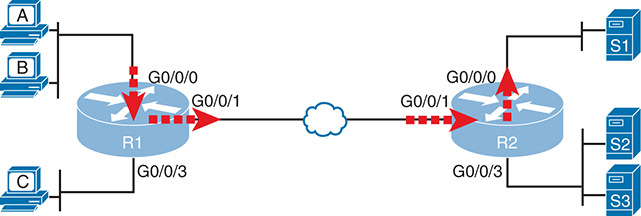
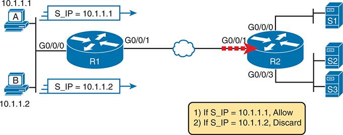
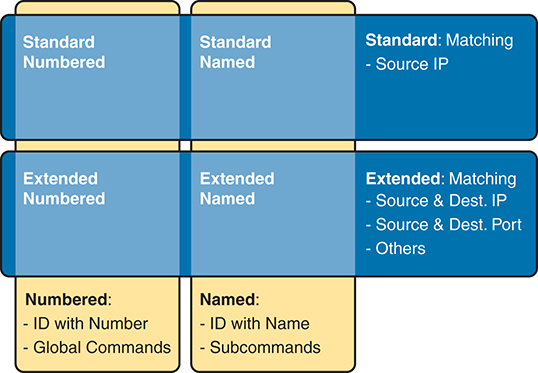
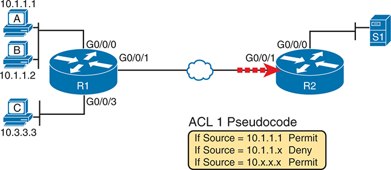
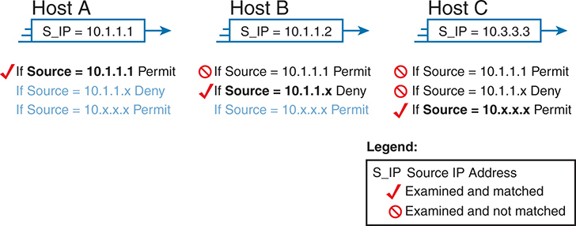
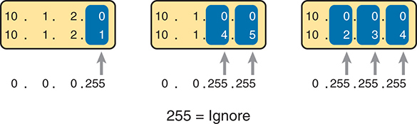
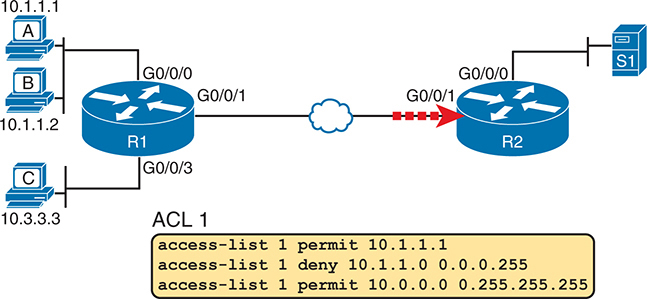
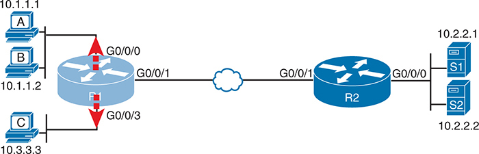
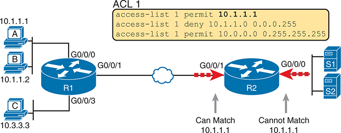

# Chapter 6


## Basic IPv4 Access Control Lists

This chapter covers the following exam topics:

5.0 Security Fundamentals

5.6 Configure and verify access control lists

IPv4 access control lists (ACLs) allow network engineers to program a filter into a router. Each router, on each interface, for both the inbound and outbound direction, can enable a different IP ACL with different rules. Each IP ACL's rules tell the router which packets to discard and which to allow through.

This chapter discusses the basics of IPv4 ACLs, specifically a type by the name *standard numbered IP ACLs* or simply [standard access lists](vol2_gloss.xhtml#gloss_333). Standard numbered ACLs use simple logic, matching on the source IP address field only, and use a configuration style that references the ACL using a number. This chapter sets out to help you learn this simpler type of ACL first. The next chapter, titled "[Named and Extended IP ACLs](vol2_ch07.xhtml#ch07)," discusses other variations of IP ACLs that use names (named ACLs) and that have more advanced matching logic than standard ACLs (extended ACLs).

### "Do I Know This Already?" Quiz

Take the quiz (either here or use the PTP software) if you want to use the score to help you decide how much time to spend on this chapter. The letter answers are listed at the bottom of the page following the quiz. [Appendix C](vol2_appc.xhtml#appc), found both at the end of the book as well as on the companion website, includes both the answers and explanations. You can also find both answers and explanations in the PTP testing software.

**Table 6-1** "Do I Know This Already?" Foundation Topics Section-to-Question Mapping

| Foundation Topics Section | Questions |
| --- | --- |
| IPv4 Access Control List Basics | 1 |
| Standard Numbered IPv4 ACLs | 2–6 |

**[1](vol2_ch06.xhtml#ques6_1a).** Barney is a host with IP address 10.1.1.1 in subnet 10.1.1.0/24. Which of the following things could a standard IP ACL be configured to do? (Choose two answers.)

1. Match the exact source IP address.
2. Match IP addresses 10.1.1.1 through 10.1.1.4 with one **access-list** command without matching other IP addresses.
3. Match all IP addresses in Barney's subnet with one **access-list** command without matching other IP addresses.
4. Match only the packet's destination IP address.

**[2](vol2_ch06.xhtml#ques6_2a).** Which of the following answers list a valid number that standard numbered IP ACLs can use? (Choose two answers.)

1. 1987
2. 2187
3. 187
4. 87

**[3](vol2_ch06.xhtml#ques6_3a).** Which of the following wildcard masks is most useful for matching all IP packets in subnet 10.1.128.0, mask 255.255.255.0?

1. 0.0.0.0
2. 0.0.0.31
3. 0.0.0.240
4. 0.0.0.255
5. 0.0.15.0
6. 0.0.248.255

**[4](vol2_ch06.xhtml#ques6_4a).** Which of the following wildcard masks is most useful for matching all IP packets in subnet 10.1.128.0, mask 255.255.240.0?

1. 0.0.0.0
2. 0.0.0.31
3. 0.0.0.240
4. 0.0.0.255
5. 0.0.15.255
6. 0.0.248.255

**[5](vol2_ch06.xhtml#ques6_5a).** ACL 1 has three statements, in the following order, with address and wildcard mask values as follows: 1.0.0.0 0.255.255.255, 1.1.0.0 0.0.255.255, and 1.1.1.0 0.0.0.255. If a router tried to match a packet sourced from IP address 1.1.1.1 using this ACL, which ACL statement does a router consider the packet to have matched?

1. First
2. Second
3. Third
4. Implied deny at the end of the ACL

**[6](vol2_ch06.xhtml#ques6_6a).** Which of the following **access-list** commands, taken from a router's running-config file, match all packets sent from hosts in subnet 172.16.4.0/23?

1. **access-list 1 permit 172.16.0.5 0.0.255.0**
2. **access-list 1 permit 172.16.4.0 0.0.1.255**
3. **access-list 1 permit 172.16.5.0**
4. **access-list 1 permit 172.16.5.0 0.0.0.127**

Answers to the "Do I Know This Already?" quiz:

**[1](vol2_appc.xhtml#ques6_1)** A, C

**[2](vol2_appc.xhtml#ques6_2)** A, D

**[3](vol2_appc.xhtml#ques6_3)** D

**[4](vol2_appc.xhtml#ques6_4)** E

**[5](vol2_appc.xhtml#ques6_5)** A

**[6](vol2_appc.xhtml#ques6_6)** B

### Foundation Topics

### IPv4 Access Control List Basics

IPv4 [access control lists (IP ACLs)](vol2_gloss.xhtml#gloss_016) allow network engineers to identify different types of packets. To do so, the ACL configuration lists values that the router can see in the IP, TCP, UDP, and other headers. For example, an ACL can match packets whose source IP address is 1.1.1.1, or packets whose destination IP address is some address in subnet 10.1.1.0/24, or packets with a destination port of TCP port 23 (Telnet).

IPv4 ACLs perform many functions in Cisco routers, with the most common use as a packet filter. Engineers can enable ACLs on a router so that the ACL sits in the forwarding path of packets as they pass through the router. After enabling it, the router considers whether each IP packet will either be discarded or allowed to continue as if the ACL did not exist.

However, ACLs can be used for many other IOS features as well. As an example, ACLs can be used to match packets for applying quality of service (QoS) features. QoS allows a router to give some packets better service and other packets worse service. For example, packets that hold digitized voice need to have very low delay, so ACLs can match voice packets, with QoS logic in turn forwarding voice packets more quickly than data packets.

This first section introduces IP ACLs as used for packet filtering. To better understand ACLs, the text first discusses the implications of the choice of the location and direction of the enabled ACL. Following that, the text examines the packet matching logic allowed in the configuration commands. The final section summarizes the actions to take when filtering packets: to deny (discard) the packet or permit the packet to continue along its original path.

#### ACL Location and Direction

Cisco routers can apply ACL logic to packets at the point at which the IP packets enter an interface, or the point at which they exit an interface. In other words, the ACL can be applied inbound to the router, before the router makes its forwarding (routing) decision, or outbound, after the router makes its forwarding decision and has determined the exit interface to use.

The arrows in [Figure 6-1](vol2_ch06.xhtml#ch06fig01) show where you could filter packets flowing left to right in the topology. For example, imagine that you wanted to allow packets sent by host A to server S1, but to discard packets sent by host B to server S1. Each arrowed line represents a location and direction at which a router could apply an ACL, filtering the packets sent by hosts A and B.




On the left side, there are three hosts labeled A, B, and C, connected to router R 1 via interfaces G 0 slash 0 slash 0, G 0 slash 0 slash 1, and G 0 slash 0 slash 3, respectively. Router R 1 is connected to router R 2 through the G 0 slash 0 slash 1 interface, forming a link between the two routers. On the right side, router R 2 has interfaces G 0 slash 0 slash 0, G 0 slash 0 slash 1, and G0 slash 0 slash 3, connected to three servers labeled S 1, S 2, and S 3, respectively. The diagram highlights with red arrows the interfaces G 0 slash 0 slash 0 on R1 and G0 slash 0 slash 0 on R 2, indicating the critical points for filtering packets from hosts A and B as they travel toward server S 1.

**Figure 6-1** *Locations to Filter Packets from Hosts A and B Going Toward Server S1*

The four arrowed lines in the figure point out the location and direction for the router interfaces used to forward the packet from host B to server S1. In this particular example, those interfaces and direction are inbound on R1's G0/0/0 interface, outbound on R1's G0/0/1 interface, inbound on R2's G0/0/1 interface, and outbound on R2's G0/0/0 interface.

To filter a packet, the ACL must be in the path that the packet travels. For example, if you enabled an ACL on R2's G0/0/3 interface, in either direction, that ACL could not possibly filter the packet sent from host B to server S1, because R2's G0/0/3 interface is not part of the route from host B to server S1. To summarize the logic:


To filter a packet with an ACL, identify the inbound and outbound interfaces that the packet uses when passing through the router, and enable the ACL on one of those interfaces in that same direction.

When enabled, the router then processes every inbound or outbound IP packet using that ACL. For example, if enabled on R1 for packets inbound on interface G0/0/0, R1 would compare every inbound IP packet on G0/0/0 to the ACL to decide that packet's fate: to continue unchanged or to be discarded.

Note

This book shows figures and examples of IP ACLs on routers. Multilayer switches configured to router IP packets also support IP ACLs using the same concepts and configuration.

#### Matching Packets

When you think about the location and direction for an ACL, you must already be thinking about what packets you plan to filter (discard) and which ones you want to allow through. To tell the router those same ideas, you must configure the router with an IP ACL that matches packets. *Matching packets* refers to how to configure the ACL commands to look at each packet, listing how to identify which packets should be discarded and which should be allowed through.

Each IP ACL consists of one or more configuration commands, with each command listing details about values to look for inside a packet's headers. Generally, an ACL command uses logic like "look for these values in the packet header, and if found, discard the packet." (The action could instead be to allow the packet rather than discard.) Specifically, the ACL looks for header fields you should already know well, including the source and destination IP addresses, plus TCP and UDP port numbers.

For example, consider an example with [Figure 6-2](vol2_ch06.xhtml#ch06fig02), in which you want to allow packets from host A to server S1, but to discard packets from host B going to that same server. The hosts all now have IP addresses, and the figure shows pseudocode for an ACL on R2. [Figure 6-2](vol2_ch06.xhtml#ch06fig02) also shows the chosen location to enable the ACL: inbound on R2's G0/0/1 interface.





The diagram includes two personal computers labeled A and B with I P addresses 10 dot 1 dot 1 dot 1 and 10 dot 1 dot 1 dot 2, respectively. Both P C s are connected to router R 1 through the interface G 0 slash 0 slash 0. Router R 1 is connected to router R 2 through the interface G 0 slash 0 slash 1, representing a connection over a cloud network. Router R 2 has three servers, labeled S 1, S 2, and S 3, connected to its interfaces G 0 slash 0 slash 0, G 0 slash 0 slash 2, and G 0 slash 0 slash 3, respectively. The image shows that traffic from both P C s is directed towards router R 2 through the G 0 slash 0 slash 1 interface. The pseudocode logic, shown in a yellow box at the bottom, specifies two rules: If the source I P address, S underscore I P, is 10 dot 1 dot 1 dot 1, the traffic is allowed. If the source I P address, S underscore I P, is 10 dot 1 dot 1 dot 2, the traffic is discarded.

**Figure 6-2** *Pseudocode to Demonstrate ACL Command-Matching Logic*

[Figure 6-2](vol2_ch06.xhtml#ch06fig02) shows a two-line ACL in a rectangle at the bottom, with simple matching logic: both statements just look to match the source IP address in the packet. When enabled, R2 looks at every inbound IP packet on that interface and compares each packet to those two ACL commands. Packets sent by host A (source IP address 10.1.1.1) are allowed through, and those sourced by host B (source IP address 10.1.1.2) are discarded.

#### Taking Action When a Match Occurs

When IP ACLs are used to filter packets, only one of two actions can be chosen. The configuration commands use the keywords **deny** and **permit**, and they mean (respectively) to discard the packet or to allow it to keep going as if the ACL did not exist.

This book focuses on using ACLs to filter packets, but IOS uses ACLs for many more features. Those features typically use the same matching logic. However, in other cases, the **deny** or **permit** keywords imply some other action.

#### Types of IP ACLs

Cisco IOS has supported IP ACLs since the early days of Cisco routers. Beginning with the original standard numbered IP ACLs in the early days of IOS, which could enable the logic shown earlier around [Figure 6-2](vol2_ch06.xhtml#ch06fig02), Cisco has added many ACL features, including the following:

* Standard numbered ACLs (1–99)
* Extended numbered ACLs (100–199)
* Additional ACL numbers (1300–1999 standard, 2000–2699 extended)
* Named ACLs
* Improved editing with sequence numbers

This chapter focuses solely on standard numbered IP ACLs, while the next chapter discusses the other three primary categories of IP ACLs. Briefly, IP ACLs will be either numbered or named in that the configuration identifies the ACL either using a number or a name. ACLs will also be either standard or extended, with extended ACLs having much more robust abilities in matching packets. [Figure 6-3](vol2_ch06.xhtml#ch06fig03) summarizes the big ideas related to categories of IP ACLs.





The diagram categorizes them into Standard and Extended A C L s, and further divides each into Numbered and Named A C L s. Standard A C L s include Standard Numbered, which uses a numerical I D and global commands, matching based on the Source I P address only, and Standard Named, which uses a name for identification and subcommands, also matching based on the Source I P address. Extended A C L s include Extended Numbered, which uses a numerical I D and global commands, matching based on both Source and Destination I P addresses, Source and Destination ports, and other criteria, and Extended Named, which uses a name for identification and subcommands, matching based on Source and Destination I P addresses, Source and Destination ports, and other criteria. The command structures for these A C L s are also compared: Numbered A C L s are identified by a number and utilize global commands for configuration, while Named A C L s are identified by a name and utilize subcommands for detailed configurations.

**Figure 6-3** *Comparisons of IP ACL Types*

### Standard Numbered IPv4 ACLs

The title of this section serves as a great introduction, if you can decode what Cisco means by each specific word. This section is about a type of Cisco filter (*ACL*) that matches only the source IP address of the packet (*standard*), is configured to identify the ACL using numbers rather than names (*numbered*), and looks at IPv4 packets.

This section first examines the idea that one ACL contains a list of commands, each containing matching and action logic. Following that, the text closely looks at how to match the source IP address field in the packet header, including the syntax of the commands. This section ends with a complete look at the configuration and verification commands to implement standard ACLs.

#### List Logic with IP ACLs

A single ACL is both a single entity and, at the same time, a list of one or more configuration commands. As a single entity, the configuration enables the entire ACL on an interface, in a specific direction, as shown earlier in [Figure 6-1](vol2_ch06.xhtml#ch06fig01). As a list of commands, each command has different matching logic that the router must apply to each packet when filtering using that ACL.

When doing ACL processing, the router processes the packet, compared to the ACL, as follows:

ACLs use first-match logic. Once a packet matches one line in the ACL, the router takes the action listed in that line of the ACL and stops looking further in the ACL.


To see exactly what that means, consider the example built around [Figure 6-4](vol2_ch06.xhtml#ch06fig04). The figure shows a sample ACL 1 with three lines of pseudocode. This example applies ACL 1 on R2's G0/0/1 interface, inbound (the same location as in [Figure 6-2](vol2_ch06.xhtml#ch06fig02)).





On the left side, three computers labeled A, B, and C are connected to a router labeled R 1. Computer A has the I P address 10 dot 1 dot 1 dot 1, computer B has the I P address 10 dot 1 dot 1 dot 2, and computer C has the I P address 10 dot 3.3.3. The connections are labeled as follows: Computer A is connected to the interface G 0 slash 0 slash 0, computer B to G 0 slash 0 slash 0, and computer C to G 0 slash 0 slash 3 on R 1. R 1 is connected to another router labeled R 2 via a network cloud, with interfaces G 0 slash 0 slash 1 on both R 1 and R 2 connecting through this cloud. The connection between R 1 and R 2 is marked with red dashed lines to emphasize the flow of data. On the right side of the image, R 2 is connected to a server labeled S 1 through interface G 0 slash 0 slash 0 dot Below the network diagram, there is a yellow box containing pseudocode for A C L 1, which dictates the filtering rules: If Source equals 10 dot 1 dot 1 dot 1 Permit, If Source equals 10 dot 1 dot 1 dot x Deny, If Source equals 10 dot x dot x dot x Permit.

**Figure 6-4** *Backdrop for Discussion of List Process with IP ACLs*

Consider the first-match ACL logic for a packet sent by host A to server S1. The source IP address will be 10.1.1.1 and routed so that it enters R2's G0/0/1 interface, driving R2's ACL 1 logic. R2 compares this packet to the ACL, matching the first item in the list with a permit action. This packet should be allowed through, as shown in [Figure 6-5](vol2_ch06.xhtml#ch06fig05), on the left.




Host A has an S underscore I P of 10 dot 1 dot 1 dot 1, and the A C L rules specify that if the source is 10 dot 1 dot 1 dot 1, it is permitted (indicated by a checkmark and Examined and matched); if the source is 10 dot 1 dot 1 dot x, it is denied (indicated by a red circle with a slash and Examined and not matched); and if the source is 10 dot x dot x dot x, it is permitted (in blue text). Host B has an S underscore I P of 10 dot 1 dot 1 dot 2, with A C L rules stating that if the source is 10 dot 1 dot 1 dot 1, it is denied (red circle with a slash); if the source is 10 dot 1 dot 1 dot x, it is denied (red circle with a slash); and if the source is 10 dot x dot x dot x, it is permitted (blue text). Host C has an S underscore I P of 10 dot 3.3.3, with rules that if the source is 10 dot 1 dot 1 dot 1, it is denied (red circle with a slash); if the source is 10 dot 1 dot 1 dot x, it is denied (red circle with a slash); and if the source is 10 dot x dot x dot x, it is permitted (blue text). A legend at the bottom right explains the symbols: a checkmark means the source I P address is examined and matched, while a red circle with a slash indicates the source I P address is examined and not matched.

**Figure 6-5** *ACL Items Compared for Packets from Hosts A, B, and C in [Figure 6-4](vol2_ch06.xhtml#ch06fig04)*

Next, consider a packet sent by host B, source IP address 10.1.1.2. When the packet enters R2's G0/0/1 interface, R2 compares the packet to ACL 1's first statement and does not make a match (10.1.1.1 is not equal to 10.1.1.2). R2 then moves to the second statement, which requires some clarification. The ACL pseudocode, back in [Figure 6-4](vol2_ch06.xhtml#ch06fig04), shows 10.1.1.x, which is meant to be shorthand that any value can exist in the last octet. Comparing only the first three octets, R2 decides that this latest packet does have a source IP address that begins with the first three octets 10.1.1, so R2 considers that to be a match on the second statement. R2 takes the listed action (deny), discarding the packet. R2 also stops ACL processing on the packet, ignoring the third line in the ACL.

Finally, consider a packet sent by host C, again sent to server S1. The packet has source IP address 10.3.3.3, so when it enters R2's G0/0/1 interface and drives ACL processing on R2, R2 looks at the first command in ACL 1. R2 does not match the first ACL command (10.1.1.1 in the command is not equal to the packet's 10.3.3.3). R2 looks at the second command, compares the first three octets (10.1.1) to the packet source IP address (10.3.3), and still finds no match. R2 then looks at the third command. In this case, the wildcard means ignore the last three octets and just compare the first octet (10), so the packet matches. R2 then takes the listed action (permit), allowing the packet to keep going.

All Cisco IOS ACLs use this first-match logic: IP ACLs, IPv6 ACLs, standard or extended, named or numbered.

Finally, every ACL ends with *deny any* logic, the equivalent of an **access-list** *number* **deny any** command. It does not exist in the configuration, but if a router keeps searching the list, making no match by the end of the list, IOS considers the packet to have matched the implied deny any, with the router discarding the packet.

#### Matching Logic and Command Syntax

Standard numbered IP ACLs use the following global command:

[Click here to view code image](vol2_ch06_images.xhtml#f0121-01)

```
access-list {1-99 | 1300-1999} {permit | deny} matching-parameters
```

Each standard numbered ACL has one or more **access-list** commands with the same number, any number from the ranges shown in the preceding line of syntax. One number is no better than the other. IOS refers to each line in an ACL as an [access control entry (ACE)](vol2_gloss.xhtml#gloss_016), but many engineers just call them ACL statements.

After the ACL number, the **access-list** global command lists the action (**permit** or **deny**) and then the matching logic. The next few pages focus on configuring the source address's matching parameters.

##### Matching the Exact IP Address

To match a specific source IP address, configure that IP address at the end of the command. For example, the previous example uses pseudocode for "permit if source = 10.1.1.1." The following command configures that logic with correct syntax using ACL number 1:

```
access-list 1 permit 10.1.1.1
```

For historical reasons, IOS (and IOS XE) support two alternative syntax options for standard ACLs to match a single address. You could use either of the following two options to configure the same logic as the previous command:

[Click here to view code image](vol2_ch06_images.xhtml#f0121-02)

```
access-list 1 permit host 10.1.1.1
access-list 1 permit 10.1.1.1 0.0.0.0
```

The first of the alternate options uses a **host** keyword before the single address, with the other listing the address followed by a value called a [wildcard mask](vol2_gloss.xhtml#gloss_377) (in this case, 0.0.0.0). Although IOS accepts both additional formats, it stores the command with the first syntax (the version with neither the **host** keyword nor 0.0.0.0 wildcard mask). (The text defines the wildcard mask and its use in the next topic.) [Table 6-2](vol2_ch06.xhtml#ch06tab02) summarizes the options for easier study and review.


**Table 6-2** Summary of Standard ACL Syntax Supported to Match One IP Address

|  | *address* 0.0.0.0 | host *address* | *address* |
| --- | --- | --- | --- |
| **Standard ACLs** | Yes | Yes | Yes[\*](vol2_ch06.xhtml#tfn6_2_1a) |

[\*](vol2_ch06.xhtml#tfn6_2_1)IOS stores the command with this syntax no matter the configuration style.

##### Matching a Subset of the Address with Wildcard Masks

You often need to match a range of IP addresses rather than a single one. Maybe you want to match all IP addresses in a subnet. Maybe you want to match all IP addresses in a range of subnets. Regardless, you want to check for more than one IP address in a range of addresses.

IOS allows standard ACLs to match a range of addresses using a tool called a *wildcard mask*. Note that this is not a subnet mask. The wildcard mask (which this book abbreviates as *WC mask*) gives the engineer a way to tell IOS to ignore parts of the address when making comparisons, essentially treating those parts as wildcards, as if they already matched.

You can think about WC masks in decimal and in binary, and both have their uses. To begin, think about WC masks in decimal, using these rules:


**Decimal 0:** The router must compare this octet as normal.

**Decimal 255:** The router ignores this octet, considering it to match already.

Keeping these two rules in mind, consider [Figure 6-6](vol2_ch06.xhtml#ch06fig06), which demonstrates this logic using three different but popular WC masks: one that tells the router to ignore the last octet, one that tells the router to ignore the last two octets, and one that tells the router to ignore the last three octets.




It shows three examples. The first example depicts the I P addresses 10 dot 1 dot 2.0 and 10 dot 1 dot 2 dot 1 being matched with the wildcard mask 0 dot 0 dot 0 dot 255, meaning the first three octets (10 dot 1 dot 2) must match exactly while the last octet (0-255) can vary, matching any I P address in the range 10 dot 1 dot 2.0 to 10 dot 1 dot 2 dot 255. The second example shows the I P addresses 10 dot 1.0 dot 0 and 10 dot 1.4.5 being matched with the wildcard mask 0 dot 0 dot 255 dot 255, indicating the first two octets (10 dot 1) must match exactly while the last two octets (0-255) can vary, matching any I P address in the range 10 dot 1.0 dot 0 to 10 dot 1 dot 255 dot 255. The third example presents the I P addresses 10 dot 0 dot 0 dot 0 and 10 dot 2.3.4 being matched with the wildcard mask 0 dot 255 dot 255 dot 255, meaning only the first octet (10) must match exactly while the remaining three octets (0 to 255) can vary, matching any I P address in the range 10 dot 0 dot 0 dot 0 to 10 dot 255 dot 255 dot 255.

**Figure 6-6** *Logic for WC Masks 0.0.0.255, 0.0.255.255, and 0.255.255.255*

All three examples in the boxes of [Figure 6-6](vol2_ch06.xhtml#ch06fig06) show clearly different numbers. The WC mask causes IOS to compare only some of the octets, while ignoring other octets. All three examples result in a match, because each wildcard mask tells IOS to ignore some octets. The example on the left shows WC mask 0.0.0.255, which tells the router to treat the last octet as a wildcard, essentially ignoring that octet for the comparison. Similarly, the middle example shows WC mask 0.0.255.255, which tells the router to ignore the two octets on the right. The rightmost case shows WC mask 0.255.255.255, telling the router to ignore the last three octets when comparing values.

To see the WC mask in action, think back to the earlier examples related to [Figures 6-4](vol2_ch06.xhtml#ch06fig04) and [6-5](vol2_ch06.xhtml#ch06fig05). The pseudocode ACL in those two figures used logic that can be created using a WC mask. As a reminder, the logic in the pseudocode ACL in those two figures included the following:

**Line 1:** Match and permit the packets with a source address of exactly 10.1.1.1.

**Line 2:** Match and deny the packets with source addresses with first three octets 10.1.1.

**Line 3:** Match and permit the packets with addresses with a first octet value of 10.

The **access-list** command matches a range of addresses by listing two parameters: the first number in the range plus a wildcard mask. As an example, [Figure 6-7](vol2_ch06.xhtml#ch06fig07) shows the updated version of [Figure 6-4](vol2_ch06.xhtml#ch06fig04), but with the completed, correct ACL syntax, including the WC masks. In particular, note the use of WC mask 0.0.0.255 in the second ACE, telling R2 to ignore the last octet of the number 10.1.1.0, and the WC mask 0.255.255.255 in the third ACE, telling R2 to ignore the last three octets in the value 10.0.0.0.




The network diagram includes three personal computers labeled A, B, and C with I P addresses 10 dot 1 dot 1 dot 1, 10 dot 1 dot 1 dot 2, and 10 dot 3.3.3, respectively. All three P C s are connected to router R 1 through different interfaces: P C A and P C B through G 0 slash 0 slash 0, and P C C through G 0 slash 0 slash 3. Router R 1 is connected to router R 2 via the interface G 0 slash 0 slash 1, representing a connection over a cloud network. Router R 2 has a server, labeled S 1, connected to its interface G 0 slash 0 slash 0 dot The diagram shows traffic flow from P C s A, B, and C towards router R 2 through the G 0 slash 0 slash 1 interface. The yellow box at the bottom lists the A C L rules as follows: access-list 1 permit 10 dot 1 dot 1 dot 1 allows traffic from the I P address 10 dot 1 dot 1 dot 1; access-list 1 deny 10 dot 1 dot 1 dot 2 0 dot 0 dot 0 dot 255 denies traffic from the I P address range 10 dot 1 dot 1 dot 2 to 10 dot 1 dot 1 dot 255; and access-list 1 permit 10 dot 0 dot 0 dot 0 0 dot 255 dot 255 dot 255 allows traffic from the I P address range 10 dot 0 dot 0 dot 0 to 10 dot 255 dot 255 dot 255. The diagram uses a red dashed line to indicate that traffic from P C B, 10 dot 1 dot 1 dot 2, is being discarded by router R 2, while traffic from P C A, 10 dot 1 dot 1 dot 1, and P C C, 10 dot 3.3.3, is allowed to proceed to the server S 1.

**Figure 6-7** *Syntactically Correct ACL Replaces Pseudocode from [Figure 6-4](vol2_ch06.xhtml#ch06fig04)*

The generic syntax of the command, **access-list** *number action source* [*wildcard-mask*], refers to the matching parameters as source and wildcard mask. When using a wildcard mask, the source value defines the first number in the range of addresses.

##### Binary Wildcard Masks

Wildcard masks, as dotted-decimal number (DDN) values, represent a 32-bit binary number. As a 32-bit number, the WC mask directs the router's logic bit-by-bit rather than octet-by-octet. In short, compare the two numbers bit-by-bit when the WC mask bit equals 0, but ignore the bits when the WC mask bit in the same relative position is a binary 1.

Thankfully, for CCNA study, and for most real-world applications, you can ignore the binary WC mask. Why? Well, we generally want to match a range of addresses that can be easily identified by a subnet number and mask, whether it be a real subnet or a summary route that groups subnets together. If you can describe the range of addresses with a subnet number and mask, you can find the numbers to use in your ACL with some simple decimal math, as discussed next.

Note

If you really want to know the binary mask logic, take the two DDN numbers the ACL will compare (one from the **access-list** command and the other from the packet header) and convert both to binary. Then, also convert the WC mask to binary, so you now have three 32-bit numbers. Ignore the bit for any bits in which the wildcard mask bit is a 1, but for wildcard mask bits of 0, compare that bit in the two addresses. If all the bits you checked are equal, it's a match!

##### Finding the Right Wildcard Mask to Match a Subnet

To match a subnet with an ACL, you can use the following shortcut:


* Use the subnet number as the source value in the **access-list** command.
* Use a wildcard mask found by subtracting the subnet mask from 255.255.255.255.

For example, for subnet 172.16.8.0 255.255.252.0, use the subnet number (172.16.8.0) as the source parameter, and then do the following math to find the wildcard mask:

255.255.255.255 −255.255.252.0¯0.⁢ 0.⁢  3.255

Continuing this example, a completed command for this same subnet would be as follows:

[Click here to view code image](vol2_ch06_images.xhtml#f0124-01)

```
access-list 1 permit 172.16.8.0 0.0.3.255
```

The section "[Practice Applying Standard IP ACLs](vol2_ch06.xhtml#ch06lev2sec9)" gives you a chance to practice matching subnets when configuring ACLs.

##### Matching Any/All Addresses

In some cases, you will want one ACL command to match any and all packets that reach that point in the ACL. First, you have to know the (simple) way to match all packets using the **any** keyword. More importantly, you need to think about when to match any and all packets.

First, to match any and all packets with an ACL command, just use the **any** keyword for the address. For example, to permit all packets:

```
access-list 1 permit any
```

So, when and where should you use such a command? Remember, all Cisco IP ACLs end with an implicit **deny any** concept at the end of each ACL. That is, if a router compares a packet to the ACL, and the packet matches none of the configured ACEs, the router discards the packet. Want to override that default behavior? Configure a **permit any** at the end of the ACL.

You might also want to explicitly configure a command to deny all traffic (for example, **access-list 1 deny any**) at the end of an ACL. Why, when the same logic already sits at the end of the ACL anyway? Well, the ACL **show** commands list counters for the number of packets matched by each command in the ACL, but there is no counter for that implicit **deny any** concept at the end of the ACL. So, configure an explicit deny any if you want to see counters for how many packets are matched by the logic at the end of the ACL.

#### Implementing Standard IP ACLs

This chapter has already introduced all the configuration steps in bits and pieces. This section summarizes those pieces as a configuration process. The process also refers to the **access-list** command, whose generic syntax is repeated here for reference:

[Click here to view code image](vol2_ch06_images.xhtml#f0125-01)

```
access-list access-list-number {deny | permit} source [source-wildcard]
```


Step 1. Plan the location (router and interface) and direction (in or out) on that interface:

1. Standard ACLs should be placed near the packet's destination so that they do not unintentionally discard packets that should not be discarded.
2. Because standard ACLs can only match a packet's source IP address, identify the source IP addresses of packets as they go in the direction that the ACL is examining.

Step 2. Configure one or more **access-list** global configuration commands to create the ACL, keeping the following in mind:

1. The list is searched sequentially, using first-match logic.
2. The default action, if a packet does not match any of the **access-list** commands, is to **deny** (discard) the packet.

Step 3. Enable the ACL on the chosen router interface, in the correct direction, using the **ip access-group** *number* {**in | out**} interface subcommand.

Note that the **ip access-group** interface subcommand works on interfaces enabled for IP routing. That is, the interface has an IP address configured. The examples in this chapter use physical interfaces on routers; however, in other cases, a router or multilayer switch enables IP routing on subinterfaces or VLAN interfaces. In those cases, you can enable an ACL on those interfaces. For a reminder of some of the various types of interfaces a router or switch might enable IP, refer to *CCNA 200-301 Official Cert Guide, Volume 1*, Second Edition, [Chapter 18](vol2_ch18.xhtml#ch18), "[IP Routing in the LAN](vol2_ch18.xhtml#ch18)."

##### Standard Numbered ACL Scenario 1

The first ACL scenario shows the configuration for the same requirements demonstrated with [Figures 6-4](vol2_ch06.xhtml#ch06fig04) and [6-5](vol2_ch06.xhtml#ch06fig05). Restated, the requirements for this ACL are as follows:

1. Enable the ACL inbound on router R2's G0/0/1 interface.
2. Permit packets coming from host A.
3. Deny packets coming from other hosts in host A's subnet.
4. Permit packets coming from any other address in Class A network 10.0.0.0.
5. The original example made no comment about what to do by default, so simply deny all other traffic.

[Example 6-1](vol2_ch06.xhtml#exa6_1) shows a completed correct configuration, starting with the configuration process, followed by output from the **show running-config** command.

**Example 6-1** *Standard Numbered ACL Example 1 Configuration*

[Click here to view code image](vol2_ch06_images.xhtml#f0126-01)

```
R2# configure terminal
Enter configuration commands, one per line. End with CNTL/Z.
R2(config)# access-list 1 permit 10.1.1.1
R2(config)# access-list 1 deny 10.1.1.0 0.0.0.255
R2(config)# access-list 1 permit 10.0.0.0 0.255.255.255
R2(config)# interface gigabitethernet 0/0/1
R2(config-if)# ip access-group 1 in
R2(config-if)# ^Z
R2# show running-config
! Lines omitted for brevity

access-list 1 permit 10.1.1.1
access-list 1 deny 10.1.1.0 0.0.0.255
access-list 1 permit 10.0.0.0 0.255.255.255
```

First, pay close attention to the configuration process at the top of [Example 6-1](vol2_ch06.xhtml#exa6_1). Note that the **access-list** command does not change the command prompt from the global configuration mode prompt because the **access-list** command is a global configuration command. Then, compare that to the output of the **show running-config** command: the details are identical to the commands added in configuration mode. Finally, make sure to note the **ip access-group 1 in** command, under R2's G0/0/1 interface, which enables the ACL logic (both location and direction).

[Example 6-2](vol2_ch06.xhtml#exa6_2) lists some output from router R2 that shows information about this ACL. The **show ip access-lists** command lists details about IPv4 ACLs only, while the **show access-lists** command lists details about IPv4 ACLs plus any other types of ACLs that are currently configured—for example, IPv6 ACLs. These commands list the same output in the same format.

**Example 6-2** *ACL **show** Commands on R2*

[Click here to view code image](vol2_ch06_images.xhtml#f0126-02)

```
R2# show ip access-lists
Standard IP access list 1
    10 permit 10.1.1.1 (107 matches)
    20 deny   10.1.1.0, wildcard bits 0.0.0.255 (4 matches)
    30 permit 10.0.0.0, wildcard bits 0.255.255.255 (10 matches)
R2# show access-lists
Standard IP access list 1
    10 permit 10.1.1.1 (107 matches)
    20 deny   10.1.1.0, wildcard bits 0.0.0.255 (4 matches)
    30 permit 10.0.0.0, wildcard bits 0.255.255.255 (10 matches)
R2# show ip interface g0/0/1
GigabitEthernet0/0/1 is up, line protocol is up
  Internet address is 10.1.2.2/24
  Broadcast address is 255.255.255.255

  Address determined by non-volatile memory
  MTU is 1500 bytes
  Helper address is not set
  Directed broadcast forwarding is disabled
  Multicast reserved groups joined: 224.0.0.9
  Outgoing access list is not set
  Inbound access list is 1
! Lines omitted for brevity
```

The output of both the **show ip access-lists** and **show access-lists** commands show two items of note. The first line of output notes the type (standard) and the number. If more than one ACL existed, you would see multiple stanzas of output, one per ACL, each with a heading line like this one. Next, these commands list packet counts for the number of packets that the router has matched with each ACE. For example, 107 packets so far have matched the ACE. (When troubleshooting, you can use the **clear ip access-list counters** command to reset all these counters to 0.)

The end of [Example 6-2](vol2_ch06.xhtml#exa6_2) also lists the **show ip interface** command output. This command lists, among many other items, the number or name of any IP ACL enabled on the interface per the **ip access-group** interface subcommand.

##### Standard Numbered ACL Scenario 2

For the second ACL scenario, use [Figure 6-8](vol2_ch06.xhtml#ch06fig08), and imagine your boss gives you some requirements hurriedly in the hall. At first, he tells you he wants to filter packets going from the servers on the right toward the clients on the left. Then, he says he wants you to allow access for hosts A, B, and other hosts in their same subnet to server S1, but deny access to that server to the hosts in host C's subnet. Then, he tells you that, additionally, hosts in host A's subnet should be denied access to server S2, but hosts in host C's subnet should be allowed access to server S2—all by filtering packets going right to left only. He then tells you to put the ACL inbound on R2's G0/0/0 interface.




The diagram consists of multiple network devices and connections labeled with specific network interface identifiers and I P addresses. Starting from the left, there are three computers labeled A, B, and C with I P addresses 10 dot 1 dot 1 dot 1, 10 dot 1 dot 1 dot 2, and 10 dot 3 dot 3 dot 3, respectively. These computers are connected to a router labeled R 1, which has three interfaces: G 0 slash 0 slash 0, G 0 slash 0 slash 1, and G 0 slash 0 slash 3. Interface G 0 slash 0 slash 0 connects to computers A and B, while interface G 0 slash 0 slash 3 connects to computer C. The router R 1 is connected to another router, labeled R 2, through interface G 0 slash 0 slash 1 via a network cloud symbolizing a Wide Area Network connection. Router R 2 has two interfaces, G 0 slash 0 slash 0 and G 0 slash 0 slash 1. Interface G 0 slash 0 slash 0 connects to two servers labeled S 1 and S 2 with I P addresses 10 dot 2 dot 2 dot 1 and 10 dot 2 dot 2 dot 2, respectively. Interface G 0 slash 0 slash 1 connects to the Wide Area Network cloud from router R 1.

**Figure 6-8** *Standard Numbered ACL Scenario 2*

If you cull through all the boss's comments, the requirements might be reduced to the following:

1. Enable the ACL inbound on R2's G0/0/0 interface.
2. Permit packets from server S1 going to hosts in A's subnet.
3. Deny packets from server S1 going to hosts in C's subnet.
4. Permit packets from server S2 going to hosts in C's subnet.
5. Deny packets from server S2 going to hosts in A's subnet.
6. (There was no comment about what to do by default; use the implied **deny any** default.)

As it turns out, you cannot do everything your boss asked with a standard ACL. For example, consider the obvious command for requirement number 2: **access-list 2 permit 10.2.2.1**. That permits all traffic whose source IP is 10.2.2.1 (server S1). The next requirement asks you to filter (deny) packets sourced from that same IP address! Even if you added another command that checked for source IP address 10.2.2.1, the router would never get to it because routers use first-match logic when searching the ACL. You cannot check both the destination and source IP address because standard ACLs cannot check the destination IP address.

To solve this problem, you should get a new boss! No, seriously, you should rethink the problem and change the rules. In real life, you would probably use an extended ACL instead, which lets you check both the source and destination IP address.

For the sake of practicing another standard ACL, imagine your boss lets you change the requirements. The logic will still consider packets moving right to left in the figure; however, the design uses two outbound ACLs, both on router R1. Each ACL will permit traffic from a single server to be forwarded onto that connected LAN, with the following modified requirements:

1. Using an outbound ACL on R1's G0/0/0 interface, permit packets from server S1, and deny all other packets.
2. Using an outbound ACL on R1's G0/0/3 interface, permit packets from server S2, and deny all other packets.

[Example 6-3](vol2_ch06.xhtml#exa6_3) shows the configuration that completes these requirements.

**Example 6-3** *Alternative Configuration in Router R1*

[Click here to view code image](vol2_ch06_images.xhtml#f0128-01)

```
access-list 2 remark This ACL permits server S1 traffic to host A's subnet
access-list 2 permit 10.2.2.1
!
access-list 3 remark This ACL permits server S2 traffic to host C's subnet
access-list 3 permit 10.2.2.2
!
interface G0/0/0
 ip access-group 2 out
!
interface G0/0/3
 ip access-group 3 out
```

As highlighted in the example, the solution with ACL number 2 permits all traffic from server S1, with that logic enabled for packets exiting R1's G0/0/0 interface. All other traffic will be discarded because of the implied **deny any** at the end of the ACL. In addition, ACL 3 permits traffic from server S2, which is then permitted to exit R1's G0/0/3 interface.

Finally, make sure to notice the **access-list remark** parameter, which allows you to leave text documentation that stays with the ACL. You can add as many remarks as you like into a single ACL.

Note

Routers treat self-created packets differently than packets routed (received and then forwarded) by the router. A router applies any outbound ACL logic to routed packets but bypasses the ACL for self-created packets. Examples of those packets include routing protocol messages and packets sent by the **ping** and **traceroute** commands on that router.

#### Troubleshooting and Verification Tips

Troubleshooting IPv4 ACLs requires some attention to detail. In particular, you have to be ready to look at the address and wildcard mask and confidently predict the addresses matched by those two combined parameters. The upcoming practice problems a little later in this chapter can help prepare you for that part of the work. But a few other tips can help you verify and troubleshoot ACL problems on the exams as well.

First, you can tell whether the router matches packets with a couple of tools. [Example 6-2](vol2_ch06.xhtml#exa6_2) already showed that IOS keeps statistics about the packets matched by each line of an ACL. In addition, if you add the **log** keyword to the end of an **access-list** command, IOS then issues log messages with occasional statistics about matches of that particular line of the ACL. Both the statistics and the log messages can be helpful in deciding which line in the ACL is being matched by a packet.

For example, [Example 6-4](vol2_ch06.xhtml#exa6_4) shows an updated ACL 2 from [Example 6-3](vol2_ch06.xhtml#exa6_3), with the **log** keyword added. The bottom of the example then shows a typical log message, showing the resulting match based on a packet with source IP address 10.2.2.1 (as matched with the ACL) to destination address 10.1.1.1.

**Example 6-4** *Creating Log Messages for ACL Statistics*

[Click here to view code image](vol2_ch06_images.xhtml#f0129-01)

```
R1# show running-config
! lines removed for brevity
access-list 2 remark This ACL permits server S1 traffic to host A's subnet
access-list 2 permit 10.2.2.1 log
!
interface G0/0/0
 ip access-group 2 out

R1#
Feb 4 18:30:24.082: %SEC-6-IPACCESSLOGNP: list 2 permitted 0 10.2.2.1 -> 10.1.1.1,
1 packet
```

Also, when you troubleshoot an ACL for the first time, begin by thinking about both the interface on which the ACL is enabled and the direction of packet flow. Ignore the matching logic at first. Sometimes, the matching logic is perfect—but the ACL has been enabled on the wrong interface, or for the wrong direction, to match the packets as configured for the ACL.

For example, [Figure 6-9](vol2_ch06.xhtml#ch06fig09) repeats the same ACL shown earlier in [Figure 6-7](vol2_ch06.xhtml#ch06fig07). The first line of that ACL matches the specific host address 10.1.1.1. If that ACL exists on router R2, placing that ACL as an inbound ACL on R2's G0/0/1 interface can work because packets sent by host 10.1.1.1—on the left side of the figure—can enter R2's G0/0/1 interface. However, if R2 enables ACL 1 on its G0/0/0 interface, for inbound packets, the ACL will never match a packet with source IP address 10.1.1.1 because packets sent by host 10.1.1.1 will never enter that interface. Packets sent by 10.1.1.1 will exit R2's G0/0/0 interface, but never enter it, just because of the network topology.




The network diagram includes two routers labeled R 1 and R 2, interconnected by a cloud symbolizing the network. Router R 1 has three interfaces: G 0 slash 0 slash 0, G 0 slash 0 slash 1, and G 0 slash 0 slash 3. Connected to G 0 slash 0 slash 0 is a device labeled 'A' with I P address 10 dot 1 dot 1 dot 1, to G 0 slash 0 slash 1 is a device labeled 'B' with I P address 10 dot 1 dot 1 dot 2, and to G 0 slash 0 slash 3 is a device labeled 'C' with I P address 10 dot 3 dot 3 dot 3. Router R 2 also has two interfaces: G 0 slash 0 slash 0 and G 0 slash 0 slash 1. Attached to G 0 slash 0 slash 0 of R 2 are two servers labeled S 1 and S 2. The A C L shown in a yellow box at the top of the image contains three rules: access-list 1 permit 10 dot 1 dot 1 dot 1, access-list 1 deny 10 dot 1 dot 1 dot 0 0 dot 0 dot 0 dot 255, and access-list 1 permit 10 dot 0 dot 0 dot 0 0 dot 255 dot 255 dot 255. The connection between G 0 slash 0 slash 1 of R 1 and G 0 slash 0 slash 1 of R 2 is marked with arrows indicating that traffic from 10 dot 1 dot 1 dot 1 can match the A C L rules, while traffic from 10 dot 1 dot 1 dot 0 cannot.

**Figure 6-9** *Example of Checking the Interface and Direction for an ACL*

#### Practice Applying Standard IP ACLs

Some CCNA topics, like ACLs, simply require more drills and practice than others. ACLs require you to think of parameters to match ranges of numbers, and that of course requires some use of math and some use of processes.

This section provides some practice problems and tips, from two perspectives. First, this section asks you to build one-line standard ACLs to match some packets. Second, this section asks you to interpret existing ACL commands to describe what packets the ACL will match. Both skills are useful for the exam.

##### Practice Building access-list Commands

In this section, practice getting comfortable with the syntax of the **access-list** command, particularly with choosing the correct matching logic. These skills will be helpful when reading about extended and named ACLs in the next chapter.

First, the following list summarizes some important tips to consider when choosing matching parameters to any **access-list** command:


* To match a specific address, just list the address.
* To match any and all addresses, use the **any** keyword.
* To match based only on the first one, two, or three octets of an address, use the 0.255.255.255, 0.0.255.255, and 0.0.0.255 WC masks, respectively. Also, make the source (address) parameter have 0s in the wildcard octets (those octets with 255 in the wildcard mask).
* To match a subnet, use the subnet ID as the source, and find the WC mask by subtracting the DDN subnet mask from 255.255.255.255.

[Table 6-3](vol2_ch06.xhtml#ch06tab03) lists the criteria for several practice problems. Your job: Create a standard ACL ACE that matches the packets. The answers are listed in the section "[Answers to Earlier Practice Problems](vol2_ch06.xhtml#ch06lev1sec10)," later in this chapter.

**Table 6-3** Building One-Line Standard ACLs: Practice

| Problem | Criteria |
| --- | --- |
| 1 | Packets from 172.16.5.4 |
| 2 | Packets from hosts with 192.168.6 as the first three octets |
| 3 | Packets from hosts with 192.168 as the first two octets |
| 4 | Packets from any host |
| 5 | Packets from subnet 10.1.200.0/21 |
| 6 | Packets from subnet 10.1.200.0/27 |
| 7 | Packets from subnet 172.20.112.0/23 |
| 8 | Packets from subnet 172.20.112.0/26 |
| 9 | Packets from subnet 192.168.9.64/28 |
| 10 | Packets from subnet 192.168.9.64/30 |

##### Reverse Engineering from ACL to Address Range

In some cases, you may not be creating your own ACL. Instead, you may need to interpret some existing **access-list** commands. To answer these types of questions on the exams, you need to determine the range of IP addresses matched by a particular address/wildcard mask combination in each ACL statement.

Under certain assumptions that are reasonable for CCNA certifications, calculating the range of addresses matched by an ACL can be relatively simple. Basically, the range of addresses begins with the source parameter configured in the ACL command. The range of addresses ends with the sum of the source parameter and the wildcard mask. That's it.

For example, with the command **access-list 1 permit 172.16.200.0 0.0.7.255**, the low end of the range is simply 172.16.200.0, taken directly from the command itself. Then, to find the high end of the range, just add this number to the WC mask, as follows:

172.16.200.0 +0.⁢    0.⁢     7.255¯172.16.207.255

For this last bit of practice, look at the existing **access-list** commands in [Table 6-4](vol2_ch06.xhtml#ch06tab04). In each case, make a notation about the exact IP address, or range of IP addresses, matched by the command.

**Table 6-4** Finding IP Addresses/Ranges Matching by Existing ACLs

| Problem | Commands for Which to Predict the Source Address Range |
| --- | --- |
| 1 | **access-list 1 permit 10.7.6.5** |
| 2 | **access-list 2 permit 192.168.4.0 0.0.0.127** |
| 3 | **access-list 3 permit 192.168.6.0 0.0.0.31** |
| 4 | **access-list 4 permit 172.30.96.0 0.0.3.255** |
| 5 | **access-list 5 permit 172.30.96.0 0.0.0.63** |
| 6 | **access-list 6 permit 10.1.192.0 0.0.0.31** |
| 7 | **access-list 7 permit 10.1.192.0 0.0.1.255** |
| 8 | **access-list 8 permit 10.1.192.0 0.0.63.255** |

Interestingly, IOS lets the CLI user type an **access-list** command in configuration mode, and IOS will potentially change the source parameter before placing the command into the running-config file. This process of just finding the range of addresses matched by the **access-list** command expects that the **access-list** command came from the router, so that any such changes were complete.

The change IOS can make with an **access-list** command is to convert to 0 any octet of an address for which the wildcard mask's octet is 255. For example, with a wildcard mask of 0.0.255.255, IOS ignores the last two octets. IOS expects the source parameter to end with two 0s. If not, IOS still accepts the **access-list** command, but IOS changes the last two octets of the address to 0s. [Example 6-5](vol2_ch06.xhtml#exa6_5) shows an example, where the configuration shows source 10.1.1.1, but wildcard mask 0.0.255.255.

**Example 6-5** *IOS Changing the Address Field in an **access-list** Command*

[Click here to view code image](vol2_ch06_images.xhtml#f0132-01)

```
R2# configure terminal
Enter configuration commands, one per line. End with CNTL/Z.
R2(config)# access-list 21 permit 10.1.1.1 0.0.255.255
R2(config)# ^Z
R2#
R2# show ip access-lists
Standard IP access list 21
    10 permit 10.1.0.0, wildcard bits 0.0.255.255
```

The math to find the range of addresses relies on whether the command is fully correct or whether IOS has already set these address octets to 0, as shown in the example.

Note

The most useful WC masks, in binary, do not interleave 0s and 1s. This book assumes the use of only these types of WC masks. However, Cisco IOS allows WC masks that interleave 0s and 1s, but using these WC masks breaks the simple method of calculating the range of addresses. As you progress through to CCIE studies, be ready to dig deeper to learn how to determine what an ACL matches.

### Chapter Review

One key to doing well on the exams is to perform repetitive spaced review sessions. Review this chapter's material using either the tools in the book or interactive tools for the same material found on the book's companion website. Refer to the "[Your Study Plan](vol2_appf.xhtml#appf)" element for more details. [Table 6-5](vol2_ch06.xhtml#ch06tab05) outlines the key review elements and where you can find them. To better track your study progress, record when you completed these activities in the second column.

**Table 6-5** Chapter Review Tracking

| Review Element | Review Date(s) | Resource Used |
| --- | --- | --- |
| Review key topics |  | Book, website |
| Review key terms |  | Book, website |
| Answer DIKTA questions |  | Book, PTP |
| Review command tables |  | Book |

### Review All the Key Topics


**Table 6-6** Key Topics for [Chapter 6](vol2_ch06.xhtml#ch06)

| Key Topic Element | Description | Page Number |
| --- | --- | --- |
| Paragraph | Summary of the general rule of the location and direction for an ACL | [117](vol2_ch06.xhtml#page_117) |
| [Figure 6-3](vol2_ch06.xhtml#ch06fig03) | Summary of four main categories of IPv4 ACLs in Cisco IOS | [119](vol2_ch06.xhtml#page_119) |
| Paragraph | Summary of first-match logic used by all ACLs | [119](vol2_ch06.xhtml#page_119) |
| [Table 6-2](vol2_ch06.xhtml#ch06tab02) | Standard ACL configuration options to match a single IP address | [122](vol2_ch06.xhtml#page_122) |
| List | Wildcard mask logic for decimals 0 and 255 | [122](vol2_ch06.xhtml#page_122) |
| List | Wildcard mask logic to match a subnet | [124](vol2_ch06.xhtml#page_124) |
| List | Steps to plan and implement a standard IP ACL | [125](vol2_ch06.xhtml#page_125) |
| List | Tips for creating matching logic for the source address field in the **access-list** command | [130](vol2_ch06.xhtml#page_130) |

### Key Terms You Should Know

[access control entry](vol2_ch06.xhtml#key_088)

[access control list](vol2_ch06.xhtml#key_089)

[standard access list](vol2_ch06.xhtml#key_090)

[wildcard mask](vol2_ch06.xhtml#key_091)

### Additional Practice for This Chapter's Processes

For additional practice with analyzing subnets, you may do the same set of practice problems using your choice of tools:

**Application:** Use the two ACL practice exercise applications listed on the companion website.

**PDF:** Alternatively, practice the same problems found in these apps using online [Appendix E](vol2_appe.xhtml#appe), "[Practice for Chapter 6: Basic IPv4 Access Control Lists](vol2_appe.xhtml#appe)."

### Command References

[Tables 6-7](vol2_ch06.xhtml#ch06tab07) and [6-8](vol2_ch06.xhtml#ch06tab08) list configuration and verification commands used in this chapter. As an easy review exercise, cover the left column in a table, read the right column, and try to recall the command without looking. Then repeat the exercise, covering the right column, and try to recall what the command does.

**Table 6-7** [Chapter 6](vol2_ch06.xhtml#ch06) Configuration Command Reference

| Command | Description |
| --- | --- |
| **access-list** *access-list-number* {**deny** | **permit**} *source* [*source-wildcard*] [**log**] | Global command for standard numbered access lists. Use a number between 1 and 99 or 1300 and 1999, inclusive. |
| **access-list** *access-list-number* **remark** *text* | Command that defines a remark to help you remember what the ACL is supposed to do. |
| **ip access-group** *number* {**in** | **out**} | Interface subcommand to enable access lists. |


**Table 6-8** [Chapter 6](vol2_ch06.xhtml#ch06) EXEC Command Reference

| Command | Description |
| --- | --- |
| **show ip interface** [*type number*] | Includes a reference to the access lists enabled on the interface |
| **show access-lists** [*access-list-number* | *access-list-name*] | Shows details of configured access lists for all protocols |
| **show ip access-lists** [*access-list-number* | *access-list-name*] | Shows IP access lists with identical output format as **show access-lists** for IP ACLs |
| **clear ip access-list counters** | Resets the statistical counter of ACE matches for all IPv4 ACLs |

### Answers to Earlier Practice Problems

[Table 6-9](vol2_ch06.xhtml#ch06tab09) lists the answers to the problems listed earlier in [Table 6-3](vol2_ch06.xhtml#ch06tab03).

**Table 6-9** Building One-Line Standard ACLs: Answers

| Problem | Answers |
| --- | --- |
| 1 | **access-list 1 permit 172.16.5.4** |
| 2 | **access-list 2 permit 192.168.6.0 0.0.0.255** |
| 3 | **access-list 3 permit 192.168.0.0 0.0.255.255** |
| 4 | **access-list 4 permit any** |
| 5 | **access-list 5 permit 10.1.200.0 0.0.7.255** |
| 6 | **access-list 6 permit 10.1.200.0 0.0.0.31** |
| 7 | **access-list 7 permit 172.20.112.0 0.0.1.255** |
| 8 | **access-list 8 permit 172.20.112.0 0.0.0.63** |
| 9 | **access-list 9 permit 192.168.9.64 0.0.0.15** |
| 10 | **access-list 10 permit 192.168.9.64 0.0.0.3** |

[Table 6-10](vol2_ch06.xhtml#ch06tab10) lists the answers to the problems listed earlier in [Table 6-4](vol2_ch06.xhtml#ch06tab04).

**Table 6-10** Address Ranges for Problems in [Table 6-4](vol2_ch06.xhtml#ch06tab04): Answers

| Problem | Address Range |
| --- | --- |
| 1 | One address: 10.7.6.5 |
| 2 | 192.168.4.0–192.168.4.127 |
| 3 | 192.168.6.0–192.168.6.31 |
| 4 | 172.30.96.0–172.30.99.255 |
| 5 | 172.30.96.0–172.30.96.63 |
| 6 | 10.1.192.0–10.1.192.31 |
| 7 | 10.1.192.0–10.1.193.255 |
| 8 | 10.1.192.0–10.1.255.255 |