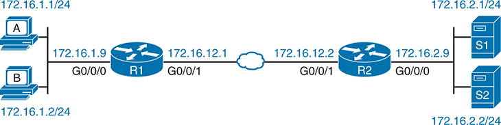
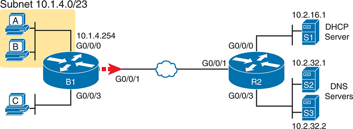
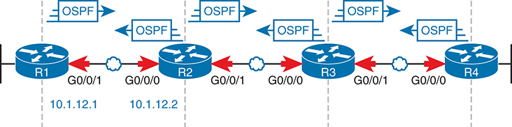
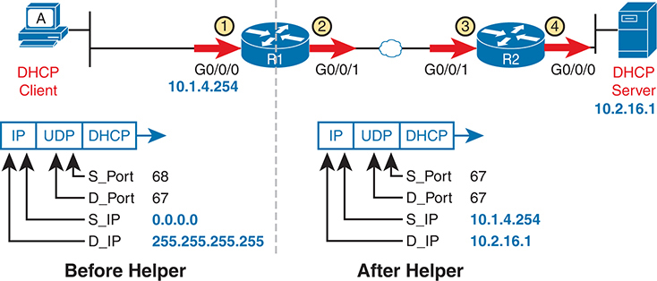
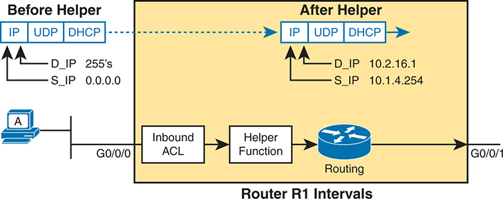
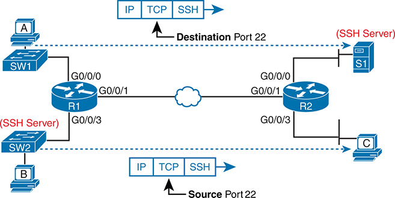
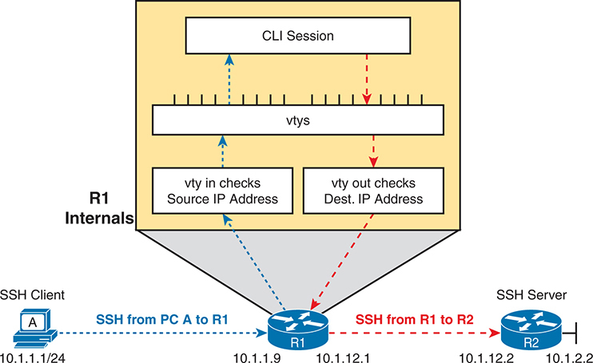
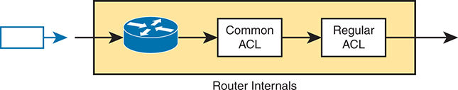

# Chapter 8


## Applied IP ACLs

This chapter covers the following exam topics:

5.0 Security Fundamentals

5.6 Configure and verify access control lists

When you plan a real IP ACL to enable in a production network, the task often becomes large and complex. For instance, imagine you rely on the implied **deny any** logic at the end of the ACL. In doing so, your ACL must include permit commands matching all traffic you want to allow; otherwise, the ACL denies (discards) those packets. If you add a **permit ip any any** command to the end of your extended ACL, making the default to permit traffic, you have the opposite problem: you need to work hard to identify everything you want to deny and match that in your ACL. The complexities increase with multiple network engineers, competing IT interests, and a changing business environment.

This chapter gives you a glimpse into some of the issues you will need to consider when taking that next step. The first section of the chapter examines how to ensure you permit several essential protocols in the network so that later deny ACEs in an ACL do not discard the traffic. For instance, if your ACL matched much of the end-user traffic correctly but forgot about DNS, DHCP, ICMP, and OSPF, discarding those, the network would fail miserably. The first section works through some practical examples that may be useful in your network engineering job and give you deeper skills for the CCNA exam.

The final (short) section discusses some differences between Cisco IOS and IOS XE operating systems regarding IP ACLs. The CCNA exam does not imply any need to know such differences; however, knowing the minor differences can help. Also, that section discusses two features not yet discussed in the ACL chapters—how to use ACL resequencing and how to add a second ACL to an interface—so take the time to read through the final section.

### "Do I Know This Already?" Quiz

Take the quiz (either here or use the PTP software) if you want to use the score to help you decide how much time to spend on this chapter. The letter answers are listed at the bottom of the page following the quiz. [Appendix C](vol2_appc.xhtml#appc), found both at the end of the book as well as on the companion website, includes both the answers and explanations. You can also find both answers and explanations in the PTP testing software.

**Table 8-1** "Do I Know This Already?" Foundation Topics Section-to-Question Mapping

| Foundation Topics Section | Questions |
| --- | --- |
| ACLs and Network Infrastructure Protocols | 1–4 |
| Comparing ACLs in IOS and IOS XE | 5, 6 |





The diagram shows two separate Local Area Networks (L A Ns) on either side of the routers. On the left side, there are two devices labeled A and B connected to subnet 172 dot 16 dot 1 dot 0 slash 24, with I P addresses 172 dot 16 dot 1 dot 9 and 172 dot 16 dot 1 dot 2 respectively. Router R 1 has two interfaces: G 0 slash 0 slash 0 connected to subnet 172 dot 16 dot 1 dot 0 slash 24 and G 0 slash 0 slash 1 connected to the point-to-point link with I P address 172 dot 16 dot 12 dot 1. On the right side, Router R 2 also has two interfaces: G 0 slash 0 slash 1 connected to the same point-to-point link with I P address 172 dot 16 dot 12 dot 2 and G 0 slash 0 slash 0 connected to subnet 172 dot 16 dot 2 dot 0 slash 24, where two servers, S 1 and S 2, are located with I P addresses 172 dot 16 dot 2 dot 9 and 172 dot 16 dot 2 dot 2 respectively. The diagram highlights that Router R 1 has an A C L named Q A underscore 01 applied outbound on interface G 0 slash 0 slash 1. This setup implies that traffic leaving Router R 1 via interface G 0 slash 0 slash 1 is filtered by the specified A C L.

**Refer to This Figure for Questions 1–4**

**[1](vol2_ch08.xhtml#ques8_1a).** Router R1 in the figure uses the ACL below, with the **ip access-group QA\_01 out** interface subcommand added to interface G0/0/1. The router has no other ACL-related configuration. In the output of the **show access-lists** command, which ACL line's counter should increment each time router R1 sends an OSPF Hello?

[Click here to view code image](vol2_ch08_images.xhtml#f0161-01)

```
ip access-list extended QA_01
  10 permit tcp host 172.16.12.1 any eq 520
  20 permit tcp host 172.16.12.1 any
  30 permit ospf host 224.0.0.5 any
  40 permit ospf host 172.16.12.1 any
```

1. Line 10
2. Line 20
3. Line 30
4. Line 40
5. None of the other answers are correct

**[2](vol2_ch08.xhtml#ques8_2a).** In the figure, router R2 enables an ACL inbound on its G0/0/0 interface. Hosts A and B need to lease IP addresses from DHCP server S1. Router R1 provides the IP helper feature with the **ip helper-address 172.16.2.1** subcommand on its G0/0/0 interface. Which answers list an ACE that, if part of the ACL, would match DHCP messages between the server and clients? (Choose two answers.)

1. **permit ip host 172.16.2.1 any**
2. **permit ip any host 172.16.2.1**
3. **permit udp any eq bootps host 0.0.0.0**
4. **permit udp host 172.16.2.1 eq bootpc any**
5. **permit udp host 172.16.2.1 eq bootps any**

**[3](vol2_ch08.xhtml#ques8_3a).** In the figure, router R1 uses standard ACL QA\_03. The ACL has one ACE; the ACE permits packets sourced from subnet 172.16.1.0/24. An engineer wants to filter SSH traffic, so only hosts from subnet 172.16.1.0/24 can SSH into a router. Which answer best describes how the engineer should proceed?

1. Enable the ACL in vty mode with the **access-class QA\_01 in** subcommand.
2. Enable the ACL in vty mode with the **access-class QA\_01 out** subcommand.
3. Enable the ACL in vty mode with the **ip access-group QA\_01 in** subcommand.
4. Enable the ACL in vty mode with the **ip access-group QA\_01 out** subcommand.

**[4](vol2_ch08.xhtml#ques8_4a).** In the figure, an engineer enables ACL QA\_04 inbound on router R1's G0/0/0 interface. Imagine host A attempts to SSH to address 172.16.12.1. Which line in the ACL will the packets match in this scenario?

[Click here to view code image](vol2_ch08_images.xhtml#f0162-01)

```
ip access-list extended QA_04
   10 permit udp 172.16.1.0 0.0.0.255 any eq 22
   20 permit tcp 172.16.1.0 0.0.0.255 any eq 22
   30 deny udp any any eq 22
   40 deny tcp any any eq 22
```

1. Line 10
2. Line 20
3. Line 30
4. Line 40
5. The implied **deny ip any any**

**[5](vol2_ch08.xhtml#ques8_5a).** Before the introduction of the "Common" ACL in IOS XE, which answer is most accurate regarding how many IP ACLs can be enabled on one router?

1. One per router
2. One per router interface
3. One per router interface per direction
4. Two per router interface per direction
5. Many per router interface per direction

**[6](vol2_ch08.xhtml#ques8_6a).** Named ACL QA\_06 has four lines with sequence numbers 10, 20, 30, and 40. As an exercise during a job interview, you are asked to edit the ACL so that the ACEs keep the same relative order but instead use sequence numbers 50, 70, 90, and 110. Which answer lists the method to effect this change with the fewest commands from the CLI?

1. Issue the **ip access-list resequence QA\_06 50 20** command in privileged EXEC mode.
2. Issue the **ip access-list resequence QA\_06 50 20** command in global configuration mode.
3. Delete the entire ACL with the **no ip access-list...** global command and then reconfigure the entire ACL.
4. From ACL mode, delete each **permit** or **deny** command and then reconfigure each.
5. From ACL mode, issue the **resequence 50 20** subcommand.

Answers to the "Do I Know This Already?" quiz:

**[1](vol2_appc.xhtml#ques8_1)** E

**[2](vol2_appc.xhtml#ques8_2)** A, E

**[3](vol2_appc.xhtml#ques8_3)** A

**[4](vol2_appc.xhtml#ques8_4)** B

**[5](vol2_appc.xhtml#ques8_5)** C

**[6](vol2_appc.xhtml#ques8_6)** B

### Foundation Topics

### ACLs and Network Infrastructure Protocols

[Chapter 7](vol2_ch07.xhtml#ch07), "[Named and Extended IP ACLs](vol2_ch07.xhtml#ch07)," completes the discussion of most of the core ACL configuration features. However, the complexity of ACLs comes not from the configuration but from applying the tool to the large variety of networking protocols whose packets run through routers. This first major section of the chapter considers how to match some of those protocols in an ACL. This section discusses how to create ACEs for some of those overhead networking protocols. The topics include

* DNS
* ICMP Echos and Time Exceeded
* Routing Protocols and OSPF
* DHCP
* SSH and Telnet into routers and switches

#### Filtering DNS

DNS messages flow through almost every router interface in an enterprise, so a production-ready IP ACL needs to permit it. The question becomes how permissive to be: to permit all of it, with no restrictions, or be more selective.

First, consider an enterprise with many branches. [Figure 8-1](vol2_ch08.xhtml#ch08fig01) shows an example, with one branch router (B1), on the left, but many more branches exist. The figure shows two DNS servers and the DHCP server used in the upcoming discussions of ACLs and DHCP.




The network begins with three P C s labeled A, B, and C located on the left, connected to a router labeled B 1 through interface G 0 slash 0 slash 0, all within the subnet 10 dot 1 dot 4 dot 0 slash 23. The I P address for the B 1 router is 10 dot 1 dot 4 dot 254. The traffic flows from this router through interface G 0 slash 0 slash 1 to a network cloud, represented by a blue cloud icon in the center of the diagram. On the right side of the network cloud, the traffic reaches another router labeled R 2 through interface G 0 slash 0 slash 1. The R 2 router has multiple interfaces: G 0 slash 0 slash 0 connected to the cloud, G 0 slash 0 slash 1, and G 0 slash 0 slash 3. Interface G 0 slash 0 slash 1 of R 2 connects to a D H C P server labeled S 1 with the I P address 10 dot 2 dot 16 dot 1, serving the subnet 10 dot 2 dot 16 dot 0. Interface G 0 slash 0 slash 3 connects to two D N S servers labeled S 2 and S 3, with I P addresses 10 dot 2 dot 32 dot 1 and 10 dot 2 dot 32 dot 2 respectively, serving the subnet 10 dot 2 dot 32 dot 0. The diagram clearly shows the network segmentation and the role of each server. P C s A, B, and C are connected through router B 1 to the wider network, accessing services such as D H C P and D N S provided by servers S 1, S 2, and S 3 through router R 2.

**Figure 8-1** *Enterprise Branches with DHCP and DNS Servers*

Next, think about planning an ACL so every branch router could use the same ACEs to match DNS traffic. You could begin by choosing the location and direction of each branch router's WAN interface in the outbound direction. As a result, the branch ACLs process packets sent toward the DNS servers.

[Example 8-1](vol2_ch08.xhtml#exa8_1) shows one approach. It ignores all IP addresses, matching source and destination addresses with the **any** keyword. The ACEs match based on these DNS facts:

* DNS uses both UDP and TCP.
* DNS uses well-known server port 53 (ACL keyword **domain**).

**Example 8-1** *Permitting All DHCP Traffic to DNS Servers*

[Click here to view code image](vol2_ch08_images.xhtml#f0163-01)

```
R1# show running-config | section access-list
! ACEs below are part of extended ACL Branch_Common
 50 permit udp any any eq domain
 60 permit tcp any any eq domain
```

Note

The ACLs in the many examples in this section focus on a few ACEs related to each topic. Those ACEs would be part of a much larger ACL.

Assuming no other earlier ACEs matched the DNS packets, the ACEs in the example permit all packets destined to any DNS server, regardless of source and destination address.

[Example 8-2](vol2_ch08.xhtml#exa8_2) shows a more secure alternative using the same location and direction. However, because IT controls the only legitimate DNS servers, the permit ACEs match the legitimate DNS servers' IP addresses (lines 110–140). ACEs 150 and 160 then deny all other traffic to other DNS servers. This two-phase approach strikes a balance of being more restrictive while allowing all legitimate DNS traffic.

**Example 8-2** *Permitting All DHCP Traffic to DHCP and DNS Servers*

[Click here to view code image](vol2_ch08_images.xhtml#f0164-01)

```
R1# show running-config | section access-list
! Excerpt from extended ACL Branch_Common, replacing previous example's ACEs
 110 permit udp any host 10.2.32.1 eq domain
 120 permit udp any host 10.2.32.2 eq domain
 130 permit tcp any host 10.2.32.1 eq domain
 140 permit tcp any host 10.2.32.2 eq domain
! The next lines mimic example 8-1's ACEs, denying DNS (UDP and TCP)
 150 deny udp any any eq domain
 160 deny tcp any any eq domain
```

#### Filtering ICMP

For another interesting networking feature impacted by ACLs, consider the **ping** command detailed in *CCNA 200-301 Official Cert Guide, Volume 1*, [Chapter 20](vol2_ch20.xhtml#ch20), "[Troubleshooting IPv4 Routing](vol2_ch20.xhtml#ch20)." The **ping** command generates ICMP Echo Request messages. A host that responds to those messages generates ICMP Echo Reply messages. Want ping to work? The ACLs must permit all ICMP, or message types for Echo Request and Reply.

For example, consider the case with the branch office router B1 in [Figure 8-1](vol2_ch08.xhtml#ch08fig01), again with an outbound ACL on router B1's G0/0/1 interface. But how much to permit and deny? The following list details three scenarios for ICMP with increasing restrictions. [Example 8-3](vol2_ch08.xhtml#exa8_3), which follows, shows ACEs for the first two scenarios.

1. Taking a one-stage approach: Permitting all ICMP messages
2. Taking a two-stage approach:

   1. Permitting all ICMP messages with source and destination from within the enterprise's private network 10.0.0.0
   2. Denying all other ICMP
3. The same as scenario 2 but permitting ICMP Echo Request and Reply only

**Example 8-3** *ACLs That Implement Two Alternative Approaches*


[Click here to view code image](vol2_ch08_images.xhtml#f0165-01)

```
! The following single ACE achieves scenario 1 above
 210 permit icmp any any

! Alternately, the following two ACEs achieve scenario 2 above
 220 permit icmp 10.0.0.0 0.255.255.255 10.0.0.0 0.255.255.255
 230 deny icmp any any
```

The first ACE, line number 210, matches all ICMP messages. As for the syntax, to match ICMP messages, you do not use the TCP or UDP protocol types. Instead, you use the keyword **icmp**. (ICMP does not use TCP or UDP. Instead, the ICMP header follows directly after the IP header.)

The two-ACE alternative at the end of [Example 8-3](vol2_ch08.xhtml#exa8_3) matches all ICMP but with the added checks for both source and destination addresses. If the enterprise uses private class A network 10.0.0.0, this additional check means only packets sent from and to addresses in that private network match the **permit** statement. ICMP packets with a source or destination outside network 10.0.0.0, such as hosts in the Internet, fail to match line 220 but match line 230, with the router discarding those packets.

[Example 8-4](vol2_ch08.xhtml#exa8_4) shows the ACEs to achieve the third scenario. To match specific ICMP message types, use a keyword after the destination address field, as seen in lines 250 and 260. (The ICMP message type appears after the destination address in the ACE syntax.) Lines 250 and 260 together permit all ICMP Echo Request and Reply messages to/from hosts inside the enterprise's private network 10.0.0.0. The final line discards any other ICMP traffic, not relying on the default **deny any** to discard those packets.

**Example 8-4** *Permitting Internal ICMP Echos, Denying All Other ICMP*

[Click here to view code image](vol2_ch08_images.xhtml#f0165-02)

```
! ACEs for the third ICMP scenario
ip access-list extended icmp_Echo_network_10
 250 permit icmp 10.0.0.0 0.255.255.255 10.0.0.0 0.255.255.255 echo
 260 permit icmp 10.0.0.0 0.255.255.255 10.0.0.0 0.255.255.255 echo-reply
 270 deny icmp any any
```

[Example 8-4](vol2_ch08.xhtml#exa8_4) probably discards too much traffic. One of the significant dangers with ACLs is filtering too much and preventing proper network operation. ICMP defines many message subtypes, with over 50 shown in CLI help in configuration mode. The ACE at line 270 in [Example 8-4](vol2_ch08.xhtml#exa8_4) discards all other ICMP message types, which likely prevents other useful ICMP functions. For example, those ACEs would filter ICMP Time Exceeded messages used by the **traceroute** command so that **traceroute** commands would not complete. The scenario 2 option, configured at the end of [Example 8-3](vol2_ch08.xhtml#exa8_3), might be the better compromise.

#### Filtering OSPF

IP ACLs may discard OSPF messages, but there is no benefit to discarding them. So when you think about OSPF and ACLs, think about matching and permitting all OSPF packets. In particular, avoid unfortunate cases of matching OSPF packets with a deny action—for instance, by matching them with the implied **deny any** at the end of the ACL.

The scope of routing protocol packets impacts what packets an IP ACL might filter. As typical of routing protocol messages, OSPF packets have a short trip through a network. For example, in [Figure 8-2](vol2_ch08.xhtml#ch08fig02), no OSPF packets flow past the dashed lines, and no routers forward any OSPF messages.




The diagram uses standard network symbols for the routers and includes directional arrows to represent the flow of O S P F messages, ensuring a clear visualization of the O S P F communication process between the routers. Each router is connected in a linear sequence, with specific interface identifiers and I P addresses detailed along the connections. Starting from the left, Router R 1 has two interfaces: G 0 slash 0 slash 1 and G 0 slash 0 slash 0, with the G 0 slash 0 slash 1 interface connected to the preceding network segment and the G 0 slash 0 slash 0 interface connecting to Router R 2. Router R 2 also has two interfaces: G 0 slash 0 slash 1, which connects to Router R 1, and G 0 slash 0 slash 0, which connects to Router R 3. This pattern continues with Router R 3, which has interfaces G 0 slash 0 slash 1 (connected to R 2) and G 0 slash 0 slash 0 (connected to R 4). Finally, Router R 4 has interfaces G 0 slash 0 slash 1 (connected to R 3) and G 0 slash 0 slash 0 (connecting to the subsequent network segment). The I P addresses 10 dot 1 dot 12 dot 1 and 10 dot 1 dot 12 dot 2 are associated with the link between R 1 and R 2, respectively. Each connection between routers is marked with bidirectional arrows indicating the exchange of O S P F messages. Additionally, O S P F protocol labels are placed above each connection to emphasize the type of message flow occurring. The diagram uses standard network symbols for the routers and includes directional arrows to represent the flow of O S P F messages.

**Figure 8-2** *OSPF Message Flow Between Routers R1 and R2*

The last new concept when thinking about ACLs and routing protocols has to do with the default IOS behavior without outbound ACLs:

Routers bypass outbound ACLs for local packets (packets generated by the router), including OSPF messages.


Combine that fact with the fact that routers do not forward OSPF packets, and the only ACLs that could discard OSPF messages are inbound ACLs. The arrow lines on the interfaces in [Figure 8-2](vol2_ch08.xhtml#ch08fig02) show ACLs' locations and directions (inbound only) that could match OSPF messages.

Note

IOS XE (but not IOS) allows you to change the behavior of bypassing outbound ACLs for router-generated packets by issuing the **ip access-list match-local-packets** global command.

ACLs should permit OSPF packets. You need to match the packets but not to filter a subset: instead, permit all OSPF messages. To match OSPF packets, use the **ospf** protocol keyword. OSPF does not use UDP or TCP but exists as a protocol whose header follows just after the IP header, so IOS supplies a keyword to match the OSPF protocol.

[Example 8-5](vol2_ch08.xhtml#exa8_5) shows ACEs for two scenarios, both of which expect an inbound ACL on router R1's G0/0/1 WAN interface from [Figure 8-2](vol2_ch08.xhtml#ch08fig02). The example again shows two approaches: permitting all OSPF, or permitting OSPF messages from known neighbors while discarding all other OSPF messages. Summarizing the two scenarios:

1. Taking a one-stage approach: Permitting all OSPF messages
2. Taking a two-stage approach:

   1. Permitting all OSPF messages from router R2's WAN IP address (10.1.12.2)
   2. Denying all other OSPF messages

**Example 8-5** *Two OSPF Scenarios*


[Click here to view code image](vol2_ch08_images.xhtml#f0167-01)

```
! Line 310 for OSPF scenario 1
 310 permit ospf any any
! Alternately, lines 320 and 330 for OSPF scenario 2.
 320 permit ospf host 10.1.12.2 any
 330 deny ospf any any
```

Note

[Appendix D](vol2_appd.xhtml#appd), "[Topics from Previous Editions](vol2_appd.xhtml#appd)," contains some older ACL content beyond the current CCNA exam topics. Some content discusses troubleshooting ACLs, with the rest discussing unexpected behavior with ACLs and router-generated packets. If you want to learn more, refer to the "[Troubleshooting with IPv4 ACLs](vol2_appd.xhtml#appdlev1sec1)" section in [Appendix D](vol2_appd.xhtml#appd).

#### Filtering DHCP

At first glance, you might expect to treat DHCP much the same as DNS regarding ACLs. Most companies use a single DHCP server (with high availability features), or maybe a few, but all have identifiable IP addresses. DHCP messages flow end to end through the network over most network links. DHCP uses a well-known server port (67). Matching DHCP messages on some routers follows the same straightforward logic you learned for web servers and DNS earlier in the chapter. However, applying ACLs for DHCP packets on the same router that performs the IP helper function has some unexpected rules.

For context, consider [Figure 8-3](vol2_ch08.xhtml#ch08fig03), with DHCP clients on the left and a DHCP server on the right. The figure highlights four possible locations to consider for ACLs that would match packets headed toward the DHCP server. (You could also filter in the other direction; I just chose the left-to-right flow for the examples.) At all ACL locations and directions shown in the figure, the packets have a destination UDP port number of 67. However, the addresses differ based on the location in the network due to the IP helper feature on router R1.




On the left side of the diagram, labeled Before Helper, a D H C P client at I P address 10 dot 1 dot 4 dot 254 sends a D H C P Discover message through interface G 0 slash 0 slash 0 of router R 1. The packet's source port is 68, destination port is 67, source I P is 0 dot 0 dot 0 dot 0, and destination I P is 255 dot 255 dot 255 dot 255. The packet flows through R 1's G 0 slash 0 slash 1 interface to reach the next segment of the network. On the right side, labeled After Helper, the packet's source I P changes to 10 dot 1 dot 4 dot 254 and the destination I P is updated to 10 dot 2 dot 16 dot 1 after passing through the D H C P relay agent configured on R 1. The packet then traverses interface G 0 slash 0 slash 1 on router R 2 towards the D H C P server, eventually reaching the D H C P server at I P address 10 dot 2 dot 16 dot 1 via interface G 0 slash 0 slash 0.

**Figure 8-3** *ACL Locations to Consider: Packets to DHCP Server*


Now consider the straightforward case, on router R2, with ACL locations three and four in the figure. R2 does not perform the helper function, so you can match based on the well-known DHCP server port and the server's IP address. You can also use the same options discussed earlier for DNS servers with [Examples 8-1](vol2_ch08.xhtml#exa8_1) and [8-2](vol2_ch08.xhtml#exa8_2). [Example 8-6](vol2_ch08.xhtml#exa8_6) shows similar ACEs as seen in [Example 8-2](vol2_ch08.xhtml#exa8_2) for DNS. The ACL would be useful on router R2 in location three or four per [Figure 8-3](vol2_ch08.xhtml#ch08fig03):

* **One-stage:** Permit all DHCP messages going toward a DHCP server (port 67).
* **Two-stage:** First, permit all DHCP messages to the legitimate DHCP server and then filter (deny) all other messages to DHCP servers.

**Example 8-6** *Permitting All DHCP Traffic to DNS Servers on Router Main*


[Click here to view code image](vol2_ch08_images.xhtml#f0168-01)

```
R2# show running-config section access-list
! Option 1: Allow all packets destined to DHCP server port (bootps 67)
 240 permit udp any any eq bootps
! Option 2: permit DHCP to known server and discard other messages sent to DHCP 67
 250 permit udp any host 10.2.16.1 eq bootps
 260 deny udp any any eq bootps
```

However, the ACL matching logic for DHCP differs on the router that performs the helper function. In particular:


1. By default, packets changed by a router due to the **ip helper-address** command bypass any outgoing ACL.
2. On a router interface with both an inbound ACL and the helper function, the router performs the ACL function first, before the helper function changes the IP addresses in DHCP messages.

For the first of those rules, consider ACL location two in [Figure 8-3](vol2_ch08.xhtml#ch08fig03), the outbound ACL on R1's WAN interface. Per the first rule here, that ACL has not considered DHCP messages processed by router R1's IP helper function. R1 uses that function for DHCP clients like host A on the left side of [Figure 8-3](vol2_ch08.xhtml#ch08fig03). Router R1 processes those incoming DHCP messages with the helper function, changes the source and destination address, and bypasses the outbound ACL.

Note that this default behavior on the IP helper router works well. You probably want to permit DHCP messages sent to the legitimate DHCP server you configured in the **ip helper-address** command, and those messages bypass any outbound ACL you enable there.

For the second rule about inbound ACLs, consider [Example 8-7](vol2_ch08.xhtml#exa8_7)'s configuration for router R1's LAN interface. It shows the **ip helper-address** command along with an enabled inbound ACL.

**Example 8-7** *Router R1 LAN Interface: Interactions with Inbound ACL and Helper*

[Click here to view code image](vol2_ch08_images.xhtml#f0168-02)

```
R1# show running-config
(Lists relevant excerpts…)
interface GigabitEthernet0/0/0
  ip address 10.1.4.254 255.255.254.0
  ip helper-address 10.2.16.1
  ip access-group R1_Common in
!
! ACL excerpt: permit packets with unusual source/destination addresses to DHCP server
250 permit udp host 0.0.0.0 host 255.255.255.255 eq bootps
260 deny udp any any eq bootps
```

As noted in the second rule, IOS applies the inbound ACL logic before performing the helper function, as depicted by the ACL at location one in [Figure 8-4](vol2_ch08.xhtml#ch08fig04). Because of that, any matching based on IP address must match the unusual IP addresses shown on the left side of [Figure 8-4](vol2_ch08.xhtml#ch08fig04). (You could always choose to match the addresses with the **any** keyword, ignoring the addresses.) Just be aware that if you attempt to match based on IP address, you must match the addresses that exist before the router applies the helper function.




On the left side, a device labeled A is connected to the router via interface G 0 slash 0 slash 0. The packet before reaching the helper function is shown as a sequence of protocol headers: I P, U D P, and D H C P, with the destination I P (D underscore I P) set to the broadcast address 255 dot 255 dot 255 dot 255 and the source I P (S underscore I P) set to 0 dot 0 dot 0 dot 0. The packet then enters the router, where it first encounters the Inbound A C L. The diagram shows that after passing through the Inbound A C L, the packet reaches the Helper Function. The Helper Function modifies the packet's destination I P address to 10 dot 2 dot 16 dot 1 and the source I P address to 10 dot 1 dot 4 dot 254. This transformation is indicated by a dashed arrow labeled After Helper, showing the updated packet with headers I P, U D P, and D H C P and the new I P addresses. The modified packet then proceeds to the routing process within the router, where it is directed out through interface G 0 slash 0 slash 1. The overall flow demonstrates how the inbound A C L processes packets first, followed by the I P Helper function that alters specific packet fields for D H C P relay purposes. The yellow background highlights the area within the router where these operations occur, emphasizing the sequence and transformation of the packet as it traverses Router R 1.

**Figure 8-4** *Order of Operations: Inbound ACL and IP Helper*

#### Filtering SSH and Telnet

SSH and Telnet both give users a way to connect to the command-line interface of different operating systems. Telnet, the older of the two, is much less secure, which is why most people prefer SSH today.

When thinking about ACLs and the SSH and Telnet protocols, you should consider them for the usual interface ACLs just as with the other protocols discussed so far in this chapter. Additionally, routers and switches support Telnet and SSH, with IOS providing another method to enable an ACL to protect that specific function. First, this topic examines SSH/Telnet for packets passing through the router, matched with interface ACLs, and then it examines the [vty ACL](vol2_gloss.xhtml#gloss_371) feature that filters router SSH/Telnet access.

##### Filtering for End User SSH/Telnet

IT staff, and possibly some end users, may need to use SSH and Telnet to connect to a command line (shell) prompt on servers in the network. So if you plan to add an ACL on an interface, it will need to consider the Telnet and SSH protocols.

SSH and Telnet use TCP, with well-known ports 22 and 23, respectively. As a result, you can easily match both ports in one ACE using the **range 22 23** parameters in a **permit** command. (Note that IOS, as usual, changes some numeric port numbers to keywords—in this case, changing 23 to **telnet**.)

[Example 8-8](vol2_ch08.xhtml#exa8_8) shows two sets of ACEs, similar to a few other examples. The first shows a more general permit of SSH and Telnet traffic, while the second adds more restrictions.

1. One-stage: Permitting all SSH and Telnet messages going toward a server
2. Two-stage:

   1. Permitting all SSH and Telnet messages moving toward a server, with source and destination addresses from within the enterprise's private network 10.0.0.0
   2. Denying all other SSH and Telnet

**Example 8-8** *ACEs for the Two SSH and Telnet Scenarios for Host-Based Servers*


[Click here to view code image](vol2_ch08_images.xhtml#f0170-01)

```
! The following single ACE achieves SSH/Telnet scenario 1 above
 410 permit tcp any any range 22 telnet

! Alternately, the following two ACEs achieve SSH/Telnet scenario 2 above
 450 permit tcp 10.0.0.0 0.255.255.255 10.0.0.0 0.255.255.255 range 22 telnet
 470 deny tcp any any range 22 telnet
```

The sample ACEs in [Example 8-8](vol2_ch08.xhtml#exa8_8) work to permit SSH and Telnet traffic when you know where all servers are. If you plan an ACL that matches packets moving toward the servers, you can then rely on matching the destination port. Conversely, if the plan enables the ACL for packets sent from the server to the client, you can check the well-known source ports.

However, with Telnet and SSH, you can seldom know where all SSH servers reside. All the routers and switches and many other IT devices support SSH or Telnet (or both). For instance, consider [Figure 8-5](vol2_ch08.xhtml#ch08fig05). Host A uses SSH to connect to server S1, and host C connects to the switch SW2 SSH server. An outbound ACL on router R1's WAN interface (G0/0/1) would examine packets destined to SSH server S1 and also packets sourced from the SSH server in switch SW2. Packets flowing from the SW2 SSH server back to SSH client C will have a well-known source port of 22.




The diagram features two routers, R 1 and R 2, connected through a network, with various devices and switches on each side. On the left, two devices labeled A and B are connected to switches S W 1 and S W 2, respectively. Device A connects to S W 1, which in turn connects to Router R 1's interface G 0 slash 0 slash 0. Device B connects to S W 2, which is labeled as an S S H Server and is also connected to Router R 1's interface G 0 slash 0 slash 3. Router R 1 has another interface, G 0 slash 0 slash 1, connected to the point-to-point link towards Router R 2. On the right side, Router R 2 is similarly connected with interfaces G 0 slash 0 slash 1 to the point-to-point link and G 0 slash 0 slash 3 to a switch that connects to an S S H Server labeled S 1. Another device labeled C connects to the same switch. The diagram emphasizes the flow of I P, T C P, and S S H traffic with directional arrows. These arrows indicate the necessity to match S S H traffic on both the destination port 22 and source port 22, emphasizing the bidirectional nature of the S S H communication.

**Figure 8-5** *The Need to Match Both Directions for SSH and Telnet Traffic*

As a result, the choice to match SSH and Telnet by port number probably means you should match for both directions—that is, check for the source or destination port. [Example 8-9](vol2_ch08.xhtml#exa8_9) shows expanded sets of ACEs versus [Example 8-8](vol2_ch08.xhtml#exa8_8). The original ACEs checked for the SSH and Telnet destination ports, while the new lines also check for the SSH and Telnet source ports. In the new (highlighted) lines, pay close attention to the location of the **range 22 telnet** parameters.

**Example 8-9** *Updated SSH/Telnet ACEs to Add Checks for Both Directions*

[Click here to view code image](vol2_ch08_images.xhtml#f0171-01)

```
! SSH/Telnet scenario 1, revised for packets both to and from the server
 410 permit tcp any any range 22 telnet
 420 permit tcp any range 22 telnet any

! SSH/Telnet scenario 2, revised for packets both to and from the server
 450 permit tcp 10.0.0.0 0.255.255.255 10.0.0.0 0.255.255.255 range 22 telnet
 460 permit tcp 10.0.0.0 0.255.255.255 range 22 telnet 10.0.0.0 0.255.255.255
 470 deny tcp any any range 22 telnet
 480 deny tcp any range 22 telnet any
```

##### Filtering for Router VTY Access

IOS provides another feature to protect CLI access further by using a vty ACL enabled by the **access-class** command in vty configuration mode. When a user connects to a router or switch using Telnet or SSH, IOS associates a vty line with that user connection. IOS can apply an ACL to the vty lines, filtering the addresses that can telnet or SSH into the router or switch. [Figure 8-6](vol2_ch08.xhtml#ch08fig06) shows the concept, with a network engineer at host A logging in to router R1 using SSH. The box above the router R1 icon represents the router's internal logic.




The diagram starts with a depiction of an S S H client, labeled A, on the left, with the I P address range 10 dot 1 dot 1 dot 1 slash 24. This client initiates an S S H connection to a router labeled R 1, specifically to the I P address 10 dot 1 dot 1 dot 9. The connection is illustrated with a blue dashed line labeled S S H from P C A to R 1. The router R 1 has internal details shown in a highlighted box labeled R 1 Internals. This box illustrates the Command Line Interface (C L I) session at the top, and below it, a series of virtual terminal lines (v t y s). The v t y in checks the source I P address, which is part of the A C Ls' role to verify incoming traffic. This checking process is visually represented by a blue dashed line from P C A to R 1. The diagram also shows another connection from router R 1 to an S S H server labeled R 2, with the I P address 10 dot 1 dot 1 dot 2. This connection is depicted with a red dashed line labeled S S H from R 1 to R 2. The v t y out checks the destination I P address, part of the A C Ls' role to verify outgoing traffic from R 1 to R 2. The R 1 router handles these connections through its internal processing, which includes both the incoming and outgoing checks, ensuring that the traffic complies with the defined I P A C Ls. The lower section of the diagram details the network setup. The S S H client (P C A) is on the subnet 10 dot 1 dot 1 dot 0 slash 24, the router R 1 resides on the I P address 10 dot 1 dot 1 dot 9, and the S S H server (R 2) is on the I P address 10 dot 1 dot 1 dot 2.

**Figure 8-6** *IP ACLs and the Router's Internal SSH/Telnet Servers*


First, consider a vty ACL enabled for the inbound direction, which examines packets for SSH/Telnet clients attempting to log in to a router. You can use either a standard or extended ACL for a vty ACL, but a standard ACL works well. A vty ACL is not an interface ACL. Independent of the ACL matching logic, IOS applies these rules to vty ACLs:

* Consider only packets sent to the router's IP addresses on working interfaces.
* Consider only packets destined for the SSH (port 22) or Telnet (port 23) servers.

Beginning with those limits, the only other helpful match to make is the SSH/Telnet clients' IP addresses. A standard ACL works well for that.

For example, imagine all networking staff have IP addresses in subnet 10.1.1.0/24. As an extra precaution, you configure a vty ACL to permit SSH/Telnet from clients in that subnet but deny all other source addresses. [Example 8-10](vol2_ch08.xhtml#exa8_10) shows the configuration of the complete ACL on router R1 in [Figure 8-6](vol2_ch08.xhtml#ch08fig06) and how to enable it in vty mode using the **access-class** command.

**Example 8-10** *vty Access Control Using the **access-class in** Command*


[Click here to view code image](vol2_ch08_images.xhtml#f0172-01)

```
line vty 0 15
 transport input all
 access-class IT_only in
!
ip access-list standard IT_only
 10 remark matches packets sourced from subnet 10.1.1.0/24 only; implied deny any
 10 permit 10.1.1.0 0.0.0.255
```

IOS uses the **access-class** *acl* **in** vty subcommand to enable the function. The keyword **in** refers to Telnet and SSH connections into this router. As configured, ACL **IT\_only** permits packets with source addresses from the IT subnet and denies all others due to the implied **deny any** at the end of the list. Note that the command to enable the ACL, **access-class**, used in vty mode, is a different command and mode than is used to enable ACLs on interfaces.

Inbound vty ACLs are popular, but IOS also supports the less common outbound vty ACL. The outbound option works in cases for which a current SSH/Telnet user at the CLI uses the **ssh** or **telnet** EXEC command to connect to the CLI of another device. For instance, in [Figure 8-6](vol2_ch08.xhtml#ch08fig06), the user at host A could SSH to router R1. Once logged in, if that user then used the **ssh** or **telnet** EXEC command to attempt to connect to router R2, IOS would apply the outbound vty ACL to that connection request.

To use an outbound vty ACL, create an ACL and enable it with the **access-class** *acl* **out** command in vty configuration mode. As with inbound vty ACLs, IOS processes limited packets (those sourced from router IP addresses) and destined for the SSH or Telnet well-known ports.

Standard ACLs often work well for outbound vty ACLs, but with a surprising twist. When used as an outbound vty ACL, IOS compares the standard IP ACL address parameters to the *destination IP address of the packet* rather than the source address. That is, it filters based on the device to which the **telnet** or **ssh** command tries to connect. [Example 8-11](vol2_ch08.xhtml#exa8_11) demonstrates with an outbound vty ACL that permits only address 10.1.12.1, but not 10.1.2.2. The example shows the failed SSH attempt and IOS error message, followed by the successful attempt.

**Example 8-11** *vty Access Control Outbound on Router R1*

[Click here to view code image](vol2_ch08_images.xhtml#f0173-01)

```
! Configuration excerpt first
line vty 0 15
 transport input all
 access-class R2_WAN out
!
ip access-list standard R2_WAN
  10 permit host 10.1.12.1
!
! An attempt denied by the ACL to router R2's far-side LAN IP address
R1# ssh -l wendell 10.1.12.2
% Connections to that host not permitted from this terminal

! An attempt permitted by the ACL, resulting in password prompt from router R2.
R2# ssh -l wendell 10.1.12.1
Password:

R2>
```

On a final note, outbound vty ACLs also support extended ACLs, but with the logic you would expect. It matches the source address parameters to the packet source address and the destination address parameters to the destination address.

### Comparing ACLs in IOS and IOS XE

Cisco added ACLs to IOS in the early days of the company. Over many decades, Cisco has added ACL features and commands over many IOS versions. Cisco has added some features and command options to IOS XE that differ from IOS over time.

This final section of the chapter summarizes some of the current differences between the recent versions of IOS and IOS XE in early 2023 when I most recently revised this chapter. I did not choose to add this section because of any exam topic. More generally, the exam topics do not mention any need to compare ACLs on IOS versus IOS XE. Cisco historically avoids asking anything to do with IOS software versions. However, you may practice ACLs with IOS, but then an exam question may use output from IOS XE, or vice versa. This short section summarizes some of the differences to prepare you. The goal is for you to be comfortable if you see minor differences in an ACL exam question versus what you see during your study time.

This section first summarizes the differences and then discusses two ACL features that behave differently on IOS than on IOS XE: sequence number resequencing and the common ACL.

#### Configuration Syntax and Show Commands

The original numbered IP ACLs used global commands, specifically the **access-list** global command. Later, IOS added support for ACL mode, which can be reached with the **ip access-list** command, with subcommands to define the detail. Informally, consider those two options as global mode and ACL mode.

[Table 8-2](vol2_ch08.xhtml#ch08tab02) lists some of the differences between ACL support in IOS versus IOS XE. The ACL chapters in this book have mentioned several of these similarities and differences in context, but the table organizes them for easy reference. Note that the table also lists a few similarities to provide more context.

**Table 8-2** ACL Differences with IOS and IOS XE

| Feature | IOS | IOS XE |
| --- | --- | --- |
| Numbered ACLs: Allows configuration with global commands | Yes | Yes |
| Numbered ACLs: Allows configuration with ACL mode commands for easy ACL editing | Yes | Yes |
| Numbered ACLs: **running-config** shows ACL as global commands[\*](vol2_ch08.xhtml#tfn8_2_1a) | Yes | No |
| Named ACLs: Configured and stored as ACL mode commands | Yes | Yes |
| Named ACLs: **show running-config** lists sequence numbers | No | Yes |
| Named ACLs: **show access-lists** lists sequence numbers | Yes | Yes |
| Resequences ACL sequence numbers on reload by default[\*\*](vol2_ch08.xhtml#tfn8_2_2a) | Yes | No |
| Supports second (common) ACL per interface/direction | No | Yes |
| Allows matching multiple nonconsecutive ports with **eq** | No | Yes |

[\*](vol2_ch08.xhtml#tfn8_2_1) IOS stores the commands as global commands, while IOS XE stores them as ACL mode commands, regardless of configuration style.

[\*\*](vol2_ch08.xhtml#tfn8_2_2) XE can be configured to resequence ACLs on reload, but by default, it does not.

Working through the table, the first two rows confirm that IOS and IOS XE allow configuring numbered ACLs with the original-style global commands or ACL mode subcommands. The third line shows the difference: IOS stores the configuration as globals, but IOS XE stores them as ACL mode subcommands—no matter how you configured them.

The next three rows (unhighlighted) reveal similar features for named ACLs. The one difference: IOS XE reveals ACL sequence numbers in **show running-config** command output, while IOS does not. IOS requires the **show access-lists** or **show ip access-lists** commands to see the sequence numbers.

The final topics of this chapter discuss the remaining rows in the table, which list features that differ between IOS and IOS XE.

#### Resequencing ACL Sequence Numbers

You have seen many examples of ACL sequence numbers in this chapter and the preceding chapter. For instance, if you ignore them when configuring, IOS (and IOS XE) adds them for you, beginning at 10. IOS (and IOS XE) assigns sequence numbers to each successive **permit** or **deny** command in increments of 10. Alternatively, you can choose your sequence numbers with commands that begin the sequence number before the **permit** or **deny** command. You can also delete lines and add new ones using sequence numbers.

At one point in the history of IOS, Cisco decided to add [ACL resequencing](vol2_gloss.xhtml#gloss_026) features. First and foremost, IOS will resequence ACL sequence numbers automatically at reload and that behavior continues today for IOS. So, for IOS, when you reload the router, IOS changes the sequence numbers of all ACEs in each ACL. It gives the first ACE sequence number 10, the next 20, and so on, with an increment of 10. For instance, an ACL with ACEs numbered 10, 30, and 60 before the reload would have the same ACEs in the same order after reload but with sequence numbers 10, 20, and 30.

Additionally, IOS supports manual ACL resequencing. The **ip access-list resequence** *name|number first increment* global configuration command performs the task, for one specific ACL, with the listed initial sequence number and increment. For instance, imagine the ACL named acl\_01 had three **permit** commands with line numbers 10, 30, and 60 again. [Example 8-12](vol2_ch08.xhtml#exa8_12) shows the results of the **ip access-list resequence acl\_01 100 20** global command. The last two parameters define the first sequence number as 100 with increments of 20. (Both IOS and IOS XE support resequencing, as shown in the example.)

**Example 8-12** *Resequencing ACLs with the **ip access-list resequence** Global Command*


[Click here to view code image](vol2_ch08_images.xhtml#f0175-01)

```
R1# configure terminal
R1(config)# ip access-list resequence acl_01 100 20
R1(config)# do show access-list acl_01
Extended IP access list acl_01
    100 permit ip 10.1.4.0 0.0.1.255 any
    120 permit ip 10.2.4.0 0.0.1.255 any
    140 permit ip 10.0.0.0 0.255.255.255 10.0.0.0 0.255.255.255
```

IOS and IOS XE differ with automatic resequencing. IOS always resequences at any restart (the **reload** command or power off/on), while IOS XE does not resequence at restart. IOS XE calls its approach [ACL persistence](vol2_gloss.xhtml#gloss_025), configured by the (default) global command **ip access-list persistent**. IOS XE allows the same resequencing behavior as IOS by disabling ACL persistence with the **no ip access-list persistent** global command.

ACL sequence number persistence, the default with IOS XE, makes sense. You can choose to renumber your ACLs only when desired and use different numbering plans other than starting at 10 and incrementing by 10.

#### Using a Second (Common) Interface ACL

For the long history of ACL support in Cisco IOS, the following rule dictates how many router ACLs you can enable on an interface:

One ACL per layer three protocol, per direction, per interface.

For instance, today, the most common Layer 3 protocols in enterprise routers are IPv4 and IPv6. On any router interface, the router supports one IPv4 ACL inbound, one IPv4 ACL outbound, one IPv6 ACL inbound, and one IPv6 ACL outbound. Do you need all those at once? Seldom. More importantly, you cannot configure logic with multiple ACLs enabled on one interface in one direction to be processed one after the other. Instead, you have to put all the ACEs into one ACL.

IOS XE breaks that mold allowing two IPv4 ACLs on an interface in the same direction. Cisco refers to the first ACL as the [common ACL](vol2_gloss.xhtml#gloss_082), with the second as the *regular ACL*. However, both ACLs still use the same syntax and logic as before. The router optimizes internal processing, but the result is that it matches packets as if it first matched the common ACL and then the regular ACL, as shown in [Figure 8-7](vol2_ch08.xhtml#ch08fig07).





The diagram is enclosed in a rectangular box labeled Router Internals, representing the internal components of the router. Starting from the left, an incoming packet enters the router, symbolized by a blue arrow pointing towards the router icon. The packet first passes through the router, depicted by a standard network router symbol. Within the router internals, the packet encounters the first filtering stage, labeled Common A C L. This represents an Access Control List that applies common rules shared across multiple interfaces or directions. After passing through the Common A C L, the packet proceeds to the second filtering stage, labeled Regular A C L, which represents an Access Control List with specific rules tailored to the particular interface or direction. The flow continues with the packet exiting the router internals, indicated by a black arrow pointing outwards to the right. The entire process is encapsulated within a shaded area that signifies the router's internal processing mechanism, clearly delineating the sequence of A C L application from the entry to the exit point of the packet within the router.

**Figure 8-7** *Two ACLs per Interface per Direction with a Common ACL*

You still use the **ip access-group** command to enable the two ACLs, but with different syntax. [Example 8-13](vol2_ch08.xhtml#exa8_13) shows how to enable two ACLs outbound on some router's G0/0/1 interface and confirms the enabled ACLs with the **show ip interface** command. You may want to compare this output to the same command's output in [Example 6-2](vol2_ch06.xhtml#exa6_2) from [Chapter 6](vol2_ch06.xhtml#ch06), "[Basic IPv4 Access Control Lists](vol2_ch06.xhtml#ch06)," taken from IOS, so it does not mention a common ACL. The output here confirms an outgoing common and regular ACL but no incoming ACLs.

**Example 8-13** *Enabling Two IP ACLs, Outbound*

[Click here to view code image](vol2_ch08_images.xhtml#f0176-01)

```
R1# configure terminal
R1(config-if)# interface gigabitEthernet 0/0/1
R1(config-if)# ip access-group common common_all unique_01 out
R1(config-if)# do show ip interface g0/0/1
GigabitEthernet0/0/1 is up, line protocol is up
  Internet address is 10.1.12.1/24
  Broadcast address is 255.255.255.255
  Address determined by non-volatile memory
  MTU is 1500 bytes
  Helper address is not set
  Directed broadcast forwarding is disabled
  Multicast reserved groups joined: 224.0.0.5 224.0.0.10 224.0.0.6
  Outgoing Common access list is common_all
  Outgoing access list is unique_01
  Inbound Common access list is not set
  Inbound access list is not set
```

Note that the addition of the common ACL feature does not improve what you can match with an ACL; instead, Cisco's motivation for this feature stems from a need to conserve entries in tables used by hardware ASICs in multilayer switches and in some routers. The first **ip access-group** command that enables a common ACL requires table entries for the common ACL's ACEs. But the router or switch can reuse those. So, any repeated **ip access-group** command that enables the same common ACL does not require additional ASIC table entries, reducing the consumption of that resource.

Note

IOS allows one **ip access-group** subcommand for each direction, but no more—regardless of whether the commands refer to a common ACL. For example, with an existing **ip access-group fred out** interface subcommand, configuring the **ip access-group common wilma betty out** subcommand on the interface replaces the existing command.

#### Matching Multiple Nonconsecutive Ports with eq

When matching TCP and UDP port numbers, Cisco ACLs have long supported matching a single port with the **eq** *number* parameters or a range of consecutive ports with the **range** *first-last* parameters. However, to match multiple nonconsecutive ports, the syntax required multiple ACEs.

IOS XE adds syntax and logic to match up to ten port numbers after the **eq** keyword in a single ACE. For instance, the command **permit tcp any any eq 10 12 14 16 18 20** matches all IP packets that have a TCP header, with any of the port numbers. In other words, IOS XE uses a logical OR between the port numbers, so it would match port 10, or 12, or 14, and so on.

### Chapter Review

One key to doing well on the exams is to perform repetitive spaced review sessions. Review this chapter's material using either the tools in the book or interactive tools for the same material found on the book's companion website. Refer to the "[Your Study Plan](vol2_appf.xhtml#appf)" element for more details. [Table 8-3](vol2_ch08.xhtml#ch08tab03) outlines the key review elements and where you can find them. To better track your study progress, record when you completed these activities in the second column.

**Table 8-3** Chapter Review Tracking

| Review Element | Review Date(s) | Resource Used |
| --- | --- | --- |
| Review key topics |  | Book, website |
| Review key terms |  | Book, website |
| Repeat DIKTA questions |  | Book, PTP |
| Review memory tables |  | Book, website |
| Review command tables |  | Book |

### Review All the Key Topics


**Table 8-4** Key Topics for [Chapter 8](vol2_ch08.xhtml#ch08)

| Key Topic Element | Description | Page Number |
| --- | --- | --- |
| [Example 8-3](vol2_ch08.xhtml#exa8_3) | Two alternative approaches for permitting some ICMP traffic | [165](vol2_ch08.xhtml#page_165) |
| Paragraph | Router logic for outbound ACL bypass for local packets | [166](vol2_ch08.xhtml#page_166) |
| [Example 8-5](vol2_ch08.xhtml#exa8_5) | Two alternative approaches for permitting OSPF traffic | [167](vol2_ch08.xhtml#page_167) |
| [Figure 8-3](vol2_ch08.xhtml#ch08fig03) | Addresses and port numbers in DHCP, before and after the DHCP helper function | [167](vol2_ch08.xhtml#page_167) |
| [Example 8-6](vol2_ch08.xhtml#exa8_6) | Two alternative approaches for permitting DHCP traffic | [168](vol2_ch08.xhtml#page_168) |
| List | Special rules that affect ACL processing for DHCP on a router using the **ip helper-address** command | [168](vol2_ch08.xhtml#page_168) |
| [Example 8-8](vol2_ch08.xhtml#exa8_8) | Two alternative approaches for permitting SSH traffic routed by a router | [170](vol2_ch08.xhtml#page_170) |
| [Figure 8-6](vol2_ch08.xhtml#ch08fig06) | Vty ACL concepts | [171](vol2_ch08.xhtml#page_171) |
| [Example 8-10](vol2_ch08.xhtml#exa8_10) | Inbound vty ACL | [172](vol2_ch08.xhtml#page_172) |
| [Example 8-12](vol2_ch08.xhtml#exa8_12) | Demonstrating ACL resequencing by command | [175](vol2_ch08.xhtml#page_175) |

### Key Terms You Should Know

[ACL persistence](vol2_ch08.xhtml#key_095)

[ACL resequencing](vol2_ch08.xhtml#key_096)

[Common ACL](vol2_ch08.xhtml#key_097)

[vty ACL](vol2_ch08.xhtml#key_098)

### Command References

[Tables 8-5](vol2_ch08.xhtml#ch08tab05) and [8-6](vol2_ch08.xhtml#ch08tab06) list configuration and verification commands used in this chapter. As an easy review exercise, cover the left column in a table, read the right column, and try to recall the command without looking. Then repeat the exercise, covering the right column, and try to recall what the command does.

The tables list commands introduced in this chapter; refer to [Chapters 6](vol2_ch06.xhtml#ch06) and [7](vol2_ch07.xhtml#ch07) for more documentation on commands related to IP ACLs.

**Table 8-5** [Chapter 8](vol2_ch08.xhtml#ch08) ACL Configuration Command Reference

| Command | Description |
| --- | --- |
| **access-list** *access-list-number* {**deny** | **permit**} **ospf** *source source-wildcard destination destination-wildcard* [**log**] | A version of the **access-list** command that matches all OSPF messages. |
| *[sequence-number]* {**deny** | **permit**} **ospf** *source source-wildcard destination destination-wildcard* [**log**] | The equivalent of the previous row's command but in ACL mode. |
| **access-list** *access-list-number* {**deny** | **permit**} **icmp** *source source-wildcard destination destination-wildcard* [*icmp-message*] | A version of the **access-list** command that matches ICMP with the option to list the specific ICMP message type. |
| *[sequence-number]* {**deny** | **permit**} **icmp** *source source-wildcard destination destination-wildcard* [*icmp-message*] | The equivalent of the previous row's command but in ACL mode. |
| **ip access-list resequence** *name|number initial increment* | Global command to resequence ACL sequence numbers, beginning with the initial value, and adding the increment to get each successive sequence number. |
| **[no] ip access-list persistent** | Global command to toggle on (without the **no**; default) or off (with the **no**) ACL sequence number persistence. IOS XE only. |
| **ip access-group common** *common\_acl regular\_acl* {[**in** | **out**]} | Interface subcommand, which allows two ACLs to be enabled simultaneously on one interface and direction. IOS XE only. |


**Table 8-6** [Chapter 8](vol2_ch08.xhtml#ch08) EXEC Command Reference

| Command | Description |
| --- | --- |
| **ssh -l** *username address|hostname* | Initiates an SSH client connection from the CLI to another device at the listed address or hostname, using the listed username to log in |
| **telnet** *address|hostname* | Initiates a Telnet client connection from the CLI to another device at the listed address or hostname |
| **show ip access-lists** [*access-list-number* | *access-list-name*] | Shows IP access lists |