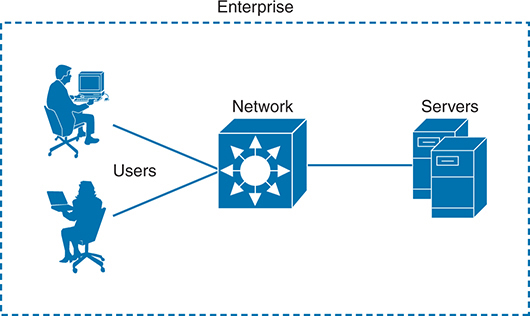
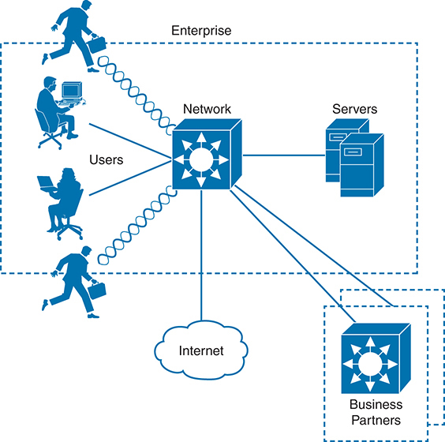
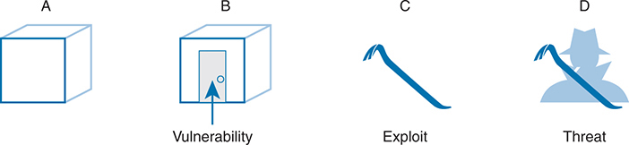
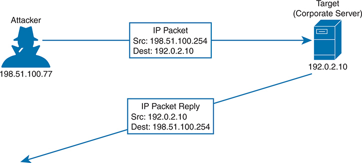
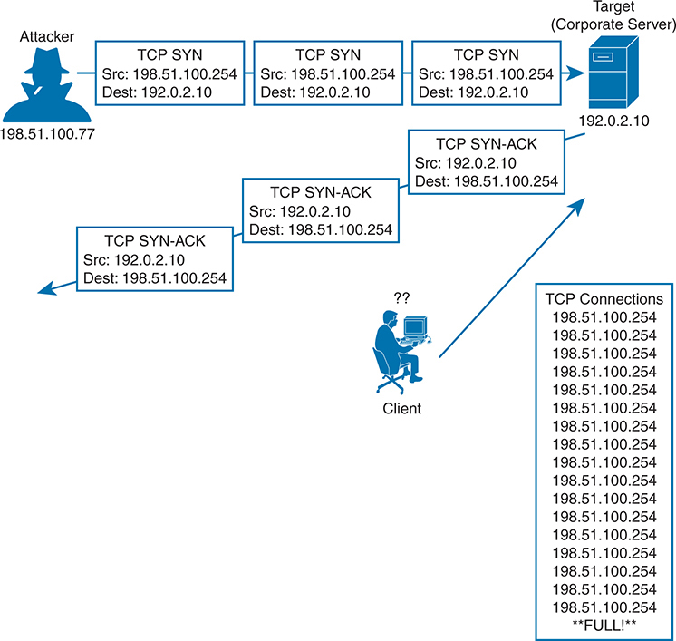
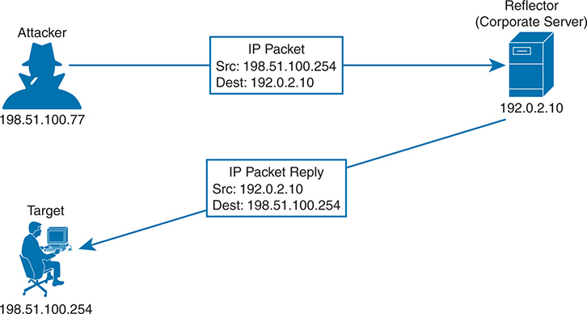
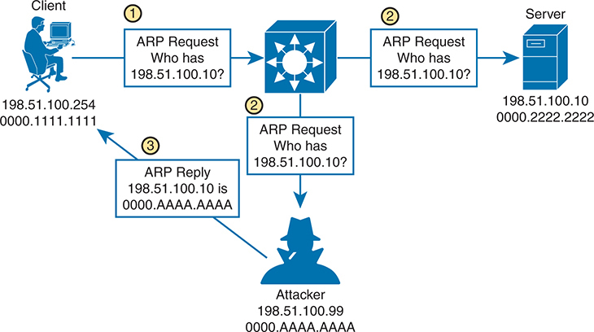
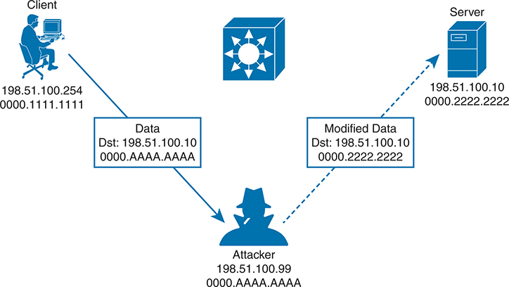
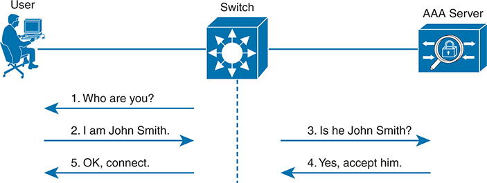

# Chapter 9

## Security Architectures

This chapter covers the following exam topics:

5.0 Security Fundamentals

5.1 Define key security concepts (threats, vulnerabilities, exploits, and mitigation techniques)

5.2 Describe security program elements (user awareness, training, and physical access control)

5.4 Describe security password policies elements, such as management, complexity, and password alternatives (multifactor authentication, certificates, and biometrics)

5.8 Compare authentication, authorization, and accounting concepts

As you have learned about various networking technologies, your attention has probably been focused on using network devices to build functional networks. After all, networks should let data flow freely so that all connected users have a good experience, right? The unfortunate fact is that not all connected users can be trusted to obey the rules and be good network citizens. In this chapter, you learn about many aspects of an enterprise network that can be exploited, as well as some ways you can protect them.

### "Do I Know This Already?" Quiz

Take the quiz (either here or use the PTP software) if you want to use the score to help you decide how much time to spend on this chapter. The letter answers are listed at the bottom of the page following the quiz. [Appendix C](vol2_appc.xhtml#appc), found both at the end of the book as well as on the companion website, includes both the answers and explanations. You can also find both answers and explanations in the PTP testing software.

**Table 9-1** "Do I Know This Already?" Foundation Topics Section-to-Question Mapping

| Foundation Topics Section | Questions |
| --- | --- |
| Security Terminology | 1, 2 |
| Common Security Threats | 3–7 |
| Controlling and Monitoring User Access | 8 |
| Developing a Security Program to Educate Users | 9 |

**[1](vol2_ch09.xhtml#ques9_1a).** Which one of the following terms means anything that can be considered to be a weakness that can compromise security?

1. Exploit
2. Vulnerability
3. Attack
4. Threat

**[2](vol2_ch09.xhtml#ques9_2a).** An actual potential to exploit a vulnerability is known as which one of the following terms?

1. Vulnerability
2. Attack
3. Exploit
4. Threat

**[3](vol2_ch09.xhtml#ques9_3a).** In a spoofing attack, which of the following parameters are commonly spoofed? (Choose two answers.)

1. MAC address
2. Source IP address
3. Destination IP address
4. ARP address

**[4](vol2_ch09.xhtml#ques9_4a).** Suppose an attacker sends a series of packets toward a destination IP address with the TCP SYN flag set but sends no other packet types. Which of the following attacks is likely taking place?

1. Spoofing attack
2. Reflection attack
3. Reconnaissance attack
4. Denial-of-service attack
5. None of the other answers are correct.

**[5](vol2_ch09.xhtml#ques9_5a).** In a reflection attack, the source IP address in the attack packets is spoofed so that it contains which one of the following entities?

1. The address of the attacker
2. The address of the reflector
3. The address of the victim
4. The address of the router

**[6](vol2_ch09.xhtml#ques9_6a).** During a successful man-in-the-middle attack, which two of the following actions is an attacker most likely to perform?

1. Eavesdrop on traffic passing between hosts
2. Induce a buffer overflow on multiple hosts
3. Modify data passing between hosts
4. Use ping sweeps and port scans to discover the network

**[7](vol2_ch09.xhtml#ques9_7a).** Which one of the following is the goal of a brute-force attack?

1. Try every possible TCP port until a service answers.
2. Try every possible combination of keyboard characters to guess a user's password.
3. Initiate a denial-of-service operation on every possible host in a subnet.
4. Spoof every possible IP address in an organization.

**[8](vol2_ch09.xhtml#ques9_8a).** Which one of the following is an example of a AAA server?

1. DHCP
2. DNS
3. SNMP
4. ISE

**[9](vol2_ch09.xhtml#ques9_9a).** Physical access control is important for which one of the following reasons?

1. It prevents unauthorized people from sitting at a corporate user's desk and using their computer.
2. It prevents users from getting angry and damaging computer equipment.
3. It prevents unauthorized access to network closets.
4. It prevents fires from destroying data centers.

Answers to the "Do I Know This Already?" quiz:

**[1](vol2_appc.xhtml#ques9_1)** B

**[2](vol2_appc.xhtml#ques9_2)** D

**[3](vol2_appc.xhtml#ques9_3)** A, B

**[4](vol2_appc.xhtml#ques9_4)** D

**[5](vol2_appc.xhtml#ques9_5)** C

**[6](vol2_appc.xhtml#ques9_6)** A, C

**[7](vol2_appc.xhtml#ques9_7)** B

**[8](vol2_appc.xhtml#ques9_8)** D

**[9](vol2_appc.xhtml#ques9_9)** C

### Foundation Topics

### Security Terminology

In a perfect world, you might build a network that supports every user in an enterprise, with the assumption that every user is known, every user is approved to access everything on the network, and every user will use the available resources exactly according to some corporate guidelines. The network shown in [Figure 9-1](vol2_ch09.xhtml#ch09fig01) might represent such a scenario. Even this ideal, closed system is not completely secure because a user might decide to misbehave in order to pester a coworker or to view information on the corporate server that should be restricted or confidential.

The diagram depicts a simplified network architecture within an enterprise environment. On the left side, there are two users seated at desks using desktop and laptop computers. The first user, depicted on the top left, is a male figure interacting with a desktop computer. The second user, located at the bottom left, is a female figure working on a laptop. Both users are connected to a central network device represented by a large, stylized box with multiple arrows pointing outward, indicating data flow. This central network component is labeled as Network. From this network device, a single line extends to the right, connecting to a pair of server units positioned on the far right side of the image. These servers are stacked and labeled as Servers, signifying their role in storing and managing data within the enterprise. The entire setup is enclosed within a dotted rectangle labeled Enterprise, indicating that this network configuration is specific to the internal workings of an organization.

**Figure 9-1** *An Example of an Enterprise Closed System*

Now consider that almost no enterprise uses such a limited, closed environment. After all, the enterprise will probably want to somehow connect itself to the public Internet and perhaps to some corporate partners. It will also probably want to allow its workers to be mobile and carry laptops, tablets, and smartphones in and out of the corporate boundaries for convenience. The enterprise might want to provide network access to guests who visit. If the enterprise offers wireless connectivity to its employees (and guests), it might also unknowingly offer its wireless access to people who are within range of the signals. And the list goes on and on. As the network and its connectivity expand, as [Figure 9-2](vol2_ch09.xhtml#ch09fig02) shows, the enterprise will have more difficulty maintaining the safe, closed boundary around itself.

The diagram depicts a more complex network architecture within an enterprise environment and includes interactions with external entities. In the central area, a large, stylized network device is shown with multiple arrows pointing outward, representing data flow. This device is labeled as Network. To the left, within a dotted rectangle labeled Enterprise, there are three users: a male figure at the top left using a desktop computer, a female figure in the middle left using a laptop, and another male figure at the bottom left, running towards the network device, carrying a briefcase. These users are connected to the network device by lines, indicating their access to the network. To the right of the network device, two server units are stacked and labeled as Servers, indicating their role in data storage and management. Below the network device, a line connects to a cloud-shaped icon labeled Internet, representing the enterprise's connection to the wider internet. Additionally, another line extends from the network device to the bottom right corner, leading to another dotted rectangle labeled Business Partners. Inside this rectangle, there is another network device similar to the central one, indicating that business partners have their network infrastructure connected to the enterprise network.

**Figure 9-2** *An Example Enterprise Extends Beyond Its Own Boundary*

To begin securing a network, you first need to understand what might go wrong with it. Think of an enterprise network as a simple box-shaped facility, as shown in part A of [Figure 9-3](vol2_ch09.xhtml#ch09fig03). When all of the walls, floor, and ceiling are made of a very strong material and are very thick, the contents inside the box will likely remain safe from harm or theft. The owner, however, might have a hard time getting in and out of the box.

Part A shows a simple, three-dimensional box representing an unaffected system. Part B depicts a similar box with an arrow pointing to a specific spot on its surface, labeled Vulnerability, indicating a potential weakness in the system. Part C features a crowbar, labeled Exploit, symbolizing a tool or method used to take advantage of the vulnerability. Part D shows the silhouette of a person with a hat and mask, labeled Threat, representing an entity that uses the exploit to cause harm.

**Figure 9-3** *Security Terminology Illustrated*

Suppose a door is introduced for convenience, as shown in part B of [Figure 9-3](vol2_ch09.xhtml#ch09fig03). The owner can now come and go, but so might anyone else. Even if the door is locked, someone might find a way to get the door open and access the treasures inside. Because no door is impenetrable, the door becomes a [vulnerability](vol2_gloss.xhtml#gloss_372). In terms of security, a vulnerability is anything that can be considered to be a weakness that can compromise the security of something else, such as the integrity of data or how a system performs.

Just because a vulnerability exists, nothing is necessarily in jeopardy. In the locked door example, nobody but the trusted owner can open the door unless some sort of tool other than the key is used. Such a tool can be used to exploit a vulnerability. In fact, the tool itself is called an [exploit](vol2_gloss.xhtml#gloss_136), as shown by the pry bar in part C of [Figure 9-3](vol2_ch09.xhtml#ch09fig03). An exploit is not very effective if it is used against anything other than the targeted weakness or vulnerability.

Technically, an exploit such as the pry bar is not very effective at all by itself. Someone must pick it up and use it against the vulnerability. In part D of [Figure 9-3](vol2_ch09.xhtml#ch09fig03), a malicious user possesses the pry bar and intends to use it to open the locked door. Now there is an actual potential to break in, destroy, steal, or otherwise modify something without permission. This is known as a [threat](vol2_gloss.xhtml#gloss_342).

In the IT world of networks, systems, workstations, and applications, there are many, many different vulnerabilities and exploits that can be leveraged by malicious users to become threats to an organization and its data. The remainder of this chapter provides an overview of many of them, along with some techniques you can leverage to counteract or prevent the malicious activity. Such measures are known as [mitigation techniques](vol2_gloss.xhtml#gloss_211). You might be thinking of some ways the [Figure 9-3](vol2_ch09.xhtml#ch09fig03) building owner could mitigate the threats from attack. Perhaps the owner could add stronger, more secure locks to the door, a more robust door frame to withstand prying forces, or an alarm system to detect an intrusion and alert the authorities.

### Common Security Threats

Because modern enterprise networks are usually made up of many parts that all work together, securing them can become a very complex task. As with the simple box analogy, you cannot effectively try to secure it until you have identified many of the vulnerabilities, assessed the many exploits that exist, and realized where the threats might come from. Only then can the appropriate countermeasures and mitigations be put in place.

You should also consider some important attributes of enterprise resources that should be protected and preserved. As you work through the many threats that are discussed in this chapter, think about the vulnerability and exploit that make the threat possible. Notice how many different parts of the enterprise network exhibit vulnerabilities and how the threats are crafted to take advantage of the weaknesses.

#### Attacks That Spoof Addresses

When systems behave normally, parameters and services can be trusted and used effectively. For example, when a machine sends an IP packet, everyone expects the source IP address to be the machine's own IP address. The source MAC address in the Ethernet frame is expected to be the sender's own MAC address. Even services like DHCP and DNS should follow suit; if a machine sends a DHCP or DNS request, it expects any DHCP or DNS reply to come from a legitimate, trusted server.

[Spoofing attacks](vol2_gloss.xhtml#gloss_331) focus on one vulnerability; addresses and services tend to be implicitly trusted. Attacks usually take place by replacing expected values with spoofed or fake values. Address spoofing attacks can be simple and straightforward, where one address value is substituted for another.

For example, an attacker can send packets with a spoofed source IP address instead of its own, as shown in [Figure 9-4](vol2_ch09.xhtml#ch09fig04). When the target receives the packets, it will send return traffic to the spoofed address, rather than the attacker's actual address. If the spoofed address exists, then an unsuspecting host with that address will receive the packet. If the address does not exist, the packet will be forwarded and then dropped further out in the network.

On the left side, there is an icon of a masked attacker labeled 198 dot 51 dot 100 dot 77. An arrow labeled I P Packet points from the attacker to a target on the right side, a blue server icon labeled Target (Corporate Server) with the I P address 192 dot 0 dot 2 dot 10. The I P packet is specified with source Src: 198 dot 51 dot 100 dot 254 and destination Dest: 192 dot 0 dot 2 dot 10, indicating the spoofed source address. Below, another arrow labeled I P Packet Reply points from the target back to the attacker, with source Src: 192 dot 0 dot 2 dot 10 and destination Dest: 198 dot 51 dot 100 dot 254. This illustrates how the attacker sends a spoofed packet to the target server, making the server reply to the spoofed source address.

**Figure 9-4** *A Sample Spoofing Attack*

An attacker can send spoofed MAC addresses too, to add false information to the forwarding tables used by Layer 2 switches or ARP tables used by other hosts and routers. DHCP requests with spoofed MAC addresses can also be sent to a legitimate DHCP server, filling its address lease table and leaving no free IP addresses for normal use.

Note that [Chapter 11](vol2_ch11.xhtml#ch11), "[Implementing Switch Port Security](vol2_ch11.xhtml#ch11)," discusses a tool that can be used to help mitigate MAC address spoofing. In [Chapter 12](vol2_ch12.xhtml#ch12), "[DHCP Snooping and ARP Inspection](vol2_ch12.xhtml#ch12)," you can learn more about Dynamic ARP Inspection (DAI) and how to use it to mitigate IP address spoofing using ARP.

##### Denial-of-Service Attacks

In the normal operation of a business application, clients open connections to corporate servers to exchange information. This operation might occur in the form of web-based sessions that are open to internal users as well as external users on the Internet. The process is simple: users open a web browser to the corporate site, which then opens a TCP connection with the corporate web server; then some transaction can take place. If all the users are well behaved and conduct legitimate transactions, the corporate servers are (hopefully) not stressed and many clients can do business normally.

Now suppose a malicious user finds a way to open an abnormal connection to the same corporate server. The TCP connection begins with the malicious user sending a SYN flag to the server, but the source IP address is replaced with a fake address. The server adds the TCP connection to its table of client connections and replies to the fake address with a SYN-ACK. Because the fake address is not involved in the TCP connection, there is no ACK reply to complete the TCP three-way handshake. The incomplete connection stays in the server's table until it eventually times out and is removed. During this time, the attacker can try to open many, many more abnormal connections at such a rate that the server's connection table fills. At that point, the server is no longer able to maintain TCP connections with legitimate users, so their business transactions all halt. [Figure 9-5](vol2_ch09.xhtml#ch09fig05) illustrates this process.

On the left, there is an icon of a masked attacker labeled 198 dot 51 dot 100 dot 77. A series of arrows labeled T C P S Y N point from the attacker to a target on the right side, a blue server icon labeled Target (Corporate Server) with the I P address 192 dot 0 dot 2 dot 10. Each T C P S Y N packet is specified with source Src: 198 dot 51 dot 100 dot 254 and destination Dest: 192 dot 0 dot 2 dot 10, indicating multiple S Y N requests being sent. The server replies with T C P S Y N-A C K packets, shown with arrows pointing back to the attacker, who does not complete the handshake. Below, a client is depicted with a double question mark above their head, connected to the server via an arrow, illustrating legitimate traffic struggling to get through. On the bottom right, a list titled T C P Connections shows multiple entries of 198 dot 51 dot 100 dot 254, indicating the server's connection table is full due to the flood of S Y N requests.

**Figure 9-5** *A Sample Denial-of-Service Attack*

When an attacker is able to deplete a system resource, services and systems become unavailable or crash. This is called a [denial-of-service (DoS) attack](vol2_gloss.xhtml#gloss_105) because it denies service to legitimate users or operations. DoS attacks can involve something as simple as ICMP echo (ping) packets, a flood of UDP packets, and TCP connections, such as the TCP SYN flood attack previously described. Such attacks can be successful provided a system has a vulnerability with the protocol or type of traffic that is exploited.

Attackers can carry the DoS idea even further by enlisting many other systems to participate. To do this, the attacker sets up a master control computer somewhere on the Internet. Next, many computers must first be infected with malicious code or malware by leveraging vulnerabilities present in those machines. Each machine then silently becomes a "bot," appearing to operate normally, while awaiting commands from the master control. When the time comes for an attack to begin, the master control sends a command to every bot and tells it to initiate a denial-of-service attack against a single target host. This is called a [distributed denial-of-service (DDoS) attack](vol2_gloss.xhtml#gloss_116) because the attack is distributed across a large number of bots, all flooding or attacking the same target.

##### Reflection and Amplification Attacks

Recall that in a spoofing attack, the attacker sends packets with a spoofed source address to a target. The goal is to force the target to deal with the spoofed traffic and send return traffic toward a nonexistent source. The attacker does not care where the return traffic goes or that it cannot be delivered successfully.

In a somewhat related attack, the attacker again sends packets with a spoofed source address toward a live host. However, the host is not the intended target; the goal is to get the host to reflect the exchange toward the spoofed address that is the target. This is known as a [reflection attack](vol2_gloss.xhtml#gloss_286)*,* as illustrated in [Figure 9-6](vol2_ch09.xhtml#ch09fig06), and the host reflecting the traffic toward the target is called the reflector. The attacker might also send the spoofed packets to multiple reflectors, causing the target to receive multiple copies of the unexpected traffic.

The attacker, represented by a silhouette figure labeled with the I P address 198 dot 51 dot 100 dot 77, sends an I P packet to the reflector. The packet's source I P address is spoofed to appear as 198 dot 51 dot 100 dot 254, and the destination I P address is 192 dot 0 dot 2 dot 10, which is the reflector's address. The reflector, depicted as a server labeled with the I P address 192 dot 0 dot 2 dot 10, receives the packet and sends an I P packet reply. This reply packet has the source I P address of the reflector (192 dot 0 dot 2 dot 10) and is destined for the spoofed source I P address, which belongs to the target. The target, illustrated as a person using a computer and labeled with the I P address 198 dot 51 dot 100 dot 254, receives the reply packet from the reflector.

**Figure 9-6** *A Sample Reflection Attack*

The impact of a reflection attack might seem limited because a single target host is the victim, and the amount of traffic being reflected to the target is in proportion to the packets sent by the attacker. If an attacker sends a small amount of traffic to a reflector and leverages a protocol or service to generate a large volume of traffic toward a target, then an [amplification attack](vol2_gloss.xhtml#gloss_033) has occurred. In effect, such an attack amplifies the attacker's efforts to disrupt the target. Another result is that large amounts of network bandwidth can be consumed forwarding the amplified traffic toward the target, especially if many reflectors are involved. Some mechanisms of DNS and NTP have been exploited in the past to set new records for enormous bandwidth consumption during an amplification attack.

##### Man-in-the-Middle Attacks

Many types of attacks are meant to disrupt or directly compromise targeted systems, often with noticeable results. Sometimes an attacker might want to eavesdrop on data that passes from one machine to another, avoiding detection. A [man-in-the-middle attack](vol2_gloss.xhtml#gloss_203) does just that, by allowing the attacker to quietly wedge itself into the communication path as an intermediary between two target systems.

One type of man-in-the-middle attack exploits the ARP table that each host maintains to communicate with other hosts on its local network segment. Normally, if one host needs to send data to another, it looks for the destination host in its ARP table. If an entry is found, the Ethernet frame can be sent directly to the destination MAC address; otherwise, the sender must broadcast an ARP request containing the destination's IP address and wait for the destination to answer with an ARP reply and its own MAC address.

[Figure 9-7](vol2_ch09.xhtml#ch09fig07) illustrates a successful man-in-the-middle attack.

The scenario includes a client, an attacker, a server, and a network switch. The client, shown as a person using a computer and labeled with the I P address 198 dot 51 dot 100 dot 254 and M A C address 0000 dot 1111 dot 1111, sends an Address Resolution Protocol (A R P) request asking Who has 198 dot 51 dot 100 dot 10? to identify the server's M A C address. This request is forwarded through the network switch. The network switch, depicted as a central device, passes the A R P request to both the legitimate server and the attacker. The server, shown as a server icon with the I P address 198 dot 51 dot 100 dot 10 and M A C address 0000 dot 2222 dot 2222, also receives the A R P request. The attacker, represented by a silhouette figure with the I P address 198 dot 51 dot 100 dot 99 and M A C address 0000 dot A A A A dot A A A A, sends a fake A R P reply stating 198 dot 51 dot 100 dot 10 is 0000 dot A A A A dot A A A A, thereby associating the server's I P address with the attacker's M A C address. This malicious A R P reply is sent to the client.

**Figure 9-7** *A Man-in-the-Middle Attack Begins*

In step 1, a client broadcasts an ARP request to find out what MAC address is used by the host with IP address 198.51.100.10. In step 2, the ARP request is flooded to all hosts in the broadcast domain. This allows the attacker to overhear the ARP request and prepare to exploit the information learned. The legitimate owner of 198.51.100.10 may indeed respond with its own ARP reply and real MAC address, as expected. However, in step 3, the attacker simply waits a brief time and then sends a spoofed ARP reply containing its own MAC address, rather than that of the actual destination. The goal is for the attacker to send the last ARP reply so that any listening host will update its ARP table with the most recent information.

This process effectively poisons the ARP table entry in any system receiving the spoofed ARP reply. From that point on, a poisoned system will blindly forward traffic to the attacker's MAC address, who is now masquerading as the destination. The attacker is able to know the real destination's MAC address because the attacker received an earlier ARP reply from the destination host. [Figure 9-8](vol2_ch09.xhtml#ch09fig08) depicts the end result. The attacker can repeat this process by poisoning the ARP entries on multiple hosts and then relay traffic between them without easy detection.

The same four entities are involved: the client, the attacker, the server, and the network switch. The client, labeled with the I P address 198 dot 51 dot 100 dot 254 and M A C address 0000 dot 1111 dot 1111, sends data intended for the server. The data packet, labeled with the destination I P address 198 dot 51 dot 100 dot 10 and destination M A C address 0000 dot A A A A dot A A A A, is intercepted by the attacker. The attacker, shown as a silhouette figure with the I P address 198 dot 51 dot 100 dot 99 and M A C address 0000 dot A A A A dot A A A A, receives the data from the client. After intercepting the data, the attacker may modify the data before forwarding it to the legitimate server. The modified data packet is then sent to the server, which is depicted as a server icon with the I P address 198 dot 51 dot 100 dot 10 and M A C address 0000 dot 2222 dot 2222. The server receives the altered data, unknowingly part of the compromised communication.

**Figure 9-8** *A Man-in-the-Middle Attack Succeeds*

After attackers have inserted themselves between two hosts, they can passively eavesdrop on and inspect all traffic passing between them. The attackers might also take an active role and modify the data passing through.

##### Address Spoofing Attack Summary

As you work through the various types of address spoofing attacks, remember that the attackers' goal is to disguise their identity and fool other systems in a malicious way. Use [Table 9-2](vol2_ch09.xhtml#ch09tab02) to review the concepts and characteristics of each attack type.

**Table 9-2** Summary of Address Spoofing Attacks

| Goal | DoS/DDoS | Reflection | Amplification | Man-in-the-Middle |
| --- | --- | --- | --- | --- |
| Exhaust a system service or resource; crash the target system | Yes | Yes | Yes | No |
| Trick an unwitting accomplice host to send traffic to target | No | Yes | Yes | No |
| Eavesdrop on traffic | No | No | No | Yes |
| Modify traffic passing through | No | No | No | Yes |

#### Reconnaissance Attacks

When an attacker intends to launch an attack on a target, that attacker might want to identify some vulnerabilities so the attack can be focused and more effective. A [reconnaissance attack](vol2_gloss.xhtml#gloss_284) can be used to discover more details about the target and its systems prior to an actual attack.

During a reconnaissance attack, the attacker can use some common tools to uncover public details like who owns a domain and what IP address ranges are used there. For example, the **nslookup** command exists in many operating systems and can perform a DNS lookup to resolve an IP address from a fully qualified domain name. If an attacker knows the domain name of a business, nslookup can reveal the owner of the domain and the IP address space registered to it. The **whois** and **dig** commands are complementary tools that can query DNS information to reveal detailed information about domain owners, contact information, mail servers, authoritative name servers, and so on.

Then the attacker can progress to using ping sweeps to send pings to each IP address in the target range. Hosts that answer the ping sweep then become live targets. Port scanning tools can then sweep through a range of UDP and TCP ports to see if a target host answers on any port numbers. Any replies indicate that a corresponding service is running on the target host.

Keep in mind that a reconnaissance attack is not a true attack because nothing is exploited as a result. It is used for gathering information about target systems and services so that vulnerabilities can be discovered and exploited using other types of attacks.

#### Buffer Overflow Attacks

Operating systems and applications normally read and write data using buffers and temporary memory space. Buffers are also important when one system communicates with another, as IP packets and Ethernet frames come and go. As long as the memory space is maintained properly and data is placed within the correct buffer boundaries, everything should work as expected.

However, some systems and applications have vulnerabilities that can allow buffers to overflow. This means some incoming data might be stored in unexpected memory locations if a buffer is allowed to fill beyond its limit. An attacker can exploit this condition by sending data that is larger than expected, in what is called a [buffer overflow attack](vol2_gloss.xhtml#gloss_056). If a vulnerability exists, the target system might store that data, overflowing its buffer into another area of memory, eventually crashing a service or the entire system. The attacker might also be able to specially craft the large message by inserting malicious code in it. If the target system stores that data as a result of a buffer overflow, then it can potentially run the malicious code without realizing.

#### Malware

Some types of security threats can come in the form of malicious software or [malware](vol2_gloss.xhtml#gloss_200). For example, a [Trojan horse](vol2_gloss.xhtml#gloss_344) is malicious software that is hidden and packaged inside other software that looks normal and legitimate. If a well-meaning user decides to install it, the Trojan horse software is silently installed too. Then the malware can run attacks of its own on the local system or against other systems. Trojan horse malware can spread from one computer to another only through user interaction such as opening email attachments, downloading software from the Internet, and inserting a USB drive into a computer.

In contrast, [viruses](vol2_gloss.xhtml#gloss_368) are malware that can propagate between systems more readily. To spread, virus software must inject itself into another application, then rely on users to transport the infected application software to other victims.

One other type of malware is able to propagate to and infect other systems on its own. An attacker develops [worm](vol2_gloss.xhtml#gloss_380) software and deposits it on a system. From that point on, the worm replicates itself and spreads to other systems through their vulnerabilities, then replicates and spreads again and again.

To summarize, [Table 9-3](vol2_ch09.xhtml#ch09tab03) lists the key ideas behind each type of malware described in this section.

**Table 9-3** Summary of Malware Types

| Characteristic | Trojan Horse | Virus | Worm |
| --- | --- | --- | --- |
| Packaged inside other software | Yes | No | No |
| Self-injected into other software | No | Yes | No |
| Propagates automatically | No | No | Yes |

#### Human Vulnerabilities

Many types of attacks must take advantage of a vulnerability in an operating system, service, or other types of application software. In other words, an attacker or the malware involved must find a weakness in the target computer system. There are still many other attacks that can succeed by exploiting weaknesses in the humans who use computer systems.

One rather straightforward attack is called [social engineering](vol2_gloss.xhtml#gloss_320), where human trust and social behaviors can become security vulnerabilities. For example, an attacker might pose as an IT staff member and attempt to contact actual end users through phone calls, emails, and social media. The end goal might be to convince the users to reveal their credentials or set their passwords to a "temporary" value due to some fictitious IT maintenance that will take place, allowing the attacker to gain easy access to secure systems. Attackers might also be physically present and secretly observe users as they enter their credentials.

[Phishing](vol2_gloss.xhtml#gloss_248) is a technique that attackers use to lure victims into visiting malicious websites. The idea is to either disguise the invitation as something legitimate, frighten victims into following a link, or otherwise deceive users into browsing content that convinces them to enter their confidential information.

Phishing comes in many forms. For instance, [spear phishing](vol2_gloss.xhtml#gloss_328) begins with research to discover facts about one person or people in a specific group using social media. The attacker then forms a message for that person or group that sounds much more convincing because of the facts dropped into the message. [Whaling](vol2_gloss.xhtml#gloss_376) uses spear phishing but targets high-profile individuals in corporations, governments, and organizations. Phishing can also occur over traditional communications, such as voice calls (*vishing*) and SMS text messages (*smishing)*.

[Pharming](vol2_gloss.xhtml#gloss_247) also attempts to send victims to a malicious website, but it takes a more drastic approach. Rather than enticing victims to follow a disguised link, pharming involves compromising the services that direct users toward a well-known or trusted website. For instance, an attacker can compromise a DNS service or edit local hosts files to change the entry for a legitimate site. When a victim tries to visit the site using its actual link, the altered name resolution returns the address of a malicious site instead.

In a [watering hole attack](vol2_gloss.xhtml#gloss_374), an attacker determines which users frequently visit a site; then that site is compromised and malware is deposited there. The malware infects only the target users who visit the site, while leaving other users unscathed.

You can refer to [Table 9-4](vol2_ch09.xhtml#ch09tab04) to review the key ideas behind each type of human vulnerability that is commonly exploited.

**Table 9-4** Summary of Human Security Vulnerabilities

| Attack Type | Goal |
| --- | --- |
| Social engineering | Exploits human trust and social behavior |
| Phishing | Disguises a malicious invitation as something legitimate |
| Spear phishing | Targets one person or a small group with targeted messaging based on prior research |
| Whaling | Directs spear phishing techniques toward high-profile individuals |
| Vishing | Uses voice calls |
| Smishing | Uses SMS text messages |
| Pharming | Uses legitimate services to send users to a compromised site |
| Watering hole | Targets specific victims who visit a compromised site |

#### Password Vulnerabilities

Most systems in an enterprise network use some form of authentication to grant or deny user access. When users access a system, a username and password are usually involved. It might be fairly easy to guess someone's username based on that person's real name. If the user's password is set to some default value or to a word or text string that is easy to guess, an attacker might easily gain access to the system too.

Think like an attacker for a moment and see if you can make some guesses about passwords you might try if you wanted to log in to a random system. Perhaps you thought of passwords like *password*, *password123*, *123456*, and so on. Perhaps you could try username *admin* and password *admin*.

An attacker can launch an online attack by actually entering each [password guess](vol2_gloss.xhtml#gloss_245) as the system prompts for user credentials. In contrast, an offline attack occurs when the attacker is able to retrieve the encrypted or hashed passwords ahead of time, then goes offline to an external computer and uses software there to repeatedly attempt to recover the actual password.

Attackers can also use software to perform [dictionary attacks](vol2_gloss.xhtml#gloss_111) to discover a user's password. The software will automatically attempt to log in with passwords taken from a dictionary or word list. It might have to go through thousands or millions of attempts before discovering the real password. In addition, the software can perform a [brute-force attack](vol2_gloss.xhtml#gloss_055) by trying every possible combination of letter, number, and symbol strings. Brute-force attacks require very powerful computing resources and a large amount of time.

To mitigate password attacks, an enterprise should implement password policies for all users. Such a policy might include guidelines that require a long password string made up of a combination of upper- and lowercase characters along with numbers and some special characters. The goal is to require all passwords to be complex strings that are difficult to guess or reveal by a password attack. As well, password management should require all passwords to be changed periodically so that even lengthy brute-force attacks would not be able to recover a password before it is changed again.

##### Password Alternatives

A simple password string is the single factor that a user must enter to be authenticated. Because a password should be remembered and not written down anywhere, you might think of your password as "something you know." Hopefully nobody else knows it too; otherwise, they could use it to impersonate you when authenticating.

An enterprise might also consider using alternative credentials that bring more complexity and more security. Multifactor credentials require users to provide values or factors that come from different sources, reducing the chance that an attacker might possess all of the factors. An old saying describes two-factor credentials as "something you have" (a dynamic changing cryptographic key or a text message containing a time-limited code) and "something you know" (a password).

A digital certificate can serve as one alternative factor because it serves as a trusted form of identification, adheres to a standardized format, and contains encrypted information. If an enterprise supports certificate use, then a user must request and be granted a unique certificate to use for specific purposes. For example, certificates used for authenticating users must be approved for authentication. To be trusted, certificates must be granted and digitally signed by a trusted certificate authority (CA). As long as the services used by the enterprise know and trust the CA, then individual certificates signed by that CA can be trusted as well.

Digital certificates are also time sensitive, as each is approved for a specific time range. After a certificate expires, any attempts to authenticate with it will be rejected. The user who possesses the certificate can request a new one prior to the expiration date or at any time afterward. Certificates can also be revoked, if the business decides to revoke privileges from a user, if the user separates from the business, and so on. Even if the user still possesses a revoked certificate, that user will be refused access when trying to authenticate with it.

Because digital certificates exist as files on a computer or device, you might think they can be freely copied and used to identify people other than the original owners. Each digital certificate must also carry proof of possession to show that it was truly granted to the user who presents it during authentication. This proof is built into the encrypted certificate content, as a result of combining public keys that the user's machine and the authentication server can publicly share, along with private keys that each party keeps private and secret. As long as the authentication server can verify that the certificate was created using the correct public and private keys, then the certificate must be possessed by the expected owner. If not, then authentication will be rejected to keep an imposter out.

Biometric credentials carry the scheme even further by providing a factor that represents "something you are." The idea is to use some physical attribute from a user's body to uniquely identify that person. Physical attributes are usually unique to each individual's body structure and cannot be easily stolen or duplicated. For example, a user's fingerprint can be scanned and used as an authentication factor. Other examples include face recognition, palm prints, voice recognition, iris recognition, and retinal scans. As you might expect, some methods can be trusted more than others. Sometimes facial recognition systems can be fooled when presented by photographs or masks of trusted individuals. Injuries and the aging process can also alter biometric patterns such as fingerprints, facial shapes, and iris patterns. To help mitigate potential weaknesses, multiple biometric credentials can be collected and used to authenticate users as well.

To summarize, [Table 9-5](vol2_ch09.xhtml#ch09tab05) lists the key ideas used in each alternative to password authentication.

**Table 9-5** Summary of Password Authentication and Alternatives

| Characteristic | Password Only | Two-Factor | Digital Certificates | Biometric |
| --- | --- | --- | --- | --- |
| Something you know | Yes | Yes |  |  |
| Something you have |  | Yes | Yes |  |
| Something you are |  |  |  | Yes |

### Controlling and Monitoring User Access

You can manage user activity to and through systems with authentication, authorization, and accounting ([AAA](vol2_gloss.xhtml#gloss_014), also pronounced "triple-A") mechanisms. AAA uses standardized methods to challenge users for their credentials before access is allowed or authorized. Accounting protocols also can record user activity on enterprise systems. AAA is commonly used to control and monitor access to network devices like routers, switches, firewalls, and so on.

In a nutshell, you can think of AAA in the following manner:

* **Authentication:** Who is the user?
* **Authorization:** What is the user allowed to do?
* **Accounting:** What did the user do?

AAA begins with centralized management of login credentials used for authentication. Authentication refers to confirming the user is who they claim to be. The user can supply information (username and password) or use something they have (like responding to a text from their phone).

Using a centralized authentication process has many advantages over the distributed configuration options found in network device configuration. For instance, users should update passwords from time to time. Companies that rely on per-device password configuration on thousands of networking devices seldom systematically update those passwords. A centralized AAA system would solve that problem.

The second A in AAA, authorization, defines the capabilities allowed for the user. For example, on routers and switches, you should be familiar with user mode, reached via simple login, and privileged mode, reached with the **enable** command. In effect, those modes act as two authorization levels. IOS supports additional authorization levels you can configure, defining different commands allowed at each level.

As an example, user mode does not allow the **show running-config** or **configure terminal** commands. With IOS authorization features, you could define a new level that includes all user mode commands plus the **show running-config** command, which lets the user see the configuration. However, you may not want to allow the **configure terminal** command, which would let the user change the configuration. That authorization level can be associated with the user as identified during the authentication process.

Accounting, the third A in AAA, defines the need to record information about user activity. For network device users, that often comes in the form of log messages (as discussed further in [Chapter 13](vol2_ch13.xhtml#ch13), "[Device Management Protocols](vol2_ch13.xhtml#ch13).") Devices generate information messages—log messages—when events of note occur. Some log messages track user actions, like configuring the device or reloading it.

IT departments used centralized AAA services for end users as well as for network device access. Cisco's Identity Services Engine (ISE) product implements authentication and authorization for network-focused activities. It uses the following two protocols to communicate with enterprise resources:

* **TACACS+:** A Cisco proprietary protocol that separates each of the AAA functions. Communication is secure and encrypted over TCP port 49.
* **RADIUS:** A standards-based protocol that combines authentication and authorization into a single resource. Communication uses UDP ports 1812 and 1813 (accounting) but is not completely encrypted.

Ignoring the differences for now, you can think of these protocols as the basis for exchanging user credentials between the user and the AAA server. Both TACACS+ and RADIUS are arranged as a client/server model, where an authenticating device acts as a client talking to a AAA server. [Figure 9-9](vol2_ch09.xhtml#ch09fig09) shows a simplified view of the process, where a user is attempting to connect to a switch for management purposes. In the AAA client role, the switch is often called Network Access Device (NAD) or Network Access Server (NAS). When a user tries to connect to the switch, the switch challenges the user for credentials, then passes the credentials along to the AAA server. In simple terms, if the user passes authentication, the AAA server returns an "accept" message to the switch. If the AAA server requires additional credentials, as in [multifactor authentication](vol2_gloss.xhtml#gloss_215), it returns a "challenge" message to the switch. Otherwise, a "reject" message is returned, denying access to the user.

On the left side, there is an icon representing a user at a computer. The user is connected to a switch, depicted in the center with network connection symbols. The switch is then connected to an A A A server on the right, represented with a server icon featuring a padlock symbol. The authentication process is shown with numbered steps and arrows: The switch asks the user, Who are you? The user responds, I am John Smith. The switch queries the A A A server, Is he John Smith? The A A A server confirms, Yes, accept him. The switch tells the user, O K, connect. This diagram demonstrates the basic interaction steps for authenticating a user through an A A A server, ensuring secure access control in a network.

**Figure 9-9** *A Simplified View of AAA*

Comparing RADIUS and TACACS+, RADIUS tends to be used more often for end-user AAA services, whereas TACACS+ (created by Cisco) is used more often to protect networking devices. TACACS+ can authorize the specific CLI commands allowed by a user, whereas RADIUS does not, making it useful for AAA with devices that have a CLI. [Table 9-6](vol2_ch09.xhtml#ch09tab06) summarizes the differences between the two protocols.

**Table 9-6** Comparisons Between TACACS+ and RADIUS

| Features | TACACS+ | RADIUS |
| --- | --- | --- |
| Most often used for | Network devices | Users |
| Transport protocol | TCP | UDP |
| Authentication port number(s) | 49 | 1645, 1812 |
| Protocol encrypts the password | Yes | Yes |
| Protocol encrypts entire packet | Yes | No |
| Supports function to authorize each user to a subset of CLI commands | Yes | No |
| Defined by | Cisco | RFC 2865 |

### Developing a Security Program to Educate Users

One effective approach an enterprise can take to improve information security is to educate its user community through a corporate security program. Most users may not have an IT background, so they might not recognize vulnerabilities or realize the consequences of their own actions. For example, if corporate users receive an email message that contains a message concerning a legal warrant for their arrest or a threat to expose some supposed illegal behavior, they might be tempted to follow a link to a malicious site. Such an action might infect a user's computer and then open a back door or introduce malware or a worm that could then impact the business operations.

An effective security program should have the following basic elements:

* **User awareness:** All users should be made aware of the need for data confidentiality to protect corporate information, as well as their own credentials and personal information. They should also be made aware of potential threats, schemes to mislead, and proper procedures to report security incidents. Users should also be instructed to follow strict guidelines regarding data loss. For example, users should not include sensitive information in emails or attachments, should not keep or transmit that information from a smartphone, or store it on cloud services or removable storage drives.
* **User training:** All users should be required to participate in periodic formal training so that they become familiar with all corporate security policies. (This also implies that the enterprise should develop and publish formal security policies for its employees, users, and business partners to follow.)
* **Physical access control:** Infrastructure locations, such as network closets and data centers, should remain securely locked. Badge access to sensitive locations is a scalable solution, offering an audit trail of identities and timestamps when access is granted. Administrators can control access on a granular basis and quickly remove access when an employee is dismissed.

### Chapter Review

One key to doing well on the exams is to perform repetitive spaced review sessions. Review this chapter's material using either the tools in the book or interactive tools for the same material found on the book's companion website. Refer to the "[Your Study Plan](vol2_appf.xhtml#appf)" element for more details. [Table 9-7](vol2_ch09.xhtml#ch09tab07) outlines the key review elements and where you can find them. To better track your study progress, record when you completed these activities in the second column.

**Table 9-7** Chapter Review Tracking

| Review Element | Review Date(s) | Resource Used |
| --- | --- | --- |
| Review key topics |  | Book, website |
| Review key terms |  | Book, website |
| Answer DIKTA questions |  | Book, PTP |
| Review memory tables |  | Website |

### Review All the Key Topics

**Table 9-8** Key Topics for [Chapter 9](vol2_ch09.xhtml#ch09)

| Key Topic Element | Description | Page Number |
| --- | --- | --- |
| [Figure 9-3](vol2_ch09.xhtml#ch09fig03) | Security terminology | [187](vol2_ch09.xhtml#page_187) |
| [Table 9-3](vol2_ch09.xhtml#ch09tab03) | Types of malware | [195](vol2_ch09.xhtml#page_195) |
| [Table 9-4](vol2_ch09.xhtml#ch09tab04) | Human security vulnerabilities | [196](vol2_ch09.xhtml#page_196) |
| Paragraph | Password vulnerabilities | [196](vol2_ch09.xhtml#page_196) |
| List | AAA functions | [198](vol2_ch09.xhtml#page_198) |
| [Table 9-6](vol2_ch09.xhtml#ch09tab06) | TACACS+ and RADIUS compared | [200](vol2_ch09.xhtml#page_200) |
| List | User education | [200](vol2_ch09.xhtml#page_200) |

### Key Terms You Should Know

[AAA](vol2_ch09.xhtml#key_099)

[amplification attack](vol2_ch09.xhtml#key_100)

[brute-force attack](vol2_ch09.xhtml#key_101)

[buffer overflow attack](vol2_ch09.xhtml#key_102)

[denial-of-service (DoS) attack](vol2_ch09.xhtml#key_103)

[dictionary attack](vol2_ch09.xhtml#key_104)

[distributed denial-of-service (DDoS) attack](vol2_ch09.xhtml#key_105)

[exploit](vol2_ch09.xhtml#key_106)

[malware](vol2_ch09.xhtml#key_107)

[man-in-the-middle attack](vol2_ch09.xhtml#key_108)

[mitigation technique](vol2_ch09.xhtml#key_109)

[multifactor authentication](vol2_ch09.xhtml#key_110)

[password guessing](vol2_ch09.xhtml#key_111)

[pharming](vol2_ch09.xhtml#key_112)

[phishing](vol2_ch09.xhtml#key_113)

[reconnaissance attack](vol2_ch09.xhtml#key_114)

[reflection attack](vol2_ch09.xhtml#key_115)

[social engineering](vol2_ch09.xhtml#key_116)

[spear phishing](vol2_ch09.xhtml#key_117)

[spoofing attack](vol2_ch09.xhtml#key_118)

[threat](vol2_ch09.xhtml#key_119)

[Trojan horse](vol2_ch09.xhtml#key_120)

[virus](vol2_ch09.xhtml#key_121)

[vulnerability](vol2_ch09.xhtml#key_122)

[watering hole attack](vol2_ch09.xhtml#key_123)

[whaling](vol2_ch09.xhtml#key_124)

[worm](vol2_ch09.xhtml#key_125)