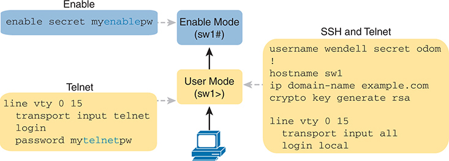
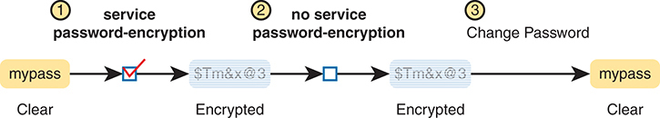
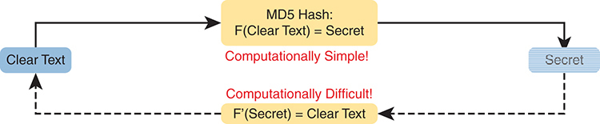
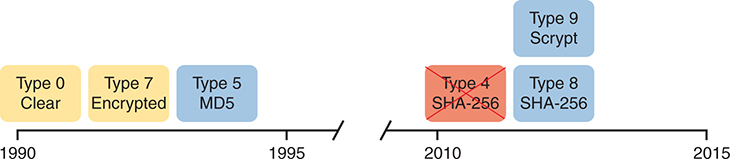
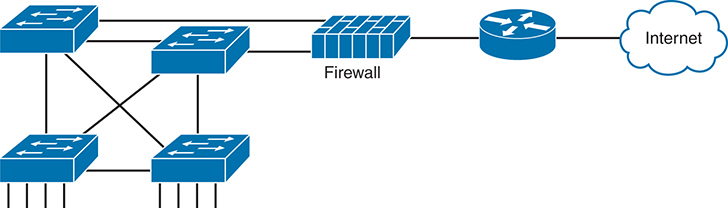
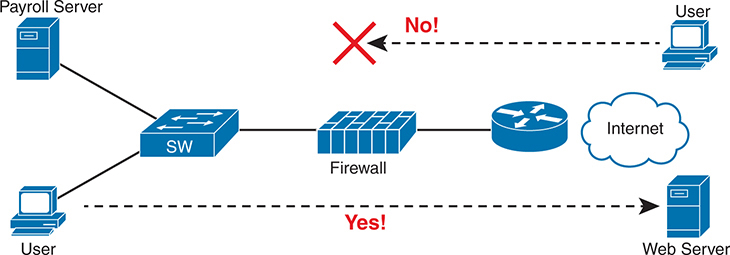
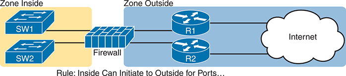
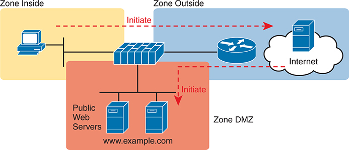
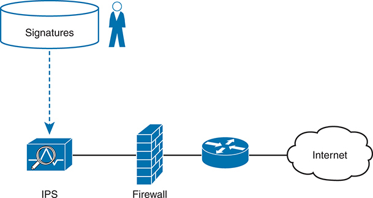
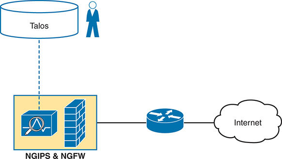

# Chapter 10


## Securing Network Devices

This chapter covers the following exam topics:

1.0 Network Fundamentals

1.1 Explain the role and function of network components

1.1.c Next-generation firewalls and IPS

4.0 IP Services

4.8 Configure network devices for remote access using SSH

5.0 Security Fundamentals

5.3 Configure and verify device access control using local passwords

All devices in the network—endpoints, servers, and infrastructure devices like routers and switches—include some methods for the devices to legitimately communicate using the network. To protect those devices, the security plan will include a wide variety of tools and mitigation techniques, with the chapters in [Part III](vol2_part03.xhtml#part03) of this book discussing a large variety of those tools and techniques.

This chapter focuses on two particular security needs in an enterprise network. First, access to the CLI of the network devices needs to be protected. The network engineering team needs to be able to access the devices remotely, so the devices need to allow remote SSH (and possibly Telnet) access. The first half of this chapter discusses how to configure passwords to keep them safe and how to filter login attempts at the devices themselves.

The second half of the chapter turns to two different security functions most often implemented with purpose-built appliances: firewalls and IPSs. These devices together monitor traffic in transit to determine if the traffic is legitimate or if it might be part of some exploit. If considered to be part of an exploit, or if contrary to the rules defined by the devices, they can discard the messages, stopping any attack before it gets started.

### "Do I Know This Already?" Quiz

Take the quiz (either here or use the PTP software) if you want to use the score to help you decide how much time to spend on this chapter. The letter answers are listed at the bottom of the page following the quiz. [Appendix C](vol2_appc.xhtml#appc), found both at the end of the book as well as on the companion website, includes both the answers and explanations. You can also find both answers and explanations in the PTP testing software.


**Table 10-1** "Do I Know This Already?" Foundation Topics Section-to-Question Mapping

| Foundation Topics Section | Questions |
| --- | --- |
| Securing IOS Passwords | 1–4 |
| Firewalls and Intrusion Prevention Systems | 5, 6 |

**[1](vol2_ch10.xhtml#ques10_1a).** Imagine that you have configured the **enable secret** command, followed by the **enable password** command, from the console. You log out of the switch and log back in at the console. Which command defines the password that you had to enter to access privileged mode?

1. **enable password**
2. **enable secret**
3. Neither
4. The **password** command, if it's configured

**[2](vol2_ch10.xhtml#ques10_2a).** Some IOS commands store passwords as clear text, but you can then encrypt the passwords with the **service password-encryption** global command. By comparison, other commands store a computed hash of the password instead of storing the password. Comparing the two options, which one answer is the *most accurate* about why one method is better than the other?

1. Using hashes is preferred because encrypted IOS passwords can be easily decrypted.
2. Using hashes is preferred because of the large CPU effort required for encryption.
3. Using encryption is preferred because it provides stronger password protection.
4. Using encryption is preferred because of the large CPU effort required for hashes.

**[3](vol2_ch10.xhtml#ques10_3a).** A network engineer issues a **show running-config** command and sees only one line of output that mentions the **enable secret** command, as follows:

[Click here to view code image](vol2_ch10_images.xhtml#f0203-01)

```
enable secret 5 $1$ZGMA$e8cmvkz4UjiJhVp7.maLE1
```

Which of the following is true about users of this router?

1. A user must type **$1$ZGMA$e8cmvkz4UjiJhVp7.maLE1** to reach enable mode.
2. The router will hash the clear-text password that the user types to compare to the hashed password.
3. A **no service password-encryption** configuration command would decrypt this password.
4. The router will decrypt the password in the configuration to compare to the clear-text password typed by the user.

**[4](vol2_ch10.xhtml#ques10_4a).** The **show running-config** command output on a router includes the following line: **username test05 secret 8 $8$rTJqzmkwdI20WU$.mktApC8shjjwgABbQp7UjOmttmJaiIDfvBBJOpcns6**. Which answer best describes the command the network engineer used to configure this **username** command with its clear-text password?

1. **username test05 algorithm-type scrypt secret cisco**
2. **username test05 algorithm-type sha256 secret cisco**
3. **username test05 algorithm-type md5 secret cisco**
4. **username test05 secret cisco**

**[5](vol2_ch10.xhtml#ques10_5a).** A next-generation firewall sits at the edge of a company's connection to the Internet. It has been configured to prevent Telnet clients residing in the Internet from accessing Telnet servers inside the company. Which of the following might a next-generation firewall use that a traditional firewall would not?

1. Match message destination well-known port 23
2. Match message application data
3. Match message IP protocol 23
4. Match message source TCP ports greater than 49152

**[6](vol2_ch10.xhtml#ques10_6a).** Which actions show a behavior typically supported by a Cisco next-generation IPS (NGIPS) beyond the capabilities of a traditional IPS? (Choose two answers.)

1. Gather and use host-based information for context
2. Comparisons between messages and a database of exploit signatures
3. Logging events for later review by the security team
4. Filter URIs using reputation scores

Answers to the "Do I Know This Already?" quiz:

**[1](vol2_appc.xhtml#ques10_1)** B

**[2](vol2_appc.xhtml#ques10_2)** A

**[3](vol2_appc.xhtml#ques10_3)** B

**[4](vol2_appc.xhtml#ques10_4)** B

**[5](vol2_appc.xhtml#ques10_5)** B

**[6](vol2_appc.xhtml#ques10_6)** A, D

### Foundation Topics

### Securing IOS Passwords

The ultimate way to protect passwords in Cisco IOS devices is to not store passwords in IOS devices. That is, for any functions that can use an external authentication, authorization, and accounting (AAA) server, use it. However, it is common to store some passwords in a router or switch configuration, and this first section of the chapter discusses some of the ways to protect those passwords.

As a brief review, [Figure 10-1](vol2_ch10.xhtml#ch10fig01) summarizes some typical login security configuration on a router or switch. On the lower left, you see Telnet support configured, with the use of a password only (no username required). On the right, the configuration adds support for login with both username and password, supporting both Telnet and SSH users. The upper left shows the one command required to define an enable password in a secure manner.




The diagram is divided into three sections: Enable, Telnet, and S S H and Telnet configurations. In the Enable section, a light blue box shows the command enable secret myenablepw, which leads to the Enable Mode (sw1#). This command sets a password for privileged E X E C mode, enhancing security by requiring authentication for higher-level access. In the Telnet section, another light blue box depicts the configuration for Telnet. The configuration includes: Line 1: line vty 0 15. Line 2: transport input telnet. Line 3: login. Line 4: password mytelnetpw. An arrow from Enable Mode to User Mode (sw1>) illustrates how the user transitions between these modes. This configuration sets up virtual terminal lines to accept Telnet connections, requiring users to log in with the specified password. In the S S H and Telnet section, a yellow box illustrates the configurations for both S S H and Telnet. The commands are: username wendell secret odom ! hostname sw1. ip domain-name example dot com. crypto key generate rsa. line vty 0 15. transport input all. login local.

**Figure 10-1** *Sample Login Security Configuration*

Note

The configuration on the far right of the figure supports both SSH and Telnet, but consider allowing SSH only by instead using the **transport input ssh** command. The Telnet protocol sends all data unencrypted, so any attacker who copies the message with a Telnet login will have a copy of the password.

The rest of this first section discusses how to make these passwords secure. In particular, this section looks at ways to avoid keeping clear-text passwords in the configuration and storing the passwords in ways that make it difficult for attackers to learn the password.

#### Encrypting Older IOS Passwords with service password-encryption

Some older-style IOS passwords create a security exposure because the passwords exist in the configuration file as clear text. These clear-text passwords might be seen in printed versions of the configuration files, in a backup copy of the configuration file stored on a server, or as displayed on a network engineer's display.

Cisco attempted to solve this clear-text problem by adding a command to encrypt those passwords: the **service password-encryption** global configuration command. This command encrypts passwords that are normally held as clear text, specifically the passwords for these commands:

**password** *password* (console or vty mode)


**username** *name* **password** *password* (global)

**enable password** *password* (global)

To see how it works, [Example 10-1](vol2_ch10.xhtml#exa10_1) shows how the **service password-encryption** command encrypts the clear-text console password. The example uses the **show running-config | section line con 0** command both before and after the encryption; this command lists only the section of the configuration about the console.

**Example 10-1** *Encryption and the **service password-encryption** Command*

[Click here to view code image](vol2_ch10_images.xhtml#f0205-01)

```
Switch3# show running-config | section line con 0
line con 0
 password cisco
 login

Switch3# configure terminal
Enter configuration commands, one per line.  End with CNTL/Z.
Switch3(config)# service password-encryption
Switch3(config)# ^Z

Switch3# show running-config | section line con 0
line con 0
 password 7 070C285F4D06
 login
```

A close examination of the before and after **show running-config** command output reveals both the obvious effect and a new concept. The encryption process now hides the original clear-text password. Also, IOS needs a way to signal that the value in the **password** command lists an encrypted password rather than the clear text. IOS adds the encryption or encoding type of "7" to the command, which specifically refers to passwords encrypted with the **service password-encryption** command. (IOS considers the clear-text passwords to be type 0; some commands list the 0, and some do not.)

While the **service password-encryption** global command encrypts passwords, the **no service password-encryption** global command does not immediately decrypt the passwords back to their clear-text state. Instead, the process works as shown in [Figure 10-2](vol2_ch10.xhtml#ch10fig02). Basically, after you enter the **no service password-encryption** command, the passwords remain encrypted until you change a password.




It is divided into three numbered steps. Service Password Encryption: A clear-text password mypass is shown on the left with a yellow background. The command service password-encryption encrypts the password, resulting in an encrypted form represented as $ T m and x at 3 with a blue background. No Service Password Encryption: The command no service password-encryption is shown, but the password remains encrypted as $ T m and x at 3. Change Password: When the password is changed, the encryption is reapplied, resulting in the password being shown in clear text again as mypass.

**Figure 10-2** *Encryption Is Immediate; Decryption Awaits Next Password Change*

Unfortunately, the **service password-encryption** command does not protect the passwords very well. Armed with the encrypted value, you can search the Internet and find sites with tools to decrypt these passwords. In fact, you can take the encrypted password from this example, plug it into one of these sites, and it decrypts to "cisco." So, the **service password-encryption** command will slow down the curious, but it will not stop a knowledgeable attacker.

#### Encoding the Enable Passwords with Hashes

In the earliest days of IOS, Cisco used the **enable password** *password* global command to define the password that users had to use to reach enable mode (after using the **enable** EXEC command). However, as just noted, the **enable password** *password* command stored the password as clear text, and the **service password-encryption** command encrypted the password in a way that was easily decrypted.

Cisco solved the problem of only weak ways to store the password of the **enable password** *password* global command by making a more secure replacement: the [enable secret](vol2_gloss.xhtml#gloss_130) *password* global command. However, both of these commands exist in IOS even today. The next few pages look at these two commands from a couple of angles, including interactions between these two commands, why the **enable secret** command is more secure, along with a note about some advancements in how IOS secures the **enable secret** password.

##### Interactions Between Enable Password and Enable Secret

First, for real life: use the **enable secret** *password* global command, and ignore the **enable password** *password* global command. That has been true for around 20 years.

However, to be complete, Cisco has never removed the much weaker **enable password** command from IOS. So, on a single switch (or router), you can configure one or the other, both, or neither. What, then, does the switch expect you to type as the password to reach enable mode? It boils down to these rules:

**Both commands configured:** Users must use the password in the **enable secret** *password* command (and ignore the **enable password** *password* command).


**Only one command configured:** Use the password in that one command.

**Neither command configured (default):** Console users move directly to enable mode without a password prompt; Telnet and SSH users are rejected with no option to supply an enable password.

##### Making the Enable Secret Truly Secret with a Hash

The Cisco **enable secret** command protects the password value by never even storing the clear-text password in the configuration. However, that one sentence may cause you a bit of confusion: If the router or switch does not remember the clear-text password, how can the switch know that the user typed the right password after using the **enable** command? This section works through a few basics to show you how and appreciate why the password's value is secret.

First, by default, IOS uses a hash function called Message Digest 5 (MD5) to store an alternative value in the configuration, rather than the clear-text password. Think of MD5 as a rather complex mathematical one-way formula. This formula is chosen so that even if you know the exact result of the formula—that is, the result after feeding the clear-text password through the formula as input—it is computationally difficult to compute the original clear-text password. [Figure 10-3](vol2_ch10.xhtml#ch10fig03) shows the main ideas:




On the left side, a blue rectangle labeled Clear Text is connected by a solid black arrow to a yellow rectangle labeled M D 5 Hash: F(Clear Text) = Secret. This indicates that transforming clear text into a secret using the M D 5 hash function is computationally simple, as indicated by the red text Computationally Simple! below the yellow rectangle. On the right side, another blue rectangle labeled Secret is shown. A dashed black arrow points back from the Secret to the Clear Text, passing through another yellow rectangle labeled F'(Secret) equals Clear Text. This part of the diagram highlights that reversing the process, or computing the original clear text from the secret, is computationally difficult, as noted by the red text Computationally Difficult!

**Figure 10-3** *One-Way Nature of MD5 Hash to Create Secret*

Note

"Computationally difficult" is almost a code phrase, meaning that the designers of the function hope that no one is willing to take the time to compute the original clear text.

So, if the original clear-text password cannot be re-created, how can a switch or router use it to compare to the clear-text password typed by the user? The answer depends on another fact about these security hashes like MD5: each clear-text input results in a unique result from the math formula.

The **enable secret fred** command generates an [MD5 hash](vol2_gloss.xhtml#gloss_205). If a user types **fred** when trying to enter enable mode, IOS will run MD5 against that value and get the same MD5 hash as is listed in the **enable secret** command, so IOS allows the user to access enable mode. If the user typed any other value besides **fred**, IOS would compute a different MD5 hash than the value stored with the **enable secret** command, and IOS would reject that user's attempt to reach enable mode.

Knowing that fact, the switch can make a comparison when a user types a password after using the **enable** EXEC command as follows:

Step 1. IOS computes the MD5 hash of the password in the **enable secret** command and stores the hash of the password in the configuration.


Step 2. When the user types the **enable** command to reach enable mode, a password that needs to be checked against that configuration command, IOS hashes the clear-text password as typed by the user.

Step 3. IOS compares the two hashed values: if they are the same, the user-typed password must be the same as the configured password.

As a result, IOS can store the hash of the password but never store the clear-text password; however, it can still determine whether the user typed the same password.

Switches and routers already use the logic described here, but you can see the evidence by looking at the switch configuration. [Example 10-2](vol2_ch10.xhtml#exa10_2) shows the creation of the **enable secret** command, with a few related details. This example shows the stored (hashed) value as revealed in the **show running-configuration** command output. That output also shows that IOS changed the **enable secret fred** command to list the encryption type 5 (which means the listed password is actually an MD5 hash of the clear-text password). The gobbledygook long text string is the hash, preventing others from reading the password.

**Example 10-2** *Cisco IOS Encoding Password "fred" as Type 5 (MD5)*

[Click here to view code image](vol2_ch10_images.xhtml#f0208-01)

```
Switch3(config)# enable secret fred
Switch3(config)# ^Z
Switch3# show running-config | include enable secret

enable secret 5 $1$ZGMA$e8cmvkz4UjiJhVp7.maLE1

Switch3# configure terminal
Enter configuration commands, one per line.  End with CNTL/Z.
Switch3(config)# no enable secret
Switch3(config)# ^Z
```

The end of the example also shows an important side point about deleting the **enable secret** password: after you are in enable mode, you can delete the **enable secret** password using the **no enable secret** command, without even having to enter the password value. You can also overwrite the old password by just repeating the **enable secret** command. But you cannot view the original clear-text password.

Note

[Example 10-2](vol2_ch10.xhtml#exa10_2) shows another shortcut illustrating how to work through long **show** command output, this time using the pipe to the **include** command. The **| include enable secret** part of the command processes the output from **show running-config** to include only the lines with the case-sensitive text "enable secret."

##### Improved Hashes for Cisco's Enable Secret

The use of any hash function to encode passwords relies on several key features of the particular hash function. In particular, every possible input value must result in a single hashed value, so that when users type a password, only one password value matches each hashed value. Also, the hash algorithm must result in computationally difficult math (in other words, a pain in the neck) to compute the clear-text password based on the hashed value to discourage attackers.

The MD5 hash algorithm has been around 30 years. Over those years, computers have gotten much faster, and researchers have found creative ways to attack the MD5 algorithm, making MD5 less challenging to crack. That is, someone who saw your running configuration would have an easier time re-creating your clear-text secret passwords than in the early years of MD5.

These facts are not meant to say that MD5 is bad, but like many cryptographic functions before MD5, progress has been made, and new functions were needed. To provide more recent options that would create a much greater challenge to attackers, Cisco added two additional hashes in the 2010s, as noted in [Figure 10-4](vol2_ch10.xhtml#ch10fig04).




The timeline is divided into two segments. On the left, from 1990 to 1995, three types are shown: Type 0 Clear, Type 7 Encrypted, and Type 5 M D 5, each represented by a yellow and blue rectangle respectively. The right segment, from 2010 to 2015, shows more advanced types: Type 4 S H A-256 (red rectangle), Type 8 S H A-256 (blue rectangle), and Type 9 Scrypt (blue rectangle).

**Figure 10-4** *Timeline of Encryptions/Hashes of Cisco IOS Passwords*

Of the newer types shown in the figure, Cisco continues to use types 8 and 9. Cisco found a security exposure with their type 4 password implementation, so they deprecated it, later replacing it with type 8. Both types 4 and 8 use the same underlying algorithm (PBKDF2) that combines with the SHA-256 algorithm. (You might see both terms mentioned in documentation about type 8 passwords.) Type 9 uses a different hash algorithm called Scrypt (pronounced "es crypt.")

IOS now supports two alternative algorithm types in the more recent router and switch IOS images. [Table 10-2](vol2_ch10.xhtml#ch10tab02) shows the configuration of all three algorithm types on the **enable secret** command.

**Table 10-2** Commands and Encoding Types for the **enable secret** Command

| Command | Type | Algorithm |
| --- | --- | --- |
| **enable algorithm-type md5 secret** *password* | 5 | MD5 |
| **enable algorithm-type sha256 secret** *password* | 8 | SHA-256 |
| **enable algorithm-type scrypt secret** *password* | 9 | Scrypt |

[Example 10-3](vol2_ch10.xhtml#exa10_3) shows the **enable secret** command being changed from MD5 to the Scrypt algorithm. Of note, the example shows that only one **enable secret** command should exist between those three commands in [Table 10-2](vol2_ch10.xhtml#ch10tab02). Basically, if you configure another **enable secret** command with a different algorithm type, that command replaces any existing **enable secret** command.

**Example 10-3** *Cisco IOS Encoding Password "mypass1" as Type 9 (SHA-256)*

[Click here to view code image](vol2_ch10_images.xhtml#f0210-01)

```
R1# show running-config | include enable
enable secret 5 $1$ZSYj$725dBZmLUJ0nx8gFPTtTv0
R1# configure terminal
Enter configuration commands, one per line. End with CNTL/Z.
R1(config)# enable algorithm-type scrypt secret mypass1
R1(config)# ^Z
R1#
R1# show running-config | include enable
enable secret 9 $9$II/EeKiRW91uxE$fwYuOE5EHoii16AWv2wSywkLJ/KNeGj8uK/24B0TVU6
R1#
```

Following the process shown in the example, the first command confirms that the current **enable secret** command uses encoding type 5, meaning it uses MD5. Second, the user configures the password using algorithm type scrypt. The last command confirms that only one **enable secret** command exists in the configuration, now with encoding type 9.

Also, think through how IOS takes the command with the clear-text password and then stores the command in a different syntax. In the example, the user issues the **enable algorithm-type scrypt secret mypass** command, referencing the algorithm type by name. However, the **show running-config** output shows how IOS removed the **algorithm-type scrypt** parameters, but it also left the number 9 behind the **secret** parameter. As a result, the command stored by IOS identifies the algorithm type by number. Because of that, take time to memorize both the names and numbers of the algorithm types per [Table 10-2](vol2_ch10.xhtml#ch10tab02).

Finally, note that IOS and IOS XE differ slightly with the **enable secret** command. When configuring without using the **algorithm-type** keyword, IOS defaults to MD5, whereas IOS XE defaults to Scrypt.

#### Encoding the Passwords for Local Usernames

The **username password** and [username secret](vol2_gloss.xhtml#gloss_358) commands have a similar history to the **enable password** and **enable secret** commands. Originally, IOS supported the **username** *user* **password** *password* command—a command that had those same issues of being a clear-text password or a poorly encrypted value (with the **service password-encryption** feature). Many years later, Cisco added the **username** *user* **secret** *password* global command, which encoded the password as an MD5 hash, with Cisco adding support for the newer hashes later. Note that Cisco uses the term [local username](vol2_gloss.xhtml#gloss_197) to refer to these usernames configured on individual routers and switches, in contrast to those configured centrally on a AAA server.

Today, the **username secret** command is preferred over the **username password** command; however, keep these rules in mind for **username** commands:


* IOS allows only one **username** command for a given username—either a **username** *name* **password** *password* command or a **username** *name* **secret** *password* command.
* IOS allows a mix of commands (**username password** and **username secret**) in the same router or switch (for different usernames).

As mentioned, IOS on both switches and routers uses the additional encoding options beyond MD5, just as supported with the **enable secret** command. [Table 10-3](vol2_ch10.xhtml#ch10tab03) shows the syntax of those three options in the **username** command.

**Table 10-3** Commands and Encoding Types for the **username secret** Command

| Command | Type | Algorithm |
| --- | --- | --- |
| **username** *name* **algorithm-type md5 secret** *password* | 5 | MD5 |
| **username** *name* **algorithm-type sha256 secret** *password* | 8 | SHA-256 |
| **username** *name* **algorithm-type scrypt secret** *password* | 9 | SHA-256 |

IOS and IOS XE also differ with the **username secret** command, with the same defaults as for the **enable secret** command: MD5 for IOS and Scrypt for IOS XE. Also, for the **username secret** command, IOS XE does not support the MD5 option at all. (As always, treat any comments about IOS and IOS XE differences for general awareness because the CCNA exam topics do not mention the need to know such distinctions.)

### Firewalls and Intrusion Prevention Systems

The next topic examines the roles of a couple of different kinds of networking devices: firewalls and intrusion prevention systems (IPSs). Both devices work to secure networks but with slightly different goals and approaches.

This second major section of the chapter takes a look at each. This section first discusses the core traditional features of both firewalls and IPSs. The section closes with a description of the newer features in the current generation of these products, called next-generation products, which improve the functions of each.

#### Traditional Firewalls

Traditionally, a [firewall](vol2_gloss.xhtml#gloss_143) sits in the forwarding path of all packets so that the firewall can then choose which packets to discard and which to allow through. By doing so, the firewall protects the network from different kinds of issues by allowing only the intended types of traffic to flow in and out of the network. In fact, in its most basic form, firewalls do the same kinds of work that routers do with ACLs, but firewalls can perform that packet-filtering function with many more options, as well as perform other security tasks.

[Figure 10-5](vol2_ch10.xhtml#ch10fig05) shows a typical network design for a site that uses a physical firewall. The figure shows a firewall, like the Cisco Adaptive Security Appliance (ASA) firewall, connected to a Cisco router, which in turn connects to the Internet. All enterprise traffic going to or from the Internet would be sent through the firewall. The firewall would consider its rules and make a choice for each packet, whether the packet should be allowed through.





At the bottom left, there are four blue rectangles representing network switches, connected in a mesh topology with lines indicating the connections. These switches are connected to a central firewall, illustrated as a blue rectangular block with vertical lines suggesting layers. The firewall is then connected to a router, represented by a blue circular icon with arrows. Finally, the router connects to the internet, depicted as a blue cloud on the far right.

**Figure 10-5** *Firewall as Positioned in the Packet Forwarding Path*

Although firewalls have some router-like features (such as packet forwarding and packet filtering), they provide much more advanced security features than a traditional router. For example, most firewalls can use the following kinds of logic to make the choice of whether to discard or allow a packet:

* Like router IP ACLs, match the source and destination IP addresses
* Like router IP ACLs, identify applications by matching their static well-known TCP and UDP ports
* Watch application-layer flows to know what additional TCP and UDP ports are used by a particular flow, and filter based on those ports
* Match the text in the URI of an HTTP request—that is, look at and compare the contents of what is often called the web address—and match patterns to decide whether to allow or deny the download of the web page identified by that URI
* Keep state information by storing information about each packet, and make decisions about filtering future packets based on the historical state information (called *stateful inspection*, or being a stateful firewall)

The stateful firewall feature provides the means to prevent a variety of attacks and is one of the more obvious differences between the ACL processing of a router versus security filtering by a firewall. Routers must spend as little time as possible processing each packet so that the packets experience little delay passing through the router. The router cannot take the time to gather information about a packet, and then for future packets, consider some saved state information about earlier packets when making a filtering decision. Because they focus on network security, firewalls do save some information about packets and can consider that information for future filtering decisions.

As an example of the benefits of using a stateful firewall, consider a simple denial-of-service (DoS) attack. An attacker can make this type of attack against a web server by using tools that create (or start to create) a large volume of TCP connections to the server. The firewall might allow TCP connections to that server normally, but imagine that the server might typically receive 10 new TCP connections per second under normal conditions and 100 per second at the busiest times. A DoS attack might attempt thousands or more TCP connections per second, driving up CPU and RAM use on the server and eventually overloading the server to the point that it cannot serve legitimate users.

A stateful firewall could be tracking the number of TCP connections per second—that is, recording state information based on earlier packets—including the number of TCP connection requests from each client IP address to each server address. The stateful firewall could notice a large number of TCP connections, check its state information, and then notice that the number of requests is very large from a small number of clients to that particular server, which is typical of some kinds of DoS attacks. The stateful firewall could then start filtering those packets, helping the web server survive the attack, whereas a stateless firewall or a router ACL would not have had the historical state information to realize that a DoS attack was occurring.

##### Security Zones

Firewalls not only filter packets but also pay close attention to which host initiates communications. That concept is most obvious with TCP as the transport layer protocol, where the client initiates the TCP connection by sending a TCP segment that sets the SYN bit only (as seen in [Figure 5-5](vol2_ch05.xhtml#ch05fig05) in [Chapter 5](vol2_ch05.xhtml#ch05), "[Introduction to TCP/IP Transport and Applications](vol2_ch05.xhtml#ch05)").

Firewalls use logic that considers which host initiated a TCP connection by watching these initial TCP segments. To see the importance of who initiates the connections, think about a typical enterprise network with a connection to the Internet, as shown in [Figure 10-6](vol2_ch10.xhtml#ch10fig06). The company has users inside the company who open web browsers, initiating connections to web servers across the Internet. However, by having a working Internet connection, that same company opens up the possibility that an attacker might try to create a TCP connection to the company's internal web servers used for payroll processing. Of course, the company does not want random Internet users or attackers to be able to connect to their payroll server.




On the left side, there are two user icons connected to a Payroll Server through a blue rectangular switch labeled S W. The switch is connected to a Firewall in the center of the image. From the firewall, there is a connection to a Web Server on the right and to the Internet via a circular router icon. The web server is indicated to be accessible by users, as shown by a dotted arrow labeled Yes! leading to a user icon on the far right. In contrast, an attempt to access the payroll server from the internet is blocked, indicated by a red X and the text No! above a dashed arrow pointing to a user icon on the top right.

**Figure 10-6** *Allowing Outbound Connections and Preventing Inbound Connections*


Firewalls use the concept of *security zones* (also called a *zone* for short) when defining which hosts can initiate new connections. The firewall has rules, and those rules define which host can initiate connections from one zone to another zone. Also, by using zones, a firewall can place multiple interfaces into the same zone, in cases for which multiple interfaces should have the same security rules applied. [Figure 10-7](vol2_ch10.xhtml#ch10fig07) depicts the idea with the inside part of the enterprise considered to be in a separate zone compared to the interfaces connected toward the Internet.





On the left, within the Zone Inside area, there are two blue switches labeled S W 1 and S W 2, both connected to a Firewall in the center. The firewall is connected to two routers labeled R 1 and R 2 in the Zone Outside, which then connect to the Internet. The entire setup is divided into two zones: Zone Inside and Zone Outside. The rule at the bottom of the image states, Rule: Inside Can Initiate to Outside for Ports... emphasizing that only outbound connections from the inside zone to the outside zone are allowed, not vice versa.

**Figure 10-7** *Using Security Zones with Firewalls*

The most basic firewall rule when using two zones like [Figure 10-7](vol2_ch10.xhtml#ch10fig07) reduces to this logic:

Allow hosts from zone inside to initiate connections to hosts in zone outside, for a predefined set of safe well-known ports (like HTTP port 80, for instance).

Note that with this one simple rule, the correct traffic is allowed while filtering the unwanted traffic by default. Firewalls typically disallow all traffic unless a rule specifically allows the packet. So, with this simple rule to allow inside users to initiate connections to the outside zone, and that alone, the firewall also prevents outside users from initiating connections to inside hosts.

Most companies have an inside and outside zone, as well as a special zone called the *demilitarized zone (DMZ)*. Although the DMZ name comes from the real world, it has been used in IT for decades to refer to a firewall security zone used to place servers that need to be available for use by users in the public Internet. For example, [Figure 10-8](vol2_ch10.xhtml#ch10fig08) shows a typical Internet edge design, with the addition of a couple of web servers in its DMZ connected through the firewall. The firewall then needs another rule that enables users in the zone outside—that is, users in the Internet—to initiate connections to those web servers in the DMZ. By separating those web servers into the DMZ, away from the rest of the enterprise, the enterprise can prevent Internet users from attempting to connect to the internal devices in the inside zone, preventing many types of attacks.




The diagram is divided into three zones: Zone Inside, Zone Outside, and Zone D M Z. In the Zone Inside, a user icon is connected to a firewall. The firewall connects to the Zone Outside through a circular router icon and to the Zone D M Z, which contains two Public Web Servers with the U R L www dot example dot com. Red arrows labeled Initiate point from the user icon in the Zone Inside to the internet in the Zone Outside and from the internet to the public web servers in the Zone D M Z.

**Figure 10-8** *Using a DMZ for Enterprise Servers That Need to Be Accessible from the Internet*


#### Intrusion Prevention Systems (IPS)

Traditionally, a firewall works with a set of user-configured rules about where packets should be allowed to flow in a network. The firewall needs to sit in the path of the packets so it can filter the packets, redirect them for collection and later analysis, or let them continue toward their destination.

A traditional intrusion prevention system ([IPS](vol2_gloss.xhtml#gloss_177)) can sit in the path packets take through the network, and it can filter packets, but it makes its decisions with different logic. The IPS first downloads a database of exploit signatures. Each signature defines different header field values found in sequences of packets used by different exploits. Then the IPS can examine packets, compare them to the known exploit signatures, and notice when packets may be part of a known exploit. Once identified, the IPS can log the event, discard packets, or even redirect the packets to another security application for further examination.

A traditional IPS differs from firewalls in that instead of an engineer at the company defining rules for that company based on applications (by port number) and zones, the IPS applies the logic based on signatures supplied mostly by the IPS vendor. Those signatures look for these kinds of attacks:

* DoS
* DDoS
* Worms
* Viruses

To accomplish its mission, the IPS needs to download and keep updating its signature database. Security experts work to create the signatures. The IPS must then download the exploit signature database and keep downloading updates over time, as shown in [Figure 10-9](vol2_ch10.xhtml#ch10fig09).




At the top of the image, there is a circular cloud labeled Signatures, indicating the database of known threat signatures. A figure representing an administrator is shown standing next to the signature database. Below, a dashed line connects the signature database to an I P S device, represented by an icon with a magnifying glass and a waveform, symbolizing its function of inspecting traffic for known threats. To the right of the I P S, there is a firewall depicted as a brick wall, which is connected to a router icon. The router is linked to a cloud labeled Internet.

**Figure 10-9** *IPS and Signature Database*

For example, think about what happens when an entirely new computer virus has been created. Host-based security products, like antivirus software, should be installed on the computers inside the company. These tools use a similar model as the IPS, keeping an updated database of virus signatures. The signatures might look for patterns in how a computer virus could be stored inside files on the computer, or in files sent to the computer via email or web browsers. But there will be some time lag between the day when the virus is discovered (called zero-day attacks) and when researchers develop a virus signature, change their database, and allow time for all the hosts to update their antivirus software. The hosts are at risk during this time lag.

The IPS provides a complimentary service to prevent viruses. Researchers will look for ways an IPS could recognize the same virus while in flight through the network with new IPS signatures—for instance, looking for packets with a particular port and a particular hex string in the application payload. Once developed, the IPS devices in the network need to be updated with the new signature database, protecting against that virus. Both the host-based and IPS-based protections play an important role, but the fact that one IPS protects sections of a network means that the IPS can sometimes more quickly react to new threats to protect hosts.

#### Cisco Next-Generation Firewalls

The CCNA 200-301 exam topics mention the terms *firewall* and *IPS* but prefaced with the term *next-generation*. Around the mid-2010s, Cisco and some of their competitors started using the term *next generation* when discussing their security products to emphasize some of the newer features. In short, a [next-generation firewall (NGFW)](vol2_gloss.xhtml#gloss_226) and a [next-generation IPS (NGIPS)](vol2_gloss.xhtml#gloss_227) are the now-current firewall and IPS products from Cisco.

However, the use of the term *next generation* goes far beyond just a marketing label: the term emphasizes some major shifts and improvements over the years. The security industry sees endless cycles of new attacks followed by new solutions. Some solutions might require entirely new product features or even new products. Some of the changes that have required new security features include the proliferation of mobile devices—devices that leave the enterprise, connect to the Internet, and return to the enterprise—creating a whole new level of risk. Also, no single security function or appliance (firewall, IPS, anti-malware) can hope to stop some threats, so the next-generation tools must be able to work better together to provide solutions. In short, the next-generation products have real useful features not found in their predecessor products.

As for Cisco products, for many years Cisco branded its firewalls as the Cisco Adaptive Security Appliance (ASA). Around 2013, Cisco acquired Sourcefire, a security product company. Many of the next-generation firewall (and IPS) features come from software acquired through that acquisition. For a while, Cisco sold security appliances that ran multiple security features, such as NGFW, with branding similar to the old Sourcefire name: Cisco Firepower firewalls. As of the publication of this book, Cisco had moved on to branding with the name Cisco Secure Firewall (see [www.cisco.com/go/firewalls](http://www.cisco.com/go/firewalls)).

An NGFW still does the traditional functions of a firewall, of course, like stateful filtering by comparing fields in the IP, TCP, and UDP headers, and using security zones when defining firewall rules. To provide some insight into some of the newer next-generation features, consider the challenge of matching packets with ports:

1. Each IP-based application should use a well-known port.
2. Attackers know that firewalls will filter most well-known ports from sessions initiated from the outside zone to the inside zone (see [Figure 10-8](vol2_ch10.xhtml#ch10fig08)).
3. Attackers use port scanning to find any port that a company's firewall will allow through right now.
4. Attackers attempt to use a protocol of their choosing (for example, HTTP) but with the nonstandard port found through port scanning as a way to attempt to connect to hosts inside the enterprise.

The sequence lists a summary of some of the steps attackers need to take but does not list every single task. However, even to this depth, you can see how attackers can find a way to send packets past the corporate firewall.

The solution? A next-generation firewall that looks at the application layer data to identify the application instead of relying on the TCP and UDP port numbers used. Cisco performs their deep packet inspection using a feature called [Application Visibility and Control (AVC)](vol2_ch10.xhtml#key_126a). Cisco AVC can identify many applications based on the data sent (application layer headers plus application data structures far past the TCP and UDP headers). When used with a Cisco NGFW, instead of matching port numbers, the firewall matches the application, defeating attacks like the one just described.

The following list mentions a few of the features of an NGFW. Note that while *NGFW* is a useful term, the line between a traditional firewall and a next-generation firewall can be a bit blurry because the terms describe products that have gone through repeated changes over long periods of time. This list does summarize a few of the key points, however:


* **Traditional firewall:** An NGFW performs traditional firewall features, like stateful firewall filtering, NAT/PAT, and VPN termination.
* **Application Visibility and Control (AVC):** This feature looks deep into the application layer data to identify the application. For instance, it can identify the application based on the data, rather than port number, to defend against attacks that use random port numbers.
* **Advanced Malware Protection:** NGFW platforms run multiple security services, not just as a platform to run a separate service, but for better integration of functions. A network-based antimalware function can run on the firewall itself, blocking file transfers that would install malware, and saving copies of files for later analysis.
* **URL Filtering:** This feature examines the URLs in each web request, categorizes the URLs, and either filters or rate-limits the traffic based on rules. The Cisco Talos security group monitors and creates reputation scores for each domain known in the Internet, with URL filtering being able to use those scores in its decision to categorize, filter, or rate limit.
* **NGIPS:** Cisco's NGFW products can also run their NGIPS feature along with the firewall.

Note that for any of the services that benefit from being in the same path that packets traverse, like a firewall, it makes sense that over time those functions could migrate to run on the same product. So, when the design needs both a firewall and IPS at the same location in the network, these NGFW products can run the NGIPS feature as shown in the combined device in [Figure 10-10](vol2_ch10.xhtml#ch10fig10).





At the top, there is a circular cloud labeled Talos, representing Cisco's threat intelligence organization. An administrator figure is shown next to Talos, indicating human oversight. A dashed line connects Talos to a combined N G I P S and N G F W module, illustrated by an icon similar to the previous I P S icon but enclosed in a highlighted box labeled N G I P S and N G F W.

**Figure 10-10** *Next-Generation Firewall with Next-Generation IPS Module*

#### Cisco Next-Generation IPS

The Cisco next-generation IPS (NGIPS) products have followed a similar path as the Cisco NGFW products. Cisco first added NGIPS features primarily through its Sourcefire acquisition. Current Cisco IPS products now run as applications in appliances that use the Cisco Secure Firewall name. In fact, as for products, think more like the previous figure, with an appliance that runs both the NGFW and NGIPS.

As with the NGFW, the NGIPS adds features to a traditional IPS. One of the biggest issues with a traditional IPS comes with the volume of security events logged by the IPS. For instance:

1. An IPS compares the signature database, which lists all known exploits, to all messages.
2. It generates events, often far more than the security staff can read.
3. The staff must mentally filter events to find the proverbial needle in the haystack, possible only through hard work, vast experience, and a willingness to dig.

An NGIPS helps with this issue in a couple of ways. First, an NGIPS examines the context by gathering data from all the hosts and the users of those hosts. The NGIPS will know the OS, software revision levels, what apps are running, open ports, the transport protocols and port numbers in use, and so on. Armed with that data, the NGIPS can make much more intelligent choices about what events to log.

For instance, consider an NGIPS placed into a network to protect a campus LAN where end users connect, but no data center exists in that part of the network. Also, all PCs happen to be running Windows, and possibly the same version, by corporate policy. The signature database includes signatures for exploits of Linux hosts, Macs, Windows versions nonexistent in that part of the network, and exploits that apply to server applications that are not running on those hosts. After gathering those facts, an NGIPS can suggest de-emphasizing checks for exploits that do not apply to those endpoints, spending more time and focus on events that could occur, greatly reducing the number of events logged.

The following are a few of the Cisco NGIPS features:


* **Traditional IPS:** An NGIPS performs traditional IPS features, like using exploit signatures to compare packet flows, creating a log of events, and possibly discarding and/or redirecting packets.
* **Application Visibility and Control (AVC):** As with NGFWs, an NGIPS has the ability to look deep into the application layer data to identify the application.
* **Contextual Awareness:** NGFW platforms gather data from hosts—OS, software version/level, patches applied, applications running, open ports, applications currently sending data, and so on. Those facts inform the NGIPS as to the often more limited vulnerabilities in a portion of the network so that the NGIPS can focus on actual vulnerabilities while greatly reducing the number of logged events.
* **Reputation-Based Filtering:** The Cisco Talos security intelligence group researches security threats daily, building the data used by the Cisco security portfolio. Part of that data identifies known bad actors, based on IP address, domain, name, or even specific URL, with a reputation score for each. A Cisco NGIPS can perform reputation-based filtering, taking the scores into account.
* **Event Impact Level:** Security personnel need to assess the logged events, so an NGIPS provides an assessment based on impact levels, with characterizations as to the impact if an event is indeed some kind of attack.

If you want to learn a little more about these topics for your own interest, let me refer you to a couple of resources. First, check out articles and blog posts from the Cisco Talos Intelligence Group ([www.talosintelligence.com](http://www.talosintelligence.com)). The Cisco Talos organization researches security issues around the globe across the entire spectrum of security products. Additionally, one Cisco Press book has some great information about both next-generation firewalls and IPSs, written at a level appropriate as a next step. If you want to read more, check out this book with the long name: *Integrated Security Technologies and Solutions, Volume I: Cisco Security Solutions for Advanced Threat Protection with Next Generation Firewall, Intrusion Prevention, AMP, and Content Security* (or just use its ISBN, 9781587147067), with one chapter each on NGFW and NGIPS.

### Chapter Review

One key to doing well on the exams is to perform repetitive spaced review sessions. Review this chapter's material using either the tools in the book or interactive tools for the same material found on the book's companion website. Refer to the "[Your Study Plan](vol2_appf.xhtml#appf)" element for more details. [Table 10-4](vol2_ch10.xhtml#ch10tab04) outlines the key review elements and where you can find them. To better track your study progress, record when you completed these activities in the second column.


**Table 10-4** Chapter Review Tracking

| Review Element | Review Date(s) | Resource Used |
| --- | --- | --- |
| Review key topics |  | Book, website |
| Review key terms |  | Book, website |
| Repeat DIKTA questions |  | Book, PTP |
| Do labs |  | Blog |
| Review command tables |  | Book |

### Review All the Key Topics


**Table 10-5** Key Topics for [Chapter 10](vol2_ch10.xhtml#ch10)

| Key Topic Element | Description | Page Number |
| --- | --- | --- |
| List | Commands whose passwords are encrypted by **service password-encryption** | [205](vol2_ch10.xhtml#page_205) |
| List | Rules for when IOS uses the password set with the **enable password** versus **enable secret** commands | [207](vol2_ch10.xhtml#page_207) |
| List | Logic by which IOS can use the **enable secret** hash when a user types a clear-text password to reach enable mode | [208](vol2_ch10.xhtml#page_208) |
| List | Rule for combinations of the **username** command | [210](vol2_ch10.xhtml#page_210) |
| [Figure 10-6](vol2_ch10.xhtml#ch10fig06) | Typical client filtering by firewall at Internet edge | [213](vol2_ch10.xhtml#page_213) |
| [Figure 10-8](vol2_ch10.xhtml#ch10fig08) | Firewall security zones with DMZ | [214](vol2_ch10.xhtml#page_214) |
| List | Features of next-generation firewalls | [217](vol2_ch10.xhtml#page_217) |
| List | Features of next-generation IPSs | [219](vol2_ch10.xhtml#page_219) |

### Key Terms You Should Know

[Application Visibility and Control](vol2_ch10.xhtml#key_126)

[enable secret](vol2_ch10.xhtml#key_127)

[firewall](vol2_ch10.xhtml#key_128)

[IPS](vol2_ch10.xhtml#key_129)

[local username](vol2_ch10.xhtml#key_130)

[MD5 hash](vol2_ch10.xhtml#key_131)

[next-generation firewall (NGFW)](vol2_ch10.xhtml#key_132)

[next-generation IPS (NGIPS)](vol2_ch10.xhtml#key_133)

[username secret](vol2_ch10.xhtml#key_134)

### Do Labs

The Sim Lite software is a version of Pearson's full simulator learning product with a subset of the labs, included free with this book. The Sim Lite with this book includes a couple of labs about various password-related topics. Also, check the author's blog site pages for configuration exercises (Config Labs) at <https://www.certskills.com/config-labs>.

### Command References

[Tables 10-6](vol2_ch10.xhtml#ch10tab06) and [10-7](vol2_ch10.xhtml#ch10tab07) list configuration and verification commands used in this chapter. As an easy review exercise, cover the left column in a table, read the right column, and try to recall the command without looking. Then repeat the exercise, covering the right column, and try to recall what the command does.


**Table 10-6** [Chapter 10](vol2_ch10.xhtml#ch10) Configuration Commands

| Command | Mode/Purpose/Description |
| --- | --- |
| **line console 0** | Command that changes the context to console configuration mode. |
| **line vty** *1st-vty last-vty* | Command that changes the context to vty configuration mode for the range of vty lines listed in the command. |
| **login** | Console and vty configuration mode. Tells IOS to prompt for a password. |
| **password** *pass-value* | Console and vty configuration mode. Lists the password required if the **login** command is configured. |
| **login local** | Console and vty configuration mode. Tells IOS to prompt for a username and password, to be checked against locally configured **username** global configuration commands. |
| **username** *name* [**algorithm-type md5** | **sha256** | **scrypt**] **secret** *pass-value* | Global command. Defines one of possibly multiple usernames and associated passwords, stored as a hashed value (default MD5), with other hash options as well. |
| **username** *name* **password** *pass-value* | Global command. Defines a username and password, stored in clear text in the configuration by default. |
| **crypto key generate rsa [modulus 512 | 768 | 1024]** | Global command. Creates and stores (in a hidden location in flash memory) the keys required by SSH. |
| **transport input** {**telnet** | **ssh | all | none**} | vty line configuration mode. Defines whether Telnet and/or SSH access is allowed into this switch. |
| **[no] service password-encryption** | Global command that encrypts all clear-text passwords in the running-config. The **no** version of the command disables the encryption of passwords when the password is set. |
| **enable password** *pass-value* | Global command to create the enable password, stored as a clear text instead of a hashed value. |
| **enable [algorithm-type md5 | sha256 | scrypt] secret** *pass-value* | Global command to create the enable password, stored as a hashed value instead of clear text, with the hash defined by the algorithm type. |
| **no enable secret**  **no enable password** | Global command to delete the **enable secret** or **enable password** commands, respectively. |


**Table 10-7** [Chapter 10](vol2_ch10.xhtml#ch10) EXEC Command Reference

| Command | Purpose |
| --- | --- |
| **show running-config | section vty** | Lists the vty lines and subcommands from the configuration. |
| **show running-config | section con** | Lists the console and subcommands from the configuration. |
| **show running-config | include enable** | Lists all lines in the configuration with the word *enable*. |