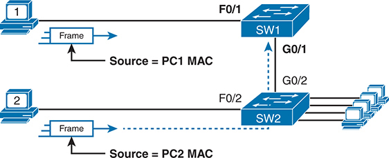
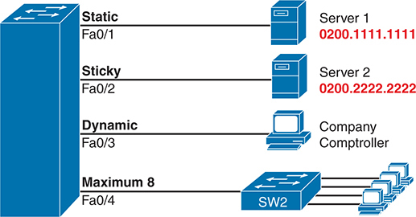
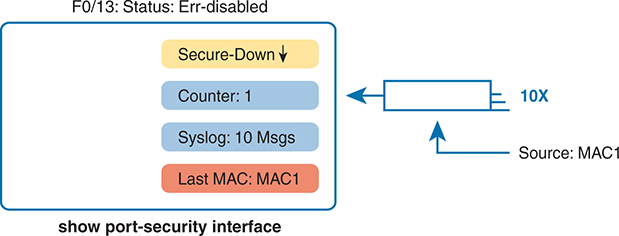
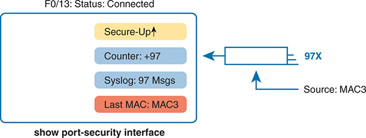

# Chapter 11


## Implementing Switch Port Security

This chapter covers the following exam topics:

5.0 Security Fundamentals

5.7 Configure and verify Layer 2 security features (DHCP snooping, dynamic ARP inspection, and port security)

In modern networks, security must be implemented in depth. The security architecture should use firewalls and intrusion prevention systems (IPS) at strategic locations, and hosts should use antivirus and antimalware tools. Routers, which already need to exist throughout the enterprise at the edge between local-area networks and wide-area networks, can be configured with IP access control lists to filter packets related to different IP address ranges in that enterprise.

LAN switches have a unique opportunity as a security enforcement point, particularly LAN switches connected to endpoint devices. Attackers often launch attacks from the endpoints connected to an enterprise LAN switch. The attacker might gain physical access to the endpoint or first infect the device to then launch an attack. Additionally, a mobile device can become infected while outside the company network and then later connect to the company network, with the attack launching at that point.

Engineers should assume that attacks might be launched from end-user devices connected directly to access ports on the enterprise's LAN switches, so Cisco switches include a number of useful tools to help prevent several types of attacks. This chapter discusses one such tool: port security. [Chapter 12](vol2_ch12.xhtml#ch12), "[DHCP Snooping and ARP Inspection](vol2_ch12.xhtml#ch12)," discusses two other switch security tools that take advantage of the switch's access layer role.

This short chapter takes a straightforward approach to the port security feature. The first section discusses the concepts, configuration, and verification, using the primary port security operational mode: shutdown mode. The second section then discusses some of the intricacies of the three operational modes: shutdown, protect, and restrict.

### "Do I Know This Already?" Quiz

Take the quiz (either here or use the PTP software) if you want to use the score to help you decide how much time to spend on this chapter. The letter answers are listed at the bottom of the page following the quiz. [Appendix C](vol2_appc.xhtml#appc), found both at the end of the book as well as on the companion website, includes both the answers and explanations. You can also find both answers and explanations in the PTP testing software.


**Table 11-1** "Do I Know This Already?" Foundation Topics Section-to-Question Mapping

| Foundation Topics Section | Questions |
| --- | --- |
| Port Security Concepts and Configuration | 1–3 |
| Port Security Violation Modes | 4, 5 |

**[1](vol2_ch11.xhtml#ques11_1a).** Which of the following is required when configuring port security with sticky learning?

1. Setting the maximum number of allowed MAC addresses on the interface with the **switchport port-security maximum** interface subcommand.
2. Enabling port security with the **switchport port-security** interface subcommand.
3. Defining the specific allowed MAC addresses using the **switchport port-security mac-address** interface subcommand.
4. All the other answers list required commands.

**[2](vol2_ch11.xhtml#ques11_2a).** A Cisco Catalyst switch connects to what should be individual user PCs. Each port has the same port security configuration, configured as follows:

[Click here to view code image](vol2_ch11_images.xhtml#f0223-01)

```
interface range gigabitethernet 0/1 - 24
switchport mode access
switchport port-security
switchport port-security mac-address sticky
```

Which of the following answers describe the result of the port security configuration created with these commands? (Choose two answers.)

1. Prevents unknown devices with unknown MAC addresses from sending data through the switch ports.
2. If a user connects a switch to the cable, prevents multiple devices from sending data through the port.
3. Will allow any one device to connect to each port and *will* save that device's MAC address into the startup-config.
4. Will allow any one device to connect to each port but *will not* save that device's MAC address into the startup-config.

**[3](vol2_ch11.xhtml#ques11_3a).** Which of the following commands list the MAC address table entries for MAC addresses configured by port security? (Choose two answers.)

1. **show mac address-table dynamic**
2. **show mac address-table**
3. **show mac address-table static**
4. **show mac address-table port-security**

**[4](vol2_ch11.xhtml#ques11_4a).** The **show port-security interface f0/1** command lists a port status of secure-shutdown. Which one of the following answers must be true about this interface at this time?

1. The **show interface status** command lists the interface status as connected.
2. The **show interface status** command lists the interface status as err-disabled.
3. The **show port-security interface** command could list a mode of shutdown or restrict, but not protect.
4. The **show port-security interface** command violation counter can increase while in the secure-shutdown port state.

**[5](vol2_ch11.xhtml#ques11_5a).** A switch's port Gi0/1 has been correctly enabled with port security. The configuration sets the violation mode to restrict. A frame that violates the port security policy enters the interface, followed by a frame that does not. Which of the following answers correctly describe what happens in this scenario? (Choose two answers.)

1. The switch puts the interface into an err-disabled state when the first frame arrives.
2. The switch generates syslog messages about the violating traffic for the first frame.
3. The switch increments the violation counter for Gi0/1 by 1.
4. The switch discards both the first and second frames.

Answers to the "Do I Know This Already?" quiz:

**[1](vol2_appc.xhtml#ques11_1)** B

**[2](vol2_appc.xhtml#ques11_2)** B, D

**[3](vol2_appc.xhtml#ques11_3)** B, C

**[4](vol2_appc.xhtml#ques11_4)** B

**[5](vol2_appc.xhtml#ques11_5)** B, C

### Foundation Topics

### Port Security Concepts and Configuration

If the network engineer knows what devices should be cabled and connected to particular interfaces on a switch, the engineer can use [port security](vol2_gloss.xhtml#gloss_259) to restrict that interface so that only the expected devices can use it. This approach reduces exposure to attacks in which the attacker connects a laptop to some unused switch port. When that inappropriate device attempts to send frames to the switch interface, the switch can take different actions, ranging from simply issuing informational messages to effectively shutting down the interface.

Port security identifies devices based on the source MAC address of Ethernet frames that the devices send. For example, in [Figure 11-1](vol2_ch11.xhtml#ch11fig01), PC1 sends a frame, with PC1's MAC address as the source address. SW1's F0/1 interface can be configured with port security, and if so, SW1 would examine PC1's MAC address and decide whether PC1 was allowed to send frames into port F0/1.




At the top, there is a computer labeled 1 sending a frame. The frame is shown as a rectangular box with an arrow pointing to the right, indicating the direction of data flow. The frame is labeled Source equals P C 1 M A C, identifying the source M A C address as P C 1. This frame enters a switch labeled S W 1 through port G 0 slash 1. S W 1 is connected to another switch, S W 2, via ports G 0 slash 1 and G 0 slash 2, illustrating a network link between the switches. At the bottom, a second computer labeled 2 is sending a frame with the source M A C address P C 2. This frame, similarly depicted with an arrow, enters S W 2 through port G 0 slash 2. S W 2 has several connections to other devices, shown by multiple lines extending from the switch.

**Figure 11-1** *Source MAC Addresses in Frames as They Enter a Switch*

Port security also has no restrictions on whether the frame came from a local device or was forwarded through other switches. For example, switch SW1 could use port security on its G0/1 interface, checking the source MAC address of the frame from PC2, when forwarded up to SW1 from SW2.

Port security has several flexible options, but all operate with the same core concepts. First, switches enable port security per port, with different settings available per port. Each port has a maximum number of allowed MAC addresses, meaning that for all frames entering that port, only that number of *different* source MAC addresses can be used before port security thinks a violation has occurred. When a frame with a new source MAC address arrives, pushing the number of MAC addresses past the allowed maximum, a port security violation occurs. At that point, the switch takes action—by default, discarding all future incoming traffic on that port.

The following list summarizes these ideas common to all variations of port security:


* It examines frames received on the interface to determine if a violation has occurred.
* It defines a maximum number of unique source MAC addresses allowed for all frames coming in the interface.
* It keeps a list and counter of all unique source MAC addresses on the interface.
* It monitors newly learned MAC addresses, considering those MAC addresses to cause a violation if the newly learned MAC address would push the total number of MAC table entries for the interface past the configured maximum allowed MAC addresses for that port.
* It takes action to discard frames from the violating MAC addresses, plus other actions depending on the configured violation mode.

Those rules define the basics, but port security allows other options as well, including options like these:

* Define a maximum of three MAC addresses, defining all three specific MAC addresses.
* Define a maximum of three MAC addresses but allow those addresses to be dynamically learned, allowing the first three MAC addresses learned.
* Define a maximum of three MAC addresses, predefining one specific MAC address, and allowing two more to be dynamically learned.

You might like the idea of predefining the MAC addresses for port security, but finding the MAC address of each device can be a bother. Port security provides a useful compromise using a feature called *sticky secure MAC addresses*. With this feature, port security learns the MAC addresses off each port so that you do not have to preconfigure the values. It also adds the learned MAC addresses to the port security configuration (in the running-config file). This feature helps reduce the big effort of finding out the MAC address of each device.

As you can see, port security has a lot of detailed options. The next few sections walk you through these options to pull the ideas together.

#### Configuring Port Security

Port security configuration involves several steps. First, port security works on both access ports and trunk ports, but it requires you to statically configure the port as a trunk or an access port, rather than let the switch dynamically decide whether to use trunking. The following configuration checklist details how to enable port security, set the maximum allowed MAC addresses per port, and configure the actual MAC addresses:


Step 1. Use the **switchport mode access** or the **switchport mode trunk** interface subcommands, respectively, to make the switch interface either a static access or trunk interface.

Step 2. Use the **switchport port-security** interface subcommand to enable port security on the interface.

Step 3. (Optional) Use the **switchport port-security maximum** *number* interface subcommand to override the default maximum number of allowed MAC addresses associated with the interface (1).

Step 4. (Optional) Use the **switchport port-security violation** {**protect** | **restrict** | **shutdown**} interface subcommand to override the default action to take upon a security violation (shutdown).

Step 5. (Optional) Use the **switchport port-security mac-address** *mac-address* interface subcommand to predefine any allowed source MAC addresses for this interface. Use the command multiple times to define more than one MAC address.

Step 6. (Optional) Use the **switchport port-security mac-address sticky** interface subcommand to tell the switch to "sticky learn" dynamically learned MAC addresses.

To demonstrate how to configure this variety of the settings, [Figure 11-2](vol2_ch11.xhtml#ch11fig02) and [Example 11-1](vol2_ch11.xhtml#exa11_1) show four examples of port security. Three ports operate as access ports, while port F0/4, connected to another switch, operates as a trunk.




On the left side, there is a large blue switch with four ports labeled F a 0 slash 1, F a 0 slash 2, F a 0 slash 3, and F a 0 slash 4. Each port connects to different devices and has specific security settings. Port F a 0 slash 1, labeled Static, connects to Server 1 with the M A C address 0 2 0 0 dot 1 1 1 1 dot 1 1 1 1 displayed in red text, indicating a static port security configuration where only the specified M A C address is allowed. Port F a 0 slash 2, labeled Sticky, connects to Server 2 with the M A C address 0 2 0 0 dot 2 2 2 2 dot 2 2 2 2 also shown in red text, illustrating a sticky port security configuration where the switch dynamically learns and retains the M A C address of the device connected to the port. Port F a 0 slash 3, labeled Dynamic, connects to a Company Comptroller computer, representing a dynamic port security configuration where the switch allows multiple dynamically learned M A C addresses up to a specified limit. Port F a 0 slash 4, labeled Maximum 8, connects to another switch labeled S W 2 which in turn connects to multiple computers, indicating that up to eight M A C addresses can be dynamically learned and allowed on this port.

**Figure 11-2** *Port Security Configuration Example*


**Example 11-1** *Variations on Port Security Configuration*

[Click here to view code image](vol2_ch11_images.xhtml#f0227-01)

```
SW1# show running-config
(Lines omitted for brevity)

interface FastEthernet0/1
 switchport mode access
 switchport port-security
 switchport port-security mac-address 0200.1111.1111
!
interface FastEthernet0/2
 switchport mode access
 switchport port-security
 switchport port-security mac-address sticky
!
interface FastEthernet0/3
 switchport mode access
 switchport port-security
!
interface FastEthernet0/4
 switchport mode trunk
 switchport port-security
 switchport port-security maximum 8
```

First, scan the configuration for all four interfaces in [Example 11-1](vol2_ch11.xhtml#exa11_1), focusing on the first two interface subcommands in each case. Note that the first three interfaces in the example use the same first two interface subcommands, matching the first two configuration steps noted before [Figure 11-2](vol2_ch11.xhtml#ch11fig02). The **switchport port-security** command enables port security, with all defaults, with the **switchport mode access** command meeting the requirement to configure the port as either an access or trunk port. The final port, F0/4, has a similar configuration, except that it has been configured as a trunk rather than as an access port.

Next, scan all four interfaces again, and note that the configuration differs on each interface after those first two interface subcommands. Each interface simply shows a different example for perspective.

The first interface, FastEthernet 0/1, adds one optional port security subcommand: **switchport port-security mac-address 0200.1111.1111**, which defines a specific source MAC address. With the default maximum source address setting of 1, only frames with source MAC 0200.1111.1111 will be allowed in this port. When a frame with a source other than 0200.1111.1111 enters F0/1, the switch would normally perform MAC address learning and want to add the new source MAC address to the MAC address table. Port security will see that action as learning one too many MAC addresses on the port, taking the default violation action to disable the interface.

As a second example, FastEthernet 0/2 uses the same logic as FastEthernet 0/1, except that it uses the sticky learning feature. For port F0/2, the configuration of the **switchport port-security mac-address sticky** command tells the switch to dynamically learn source MAC addresses and add **port-security** commands to the running-config. [Example 11-2](vol2_ch11.xhtml#exa11_2) shows the running-config file that lists the sticky-learned MAC address in this case.

**Example 11-2** *Configuration Added by the Port Security Sticky Feature*

[Click here to view code image](vol2_ch11_images.xhtml#f0228-01)

```
SW1# show running-config interface f0/2
Building configuration...
Current configuration : 188 bytes
!
interface FastEthernet0/2
  switchport mode access
  switchport port-security
  switchport port-security mac-address sticky
  switchport port-security mac-address sticky 0200.2222.2222
```

Port security does not save the configuration of the sticky addresses, so use the **copy running-config startup-config** command if desired.

The other two interfaces in [Example 11-1](vol2_ch11.xhtml#exa11_1) do not predefine MAC addresses, nor do they sticky-learn the MAC addresses. The only difference between these two interfaces' port security configuration is that FastEthernet 0/4 supports eight MAC addresses because it connects to another switch and should receive frames with multiple source MAC addresses. Interface F0/3 uses the default maximum of one MAC address.

Note

Switches can also use port security on voice ports and EtherChannels. For voice ports, make sure to configure the maximum MAC address to at least two (one for the phone, or for a PC connected to the phone). On EtherChannels, the port security configuration should be placed on the port-channel interface, rather than the individual physical interfaces in the channel.

#### Verifying Port Security

The **show port-security interface** command provides the most insight into how port security operates, as shown in [Example 11-3](vol2_ch11.xhtml#exa11_3). This command lists the configuration settings for port security on an interface; plus it lists several important facts about the current operation of port security, including information about any security violations. The two commands in the example show interfaces F0/1 and F0/2, based on [Example 11-1](vol2_ch11.xhtml#exa11_1)'s configuration.

**Example 11-3** *Using Port Security to Define Correct MAC Addresses of Particular Interfaces*

[Click here to view code image](vol2_ch11_images.xhtml#f0228-02)

```
SW1# show port-security interface fastEthernet 0/1
Port Security              : Enabled
Port Status                : Secure-shutdown
Violation Mode             : Shutdown
Aging Time                 : 0 mins
Aging Type                 : Absolute

SecureStatic Address Aging : Disabled
Maximum MAC Addresses      : 1
Total MAC Addresses        : 1
Configured MAC Addresses   : 1
Sticky MAC Addresses       : 0
Last Source Address:Vlan   : 0013.197b.5004:1
Security Violation Count   : 1

SW1# show port-security interface fastEthernet 0/2
Port Security              : Enabled
Port Status                : Secure-up
Violation Mode             : Shutdown
Aging Time                 : 0 mins
Aging Type                 : Absolute
SecureStatic Address Aging : Disabled
Maximum MAC Addresses      : 1
Total MAC Addresses        : 1
Configured MAC Addresses   : 1
Sticky MAC Addresses       : 1
Last Source Address:Vlan   : 0200.2222.2222:1
Security Violation Count   : 0
```

The two commands in [Example 11-3](vol2_ch11.xhtml#exa11_3) confirm that a security violation has occurred on FastEthernet 0/1, but no violations have occurred on FastEthernet 0/2. The **show port-security interface fastethernet 0/1** command shows that the interface is in a *secure-shutdown* state, which means that the interface has been disabled because of port security. In this case, another device connected to port F0/1, sending a frame with a source MAC address other than 0200.1111.1111, is causing a violation. However, port Fa0/2, which used sticky learning, simply learned the MAC address used by Server 2.

#### Port Security MAC Addresses

To complete this chapter, take a moment to think about Layer 2 switching, along with all those examples of output from the **show mac address-table dynamic** EXEC command.

Once a switch port has been configured with port security, the switch no longer considers MAC addresses associated with that port as being dynamic entries as listed with the **show mac address-table dynamic** EXEC command. Even if the MAC addresses are dynamically learned, once port security has been enabled, you need to use one of these options to see the MAC table entries associated with ports using port security:

* **show mac address-table secure:** Lists MAC addresses associated with ports that use port security
* **show mac address-table static:** Lists MAC addresses associated with ports that use port security, as well as any other statically defined MAC addresses

[Example 11-4](vol2_ch11.xhtml#exa11_4) proves the point. It shows two commands about interface F0/2 from the port security example shown in [Figure 11-2](vol2_ch11.xhtml#ch11fig02) and [Example 11-1](vol2_ch11.xhtml#exa11_1). In that example, port security was configured on F0/2 with sticky learning, so from a literal sense, the switch learned a MAC address off that port (0200.2222.2222). However, the **show mac address-table dynamic** command does not list the address and port because IOS considers that MAC table entry to be a static entry. The **show mac address-table secure** command does list the address and port.

**Example 11-4** *Using the **secure** Keyword to See MAC Table Entries When Using Port Security*

[Click here to view code image](vol2_ch11_images.xhtml#f0230-01)

```
SW1# show mac address-table secure interface F0/2
          Mac Address Table
-------------------------------------------

Vlan    Mac Address      Type         Ports
----    -----------      --------     -----
 1      0200.2222.2222   STATIC       Fa0/2
Total Mac Addresses for this criterion: 1

SW1# show mac address-table dynamic interface f0/2
          Mac Address Table
-------------------------------------------

Vlan    Mac Address      Type         Ports
----    -----------      --------     -----
SW1#
```

### Port Security Violation Modes

The first half of the chapter discussed many details of port security, but it mostly ignored one major feature: the port security violation mode. The [violation mode](vol2_gloss.xhtml#gloss_360) defines how port security should react when a violation occurs.

First, to review, what is a port security violation? Any received frame that breaks the port security rules on an interface. For example:

* For an interface that allows any two MAC addresses, a violation occurs when the total of preconfigured and learned MAC addresses on the interface exceeds the configured maximum of two.
* For an interface that predefines all the specific MAC addresses allowed on the interface, a violation occurs when the switch receives a frame whose source MAC is not one of those configured addresses.

With port security, each switch port can be configured to use one of three violation modes that defines the actions to take when a violation occurs. All three options cause the switch to discard the offending frame (a frame whose source MAC address would push the number of learned MAC addresses over the limit). However, the modes vary in how many other steps they take. For instance, some modes include the action of the switch generating syslog messages and SNMP Trap messages, while some define the action to disable the interface. [Table 11-2](vol2_ch11.xhtml#ch11tab02) lists the three modes, their actions, along with the keywords that enable each mode on the **switchport port-security violation** {**protect | restrict | shutdown**} interface subcommand:


**Table 11-2** Actions When Port Security Violation Occurs

| Option on the switchport port-security violation Command | Protect | Restrict | Shutdown |
| --- | --- | --- | --- |
| Discards offending traffic | Yes | Yes | Yes |
| Sends log and SNMP messages | No | Yes | Yes |
| Disables the interface by putting it in an err-disabled state, discarding all traffic | No | No | Yes |

Because IOS reacts so differently with shutdown mode as compared to restrict and protect modes, the next few pages explain the differences—first for shutdown mode, then for the other two modes.

#### Port Security Shutdown Mode

When the (default) shutdown violation mode is used and a port security violation occurs on a port, port security stops all frame forwarding on the interface, both in and out of the port. In effect, it acts as if port security has shut down the port; however, it does not literally configure the port with the **shutdown** interface subcommand. Instead, port security uses the [err-disabled](vol2_gloss.xhtml#gloss_132) feature. Cisco switches use the err-disabled state for a wide range of purposes, but when using port security shutdown mode and a violation occurs, the following happens:


* The switch interface state (per **show interfaces** and **show interfaces status**) changes to an err-disabled state.
* The switch interface port security state (per **show port-security**) changes to a secure-shutdown state.
* The switch stops sending and receiving frames on the interface.

Once port security has placed a port in err-disabled state, by default, the port remains in an err-disabled state until someone takes action. To recover from an err-disabled state, the interface must be shut down with the **shutdown** command and then enabled with the **no shutdown** command. Alternately, the switch can be configured to automatically recover from the err-disabled state, when caused by port security, with these commands:

* **errdisable recovery cause psecure-violation:** A global command to enable automatic recovery for interfaces in an err-disabled state caused by port security
* **errdisable recovery interval** *seconds***:** A global command to set the time to wait before recovering the interface

To take a closer look at shutdown mode, start by checking the configuration state of the switch. You can check the port security configuration on any interface with the **show port-security interface** *type number* command, as seen previously in [Example 11-2](vol2_ch11.xhtml#exa11_2), but the **show port-security** command (as listed in [Example 11-5](vol2_ch11.xhtml#exa11_5)) shows briefer output, with one line per enabled interface.

**Example 11-5** *Confirming the Port Security Violation Mode*

[Click here to view code image](vol2_ch11_images.xhtml#f0232-01)

```
SW1# show port-security
Secure Port  MaxSecureAddr  CurrentAddr  SecurityViolation  Security Action
                (Count)       (Count)          (Count)
---------------------------------------------------------------------------
     Fa0/13              1            1                  1         Shutdown
---------------------------------------------------------------------------
Total Addresses in System (excluding one mac per port) : 0
Max Addresses limit in System (excluding one mac per port) : 8192
```

Note that for these next examples, a switch has configured port security on port Fa0/13 only. In this case, the switch appears to be configured to support one MAC address, has already reached that total, and has a security violation action of "shutdown."

Next, [Example 11-6](vol2_ch11.xhtml#exa11_6) shows the results after a port security violation has already occurred on port F0/13. The first command confirms the err-disabled state (per the **show interfaces status** command) and the secure-shutdown state (per the **show port-security** command).

**Example 11-6** *Port Security Status in Shutdown Mode After a Violation*

[Click here to view code image](vol2_ch11_images.xhtml#f0232-02)

```
! The next lines show the log message generated when the violation occurred.
Jul 31 18:00:22.810: %PORT_SECURITY-2-PSECURE_VIOLATION: Security violation
occurred, caused by MAC address 0200.3333.3333 on port FastEthernet0/13

! The next command shows the err-disabled state, implying a security violation.
SW1# show interfaces Fa0/13 status

Port    Name                   Status        Vlan   Duplex  Speed  Type
Fa0/13                         err-disabled  1      auto    auto   10/100BaseTX
!
! The next command's output has shading for several of the most important facts.
SW1# show port-security interface Fa0/13
Port Security               : Enabled
Port Status                 : Secure-shutdown
Violation Mode              : Shutdown
Aging Time                  : 0 mins
Aging Type                  : Absolute
SecureStatic Address Aging  : Disabled
Maximum MAC Addresses       : 1
Total MAC Addresses         : 1
Configured MAC Addresses    : 1
Sticky MAC Addresses        : 0
Last Source Address:Vlan    : 0200.3333.3333:2
Security Violation Count    : 1
```

The output of the **show port-security interface** command lists the current port-security status (secure-shutdown) as well as the configured mode (shutdown). The last line of output lists the number of violations that caused the interface to fail to an err-disabled state, while the second-to-last line identifies the MAC address and VLAN of the device that caused the violation.

[Figure 11-3](vol2_ch11.xhtml#ch11fig03) summarizes these behaviors, assuming the same scenario shown in the example.




The status is labeled as Err-disabled. The diagram shows a box with several indicators: Secure-Down in a yellow box with a downward arrow, Counter: 1 in a blue box, Syslog: 10 Msgs also in a blue box, and Last M A C: M A C 1 in a red box. These indicators provide information about the security state of the port. Secure-Down indicates that the port security feature is currently down. The Counter: 1 indicates that one security violation has occurred. Syslog: 10 Msgs means that ten syslog messages have been generated due to this violation. Last M A C: M A C 1 shows the M A C address that triggered the security violation. To the right of this box, there is an icon representing an Ethernet cable or connection, labeled 10 X.

**Figure 11-3** *Summary of Actions: Port Security Violation Mode Shutdown*

The violations counter notes the number of times the interface has been moved to the err-disabled (secure-shutdown) state. For instance, the first time it fails, the counter increments to 1; while err-disabled, many frames can arrive, but the counter remains at 1. IOS will reset the counter to 0 when you recover the interface using a shutdown/no shutdown command combination, so that the next violation will cause the counter to increment to 1.

#### Port Security Protect and Restrict Modes

The restrict and protect violation modes take a much different approach to securing ports. These modes still discard offending traffic, but the interface remains in a connected (up/up) state and in a port security state of secure-up. As a result, the port continues to forward good traffic but discards offending traffic.

Having a port in a seemingly good state that also discards traffic can be a challenge when troubleshooting. Basically, you have to know about the feature and then know how to tell when port security is discarding some traffic on a port even though the interface status looks good.

With protect mode, the only action the switch takes for a frame that violates the port security rules is to discard the frame. The switch does not change the port to an err-disabled state, does not generate messages, and does not even increment the violations counter.

[Example 11-7](vol2_ch11.xhtml#exa11_7) shows a sample with protect mode after several violations have occurred. Note that the **show** command confirms the mode (protect) as configured in the top part of the example, with a port security state of secure-up—a state that will not change in protect mode. Also, note that the counter at the bottom shows 0, even though several violations have occurred, because protect mode does not count the violating frames.

**Example 11-7** *Port Security Using Protect Mode*

[Click here to view code image](vol2_ch11_images.xhtml#f0234-01)

```
SW1# show running-config
! Lines omitted for brevity
interface FastEthernet0/13
  switchport mode access
  switchport port-security
  switchport port-security mac-address 0200.1111.1111
  switchport port-security violation protect
! Lines omitted for brevity

SW1# show port-security interface Fa0/13
Port Security               : Enabled
Port Status                 : Secure-up
Violation Mode              : Protect
Aging Time                  : 0 mins
Aging Type                  : Absolute
SecureStatic Address Aging  : Disabled
Maximum MAC Addresses       : 1
Total MAC Addresses         : 1
Configured MAC Addresses    : 1
Sticky MAC Addresses        : 0
Last Source Address:Vlan    : 0000.0000.0000:0
Security Violation Count    : 0
```

Note

The small particulars of the violation counters and last source address might be slightly different with some older switch models and IOS versions. Note that this edition's testing is based on 2960XR switches running IOS 15.2.(6)E2.

While shutdown mode disables the interface, and protect mode does nothing more than discard the offending traffic, restrict mode provides a compromise between the other two modes. If [Example 11-7](vol2_ch11.xhtml#exa11_7) had used the restrict violation mode instead of protect, the port status would have also remained in a secure-up state; however, IOS would show some indication of port security activity, such as an accurate incrementing violation counter, as well as syslog messages. [Example 11-8](vol2_ch11.xhtml#exa11_8) shows an example of the violation counter and ends with a sample port security syslog message. In this case, 97 incoming frames so far violated the rules, with the most recent frame having a source MAC address of 0200.3333.3333 in VLAN 1.

**Example 11-8** *Port Security Using Violation Mode Restrict*

[Click here to view code image](vol2_ch11_images.xhtml#f0234-02)

```
SW1# show port-security interface fa0/13
Port Security               : Enabled
Port Status                 : Secure-up
Violation Mode              : Restrict
Aging Time                  : 0 mins
Aging Type                  : Absolute
SecureStatic Address Aging  : Disabled
Maximum MAC Addresses       : 1
Total MAC Addresses         : 1
Configured MAC Addresses    : 1
Sticky MAC Addresses        : 0
Last Source Address:Vlan    : 0200.3333.3333:1
Security Violation Count    : 97
!
! The following log message also points to a port security issue.
!
01:46:58: %PORT_SECURITY-2-PSECURE_VIOLATION: Security violation occurred, caused by
MAC address 0200.3333.3333 on port FastEthernet0/13.
```

[Figure 11-4](vol2_ch11.xhtml#ch11fig04) summarizes the key points about the restrict mode for port security. In this case, the figure matches the same scenario as the example again, with 97 total violating frames arriving so far, with the most recent being from source MAC address MAC3.




The status is labeled as Connected. The diagram includes a box with several indicators: Secure-Up in a yellow box with an upward arrow, Counter: plus 97 in a blue box, Syslog: 97 Msgs also in a blue box, and Last M A C: M A C 3 in a red box. Secure-Up indicates that the port security feature is active and functioning. The Counter: plus 97 shows that there have been 97 security violations. Syslog: 97 Msgs means that 97 syslog messages have been generated due to these violations. Last M A C: M A C 3 displays the last M A C address that caused a security violation. To the right of this box, an icon represents an Ethernet cable or connection, labeled 97 X, indicating that 97 attempts were made from the source M A C address M A C 3.

**Figure 11-4** *Summary of Actions: Port Security Violation Mode Restrict*

### Chapter Review

One key to doing well on the exams is to perform repetitive spaced review sessions. Review this chapter's material using either the tools in the book or interactive tools for the same material found on the book's companion website. Refer to the "[Your Study Plan](vol2_appf.xhtml#appf)" element for more details. [Table 11-3](vol2_ch11.xhtml#ch11tab03) outlines the key review elements and where you can find them. To better track your study progress, record when you completed these activities in the second column.

**Table 11-3** Chapter Review Tracking

| Review Element | Review Date(s) | Resource Used |
| --- | --- | --- |
| Review key topics |  | Book, website |
| Review key terms |  | Book, website |
| Answer DIKTA questions |  | Book, PTP |
| Review command tables |  | Book |
| Review memory tables |  | Book, website |
| Review config checklists |  | Book, website |
| Do labs |  | Sim Lite, blog |
| Watch video |  | Website |

### Review All the Key Topics


**Table 11-4** Key Topics for [Chapter 11](vol2_ch11.xhtml#ch11)

| Key Topic Element | Description | Page Number |
| --- | --- | --- |
| List | Summary of port security concepts | [225](vol2_ch11.xhtml#page_225) |
| List | Port security configuration checklist | [226](vol2_ch11.xhtml#page_226) |
| [Example 11-1](vol2_ch11.xhtml#exa11_1) | Port security configuration samples | [227](vol2_ch11.xhtml#page_227) |
| [Table 11-2](vol2_ch11.xhtml#ch11tab02) | Port security actions and the results of each action | [231](vol2_ch11.xhtml#page_231) |
| List | Switch actions with a port in err-disabled state | [231](vol2_ch11.xhtml#page_231) |

### Key Terms You Should Know

[error disabled (err-disable)](vol2_ch11.xhtml#key_135)

[port security](vol2_ch11.xhtml#key_136)

[violation mode](vol2_ch11.xhtml#key_137)

### Do Labs

The Sim Lite software is a version of Pearson's full simulator learning product with a subset of the labs, included free with this book. The Sim Lite with this book includes a couple of labs about port security. Also, check the author's blog site pages for configuration exercises (Config Labs) at <https://www.certskills.com/config-labs>.

### Command References

[Tables 11-5](vol2_ch11.xhtml#ch11tab05) and [11-6](vol2_ch11.xhtml#ch11tab06) list configuration and verification commands used in this chapter. As an easy review exercise, cover the left column in a table, read the right column, and try to recall the command without looking. Then repeat the exercise, covering the right column, and try to recall what the command does.

**Table 11-5** [Chapter 11](vol2_ch11.xhtml#ch11) Configuration Command Reference

| Command | Mode/Purpose/Description |
| --- | --- |
| **switchport mode {access | trunk}** | Interface configuration mode command that tells the switch to always be an access port, or always be a trunk port |
| **switchport port-security mac-address** *mac-address* | Interface configuration mode command that statically adds a specific MAC address as an allowed MAC address on the interface |
| **switchport port-security mac-address sticky** | Interface subcommand that tells the switch to learn MAC addresses on the interface and add them to the configuration for the interface as secure MAC addresses |
| **switchport port-security maximum** *value* | Interface subcommand that sets the maximum number of static secure MAC addresses that can be assigned to a single interface |
| **switchport port-security violation** {**protect** | **restrict** | **shutdown**} | Interface subcommand that tells the switch what to do if an inappropriate MAC address tries to access the network through a secure switch port |
| **errdisable recovery cause psecure-violation** | Global command that enables the automatic recovery from err-disabled state for ports that reach that state due to port security violations |
| **errdisable recovery interval** *seconds* | Global command that sets the delay, in seconds, before a switch attempts to recover an interface in err-disabled mode, regardless of the reason for that interface being in that state |
| **shutdown**  **no shutdown** | Interface subcommands that administratively disable and enable an interface, respectively |


**Table 11-6** [Chapter 11](vol2_ch11.xhtml#ch11) EXEC Command Reference

| Command | Purpose |
| --- | --- |
| **show running-config** | Lists the currently used configuration |
| **show running-config | interface** *type number* | Displays the running-configuration excerpt of the listed interface and its subcommands only |
| **show mac address-table dynamic** [**interface** *type number*] | Lists the dynamically learned entries in the switch's address (forwarding) table |
| **show mac address-table secure** [**interface** *type number*] | Lists MAC addresses defined or learned on ports configured with port security |
| **show mac address-table static** [**interface** *type number*] | Lists static MAC addresses and MAC addresses learned or defined with port security |
| **show interfaces** [**interface** *type number*] **status** | Lists one output line per interface (or for only the listed interface if included), noting the description, operating state, and settings for duplex and speed on each interface |
| **show port-security interface** *type number* | Lists an interface's port security configuration settings and security operational status |
| **show port-security** | Lists one line per interface that summarizes the port security settings for any interface on which it is enabled |