# Chapter 15


## Quality of Service (QoS)

This chapter covers the following exam topics:

4.0 IP Services

4.7 Explain the forwarding per-hop behavior (PHB) for QoS such as classification, marking, queuing, congestion, policing, and shaping

Quality of Service (QoS) refers to tools that network devices can use to manage several related characteristics of what happens to a packet while it flows through a network. Specifically, these tools manage the bandwidth made available to that type of packet, the delay the packet experiences, the jitter (variation in delay) between successive packets in the same flow, and the percentage of packet loss for packets of each class. These tools balance the tradeoffs of which types of traffic receive network resources and when, giving more preference to some traffic and less preference to others.

QoS tools define actions a device can apply to a message between the time it enters the device until it exits the device. QoS defines these actions as [per-hop behaviors (PHBs)](vol2_gloss.xhtml#gloss_246), which is a formal term to refer to actions other than storing and forwarding a message. These actions can delay the message, discard it, or even change header fields. The device can choose different PHBs for different kinds of messages, improving the QoS behavior for some messages, while worsening the QoS behavior for others.

This chapter works through the QoS tools listed in the single QoS exam topic: "Explain the forwarding per-hop behavior (PHB) for QoS such as classification, marking, queuing, congestion, policing, and shaping." Each topic emphasizes the problems each tool solves and how each tool manages bandwidth, delay, jitter, and loss.

### "Do I Know This Already?" Quiz

Take the quiz (either here or use the PTP software) if you want to use the score to help you decide how much time to spend on this chapter. The letter answers are listed at the bottom of the page following the quiz. [Appendix C](vol2_appc.xhtml#appc), found both at the end of the book as well as on the companion website, includes both the answers and explanations. You can also find both answers and explanations in the PTP testing software.

**Table 15-1** "Do I Know This Already?" Foundation Topics Section-to-Question Mapping

| Foundation Topics Section | Questions |
| --- | --- |
| Introduction to QoS | 1 |
| Classification and Marking | 2, 3 |
| Queuing | 4 |
| Shaping and Policing | 5 |
| Congestion Avoidance | 6 |


**[1](vol2_ch15.xhtml#ques15_1a).** Which of the following attributes do QoS tools manage? (Choose three answers.)

1. Bandwidth
2. Delay
3. Load
4. MTU
5. Loss

**[2](vol2_ch15.xhtml#ques15_2a).** Which of the following QoS marking fields could remain with a packet while being sent through four different routers, over different LAN and WAN links? (Choose two answers.)

1. CoS
2. IPP
3. DSCP
4. MPLS EXP

**[3](vol2_ch15.xhtml#ques15_3a).** Which of the following are available methods of classifying packets in DiffServ on Cisco routers? (Choose three answers.)

1. Matching the IP DSCP field
2. Matching the 802.1p CoS field
3. Matching fields with an extended IP ACL
4. Matching the SNMP Location variable

**[4](vol2_ch15.xhtml#ques15_4a).** Which of the following behaviors are applied to a low latency queue in a Cisco router or switch? (Choose two answers.)

1. Shaping
2. Policing
3. Priority scheduling
4. Round-robin scheduling

**[5](vol2_ch15.xhtml#ques15_5a).** Enterprise router R1 sends data over a WAN link to ISP router ISP1. R1 shapes outgoing traffic to 200 Mbps, while ISP1 polices incoming traffic at a 250-Mbps rate. For an extended period (long enough to exhaust any bursting abilities of the shaper and policer), R1 receives 300 Mbps of traffic that it routes out the link connected to ISP1. Which answers describe the most likely shaping and policing actions in this scenario? (Choose two answers.)

1. The policer measures an incoming rate that exceeds the policing rate.
2. The policer measures an incoming rate that does not exceed the policing rate.
3. The shaper is not queuing packets to slow down the sending rate.
4. The shaper is queuing packets to slow down the sending rate.

**[6](vol2_ch15.xhtml#ques15_6a).** A queuing system has three queues serviced with round-robin scheduling and one low latency queue that holds all voice traffic. Round-robin queue 1 holds predominantly UDP traffic, while round-robin queues 2 and 3 hold predominantly TCP traffic. The packets in each queue have a variety of DSCP markings per the QoS design. In which queues would it make sense to use a congestion avoidance (drop management) tool? (Choose two answers.)

1. The LLQ
2. Queue 1
3. Queue 2
4. Queue 3

Answers to the "Do I Know This Already?" quiz:

**[1](vol2_appc.xhtml#ques15_1)** A, B, E

**[2](vol2_appc.xhtml#ques15_2)** B, C

**[3](vol2_appc.xhtml#ques15_3)** A, B, C

**[4](vol2_appc.xhtml#ques15_4)** B, C

**[5](vol2_appc.xhtml#ques15_5)** A, D

**[6](vol2_appc.xhtml#ques15_6)** C, D

### Foundation Topics

### Introduction to QoS

Routers typically sit at the WAN edge, with both WAN interfaces and LAN interfaces. Those LAN interfaces typically run at much faster speeds, while the WAN interfaces run at slower speeds. While that slower WAN interface is busy sending the packets waiting in the router, hundreds or even thousands more IP packets could arrive in the LAN interfaces, all needing to be forwarded out that same WAN interface. What should the router do? Send them all, in the same order in which they arrived? Prioritize the packets, to send some earlier than others, preferring one type of traffic over another? Discard some of the packets when the number of packets waiting to exit the router gets too large?

The preceding paragraph describes some of the many classic [Quality of Service (QoS)](vol2_gloss.xhtml#gloss_275) questions in networking. QoS refers to the tools that networking devices use to apply some different treatment to packets in the network as they pass through the device. For instance, the WAN edge router would queue packets waiting for the WAN interface to be available. The router could also use a queue scheduling algorithm to determine which packets should be sent next, using some other order than the arrival order—giving some packets better service and some worse service.

#### QoS: Managing Bandwidth, Delay, Jitter, and Loss

Cisco offers a wide range of QoS tools on both routers and switches. All these tools give you the means to manage four characteristics of network traffic:


* Bandwidth
* Delay
* Jitter
* Loss

[Bandwidth](vol2_gloss.xhtml#gloss_051) refers to the speed of a link, in bits per second (bps). But while we think of bandwidth as speed, it helps to also think of bandwidth as the capacity of the link, in terms of how many bits can be sent over the link per second. The networking device's QoS tools determine what packet is sent over the link next, so the networking device is in control of which messages get access to the bandwidth next and how much of that bandwidth (capacity) each type of traffic gets over time.

For example, consider a typical WAN edge router that has hundreds of packets waiting to exit the WAN link. An engineer might configure a queuing tool to reserve 10 percent of the bandwidth for voice traffic, 50 percent for mission-critical data applications, and leave the rest of the bandwidth for all other types of traffic. The queuing tool could then use those settings to make the choice about which packets to send next.

[Delay](vol2_gloss.xhtml#gloss_104) can be described as one-way delay or round-trip delay. *One-way delay* refers to the time between sending one packet and that same packet arriving at the destination host. *Round-trip delay* counts the one-way delay plus the time for the receiver of the first packet to send back a packet—in other words, the time it takes to send one packet between two hosts and receive one back. Many different individual actions impact delay; this chapter discusses a few of those, including queuing and shaping delay.

[Jitter](vol2_gloss.xhtml#gloss_186) refers to the variation in one-way delay between consecutive packets sent by the same application. For example, imagine an application sends a few hundred packets to one particular host. The first packet's one-way delay is 300 milliseconds (300 ms, or .3 seconds). The next packet's one-way delay is 300 ms; so is the third's; and so on. In that case, there is no jitter. However, if instead the first packet has a one-way delay of 300 ms, the next has a one-way delay of 310 ms, and the next has 325 ms, then there is some variation in the delay, 10 ms between packets 1 and 2, and another 15 ms between packets 2 and 3. That difference is called jitter.

Finally, [loss](vol2_gloss.xhtml#gloss_199) refers to the number of lost messages, usually as a percentage of packets sent. The comparison is simple: if the sender for some application sends 100 packets, and only 98 arrive at the destination, that particular application flow experienced 2 percent loss. Loss can be caused by many factors, but often, people think of loss as something caused by faulty cabling or poor WAN services. That is one cause. However, more loss happens because of the normal operation of the networking devices, in which the devices' queues get too full, so the device has nowhere to put new packets, and it discards the packet. Several QoS tools manage queuing systems to help control and avoid loss.

#### Types of Traffic

With QoS, a network engineer sets about to prefer one type of traffic over another in regard to bandwidth, delay, jitter, and loss. Sometimes, that choice relates to the specific business. For example, if all the mission-critical applications sit on servers in three known subnets, then the QoS plan could be set up to match packets going to/from that subnet and give that traffic better treatment compared to other traffic. However, in other cases, the choice of how to apply QoS tools relates to the nature of different kinds of applications. Some applications have different QoS needs than others. This next topic compares the basic differences in QoS needs based on the type of traffic.

##### Data Applications

First, consider a basic web application, with a user at a PC or tablet. The user types in a URI to request a web page. That request may require a single packet going to the web server, but it may result in hundreds or thousands of packets coming back to the web client, as shown in [Figure 15-1](vol2_ch15.xhtml#ch15fig01).


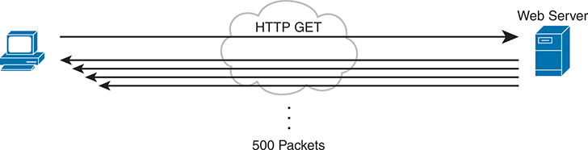


On the left, a computer represents the client, which sends an H T T P G E T request to the web server, depicted on the right. The communication path is shown with an arrow labeled H T T P G E T pointing from the client to the web server through a cloud symbolizing the internet. Upon receiving the H T T P G E T request, the web server responds with data packets. The response is illustrated with multiple arrows pointing back to the client, indicating the flow of data from the server to the client. There is a label beneath these arrows stating 500 Packets, which indicates the number of data packets sent by the server to the client in response to the initial H T T P G E T request.

**Figure 15-1** *Interactive Data Application*

Note

If you wonder how one web page might require thousands of packets, consider this math: with a 1500-byte IP maximum transmission unit (MTU), the data part of a TCP segment could be at most 1460 bytes (1500 bytes minus 20 bytes each for the IP and TCP header). In this example, 1000 such packets total to 1,460,000 bytes, or about 1.5 MB. It is easy to imagine a web page with just a few graphics that totals more than 1.5 MB in size.

So, what is the impact of bandwidth, delay, jitter, and loss on an interactive web-based application? First, the packets require a certain amount of bandwidth capacity. As for delay, each of those packets from the server to the client takes some amount of one-way delay, with some jitter as well. Of the 500 packets shown in [Figure 15-1](vol2_ch15.xhtml#ch15fig01), if some are lost (transmission errors, discarded by devices, or other reasons), then the server's TCP logic will retransmit, but parts of the web page may not show up right away.

While QoS tools focus on managing bandwidth, delay, jitter, and loss, the user mainly cares about the quality of the overall experience. For instance, with a web application, how long after clicking do you see something useful in your web browser? So, as a user, you care about the *quality of experience (QoE)*, which is a term referring to users' perception of their use of the application on the network. QoS tools directly impact bandwidth, delay, jitter, and loss, which then should have some overall good effect to influence the users' QoE. And you can use QoS tools to create a better QoE for more important traffic; for instance, you might give certain business-critical applications better QoS treatment, which improves QoE for users of those apps.

In contrast, a noninteractive data application (historically called *batch* traffic)—for instance, data backup or file transfers—has different QoS requirements than interactive data applications. Batch applications typically send more data than interactive applications, but because no one is sitting there waiting to see something pop on the screen, the delay and jitter do not matter much. Much more important for these applications is meeting the need to complete the larger task (transferring files) within a larger time window. QoS tools can be used to provide enough bandwidth to meet the capacity needs of these applications and manage loss to reduce the number of retransmissions.

##### Voice and Video Applications

Voice and video applications each have a similar breakdown of interactive and noninteractive flows. To make the main points about both voice and video, this section looks more deeply at voice traffic.

Before looking at voice, though, first think about the use of the term *flow* in networking. A flow is all the data moving from one application to another over the network, with one flow for each direction. For example, if you open a website and connect to a web server, the web page content that moves from the server to the client is one flow. Listen to some music with a music app on your phone, and that creates a flow from your app to the music app's server and a flow from the server back to your phone. From a voice perspective, a phone call between two IP phones would create a flow for each direction. For video, it could be the traffic from one video surveillance camera collected by security software.

Now on to voice, specifically voice over IP (VoIP). VoIP defines the means to take the sound made at one telephone and send it inside IP packets over an IP network, playing the sound back on the other telephone. [Figure 15-2](vol2_ch15.xhtml#ch15fig02) shows the general idea. The figure includes these steps:

Step 1. The phone user makes a phone call and begins speaking.

Step 2. A chip called a *codec* processes (digitizes) the sound to create a binary code (160 bytes with the G.711 codec, for example) for a certain time period (usually 20 ms).

Step 3. The phone places the data into an IP packet.

Step 4. The phone sends the packet to the destination IP phone.

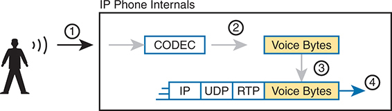


The diagram is divided into several steps, showing the internal workings of an I P phone and how voice data is encapsulated into network packets. Step 1. The process begins with a person speaking into the I P phone. This is represented by a human figure with sound waves emanating from them, indicating the input of voice. Step 2. Inside the I P phone, the analog voice signal is converted into digital form using a C O D E C (Coder-Decoder), specifically the G dot 711 codec. This step is shown with an arrow leading to a box labeled C O D E C, which then produces Voice Bytes, representing the digital voice data. Step 3. The voice bytes are then prepared for transmission. This step involves placing the voice bytes into a protocol stack, encapsulating them within different network protocol layers. The diagram shows the voice bytes being encapsulated in a series of protocol headers: Real-time Transport Protocol (R T P), User Datagram Protocol (U D P), and Internet Protocol (I P). Step 4. The encapsulated voice bytes are transmitted over the network. This step is depicted by an arrow pointing outwards, indicating the outgoing Vo I P packet ready for network transmission. The image uses labels and arrows to indicate each step of the process, from capturing the analog voice signal to sending the digitized and encapsulated voice data over the network.

**Figure 15-2** *Creating VoIP Packets with an IP Phone and a G.711 Codec*

If you work through the math a bit, this single call, with the G.711 codec, requires about 80 Kbps of bandwidth (ignoring the data-link header and trailer overhead). Counting the headers and VoIP payload as shown in the figure, each of the IP packets has 200 bytes. Each holds 20 ms of digitized voice, so the phone sends 50 packets per second. These 50 packets at 200 bytes each equal 10,000 bytes per second, or 80,000 bits per second, which is 80 Kbps. Other voice codecs require even less bandwidth, with the commonly used G.729 taking about 24 Kbps (again ignoring data-link overhead).

At first, it might look as though VoIP calls require little in regard to QoS. For bandwidth, a single voice call or flow requires only a little bandwidth in comparison to many data applications. However, interactive voice does require a much better level of quality for delay, jitter, and loss.

For instance, think about making a phone call with high one-way delay. You finish speaking and pause for the other person to respond. And that person does not, so you speak again—and hear the other person's voice overlaid on your own. The problem: too much delay. Or consider calls for which the sound breaks up. The problem? It could have been packet loss, or it could have been jitter.

You can achieve good-quality voice traffic over an IP network, but you must implement QoS to do so. QoS tools set about to give different types of traffic the QoS behavior they need. Cisco's *Enterprise QoS Solution Reference Network Design Guide*, which itself quotes other sources in addition to relying on Cisco's long experience in implementing QoS, suggests the following guidelines for interactive voice:


* **Delay (one-way):** 150 ms or less
* **Jitter:** 30 ms or less
* **Loss:** 1% or less

In comparison, interactive voice requires more attention than interactive data applications for QoS features. Data applications generally tolerate more delay, jitter, and loss than voice (and video). A single voice call does generally take less bandwidth than a typical data application, but that bandwidth requirement is consistent. Data applications tend to be bursty, with data bursts in reaction to the user doing something with the application.

Video has a much more varied set of QoS requirements. Generally, think of video like voice, but with a much higher bandwidth requirement than voice (per flow) and similar requirements for low delay, jitter, and loss. As for bandwidth, video can use a variety of codecs that impact the amount of data sent, but many other technical features impact the amount of bandwidth required for a single video flow. (For instance, a sporting event with lots of movement on screen takes more bandwidth than a news anchor reading the news in front of a solid background with little movement.) This time quoting from *End-to-End QoS Network Design*, Second Edition (Cisco Press, 2013), some requirements for video include


* **Bandwidth:** 384 Kbps to 20+ Mbps
* **Delay (one-way):** 200–400 ms
* **Jitter:** 30–50 ms
* **Loss:** 0.1%–1%

#### QoS as Mentioned in This Book

QoS tools change the QoS characteristics of certain flows in the network. The rest of the chapter focuses on the specific tools mentioned in the lone CCNA 200-301 version 1.1 exam topic about QoS, presented in the following major sections:

* "[Classification and Marking](vol2_ch15.xhtml#ch15lev1sec4)" is about the marking of packets and the definition of trust boundaries.
* "[Queuing](vol2_ch15.xhtml#ch15lev1sec5)" describes the scheduling of packets to give one type of packet priority over another.
* "[Shaping and Policing](vol2_ch15.xhtml#ch15lev1sec6)" explains these two tools together because they are often used on opposite ends of a link.
* "[Congestion Avoidance](vol2_ch15.xhtml#ch15lev1sec7)" addresses how to manage the packet loss that occurs when network devices get too busy.

#### QoS on Switches and Routers

Before moving on to several sections of the chapter about specific QoS tools, let me make a point about the terms *packet* and *frame* as used in this chapter.

The QoS tools discussed in this chapter can be used on both switches and routers. There are some differences in the features and differences in implementation, due to the differences of internal architecture between routers and switches. However, to the depth discussed here, the descriptions apply equally to both LAN switches and IP routers.

This chapter uses the word *packet* in a general way, to refer to any message being processed by a networking device, just for convenience. Normally, the term *packet* refers to the IP header and encapsulated headers and data, but without the data-link header and trailer. The term *frame* refers to the data-link header/trailer with its encapsulated headers and data. For this chapter, those differences do not matter to the discussion, but at the same time, the discussion often shows a message that sometimes is literally a packet (without the data-link header/trailer) and sometimes a frame.

Throughout the chapter, the text uses *packet* for all messages, because the fact of whether or not the message happens to have a data-link header/trailer at that point is immaterial to the basic discussion of features.

Additionally, note that all the examples in the chapter refer to routers, just to be consistent.

### Classification and Marking

The first QoS tool discussed in this chapter, classification and marking, or simply marking, refers to a type of QoS tool that classifies packets based on their header contents, and then marks the message by changing some bits in specific header fields. This section looks first at the role of classification across all QoS tools, and then it examines the marking feature.

#### Classification Basics

QoS tools sit in the path that packets take when being forwarded through a router or switch, much like the positioning of ACLs. Like ACLs, QoS tools are enabled on an interface. Also like ACLs, QoS tools are enabled for a direction: packets entering the interface (before the forwarding decision) or for messages exiting the interface (after the forwarding decision).

The term [classification](vol2_gloss.xhtml#gloss_075) refers to the process of matching the fields in a message to make a choice to take some QoS action. So, again comparing QoS tools to ACLs, ACLs perform classification and filtering; that is, ACLs match (classify) packet headers. ACLs can have the purpose (action) of choosing which packets to discard. QoS tools perform classification (matching of header fields) to decide which packets to take certain QoS actions against. Those actions include the other types of QoS tools discussed in this chapter, such as queuing, shaping, policing, and so on.

For example, consider the internal processing done by a router as shown in [Figure 15-3](vol2_ch15.xhtml#ch15fig03). In this case, an output queuing tool has been enabled on an interface. Routers use queuing tools to place some packets in one output queue, other packets in another, and so on, when the outgoing interface happens to be busy. Then, when the outgoing interface becomes available to send another message, the queuing tool's scheduler algorithm can pick the next message from any one of the queues, prioritizing traffic based on the rules configured by the network engineer.

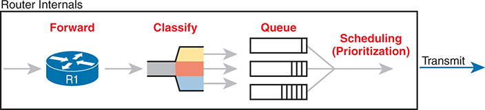


The process begins with the Forward step, where incoming data packets enter the router. An arrow indicates the flow of data from this initial stage to the next. In the Classify stage, packets are evaluated and categorized based on predefined criteria, which is visually represented by a funnel that separates the packets into different categories marked by color codes. This classification helps in identifying the priority level or type of each packet, facilitating the subsequent queuing process. Following classification, the packets enter the Queue stage, where they are placed into different queues according to their classification. The image shows multiple queues, visually represented as parallel vertical stacks, indicating separate paths for different categories of data packets. The final stage, Scheduling (Prioritization), involves determining the order in which the packets from various queues will be transmitted. This stage is crucial for ensuring that high-priority packets are sent first, optimizing the overall efficiency and performance of the network. The scheduled packets are then transmitted, indicated by the arrow pointing to the Transmit stage on the right.

**Figure 15-3** *Big Idea: Classification for Queuing in a Router*

The figure shows the internals of a router and what happens to the packet during part of that internal processing, moving left to right inside the router, as follows:

Step 1. The router makes a forwarding (routing) decision.

Step 2. The output queuing tool uses classification logic to determine which packets go into which output queue.

Step 3. The router holds the packets in the output queue waiting for the outgoing interface to be available to send the next message.

Step 4. The queuing tool's scheduling logic chooses the next packet, effectively prioritizing one packet over another.

While the example shows a queuing tool, note that the queuing tool requires the ability to classify messages by comparing the messages to the configuration, much like ACLs.

#### Matching (Classification) Basics

Now think about classification from an enterprise-wide perspective, which helps us appreciate the need for marking. Every QoS tool can examine various headers to make comparisons to classify packets. However, you might apply QoS tools on most every device in the network, sometimes at both ingress and egress on most of the interfaces. Using complex matching of many header fields in every device and on most interfaces requires lots of configuration. The work to match packets can even degrade device performance of some devices. So, while you could have every device use complex packet matching, doing so is a poor strategy.

A better strategy, one recommended both by Cisco and by RFCs, suggests doing complex matching early in the life of a packet and then marking the packet. [Marking](vol2_gloss.xhtml#gloss_204) means that the QoS tool changes one or more header fields, setting a value in the header. Several header fields have been designed for the purpose of marking the packets for QoS processing. Then, devices that process the packet later in its life can use much simpler classification logic.

[Figure 15-4](vol2_ch15.xhtml#ch15fig04) shows an example, with a PC on the left sending an IP packet to some host off the right side of the figure (not shown). Switch SW1, the first networking device to forward the packet, does some complex comparisons and marks the packet's [Differentiated Services Code Point (DSCP)](vol2_gloss.xhtml#gloss_114) field, a 6-bit field in the IP header meant for QoS marking. The next three devices that process this message—SW2, R1, and R2—then use simpler matching to classify the packet by comparing the packet's DSCP value, placing packets with one DSCP value in class 1, and packets with another DSCP value in class 2.

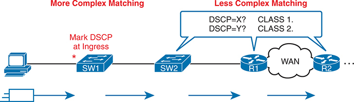


The network topology includes various devices and connections, and the processes are divided into two sections: More Complex Matching and Less Complex Matching. Starting from the left, a personal computer is connected to a switch labeled S W 1. The ingress point, where the D S C P values are marked, is indicated by a red star next to S W 1. This marking at ingress is part of the More Complex Matching process, which involves detailed inspection and classification of incoming traffic. The marked traffic then flows to another switch, labeled S W 2, which continues the forwarding process. The diagram transitions to the Less Complex Matching section, where traffic is routed through routers labeled R 1 and R 2, connected via a Wide Area Network (W A N). The routers use simpler matching rules to classify traffic based on D S C P values, as indicated by the speech bubbles with D S C P equals X? C L A S S 1 and D S C P equals Y? C L A S S 2. Directional arrows illustrate the flow of traffic from the personal computer through S W 1 and S W 2, and then through routers R 1 and R 2 across the W A N. The W A N cloud symbol signifies the wide area network connecting the routers.

**Figure 15-4** *Systematic Classification and Marking for the Enterprise*

#### Classification on Routers with ACLs and NBAR

Now that you know the basics of what classification and marking do together, this section takes the discussion a little deeper with a closer look at classification on routers, which is followed by a closer look at the marking function.

First, QoS classification sounds a lot like what ACLs do, and it should. In fact, many QoS tools support the ability to simply refer to an IP ACL, with this kind of logic:

For any packet matched by the ACL with a permit action, consider that packet a match for QoS, so do a particular QoS action.

As a reminder, [Figure 15-5](vol2_ch15.xhtml#ch15fig05) shows the IP and TCP header. All these fields are matchable for QoS classification.

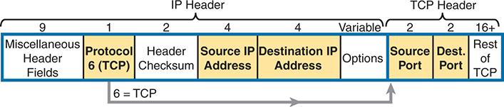


The diagram breaks down the structure of an I P packet and highlights the relevant fields used for extended A C L classification. The packet is divided into two main headers: the I P header and the T C P header. Starting from the left, the first segment within the I P header includes Miscellaneous Header Fields, which are 9 bytes long and contain various header information. The next field is labeled Protocol 6 (T C P) and is 1 byte long, indicating that the protocol used is T C P, with the number 6 representing T C P in the protocol field. Following this is the Header Checksum field, which is also 1 byte long and used for error-checking the header's integrity. Next, two crucial fields for extended A C L s are highlighted: the Source I P Address and the Destination I P Address, each 4 bytes long. These fields specify the I P addresses of the sender and receiver, respectively. A variable-length field labeled Options may follow within the I P header, which is used for additional options that may be present. Transitioning to the T C P header, the first two highlighted fields are the Source Port and the Destination Port, each 2 bytes long. These fields specify the port numbers used by the source and destination applications, respectively. The remaining part of the T C P header, labeled Rest of T C P, is at least 16 bytes long and contains other T C P-specific information such as sequence numbers, acknowledgment numbers, flags, window size, and more.

**Figure 15-5** *Classification with Five Fields Used by Extended ACLs*

Now think about the enterprise's QoS plan for a moment. That plan should list details such as which types of traffic should be classified as being in the same class for queuing purposes, for shaping, and for any other QoS tool. That plan should detail the fields in the header that can be matched. For instance, if all the IP phones sit in subnets within the range of addresses 10.3.0.0/16, then the QoS plan should state that. Then the network engineer could configure an extended ACL to match all packets to/from IP addresses inside 10.3.0.0/16 and apply appropriate QoS actions to that voice traffic.

However, not every classification can be easily made by matching with an ACL. In more challenging cases, Cisco Network Based Application Recognition (NBAR) can be used. NBAR is basically in its second major version, called NBAR2, or next-generation NBAR. In short, NBAR2 matches packets for classification in a large variety of ways that are very useful for QoS.

NBAR2 looks far beyond what an ACL can examine in a message. Many applications cannot be identified based on well-known port alone. NBAR solves those problems.

Cisco also organizes what NBAR can match in ways that make it easy to separate the traffic into different classes. For instance, the Cisco WebEx application provides audio and video conferencing on the web. In a QoS plan, you might want to classify WebEx differently than other video traffic and classify it differently than voice calls between IP phones. That is, you might classify WebEx traffic and give it a unique DSCP marking. NBAR provides easy built-in matching ability for WebEx, plus well over 1000 different subcategories of applications.

Just to drive the point home with NBAR, [Example 15-1](vol2_ch15.xhtml#exa15_1) lists several lines of help output for one of many NBAR configuration commands. I chose a variety of items that might be more memorable. With the use of the keywords in the help lines in the correct configuration command, you could match traffic related to various Amazon public cloud offerings. NBAR refers to this idea of defining the characteristics of different applications as *application signatures*.

**Example 15-1** *Example of the Many NBAR2 Matchable Applications*

[Click here to view code image](vol2_ch15_images.xhtml#f0332-01)

```
R1#(config)# class-map matchingexample
R1(config-cmap)# match protocol ?

! output heavily edited for length
  amazon-ec2                Secure and resizable compute capacity in the cloud.
  amazon-instant-video      VOD service by Amazon
  amazon-s3                 Amazon S3 (Simple Storage Service) is a cloud
                            computing web service.
  amazon-web-services       Amazon collection of remote computing services
! Output snipped.
```

#### Marking IP DSCP and Ethernet CoS

The QoS plan for an enterprise centers on creating classes of traffic that should receive certain types of QoS treatment. That plan would note how to classify packets into each classification and the values that should be marked on the packets, basically labeling each packet with a number to associate it with that class. For example, that plan might state the following:

* Classify all voice payload traffic that is used for business purposes as IP DSCP EF and CoS 5.
* Classify all video conferencing and other interactive video for business purposes as IP DSCP AF41 and CoS 4.
* Classify all business-critical data application traffic as IP DSCP AF21 and CoS 2.

This next topic takes a closer look at the specific fields that can be marked, defining the DSCP and CoS marking fields.

##### Marking the IP Header

Marking a QoS field in the IP header works well with QoS because the IP header exists for the entire trip from the source host to the destination host. When a host sends data, the host sends a data-link frame that encapsulates an IP packet. Each router that forwards the IP packet discards the old data-link header and adds a new header. Because IP routing retains the IP header, the marking in the IP header stays with the data from the first place at which the IP header is marked until it reaches the destination host.

IPv4 defines a type of service (ToS) byte in the IPv4 header, as shown in [Figure 15-6](vol2_ch15.xhtml#ch15fig06). The original RFC defined a 3-bit [IP Precedence (IPP)](vol2_gloss.xhtml#gloss_180) field for QoS marking. That field gave us eight separate values—binary 000, 001, 010, and so on, through 111—which when converted to decimal are decimals 0 through 7.

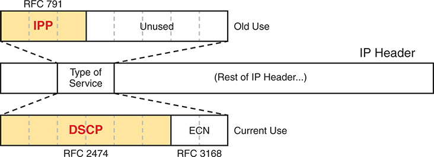


In the image, the I P header is shown with a focus on the Type of Service field. The old use of this field, defined by R F C 791, allocated the first three bits for I P Precedence (I P P), highlighted in yellow and labeled I P P, with the remaining bits unused. The current use, as defined by R F C 2474 and R F C 3168, repurposes this field. The first six bits are now used for D S C P, also highlighted in yellow and labeled D S C P, and the last two bits are used for Explicit Congestion Notification (E C N).

**Figure 15-6** *IP Precedence and Differentiated Services Code Point Fields*


Note

Those last 5 bits of the ToS byte per RFC 791 were mostly defined for some purpose but were not used in practice to any significant extent.

While a great idea, IPP gave us only eight different values to mark, so later RFCs redefined the ToS byte with the DSCP field. DSCP increased the number of marking bits to 6 bits, allowing for 64 unique values that can be marked. The [Differentiated Services (DiffServ)](vol2_gloss.xhtml#gloss_113) RFCs, which became RFCs back in the late 1990s, have become accepted as the most common method to use when doing QoS, and using the DSCP field for marking has become quite common.

IPv6 has a similar field to mark as well. The 6-bit field also goes by the name DSCP, with the byte in the IPv6 header being called the IPv6 *Traffic Class* byte. Otherwise, think of IPv4 and IPv6 being equivalent in terms of marking.

IPP and DSCP fields can be referenced by their decimal values as well as some convenient text names. The later section titled "[DiffServ Suggested Marking Values](vol2_ch15.xhtml#ch15lev2sec10)" details some of the names.

##### Marking the Ethernet 802.1Q Header

Another useful marking field exists in the 802.1Q header, in a field originally defined by the IEEE 802.1p standard. This field sits in the third byte of the 4-byte 802.1Q header, as a 3-bit field, supplying eight possible values to mark (see [Figure 15-7](vol2_ch15.xhtml#ch15fig07)). It goes by two different names: [class of service (CoS)](vol2_gloss.xhtml#gloss_074) and *priority code point (PCP)*.


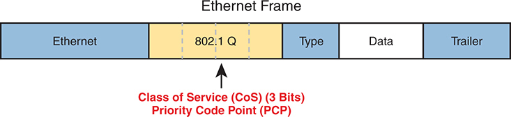


The image depicts an Ethernet frame, emphasizing the 802 dot 1 Q slash p header inserted between the Ethernet header and the frame's payload. The 802 dot 1 Q slash p header includes a field labeled Priority Code Point (P C P), highlighted in yellow, which is three bits long and used for Class of Service (Co S) settings. This field allows for different levels of priority to be assigned to network traffic, facilitating Quality of Service (Q o S) management.

**Figure 15-7** *Class of Service Field in 802.1Q/p Header*


The figure uses two slightly different shades of gray (in print) for the Ethernet header and trailer fields versus the 802.1Q header, as a reminder: the 802.1Q header is not included in all Ethernet frames. The 802.1Q header exists only when 802.1Q trunking is used on a link. As a result, QoS tools can make use of the CoS field only for QoS features enabled on interfaces that use trunking, as shown in [Figure 15-8](vol2_ch15.xhtml#ch15fig08).

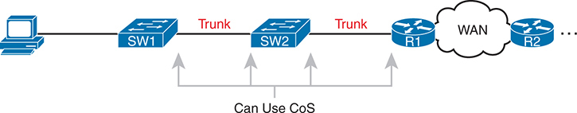


Starting from the left, a computer is connected to a switch labeled S W 1. This switch is connected via a trunk link to a second switch, S W 2, which is also connected via a trunk link to a router labeled R 1. R 1 is then connected to a Wide Area Network (W A N), which connects to another router labeled R 2 on the far right. The diagram indicates that Co S can be used on the trunk links between S W 1 and S W 2 and between S W 2 and R 1.

**Figure 15-8** *Useful Life of CoS Marking*

For instance, if the PC on the left were to send data to a server somewhere off the figure to the right, the DSCP field would exist for that entire trip. However, the CoS field would exist over the two trunks only and would be useful mainly on the four interfaces noted with the arrow lines.

##### Other Marking Fields

Other marking fields also exist in other headers. [Table 15-2](vol2_ch15.xhtml#ch15tab02) lists those fields for reference.

**Table 15-2** Marking Fields

| Field Name | Header(s) | Length (bits) | Where Used |
| --- | --- | --- | --- |
| DSCP | IPv4, IPv6 | 6 | End-to-end packet |
| IPP | IPv4, IPv6 | 3 | End-to-end packet |
| CoS | 802.1Q | 3 | Over VLAN trunk |
| TID | 802.11 | 3 | Over Wi-Fi |
| EXP | MPLS Label | 3 | Over MPLS WAN |

#### Defining Trust Boundaries

The end-user device can mark the DSCP field—and even the CoS field if trunking is used on the link. Would you, as the network engineer, trust those settings and let your networking devices trust and react to those markings for their various QoS actions?

Most of us would not, because anything the end user controls might be used inappropriately at times. For instance, a PC user could know enough about DiffServ and DSCPs to know that most voice traffic is marked with a DSCP called Expedited Forwarding (EF), which has a decimal value of 46. Voice traffic gets great QoS treatment, so PC users could mark all their traffic as DSCP 46, hoping to get great QoS treatment.

The people creating a QoS plan for an enterprise have to choose where to place the trust boundary for the network. The *trust boundary* refers to the point in the path of a packet flowing through the network at which the networking devices can trust the current QoS markings. That boundary typically sits in a device under the control of the IT staff.

For instance, a typical trust boundary could be set in the middle of the first ingress switch in the network, as shown in [Figure 15-9](vol2_ch15.xhtml#ch15fig09). The markings on the message as sent by the PC cannot be trusted. However, because SW1 performed classification and marking as the packets entered the switch, the markings can be trusted at that point.

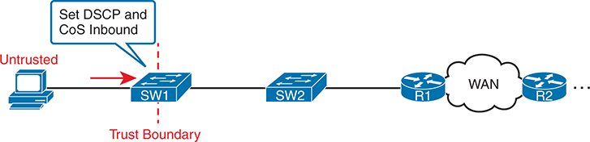


On the left, a computer labeled as Untrusted is connected to a switch labeled S W 1. The connection between the computer and S W 1 is marked with a red dashed line labeled Trust Boundary. The diagram indicates that D S C P and Co S values are set inbound on S W 1 for traffic coming from the untrusted computer. The network continues from S W 1 to another switch, S W 2, which then connects to a router labeled R 1. R 1 is connected to a Wide Area Network (W A N) leading to another router labeled R 2 on the far right.

**Figure 15-9** *Trusting Devices—PC*

Interestingly, when the access layer includes an IP Phone, the phone is typically the trust boundary, instead of the access layer switch. IP Phones can set the CoS and DSCP fields of the messages created by the phone, as well as those forwarded from the PC through the phone. [Figure 15-10](vol2_ch15.xhtml#ch15fig10) shows the typical trust boundary in this case, with notation of what the phone's marking logic usually is: mark all of the PC's traffic with a particular DSCP and/or CoS, and the phone's traffic with different values.

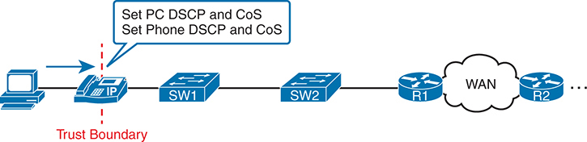


On the left, a P C is connected to an I P phone, which is then connected to a switch labeled S W 1. This switch is connected to another switch, S W 2, which is linked to a Wide Area Network (W A N) via routers R 1 and R 2. A red dashed line labeled Trust Boundary is drawn between the P C and the I P phone, indicating where the trust boundary is set. The I P phone is configured to set the Differentiated Services Code Point (D S C P) and Class of Service (Co S) values for both the P C and the phone itself. A speech bubble above the I P phone contains the text: Set P C D S C P and Co S, Set Phone D S C P and Co S, illustrating that the I P phone is responsible for assigning these Q o S values before the traffic reaches the switches and subsequently the W A N.

**Figure 15-10** *Trusting Devices—IP Phone*


#### DiffServ Suggested Marking Values

Everything in this chapter follows the DiffServ architecture as defined originally by RFC 2475, plus many other DiffServ RFCs. In particular, DiffServ goes beyond theory in several areas, including making suggestions about the specific DSCP values to use when marking IP packets. By suggesting specific markings for specific types of traffic, DiffServ hoped to create a consistent use of DSCP values in all networks. By doing so, product vendors could provide good default settings for their QoS features, QoS could work better between an enterprise and service provider, and many other benefits could be realized.

The next two topics outline three sets of DSCP values as used in DiffServ.

##### Expedited Forwarding (EF)

DiffServ defines the *Expedited Forwarding (EF)* DSCP value—a single value—as suggested for use for packets that need low latency (delay), low jitter, and low loss. The Expedited Forwarding RFC (RFC 3246) defines the specific DSCP value (decimal 46) and an equivalent text name (Expedited Forwarding). QoS configuration commands allow the use of the decimal value or text name, but one purpose of having a text acronym to use is to make the value more memorable, so many QoS configurations refer to the text names.

Most often QoS plans use EF to mark voice payload packets. With voice calls, some packets carry voice payload, and other packets carry call signaling messages. Call signaling messages set up (create) the voice call between two devices, and they do not require low delay, jitter, and loss. Voice payload packets carry the digitized voice, as shown back in [Figure 15-2](vol2_ch15.xhtml#ch15fig02), and these packets do need better QoS. By default, Cisco IP Phones mark voice payload with EF, and mark voice signaling packets sent by the phone with another value called CS3.

##### Assured Forwarding (AF)

The *Assured Forwarding (AF)* DiffServ RFC (2597) defines a set of 12 DSCP values meant to be used in concert with each other. First, it defines the concept of four separate queues in a queuing system. Additionally, it defines three levels of drop priority within each queue for use with congestion avoidance tools. With four queues, and three drop priority classes per queue, you need 12 different DSCP markings, one for each combination of queue and drop priority. (Queuing and congestion avoidance mechanisms are discussed later in this chapter.)

Assured Forwarding defines the specific AF DSCP text names and equivalent decimal values as listed in [Figure 15-11](vol2_ch15.xhtml#ch15fig11). The text names follow a format of AFXY, with X referring to the queue (1 through 4) and Y referring to the drop priority (1 through 3).

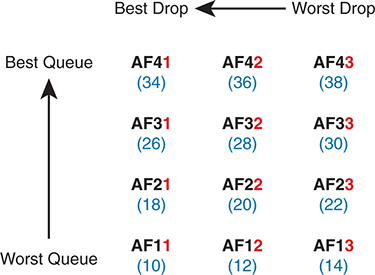


The matrix consists of nine A F classes, arranged in a 3 by 3 grid. The vertical axis represents queue preference, with Best Queue at the top and Worst Queue at the bottom. The horizontal axis represents drop precedence, with Best Drop on the left and Worst Drop on the right. Each cell in the grid contains an A F value and its corresponding D S C P value in parentheses. The first row (Best Queue) contains: A F 41 (34), A F 42 (36), A F 43 (38). The second row contains: A F 31 (26), A F 32 (28), A F 33 (30). The third row (Worst Queue) contains: A F 21 (18), A F 22 (20), A F 23 (22). The fourth row (Worst Queue) contains: A F 11 (10), A F 12 (12), A F 13 (14). The diagram illustrates that A F values with lower drop precedence (e dot g dot, A F 41) have higher priority and are less likely to be dropped, while those with higher drop precedence (e dot g dot, A F 13) have lower priority and are more likely to be dropped.

**Figure 15-11** *Differentiated Services Assured Forwarding Values and Meaning*

For example, if you marked packets with all 12 values, those with AF11, AF12, and AF13 would all go into one queue; those with AF21, AF22, and AF23 would go into another queue; and so on. Inside the queue with all the AF2Y traffic, you would treat the AF21, AF22, and AF23 each differently in regard to drop actions (congestion avoidance), with AF21 getting the preferred treatment and AF23 the worst treatment.

##### Class Selector (CS)

Originally, the ToS byte was defined with a 3-bit IP Precedence (IPP) field. When DiffServ redefined the ToS byte, it made sense to create eight DSCP values for backward compatibility with IPP values. The *Class Selector (CS)* DSCP values are those settings.

[Figure 15-12](vol2_ch15.xhtml#ch15fig12) shows the main idea along with the eight CS values, both in name and in decimal value. Basically, the DSCP values have the same first 3 bits as the IPP field, and with binary 0s for the last 3 bits, as shown on the left side of the figure. CSx represents the text names, where x is the matching IPP value (0 through 7).

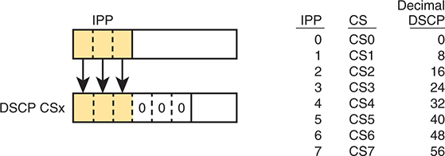


The left section shows I P P values are mapped into D S C P values. I P P values, which are three bits long, are shown being directly copied into the first three bits of the D S C P field. The remaining three bits of the D S C P field are set to zero, forming a six-bit D S C P value. This transformation process is highlighted by arrows indicating the mapping of I P P values into D S C P. On the right side of the image, a table presents the correspondence between I P P values, Class Selector (C S) names, and their decimal D S C P equivalents. The table entries are as follows: I P P 0 maps to C S 0 with a D S C P value of 0. I P P 1 maps to C S 1 with a D S C P value of 8. I P P 2 maps to C S 2 with a D S C P value of 16. I P P 3 maps to C S 3 with a D S C P value of 24. I P P 4 maps to C S 4 with a D S C P value of 32. I P P 5 maps to C S 5 with a D S C P value of 40. I P P 6 maps to C S 6 with a D S C P value of 48. I P P 7 maps to C S 7 with a D S C P value of 56. This mapping is crucial for implementing Q o S policies in network traffic management.

**Figure 15-12** *Class Selector*

This section on classification and marking has provided a solid foundation for understanding the tools explored in the next three major sections of this chapter: queuing, shaping and policing, and congestion avoidance.

##### Guidelines for DSCP Marking Values

Even with this introduction to the various DSCP marking values, you could imagine that an enterprise needs to follow a convention for how to use the markings. With so many different values, having different uses of different DSCP values by different devices in the same enterprise would make deploying QoS quite difficult at best.

Among its many efforts to standardize QoS, Cisco helped to develop RFC 4954, an RFC that defines several conventions for how to use the DSCP field. The RFC provides alternative plans with different levels of detail. Each plan defines a type of traffic and the DSCP value to use when marking data. Without getting into the depth of any one plan, the plans all specify some variation for how all devices should mark data as follows:

* DSCP EF: Voice payload
* AF4x: Interactive video (for example, videoconferencing)
* AF3x: Streaming video
* AF2x: High priority (low latency) data
* CS0: Standard data

Cisco not only worked to develop the RFC standards but also uses those standards. Cisco uses default marking conventions based on the marking data in RFC 4594, with some small exceptions. If you want to read more about these QoS marking plans, refer to a couple of sources. First, look for the Cisco QoS Design Guides at [Cisco.com](http://Cisco.com). Also refer to RFC 4594.

### Queuing

All networking devices use queues. Network devices receive messages, make a forwarding decision, and then send the message…but sometimes the outgoing interface is busy. So, the device keeps the outgoing message in a queue, waiting for the outgoing interface to be available—simple enough.

The term [queuing](vol2_gloss.xhtml#gloss_276) refers to the QoS toolset for managing the queues that hold packets while they wait their turn to exit an interface (and in other cases in which a router holds packets waiting for some resource). But queuing refers to more than one idea, so you have to look inside devices to think about how they work. For instance, consider [Figure 15-13](vol2_ch15.xhtml#ch15fig13), which shows the internals of a router. The router, of course, makes a forwarding decision, and it needs to be ready to queue packets for transmission once the outgoing interface is available. At the same time, the router may take a variety of other actions as well—ingress ACL, ingress NAT (on the inside interface), egress ACLs after the forwarding decision is made, and so on.

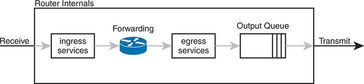


The diagram starts on the left with an arrow labeled Receive, indicating incoming data packets entering the router. The first stage is labeled ingress services, representing the initial processing of incoming packets. Following this, the packets proceed to the Forwarding stage, where the router determines the appropriate egress path for each packet. Next, the packets enter the egress services stage, where additional processing is applied before they are placed in the Output Queue. The output queue is depicted as a series of stacked rectangles, indicating that packets are organized and prioritized based on predefined criteria. The diagram shows an arrow labeled Transmit on the right, indicating the packets are sent out of the router after being queued. This process ensures that packets are transmitted in an orderly manner, adhering to the routing policies and Q o S settings configured on the router.

**Figure 15-13** *Output Queuing in a Router: Last Output Action Before Transmission*

The figure shows *output queuing* in which the device holds messages until the output interface is available. The queuing system may use a single output queue, with a first-in, first-out (FIFO) scheduler. (In other words, it's like ordering lunch at the sandwich shop that has a single ordering line.)

Next, think a little more deeply about the queuing system. Most networking devices can have a queuing system with multiple queues. To use multiple queues, the queuing system needs a classifier function to choose which packets are placed into which queue. (The classifier can react to previously marked values or do a more extensive match.) The queuing system needs a scheduler as well, to decide which message to take next when the interface becomes available, as shown in [Figure 15-14](vol2_ch15.xhtml#ch15fig14).

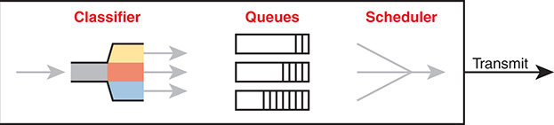


Incoming traffic flows into the classifier, where it is categorized into different classes based on predetermined criteria. The classified traffic is then directed into separate Queues, which are shown as three vertical rectangles representing the different queues for handling traffic. Each queue stores packets until they are ready to be transmitted. The final component is the Scheduler, which manages the order and timing of packet transmission from the queues. The scheduler ensures that packets are sent out based on the defined scheduling policy, and the final step is the Transmit stage, where the traffic is sent out of the system. This image provides a detailed view of Class-Based Weighted Fair Queuing (C B W F Q) with Round-Robin scheduling. Similar to the first image, the process starts with a Classifier, represented by a funnel with color-coded sections, which sorts incoming traffic into different classes. The classified traffic is directed into three specific Queues labeled Q 1, Q 2, and Q 3, shown as vertical rectangles. Each queue is assigned a different percentage of bandwidth, indicated by the labels: Q 1 with 20 percent, Q 2 with 30 percent, and Q 3 with 50 percent. The Scheduler uses a Round-Robin mechanism, depicted as a circular arrow, to allocate bandwidth and manage packet transmission from the queues based on their assigned weights. The final step is the Transmit stage, where the scheduled traffic is sent out of the system.

**Figure 15-14** *Queuing Components*


Of all these components of the queuing system, the scheduler can be the most interesting part because it can perform prioritization. *Prioritization* refers to the concept of giving priority to one queue over another in some way.

#### Round-Robin Scheduling (Prioritization)

One scheduling algorithm used by Cisco routers and switches uses round-robin logic. In its most basic form, [round robin](vol2_gloss.xhtml#gloss_294) cycles through the queues in order, taking turns with each queue. In each cycle, the scheduler either takes one message or takes a number of bytes from each queue by taking enough messages to total that number of bytes. Take some messages from queue 1, move on and take some from queue 2, then take some from queue 3, and so on, starting back at queue 1 after finishing a complete pass through the queues.

Round-robin scheduling also includes the concept of *weighting* (generally called *weighted round robin*). Basically, the scheduler takes a different number of packets (or bytes) from each queue, giving more preference to one queue over another.

For example, routers use a popular tool called *Class-Based Weighted Fair Queuing (CBWFQ)* to guarantee a minimum amount of bandwidth to each class. That is, each class receives at least the amount of bandwidth configured during times of congestion, but maybe more. Internally, CBWFQ uses a weighted round-robin scheduling algorithm, while letting the network engineer define the weightings as a percentage of link bandwidth. [Figure 15-15](vol2_ch15.xhtml#ch15fig15) shows an example in which the three queues in the system have been given 20, 30, and 50 percent of the bandwidth each, respectively.

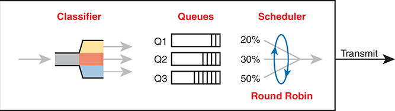


On the left side, the Classifier section shows an incoming stream of data being categorized into different types of traffic. The classifier divides the data into four queues labeled voice, data 1, data 2, and default, each representing different types of network traffic. In the center, the Queues section lists these four queues, indicating that data is organized based on its type. The Scheduler section on the right employs a round-robin algorithm to allocate transmission bandwidth. The round-robin scheduler is depicted as a circle with arrows and percentage allocations: 50 percent for voice, 10 percent for data 1, 15 percent for data 2, and 25 percent for default traffic. This means the scheduler allocates transmission opportunities to each queue proportionally based on these percentages.

**Figure 15-15** *CBWFQ Round-Robin Scheduling*

With the queuing system shown in the figure, if the outgoing link is congested, the scheduler guarantees the percentage bandwidth shown in the figure to each queue. That is, queue 1 gets 20 percent of the link even during busy times.

#### Low Latency Queuing

Earlier in the chapter, the section titled "[Voice and Video Applications](vol2_ch15.xhtml#ch15lev3sec2)" discussed the reasons why voice and video, particularly interactive voice and video like phone calls and videoconferencing, need low latency (low delay), low jitter, and low loss. Unfortunately, a round-robin scheduler does not provide low enough delay, jitter, or loss. The solution: add Low Latency Queuing (LLQ) to the scheduler.

First, for a quick review, [Table 15-3](vol2_ch15.xhtml#ch15tab03) lists the QoS requirements for a voice call. The numbers come from the *Enterprise QoS Solution Reference Network Design Guide*, referenced earlier in the chapter. The amount of bandwidth required per call varies based on the codec used by the call. However, the delay, jitter, and loss requirements remain the same for all voice calls. (Interactive video has similar requirements for delay, jitter, and loss.)

**Table 15-3** QoS Requirements for a VoIP Call per Cisco Voice Design Guide

| Bandwidth/call | One-way Delay (max) | Jitter (max) | Loss (max) |
| --- | --- | --- | --- |
| 30–320 Kbps | 150 ms | 30 ms | <1% |

A round-robin queuing system adds too much delay for these voice and video packets. To see why, imagine a voice packet arrives and is routed to be sent out some interface with the queuing system shown in [Figure 15-16](vol2_ch15.xhtml#ch15fig16). However, that next voice packet arrives just as the round-robin scheduler moves on to service the queue labeled "data 1." Even though the voice queue has been given 50 percent of the link bandwidth, the scheduler does not send that voice message until it sends some messages from the other three queues—adding delay and jitter.

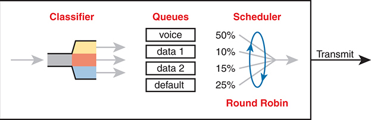


On the left side, the Classifier section shows an incoming stream of data being categorized into different types of traffic. The classifier divides the data into four queues labeled voice, data 1, data 2, and default, each representing different types of network traffic. In the center, the Queues section lists these four queues, indicating that data is organized based on its type. The Scheduler section on the right employs a round-robin algorithm but with a special priority for voice traffic. The L L Q mechanism is indicated with a label L L Q-Always Next and an arrow pointing from the voice queue directly to the transmission path, bypassing the round-robin cycle.

**Figure 15-16** *Round Robin Not Good for Voice Delay (Latency) and Jitter*

The solution, LLQ, tells the scheduler to treat one or more queues as special [priority queues](vol2_gloss.xhtml#gloss_266). The LLQ scheduler always takes the next message from one of these special priority queues. Problem solved: very little delay for packets in that queue, resulting in very little jitter as well. Plus, the queue never has time to fill up, so there are no drops due to the queue filling up. [Figure 15-17](vol2_ch15.xhtml#ch15fig17) shows the addition of the LLQ logic for the voice queue.

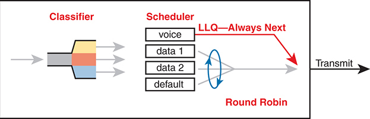


On the left side, a graph labeled Incoming Measured Traffic Rate shows fluctuating traffic over time, marked as T equals 0 to T equals 1, with the blue dashed line representing the policing rate. The traffic peaks and valleys illustrate the natural variability in the incoming traffic rate. An arrow labeled Policing Rate points to the right, leading to another graph labeled Outgoing Measured Traffic Rate. This graph also shows fluctuating traffic over time from T equals 0 to T equals 1, but with reduced peaks and smoothed valleys, indicating the effect of traffic shaping. A note labeled Burst on the right side of the outgoing traffic graph highlights occasional traffic bursts that exceed the policing rate.

**Figure 15-17** *LLQ Always Schedules Voice Packet Next*


Using LLQ, or a priority queue, provides the needed low delay, jitter, and loss for the traffic in that queue. However, think about those other queues. Do you see the problem? What happens if the speed of the interface is X bits per second, but more than X bits per second come into the voice queue? The scheduler never services the other queues (called *queue starvation*).

As you might guess, there is a solution: limit the amount of traffic placed into the priority queue, using a feature called *policing*. The next section talks about policers in more detail, but for now, think of it as a cap on the bandwidth used by the priority queue. For instance, you could reserve 20 percent of the link's bandwidth for the voice queue and make it a priority queue. However, in this case, instead of 20 percent being the minimum bandwidth, it is the maximum for that queue. If more than 20 percent of the link's worth of bits shows up in that queue, the router will discard the excess.

Limiting the amount of bandwidth in the priority queue protects the other queues, but it causes yet another problem. Voice and video need low loss, and with LLQ, we put the voice and video into a priority queue that will discard the excess messages beyond the bandwidth limit. The solution? Find a way to limit the amount of voice and video that the network routes out this link, so that the policer never discards any of the traffic. There are QoS tools to help you do just that, called call admission control (CAC) tools. However, CAC tools did not get a mention in the exam topics, so this chapter leaves those tools at a brief mention.

#### A Prioritization Strategy for Data, Voice, and Video

This section about queuing introduces several connected ideas, so before leaving the discussion of queuing, think about this strategy for how most enterprises approach queuing in their QoS plans:


1. Use a round-robin queuing method like CBWFQ for data classes and for noninteractive voice and video.
2. If faced with too little bandwidth compared to the typical amount of traffic, give data classes that support business-critical applications much more guaranteed bandwidth than is given to less important data classes.
3. Use a priority queue with LLQ scheduling for interactive voice and video, to achieve low delay, jitter, and loss.
4. Put voice in a separate queue from video so that the policing function applies separately to each.
5. Define enough bandwidth for each priority queue so that the built-in policer should not discard any messages from the priority queues.
6. Use call admission control (CAC) tools to avoid adding too much voice or video to the network, which would trigger the policer function.

### Shaping and Policing

This section introduces two related QoS tools—[shaping](vol2_gloss.xhtml#gloss_304) and [policing](vol2_gloss.xhtml#gloss_254). These tools have a more specialized use and are not found in as many locations in a typical enterprise. These tools are most often used at the WAN edge in an enterprise network design.

Both policing and shaping monitor the bit rate of the combined messages that flow through a device. Once enabled, the policer or shaper notes each packet that passes and measures the number of bits per second over time. Both attempt to keep the bit rate at or below the configured speed, but by using two different actions: policers discard packets, and shapers hold packets in queues to delay the packets.

Shapers and policers monitor the traffic rate (the bits per second that move through the shaper or policer) versus a configured [shaping rate](vol2_gloss.xhtml#gloss_305) or [policing rate](vol2_gloss.xhtml#gloss_255), respectively. The basic question that both ask is listed below, with the actions based on the answers:


1. Does this next packet push the measured rate past the configured shaping rate or policing rate?
2. If no:

   1. Let the packet keep moving through the normal path and do nothing extra to the packet.
3. If yes:

   1. If shaping, delay the message by queuing it.
   2. If policing, either discard the message or mark it differently.

This section first explains policing, which discards or re-marks messages that exceed the policing rate, followed by shaping, which slows down messages that exceed the shaping rate.

#### Policing

Focus on the traffic rate versus the configured policing rate for a moment, and the policing action of discarding messages. Those concepts sit at the core of what the policing function does.

Traffic arrives at networking devices at a varying rate, with valleys and spikes. That is, if you graph the bit rate of the collective bits that enter or exit any interface, the graph would look something like the one on the left side of [Figure 15-18](vol2_ch15.xhtml#ch15fig18). The policer would measure that rate and make a similar measurement. Still on the left side of the figure, the horizontal dashed line represents the policing rate, which is the rate configured for the policer. So, the policer has some awareness of the measured bit rate over time, which can be compared to the configured rate.

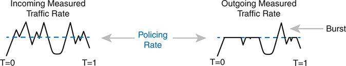


The top part of the image shows a simple network with two routers, R 1 and R 2, connected via an unspecified W A N, each router labeled with interface G 0 slash 1 and G 0 slash 2 respectively. The bottom part illustrates a more detailed setup where the routers R 1 and R 2 are connected through a pair of switches. The connection between the switches represents the W A N link, labeled 200 Megabits per second C I R. The diagram also includes red labels near the switches indicating Police to 200 Megabits per second, signifying that the traffic is policed to ensure it does not exceed the C I R of 200 Megabits per second.

**Figure 15-18** *Effect of a Policer and Shaper on an Offered Traffic Load*

The right side of the figure shows a graph of what happens to the traffic when a policer discards any messages that would have otherwise pushed the rate over the configured policing rate. In effect, the policer chops off the top of the graph at the policing rate.

The graph on the right also shows one example of a policer allowing a burst of traffic. Policers allow for a burst beyond the policing rate for a short time, after a period of low activity. So, that one peak that exceeds the policing rate on the graph on the right side allows for the nature of bursty data applications.

##### Where to Use Policing

Now that you understand the basics of policing, take a moment to ponder. Policers monitor messages, measure a rate, and discard some messages. How does that help a network in regard to QoS? At first glance, it seems to hurt the network, discarding messages, many of which the transport or application layer will have to resend. How does that improve bandwidth, delay, jitter, or loss?

Policing makes sense only in certain cases, and as a general tool, it can be best used at the edge between two networks. For instance, consider a typical point-to-point metro Ethernet WAN connection between two enterprise routers, R1 and R2. Usually, the enterprise network engineers just view the WAN as a cloud, with Ethernet interfaces on the routers, as shown at the top of [Figure 15-19](vol2_ch15.xhtml#ch15fig19).


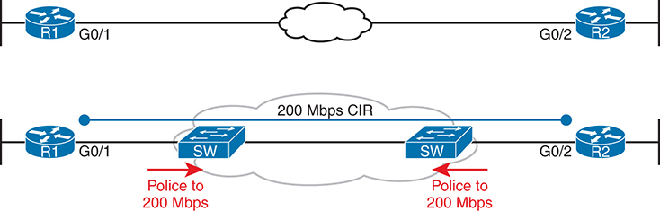


The diagram is divided into three main sections: forwarding, shaper, and output queuing. On the left, the Forwarding section shows traffic entering the router from R 1. The traffic then moves to the Shaper section, which contains multiple queues. The top queue is labeled L L Q (Low Latency Queuing), designed for priority traffic, while the other queues are labeled C B W F Q (Class-Based Weighted Fair Queuing) for different classes of traffic. The traffic is processed at the shape rate, as indicated by the arrow pointing to the right, showing how packets are managed to conform to the configured traffic shaping policy. The shaped traffic then moves to the Output Queuing section, where it is queued before being transmitted out of the router. This diagram highlights the use of L L Q for prioritizing critical traffic and C B W F Q for fair distribution of remaining bandwidth among different traffic classes, ensuring efficient and orderly transmission of packets.

**Figure 15-19** *Ethernet WAN: Link Speed Versus CIR*

Now think about the contract for this MetroE connection, as shown at the bottom of [Figure 15-19](vol2_ch15.xhtml#ch15fig19). In this case, this connection uses Gigabit Ethernet for the access links, and a 200-Mbps *committed information rate (CIR)*. That is, the SP providing the WAN service agrees to allow the enterprise to send 200 Mbps of traffic in each direction. However, remember that the enterprise routers transmit the data at the speed of the access link, or 1 Gbps in this case.

Think like the SP for a moment, and think about supporting tens of thousands of Gigabit Ethernet links into your WAN service, all with 200-Mbps CIRs. What would happen if you just let all those customers send data that, over time, averaged close to 1000 Mbps (1 Gbps)? That is, if all customers kept sending data far beyond their contracted CIR, that much traffic could cause congestion in the WAN service. Also, those customers might choose to pay for a lower CIR, knowing that the SP would send the data anyway. And customers who were well behaved and did not send more data than their CIR might suffer from the congestion just as much as the customers who send far too much data.

[Figure 15-19](vol2_ch15.xhtml#ch15fig19) also notes the solution to the problem: The SP can police incoming packets, setting the policing rate to match the CIR that the customer chooses for that link. By doing so, the SP protects all customers from the negative effects of the customers who send too much traffic. Customers receive what they paid for. And the SP can provide reports of actual traffic rates, so the enterprise knows when to buy a faster CIR for each link.

Policers can discard excess traffic, but they can also re-mark packets. Think again about what an SP does with an ingress policer, as shown in [Figure 15-19](vol2_ch15.xhtml#ch15fig19): they are discarding their customers' messages. So, the SP might want to make a compromise that works better for its customers, while still protecting the SP's network. The SP could mark the messages with a new marking value, with this strategy:

1. Re-mark packets that exceed the policing rate, but let them into the SP's network.
2. If other SP network devices are experiencing congestion when they process the packet, the different marking means that device can discard the packet. However…
3. …if no other SP network devices are experiencing congestion when forwarding that re-marked packet, it gets through the SP network anyway.

With this strategy, the SP can treat their customers a little better by discarding less traffic, while still protecting the SP's network during times of stress.

Summarizing the key features of policing:


* Policing measures the traffic rate over time for comparison to the configured policing rate.
* Policing allows for a burst of data after a period of inactivity.
* Policing is enabled on an interface, in either direction, but typically at ingress.
* Policing can discard excess messages but can also re-mark the message so that it is a candidate for more aggressive discard later in its journey.

#### Shaping

You have a 1-Gbps link from a router into a SP, but a 200-Mbps CIR for traffic to another site, as seen in [Figure 15-19](vol2_ch15.xhtml#ch15fig19). The SP has told you that it always discards incoming traffic that exceeds the CIR. The solution? Use a shaper to slow down the traffic—in this case to a 200-Mbps shaping rate.

That scenario—shaping before sending data to an SP that is policing—is one of the typical uses of a shaper. Shapers can be useful in other cases as well, but generally speaking, shapers make sense when a device can send at a certain speed, but there is a benefit to slowing down the rate.

The shaper slows down messages by queuing the messages. The shaper then services the shaping queues, but not based on when the physical interface is available. Instead, the shaper schedules messages from the shaping queues based on the shaping rate, as shown in [Figure 15-20](vol2_ch15.xhtml#ch15fig20). Following the left-to-right flow in the figure, for a router, the packet is routed out an interface; the shaper queues packets so that the sending rate through the shaper does not exceed the shaping rate; and then output queuing works as normal, if needed.

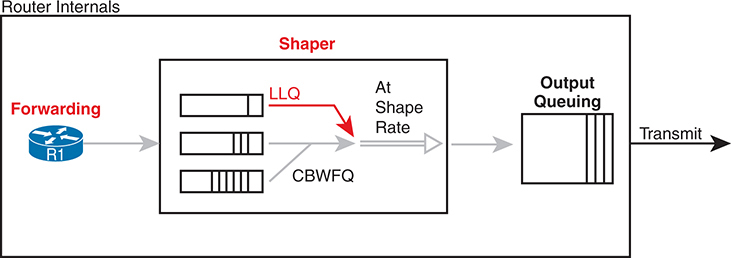


The timeline is divided into two segments, each representing a one-second interval. At T equals 0, the diagram shows that 200 million bits are sent over a duration of 200 milliseconds (m s), with the line rate at 1 Gigabit per second. This is followed by a waiting period of 800 milliseconds, where no data is sent. At T equals 1 second, the cycle repeats, with another 200 million bits sent over 200 milliseconds, followed by an 800 milliseconds waiting period.

**Figure 15-20** *Shaping Queues: Scheduling with LLQ and CBWFQ*

Note that in some cases, the output queuing function has little to do. For instance, in the earlier example shown in [Figure 15-19](vol2_ch15.xhtml#ch15fig19), the SP is policing incoming messages at 200 Mbps. If the router (R1, for instance) were to shape all traffic exiting toward the SP to 200 Mbps as well, with that 1-Gbps interface, the output queue would seldom if ever be congested.

Because shapers create queues where messages wait, you should apply a queuing tool to those queues. It is perfectly normal to apply the round-robin and priority queuing features of CBWFQ and LLQ, respectively, to the shaping queues, as noted in the figure.

##### Setting a Good Shaping Time Interval for Voice and Video

Once again, a QoS tool has attempted to solve one QoS problem but introduces another. The unfortunate side effect of a shaper is that it slows down packets, which then creates more delay and probably more jitter. The delay occurs in part because of the message simply waiting in a queue, but partly because of the mechanisms used by a shaper. Thankfully, you can (and should) configure a shaper's setting that changes the internal operation of the shaper, which then reduces the delay and jitter caused to voice and video traffic.

A shaper's *time interval* refers to its internal logic and how a shaper averages, over time, sending at a particular rate. A shaper basically sends as fast as it can and then waits; sends and waits; sends and waits. For instance, the policing and shaping example in this section suggests shaping at 200 Mbps on a router that has a 1000-Mbps (1-Gbps) outgoing interface. In that case, the shaper would result in the interface sending data 20 percent of the time and being silent 80 percent of the time.

[Figure 15-21](vol2_ch15.xhtml#ch15fig21) shows a graph of the shaping time interval concept, assuming a time interval of 1 second. To average 200 million bits per second, the shaper would allow 200 million bits to exit its shaping queues and exit the interface each second. Because the interface transmits bits at 1 Gbps, it takes just .2 seconds, or 200 ms, to send all 200 million bits. Then the shaper must wait for the rest of the time interval, another 800 ms, before beginning the next time interval.

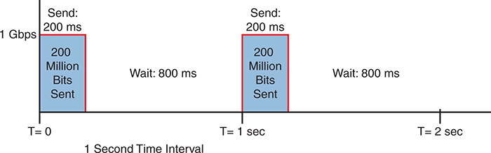


The diagram is divided into three sections, each representing a different level of congestion. Little Congestion: The leftmost section shows three queues with minimal packet buildup, indicating low network traffic. No packets are dropped, and the network is operating efficiently. Medium Congestion: The middle section shows the queues with a higher number of packets, signifying moderate network congestion. Some packets start to overflow and are dropped, represented by red dashed arrows leading to a bucket labeled Tail Drop. This indicates that packets arriving at the tail of the queue are dropped first. Much Congestion: The rightmost section depicts heavily congested queues with packets overflowing significantly. More packets are dropped as indicated by multiple red dashed arrows leading to the Tail Drop bucket. This shows that severe congestion leads to increased packet loss.

**Figure 15-21** *One Second (1000 ms) Shaping Time Interval, Shaping at 20% of Line Rate*

Now think about a voice or video packet that needs very low delay and jitter—and unfortunately, it arrives just as the shaper finishes sending data for a time interval. Even if that voice or video packet is in a priority shaping queue, the packet will wait 800 ms before the shaper schedules the next packet—far too long compared to the 150-ms one-way delay goal for voice.

The solution to this problem: configure a short time interval. For example, consider the following time intervals (abbreviated Tc), and their effects, for this same example (1-Gbps link, shaping to 200 Mbps), but with shorter and shorter time intervals:

**Tc = 1 second (1000 ms):** Send at 1 Gbps for 200 ms, rest for 800 ms

**Tc = .1 second (100 ms):** Send at 1 Gbps for 20 ms, rest for 80 ms

**Tc = .01 second (10 ms):** Send at 1 Gbps for 2 ms, rest for 8 ms

When shaping, use a short time interval. By recommendation, use a 10-ms time interval to support voice and video. With that setting, a voice or video packet should wait no more than 10 ms while waiting for the next shaping time interval, at which point the priority queue scheduling should take all the voice and video messages next.

Summarizing the key features of shapers:


* Shapers measure the traffic rate over time for comparison to the configured shaping rate.
* Shapers allow for bursting after a period of inactivity.
* Shapers are enabled on an interface for egress (outgoing packets).
* Shapers slow down packets by queuing them and over time releasing them from the queue at the shaping rate.
* Shapers use queuing tools to create and schedule the shaping queues, which is very important for the same reasons discussed for output queuing.

### Congestion Avoidance

The QoS feature called *congestion avoidance* attempts to reduce overall packet loss by preemptively discarding some packets used in TCP connections. To see how it works, you first need to look at how TCP works in regard to windowing and then look at how congestion avoidance features work.

#### TCP Windowing Basics

TCP uses a flow control mechanism called *windowing*. Each TCP receiver grants a window to the sender. The window, which is a number, defines the number of bytes the sender can send over the TCP connection before receiving a TCP acknowledgment for at least some of those bytes. More exactly, the window size is the number of unacknowledged bytes that the sender can send before the sender must simply stop and wait.

The TCP window mechanism gives the receiver control of the sender's rate of sending data. Each new segment sent by the receiver back to the sender grants a new window, which can be smaller or larger than the previous window. By raising and lowering the window, the receiver can make the sender wait more or wait less.

Note

Each TCP connection has two senders and two receivers; that is, each host sends and receives data. For this discussion, focus on one direction, with one host as the sender and the other as the receiver. If calling one host the "sender" and one the "receiver," note that the receiver then acknowledges data in TCP segments sent back to the sender by the receiver.

By choice, when all is well, the receiver keeps increasing the granted window, doubling it every time the receiver acknowledges data. Eventually, the window grows to the point that the sender never has to stop sending: the sender keeps receiving TCP acknowledgments before sending all the data in the previous window. Each new acknowledgment (as listed in a TCP segment and TCP header) grants a new window to the sender.

Also by choice, when a TCP receiver senses the loss of a TCP segment, the receiver shrinks the window with the next window size listed in the next TCP segment the receiver sends back to the sender. For each TCP segment lost, the window can shrink by one-half, with multiple segment losses causing the window to shrink by half multiple times, slowing down the sender's rate significantly.

Now think about router queues for a moment. Without a congestion avoidance tool, an event called a *tail drop* causes the most drops in a network. [Figure 15-22](vol2_ch15.xhtml#ch15fig22) illustrates the idea, showing the same queuing system, but in three separate conditions—little congestion, medium congestion, and much congestion. On the left, with little congestion, the output queues on an interface have not yet filled. In the middle, the queues have started to fill, with one queue being totally full. Any new packets that arrive for that queue right now will be dropped because there is no room at the tail of the queue (tail drop).

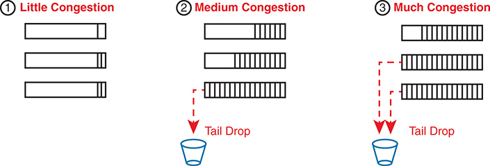


The diagram shows a vertical queue with four distinct sections, each representing a different state of the queue's fill level and its impact on packet drops. Queue Full: The topmost section is colored red and labeled Full Drops, indicating that when the queue is full, all incoming packets are dropped. Maximum Threshold: The section below is labeled Maximum Threshold, marking the point where the queue starts to drop packets at a certain percentage. This section is colored blue and labeled percent Drops, showing that packets are dropped based on a predefined percentage to prevent the queue from becoming fully saturated. Minimum Threshold: Below the maximum threshold is the Minimum Threshold, which marks the beginning of the blue section. This part of the queue experiences no packet drops and operates under normal conditions without congestion. Queue Empty: The bottom section is colored yellow and labeled No Drops, indicating that when the queue is empty or below the minimum threshold, all incoming packets are accepted without any drops.

**Figure 15-22** *Stable TCP Window: Acknowledgment Received Before Window Expires*

The worse the congestion in the queues, the more likely tail drop will occur, as shown with the most congested case on the right side of the figure. The more congestion, the bigger the negative impact on traffic—both in terms of loss and in terms of increasing delay in TCP connections.

#### Congestion Avoidance Tools

Congestion avoidance tools attempt to avoid the congestion, primarily through using TCP's own windowing mechanisms. These tools discard some TCP segments before the queues fill, hoping that enough TCP connections will slow down, reducing congestion, and avoiding a much worse problem: the effects of many more packets being dropped due to tail drop. The strategy is simple: discard some now in hopes that the device discards far fewer in the long term.

Congestion avoidance tools monitor the average queue depth over time, triggering more severe actions the deeper the queue, as shown in [Figure 15-23](vol2_ch15.xhtml#ch15fig23). The height of the box represents the queue depth, or the number of packets in the queue. When the queue depth is low, below the minimum threshold values, the congestion avoidance tool does nothing. When the queue depth is between the minimum and maximum thresholds, the congestion avoidance tool discards a percentage of the packets—usually a small percentage, like 5, 10, or 20 percent. If the queue depth passes the maximum threshold, the tool drops all packets, in an action called a *full drop*.

Of course, like all the QoS tools mentioned in this chapter, congestion avoidance tools can classify messages to treat some packets better than others. In the same queue, packets with one marking might be dropped more aggressively, and those with better DSCP markings dropped less aggressively.


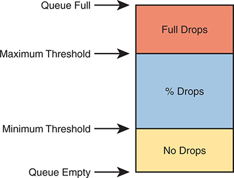


It represents a simplified model of how packet drops are managed based on the queue's occupancy level. The diagram is divided into three colored sections, each corresponding to a different state of the queue: No Drops (Yellow): This section is at the bottom and indicates the state when the queue is empty up to the Minimum Threshold. Packets are accepted without any drops in this range. Percentage Drops (Blue): The middle section represents the range between the Minimum Threshold and the Maximum Threshold. In this range, packets are subject to a probabilistic dropping mechanism, meaning a certain percentage of packets are dropped to prevent congestion from building up. The exact percentage of drops increases as the queue size approaches the Maximum Threshold. Full Drops (Red): The top section shows the state when the queue is above the Maximum Threshold and approaching full capacity. In this state, all incoming packets are dropped to prevent the queue from overflowing entirely. This drastic measure is intended to signal to the sending devices to reduce their transmission rates.

**Figure 15-23** *Mechanisms of Congestion Avoidance*

### Chapter Review

One key to doing well on the exams is to perform repetitive spaced review sessions. Review this chapter's material using either the tools in the book or interactive tools for the same material found on the book's companion website. Refer to the "[Your Study Plan](vol2_appf.xhtml#appf)" element for more details. [Table 15-4](vol2_ch15.xhtml#ch15tab04) outlines the key review elements and where you can find them. To better track your study progress, record when you completed these activities in the second column.

**Table 15-4** Chapter Review Tracking

| Review Element | Review Date(s) | Resource Used |
| --- | --- | --- |
| Review key topics |  | Book, website |
| Review key terms |  | Book, website |
| Answer DIKTA questions |  | Book, PTP |
| Review memory tables |  | Book, website |
| Watch video |  | Website |

### Review All the Key Topics


**Table 15-5** Key Topics for [Chapter 15](vol2_ch15.xhtml#ch15)

| Key Topic Element | Description | Page Number |
| --- | --- | --- |
| List | Four QoS characteristics | [324](vol2_ch15.xhtml#page_324) |
| List | Voice call QoS requirements | [328](vol2_ch15.xhtml#page_328) |
| List | Video QoS requirements | [328](vol2_ch15.xhtml#page_328) |
| [Figure 15-6](vol2_ch15.xhtml#ch15fig06) | IP Precedence and IP DSCP marking fields | [333](vol2_ch15.xhtml#page_333) |
| [Figure 15-7](vol2_ch15.xhtml#ch15fig07) | 802.1Q CoS marking field | [334](vol2_ch15.xhtml#page_334) |
| [Figure 15-10](vol2_ch15.xhtml#ch15fig10) | Trust boundary with IP Phones | [335](vol2_ch15.xhtml#page_335) |
| [Figure 15-14](vol2_ch15.xhtml#ch15fig14) | Queuing components | [338](vol2_ch15.xhtml#page_338) |
| [Figure 15-17](vol2_ch15.xhtml#ch15fig17) | LLQ scheduling logic with a priority queue | [340](vol2_ch15.xhtml#page_340) |
| List | A strategy for using queuing (congestion management) to prioritize traffic | [341](vol2_ch15.xhtml#page_341) |
| List | Logic steps for shapers and policers | [341](vol2_ch15.xhtml#page_341) |
| List | Key features of policers | [344](vol2_ch15.xhtml#page_344) |
| List | Key features of shapers | [346](vol2_ch15.xhtml#page_346) |

### Key Terms You Should Know

[bandwidth](vol2_ch15.xhtml#key_165)

[Class of Service (CoS)](vol2_ch15.xhtml#key_166)

[classification](vol2_ch15.xhtml#key_167)

[delay](vol2_ch15.xhtml#key_168)

[Differentiated Services (DiffServ)](vol2_ch15.xhtml#key_169)

[Differentiated Services Code Point (DSCP)](vol2_ch15.xhtml#key_170)

[IP Precedence (IPP)](vol2_ch15.xhtml#key_171)

[jitter](vol2_ch15.xhtml#key_172)

[loss](vol2_ch15.xhtml#key_173)

[marking](vol2_ch15.xhtml#key_174)

[per-hop behavior (PHB)](vol2_ch15.xhtml#key_175)

[policing](vol2_ch15.xhtml#key_176)

[policing rate](vol2_ch15.xhtml#key_177)

[priority queue](vol2_ch15.xhtml#key_178)

[Quality of Service (QoS)](vol2_ch15.xhtml#key_179)

[queuing](vol2_ch15.xhtml#key_180)

[round robin](vol2_ch15.xhtml#key_181)

[shaping](vol2_ch15.xhtml#key_182)

[shaping rate](vol2_ch15.xhtml#key_183)