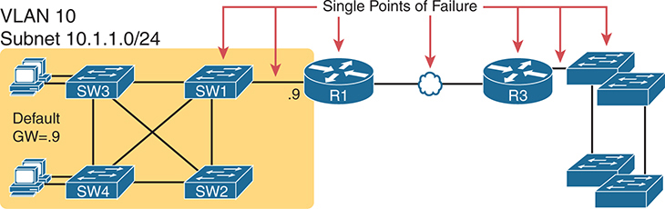
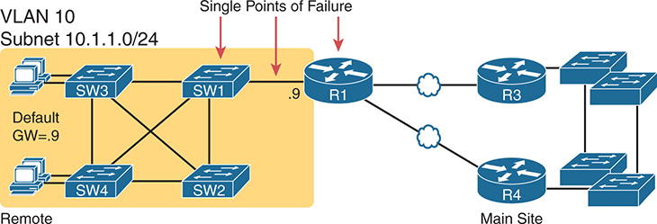
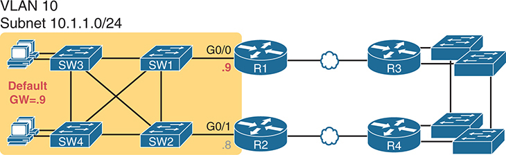
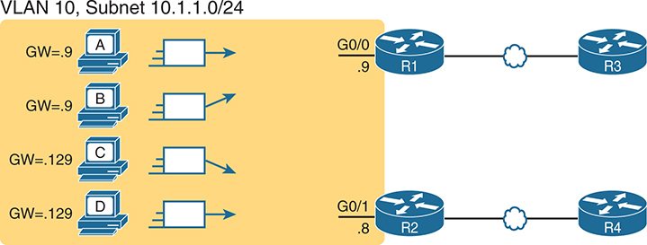
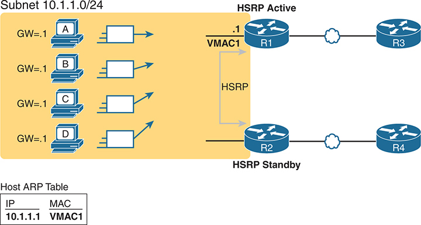
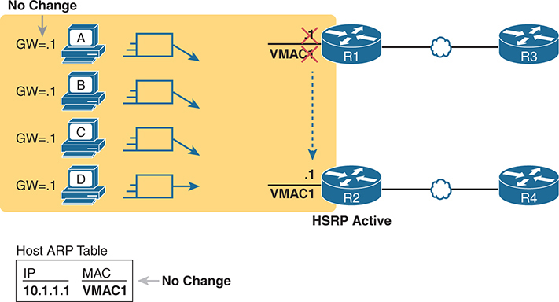
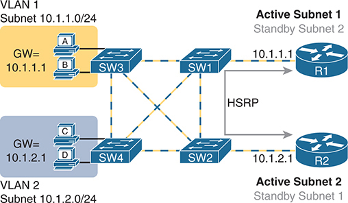
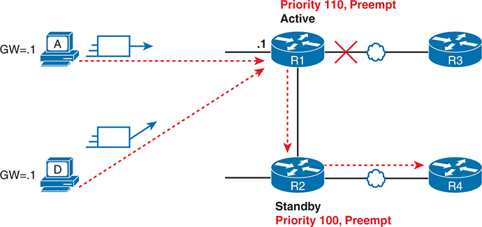
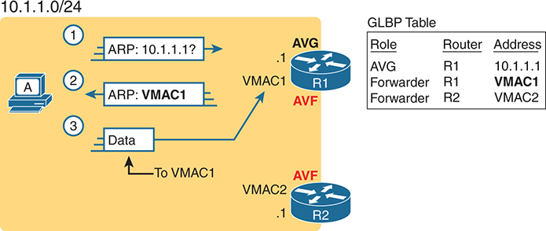
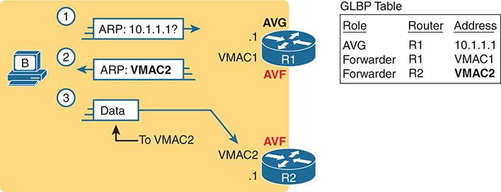

# Chapter 16

## First Hop Redundancy Protocols

This chapter covers the following exam topics:

3.0 IP Connectivity

3.5 Describe the purpose, functions, and concepts of First Hop Redundancy Protocols

Any host's default router serves as the first router, or first hop, in the routing path from sender to receiver. However, IPv4 did not include high-availability and redundancy features related to the default router. IP hosts use a single setting with a single default router IP address. Also, IP did not define a backup or load-sharing mechanism for multiple routers connected to the same subnet.

First Hop Redundancy Protocols (FHRPs) add the function of redundancy and load sharing for the default router function in any subnet.

This chapter begins with the concepts central to all FHRPs. All FHRPs define how multiple routers work together to appear as a single default router, sharing responsibility. All the FHRPs hide their existence from the hosts, so there is no change to host routing logic. The second section examines the most popular FHRP: Hot Standby Router Protocol (HSRP). The final section compares HSRP with the other two FHRPs: Virtual Router Redundancy Protocol (VRRP) and Global Load Balancing Protocol (GLBP).

### "Do I Know This Already?" Quiz

Take the quiz (either here or use the PTP software) if you want to use the score to help you decide how much time to spend on this chapter. The letter answers are listed at the bottom of the page following the quiz. [Appendix C](vol2_appc.xhtml#appc), found both at the end of the book as well as on the companion website, includes both the answers and explanations. You can also find both answers and explanations in the PTP testing software.

**Table 16-1** "Do I Know This Already?" Foundation Topics Section-to-Question Mapping

| Foundation Topics Section | Questions |
| --- | --- |
| First Hop Redundancy Protocols | 1, 2 |
| Hot Standby Router Protocol | 3, 4 |
| VRRP and GLBP Concepts | 5, 6 |

**[1](vol2_ch16.xhtml#ques16_1a).** R1 and R2 attach to the same Ethernet VLAN, with subnet 10.1.19.0/25, with addresses 10.1.19.1 and 10.1.19.2, respectively, configured with the **ip address** interface subcommand. Host A refers to 10.1.19.1 as its default router, and host B refers to 10.1.19.2 as its default router. The routers do not use an FHRP. Which of the following is a problem for this LAN?

1. The design breaks IPv4 addressing rules because two routers cannot connect to the same LAN subnet.
2. If one router fails, neither host can send packets off-subnet.
3. If one router fails, both hosts will use the one remaining router as a default router.
4. If one router fails, the host that uses that router as a default router cannot send packets off-subnet.

**[2](vol2_ch16.xhtml#ques16_2a).** R1 and R2 attach to the same Ethernet VLAN, with subnet 10.1.19.0/25, with addresses 10.1.19.1 and 10.1.19.2, respectively, configured with the **ip address** interface subcommand. The routers use an FHRP. Host A and host B attach to the same LAN and have correct default router settings per the FHRP configuration. Which of the following statements is true for this LAN?

1. The design breaks IPv4 addressing rules because two routers cannot connect to the same LAN subnet.
2. If one router fails, neither host can send packets off-subnet.
3. If one router fails, both hosts will use the one remaining router as a default router.
4. If one router fails, only one of the two hosts will still be able to send packets off-subnet.

**[3](vol2_ch16.xhtml#ques16_3a).** R1 and R2 attach to the same Ethernet VLAN, with subnet 10.1.19.0/25, with addresses 10.1.19.1 and 10.1.19.2, respectively, configured with the **ip address** interface subcommand. The routers use HSRP. The network engineer prefers to have R1 be the default router when both R1 and R2 are up. Which of the following is the likely default router setting for hosts in this subnet?

1. 10.1.19.1
2. 10.1.19.2
3. Another IP address in subnet 10.1.19.0/25 other than 10.1.19.1 and 10.1.19.2
4. A host name that the FHRP mini-DNS will initially point to 10.1.19.1

**[4](vol2_ch16.xhtml#ques16_4a).** Routers R1, R2, and R3, with addresses 10.1.1.1, 10.1.1.2, and 10.1.1.3, respectively, are in HSRPv2 group 16, and use VIP 10.1.1.8. R2 is the current HSRP active router. Which statement is true about HSRP operation in the subnet?

1. Traffic from hosts in the subnet balances across all routers (R1, R2, and R3).
2. Traffic from hosts in the subnet flows into only router R2.
3. Router R1 only replies to ARP requests for address 10.1.1.8.
4. The HSRP group uses virtual MAC 0000.0C9F.F016.

**[5](vol2_ch16.xhtml#ques16_5a).** Routers R1, R2, and R3, with addresses 10.1.1.1, 10.1.1.2, and 10.1.1.3, respectively, are in VRRPv3 group 32. R3 is the current VRRP active router. Which statements are true about VRRP operation in the subnet? (Choose two answers.)

1. The current VIP may be 10.1.1.3.
2. The current VIP must be 10.1.1.3.
3. VRRP sends its group messages to multicast address 224.0.0.18.
4. VRRP sends its group messages to multicast address 224.0.0.2.

**[6](vol2_ch16.xhtml#ques16_6a).** Which answer best describes a mechanism that enables GLBP to achieve active/active load balancing, with all routers in the group forwarding packets as a default router?

1. By configuring a VIP that matches one of the router's interface IP addresses
2. By using a different VIP per router in the same group
3. By using a separate GLBP group for each router
4. By using a different virtual MAC address per router in the same group

Answers to the "Do I Know This Already?" quiz:

**[1](vol2_appc.xhtml#ques16_1)** D

**[2](vol2_appc.xhtml#ques16_2)** C

**[3](vol2_appc.xhtml#ques16_3)** C

**[4](vol2_appc.xhtml#ques16_4)** B

**[5](vol2_appc.xhtml#ques16_5)** A, C

**[6](vol2_appc.xhtml#ques16_6)** D

### Foundation Topics

### First Hop Redundancy Protocols

When networks use a design that includes redundant routers, switches, LAN links, and WAN links, in some cases, other protocols are required to take advantage of that redundancy and prevent problems caused by it.

For instance, imagine a WAN with many remote branch offices. If each remote branch has two WAN links connecting it to the rest of the network, those routers can use an IP routing protocol to pick the best routes. The routing protocol learns routes over both WAN links, adding the best route into the routing table. When the better WAN link fails, the routing protocol adds the alternate route to the IP routing table, taking advantage of the redundant link.

As another example, consider a LAN with redundant links and switches. Those LANs have problems unless the switches use Spanning Tree Protocol (STP) or Rapid STP (RSTP). STP/RSTP prevents the problems created by frames that loop through those extra redundant paths in the LAN.

This section examines yet another protocol that helps when a network uses some redundancy, this time with redundant default routers. When two or more routers connect to the same LAN subnet, the hosts in that subnet could use any of the routers as their default router. However, another protocol is needed to use the redundant default routers best. The term [First Hop Redundancy Protocol (FHRP)](vol2_ch16.xhtml#key_184a) refers to the category of protocols that enable hosts to take advantage of redundant routers in a subnet.

This first major section of the chapter discusses the major concepts behind how different FHRPs work. This section begins by discussing a network's need for redundancy in general and the need for redundant default routers.

#### The Need for Redundancy in Networks

Networks need redundant links to improve the availability of those networks. Eventually, something in a network will fail. A router power supply might fail, or a link might break, or a switch might lose power. And those WAN links, shown as simple lines in most drawings in this book, represent the most complicated physical parts of the network, with many individual components that can fail as well.

Depending on the design of the network, the failure of a single component might mean an outage that affects at least some part of the user population. Network engineers refer to any one component that, if it fails, brings down that part of the network as a *single point of failure*. For instance, in [Figure 16-1](vol2_ch16.xhtml#ch16fig01), the LANs appear to have some redundancy, whereas the WAN does not. If most of the traffic flows between sites, many single points of failure exist, as shown in the figure.

On the left side, a network segment labeled V L A N 10, with a subnet of 10 dot 1 dot 1 dot 0 slash 24, contains multiple switches (S W 1, S W 2, S W 3, and S W 4) interconnected. A computer is connected to S W 3, and the default gateway for this V L A N is set to 10 dot 1 dot 1 dot 9, which is associated with S W 1. S W 1 is connected to Router R 1, which then connects to another router, R 3, via a W A N link. The W A N link and Router R 1 are marked with red arrows and labeled as Single Points of Failure, indicating that if either the W A N link or R 1 fails, the network connectivity to external networks or sites will be disrupted. The network diagram emphasizes the critical points where failure could impact the overall network's reliability.

**Figure 16-1** *R1 and the One WAN Link as Single Points of Failure*

The figure notes several components as a single point of failure. If any of the network's noted parts fail, packets cannot flow from the left side of the network to the right.

To improve availability, the network engineer first looks at a design and finds the single points of failure. Then the engineer chooses where to add to the network so that one (or more) single point of failure now has redundant options, increasing availability. In particular, the engineer

* Adds redundant devices and links
* Implements any necessary functions that take advantage of the redundant device or link

For instance, of all the single points of failure in [Figure 16-1](vol2_ch16.xhtml#ch16fig01), the most expensive over the long term would likely be the WAN link because of the ongoing monthly charge. However, statistically, the WAN links are the most likely component to fail. So, a good upgrade from the network in [Figure 16-1](vol2_ch16.xhtml#ch16fig01) would be to add a WAN link and possibly even connect to another router on the right side of the network, as shown in [Figure 16-2](vol2_ch16.xhtml#ch16fig02).

Many real enterprise networks follow designs like [Figure 16-2](vol2_ch16.xhtml#ch16fig02), with one router at each remote site, two WAN links connecting back to the main site, and redundant routers at the main site (on the right side of the figure). Compared to [Figure 16-1](vol2_ch16.xhtml#ch16fig01), the design in [Figure 16-2](vol2_ch16.xhtml#ch16fig02) has fewer single points of failure. Of the remaining single points of failure, a risk remains, but it is a calculated risk. For many outages, a reload of the router solves the problem, and the outage is short. But the risk still exists that the switch or router hardware will fail and require time to deliver a replacement device on-site before that site can work again.

The left side shows the same V L A N 10 with the subnet 10 dot 1 dot 1 dot 0 slash 24 and interconnected switches (S W 1, S W 2, S W 3, and S W 4), with a computer connected to S W 3 and the default gateway set to 10 dot 1 dot 1 dot 9 on S W 1. In this setup, S W 1 connects to Router R 1, which is then connected to two different W A N links, providing redundancy. Router R 1 connects to two routers, R 3 and R 4, at the main site, enhancing the overall network availability. Despite the added W A N link for redundancy, Router R 1 itself is still marked as a Single Point of Failure with a red arrow, indicating that if R 1 fails, the network would lose its connectivity to external networks or sites. This image highlights an improved network design but points out the remaining critical dependency on Router R 1.

**Figure 16-2** *Higher Availability but with R1 Still as a Single Point of Failure*

For enterprises that can justify more expense, the next step in higher availability for that remote site is to protect against those catastrophic router and switch failures. In this particular design, adding one router on the left side of the network in [Figure 16-2](vol2_ch16.xhtml#ch16fig02) removes all the single points of failure noted earlier. [Figure 16-3](vol2_ch16.xhtml#ch16fig03) shows the design with a second router, which connects to a different LAN switch so that SW1 is no longer a single point of failure.

The network is configured with V L A N 10 on subnet 10 dot 1 dot 1 dot 0 slash 24. There are multiple switches (S W 1, S W 2, S W 3, S W 4) interconnected to form a redundant loop, ensuring network resiliency. Devices connected to these switches can use either of the default gateways: 10 dot 1 dot 1 dot 9 (associated with Router R 1) or 10 dot 1 dot 1 dot 8 (associated with Router R 2), providing a failover mechanism. Routers R 1 and R 2 are connected to additional network infrastructure, enhancing the network's redundancy. This setup ensures that if any single component fails, the network continues to function without interruption.

**Figure 16-3** *Removing All Single Points of Failure from the Network Design*

Note

Medium to large enterprise networks work hard to balance high-availability features versus the available budget dollars. [Cisco.com](http://Cisco.com) has many design documents that discuss tradeoffs in high-availability design. If interested in learning more, search [Cisco.com](http://Cisco.com) for the Cisco Design Zone section of the site.

#### The Need for a First Hop Redundancy Protocol

Of the designs shown so far in this chapter, only [Figure 16-3](vol2_ch16.xhtml#ch16fig03)'s design has two routers to support the LAN on the left side of the figure, specifically the same VLAN and subnet. While having the redundant routers on the same subnet helps, the network must use an FHRP when these redundant routers exist.

To see the need and benefit of using an FHRP, first think about how these redundant routers could be used as default routers by the hosts in VLAN 10/subnet 10.1.1.0/24, as shown in [Figure 16-4](vol2_ch16.xhtml#ch16fig04). The host logic will remain unchanged, so each host has a single default router setting. So, some design options for default router settings include the following:

* All hosts in the subnet use R1 (10.1.1.9) as their default router, and they statically reconfigure their default router setting to R2's 10.1.1.8 if R1 fails.
* All hosts in the subnet use R2 (10.1.1.8) as their default router, and they statically reconfigure their default router setting to R1's 10.1.1.9 if R2 fails.
* Half the hosts use R1 and half use R2 as their default router, and if either router fails, half of the users statically reconfigure their default router setting.

The network includes four client devices labeled A, B, C, and D. Devices A and B are configured to use the default gateway 10 dot 1 dot 1 dot 9 (Router R 1), while devices C and D are configured to use the default gateway 10 dot 1 dot 1 dot 8 (Router R 2). This distribution helps to evenly distribute network traffic load across the two routers, preventing any single router from becoming a bottleneck. Both routers R 1 and R 2 connect to further network infrastructure, ensuring balanced and efficient traffic flow across the network.

**Figure 16-4** *Balancing Traffic by Assigning Different Default Routers to Different Clients*

To ensure the concept is clear, [Figure 16-4](vol2_ch16.xhtml#ch16fig04) shows this third option, with half the hosts using R1 and the other half using R2. The figure removes all the LAN switches just to unclutter the figure. Hosts A and B use R1 as their default router, and hosts C and D use R2 as their default router.

All these options have a problem: the users must act. They have to know an outage occurred. They have to know how to reconfigure their default router setting. And they have to know when to change it back to the original setting.

FHRPs use the redundant default routers without the end users being aware of any changes. The two routers appear to be a single default router. The users never have to do anything: their default router setting remains the same, and their ARP tables remain the same.

To allow the hosts to remain unchanged, the routers must do more work, as defined by one of the FHRP protocols. Generically, each FHRP makes the following happen:

1. All hosts act like they always have, with one default router setting that never has to change.
2. The default routers share a virtual IP address in the subnet, defined by the FHRP.
3. Hosts use the FHRP virtual IP address as their default router address.
4. The routers exchange FHRP protocol messages so that both agree as to which router does what work at any point in time.
5. When a router fails or has some other problem, the routers use the FHRP to choose which router takes over responsibilities from the failed router.

#### The Three Solutions for First-Hop Redundancy

The term *First Hop Redundancy Protocol* does not name any one protocol. Instead, it names a family of protocols that fill the same role. For a given network, like the left side of [Figure 16-4](vol2_ch16.xhtml#ch16fig04), the engineer would pick one of the protocols from the FHRP family.

Note

*First Hop* refers to the default router being the first router, or first router hop, through which a packet must pass.

[Table 16-2](vol2_ch16.xhtml#ch16tab02) lists the three FHRP protocols in chronological order as first used in the market. Cisco first introduced the proprietary [Hot Standby Router Protocol (HSRP)](vol2_gloss.xhtml#gloss_159), which worked well for many customers. Later, the IETF developed an RFC for a similar protocol, [Virtual Router Redundancy Protocol (VRRP)](vol2_ch16.xhtml#key_195a). Finally, Cisco developed a more robust option, [Gateway Load Balancing Protocol (GLBP)](vol2_gloss.xhtml#gloss_155).

**Table 16-2** Three FHRP Options

| Acronym | Full Name | Origin | Redundancy Approach | Load Balancing Per… |
| --- | --- | --- | --- | --- |
| HSRP | Hot Standby Router Protocol | Cisco | active/standby | subnet |
| VRRP | Virtual Router Redundancy Protocol | RFC 5798 | active/standby | subnet |
| GLBP | Gateway Load Balancing Protocol | Cisco | active/active | host |

The CCNA 200-301 version 1.1 blueprint requires you to know the purpose, functions, and concepts of an FHRP. To do that, the next section takes a deep look at HSRP concepts, while the final section of the chapter compares VRRP and GLBP to HSRP. (This chapter does not discuss FHRP configuration, but if you want to learn beyond the plain wording of the exam topics, note that [Appendix D](vol2_appd.xhtml#appd), "[Topics from Previous Editions](vol2_appd.xhtml#appd)," contains a short section about HSRP and GLBP configuration, copied from an earlier edition of the book.)

### Hot Standby Router Protocol

HSRP operates with an active/standby model (more generally called *active/passive*). HSRP allows two (or more) routers to cooperate, all willing to act as the default router. However, at any one time, only one router actively supports the end-user traffic. The packets sent by hosts to their default router flow to that one active router. Then the other routers sit there patiently waiting to take over should the active HSRP router have a problem.

This next section of the chapter discusses how HSRP achieves its goal of providing default router redundancy. It progresses briefly through the mechanisms of virtual IP and MAC addresses, failover, load balancing, object tracking, and HSRP versions.

#### HSRP Virtual IP and MAC Addresses

The [HSRP active](vol2_gloss.xhtml#gloss_159) router implements a [virtual IP address (VIP)](vol2_gloss.xhtml#gloss_362) and matching [virtual MAC address](vol2_gloss.xhtml#gloss_363). This virtual IP address is part of the HSRP configuration, an additional configuration item compared to the usual **ip address** interface subcommand. This virtual IP address is in the same subnet as the interface IP address, but it is a different IP address. The router then automatically creates the virtual MAC address. All the cooperating HSRP routers know these virtual addresses, but only the HSRP active router uses these addresses at any one point in time.

Using HSRP protocol messages between the routers, the routers negotiate and settle in either the HSRP active or [HSRP standby](vol2_gloss.xhtml#gloss_160) state. The router with the highest [HSRP priority](vol2_gloss.xhtml#gloss_160) wins and becomes active, with the other router becoming the standby router. If the priorities tie, the router with the highest IP address wins and becomes active. (Also, note that while FHRPs often have only two routers in a group, if using three or more, HSRP uses only one standby router, with the other routers in a listen state, waiting to become the new standby router one day.)

The active router implements the virtual IP and MAC addresses on its interface in addition to its configured interface IP address. Hosts refer to the virtual IP address as their default router address instead of any router's interface IP address. For instance, in [Figure 16-5](vol2_ch16.xhtml#ch16fig05), R1 and R2 use HSRP. The HSRP virtual IP address is 10.1.1.1, with the virtual MAC address referenced as VMAC1 for simplicity's sake.

The subnet 10 dot 1 dot 1 dot 0 slash 24 contains multiple hosts labeled A, B, C, and D, each configured with a default gateway of 10 dot 1 dot 1 dot 1. These hosts send their traffic to router R 1, which is currently the H S R P active router, indicated by the label H S R P Active. Router R 1, with the virtual M A C address V M A C 1, forwards traffic towards the next hop in the network, represented by router R 3. Router R 2 is in standby mode, ready to take over if R 1 fails. The A R P (Address Resolution Protocol) table of each host maps the I P address 10 dot 1 dot 1 dot 1 to the virtual M A C address V M A C 1, ensuring consistent routing through the active router, R 1.

**Figure 16-5** *All Traffic Goes to .1 (R1, Which Is Active); R2 Is Standby*

#### HSRP Failover

Under normal conditions, with all devices and interfaces working, one HSRP router is the default router, with another standing by. That might happen for months before the standby router needs to take over. However, so that the standby router knows when to act, the two routers continue to send HSRP messages to each other.

HSRP uses HSRP Hello messages to let the other HSRP routers in the same HSRP group know that the active router continues to work. HSRP defines a Hello timer, which dictates how often (in seconds) between successive Hello messages sent by the active router. HSRP also defines a Hold timer, typically more than three times the Hello timer. When the standby router fails to receive a Hello from the active router within the time defined by the hold time, the standby router believes the active router has failed, and begins taking over as the active router.

For example, [Figure 16-6](vol2_ch16.xhtml#ch16fig06) shows the result when R1, the HSRP active router in [Figure 16-5](vol2_ch16.xhtml#ch16fig05), loses power. R2 fails to receive additional HSRP Hellos from router R1 for hold time. At that point, R2, the new active router, starts using the virtual IP and MAC addresses.

Initially, all hosts A, B, C, and D continue to send their traffic to the default gateway 10 dot 1 dot 1 dot 1, still mapped to V M A C 1 in their A R P tables. Upon R 1's failure, R 2 becomes the new H S R P active router, taking over the virtual I P address 10 dot 1 dot 1 dot 1 and the virtual M A C address V M A C 1. The traffic from the hosts is now directed to R 2, which forwards it towards router R 4, the next hop in the network. The A R P tables on the hosts do not change, as the virtual M A C address V M A C 1 remains the same, ensuring uninterrupted network service.

**Figure 16-6** *Packets Sent Through R2 (New Active) After It Takes Over for Failed R1*

The figure shows packets flowing from the hosts toward router R2, with no changes on the hosts. The host keeps the same default router setting, referencing the virtual IP address (10.1.1.1). The host's ARP table does not have to change either, with the ARP entry for the default router listing the virtual MAC.

To direct the Ethernet frames that formerly flowed to router R1 to instead flow to router R2, changes occur on both the routers and the LAN switches. The new active router (R2) must be ready to receive packets (encapsulated inside frames) using the virtual IP and MAC addresses. The LAN switches, hidden in the last few figures, must also change their MAC address tables. Formerly, their MAC tables directed frames destined for VMAC1 to router R1, but now the switches must know to send the frames to the new active router, R2.

To make the switches change their MAC address table entries for VMAC1, R2 sends an Ethernet frame with VMAC1 as the source MAC address. The switches, as normal, learn the source MAC address (VMAC1) but with new ports that point toward R2. The frame is also a LAN broadcast, so all the switches learn a MAC table entry for VMAC1 that leads toward R2. (By the way, this Ethernet frame holds an ARP Reply message, called a gratuitous ARP, because the router sends it without first receiving an ARP Request.)

#### HSRP Load Balancing

The active/standby model of HSRP means that all hosts send their off-subnet packets through only one router. In other words, the routers do not share the workload; instead, one router forwards all the packets. For instance, back in [Figure 16-5](vol2_ch16.xhtml#ch16fig05), R1 was the active router. All hosts in the subnet sent their packets through R1, and none of them sent their packets through R2.

HSRP does support load balancing by preferring different routers to be the active router in different subnets. Most sites that require a second router for redundancy also use several VLANs and subnets at the site. The two routers will likely connect to all the VLANs, acting as the default router in each subnet. The HSRP configuration settings can result in one router being active in one subnet and another router being active in another subnet, balancing the traffic. Or you can configure multiple instances of HSRP in the same subnet (called multiple HSRP groups), preferring one router to be active in one group and the other router to be selected as active in another.

For instance, [Figure 16-7](vol2_ch16.xhtml#ch16fig07) shows a redesigned LAN with two hosts in VLAN 1 and two in VLAN 2. R1 and R2 connect to the LAN using a VLAN trunking and router-on-a-stick (ROAS) configuration. The two routers define two HSRP groups, one to support each of the two subnets. In this case, R1 wins and becomes active in Subnet 1, while router R2 becomes active in Subnet 2.

The network is divided into two V L A Ns: V L A N 1 and V L A N 2, corresponding to Subnet 10 dot 1 dot 1 dot 0 slash 24 and Subnet 10 dot 1 dot 2 dot 0 slash 24, respectively. V L A N 1 includes computers A and B, connected to switch S W 3, and uses a gateway (G W) I P address of 10 dot 1 dot 1 dot 1. V L A N 2 includes computers C and D, connected to switch S W 4, and uses a gateway I P address of 10 dot 1 dot 2 dot 1. The switches S W 3 and S W 4 are interconnected with S W 1 and S W 2 in a redundant mesh topology, ensuring multiple paths for data transmission. Router R 1, connected to S W 1, serves as the active router for Subnet 10 dot 1 dot 1 dot 0 slash 24 and as the standby router for Subnet 10 dot 1 dot 2 dot 0 slash 24. Conversely, Router R 2, connected to S W 2, serves as the active router for Subnet 10 dot 1 dot 2 dot 0 slash 24 and as the standby router for Subnet 10 dot 1 dot 1 dot 0 slash 24. This setup is managed by H S R P, which provides redundancy and load balancing between the routers.

**Figure 16-7** *Load Balancing with HSRP by Using Different Active Routers per Subnet*

Note that the design uses both routers and WAN links by having each router act as the HSRP active router in some subnets.

The example surrounding [Figure 16-7](vol2_ch16.xhtml#ch16fig07) raises the question of where to consider using HSRP. You should consider an FHRP on any router or Layer 3 switch interface with an IP address that connects to hosts that rely on a default router setting. If only one router connects to the subnet, you do not need an FHRP, but if two or more connect to the subnet, you benefit from using an FHRP.

#### HSRP Interface Tracking

Another feature supported by all the FHRPs tracks the operational state of other router features. IOS allows for tracking of interface state, tracking routes in the IP routing table, and other types of objects. When the tracked interface or object fails, HSRP reduces that router's HSRP priority. With well-chosen priority and tracking settings, you can arrange the HSRP configuration so that when everything works perfectly, one router is active. Later, when something fails related to that router, another router preempts and takes over as the active router.

[Figure 16-8](vol2_ch16.xhtml#ch16fig08) shows one classic failure case that can occur without tracking. In this example, router R1 uses priority 110, with router R2 using 100 (the default), so R1 wins and becomes HSRP active. However, the one WAN link connected to R1 fails. R1 remains the HSRP active router. In this failure case, hosts forward packets to router R1, which has to forward them to router R2, which has the only working WAN link.

On the left side, there are two computers, A and D, each connected to their respective subnets. Computer A is in Subnet 10 dot 1 dot 1 dot 0 slash 24, and Computer D is in Subnet 10 dot 1 dot 2 dot 0 slash 24, both using the gateway I P address ending in dot 1. Router R 1 is shown as the active router with a priority of 110 and preempt enabled, managing the primary routing for Computer A. Router R 2 is the standby router with a priority of 100 and preempt enabled, managing the primary routing for Computer D. Both routers are connected to the W A N, represented by the cloud symbol. In the scenario where Router R 1's W A N link fails, indicated by a red cross, traffic from Computer A needs to be rerouted through Router R 2. This causes an extra routing hop as traffic is first directed to Router R 2 and then out to the W A N. The red dashed lines illustrate the path taken by the rerouted traffic from Computer A through Router R 2 to the W A N.

**Figure 16-8** *Problem: Extra Routing Hop When the R1 WAN Link Fails*

A better plan links the HSRP role to the WAN link state. For instance, with interface tracking and preemption, you can configure HSRP as follows:

If R1's WAN link is up, make R1 HSRP active.

If R1's WAN link is down, make R2 HSRP active.

To do so, HSRP object tracking on R1 monitors the state of the R1 WAN interface. If the interface fails, HSRP lowers R1's HSRP priority, allowing R2 to preempt R1. For example:

1. R1 notices its WAN interface fails.
2. R1 lowers its HSRP priority by 20 points.
3. HSRP messages allow both R1 and R2 to realize that R2 has a better (higher) priority and has the right to preempt.
4. R2, using preemption, becomes the HSRP active router.

As a result, while router R1's WAN link is down, packets from the hosts on the left flow first to R2 and then out a WAN link. Later, when R1's WAN link recovers, it preempts router R2 and becomes active again.

#### HSRP Recovery and Preemption

The [HSRP preemption](vol2_gloss.xhtml#gloss_159) also dictates what happens when a formerly active router recovers, independent of any HSRP tracking. HSRP disables preemption by default but supports it on any router.

First, consider the following scenario:

1. R1 has priority 110, and R2 has priority 100, so R1 wins and becomes active, while R2 becomes standby.
2. Later, R1 fails, so R2 becomes active.
3. When R1 recovers, what happens?

With the default setting of no preemption, R2 remains the active router. With only two routers in the HSRP group, when R1 recovers, it moves to a standby state, ready to take over from R2 when R2 next fails. In that case, the operations staff can choose when to make the failover happen, for instance, off-shift, when a minor outage has no impact.

If you prefer, you can enable preemption. With preemption, in this case, or any case in which a new router appears in the group that has a better (higher) priority than the active router, it takes over as the active router. The switch to a new active router is methodical but quick, without waiting for timers like the Hello and Hold timers to expire, but it might cause a disruption in packet flow for a second or two. (Note that preemption does not apply to cases where the priorities tie, but only when the new router has a higher priority.)

#### HSRP Versions

Cisco routers and Layer 3 switches support two versions of HSRP: versions 1 and 2. The versions have enough differences, like multicast IP addresses used and message formats, so routers in the same HSRP group must use the same version. Suppose two routers configured in the same HSRP group mistakenly use different versions. In that case, they will not understand each other and will ignore each other for the purposes of HSRP.

There are good reasons to use the more recent HSRP version 2 (HSRPv2). HSRPv2 added IPv6 support. It also supports faster convergence when changes happen using shorter Hello and Hold timers, while HSRPv1 typically had a minimum of a 1-second Hello timer. [Table 16-3](vol2_ch16.xhtml#ch16tab03) lists the differences between HSRPv1 and HSRPv2.

**Table 16-3** HSRPv1 Versus HSRPv2

| Feature | Version 1 | Version 2 |
| --- | --- | --- |
| IPv6 support | No | Yes |
| Smallest unit for Hello timer | Second | Millisecond |
| Range of group numbers | 0..255 | 0..4095 |
| Virtual MAC address used (*xx* or *xxx* is the hex group number) | 0000.0C07.AC*xx* | 0000.0C9F.F*xxx* |
| IPv4 multicast address used | 224.0.0.2 | 224.0.0.102 |

Ensure you understand how a router chooses the virtual MAC shown in the table. HSRPv1 supports 256 groups per interface, while HSRPv2 supports 4096. You can represent decimal values 0..255 with two-digit hexadecimal equivalents of 00..FF, while decimal values 0..4095 require three hex digits from 000..FFF. The HSRP virtual MAC addresses use the hex equivalents of the configured decimal HSRP group number as the last two or three digits of the virtual MAC address as follows:

HSRPv1: 0000.0C07.AC*xx*, where *xx* is the hex group number

HSRPv2: 0000.0C9F.F*xxx*, where *xxx* is the hex group number

For example, an HSRPv1 group 1 would use virtual MAC address 0000.0C07.AC**01**, while an HSRPv2 group would use 0000.0C9F.F**001**. For group decimal 100 (hex 64), they would use 0000.0C07.AC**64** and 0000.0C9F.F**064**, respectively.

### VRRP and GLBP Concepts

Now that you have a thorough understanding of the purpose, functions, and concepts of HSRP, this third major section of the chapter examines the two other FHRPs: VRRP and GLBP. Both provide the same primary functions as HSRP. VRRP has more similarities with HSRP, while GLBP goes beyond HSRP with better load-balancing features.

#### Virtual Router Redundancy Protocol (VRRP)

HSRP and VRRP emerged in the 1990s when TCP/IP and routers first became common in corporate networks. As is often the case, Cisco saw a need, but with no standards-based solution, so they defined HSRP as a proprietary solution for first hop router redundancy. Later, the IETF created VRRP, providing similar features. However, unlike many stories of Cisco-proprietary pre-standard features, HSRP has not faded into history; you will still find both HSRP and VRRP support in many Cisco product families.

Note

While VRRP includes versions 1, 2, and 3, all references in this chapter refer to VRRPv3 (RFC 5798.)

For similarities, note that VRRP supports all the same functions as HSRP, as described earlier in this chapter. The purpose remains to provide a standby backup for the default router function, preemption if desired, and load balancing the default router role by using multiple VRRP groups.

The differences come with default settings, protocol details, and addresses used. [Table 16-4](vol2_ch16.xhtml#ch16tab04) lists some comparison points between HSRP, VRRP, and GLBP (ignore GLBP for now.)

**Table 16-4** Comparing Features of the Three FHRP Options

| Acronym | HSRPv2 | VRRPv3 | GLBP |
| --- | --- | --- | --- |
| Cisco Proprietary | Yes | No | Yes |
| VIP must differ from the routers' interface IP addresses | Yes | No | Yes |
| Preemption off by default | Yes | No | Yes |
| Allows preemption (or not) | Yes | Yes | Yes |
| Default priority value (decimal) | 100 | 100 | 100 |
| Supports tracking to change the priority | Yes | Yes | Yes |
| Supports IPv4 and IPv6 | Yes | Yes | Yes |
| Active/active load balancing with multiple active routers in one group | No | No | Yes |
| IPv4 multicast address used | 224.0.0.102 | 224.0.0.18 | 224.0.0.102 |
| Group numbers supported in IOS | 0–4095 | 1–255 | 0–1023 |
| Virtual MAC address pattern | 0000.0c9f.fxxx | 0000.5e00.01xx | 0007.b40x.xxrr |

You can configure VRRP so that it appears to work like HSRP. Two or more VRRP routers form a group within one subnet. VRRP routers define one VIP, use multicast messages to communicate with each other, use an active/standby approach, select the active router with the same logic as HSRP, allow tracking, and fail over when the master (active) router fails. (Note that VRRP uses the terms *master* and *backup* rather than *active* and *standby*.)

One difference comes in the choice of VIP. You can use the same IP address as one of the VRRP routers' interface addresses or, like HSRP, use another IP address in the subnet. For example, the HSRP discussion around [Figures 16-5](vol2_ch16.xhtml#ch16fig05) and [16-6](vol2_ch16.xhtml#ch16fig06) used VIP 10.1.1.1, with router addresses 10.1.1.9 and 10.1.1.8. You could do the same with VRRP or use 10.1.1.9 (the same IP address as router R1's interface IP address).

VRRP has protocol differences as well. It uses a multicast IPv4 address (224.0.0.18) for its messages. While it uses a single virtual MAC per group, the MAC address follows a different pattern. VRRP configuration uses decimal group numbers from 1 to 255 decimal. The virtual MAC uses the equivalent two-digit hex group number at the end of the virtual MAC, with VRRP routers choosing their virtual MAC based on this pattern:

VRRPv3: 0000.5e00.01*xx*, where *xx* is the hex group number

#### GLBP Concepts

Cisco-proprietary GLBP, defined after HSRP and VRRP, provides the same benefits as HSRP and VRRP but with different implementation details. But it also includes different internals that allow much more effective load balancing. So, while used for redundancy (the *R* in FHRP), GLBP also adds robust load balancing, per its name.

This GLBP section begins with comparisons to the other FHRPs and then discusses its improved approach to load balancing.

##### Similarities of GLBP, HSRP, and VRRP

GLBP provides redundancy for the default router function while hiding that redundancy from the hosts using that default router address. But most of the core features follow a familiar theme:

* It uses a virtual IP address (VIP), which is the address used by endpoints as their default router.
* It identifies the best router in the group based on the highest priority.
* It allows for the preemption of the best router when a new router with a better (higher) priority joins the group.
* It supports tracking, which dynamically lowers one router's priority, allowing another router to preempt the first based on conditions like an interface failure.
* It sends messages using multicasts but uses a different address: 224.0.0.102.

GLBP uses virtual MAC addresses differently than the other FHRPs as part of the underlying support for load balancing. Like HSRP and VRRP, a GLBP group has one VIP. Unlike HSRP and VRRP, the routers in a group do not use one virtual MAC address whose function resides with the one active router. Instead, GLBP uses a unique virtual MAC address per GLBP router.

The MAC address value includes three hex digits to represent the decimal GLBP group number, with the unique last two digits (01, 02, 03, or 04) representing the four allowed GLBP routers in a group. The MAC address pattern is 0007.b40*x*.*xxrr*. For instance, for two routers in the same GLBP group:

**Router R1:** 0007:b40**0:1401** (Decimal group 20, which is hex group 014, assigned router number 01)

**Router R2:** 0007:b40**0:1402** (Decimal group 20, which is hex group 014, assigned router number 02)

##### GLBP Active/Active Load Balancing

With a name like Gateway Load Balancing Protocol, load balancing should be a key feature. The term *gateway* refers to the alternate term for default router (*default gateway*), so by name, GLBP claims to load balance across the default routers in a subnet—and it does.

GLBP manipulates the hosts' IP ARP tables in a subnet so that some hosts forward packets to one router and some to another. As usual, all the hosts use the same VIP as their default router address. Under normal conditions, with multiple GLBP routers working in the subnet, GLBP spreads the default router workload across all GLBP group members. When one of those routers fails, GLBP defines the methods by which the remaining router or routers take over the role of the failed router.

To achieve this active/active load balancing, one GLBP performs the role of [GLBP active virtual gateway (AVG)](vol2_gloss.xhtml#gloss_156). The AVG handles all ARP functions for the VIP. Knowing the virtual MAC addresses of all the routers in the group, the AVG replies to some ARP Requests with one virtual MAC and some with the other. As a result, some hosts in the subnet send frames to the Ethernet MAC address of one of the routers, with different hosts sending their frames to the MAC address of the second router.

All routers serve as a [GLBP active virtual forwarder (AVF)](vol2_gloss.xhtml#gloss_155) to support load balancing. All the AVFs sit ready to receive Ethernet frames addressed to their unique virtual MAC address and to route the encapsulated packets as usual. Note that one router serves as both AVG and AVF.

[Figures 16-9](vol2_ch16.xhtml#ch16fig09) and [16-10](vol2_ch16.xhtml#ch16fig10) show the results of two ARP Reply messages from AVG R1. First, [Figure 16-9](vol2_ch16.xhtml#ch16fig09) shows how a GLBP balances traffic for host A based on the ARP Reply sent by the AVG (R1). The two AVF routers support virtual IP address 10.1.1.1, with the hosts using that address as their default router setting.

The figure shows three messages, top to bottom, with the following action:

1. Host A has no ARP table entry for its default router, 10.1.1.1, so host A sends an ARP Request to learn 10.1.1.1's MAC address.
2. The GLBP AVG, R1 in this case, sends back an ARP Reply. The AVG includes its virtual MAC address in the ARP Reply, VMAC1.
3. Host A encapsulates future IP packets in Ethernet frames destined for VMAC1, so they arrive at R1 (also an AVF).

The network operates on subnet 10 dot 1 dot 1 dot 0 slash 24. A R P Request: Host A sends an A R P request asking for the M A C address of the default gateway 10 dot 1 dot 1 dot 1. A R P Reply: Router R 1 responds to Host A with the A R P reply, providing V M A C 1 as the M A C address. Data Transmission: Host A then sends data to the M A C address V M A C 1. To the right of the network diagram, there is a G L B P table showing the roles and addresses: A V G (Active Virtual Gateway): R 1, 10 dot 1 dot 1 dot 1. A V F (Active Virtual Forwarder): R 1, V M A C 1. Forwarder: R 2, V M A C 2.

**Figure 16-9** *GLBP Directs Host A by Sending Back the ARP Reply with R1's VMAC1*

To balance the load, the AVG answers each new ARP Request with the MAC addresses of alternating routers. [Figure 16-10](vol2_ch16.xhtml#ch16fig10) continues the load-balancing effect with host B's ARP Request for 10.1.1.1. The router acting as AVG (R1) still sends the ARP Reply, but this time with R2's virtual MAC (VMAC2).

The network operates on subnet 10 dot 1 dot 1 dot 0 slash 24. A R P Request: Host B sends an A R P request asking for the M A C address of the default gateway 10 dot 1 dot 1 dot 1. A R P Reply: Router R 1 responds to Host B with the A R P reply, providing V M A C 2 as the M A C address. Data Transmission: Host B then sends data to the M A C address V M A C 2. To the right of the network diagram, there is a G L B P table showing the roles and addresses: A V G (Active Virtual Gateway): R 1, 10 dot 1 dot 1 dot 1. A V F (Active Virtual Forwarder): R 1, V M A C 1. Forwarder: R 2, V M A C 2.

**Figure 16-10** *GLBP Directs Host B by Sending Back the ARP Reply with R2's VMAC2*

Here are the steps in the figure:

1. Host B sends an ARP Request to learn 10.1.1.1's MAC address.
2. The GLBP AVG (R1) sends back an ARP Reply, listing VMAC2, R2's virtual MAC address.
3. Host B encapsulates future IP packets in Ethernet frames destined for VMAC2, so they arrive at R2.

Finally, to capture a few related points beyond this GLBP example, note that GLBP uses priority, preemption, and tracking. However, those rules apply to the AVG only; all GLBP routers serve as AVFs. So, if the AVG fails, the remaining routers in a GLBP group elect a new AVG.

That model requires additional logic to deal with AVF failures. When a router serving as only an AVF fails, the AVG recognizes the failure and causes a still-functional AVF to begin receiving frames sent to the failed AVF's virtual MAC address.

### Chapter Review

One key to doing well on the exams is to perform repetitive spaced review sessions. Review this chapter's material using either the tools in the book or interactive tools for the same material found on the book's companion website. Refer to the "[Your Study Plan](vol2_appf.xhtml#appf)" element for more details. [Table 16-5](vol2_ch16.xhtml#ch16tab05) outlines the key review elements and where you can find them. To better track your study progress, record when you completed these activities in the second column.

**Table 16-5** Chapter Review Tracking

| Review Element | Review Date(s) | Resource Used |
| --- | --- | --- |
| Review key topics |  | Book, website |
| Review key terms |  | Book, website |
| Answer DIKTA questions |  | Book, PTP |
| Review memory tables |  | Website |

### Review All the Key Topics

**Table 16-6** Key Topics for [Chapter 16](vol2_ch16.xhtml#ch16)

| Key Topic Element | Description | Page Number |
| --- | --- | --- |
| List | Common characteristics of all FHRPs | [355](vol2_ch16.xhtml#page_355) |
| [Table 16-2](vol2_ch16.xhtml#ch16tab02) | Comparisons of HSRP, VRRP, GLBP | [356](vol2_ch16.xhtml#page_356) |
| [Figure 16-5](vol2_ch16.xhtml#ch16fig05) | HSRP concepts | [357](vol2_ch16.xhtml#page_357) |
| [Figure 16-6](vol2_ch16.xhtml#ch16fig06) | HSRP failover results | [358](vol2_ch16.xhtml#page_358) |
| [Table 16-3](vol2_ch16.xhtml#ch16tab03) | Comparing HSRPv1 and HSRPv2 | [361](vol2_ch16.xhtml#page_361) |
| [Table 16-4](vol2_ch16.xhtml#ch16tab04) | Comparing HSRP, VRRP, and GLBP | [362](vol2_ch16.xhtml#page_362) |
| List | GLBP virtual MAC addresses | [364](vol2_ch16.xhtml#page_364) |
| [Figure 16-10](vol2_ch16.xhtml#ch16fig10) | GLBP AVG ARP Reply referring to a different GLBP router | [365](vol2_ch16.xhtml#page_365) |

### Key Terms You Should Know

[First Hop Redundancy Protocol (FHRP)](vol2_ch16.xhtml#key_184)

[Gateway Load Balancing Protocol (GLBP)](vol2_ch16.xhtml#key_185)

[GLBP active virtual forwarder (AVF)](vol2_ch16.xhtml#key_186)

[GLBP active virtual gateway (AVG)](vol2_ch16.xhtml#key_187)

[Hot Standby Router Protocol (HSRP)](vol2_ch16.xhtml#key_188)

[HSRP active](vol2_ch16.xhtml#key_189)

[HSRP preemption](vol2_ch16.xhtml#key_190)

[HSRP priority](vol2_ch16.xhtml#key_191)

[HSRP standby](vol2_ch16.xhtml#key_192)

[virtual IP address (VIP)](vol2_ch16.xhtml#key_193)

[virtual MAC address](vol2_ch16.xhtml#key_194)

[Virtual Router Redundancy Protocol (VRRP)](vol2_ch16.xhtml#key_195)