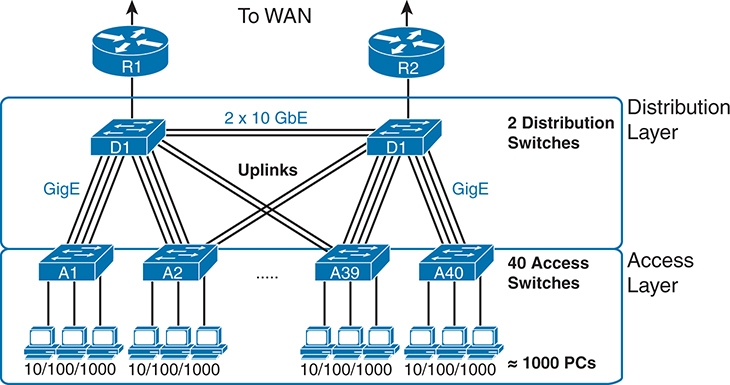
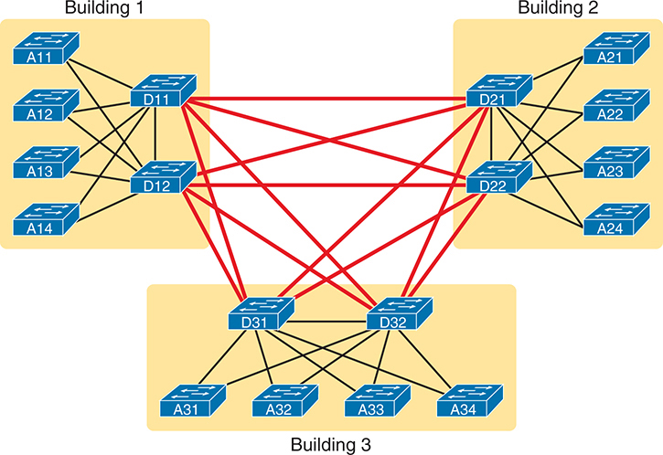
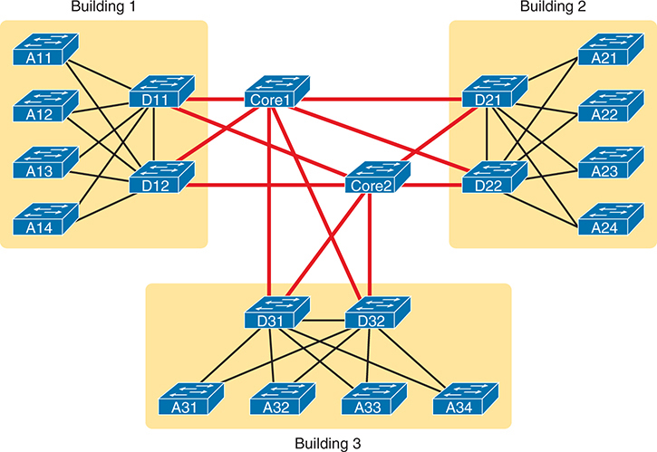
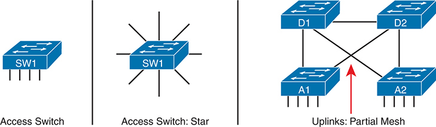
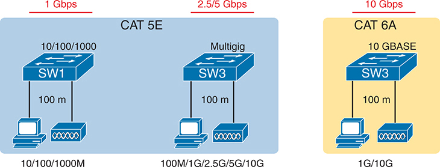
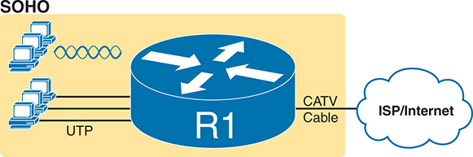
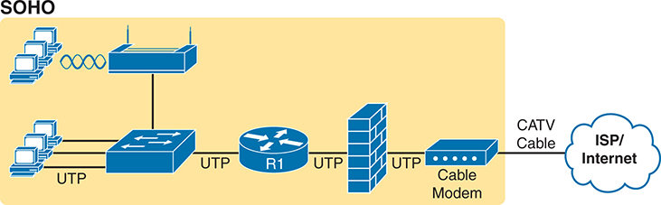
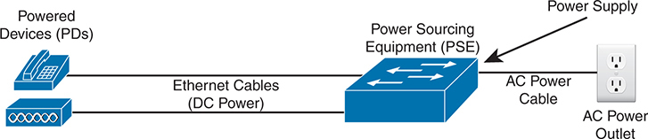

# Chapter 18

## LAN Architecture

This chapter covers the following exam topics:

1.0 Network Fundamentals

1.1 Explain the role and function of network components

1.1.h PoE

1.2 Describe characteristics of network topology architectures

1.2.a Two-tier

1.2.b Three-tier

1.2.e Small office/home office (SOHO)

1.3 Compare physical interface and cabling types

1.3.a Single-mode fiber, multimode fiber, copper

By now you have learned a lot about Ethernet and Ethernet switches. You have learned how individual links work, with cabling, duplex settings, and framing. You know how addresses work and how switches forward frames based on those addresses. You have seen how switches deal with redundancy, using STP/RSTP and collecting links into EtherChannels. And here in Volume 2, you have learned about various security features available for switches, including Dynamic ARP Inspection, DHCP Snooping, and ARP Inspection.

What the earlier discussions of individual features do not do to any great extent is discuss architecture and design. You now know how switches work, but why would you connect switches in one topology versus another? If you could connect switches in two different topologies, why would you prefer one? This chapter examines a few such design questions, specifically the topic areas mentioned in the CCNA 200-301 V1.1 exam blueprint.

This chapter covers four specific topics that have design-related considerations. The first section looks at the topology of a campus Ethernet LAN and the design terms *two-tier* and *three-tier*, which describe how many switch layers exist between the endpoints and the devices that lead out of the campus to some other site. The second section discusses copper and multimode fiber cabling options for campus links. A third short section examines small office/home office (SOHO) LANs and how they differ from enterprise LANs. The final section introduces the concepts behind Power over Ethernet (PoE) and the reasons why LAN design activities need to consider PoE.

### "Do I Know This Already?" Quiz

Take the quiz (either here or use the PTP software) if you want to use the score to help you decide how much time to spend on this chapter. The letter answers are listed at the bottom of the page following the quiz. [Appendix C](vol2_appc.xhtml#appc), found both at the end of the book as well as on the companion website, includes both the answers and explanations. You can also find both answers and explanations in the PTP testing software.

**Table 18-1** "Do I Know This Already?" Foundation Topics Section-to-Question Mapping

| Foundation Topics Section | Questions |
| --- | --- |
| Analyzing Campus LAN Topologies | 1–3 |
| Ethernet Physical Media and Standards | 4 |
| Small Office/Home Office | 5 |
| Power over Ethernet | 6, 7 |

**[1](vol2_ch18.xhtml#ques18_1a).** Which answers best describe the topology in a two-tier campus LAN design? (Choose two answers.)

1. The design uses a full mesh of links between access and distribution switches.
2. The design uses a partial mesh of links between access and distribution switches.
3. The design uses a partial mesh of links between the distribution and core switches.
4. The end-user and server devices connect directly to access layer switches.

**[2](vol2_ch18.xhtml#ques18_2a).** In a three-tier campus LAN design, which answers best describe the topology? (Choose two answers.)

1. The design uses a partial mesh of links between access and distribution switches.
2. The design uses a full mesh of links between access and distribution switches.
3. The design uses a partial mesh of links between the distribution and core switches.
4. The end-user and server devices connect directly to distribution layer switches.

**[3](vol2_ch18.xhtml#ques18_3a).** Which topology term refers to a network in which one node connects to all other nodes with no other links?

1. Partial mesh
2. Full mesh
3. Hybrid topology
4. Star topology

**[4](vol2_ch18.xhtml#ques18_4a).** Which cable categories support 1000BASE-T at distances up to 100 meters? (Choose two answers.)

1. CAT 5
2. CAT 5E
3. CAT 6
4. OM1
5. OM3

**[5](vol2_ch18.xhtml#ques18_5a).** Which answers list criteria typical of a SOHO network? (Choose two answers.)

1. The AP functions using standalone mode.
2. The AP functions using a split-MAC architecture using a WLC.
3. A single networking device implements the router, switch, AP, and firewall functions.
4. Separate networking devices implement each function (router, switch, AP, and firewall).

**[6](vol2_ch18.xhtml#ques18_6a).** After deciding the attached device wants to receive power over the UTP cable, how does a PoE LAN switch choose the initial power level to apply?

1. It applies a standard small amount of voltage.
2. It asks using CDP messages.
3. It asks using LLDP messages.
4. It applies voltage based on a configured value.

**[7](vol2_ch18.xhtml#ques18_7a).** Which of the following refers to standards that deliver power over all four pairs in a UTP cable? (Choose two answers.)

1. PoE
2. UPoE
3. PoE+
4. UPoE+

Answers to the "Do I Know This Already?" quiz:

**[1](vol2_appc.xhtml#ques18_1)** B, D

**[2](vol2_appc.xhtml#ques18_2)** A, C

**[3](vol2_appc.xhtml#ques18_3)** D

**[4](vol2_appc.xhtml#ques18_4)** B, C

**[5](vol2_appc.xhtml#ques18_5)** A, C

**[6](vol2_appc.xhtml#ques18_6)** A

**[7](vol2_appc.xhtml#ques18_7)** B, D

### Foundation Topics

### Analyzing Campus LAN Topologies

The term *campus LAN* refers to the LAN created to support the devices in a building or in multiple buildings close to one another. For example, a company might lease office space in several buildings in the same office park. The network engineers can then build a campus LAN that includes switches in each building, plus Ethernet links between the switches in the buildings, to create a larger campus LAN.

When planning and designing a campus LAN, the engineers must consider the types of Ethernet available and the cabling lengths each type supports. The engineers also need to choose the speeds required for each Ethernet segment. In addition, engineers use switches in different roles—some connect directly to end-user devices, and others connect switches. Finally, most projects require that engineers consider the type of equipment already installed and whether an increase in speed on some segments is worth the cost of buying new equipment.

This first major section of this chapter discusses the topology of a campus LAN design. Network designers do not just plug in devices to any port and arbitrarily connect switches like you might do with a few devices in a lab. Instead, most traditional campus LAN designs follow either two- or three-tier designs, as discussed in the following pages.

#### Two-Tier Campus Design (Collapsed Core)

[Figure 18-1](vol2_ch18.xhtml#ch18fig01) shows a typical design of a large campus LAN plus some key terms. This LAN has around 1000 PCs connected to switches that support around 25 ports each. Explanations of the terminology follow the figure.

The network is divided into two main layers: the Distribution Layer and the Access Layer. At the Distribution Layer, two distribution switches (D 1 and D 2) are connected to routers R 1 and R 2, which provide connectivity to the Wide Area Network (W A N). These distribution switches are interconnected and connected to the access layer switches via high-speed uplinks (2 x 10 Gigabit Ethernet). At the Access Layer, there are 40 access switches (A 1 to A 40), each providing connectivity to 1000 P C s through 10 slash 100 slash 1000 Megabits per second (M b p s) Ethernet ports. The distribution switches aggregate traffic from the access switches and provide a path to the W A N, ensuring efficient and scalable network connectivity. The access switches connect end devices such as P C s, allowing them to communicate within the campus network and access external resources via the distribution switches.

**Figure 18-1** *Campus LAN with Design Terminology Listed*

Cisco uses three terms to describe the role of each switch in a campus design: *access*, *distribution*, and *core*. The roles differ based on whether the switch forwards traffic from user devices and the rest of the LAN (access) or whether the switch forwards traffic between other LAN switches (distribution and core).

*Access switches* connect directly to end users, providing user device access to the LAN. Access switches normally send traffic to and from the end-user devices to which they are connected and sit at the edge of the LAN. [Access links](vol2_gloss.xhtml#gloss_019) connect the access switch to the various endpoint devices. The following list summarizes the more common features implemented by access switches:

* Physical network access links for endpoints and wireless APs
* Power over Ethernet (PoE)
* Redundant uplinks with EtherChannel and STP/RSTP
* Security (port security, DHCP Snooping, and DAI)
* A QoS trust boundary created using QoS classification and marking

*Distribution switches* provide a path through which the access switches can forward traffic to each other and outside the campus to the rest of the enterprise. The links between the access and distribution switches—uplinks or [distribution links](vol2_gloss.xhtml#gloss_119)—typically connect each access switch to two distribution switches, often with multiple links in an EtherChannel.

Beyond that basic connectivity, the [distribution layer](vol2_gloss.xhtml#gloss_118) provides many features that affect the endpoints connected to the access switches. Because designs use only a few distribution switches, and some of the services require additional processing, distribution switches will often need more powerful processors and more memory. The following list summarizes the more common features implemented by distribution switches:

* Connects access switches into the network
* Creates a core with other distribution switches, either directly (two-tier) or using core switches (three-tier)
* Provides Layer 3 features such as interVLAN routing, default router, FHRPs
* Implements dynamic IP routing protocols (e.g., OSPF)
* Load balances over redundant links and devices (EtherChannels, STP/RSTP, FHRPs)
* Provides QoS (queuing, policing, drop)
* Filters IPv4 and IPv6 packets with ACLs

[Figure 18-1](vol2_ch18.xhtml#ch18fig01) shows a two-tier design, with the tiers being the access tier (or layer) and the distribution tier (or layer). A two-tier design solves two major design needs:

* Provides a place to connect end-user devices (the [access layer](vol2_gloss.xhtml#gloss_018), with access switches), typically within 100 meters
* Creates paths between all devices with a reasonable number of cables and switch ports by connecting all 40 access switches to two distribution switches

#### Three-Tier Campus Design (Core)

The two-tier design of [Figure 18-1](vol2_ch18.xhtml#ch18fig01), with a [partial mesh](vol2_gloss.xhtml#gloss_243) of distribution links, happens to be the most common campus LAN design. It also goes by two common names: a two-tier design (for obvious reasons) and a [collapsed core design](vol2_gloss.xhtml#gloss_081) (for less obvious reasons). The term *collapsed core* refers to the two-tier design without a third tier (the core tier). A two-tier design has a core, but the distribution switches implement the core; the core is collapsed into the distribution switches. This next topic examines a three-tier design with a [core layer](vol2_gloss.xhtml#gloss_098) for perspective while further detailing the purpose of the core.

Imagine your campus has just two or three buildings. Each building has a two-tier design inside the building, with a pair of distribution switches in each building and access switches spread around the building as needed. How would you connect the LANs in each building? Well, with just a few buildings, it makes sense to simply cable the distribution switches together in a [full mesh](vol2_gloss.xhtml#gloss_151), as shown in [Figure 18-2](vol2_ch18.xhtml#ch18fig02).

The design in [Figure 18-2](vol2_ch18.xhtml#ch18fig02) works well, and many companies use this design. Sometimes the center of the network uses a full mesh, sometimes a partial mesh, depending on the availability of cables between the buildings.

Using a third tier in the center of the campus—the core tier—has several advantages in large campuses. For instance, you can use far fewer switch ports and links while connecting the building LANs. And note that with the links between buildings, the cables run outside, are often more expensive to install, and are almost always fiber cabling with more expensive switch ports, so conserving the number of cables used between buildings can help reduce costs.

In each building, there are multiple access switches connected to distribution switches. In Building 1, access switches labeled A 11, A 12, A 13, and A 14 are connected to two distribution switches labeled D 11 and D 12. Similarly, in Building 2, access switches labeled A 21, A 22, A 23, and A 24 are connected to distribution switches labeled D 21 and D 22. In Building 3, access switches labeled A 31, A 32, A 33, and A 34 are connected to distribution switches labeled D 31 and D 32. The distribution switches in each building are interconnected with each other through a series of red lines representing the links, forming a mesh network. This interconnectivity between distribution switches in different buildings ensures redundancy and network resilience but lacks a centralized core layer.

**Figure 18-2** *Two-Tier Building Design, No Core, Three Buildings*

A three-tier [core design](vol2_gloss.xhtml#gloss_081), unsurprisingly at this point, adds a few more switches (core switches), which provide one primary function: to connect the distribution switches. [Figure 18-3](vol2_ch18.xhtml#ch18fig03) shows the migration of [Figure 18-2](vol2_ch18.xhtml#ch18fig02)'s collapsed core (a design without a core) to a three-tier core design. Note that topologically, the core switches reside in the middle of the network as shown; however, you typically install them in the wiring closet of one of the buildings, along with the distribution switches.

Using a core design, with a partial mesh of links in the core, you still provide connectivity to all parts of the LAN and to the routers that send packets over the WAN, with fewer links between buildings. But the emphasis turns to speed, low delay, and high availability—which oddly enough also means avoiding doing too much in the core. Summarizing the key roles for the core switches:

* Connectivity between distribution switches while conserving links and ports
* Fast transport
* High availability (redundant hardware and design)
* Low latency
* Avoidance of all services that might slow message delivery

In Building 1, access switches A 11, A 12, A 13, and A 14 are connected to distribution switches D 11 and D 12. In Building 2, access switches A 21, A 22, A 23, and A 24 are connected to distribution switches D 21 and D 22. In Building 3, access switches A 31, A 32, A 33, and A 34 are connected to distribution switches D 31 and D 32. The significant addition in this design is the core layer, consisting of two core switches labeled Core 1 and Core 2. These core switches are centrally positioned and connected to all distribution switches across the three buildings. The red lines represent the links connecting each distribution switch to the core switches, establishing a centralized core layer.

**Figure 18-3** *Three-Tier Building Design (Core Design), Three Buildings*

The following list summarizes the terms that describe the roles of campus switches:

* **Access:** Provides a connection point (access) for end-user devices and connections to the distribution layer. They also implement services focused on endpoint devices, like Power over Ethernet (PoE), switch port security, and DHCP Snooping.
* **Distribution:** Provides an aggregation point for access switches, providing connectivity to the rest of the devices in the LAN, forwarding frames between switches, but not connecting directly to end-user devices. These switches implement most of the services for the campus LAN.
* **Core:** Aggregates distribution switches in large campus LANs, providing high forwarding rates for the larger traffic volume due to the network's size, while purposefully implementing few services.

#### Topology Design Terminology

The next topic applies some generic topology terms to a typical two-tier design to close the discussion of enterprise LAN topology.

Access switch drawings often show a series of parallel vertical cables, shown on the far left of [Figure 18-4](vol2_ch18.xhtml#ch18fig04). However, an access switch and its access links are often called a [star topology](vol2_gloss.xhtml#gloss_334). Why? Look at the redrawn access switch in the center of the figure, with the cables radiating out from the center. It looks a little like a child's drawing of a star, hence the term *star topology*.

On the left, there is a single access switch labeled S W 1 with four connected devices beneath it, demonstrating a basic setup. In the center, there is another switch labeled S W 1 connected to multiple devices in a star topology, indicating a central switch with all devices directly linked to it. On the right, there is a partial mesh network configuration with four switches labeled D 1, D 2, A 1, and A 2. These switches are interconnected with each other using lines representing network cables. A red arrow labeled Uplinks: Partial Mesh points to a specific connection, highlighting the redundant links between switches that enhance network reliability and performance by providing multiple pathways for data.

**Figure 18-4** *LAN Design Terminology*

The right side of the figure repeats a typical two-tier design, focusing on the mesh of distribution links. Any group of nodes that connect with more links than a star topology is typically called a *mesh*. In this case, the mesh is a *partial mesh* because not all nodes have a direct link between each other. A design that connects all nodes with a link would be a *full mesh*.

Why not use a full mesh between the access and distribution switches? A full mesh would connect the access switches to each other, create more links than needed, and use too many switch ports. Traffic seldom flows between endpoint devices on access switches. Instead, traffic flows between an endpoint and a server outside the campus LAN, so traffic rarely needs to flow between access switches when all links work. Most traffic flows endpoint-to-server: from the endpoint, to an access switch, to a distribution switch, and out to the WAN.

Regarding the number of links, imagine a two-tier design with 40 access switches and two distribution switches. If the design calls for two uplinks to each distribution switch from each access switch, you need 160 uplinks. (Four per access switch, with 40 switches.) Alternately, a full mesh between the distribution and access switches (42 switches), with just one link between each pair, requires 861 distribution links. (The math uses the formula *N*(*N* – 1) / 2, or in this case, 42 \* 41 / 2 = 861 links.)

Real networks use these topology ideas, but often a network combines the ideas. For instance, the right side of [Figure 18-4](vol2_ch18.xhtml#ch18fig04) combines the access layer's star topology with the distribution layer's partial mesh. So you might hear these designs that combine concepts called a *hybrid topology*.

### Ethernet Physical Media and Standards

In the two-tier and three-tier designs discussed in this chapter, the individual links use the Ethernet data-link protocol, supporting Ethernet frames—but often use different physical layer standards. Those standards define the maximum link segment length and transmission speeds. This next section takes a closer look at some of the considerations and decisions when choosing the cabling to use in a campus LAN, first focusing on access links, which often use UTP cabling, followed by distribution and core links, which use UTP and fiber-optic links.

#### Ethernet UTP Links at the Access Layer

Most, if not all, access links use unshielded twisted-pair (UTP) cabling—and that is no accident. From the early days of Ethernet, the IEEE set about to ensure Ethernet would be commercially viable, making it highly useful and affordable, with UTP cabling as the least expensive option. For instance:

* Knowing that UTP cabling costs less than the other options, the IEEE emphasized standards that supported UTP for the most common links in a typical network: access links.
* Early studies showed that a 100-meter cable could reach from the wiring closet to any point on the floor for most office buildings.
* Therefore, the IEEE used a 100-meter maximum length convention in their successive UTP-based standards over the years.

Most building construction plans include a structured cabling system. On each building floor, the cables run from a wiring panel in a central wiring closet to most locations around the floor. For instance, on a floor used for office cubicles, the structured cabling system includes UTP cables from the wiring closet to every cubicle location, often terminating with an RJ-45 connector in a wall plate.

Not all UTP cables have the same physical transmission characteristics, so the cabling industry and standards bodies have long-defined standards for the UTP cables used by Ethernet. Ethernet standards refer to UTP cable rating categories defined by the Telecommunications Industry Association and the US American National Standards Institute (TIA/ANSI). These categories define the physical transmission qualities when using the cable.

While the TIA and ANSI do not define Ethernet, and the IEEE does not define cabling standards, the Ethernet UTP-based standards refer to the minimum quality of [UTP cable category](vol2_gloss.xhtml#gloss_359) that supports each Ethernet standard. For the TIA/ANSI categories, the higher the number and letter, the higher the quality, the more recent the standard release, and the more recent the IEEE standard that uses the cabling. The categories include CAT 3, CAT 5, CAT 5E, CAT 6, CAT 6A, and CAT 8.

[Table 18-2](vol2_ch18.xhtml#ch18tab02) lists the data about the cable categories and matching Ethernet standards. Note that the higher the cable category number/letter, the better for supporting faster Ethernet standards. Also, the table does not list every combination; however, the table does list standards that support a 100-meter cable length.

**Table 18-2** Ethernet and Cable Standards to Support a 100-Meter Segment

| Standard (Common) | Standard (Original Document) | Year of Standard | (Minimum) ANSI/TIA Category | Max Speed |
| --- | --- | --- | --- | --- |
| [10BASE-T](vol2_gloss.xhtml#gloss_007) | 802.3 | 1990 | CAT 3 | 10 Mbps |
| [100BASE-T](vol2_gloss.xhtml#gloss_011) | 802.3u | 1995 | CAT 5 | 100 Mbps |
| [1000BASE-T](vol2_gloss.xhtml#gloss_013) | 802.3ab | 1999 | CAT 5E | 1 Gbps |
| [10GBASE-T](vol2_gloss.xhtml#gloss_009) | 802.3an | 2006 | CAT 6A[\*](vol2_ch18.xhtml#tfn18_2_1a) | 10 Gbps |
| [40GBASE-T](vol2_gloss.xhtml#gloss_010) | 802.3ba | 2010 | CAT 8 | 40 Gbps |
| [2.5GBASE-T](vol2_gloss.xhtml#gloss_002) | 802.3bz | 2016 | CAT 5E | 2.5 Gbps |
| [5GBASE-T](vol2_gloss.xhtml#gloss_002) | 802.3bz | 2016 | CAT 5E | 5 Gbps |

[\*](vol2_ch18.xhtml#tfn18_2_1)10GBASE-T can also use a CAT 6 cable, but with a distance limit of 55 meters.

The table lists the minimum cable category, with better cable categories also working. For instance, the original 10BASE-T worked on then-current CAT 3 cabling (or better). 100BASE-T, the next IEEE UTP Ethernet standard, required CAT 5 (or better). The following Ethernet UTP standard, 1000BASE-T, required even better cabling (CAT 5E) to reach 100 meters.

Today, the IEEE and others work hard to improve Ethernet standards for UTP cabling with that 100-meter access link as a critical design point. As shown by the dates in [Table 18-2](vol2_ch18.xhtml#ch18tab02), about every five years from 1990 to 2010, the IEEE supplied a new UTP-based standard faster than UTP. Those standards deliver plenty of speed for the access layer, assuming you have the required cable types installed.

#### Multigig Ethernet on CAT 5E Cabling

After the introduction of 1000BASE-T, over time, the access layer in campus LANs reached a comfortable place in the market. Many buildings completed migrations to use [CAT 5E](vol2_gloss.xhtml#gloss_059) cabling. Prices quickly became reasonable for 10/100/1000 switch ports and NICs. And a 1-Gbps speed for each access link connected to a desktop or laptop PC provided more than enough capacity for the PC.

In the 2010s, the IEEE anticipated a potential migration problem for the campus LAN access layer. To move endpoints beyond the 1-Gbps speed required 10GBASE-T, which would not run on CAT 5E cabling, at least per the IEEE standard. Per its standard, 10GBASE-T requires

* CAT 6 cabling to reach 55 meters
* [CAT 6A](vol2_gloss.xhtml#gloss_060) cabling to reach 100 meters

The IEEE saw that to move from 1000BASE-T to 10GBASE-T at the access layer, with links up to 100 meters, would require a migration to CAT 6E cabling or better, making those migrations much more expensive. So, they set about creating an alternative Ethernet standard that ran faster than 1 Gbps but also worked on the large installed base of CAT 5E cabling.

The solution, [multigig Ethernet](vol2_gloss.xhtml#gloss_216), comes from the 2016 IEEE 802.3bz addendum. It defines two new UTP-based physical transmission standards: 2.5GBASE-T and 5GBASE-T. Both work on CAT 5E cabling (like 1000BASE-T) but run faster at 2.5 Gbps and 5 Gbps. [Figure 18-5](vol2_ch18.xhtml#ch18fig05) shows the basic migration concept and cable categories.

On the left, under a red label indicating 1 G b p s, there is a blue box titled C A T 5 E featuring a switch labeled S W 1 connected to a computer and a router, with connections supporting speeds of 10 slash 100 slash 1000 Megabits per second (M b p s) over a distance of 100 meters. In the middle, under a red label indicating 2 dot 5 slash 5 G b p s, there is another blue box titled C A T 5 E featuring a multigig switch labeled S W 3 connected to a computer and a router, supporting speeds of 100 Megabits per second (M b p s), 1 Gigabit per second (G b p s), 2 dot 5 G b p s, 5 G b p s, and 10 G b p s over a distance of 100 meters. On the right, under a red label indicating 10 G b p s, there is a yellow box titled C A T 6 A featuring a switch labeled S W 3 connected to a computer and a router, supporting speeds of 1 G b p s and 10 G b p s over a distance of 100 meters. This comparison highlights the advancement and speed capabilities of different Ethernet cabling standards, with C A T 5 E supporting multigig speeds as a faster option than traditional 1 G b p s.

**Figure 18-5** *Concept: Multigig as Faster Option Than 1 Gbps Using CAT 5E*

More than PCs, wireless access points (APs) have driven the multigig Ethernet market. IEEE 802.11ac (WI-FI 5) and 802.11ax (WI-FI 6) APs support more than 1 Gbps of wireless traffic, so they need an Ethernet interface faster than 1 Gbps. Using an AP with a multigig NIC connected to a multigig switch port, the AP can support 2.5- or 5-Gbps speeds so that the Ethernet link does not become a bottleneck.

To use multigig Ethernet, you need multigig host NICs and switch ports. Multigig NICs and switch ports use IEEE autonegotiation to choose the best speed. So, instead of a 10/100/1000 port, multigig ports typically support 100 Mbps, 1 Gbps, 2.5 Gbps, and 5 Gbps, all using CAT 5E cabling. They can also negotiate to use 10 Gbps if connected to upgraded CAT 6/6E cabling.

#### Fiber Uplinks

For all uplinks, you need to choose the required speed and the physical layer Ethernet standard. The installed cabling influences the choices because using installed cabling, rather than installing new cables, can significantly reduce the cost.

If possible, use UTP cables for all uplinks. For instance, [Table 18-2](vol2_ch18.xhtml#ch18tab02) lists 10GBASE-T as needing CAT 6A UTP cabling to handle distances to 100 meters. If your structured cabling system had plenty of CAT 6A already installed, using 10GBASE-T uplinks makes great sense.

However, several factors will drive a decision to use fiber Ethernet options. Why fiber? The original cabling design may have needed cable segments longer than 100 meters, so they anticipated your choice to use Ethernet standards that use fiber-optic cabling. With pre-installed fiber cabling, you can then concentrate on what Ethernet standards will work on that cabling, choosing the best switch hardware (for instance, SFPs to add to the switch), and so on.

Multimode fiber cabling has quality standards akin to UTP cable categories. Those standards, called [Optical Multimode (OM)](vol2_gloss.xhtml#gloss_239), include OM1, OM2, OM3, and OM4, with the higher numbers representing newer, more-capable cabling standards. The cable standards define some attributes of the cabling—for instance, the diameter of the core and cladding. (In *CCNA 200-301 Official Cert Guide, Volume 1*, Second Edition, see [Chapter 2](vol2_ch02.xhtml#ch02)'s section titled "Fiber Cabling Transmission Concepts" for some figures that show a fiber cable core and cladding.) [Table 18-3](vol2_ch18.xhtml#ch18tab03) lists those OM standards and some supported Ethernet standards.

**Table 18-3** Optical Multimode (OM) and Related Ethernet Standards

| (Minimum) ISO Cable Category | Core/Cladding Diameter | 1000BASE-SX Max Distance per Standard | 10GBASE-SR Max Distance per Standard |
| --- | --- | --- | --- |
| OM1 | 62.5/125 | 220 m | 33 m |
| OM2 | 50/125 | 550 m | 82 m |
| OM3 | 50/125 | N/A | 300 m |
| OM4 | 50/125 | N/A | 400 m |

When attempting to use an existing installed base of multimode fiber, determine the OM category required by the Ethernet standard to meet the desired speeds. You can then analyze the data in the table, or similar data about other Ethernet standards, to determine the maximum cable lengths supported by each Ethernet standard. (Note that vendors often suggest that their optical transceivers—SFP, SFP+, and so on—can support distances longer than the standards.) As you can see in [Table 18-3](vol2_ch18.xhtml#ch18tab03), the [1000BASE-SX](vol2_gloss.xhtml#gloss_012) supports distances longer than 1000BASE-T's 100 meters, which may be helpful. The 10GBASE-SR standard supports similar distances but at 10 Gbps.

Also, use the numbers in the table for initial planning, but be aware of a couple of essential points:

* The standards typically give a conservative distance estimate, but you may be able to make links work at longer distances.
* In practice, 1000BASE-SX works on OM3 and OM4. The table lists N/A (not applicable) because the 1000BASE-SX standard pre-dates the OM3 and OM4 standards. But formally, the 1000BASE-SX part of the Ethernet standard does not mention OM3 and OM4.

After identifying the specific cables, you can plan for the Ethernet standard and switch ports. For instance, you might make a standard of buying access and distribution switches with modular ports that support 1 or 10 Gbps. You could then buy a 1000BASE-SX SFP or [10GBASE-SR](vol2_gloss.xhtml#gloss_008) SFP+ to match the standard that meets each case's needs.

### Small Office/Home Office

Now that you know more about design choices and terms for an enterprise LAN, this next section examines one type of smaller LAN: the small office/home office ([SOHO](vol2_gloss.xhtml#gloss_324)) LAN. SOHO refers to designs and implementations with such a small volume of requirements—few switch ports, APs, routers, and WAN links—that the design differs significantly. The term itself refers to the two most common cases: a user who works from home or a small office with a small number of workers and devices. This next short topic points out a few highlights that differentiate a SOHO network from an enterprise network.

First, as a reminder, the IEEE defines Ethernet and wireless LANs (WLANs). All IEEE 802.3 Ethernet standards use cables—that is, Ethernet defines wired LANs. The IEEE 802.11 working group defines wireless LANs, also called *Wi-Fi* per a trademarked term from the Wi-Fi Alliance ([www.wi-fi.org](http://www.wi-fi.org)).

Most of you have used Wi-Fi and may use it daily. Some of you may have set up Wi-Fi at home, as shown in [Figure 18-6](vol2_ch18.xhtml#ch18fig06). You probably used a single consumer device called a *wireless router* in a home. One side of the device connects to the Internet, while the other connects to the home's devices. In the home, the devices can connect with Wi-Fi or with a wired Ethernet cable.

The network is labeled S O H O (Small Office slash Home Office) and includes several personal computers connected to a central router, labeled R 1. The diagram shows two types of connections: wireless and wired. The wireless connections are represented by wavy lines connecting some personal computers to the router. The wired connections use Unshielded Twisted Pair (U T P) cables, depicted as solid lines running from other personal computers to the router. The router R 1 serves as the central hub for these connections and is connected to the Internet Service Provider (I S P) through a C A T V (cable television) cable. The I S P slash Internet is represented by a cloud symbol, indicating the broader network that the home network connects to for external communication.

**Figure 18-6** *A Typical Home Wired and Wireless LAN*

While the figure shows the hardware as a single router icon, internally, that one wireless router acts like separate devices you would find in an enterprise campus:

* An Ethernet switch, for the wired Ethernet connections
* A wireless access point (AP), to communicate with the wireless devices and forward the frames to/from the wired network
* A router, to route IP packets to/from the LAN and WAN (Internet) interfaces
* A firewall, which often defaults to allow only clients to connect to servers in the Internet, but not vice versa

[Figure 18-7](vol2_ch18.xhtml#ch18fig07) repeats the previous figure, breaking out the internal components as if they were separate physical devices, just to make the point that a single consumer wireless router acts like several devices.

The diagram starts with several personal computers connected to a wireless access point, represented by a wireless router icon with antennas. These connections are shown as wavy lines for wireless and solid lines for wired connections using Unshielded Twisted Pair (U T P) cables. The wireless router is connected to a switch, depicted by a switch icon, which in turn connects to a central router labeled R 1. The router R 1 is linked to a firewall, symbolized by a firewall icon, adding a layer of security to the network. From the firewall, the network connects to a cable modem via U T P cables. The cable modem is connected to the Internet Service Provider (I S P) through a C A T V (cable television) cable, with the I S P slash Internet represented by a cloud symbol.

**Figure 18-7** *A Representation of the Functions Inside a Consumer Wireless Routing Product*

In a SOHO wireless LAN, the wireless AP acts autonomously, rather than with a WLC, doing all the work required to create and control the WLAN. In other words, the autonomous AP communicates with various wireless devices using 802.11 protocols and radio waves. It uses Ethernet protocols on the wired side. It converts the differences in header formats between 802.11 and 802.3 frames before forwarding to/from 802.3 Ethernet and 802.11 wireless frames. But it does not encapsulate frames in CAPWAP because the AP will not send them to a WLC.

For the Internet connection, the router (combo) device connects with any available Internet access technology, including cable Internet, DSL, 4G/5G wireless, or fiber Ethernet. Note that [Chapter 19](vol2_ch19.xhtml#ch19), "[WAN Architecture](vol2_ch19.xhtml#ch19)," introduces those technologies.

### Power over Ethernet (PoE)

Just walk around any building and you see electrical power outlets everywhere. When finishing the interior of a building, electricians run electrical cables and install electrical outlets to any and every location that might need power. They also run power cables directly to devices like light fixtures. And when network engineers thought about electrical power, they thought about making sure the electricians had run enough power to the wiring closets and other locations to power the networking devices.

Power over Ethernet ([PoE](vol2_gloss.xhtml#gloss_250)) changes that thinking so that the responsibility to provide electrical power to some devices can fall to the network engineering team. Some modern devices can pull power from an Ethernet cable rather than a separate power cord. To make that work, the LAN switch connected to the cable must supply that power over the cable. Using PoE, companies can gain several advantages, including reduced cost by requiring fewer cable runs and better power management capabilities than traditional electrical power cable runs and power outlets. This final section of the chapter examines PoE.

#### PoE Basics

The family of standards that supply power goes by the general name *Power over Ethernet* (PoE). With PoE, some device, typically a LAN switch, acts as the [power sourcing equipment (PSE)](vol2_gloss.xhtml#gloss_264)—that is, the device that supplies DC power over the Ethernet UTP cable (as shown in [Figure 18-8](vol2_ch18.xhtml#ch18fig08)). A device that can be powered over the Ethernet cable rather than by some other power connector on the device is called the [powered device (PD)](vol2_gloss.xhtml#gloss_265).

The powered devices or P Ds connect to power sourcing equipment or P S E through Ethernet Cables that carry D C power. The P S E connects to an A C power outlet through an A C power cable. A power supply is attached to the P S E.

**Figure 18-8** *Power over Ethernet Terminology*

PoE has an excellent advantage for devices installed in locations that often do not have a pre-installed power cable or power output. For instance, wireless networks locate APs across a wide range of places in the ceiling of most floors. Also, IP video cameras might be placed in the ceiling corners inside or at various outside locations. Instead of running both power and network cables to each device, a single Ethernet cable run can supply power to the device while allowing routine Ethernet communications over the same cable and wire pairs.

PoE also helps in some less obvious practical ways because it supplies DC power over the Ethernet cable, so the device does not need an AC/DC converter. For instance, devices like laptops and IP phones use a power cord that includes a power brick—an AC-to-DC converter—which converts the AC power from the power outlet to the DC power needed by the device. PoE supplies DC current over the Ethernet cable. So, for an IP phone, for instance, no more power cable and no more power brick cluttering the desk or taking up a power outlet.

#### PoE Operation

PoE must have the means to avoid harming the devices on the end of the circuit. Every electrical device can be damaged by receiving too much current into the device, which is why electricians install circuit breakers and why we use surge protectors. Applying power over an Ethernet cable could have the same effect, harming the device on the other end if the device does not support PoE.

PoE first performs [power detection](vol2_gloss.xhtml#gloss_261) and then [power classification](vol2_gloss.xhtml#gloss_260). Power detection defines how the PSE can detect whether the attached device is a PD. To do so, the PSE sends a low-power signal. PDs complete the circuit, while non-PDs do not. Also, PDs add a defined resistance to the circuit, which allows the PSE not only to detect that the PD completed the circuit, but that it also added the right amount of resistance—confirming to the PSE that the attached device is a PD.

PoE power classification determines how much power the PSE should apply to the circuit. The process identifies a specific power class defined by PoE, with each power class defining electrical characteristics like voltage and current.

Layer 1 power classification uses the electrical signals on the cable, choosing among a small set of low-power classes with less chance of harming a device. But Layer 1 power classification has the great advantage of assigning a power class and supplying enough power to boot a simple OS that can participate in Layer 2 power classification.

Layer 2 power classification follows Layer 1 power classification. Layer 2 power classification uses LLDP and CDP messages, defined as Layer 2 protocols because they do not include IP headers, to determine the power class. The PD sends the message to the PSE, telling the PSE the desired class. If the PSE has enough power, it supplies it; if not, it stops supplying power. (See [Chapter 13](vol2_ch13.xhtml#ch13), "[Device Management Protocols](vol2_ch13.xhtml#ch13)," for a broad discussion of LLDP and CDP.)

You can also configure PoE settings on the switch. By default, the PoE ports use automatic power detection and classification as discussed in this section. Alternatively, you can disable PoE on a port, or set a specific power class, reserving power on that port, and bypassing the need for power classification.

The standards allow for various paths through the power detection and classification processes. The following list gives a typical example (note that the list does not attempt to describe every process combination).

Step 1. Do not supply power on a PoE-capable port unless power detection identifies that the device needs power.

Step 2. The PSE performs Layer 1 power detection of the presence of a PD by sending low-power signals and monitoring the return signal to determine if the device is a PD.

Step 3. If identified as a PD, determine an initial power level based on Layer 1 power classification and supply that power level, giving the PD enough power to perform some software initialization steps.

Step 4. Perform Layer 2 power classification using LLDP or CDP, with the PD announcing a specific power class. If choosing a new power class, adjust the power level.

The processes result in the PDs signaling how many watts of power they would like to receive from the PSE. Depending on the specific PoE standard, the PSE will supply the power over two or four pairs, as noted in [Table 18-4](vol2_ch18.xhtml#ch18tab04).

**Table 18-4** Power over Ethernet Standards

| Name | Standard | Watts at PSE | Power Class | Powered Wire Pairs |
| --- | --- | --- | --- | --- |
| PoE | 802.3af | 15 | 0 | 2 |
| PoE+ | 802.3at | 30 | 4 | 2 |
| UPoE | 802.3bt | 60 | 6 | 4 |
| UpoE+ | 802.3bt | 90 | 8 | 4 |

As an aside, the table shows PoE standards, but Cisco created an earlier pre-standard PoE feature called Cisco Inline Power (ILP). However, for the most part, Cisco's literature refers to the more familiar names in the first column of the table. Cisco long ago migrated to use the IEEE PoE standards in their product line rather than their proprietary Cisco inline power.

#### PoE and LAN Design

Most of the LAN switch features discussed in this book (and in *CCNA 200-301 Official Cert Guide, Volume 1*, Second Edition) exist as software features. Once you learn about a software feature, to use it, you just need to configure it. (Sometimes, you might need to research and add software licenses first.) Regardless, adding software-based features takes little or no prior planning.

PoE requires more planning and engineering effort, both when planning for the cable plant (both Ethernet and electrical) and when choosing new networking hardware. The following list includes some of the key points to consider when planning a LAN design that includes PoE:

* **Powered devices:** Determine the types of devices, specific models, and their power requirements.
* **Power requirements:** Plan the number of different types of PDs to connect to each wiring closet to build a power budget. Then analyze the data to determine the amount of PoE power to make available through each switch.
* **Switch ports:** Some switches support PoE standards on all ports, some on no ports, and some on a subset of ports. Some switches support PoE+ but not [UPoE](vol2_gloss.xhtml#gloss_349) or UPoE+. Research the various switch models so that you purchase enough PoE-capable ports with the needed standards for the switches planned for each wiring closet.
* **Switch power supplies:** A PoE switch acts as a distributor of electrical power, so the switch power supply must deliver many more watts than needed for the switch itself. You will need to create a power budget per switch, based on the number of connected PDs and each device's power needs, and purchase power supplies to match those requirements.
* **PoE standards versus actual:** Consider the number of PoE switch ports needed, the standards they support, the standards supported by the PDs, and how much power they consume. For instance, a PD and a switch port may both support PoE+, which supports up to 30 watts supplied by the PSE. However, that powered device may need at most 9 watts to operate, so your power budget needs to reserve less power than the maximum for those devices.

### Chapter Review

One key to doing well on the exams is to perform repetitive spaced review sessions. Review this chapter's material using either the tools in the book or interactive tools for the same material found on the book's companion website. Refer to the "[Your Study Plan](vol2_appf.xhtml#appf)" element for more details. [Table 18-5](vol2_ch18.xhtml#ch18tab05) outlines the key review elements and where you can find them. To better track your study progress, record when you completed these activities in the second column.

**Table 18-5** Chapter Review Tracking

| Review Element | Review Date(s) | Resource Used |
| --- | --- | --- |
| Review key topics |  | Book, app |
| Review key terms |  | Book, app |
| Answer DIKTA questions |  | Book, PTP |
| Review memory tables |  | Book, app |

### Review All the Key Topics

**Table 18-6** Key Topics for [Chapter 18](vol2_ch18.xhtml#ch18)

| Key Topic Element | Description | Page Number |
| --- | --- | --- |
| [Figure 18-1](vol2_ch18.xhtml#ch18fig01) | Campus LAN design terms | [399](vol2_ch18.xhtml#page_399) |
| List | Access switch functions | [399](vol2_ch18.xhtml#page_399) |
| List | Distribution switch functions | [400](vol2_ch18.xhtml#page_400) |
| [Figure 18-2](vol2_ch18.xhtml#ch18fig02) | A two-tier (collapsed core) LAN topology | [401](vol2_ch18.xhtml#page_401) |
| [Figure 18-3](vol2_ch18.xhtml#ch18fig03) | A three-tier (core) LAN topology | [401](vol2_ch18.xhtml#page_401) |
| List | Core switch functions | [402](vol2_ch18.xhtml#page_402) |
| List | Switch roles in campus LAN design | [402](vol2_ch18.xhtml#page_402) |
| [Figure 18-4](vol2_ch18.xhtml#ch18fig04) | Network topology terms and campus LANs | [403](vol2_ch18.xhtml#page_403) |
| [Table 18-2](vol2_ch18.xhtml#ch18tab02) | UTP cable categories | [404](vol2_ch18.xhtml#page_404) |
| [Table 18-3](vol2_ch18.xhtml#ch18tab03) | Optical Multimode (OM) cable categories | [406](vol2_ch18.xhtml#page_406) |
| List | Components in an integrated SOHO network device | [408](vol2_ch18.xhtml#page_408) |
| [Figure 18-8](vol2_ch18.xhtml#ch18fig08) | PoE roles and terms | [409](vol2_ch18.xhtml#page_409) |
| List | Typical steps to discover power requirements with PoE | [410](vol2_ch18.xhtml#page_410) |

### Key Terms You Should Know

[10BASE-T](vol2_ch18.xhtml#key_218)

[100BASE-T](vol2_ch18.xhtml#key_219)

[1000BASE-T](vol2_ch18.xhtml#key_220)

[10GBASE-SR](vol2_ch18.xhtml#key_221)

[1000BASE-SX](vol2_ch18.xhtml#key_222)

[2.5GBASE-T](vol2_ch18.xhtml#key_223)

[5GBASE-T](vol2_ch18.xhtml#key_224)

[10GBASE-T](vol2_ch18.xhtml#key_225)

[40GBASE-T](vol2_ch18.xhtml#key_226)

[access layer](vol2_ch18.xhtml#key_227)

[access link](vol2_ch18.xhtml#key_228)

[CAT 5E](vol2_ch18.xhtml#key_229)

[CAT 6A](vol2_ch18.xhtml#key_230)

[collapsed core design](vol2_ch18.xhtml#key_231)

[core design](vol2_ch18.xhtml#key_232)

[core layer](vol2_ch18.xhtml#key_233)

[distribution layer](vol2_ch18.xhtml#key_234)

[distribution link](vol2_ch18.xhtml#key_235)

[full mesh](vol2_ch18.xhtml#key_236)

[multigig Ethernet](vol2_ch18.xhtml#key_237)

[Optical Multimode](vol2_ch18.xhtml#key_238)

[partial mesh](vol2_ch18.xhtml#key_239)

[PoE](vol2_ch18.xhtml#key_240)

[power classification](vol2_ch18.xhtml#key_241)

[power detection](vol2_ch18.xhtml#key_242)

[power sourcing equipment (PSE)](vol2_ch18.xhtml#key_243)

[powered device (PD)](vol2_ch18.xhtml#key_244)

[SOHO](vol2_ch18.xhtml#key_245)

[star topology](vol2_ch18.xhtml#key_246)

[UPoE](vol2_ch18.xhtml#key_247)

[UTP cable category](vol2_ch18.xhtml#key_248)