# Chapter 19

## WAN Architecture

This chapter covers the following exam topics:

1.0 Network Fundamentals

1.2 Describe the characteristics of network topology architectures

1.2.d WAN

5.0 Security Fundamentals

5.5 Describe IPsec remote access and site-to-site VPNs

The *CCNA 200-301 Official Cert Guide, Volume 1*, Second Edition introduces just enough detail about two types of WAN links—point-to-point serial and point-to-point Ethernet WAN links—so that you could understand IP routing, which is a major focus in CCNA. This chapter now turns our attention to WAN topics, from the perspective of the enterprise, as the customer of some WAN [service provider (SP)](vol2_gloss.xhtml#gloss_302). (Cisco's Service Provider certification track explores how an SP implements its network.)

This chapter begins with a discussion of Metro Ethernet, in the first major section, a technology that defines how to use Ethernet links between a customer site and the SP. The second section then examines MPLS VPNs, even though MPLS VPNs came before Metro Ethernet historically. The chapter introduces Metro Ethernet first because the many similarities between using Ethernet in the LAN and WAN make this topic easier to learn.

The chapter closes with a third section about how to use the Internet as a private WAN service by using virtual private network (VPN) technology. The Internet does not inherently provide a private service, meaning that any attacker who gets a copy of your packets as they pass through the Internet can read the contents. VPNs secure the data sent over the Internet, effectively creating a private WAN service over the public Internet.

### "Do I Know This Already?" Quiz

Take the quiz (either here or use the PTP software) if you want to use the score to help you decide how much time to spend on this chapter. The letter answers are listed at the bottom of the page following the quiz. [Appendix C](vol2_appc.xhtml#appc), found both at the end of the book as well as on the companion website, includes both the answers and explanations. You can also find both answers and explanations in the PTP testing software.

**Table 19-1** "Do I Know This Already?" Foundation Topics Section-to-Question Mapping

| Foundation Topics Section | Questions |
| --- | --- |
| Metro Ethernet | 1–3 |
| Multiprotocol Label Switching (MPLS) | 4, 5 |
| Internet VPNs | 6 |

**[1](vol2_ch19.xhtml#ques19_1a).** Which of the following topology terms most closely describe the topology created by a Metro Ethernet Tree (E-Tree) service? (Choose two answers.)

1. Full mesh
2. Partial mesh
3. Hub and spoke
4. Point-to-point

**[2](vol2_ch19.xhtml#ques19_2a).** Which of the following is the most likely technology used for an access link to a Metro Ethernet service?

1. 100BASE-LX10
2. High-speed TDM (for example, T3, E3)
3. MPLS
4. 100BASE-T

**[3](vol2_ch19.xhtml#ques19_3a).** An enterprise uses a Metro Ethernet WAN with an Ethernet LAN (E-LAN) service, connecting the company headquarters to ten remote sites. The enterprise uses OSPF at all sites, with one router connected to the service from each site. Which of the following are true about the Layer 3 details most likely used with this service and design? (Choose two answers.)

1. The WAN uses one IP subnet.
2. The WAN uses ten or more IP subnets.
3. A remote site router would have one OSPF neighbor.
4. A remote site router would have ten OSPF neighbors.

**[4](vol2_ch19.xhtml#ques19_4a).** An enterprise uses an MPLS Layer 3 VPN, connecting the company headquarters to ten remote sites. The enterprise uses OSPF at all sites, with one router connected to the service from each site. Which of the following are true about the Layer 3 details most likely used with the routers connected using MPLS? (Choose two answers.)

1. The WAN uses one IP subnet.
2. The WAN uses ten or more IP subnets.
3. A remote site router would have one OSPF neighbor.
4. A remote site router would have ten or more OSPF neighbors.

**[5](vol2_ch19.xhtml#ques19_5a).** Which of the following answers about access link options for an MPLS network is most accurate?

1. Uses only TDM (T1, T3, E1, E3, etc.)
2. Uses only Ethernet
3. Uses only DSL and cable
4. Uses a wide variety of Layer 1 and Layer 2 networking technologies

**[6](vol2_ch19.xhtml#ques19_6a).** A colleague mentions a remote access VPN using a VPN client on their laptop. Which protocols might the VPN concentrator choose to require of the VPN client? (Choose two answers.)

1. TLS
2. IPsec
3. GRE
4. FTPS

Answers to the "Do I Know This Already?" quiz:

**[1](vol2_appc.xhtml#ques19_1)** B, C

**[2](vol2_appc.xhtml#ques19_2)** A

**[3](vol2_appc.xhtml#ques19_3)** A, D

**[4](vol2_appc.xhtml#ques19_4)** B, C

**[5](vol2_appc.xhtml#ques19_5)** D

**[6](vol2_appc.xhtml#ques19_6)** A, B

### Foundation Topics

### Metro Ethernet

[Metro Ethernet](vol2_gloss.xhtml#gloss_209) (MetroE) includes various WAN services with some common features. Each MetroE service uses Ethernet physical links to connect the customer's device to the service provider's device. Second, it delivers a Layer 2 service in that the WAN provider forwards Ethernet frames from one customer device to another.

Conceptually, Metro Ethernet acts as if the WAN service were created by one Ethernet switch, as shown in [Figure 19-1](vol2_ch19.xhtml#ch19fig01). The figure shows four sites in the same company, each with a router. Each router connects to the WAN service with an Ethernet link; those Ethernet links typically use one of the fiber Ethernet standards due to the distances involved. From the customer's perspective (that is, from the perspective of the enterprise that is the customer of the WAN SP), the WAN service acts like a LAN switch in that it forwards Ethernet frames.

Note

Throughout this chapter, the word *customer* refers to the customer of the service provider—the enterprise purchasing the WAN service.

In the center, there is a switch labeled S W 1 with Layer 2 written below it, indicating that it operates at Layer 2 of the O S I (Open Systems Interconnection) model. Surrounding the switch are four customer routers, each labeled as Customer Router. On the left side, there are two routers: R 1 and R 2. On the right side, there are two routers: R 3 and R 4. These routers are connected to the switch S W 1, symbolizing how customer networks are interconnected through the Metro Ethernet service.

**Figure 19-1** *Metro Ethernet Concept as a Large Ethernet Switch*

This first major section of the chapter examines the physical connections in a Metro Ethernet service. Also, enterprises typically connect to MetroE services with a router or Layer 3 switch, so this section also describes IP subnetting and routing protocols when using MetroE.

#### Metro Ethernet Physical Design and Topology

From an enterprise perspective, to use a Metro Ethernet service, each site needs to connect to the service with (at least) one Ethernet link. However, the enterprise's routers need not connect directly to each other. For instance, in [Figure 19-1](vol2_ch19.xhtml#ch19fig01), each of the four enterprise routers uses one physical Ethernet link to connect to the SP's MetroE service—but not to each other.

The SP needs to build a network to create the Metro Ethernet service. To keep costs lower, the SP installs many devices, typically Ethernet switches, physically near as many customer sites as possible in an SP facility called a [point of presence (PoP)](vol2_gloss.xhtml#gloss_251). The goal: Locate a switch within the distance limitations of physical Ethernet fiber-optic standards. [Figure 19-2](vol2_ch19.xhtml#ch19fig02) collects some of these terms and ideas together.

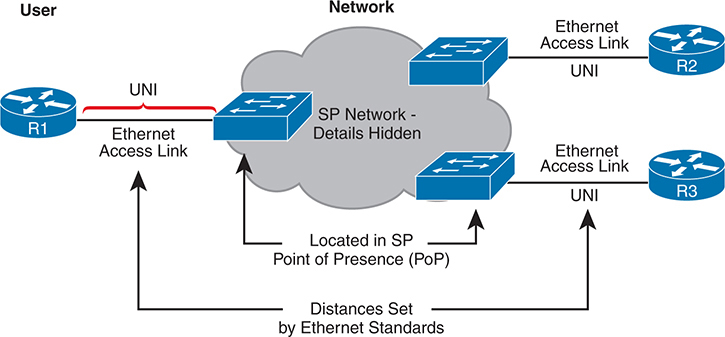

The network consists of several routers (R 1, R 2, R 3) connected via Ethernet access links to the S P network, whose internal details are hidden. Router R 1, representing the user, is connected to the S P network via an Ethernet access link. The connection point at the user's side is labeled as User Network Interface (U N I). The S P network is represented by a cloud, indicating its complex and abstract nature. The Ethernet access links connect from the user's U N I to the S P network, where they interface with the S P's equipment located at the Point of Presence (P o P). The connections from the S P network to routers R 2 and R 3 are also via Ethernet access links and U N Is, completing the network configuration. The distances for these Ethernet links are determined by Ethernet standards.

**Figure 19-2** *Ethernet Access Links into a Metro Ethernet Service*

SPs generally refer to any link that connects the customer and SP as an [access link](vol2_gloss.xhtml#gloss_019), so when using Metro Ethernet, the link is an *Ethernet access link.* Everything on that link falls within the definition of the *user network interface*, or UNI. Breaking down the term *UNI*, the word *network* refers to the SP's network, while the SP's customer (the enterprise) is known as the *user* of the network.

The SP's network remains hidden from the customer, as depicted in the center of [Figure 19-2](vol2_ch19.xhtml#ch19fig02). The SP promises to deliver Ethernet frames across the WAN. As you can imagine, the switch will look at the Ethernet header's MAC address fields and 802.1Q trunking headers for VLAN tags, but the details inside the network remain hidden.

The UNI supports any IEEE Ethernet standard. [Table 19-2](vol2_ch19.xhtml#ch19tab02) lists some standards you might expect to see used as Ethernet access links, given their support of longer distances than the standards that use UTP cabling.

**Table 19-2** IEEE Ethernet Standards Useful for Metro Ethernet Access

| Name | Speed | Distance |
| --- | --- | --- |
| 100BASE-LX10 | 100 Mbps | 10 Km |
| 1000BASE-LX | 1 Gbps | 5 Km |
| 1000BASE-LX10 | 1 Gbps | 10 Km |
| 1000BASE-ZX | 1 Gbps | 100 Km |
| 10GBASE-LR | 10 Gbps | 10 Km |
| 10GBASE-ER | 10 Gbps | 40 Km |

#### Ethernet WAN Services and Topologies

Beyond adding a physical Ethernet connection from each site into the SP's Metro [Ethernet WAN](vol2_gloss.xhtml#gloss_135) service, the enterprise must choose between several possible variations of MetroE services. Those variations use different topologies that meet different customer needs.

MEF ([www.mef.net](http://www.mef.net)) defines the standards for Metro Ethernet, including the specifications for different MetroE services. [Table 19-3](vol2_ch19.xhtml#ch19tab03) lists three service types described in this chapter and their topologies.

**Table 19-3** Three MEF Service Types and Their Topologies

| MEF Service Name | MEF Short Name | Topology Terms | Description |
| --- | --- | --- | --- |
| Ethernet Line Service | E-Line | [Point-to-point](vol2_gloss.xhtml#gloss_252) | Two customer premise equipment (CPE) devices can exchange Ethernet frames, similar in concept to a leased line. |
| Ethernet LAN Service | E-LAN | [Full mesh](vol2_gloss.xhtml#gloss_151) | This service acts like a LAN so that all devices can send frames to all other devices. |
| Ethernet Tree Service | E-Tree | [Hub and spoke](vol2_gloss.xhtml#gloss_166); [partial mesh](vol2_gloss.xhtml#gloss_243); point-to-multipoint | A central site can communicate with a defined set of remote sites, but the remote sites cannot communicate directly. |

Note

You might see the term *Virtual Private Wire Service* (VPWS) used for what MEF defines as E-Line service and *Virtual Private LAN Service* (VPLS) used for what MEF defines as E-LAN service. You might also see the term *Ethernet over MPLS* (EoMPLS). All these terms refer to cases in which the SP uses MPLS internally to create what the customer sees as an Ethernet WAN service.

##### Ethernet Line Service (Point-to-Point)

The Ethernet Line Service, or [E-Line](vol2_gloss.xhtml#gloss_127), is the simplest of the Metro Ethernet services. The customer connects two sites with access links. Then the MetroE service allows the two customer devices to send Ethernet frames to each other. [Figure 19-3](vol2_ch19.xhtml#ch19fig03) shows an example, with routers as the CPE devices.

Router R 1 and Router R 2 are connected through the Metro Ethernet network. The Metro Ethernet network is represented by a cloud, signifying its role in providing the underlying connectivity. The E V C is depicted as a dashed line running through the Metro Ethernet network, directly linking R 1 and R 2.

**Figure 19-3** *Point-to-Point Topology in Metro Ethernet E-Line Service Between Routers*

As with all MetroE services, the promise made by the service is to deliver Ethernet frames across the service, as if the two customer routers had a rather long crossover cable connected between them. The E-Line service is the same Ethernet WAN service you have seen in many examples throughout this book and *CCNA 200-301 Official Cert Guide, Volume 1*, Second Edition. For instance, in this case:

* The routers would use physical Ethernet interfaces.
* The routers would configure IP addresses in the same subnet as each other.
* Their routing protocols would become neighbors and exchange routes.

The MetroE specifications define the concept of an *Ethernet Virtual Connection*, or EVC, which defines which user (customer) devices can communicate with which. By definition, an E-Line service creates a point-to-point EVC, meaning that the service allows two endpoints to communicate.

An enterprise might want to implement a network exactly as shown in [Figure 19-3](vol2_ch19.xhtml#ch19fig03), but other variations exist. For example, think of a typical enterprise WAN topology with a central site and 100 remote sites. As shown so far, with an E-Line service, the central site router would need 100 physical Ethernet interfaces to connect to those 100 remote sites. That could be expensive. Instead, the enterprise could use a design with one high-speed Ethernet access link. [Figure 19-4](vol2_ch19.xhtml#ch19fig04) shows the design concept with just three remote sites. In this case:

* The central site router uses a single 10-Gbps access link.
* The central site connects to 100 E-Lines (only three lines shown).
* All the E-Lines send and receive frames over the same access link.

In this configuration, router R 1 is connected to a cloud representing the Metro Ethernet service. A single 10-Gigabit per second access link connects R 1 to the cloud. From the Metro Ethernet cloud, three separate dashed lines are extending to remote routers R 2, R 3, and R 4, indicating three distinct E dash Line services. Each E dash Line provides a dedicated point-to-point connection between R 1 and each remote site, ensuring isolated and direct communication paths to R 2, R 3, and R 4.

**Figure 19-4** *Using Multiple E-Lines, One for Each Remote Site*

##### Ethernet LAN Service (Full Mesh)

Imagine an enterprise needs to connect several sites to a WAN, and the goal is to allow every site to send frames directly to every other site. You could do that with E-Lines, but you would need many. For instance, to connect six sites, you need 15 E-Lines, but with 20 sites, you need 190 E-Lines. Instead, you need an any-to-any service, more like a LAN.

A MetroE *Ethernet LAN service*, or [E-LAN](vol2_gloss.xhtml#gloss_126), connects all sites in a full mesh, meeting the need for direct connectivity between all WAN sites. One E-LAN service allows all devices connected to that service to send Ethernet frames directly to every other device as if the Ethernet WAN service were one big Ethernet switch. [Figure 19-5](vol2_ch19.xhtml#ch19fig05) shows a representation of a single E-LAN EVC, allowing routers R1, R2, R3, and R4 to send frames directly to each other. All reside in the same Layer 3 subnet on the WAN.

In this configuration, routers R 1, R 2, R 3, and R 4 are connected to the Metro Ethernet cloud. Dashed lines represent the connections between the routers and the cloud, indicating that all routers have access to the Metro Ethernet service. Inside the cloud, additional dashed lines connect each pair of routers, forming a fully meshed network. This indicates that any router can communicate with any other router directly through the Metro Ethernet cloud.

**Figure 19-5** *MetroE Ethernet LAN Service—Any-to-Any Forwarding over the Service*

#### Layer 3 Design Using Metro Ethernet

How should the engineer plan for IP addresses and subnets when using Ethernet WAN services? What is the impact on routing protocols? This section answers those questions. Note that this section uses routers as the enterprise's WAN edge devices, but the concepts also apply to Layer 3 switches.

##### Layer 3 Design with E-Line Service

Every E-Line creates a point-to-point topology. For Layer 3 protocols, that results in

* One subnet per E-Line
* Routing protocol neighbor relationships occur between the two routers on the E-Line, but not between routers without an E-Line

[Figure 19-6](vol2_ch19.xhtml#ch19fig06) shows a design with two E-Lines, with IP subnetting details added. Router pairs R1-R2 and R1-R3 connect with an E-Line, but R2-R3 do not. As a result,

1. The R1-R2 E-Line uses a subnet (10.1.12.0/24 in this case).
2. The R1-R3 E-Line uses a subnet (10.1.13.0/24 in this case).
3. R1 will become a routing protocol neighbor with R2 and R3.
4. R2 and R3 will not become routing protocol neighbors or learn IP routes directly from each other.

The figure also shows router R3's IP routing table. Note that the next-hop address for all OSPF-learned routes refers to router R1's 10.1.13.1 IP address: R1's address on the other end of the R1-R3 E-Line. Look at R3's route for subnet 10.1.2.0/24, the LAN subnet connected to router R2. With no E-Line or routing protocol neighbor relationship between R2 and R3, R3 learns its route for subnet 10.1.2.0/24 from R1, with R1's 10.1.13.1 address as the next-hop address.

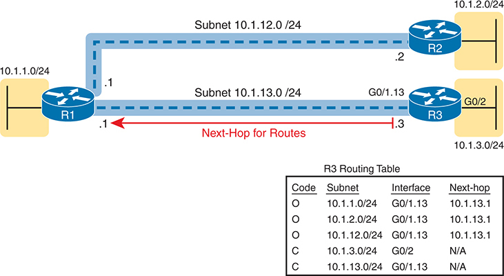

On the left, there is a router labeled R 1 connected to the subnet 10 dot 1 dot 1 dot 0 slash 24. Two blue dashed lines represent connections from R 1 to the central site routers R 2 and R 3. Router R 2, positioned on the top right, connects to the subnet 10 dot 1 dot 2 dot 0 slash 24 and has the interface G 0 slash 1 dot 12 with I P address 10 dot 1 dot 12 dot 2. Router R 3, located on the bottom right, connects to the subnet 10 dot 1 dot 3 dot 0 slash 24 and has the interface G 0 slash 1 dot 13 with I P address 10 dot 1 dot 13 dot 3. The red arrow labeled Next-Hop for Routes points from R 3 to R 1's interface G 0 slash 1 dot 13 with I P address 10 dot 1 dot 13 dot 1. Below the diagram, there is a routing table for R 3 showing various routes: 10 dot 1 dot 1 dot 0 slash 24, 10 dot 1 dot 2 dot 0 slash 24, and 10 dot 1 dot 3 dot 0 slash 24, along with their respective interfaces and next-hop addresses, indicating how R 3 forwards packets to the appropriate next-hop based on the destination subnet.

**Figure 19-6** *Layer 3 Forwarding Between Remote Sites—Through Central Site*

##### Layer 3 Design with E-LAN Service

Typically, with four routers connected to the same LAN switch, on the same VLAN, using the same routing protocol, normally all four routers would have IP addresses in the same subnet, and all would become neighbors. The same IP addressing and routing protocol relationships occur with an E-LAN service. [Figure 19-7](vol2_ch19.xhtml#ch19fig07) shows an example with four routers connected to an E-LAN service, all with addresses in subnet 10.1.99.0/24.

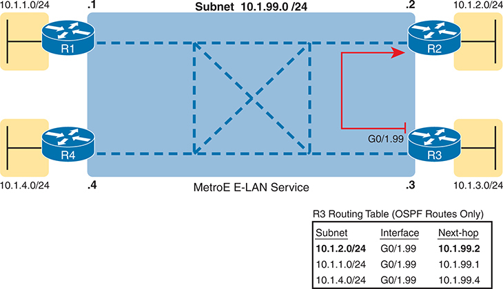

Four routers are depicted, forming a rectangular topology. Router R 1 on the top left connects to the subnet 10 dot 1 dot 1 dot 0 slash 24, router R 2 on the top right connects to the subnet 10 dot 1 dot 2 dot 0 slash 24, router R 3 on the bottom right connects to the subnet 10 dot 1 dot 3 dot 0 slash 24, and router R 4 on the bottom left connects to the subnet 10 dot 1 dot 4 dot 0 slash 24. These routers are interconnected through a blue shaded area representing the MetroE E dash L A N service, which provides a fully meshed network. A red arrow indicates a specific link from R 2's interface G 0 slash 1 dot 99 with I P address 10 dot 1 dot 99 dot 2 to R 3. Below the diagram, there is a routing table for R 3 listing Open Shortest Path First (O S P F) routes: 10 dot 1 dot 2 dot 0 slash 24, 10 dot 1 dot 1 dot 0 slash 24, and 10 dot 1 dot 4 dot 0 slash 24, with the corresponding interfaces and next-hop addresses, showing how R 3 forwards traffic to the designated next-hop within the E dash L A N service.

**Figure 19-7** *Layer 3 Forwarding Between Sites with E-LAN Service*

To show the differences in IP routing when using an E-LAN service, focus on R3's route to R2's LAN subnet (10.1.2.0/24). In this case, R3's next-hop address is the WAN address on R2 (10.1.99.2), and R3 will send packets directly to R2. Note also that the other two routes in the routing table list the next-hop addresses of R1 (10.1.99.1) and R4 (10.1.99.4), showing an example of routers sending packets directly to each other over the WAN.

### Multiprotocol Label Switching (MPLS)

From your CCNA preparation so far, you already understand much about Layer 3 routing, as represented by the packet flowing left to right in [Figure 19-8](vol2_ch19.xhtml#ch19fig08). Each router makes a separate forwarding decision to forward the packet, as shown in steps 1, 2, and 3 in the figure. Each router compares the packet's destination IP address and that router's IP routing table; the matching IP routing table entry tells the router where to forward the packet next. The routers typically run some routing protocol to learn those routes.

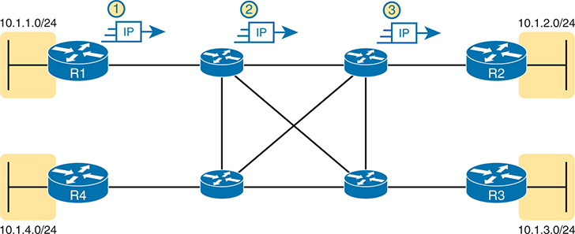

The network includes four routers, labeled R 1, R 2, R 3, and R 4, arranged in a mesh topology with multiple interconnecting links. The routers are connected to different subnets, which are indicated by shaded yellow areas. Router R 1 is connected to Subnet 10 dot 1 dot 1 dot 0 slash 24. Router R 2 is connected to Subnet 10 dot 1 dot 2 dot 0 slash 24. Router R 3 is connected to Subnet 10 dot 1 dot 3 dot 0 slash 24. Router R 4 is connected to Subnet 10 dot 1 dot 4 dot 0 slash 24. The diagram shows the flow of I P packets across the network, labeled with steps 1, 2, and 3: In step 1, an I P packet is sent from the subnet connected to R 1, indicated by an arrow pointing from the subnet to R 1. In step 2, the packet is routed through an intermediary router, moving from R 1 to the central router in the mesh. In step 3, the packet is routed to its final destination, reaching the subnet connected to R 2. The directional arrows and I P packet symbols clearly depict the path taken by the packets as they are routed from one subnet to another through the interconnected routers, demonstrating the basic principles of I P routing.

**Figure 19-8** *Basic IP Routing of IP Packets*

MPLS creates a WAN service that routes IP packets between customer sites. The enterprise deploys routers and switches as usual. The SP then creates its IP network, spanning a large geographic area. The customer can then connect to the MPLS network, with an access link from each site, with the SP routing IP packets from one customer site to the other. For instance, in [Figure 19-8](vol2_ch19.xhtml#ch19fig08), the middle four routers could represent the SP's MPLS network, with the numbered routers on the edges owned by one company.

However, an SP cannot just build a large IP network and connect all its customers to that same IP network using only the same IP routing rules you have learned so far. For instance, many customers will use the same private IP network (for example, network 10.0.0.0), so the SP's IP network would learn large numbers of routes to overlapping subnets. The SP's routers would be confused as to where to forward packets.

To overcome this and other issues, the SP builds its IP network to use [Multiprotocol Label Switching (MPLS)](vol2_gloss.xhtml#gloss_218), particularly [MPLS VPNs](vol2_gloss.xhtml#gloss_213). MPLS VPNs allow the SP to make one extensive MPLS network, creating a private IP-based WAN, but it keeps the IP routes separate for each customer. With MPLS VPNs, the SP can separate the routes learned from one customer from those learned for the next customer; consequently, the SP can support each customer while preventing packets from leaking from one customer to the next.

To give you a little insight into why MPLS is not just an IP network with routers, internally, the devices in an MPLS network use label switching—hence, the name MPLS. The routers on the edge of the MPLS network add and remove an MPLS header to packets as they enter and exit the MPLS network. The devices inside the MPLS network then use the label field inside that MPLS header when forwarding data across the MPLS network. The choices of the labels to use, along with other related logic, allow the MPLS VPN to create separate VPNs to keep different customers' traffic separate.

Note

While MPLS VPNs provide a Layer 3 service to customers, MPLS itself is sometimes called a Layer 2.5 protocol because it adds the MPLS header between the data-link header (Layer 2) and the IP header (Layer 3).

As usual, the discussion of WAN services in this book ignores as much of the SP's network as possible. For instance, you do not need to know how MPLS labels work. However, because MPLS VPNs create a Layer 3 service, the customer must be more aware of what the SP does than with other WAN servers, so you need to know a few facts about how an MPLS network approaches some Layer 3 functions. In particular, the SP's MPLS VPN network

* Will build routing protocol neighbor relationships with customer routers
* Will learn customer subnets/routes with those routing protocols
* Will advertise a customer's routes with a routing protocol so that all routers connected to the MPLS VPN can learn all routes as advertised through the MPLS VPN network
* Will make decisions about MPLS VPN forwarding, including what MPLS labels to add and remove, based on the customer's IP address space and customer IP routes

As an aside, MPLS VPNs create a private network by keeping customer data separate but not by encrypting the data. Some VPN services encrypt the data, expecting that attackers might be able to receive copies of the packets. With MPLS, even though the packets for two customers may pass through the same devices and links inside the MPLS network, MPLS logic can keep the packets separate for each customer.

MPLS networks can offer Quality of Service (QoS) features as well. The MPLS provider controls their entire network. As a result, each device that forwards customer traffic can react to markings and apply different QoS features. Note that Metro Ethernet can also provide QoS services, but with different marking fields. However, Internet WANs cannot support QoS, because the Internet consists of many ISPs, and the ISP to which a company connects cannot guarantee the other ISPs will follow any particular QoS commitment.

This second of two major sections of the chapter works through the basics of MPLS, specifically MPLS VPNs. This section first looks at the design, topology, and terminology related to building the customer-facing parts of an MPLS network. It then looks at the MPLS network providing a Layer 3 service.

#### MPLS VPN Physical Design and Topology

MPLS provides a Layer 3 service, promising to forward Layer 3 packets (IPv4 and IPv6). To support that service, MPLS SPs typically use routers at the edge of the MPLS networks because routers provide the function of forwarding Layer 3 packets.

[Figure 19-9](vol2_ch19.xhtml#ch19fig09) shows two important MPLS terms in context: [customer edge (CE)](vol2_ch19.xhtml#key_251a) and [provider edge (PE)](vol2_gloss.xhtml#gloss_271). Because MPLS requires so much discussion about the devices on the edge of the customer and SP networks, MPLS uses specific terms for each. The term *customer edge* refers to a router at the customer site—that is, at a site in the company buying the MPLS service. The *provider edge* devices sit at the edge of the SP's network, on the other end of the access link.

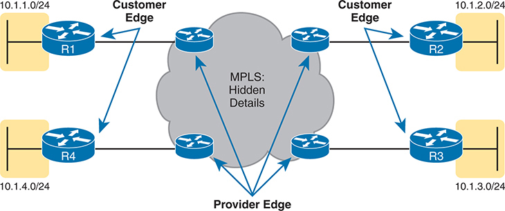

The network includes four C E routers, labeled R 1, R 2, R 3, and R 4, connected to different subnets, and multiple P E routers situated within the M P L S cloud. Router R 1 is connected to Subnet 10 dot 1 dot 1 dot 0 slash 24. Router R 2 is connected to Subnet 10 dot 1 dot 2 dot 0 slash 24. Router R 3 is connected to Subnet 10 dot 1 dot 3 dot 0 slash 24. Router R 4 is connected to Subnet 10 dot 1 dot 4 dot 0 slash 24. The M P L S cloud, labeled M P L S: Hidden Details, represents the provider's network infrastructure. The P E routers within the M P L S cloud are responsible for interfacing with the C E routers at the customer edge. Directional arrows illustrate the data flow between the C E routers and the M P L S cloud.

**Figure 19-9** *MPLS Layer 3 Design, with PE and CE Routers*

Next, to appreciate what MPLS does, think back to router de-encapsulation and re-encapsulation. When routing a packet, routers discard an incoming data-link frame's data-link header and trailer. Once the router knows the outgoing interface, it builds a new data-link header/trailer. That action allows the incoming packet to arrive inside a frame of one data-link protocol and leave out an interface with another data-link protocol. As a result, MPLS supports any data-link protocol that could be used on MPLS access links, as shown in [Figure 19-10](vol2_ch19.xhtml#ch19fig10).

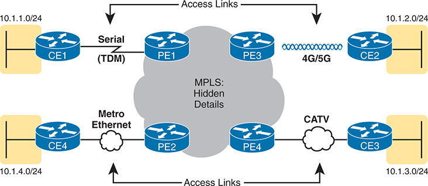

The network diagram includes four customer edge routers (C E 1, C E 2, C E 3, and C E 4) connected to four provider edge routers (P E 1, P E 2, P E 3, and P E 4) through different access link technologies. C E 1 to P E 1: Connected via a serial (T D M) link. C E 2 to P E 3: Connected via a 4 G slash 5 G wireless link. C E 3 to P E 4: Connected via a C A T V (cable T V) link. C E 4 to P E 2: Connected via a Metro Ethernet link. Each customer edge router represents a different subnet (10 dot 1 dot 1 dot 0 slash 24, 10 dot 1 dot 2 dot 0 slash 24, 10 dot 1 dot 3 dot 0 slash 24, and 10 dot 1 dot 4 dot 0 slash 24). The M P L S core is represented in the center, labeled M P L S: Hidden Details, indicating the abstraction of M P L S operations from the customer. Access links are marked, showing how various technologies connect customer sites to the M P L S network.

**Figure 19-10** *Popular MPLS Access Link Technologies*

#### Layer 3 with MPLS VPN

Because MetroE provides a Layer 2 service, the SP does not need to understand anything about the customer's Layer 3 design. The SP knows nothing about the customer's IP addressing plan and does not need to participate with routing protocols.

MPLS VPNs take the completely opposite approach. As a Layer 3 service, MPLS must know the customers' IP addressing. The SP uses routing protocols and advertises those customer routes across the WAN. This section takes a closer look at what that means.

First, keep the primary goal in mind: to deliver IP packets between sites. The CE routers must learn routes for the subnets known to all the other CE routers; however, MPLS routing protocol design creates routing protocol neighbor relationships between the CE and PE routers but not between CE routers, as seen in [Figure 19-11](vol2_ch19.xhtml#ch19fig11). MPLS supports all the standard routing protocols: RIPv2, EIGRP, OSPF, and even eBGP.

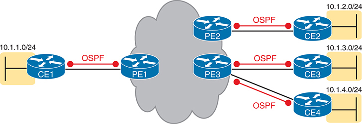

The diagram focuses on O S P F (Open Shortest Path First). C E 1 to P E 1: Connected with O S P F running between them, forming an O S P F neighbor relationship. P E 1 to P E 2: Shows a backbone M P L S connection. P E 2 to C E 2: Connected with O S P F running between them. P E 3 to C E 3: Connected with O S P F running between them. P E 4 to C E 4: Connected with O S P F running between them. Each customer edge router represents a different subnet (10 dot 1 dot 1 dot 0 slash 24, 10 dot 1 dot 2 dot 0 slash 24, 10 dot 1 dot 3 dot 0 slash 24, and 10 dot 1 dot 4 dot 0 slash 24).

**Figure 19-11** *Routing Protocol Neighbor Relationships with MPLS Customer Edge Routers*

The CE routers learn all the routes because the PE routers also exchange routes; however, the PE routers must use additional routing protocol features beyond the topics already discussed in this book. First, the MPLS SP uses a variation of BGP called [Multiprotocol BGP (MP-BGP)](vol2_gloss.xhtml#gloss_217) between the PE routers. MP-BGP provides the means for the PE routers to keep customer routes separate using virtual routing and forwarding (VRF) instances. ([Chapter 20](vol2_ch20.xhtml#ch20), "[Cloud Architecture](vol2_ch20.xhtml#ch20)," discusses VRFs in the context of data center networks.) So, the CE routers learn routes from each other.

For instance, in [Figure 19-12](vol2_ch19.xhtml#ch19fig12), for CE3 to learn routes from CE1, the process begins with CE1 advertising the routes to PE1. PE1 redistributes the routes into MP-BGP and advertises them to PE3. PE3 redistributes them into OSPF and advertises them to CE3. As a result, CE3's routes that forward packets over the MPLS WAN will list PE3's IP address as the next-hop router.

The diagram shows a network with the following components: Customer Edge (C E) Routers: C E 1 and C E 3 are customer edge routers connected to the provider edge routers. Provider Edge (P E) Routers: P E 1 and P E 3 are provider edge routers connected through the M P L S network. M P L S Network: The core M P L S network interconnects the P E routers. The connections are as follows: C E 1 connects to P E 1 using Open Shortest Path First (O S P F). P E 1 redistributes O S P F routes into M P-B G P within the M P L S network. P E 3 redistributes M P-B G P routes back into O S P F. C E 3 connects to P E 3 using O S P F.

**Figure 19-12** *MPLS VPN Using Redistribution with MP-BGP at the PE Router*

### Internet VPNs

To build the Internet, Internet service providers (ISPs) need links to other ISPs and the ISPs' customers. The Internet core connects ISPs using various high-speed technologies. Additionally, Internet access links connect an ISP to each customer, again with different technologies. The combination of ISP and customer networks that connect to the ISPs together creates the worldwide Internet.

While consumers typically connect to the Internet to reach destinations on the Internet, businesses can also use the Internet as a WAN service. First, the enterprise can connect each business site to the Internet. Then, using virtual private network (VPN) technology, the enterprise can create an Internet VPN. An Internet VPN can keep the enterprise's packet private through encryption and other means, even while sending the data over the Internet.

This final major section of the chapter discusses some of the basics of Internet access links. The section then details how an enterprise can communicate securely over the Internet, making the public Internet act like a private network by creating an Internet VPN.

#### Internet Access

Enterprises can use private WAN technology to access an ISP's network, including the Ethernet WAN and MPLS technologies discussed earlier in this chapter. [Figure 19-13](vol2_ch19.xhtml#ch19fig13) shows a visual reminder of these options.

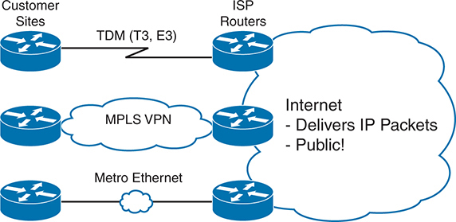

The diagram includes various network components and connection types: Customer Sites: Represented by routers at the customer premises. I S P Routers: Routers belonging to the Internet Service Provider (I S P). Internet Cloud: Depicting the public internet that delivers I P packets and is accessible to the public. The connection types illustrated are T D M (T 3, E 3): Traditional Time Division Multiplexing links connecting customer sites to I S P routers. M P L S V P N: M P L S-based V P Ns provides a secure, private connection between customer sites through the I S P network. Metro Ethernet: Ethernet-based connections provide high-speed, scalable access to the internet.

**Figure 19-13** *Three Examples of Internet Access Links for Companies*

Additionally, enterprises can also use Internet access technologies more commonly used by consumers, including DSL, cable, 4G/5G, and fiber Ethernet. The chapter includes this information about Internet access technologies to provide helpful background information before getting into VPN topics.

##### Digital Subscriber Line

Telephone companies (telcos) have offered Internet access services since the early days of the Internet via the pre-existing phone lines connecting to most homes. Originally, that access used analog modems attached to the phone lines. Later, Integrated Services Digital Network (ISDN) created faster digital services over the same phone line. The third wave of technology to use local phone lines, digital subscriber line (DSL), added more improvements, with much faster speeds.

[Figure 19-14](vol2_ch19.xhtml#ch19fig14) details how DSL works on a home phone line. The phone can do what it has always done: plug into a phone jack and send analog signals. For the data, a DSL modem connects to a spare phone outlet. The DSL modem sends and receives the data, as digital signals, at frequencies other than those used for voice, over the same local loop, even at the same time as a telephone call. (Note that the physical installation often uses frequency filters not shown in the figure or discussed here.)

On the left, the home setup includes various devices connected through a D S L modem. The D S L modem connects to a computer and a wireless router via Ethernet cables. Additionally, a phone cable links the D S L modem to a telephone wall jack. From the home, a telephone line runs to the Telco Central Office (C O) on the right side of the diagram. At the Telco C O, the telephone line connects to a D S L A M (Digital Subscriber Line Access Multiplexer), which splits the voice and data signals. The voice signals are directed to a Voice Switch that connects to the P S T N (Public Switched Telephone Network), while the data signals are sent to the Internet.

**Figure 19-14** *Wiring and Devices for a Home DSL Link*

Because DSL sends analog (voice) and digital (data) signals on the same line, the telco has to somehow split those signals on the telco side of the connection. The local loop connects to a *DSL access multiplexer* (DSLAM) in the nearby telco central office (CO). The DSLAM splits the digital data over to the router on the lower right in [Figure 19-14](vol2_ch19.xhtml#ch19fig14), completing the Internet connection. The DSLAM also splits out the analog voice signals over to the voice switch on the upper right.

##### Cable Internet

DSL uses the local link (telephone line) from the local telco. Cable Internet instead uses the cabling from what has become the primary competitor to the telco in most markets: the cable company.

Cable Internet creates an Internet access service that, when viewed generally rather than specifically, has many similarities to DSL. Like DSL, cable Internet takes full advantage of existing cabling, using the existing cable TV (CATV) cable to send data. Like DSL, cable Internet uses asymmetric speeds, sending data faster downstream than upstream, which works well for most consumer locations. And cable Internet still allows the original service (cable TV) while adding Internet access service.

Cable Internet uses CATV cabling but the same general model as telco with phone lines and DSL. The left side of [Figure 19-15](vol2_ch19.xhtml#ch19fig15) shows a TV connected to the CATV cabling, just as it would normally connect. At another cable outlet, a cable modem connects to the same cable. The Internet service flows over one frequency, like another TV channel, just reserved for Internet service.

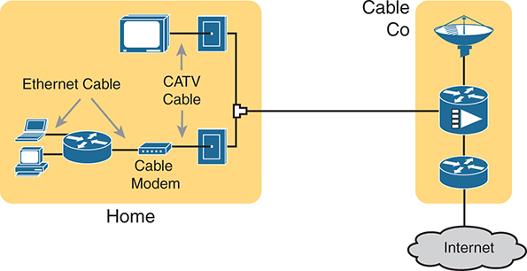

On the left, the home setup includes various devices connected through a cable modem. The cable modem connects to a computer and a wireless router via Ethernet cables. Additionally, a C A T V (Cable Television) cable links the cable modem to a television and a wall jack. From the home, a C A T V cable runs to the Cable Company (Cable Co) on the right side of the diagram. At the Cable Co, the C A T V cable connects to network devices that manage the distribution of the internet and television services. The data signals are routed to the Internet through these devices.

**Figure 19-15** *Wiring and Devices for a Home Cable Internet Link*

Similar to DSL, on the CATV company side of the connection (on the right side of the figure), the CATV company must split out the data and video traffic. Data flows to the lower right, through a router, to the Internet. The video comes in from video dishes for distribution to the TVs in people's homes.

##### Wireless WAN (4G, 5G)

Many of you reading this book have a mobile phone with Internet access. You can use your phone to check your email, surf the web, download apps, and watch videos. This section touches on the big concepts behind the Internet access technology connecting those mobile phones.

Mobile phones use radio waves to communicate through a nearby mobile phone tower. The phone has a small radio antenna, and the provider has a much larger one sitting at the top of a tower within miles of you and your phone. Phones, tablet computers, laptops, and even routers (with the correct interface cards) can communicate through the Internet using this technology, as represented in [Figure 19-16](vol2_ch19.xhtml#ch19fig16).

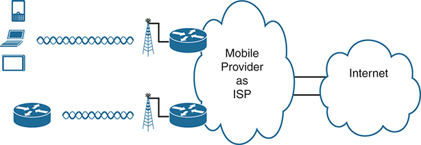

On the left, three types of devices are shown: a smartphone, a laptop, and a tablet, indicating various user equipment. These devices are connected wirelessly, represented by wavy lines, to cellular towers equipped with antennas. Each cellular tower is connected to a router, which is part of the mobile provider's infrastructure. The routers then connect to a cloud labeled Mobile Provider as I S P, symbolizing the mobile service provider acting as the Internet Service Provider. From the mobile provider's cloud, the connection extends to another cloud labeled Internet, representing the global internet. This setup demonstrates how devices use cellular networks to connect to the internet via the mobile provider's infrastructure.

**Figure 19-16** *Wireless Internet Access Using 3G/4G/5G Technology*

The mobile phone radio towers also have cabling and equipment, including routers. The mobile provider builds its IP network much like an ISP builds an IP network. The customer IP packets pass through the IP router at the tower into the mobile provider's IP network and then out to the Internet.

The market for mobile phones and wireless Internet access for other devices is large and competitive. As a result, mobile providers spend a lot of money advertising their services, with lots of names for one service or the other. Frankly, it can be difficult to tell what all the marketing jargon means, but the industry uses many of these terms:

**Wireless Internet:** This general term refers to Internet services from a mobile phone or any device that uses the same technology.

**1G/2G/3G Wireless:** Short for the first, second, and third generations of mobile phone access networks, which have come and gone from the market. (For perspective, note that the major carriers in the USA shut down their 3G services in 2022.)

**4G and 4G LTE Wireless:** Short for fourth generation, 4G improved both upload and download data rates versus 3G. 4G refers to the entire standard, but over time, the term *Long-Term Evolution (LTE)* came to refer to improved 4G.

**5G Non-standalone (NSA) Wireless (sub-6):** 5G refers to the fifth generation of wireless WAN technologies. 5G Non-standalone (NSA) refers to a subset of the 5G standard that works with the older 4G LTE network (hence non-standalone), with similar characteristics to 4G LTE, but with improvements in speed and latency. It also goes by sub-6 because it uses frequencies just beneath 6 GHz.

**5G Standalone (SA) Wireless (mmWave):** A higher performance part of the 5G standards, 5G standalone (SA) offers much faster data rates than 5G NSA. However, 5G SA works over shorter distances than 5G NSA, requiring more antennas to cover the same geographical footprint. 5G SA also goes by the name millimeter Wave (mmWave), because the wavelengths of the signals happen to be millimeters long.

The takeaway from all this jargon is this: when you hear about wireless Internet services with a mobile phone tower in the picture—whether the device is a phone, tablet, or PC—it is probably a 4G or 5G wireless Internet connection.

Enterprises can use this same wireless technology to connect to the Internet. For instance, a network engineer can install a 5G wireless card in a router. ISPs team with wireless operators to create contracts for wireless and Internet service.

##### Fiber (Ethernet) Internet Access

The consumer-focused Internet access technologies discussed in this section use a couple of different physical media. DSL uses the copper wiring installed between the telco CO and the home. Cable uses the copper CATV cabling installed from the cable company to the home. And, of course, wireless WAN technologies do not use cables for Internet access.

The cabling used by DSL and cable Internet uses copper wires, but, comparing different types of physical media, fiber-optic cabling generally supports faster speeds for longer distances. That is, just comparing physical layer technologies across the breadth of networking, fiber-optic cabling supports longer links, and those links often run at equivalent or faster speeds.

Some ISPs now offer Internet access that goes by the name *fiber Internet*, or simply *fiber*. To make that work, some local company that owns the rights to install cabling underground in a local area (often a telephone company) installs new fiber-optic cabling. Once the cable plant is in place (a process that often takes years and a large budget), the fiber ISP connects customers to the Internet using the fiber-optic cabling. Often not stated, the SP uses Ethernet protocols over the fiber. The result is high-speed Internet to the home.

#### Internet VPN Fundamentals

Private WANs have some wonderful security features. In particular, the customers who send data through the WAN have good reason to believe that no attackers saw the data in transit or even changed the data to cause some harm. The private WAN service provider promises to send one customer's data to other sites owned by that customer but not to sites owned by other customers, and vice versa.

VPNs try to provide the same secure features as a private WAN while sending data over a network open to other parties (such as the Internet). Compared to a private WAN, the Internet does not provide a secure environment that protects the privacy of an enterprise's data. Internet VPNs provide essential security features, such as

* **Confidentiality (privacy):** Preventing anyone in the middle of the Internet (man in the middle) from being able to read the data
* **Authentication:** Verifying that the sender of the VPN packet is a legitimate device and not a device used by an attacker
* **Data integrity:** Verifying that nothing changed the packet as it transited the Internet
* **Anti-replay:** Preventing a man in the middle from copying packets sent by a legitimate user, so they can later send those packets and appear to be that legitimate user

To accomplish these goals, two devices near the edge of the Internet create a VPN, sometimes called a *VPN tunnel*. These devices add headers to the original packet, with these headers including fields that allow the VPN devices to make the traffic secure. The VPN devices also encrypt the original IP packet, meaning that its contents are undecipherable to anyone who examines a copy of the packet as it traverses the Internet.

[Figure 19-17](vol2_ch19.xhtml#ch19fig17) shows a VPN between branch office router R1 and a Cisco firewall (FW1). By definition, a VPN that connects two sites to support traffic from all hosts at those sites goes by the name [site-to-site VPN](vol2_gloss.xhtml#gloss_308).

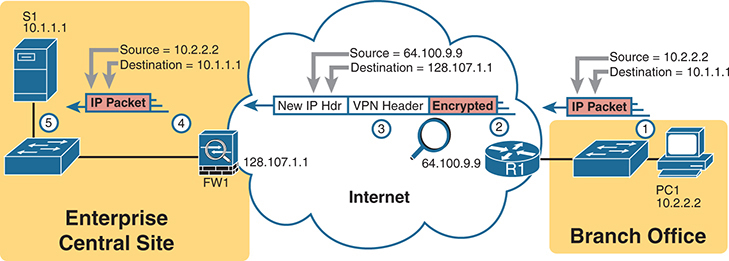

On the left, there is an Enterprise Central Site depicted in a yellow box, featuring a server labeled S 1 with I P address 10 dot 1 dot 1 dot 1 and a firewall labeled F W 1 with I P address 128 dot 107 dot 1 dot 1. An I P packet with the source I P 10 dot 2 dot 2 dot 2 and destination I P 10 dot 1 dot 1 dot 1 is shown leaving the central site. This packet is encapsulated with a new I P header and a V P N header, then encrypted for secure transmission over the internet. The encrypted packet travels through the internet, indicated by a cloud labeled Internet with a new source I P 64 dot 100 dot 9 dot 9 and destination I P 128 dot 107 dot 1 dot 1. On the right side, there is a Branch Office depicted in another yellow box, featuring a P C labeled P C 1 with I P address 10 dot 2 dot 2 dot 2 and a router labeled R 1 with I P address 64 dot 100 dot 9 dot 9. The encrypted packet is decrypted by the router R 1, and the original I P packet with the source I P 10 dot 2 dot 2 dot 2 and destination I P 10 dot 1 dot 1 dot 1 is delivered to the P C 1. This illustration shows how a V P N tunnel securely connects two remote sites over the internet, allowing private communication between the central site and the branch office.

**Figure 19-17** *VPN Tunnel Concepts for a Site-to-Site Intranet VPN*

The figure shows the following steps, which explain the overall flow:

1. Host PC1 (10.2.2.2) on the right sends a packet destined for the web server (10.1.1.1), just as it would without a VPN.
2. Router R1 encrypts the packet, adds some VPN headers, adds another IP header (with public IP addresses), and forwards the packet, as shown in the upper-center of the figure.
3. Even if an attacker in the Internet copied the packet (called a man-in-the-middle attack), they could not change the packet without being noticed. The attacker also cannot read the contents of the original packet.
4. Firewall FW1 receives the packet, confirms the sender's authenticity, confirms no changes occurred in the packet, and decrypts the original packet. FW1 then forwards the original packet to the web server.
5. Server S1 receives the unencrypted packet.

Internet-based VPNs give enterprises great options for WAN servers. High-speed Internet access often costs less than private WAN access links. The Internet is seemingly everywhere, making this kind of solution available worldwide. If the enterprise uses VPN technology and protocols, the communications are secure.

Note

The term *tunnel* refers to any protocol's packet that is sent by encapsulating the packet inside another packet. The term *VPN tunnel* may or may not imply that the tunnel also uses encryption.

##### Site-to-Site VPNs with IPsec

A site-to-site VPN provides VPN services for the devices at two sites with a single VPN tunnel. For instance, if each site has dozens of devices that need to communicate between sites, the various devices do not have to act to create the VPN. Instead, the network engineers configure devices such as routers and firewalls to create one VPN tunnel. The tunnel remains up and operating all the time, so it is always available when end-user devices send data. All the endpoint devices at each site can communicate using the VPN, unaware of the VPN, without needing to create a VPN for themselves.

[IPsec](vol2_gloss.xhtml#gloss_182) defines one popular set of rules for creating secure VPNs. IPsec is an architecture or framework for security services for IP networks. The name derives from the title of the RFC that defines it (RFC 4301, "Security Architecture for the Internet Protocol"), more generally called IP Security, or IPsec.

IPsec defines how two devices, both of which connect to the Internet, can achieve the main goals of a VPN, as listed at the beginning of this section: confidentiality, authentication, data integrity, and anti-replay. IPsec does not define just one way to implement a VPN but allows several different protocol options for each feature. IPsec provides a solid architectural VPN framework by allowing for changes and improvements to individual security functions over time.

IPsec encryption might sound intimidating, but if you ignore the math—and thankfully, you can—IPsec encryption is not too difficult to understand. IPsec encryption uses a pair of encryption algorithms, essentially math formulas, to meet a couple of requirements. First, the two math formulas are a matched set:

* One to hide (encrypt) the data
* Another to re-create (decrypt) the original data based on the encrypted data

The choice of encryption and decryption formulas helps thwart attackers. For instance, if an attacker intercepted the encrypted packet but did not have the secret password (called an *encryption key*), the attacker could only decrypt the packet through great effort. Also, if an attacker happened to decrypt one packet, the formulas also give them no insights in how they might decrypt a second packet.

The process for encrypting data for an IPsec VPN works generally as shown in [Figure 19-18](vol2_ch19.xhtml#ch19fig18). Note that the *encryption key* is also known as the *session key*, [shared key](vol2_gloss.xhtml#gloss_306), or *shared session key*.

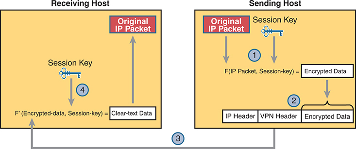

The diagram is divided into two main sections: the Sending Host on the right and the Receiving Host on the left. Sending Host: The original I P packet is prepared with a session key, which is a crucial part of the encryption process. The session key encrypts the original I P packet, resulting in encrypted data. The resulting packet consists of the I P header, a V P N header, and the encrypted data. The encrypted packet is then sent over the network to the receiving host, depicted by a gray arrow labeled step 3. Receiving Host: Upon receiving the encrypted packet, the receiving host uses the session key to decrypt the data. The encrypted packet (F(I P Packet, Session-key)) is transformed back into clear-text data.

**Figure 19-18** *Basic IPsec Encryption Process*

The four steps highlighted in the figure are as follows:

1. The sending VPN device (router R1 in [Figure 19-17](vol2_ch19.xhtml#ch19fig17)) feeds the original packet and the session key into the encryption formula, calculating the encrypted data.
2. The sending device encapsulates the encrypted data into a packet, which includes the new IP header and VPN header.
3. The sending device sends this new packet to the destination VPN device (FW1 back in [Figure 19-17](vol2_ch19.xhtml#ch19fig17)).
4. The receiving VPN device runs the corresponding decryption formula using the encrypted data and session key—the same key value used on the sending VPN device—to decrypt the data.

While [Figure 19-18](vol2_ch19.xhtml#ch19fig18) shows the basic encryption process, [Figure 19-19](vol2_ch19.xhtml#ch19fig19) shows a broader view of an Enterprise IPsec VPN. Devices use some related VPN technology like Generic Routing Encapsulation (GRE) to create the concept of a tunnel (a virtual link between the routers), with three such tunnels shown in the figure. The router configuration then adds IPsec security features to the data that flows over the tunnel. (Note that the figure shows IPsec and GRE, but IPsec teams with other VPN technologies as well.)

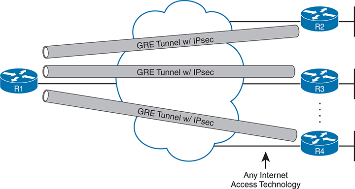

The network includes four routers, labeled R 1, R 2, R 3, and R 4, interconnected via G R E tunnels with I P sec. R 1: The initiating router on the left side of the network, connected to the other routers via G R E tunnels. R 2, R 3, R 4: The destination routers on the right side of the network, each connected to R 1 through separate G R E tunnels with I P sec. The G R E tunnels are represented as gray cylindrical tubes, with I P sec encryption providing additional security. The diagram highlights the use of any internet access technology to establish these connections, emphasizing the flexibility of the V P N setup. The cloud symbol in the center represents the internet, through which the G R E tunnels are established. The diagram clearly shows the secure communication paths between R 1 and the other routers, ensuring that data is encrypted and securely transmitted over the internet.

**Figure 19-19** *Site-to-Site VPN Tunnels with GRE and IPsec*

##### Remote Access VPNs with IPsec

A site-to-site VPN exists to support multiple devices at each site, with the IT staff creating a permanent VPN connection to support all users. In contrast, user devices can dynamically initiate VPN connections in cases where a permanent site-to-site VPN does not exist. Such a VPN connection, terminated by and initiated from the end-user device, is called a [remote access VPN](vol2_gloss.xhtml#gloss_287).

For instance, a user can walk into a coffee shop and connect to the free Wi-Fi with a tablet or laptop, but that coffee shop does not have a site-to-site VPN to the user's enterprise network. Instead, software on the endpoint device creates a secure VPN connection back to the enterprise network, as shown in [Figure 19-20](vol2_ch19.xhtml#ch19fig20).

On the left, a device labeled A represents the client using Cisco Secure Client. This client connects to the internet, represented by a cloud. A tunnel labeled I P sec (For All Traffic to the Enterprise) extends from the client through the internet to a firewall. The firewall is connected to two web servers, labeled S 1 and S 2, on the right side of the image. This setup shows how all traffic from the client to the enterprise network is encrypted using I P sec, providing secure communication through the V P N tunnel.

**Figure 19-20** *IPsec Remote Access IPsec VPN*

Many companies use the remote access VPN model in the figure for employees doing remote work, connecting from their home, a hotel, or any off-site location. The company can choose whether to use IPsec or Transport Layer Security [(TLS)](vol2_gloss.xhtml#gloss_343) to secure the traffic.

To support all traffic sent by the computer, the end-user device requires VPN client software. The networking staff also installs and configures a device to act as a VPN concentrator, defining whether to use TLS or IPsec. Employee devices then connect to the VPN concentrator. While routers can play that role, companies typically use firewall products.

Note

For many years, Cisco branded its VPN client software as the Cisco AnyConnect Secure Mobility Client. Cisco has replaced that product with the [Cisco Secure Client (Including AnyConnect)](vol2_gloss.xhtml#gloss_073). See [www.cisco.com/go/secureclient](http://www.cisco.com/go/secureclient) for more info.

IPsec works a little differently when used for remote access versus site-to-site VPNs. [IPsec tunnel mode](vol2_gloss.xhtml#gloss_184) is used for site-to-site encryption, which encrypts the entire original packet. [IPsec transport mode](vol2_gloss.xhtml#gloss_183) is used for remote access VPNs, which encrypts the data of the original IP packet—that is, everything after the IP header—but not the IP header itself. [Figure 19-21](vol2_ch19.xhtml#ch19fig21) shows a visual comparison of the two modes.

Tunnel Mode: On the left side, an original packet with I P and Data is shown. In tunnel mode, a new I P header is added, and the entire original packet (including the original I P header and data) is encrypted. The diagram shows the original packet encapsulated within a new I P header and an I P sec header, with the original packet highlighted in grey to indicate encryption. Transport Mode: On the right side, the original packet with I P and Data is shown. In transport mode, the original I P header remains intact, and only the payload (data) and part of the original I P header are encrypted. The diagram shows the original I P header followed by the I P sec header and the data, with only the I P sec and data portions highlighted in grey to indicate encryption.

**Figure 19-21** *IPsec Tunnel and Transport Mode—What Is Encrypted*

Site-to-site and remote access IPsec VPNs also have other differences, given their different roles. [Table 19-4](vol2_ch19.xhtml#ch19tab04) summarizes the differences for easier study.

**Table 19-4** Comparisons of Site-to-Site and Remote Access IPsec VPNs

| Attribute | Site-to-Site IPsec VPN | Remote Access IPsec VPN |
| --- | --- | --- |
| Does the end-user device need VPN client software? | No | Yes |
| Devices supported by one VPN: one or many | Many | One |
| Typical use: on-demand or permanent | Permanent | On-demand |
| Does the VPN use IPsec tunnel mode? | Yes | No |
| Does the VPN use IPsec transport mode? | No | Yes |

##### Remote Access VPNs with TLS

While the exam topics specifically mention IPsec VPNs, VPN technologies include many protocols beyond IPsec. This final topic discusses one that most people use every day: Transport Layer Security, or TLS.

For most websites today, when you connect, your browser uses HTTPS (RFC 9110), which secures the HTTP protocol. HTTPS secures HTTP by using TLS (RFC 8446).

The world has migrated away from HTTP to HTTPS. Just look at most URIs you see in your web browser: they all start with HTTPS. As a result, a browser completes the secure connection using HTTPS, which uses TLS, before connecting to the site.

When opening a new web page, the browser creates a TCP connection to well-known port 443 (default) and then initializes a TLS session. TLS encrypts data sent between the browser and the server (application layer header and data—but not the IP or TCP header) while authenticating the user. Then the HTTPS messages flow over the TLS VPN connection.

Note

In years past, Secure Sockets Layer (SSL) played the same role as TLS. SSL has been deprecated (see RFC 7568) and replaced by TLS.

In its most common use, TLS creates a host-to-host secure connection between one client's web browser and one web server. If you open a web browser tab and connect to a website, your browser creates a TLS connection to that server. Open more browser tabs, and your browser creates additional TLS host-to-host connections, all secured with TLS. TLS can also be used for remote access VPNs. For instance, the Cisco Secure Client can use TLS when connecting to a firewall, supporting all traffic sent by that host. [Figure 19-22](vol2_ch19.xhtml#ch19fig22) shows both.

The diagram includes two clients, labeled A and B, connected to web servers (S 1 and S 2) through the internet and a firewall. Client A uses Cisco Secure Client (formerly AnyConnect), which establishes a T L S tunnel for all traffic directed to the enterprise network. This secure tunnel ensures that all data transmitted between Client A and the enterprise is encrypted and protected. Client B uses a web browser to establish an H T T P S session (also utilizing T L S) for a single web browsing session. This method encrypts the data specific to the web browser session, providing security for that particular interaction with the web servers. Both clients connect to the internet, which routes their traffic to the enterprise firewall. The firewall controls access to the web servers (S 1 and S 2), ensuring that only authorized traffic can reach the enterprise network.

**Figure 19-22** *Remote Access VPN Options (TLS)*

### Chapter Review

One key to doing well on the exams is to perform repetitive spaced review sessions. Review this chapter's material using either the tools in the book or interactive tools for the same material found on the book's companion website. Refer to the "[Your Study Plan](vol2_appf.xhtml#appf)" element for more details. [Table 19-5](vol2_ch19.xhtml#ch19tab05) outlines the key review elements and where you can find them. To better track your study progress, record when you completed these activities in the second column.

**Table 19-5** Chapter Review Tracking

| Review Element | Review Date(s) | Resource Used |
| --- | --- | --- |
| Review key topics |  | Book, website |
| Review key terms |  | Book, website |
| Answer DIKTA questions |  | Book, PTP |
| Review memory tables |  | Book, website |

### Review All the Key Topics

**Table 19-6** Key Topics for [Chapter 19](vol2_ch19.xhtml#ch19)

| Key Topic Element | Description | Page Number |
| --- | --- | --- |
| [Figure 19-2](vol2_ch19.xhtml#ch19fig02) | Metro Ethernet terminology in context | [417](vol2_ch19.xhtml#page_417) |
| [Table 19-3](vol2_ch19.xhtml#ch19tab03) | MetroE service types per MEF | [418](vol2_ch19.xhtml#page_418) |
| [Figure 19-5](vol2_ch19.xhtml#ch19fig05) | MetroE Ethernet LAN (E-LAN) service concept | [420](vol2_ch19.xhtml#page_420) |
| List | Ideas about customer Layer 3 addressing and what an MPLS VPN provider needs to know | [423](vol2_ch19.xhtml#page_423) |
| [Figure 19-9](vol2_ch19.xhtml#ch19fig09) | MPLS terminology in context | [424](vol2_ch19.xhtml#page_424) |
| [Figure 19-19](vol2_ch19.xhtml#ch19fig19) | Concepts of site-to-site VPNs with IPsec and GRE | [433](vol2_ch19.xhtml#page_433) |
| [Figure 19-20](vol2_ch19.xhtml#ch19fig20) | IPsec remote access VPN | [433](vol2_ch19.xhtml#page_433) |
| [Table 19-4](vol2_ch19.xhtml#ch19tab04) | Comparisons of site-to-site and remote access VPNs | [434](vol2_ch19.xhtml#page_434) |
| [Figure 19-22](vol2_ch19.xhtml#ch19fig22) | Concepts of remote access VPNs with TLS | [435](vol2_ch19.xhtml#page_435) |

### Key Terms You Should Know

[access link](vol2_ch19.xhtml#key_249)

[Cisco Secure Client (including AnyConnect)](vol2_ch19.xhtml#key_250)

[customer edge (CE)](vol2_ch19.xhtml#key_251)

[E-LAN](vol2_ch19.xhtml#key_252)

[E-Line](vol2_ch19.xhtml#key_253)

[Ethernet WAN](vol2_ch19.xhtml#key_254)

[full mesh](vol2_ch19.xhtml#key_255)

[hub and spoke](vol2_ch19.xhtml#key_256)

[IPsec](vol2_ch19.xhtml#key_257)

[IPsec transport mode](vol2_ch19.xhtml#key_258)

[IPsec tunnel mode](vol2_ch19.xhtml#key_259)

[Metro Ethernet](vol2_ch19.xhtml#key_260)

[MPLS VPN](vol2_ch19.xhtml#key_261)

[Multiprotocol BGP (MP-BGP)](vol2_ch19.xhtml#key_262)

[Multiprotocol Label Switching (MPLS)](vol2_ch19.xhtml#key_263)

[partial mesh](vol2_ch19.xhtml#key_264)

[point-to-point](vol2_ch19.xhtml#key_265)

[point of presence (PoP)](vol2_ch19.xhtml#key_266)

[provider edge (PE)](vol2_ch19.xhtml#key_267)

[remote access VPN](vol2_ch19.xhtml#key_268)

[service provider (SP)](vol2_ch19.xhtml#key_269)

[shared key](vol2_ch19.xhtml#key_270)

[site-to-site VPN](vol2_ch19.xhtml#key_271)

[TLS](vol2_ch19.xhtml#key_272)