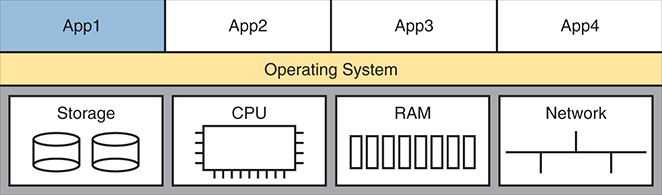
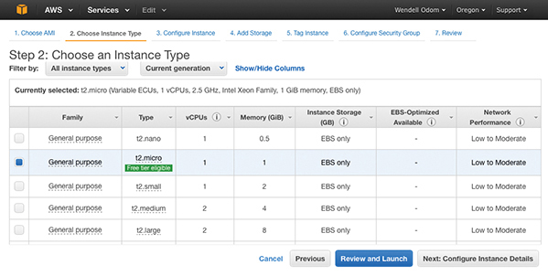

# Chapter 20


## Cloud Architecture

This chapter covers the following exam topics:

1.0 Network Fundamentals

1.1 Explain the role and function of network components

1.1.g Servers

1.2 Describe the characteristics of network topology architectures

1.2.f On-premises and cloud

1.12 Explain virtualization fundamentals (server virtualization, containers, and VRFs)

Cloud computing is an approach to offering IT services to customers. However, cloud computing is not a product, a set of products, a protocol, or any single thing. So, while there are accepted descriptions and definitions of cloud computing today, it takes a broad knowledge of IT beyond networking to know whether a particular IT service is or is not worthy of being called a cloud computing service.

To categorize an IT service as a cloud computing service, it should have these characteristics: It can be requested on-demand; it can dynamically scale (that is, it is elastic); it uses a pool of resources; it has a variety of network access options; and it can be measured and billed back to the user based on the amount used.

Cloud computing relies on automated data centers. For instance, to service requests, a cloud computing system will create virtual server instances—virtual machines (VMs)—and configure the settings on each VM to provide the requested service.

This chapter gives you a general idea of cloud services and network architecture. To do that, this chapter begins by discussing server virtualization basics. The following section then discusses the big ideas in cloud computing, with the final section discussing the impact of public clouds on packet flows in enterprise networks.

### "Do I Know This Already?" Quiz

Take the quiz (either here or use the PTP software) if you want to use the score to help you decide how much time to spend on this chapter. The letter answers are listed at the bottom of the page following the quiz. [Appendix C](vol2_appc.xhtml#appc), found both at the end of the book as well as on the companion website, includes both the answers and explanations. You can also find both answers and explanations in the PTP testing software.


**Table 20-1** "Do I Know This Already?" Foundation Topics Section-to-Question Mapping

| Foundation Topics Section | Questions |
| --- | --- |
| Server Virtualization | 1, 2 |
| Cloud Computing Services | 3, 4 |
| WAN Traffic Paths to Reach Cloud Services | 5, 6 |

**[1](vol2_ch20.xhtml#ques20_1a).** Three virtual machines run on one physical server. Which server resources does a virtualization system typically virtualize so each VM can use the required amount of that resource? (Choose three correct answers.)

1. NIC
2. RAM
3. Power
4. Hypervisor
5. CPU

**[2](vol2_ch20.xhtml#ques20_2a).** Eight virtual machines run on one physical server; the server has two physical Ethernet NICs. Which answer describes a method that allows all eight VMs to communicate?

1. The VMs must share two IP addresses and coordinate to avoid using duplicate TCP or UDP ports.
2. The hypervisor acts as an IP router using the NICs as routed IP interfaces.
3. Each VM uses a virtual NIC mapped to a physical NIC.
4. Each VM uses a virtual NIC that logically connects to a virtual switch.

**[3](vol2_ch20.xhtml#ques20_3a).** Which cloud service is most likely to be used for software development?

1. IaaS
2. PaaS
3. SaaS
4. SLBaaS

**[4](vol2_ch20.xhtml#ques20_4a).** With which of the following cloud services would you purchase the service and then later install your software applications?

1. IaaS
2. PaaS
3. SaaS
4. SLBaaS

**[5](vol2_ch20.xhtml#ques20_5a).** An enterprise plans to use a public cloud service and considers different WAN options. The answers list four options under consideration. Which option causes the most challenges when migrating from the original cloud provider to a different one?

1. Using private WAN connections directly to the cloud provider
2. Using an Internet connection without VPN
3. Using an intercloud exchange
4. Using an Internet connection with VPN

**[6](vol2_ch20.xhtml#ques20_6a).** An enterprise plans to use a public cloud service and considers different WAN options. Which answers list a WAN option that provides good security by keeping the data private while also providing good QoS services? (Choose two answers.)

1. Using private WAN connections directly to the cloud provider
2. Using an Internet connection without VPN
3. Using an intercloud exchange
4. Using an Internet connection with VPN

Answers to the "Do I Know This Already?" quiz:

**[1](vol2_appc.xhtml#ques20_1)** A, B, E

**[2](vol2_appc.xhtml#ques20_2)** D

**[3](vol2_appc.xhtml#ques20_3)** B

**[4](vol2_appc.xhtml#ques20_4)** A

**[5](vol2_appc.xhtml#ques20_5)** A

**[6](vol2_appc.xhtml#ques20_6)** A, C

### Foundation Topics

### Server Virtualization

When you think of a server, what comes to mind? Is it a desktop computer with a fast CPU? A desktop computer with lots of RAM? Is it hardware that would not sit upright on the floor, but something easily bolted into a rack in a data center? Do you not even think of hardware, but instead think of the server operating system (OS) running somewhere as a virtual machine (VM)?

All those answers are accurate from one perspective or another, but we ignore those details in almost every other discussion within the scope of the CCNA certification. From the perspective of most CCNA discussions, a server is a place to run applications, with users connecting to those applications over the network. This book represents the server with an icon that looks like a desktop computer (that is the standard Cisco icon for a server). This first topic breaks down different perspectives on what it means to be a server and prepares us to discuss cloud computing.

#### Cisco Server Hardware

Think about the form factor of servers for a moment—that is, the shape and size of the physical server. If you were to build a server of your own, what would it look like? How big, how wide, how tall, and so on? Even if you have never seen a device characterized as a server, consider these key facts:

**No KVM:** For most servers, no permanent user sits near the server; all the users and administrators connect to the server over the network. As a result, there is no need for a permanent keyboard, video display, or mouse (collectively referred to as KVM).

**Racks of servers in a data center:** In the early years of servers, a server was any computer with a relatively fast CPU, large amounts of RAM, and so on. Today, companies put many servers into one room—a data center—and one goal is not to waste space. So, making servers with a form factor that fits in a standard rack makes for more efficient use of the available space—especially when you do not expect people to be sitting in front of each server.

For example, [Figure 20-1](vol2_ch20.xhtml#ch20fig01) shows a photo of server hardware from Cisco. While you might think of Cisco as a networking company, around 2010, Cisco expanded its product line into the server market with the Cisco [Unified Computing System (UCS)](vol2_gloss.xhtml#gloss_348) product line. The photo shows a UCS B-Series (Blade series) rack-mountable chassis, which fits in a 19-inch-wide rack and is 10.5 inches (six rack units) high. It supports 16 servers: two per each of the eight removable server blades. The bottom of the chassis holds four power supplies.


The rack is populated with multiple blade servers, stacked vertically, and organized in a modular fashion. Each blade server features front-facing access panels. The servers are equipped with multiple ports and interfaces for network connectivity, power, and management.

**Figure 20-1** *Cisco UCS Servers: B-Series (Blade)*

No matter the form factor, server hardware today supplies some capacity of CPU chips, RAM, storage, and network interface cards (NICs). But you also have to think differently about the OS that runs on the server because of a tool called *server virtualization*.

#### Server Virtualization and Virtual Machine Basics

Think of a server—the hardware—as one computer. It can be one of the servers in a blade in [Figure 20-1](vol2_ch20.xhtml#ch20fig01), a powerful computer you can buy at the local computer store. . . whatever. Traditionally, when you think of one server, that one server runs one OS. The hardware includes a CPU, RAM, permanent storage (like disk drives), and one or more NICs. And that one OS can use all the hardware inside the server and then run one or more applications. [Figure 20-2](vol2_ch20.xhtml#ch20fig02) shows those main ideas.




At the top, there are four applications labeled App 1, App 2, App 3, and App 4. These applications run on an operating system layer positioned below them. Beneath the operating system, the physical hardware components are represented. These components include Storage, C P U (Central Processing Unit), R A M (Random Access Memory), and Network. The hardware resources are directly utilized by the operating system, which in turn supports the running applications.

**Figure 20-2** *Physical Server Model: Physical Hardware, One OS, and Applications*

With the physical server model shown in [Figure 20-2](vol2_ch20.xhtml#ch20fig02), each physical server runs one OS, and that OS uses all the hardware in that one server. That was true of servers in the days before server virtualization.

Today, most companies use server hardware as part of a virtualized data center. That means the company purchases server hardware, installs it in racks, and then treats all the CPU, RAM, and so on as capacity in the data center. Then, each OS instance is decoupled from the hardware and is therefore virtual (in contrast to physical). Each piece of hardware that we would formerly have thought of as a server runs multiple instances of an OS at the same time, with each virtual OS instance called a [virtual machine](vol2_gloss.xhtml#gloss_363), or VM.

A single physical host (server) often has more processing power than you need for one OS. Thinking about processors, modern server CPUs have multiple cores (processors) in a single CPU chip. Each core may also be able to run multiple threads with a feature called *multithreading*. So, when you read about a particular Intel processor with 40 cores and multithreading (typically two threads per core), one CPU chip can execute 80 programs concurrently. The hypervisor (introduced shortly) can then treat each available thread as a [virtual CPU (vCPU)](vol2_gloss.xhtml#gloss_361), assigning each VM vCPUs as needed.

A VM—that is, an OS instance decoupled from the server hardware—still must execute on hardware. Each VM configures the number of vCPUs it needs, minimum RAM, and so on. The virtualization system then starts each VM on some physical server so that enough physical server hardware capacity exists to support all the VMs running on that host. So, at any one time, each VM is running on a physical server, using a subset of the CPU, RAM, storage, and NICs on that server. [Figure 20-3](vol2_ch20.xhtml#ch20fig03) shows a graphic of that concept, with four separate VMs running on one physical server.


At the top, there are four virtual machines, each containing its own operating system (O S) and applications. The virtual machines are labeled Virtual Machine 1 through Virtual Machine 4, and within each V M, there are applications labeled App running on their respective O S. Below the virtual machines, a hypervisor layer is shown. The hypervisor manages the hardware resources of the host and allocates them to the virtual machines. Beneath the hypervisor, the physical hardware components are illustrated, including Storage, C P U, R A M, and Network. The hypervisor abstracts these physical resources and provides each virtual machine with its own virtualized resources, enabling the V Ms to operate independently of one another.

**Figure 20-3** *Four VMs Running on One Host; Hypervisor Manages the Hardware*

To make server virtualization work, each physical server (called a [host](vol2_gloss.xhtml#gloss_158) in the server virtualization world) uses a [hypervisor](vol2_gloss.xhtml#gloss_167). The hypervisor manages and allocates the host hardware (CPU, RAM, etc.) to each VM based on the settings for the VM. Each VM runs as if it is running on a self-contained physical server, with a specific number of virtual CPUs and NICs and a set amount of RAM and storage. For instance, if one VM defines a need for four CPUs with 8 GB of RAM, the hypervisor allocates those resources to the VM.

The following are a few of the vendors and product family names associated with virtualized data centers:

* VMware vCenter
* Microsoft HyperV
* Citrix Hypervisor (formerly XenServer)
* Red Hat KVM

Beyond the hypervisor, companies sell complete virtualization systems. These systems allow virtualization engineers to dynamically create VMs, start them, move them (manually and automatically) to different servers, and stop them. For instance, before powering off server hardware to perform maintenance, the staff can move the VMs to another host (often while running).

#### Networking with Virtual Switches on a Virtualized Host

Server virtualization tools provide a wide variety of options for connecting VMs to networks. This book does not attempt to discuss them all, but it can help to get some of the basics down before thinking more about cloud computing.

First, what does a physical server include for networking functions? Typically, it has one or more NICs, maybe as slow as 1 Gbps, often 10 Gbps today, and maybe as fast as 40 Gbps.

Next, think about the VMs. Normally, an OS has one NIC, maybe more. Each VM has (at least) one NIC, but for a VM, it is a [virtual NIC](vol2_gloss.xhtml#gloss_364). (For instance, in VMware's virtualization systems, the VM's virtual NIC is called a vNIC.)

Finally, the server must combine the ideas of the physical NICs with the vNICs used by the VMs into a network. Each server uses an internal Ethernet switch concept, often called (you guessed it) a [virtual switch](vol2_gloss.xhtml#gloss_367), or vSwitch. [Figure 20-4](vol2_ch20.xhtml#ch20fig04) shows an example, with four VMs, each with one vNIC. The physical server has two physical NICs. The vNICs and physical NICs connect internally to a virtual switch.


At the top, there are four virtual machines, each running its own application (App) and operating system (O S). These virtual machines are hosted on server hardware, referred to as the host. Each virtual machine connects to a virtual network interface card (v N I C), which is linked to a central virtual switch depicted in the middle of the diagram. The virtual switch facilitates communication between the virtual machines and the physical network. Beneath the virtual switch, two physical network interface cards (N I Cs) labeled Physical N I C 1 and Physical N I C 2 are shown, connecting the virtual switch to the physical network infrastructure. These physical N I Cs use trunk connections to link to a physical switch labeled S W 1 at the bottom of the diagram.

**Figure 20-4** *Basic Networking in a Virtualized Host with a Virtual Switch*

In most cases today, the hypervisor vendor supplies the vSwitch, but sometimes, a different vendor (like Cisco) may supply an alternate vSwitch. For instance, Cisco offers the Cisco ACI Virtual Edge switch, supporting Cisco ACI networking.

The vSwitch shown in [Figure 20-4](vol2_ch20.xhtml#ch20fig04) uses the same networking features you now know from your CCNA studies. In particular:

* **Ports connected to VMs:** The vSwitch can configure a port so that the VM will be in its own VLAN, or share the same VLAN with other VMs, or even use VLAN trunking to the VM itself.
* **Ports connected to physical NICs:** The vSwitch uses the physical NICs in the server hardware so that the switch is adjacent to the external physical LAN switch. The vSwitch can (and likely does) use VLAN trunking.
* **Automated configuration:** The configuration can be easily done within the same virtualization software that controls the VMs. That programmability allows the virtualization software to move VMs between hosts (servers) and reprogram the vSwitches so that the VM has the same networking capabilities no matter where the VM is running.

#### Software Containers

Software containers have the same goal as VMs but use different methods. Compared to VMs, containers take less CPU and memory while also taking less time to initialize and shut down—making them more appealing in some cases.

To appreciate the differences, consider VMs again for a moment. A single VM exists on disk, waiting to run, as one large file—typically many gigabytes because it holds an entire OS. Starting a VM takes minutes; think of VM initialization time as similar to the time it takes to boot your desktop or laptop computer. Also, VMs require some work: both the OS and application must be installed, and you need to apply software fixes over time.

Some of those perceived drawbacks of VMs led to a second wave of server virtualization, called software containers, or simply containers.

First, consider the word *container* as a generic term to understand the fundamentals. What do you imagine? Maybe you think of shipping containers that fill huge ships or ride behind tractor-trailer trucks. Perhaps you think of the plastic container you use to bring your lunch to school. Generically, containers hold other things, typically multiple things.

Software containers hold an application plus every other file it needs to work—other than the OS. For instance, the primary executable file for the application is in the container. The container has all the related files that come with the app, plus any libraries (standard code often used by applications) at the prescribed versions. It includes files used by the application, for instance, maybe a text file with application settings. The container—a file with a defined format that collects and includes all the component files—holds all the files. Because a container does not include the OS, however, it is usually smaller than a VM, often measured in megabytes rather than gigabytes.

Note

By convention, the term [container image](vol2_gloss.xhtml#gloss_092) refers to the file on disk that holds all the files that make up the application. The term [container](vol2_gloss.xhtml#gloss_091) refers to a container once it has been started. For example, you might use a container image for a web server application. When you start that image five times on a server, you have five containers, that is, five instances of the web server running on the server.

So, if the container does not include the OS, how does it execute? It seems like something is missing. The answer: Architecturally, server hardware runs one instance of the OS—an OS that supports containers, like Windows or Linux. Additionally, you need a *container engine,* which is software that can install, start, stop, and monitor containers. [Figure 20-5](vol2_ch20.xhtml#ch20fig05) shows the general idea.


At the top, twelve individual containers are shown, each running a separate application (App). Below the containers, there is a layer labeled Container Engine, which is responsible for managing and running the containers on top of the host operating system (O S). The operating system provides the necessary environment and resources for the container engine to operate. Beneath the operating system, four hardware components are illustrated: storage, central processing unit (C P U), random access memory (R A M), and network. The storage is represented by cylindrical disks, the C P U by a microchip icon, the R A M by a series of vertical bars, and the network by interconnected lines.

**Figure 20-5** *Twelve Containers Running on One Host Managed by Container Engine*

Starting a container requires a container engine, software that understands container file formats and operations. The container engine supplies a GUI to start, stop, and monitor the containers. Most data center operational activities happen remotely, however, so the container image includes shell commands and APIs to aid remote control and automation by virtualization software. Furthermore, when you start a container, it takes the time typical of starting an application (seconds or tens of seconds) rather than the minutes required to boot an OS.

While Linux and Windows include support for containers, containers became popular in the 2010s when some companies began offering related software services. Some of the most popular and common companies and sites include

* Docker ([Docker.com](http://Docker.com))
* Kubernetes ([k8s.io](http://k8s.io))
* Terraform ([hashicorp.com](http://hashicorp.com))

Docker ([www.docker.com](http://www.docker.com)) probably had the most significant early impact in popularizing containers, with the name *Docker* becoming almost synonymous with containers. For instance, Docker created rules for packaging container images. It also offers the docker engine as a container engine.

Docker also helps speed application development through Docker Hub ([hub.docker.com](http://hub.docker.com)), a website that offers over 100,000 container images. To begin developing an application, a developer can find an existing Docker container image that includes most of what the application needs. For instance, the Docker container image for the world's most popular web server software (Apache) has been downloaded over one billion times per Docker Hub.

Note

Docker has long had free and paid accounts and software. You can download Docker on your computer at no cost, download Docker containers from Docker Hub, and start running and using containers on your desktop if you want to learn more.

#### The Physical Data Center Network

Next, consider the physical network in a virtualized data center. Each host—the physical host—needs a physical connection to the network. Looking again at [Figure 20-4](vol2_ch20.xhtml#ch20fig04), that host, with two physical NICs, needs to connect those two physical NICs to a LAN switch in the data center.

[Figure 20-6](vol2_ch20.xhtml#ch20fig06) shows the traditional cabling for a data center LAN. Each taller rectangle represents one rack inside a data center, with the tiny squares representing NIC ports and the lines representing cables.


The diagram shows multiple racks of servers organized into rows, each with its own To R switch at the top. To R Switches: Each rack contains a To R switch that connects directly to the servers within the same rack. These connections are represented by vertical lines running from the To R switches to each server within the rack. Servers: The servers are stacked vertically within each rack and are connected to the To R switch in their respective rack. E o R Switches: The To R switches from multiple racks are then interconnected with E o R switches, located at the end of the rows. The connections between the To R switches and E o R switches are shown as horizontal lines running across the top of the racks.

**Figure 20-6** *Traditional Data Center Top-of-Rack and End-of-Row Physical Switch Topology*

Often, each host is cabled to two different switches in the top of the rack—called Top of Rack (ToR) switches—to provide redundant paths into the LAN. Each ToR switch acts as an access layer switch from a design perspective. Each ToR switch connects to an End of Row (EoR) switch, which acts as a distribution switch and also connects to the rest of the network.

The design in [Figure 20-6](vol2_ch20.xhtml#ch20fig06) uses a traditional data center cabling plan. Some data center technologies call for different topologies, in particular, Cisco Application Centric Infrastructure (ACI). ACI places the server and switch hardware into racks, but cables the switches with a different topology—a topology required for proper operation of the ACI fabric. [Chapter 21](vol2_ch21.xhtml#ch21) introduces ACI concepts.

#### Workflow with a Virtualized Data Center

The first part of this chapter describes background information important to the upcoming discussions of cloud computing. Server virtualization greatly improves the operations of many data centers, but virtualization alone does not create a cloud computing environment. Consider this example of a workflow through a virtualized (not cloud-based) data center to see the differences.

Some IT staff—call them server or virtualization engineers or administrators—order and install new hosts (servers). They gather requirements, plan for the required capacity, shop for hardware, order it, and install the hardware. They play the role of long-time server administrators and engineers, but now they also work with virtualization tools.

For the virtualization parts of the effort, the virtualization engineers also install and customize the virtualization tools beyond the hypervisor. For instance, one tool might give the engineers a view of the data center as a whole, with all VMs running there, with the idea that one data center is just a lot of capacity to run VMs. The server/virtualization engineers add new physical servers to the data center, configure the virtualization systems to use the new physical servers, and ensure it all works.

So far in this scenario, the work has been in preparation for providing services to some internal customer—a development team member, the operations staff, and so on. Now, an internal customer requests a "server." In truth, the customer wants many VMs, each with requirements for vCPUs, RAM, and so on. The customer makes a request to the virtualization/server engineer to set up the VMs, as shown in [Figure 20-7](vol2_ch20.xhtml#ch20fig07).


The diagram is divided into several key components: Customers: Represented by icons labeled Customers: Developers, Operators, who initiate change requests. Change Requests: The requests are sent to the server slash virtualization engineers, shown by arrows labeled with step 1. Virtualization Engineers: Represented by another set of icons, they process the change requests either through clicks in a Graphical User Interface (G U I) or by scripting via an Application Programming Interface (A P I). These actions are labeled with step 2. Virtualization Software: The G U I and A P I interfaces within the virtualization software handle the requests, shown by a central box labeled Virtualization Software. Data Center: The virtualization software manages the data center, represented by racks of servers, switches, and Storage Area Networks (S A Ns), and performs tasks such as adding, moving, or deleting Virtual Machines (V Ms).

**Figure 20-7** *Traditional Workflow: Customer (Human) Asks Virtualization (Human) for Service*

The figure emphasizes what happens after the customer makes a request, which flows something like this:

Step 1. The customer of the IT group, such as a developer or a member of the operations staff, wants some service, like a set of new VMs.

Step 2. The virtualization/server engineer reacts to the request from the customer. The server/virtualization engineer clicks away at the user interface or, if the number of VMs is significant, often runs a program called a script to create the VMs.

Step 3. Regardless of whether the virtualization engineer clicked or used scripts, the virtualization software could then create many new VMs and start those on some hosts inside the data center.

The process shown in [Figure 20-7](vol2_ch20.xhtml#ch20fig07) works great. However, that approach to providing services breaks some of the basic criteria of a cloud service. For instance, cloud computing requires self-service. Automated software processes should complete the request at step 2 rather than require a human. Want some new VMs in a cloud world? Click a user interface to ask for some new VMs, get a cup of coffee, and your VMs will be set up and started, to your specification, in minutes.

Summarizing some of the key points about a virtualized data center made so far, which enable cloud computing:

* The OS is decoupled from the hardware on which it runs, so the OS, as a VM/container, can run on any server in a data center with enough resources to run the VM/container.
* The virtualization software can automatically start and move the VM/container between servers in the data center.
* Data center networking includes virtual switches and NICs within each host (server).
* The virtualization software can program data center networking features, allowing new VMs/containers to be configured, started, moved, and stopped, with the networking details changing automatically.

### Cloud Computing Services

Note

Cloud services support VMs and containers, but the rest of the chapter refers mostly to VMs just to avoid repetitive references to "VMs and containers."

Cloud computing uses virtualization products and products built specifically to enable cloud features. However, cloud computing is not just a set of products; instead, it is a way of offering IT services. So, understanding what cloud computing is—and is not—takes a little work; this next section introduces the basics.

From the just-completed discussions about virtualization, you already know one characteristic of a cloud service: it must allow self-service provisioning by the consumer. That is, the consumer or customer of the service must be able to request the service and receive that service without the delay of waiting for a human to have time to work on it, consider the request, do the work, and so on.

The US National Institute of Standards and Technology (NIST) defines cloud computing with the following list of paraphrased attributes:


[On-demand self-service](vol2_gloss.xhtml#gloss_236)**:** The IT consumer chooses when to start and stop using the service, without any direct interaction with the provider of the service.

**Broad network access:** The service must be available from many types of devices and over many types of networks (including the Internet).

[Resource pooling](vol2_gloss.xhtml#gloss_290)**:** The provider creates a pool of resources (rather than dedicating specific servers for use only by certain consumers) and dynamically allocates resources from that pool for each new request from a consumer.

[Rapid elasticity](vol2_gloss.xhtml#gloss_280)**:** To the consumer, the resource pool appears unlimited (that is, it expands quickly, so it is called *elastic*), and the requests for new services are filled quickly.

**Measured service:** The provider can measure the usage and report that usage to the consumer for transparency and billing.

Keep this list of five criteria in mind while you work through the rest of the chapter. Later parts of the chapter refer back to the list.

To further develop this definition, the next few pages look at two branches of the cloud universe—private cloud and public cloud—also to further explain some of the points from the NIST definition.

#### Private Cloud (On-Premise)

Look back to the workflow example in [Figure 20-7](vol2_ch20.xhtml#ch20fig07) with a virtualized data center. Now think about the five NIST criteria for cloud computing. If you break down the list versus the example around [Figure 20-7](vol2_ch20.xhtml#ch20fig07), it seems as though the workflow may meet at least some of these five NIST cloud criteria, and it does. In particular, as described in this chapter, a virtualized data center pools resources to allow dynamic allocation. You could argue that a virtualized data center is elastic, in that the resource pool expands. However, the process may not be rapid because the workflow requires human checks, balances, and time before provisioning new services.

Private cloud creates a service, inside a company for internal customers, that meets the five criteria from the NIST list. To create a private cloud, an enterprise often expands its IT tools (like virtualization tools), changes internal workflow processes, adds additional tools, and so on.

Note

The world of cloud computing has long used the terms [private cloud](vol2_gloss.xhtml#gloss_267) and [public cloud](vol2_gloss.xhtml#gloss_272). In more recent years, you may also find references that instead use a different pair of terms for the same ideas, with *on-premise* meaning *private cloud*, and *cloud* meaning *public cloud*. Note that the CCNA 200-301 exam topics use the newer pair of terms.

As some examples, consider what happens when an application developer at a company needs VMs to use when developing an application. With private cloud, the developer can request a service. The associated VMs automatically start and are available within minutes, with most of the time lag being the time to boot the VMs. If the developer wants many more VMs, the developer can assume that the private cloud will have enough capacity, with new requests serviced rapidly. And all parties should know that the IT group can measure the usage of the services for internal billing.

Cloud computing services enable self-service through a [cloud services catalog](vol2_gloss.xhtml#gloss_079). The catalog has a web page that lists all services available via the company's cloud infrastructure. With private cloud, the (internal) consumers of IT services—developers, operators, and the like—can click to choose from the cloud services catalog. And if the request is for a new set of VMs, the VMs appear and are ready for use in minutes, without human interaction for that step, as seen at step 2 of [Figure 20-8](vol2_ch20.xhtml#ch20fig08).


It involves multiple components and participants in the process. Initially, a cloud team configures the cloud services catalog and the virtualization software. A developer can interact with the cloud services catalog through clicks (using the G U I) or scripts (using the A P I), and similarly, an operator can perform actions via the G U I or A P I on the virtualization software. The virtualization software then performs operations such as adding, moving, or deleting virtual machines in the data center. The diagram shows how the cloud services catalog and the virtualization software communicate and manage V M operations, leading to changes in the data center.

**Figure 20-8** *Basic Private Cloud Workflow to Create One VM*

The cloud team adds some tools and processes to its virtualized data center to make this process work. For instance, it installs software to create the cloud services catalog, both with a user interface and code that interfaces to the APIs of the virtualization systems. That services catalog software can react to consumer requests, using APIs in the virtualization software to add, move, and create VMs, for instance. Also, the cloud team—composed of server, virtualization, network, and storage engineers—focuses on building the resource pool, testing and adding new services to the catalog, handling exceptions, and watching usage reports, so they can create the capacity to be ready to handle future requests.

Notably, with the cloud model, the cloud team no longer handles individual requests for adding 10 VMs here, and 50 there, with change requests from different groups.

Summarizing, with private cloud, the enterprise owns and manages the cloud service. The term *private cloud* emphasizes ownership by the company that uses the service. The alternate terms *on-premise* and *on-premise cloud* refer to the cloud service existing within a company-controlled site. Most importantly, to be a cloud service rather than an internal data center, a private cloud service meets the NIST criteria.

#### Public Cloud

With a private cloud, the cloud provider and the cloud consumer are part of the same company. With public cloud, the reverse is true: a public cloud provider offers services, selling those services to consumers in other companies. Internet service providers sell Internet services to many enterprises; public cloud providers have a similar business model, selling their services to many enterprises.

The workflow in public cloud happens somewhat like private cloud when you start from the point of a consumer asking for some service (like a new VM). As shown on the right of [Figure 20-9](vol2_ch20.xhtml#ch20fig09), at step 1, the consumer asks for the new service from the service catalog web page. At step 2, the virtualization tools react to the request to create the service. Once started, the services are available but running in a data center that resides elsewhere in the world, and certainly not at the enterprise's data center (step 3).


The enterprise's development and operations (Dev, Ops) teams access the public cloud provider's service catalog via the Internet. The service catalog interfaces with the virtualization layer to manage virtual machines, and the virtualization layer in the public cloud provider's data center creates and manages virtual machines (V Ms).

**Figure 20-9** *Public Cloud Provider in the Internet*

Public cloud services exist in a data center owned by the cloud provider, so the customer needs some network connection to the public cloud provider. Cloud providers support multiple network options. They each connect to the Internet so that apps and users inside the consumer's network can communicate with the apps that the consumer runs in the cloud provider's network. However, broad network access is one of the five NIST criteria for cloud computing. Cloud providers offer different networking options, including virtual private network (VPN) and private wide-area network (WAN) connections between consumers and the cloud.

#### Cloud and the "As a Service" Model

So, what do you get with cloud computing? So far, this chapter has just shown a VM (or container) as a service. With cloud computing, there are a variety of services, and three stand out as the most commonly seen in the market today.

In cloud computing, categories of services use names that end in "as a Service" or aaS. Cloud computing delivers services, a more abstract concept than a physical server or a software package. So, the industry uses a variety of terms that end in "as a Service." And each "aaS" term has a different meaning.

This next topic explains the three most common cloud services: Infrastructure as a Service, Software as a Service, and Platform as a Service.

##### Infrastructure as a Service

[Infrastructure as a Service (IaaS)](vol2_gloss.xhtml#gloss_172) may be the easiest cloud computing service for most people to understand. For perspective, think about any time you have shopped for a computer. You thought about the OS to run (the latest Microsoft OS, or Linux, or macOS if shopping for a Mac). You compared prices based on the CPU and its speed, how much RAM the computer had, the disk drive size, and so on.

IaaS offers a similar idea, but the consumer receives the use of a VM. You specify the amount of hardware performance/capacity to allocate to the VM (number of virtual CPUs, amount of RAM, and so on), as shown in [Figure 20-10](vol2_ch20.xhtml#ch20fig10). You can even pick an OS to use. Once you've made your selection, the cloud provider starts the VM, which boots the chosen OS. You can even think of IaaS as a generic VM-as-a-service.

Note

In the virtualization and cloud world, starting a VM is often called *spinning up a VM* or *instantiating a VM*.


The diagram is divided into several layers and sections. The user begins by selecting the essential hardware resources, including Storage, C P U, R A M, and Network. Each of these components is represented by a corresponding icon. Storage is depicted by a cylinder symbolizing storage disks, C P U is represented by a microchip icon, R A M is shown as a series of memory sticks, and Network is illustrated by a network topology symbol. After selecting the hardware resources, users have the option to choose an operating system that suits their needs. This layer is optional, indicating that users can bring their own O S if preferred. The topmost layer signifies that customers have the flexibility to install their applications on the chosen infrastructure at a later stage, allowing for personalized application setup and deployment based on user requirements.

**Figure 20-10** *IaaS Concept*

The provider also gives the consumer details about the VM so the consumer can connect to the OS's user interface, install more software, and customize settings. For example, imagine the customer wants to run a particular application on the server. If that customer wanted to use Microsoft Exchange as an email server, the customer would need to connect to the VM and install Exchange.

[Figure 20-11](vol2_ch20.xhtml#ch20fig11) shows a web page from Amazon Web Services (AWS), a public cloud provider, where you could create a VM as part of its IaaS service. The screenshot shows that the user selected a small VM called "micro." If you look closely at the text, you can read the heading and numbers to see that this particular VM has 1 vCPU and 1 GB of RAM.




In Step 2: Choose an Instance Type, the screenshot captures the step where users select the instance type for their V M. The interface lists various instance types under the General purpose family, each with different configurations of v C P Us (virtual C P Us), memory (GiB), and network performance. For example, t 2 dot micro has 1 v C P U, 1 GiB memory, E B S only storage, and low to moderate network performance. t 2 dot small has 1 v C P U, 2 GiB memory, while t 2 dot medium has 2 v C P Us, 4 GiB memory, and t 2 dot large has 2 v C P Us, 8 GiB memory. The selected instance types are part of the current generation of A W S offerings, ensuring up-to-date performance and features. Users can filter and select instance types based on their needs and then proceed to the next steps: reviewing and launching the V M, configuring instance details, and adding storage.

**Figure 20-11** *AWS Screenshot—Set Up VM with Different CPU/RAM/OS*

##### Software as a Service

With [Software as a Service (SaaS)](vol2_gloss.xhtml#gloss_321), the consumer receives a service with working software. The cloud provider may use many VMs and containers to create the service, but those are hidden from the consumer. The cloud provider licenses, installs, and supports whatever software is required. The cloud provider then monitors performance of the application. However, the consumer chooses to use the application, signs up for the service, and starts using the application—no further installation work required. [Figure 20-12](vol2_ch20.xhtml#ch20fig12) shows these main concepts.


In this model, the application layer is at the top, which is directly accessible to the user. The operating system is optional and is typically managed by the service provider. Below the application layer, the underlying physical hardware components are represented, including Storage, C P U, R A M, and Network. These components are hidden from the user, who does not manage or interact with the hardware or operating system directly. The image includes two labeled points, indicating that the user selects and uses the application without worrying about the underlying infrastructure, while the operating system and hardware details are abstracted and managed by the service provider, providing a seamless experience for the user.

**Figure 20-12** *SaaS Concept*

Many of you have probably used or at least heard of many public SaaS offerings. File storage services like Apple iCloud, Google Drive, Dropbox, and Box are all SaaS offerings. Most online email offerings can be considered SaaS services today. As another example, Microsoft offers its Exchange email server software as a service so that you can have private email services but offered as a service, along with all the other features included with Exchange—without having to license, install, and maintain the Exchange software on some VMs.

##### (Development) Platform as a Service

[Platform as a Service (PaaS)](vol2_gloss.xhtml#gloss_249) is a development platform prebuilt as a service. A PaaS service is like IaaS in some ways. Both supply the consumer with one or more VMs, with a configurable amount of CPU, RAM, and other resources.

The key difference between PaaS and IaaS is that PaaS includes many more software tools beyond the basic OS. Those tools are useful to a software developer during the software development process. The servers running the application in production do not need the development tools, so those servers would not use the PaaS service. Instead, software developers use PaaS to create systems with tools useful when developing.

A PaaS offering includes a set of development tools, and each PaaS offering has a different combination of tools. PaaS VMs often include an integrated development environment (IDE), a set of related tools that enable the developer to write and test code easily. PaaS VMs include continuous integration tools that allow the developer to update code and have that code automatically tested and integrated into a larger software project. Examples include Google's App Engine PaaS offering (<https://cloud.google.com/appengine>), the Eclipse integrated development environment (see [www.eclipse.org](http://www.eclipse.org)), and the Jenkins continuous integration and automation tool (see <https://jenkins.io>).

The primary reason to choose one PaaS service over another or a PaaS solution instead of IaaS is the mix of development tools. If you do not have experience as a developer, it can be difficult to tell whether one PaaS service might be better. You can still make some choices about sizing the PaaS VMs, similar to IaaS tools when setting up some PaaS services, as shown in [Figure 20-13](vol2_ch20.xhtml#ch20fig13), but the developer tools included are the key to a PaaS service.


In this model, the development environment and tools (platform) are at the top, providing developers with the necessary tools to build and deploy applications. Below this, the operating system layer is shown, which is managed by the service provider. Beneath the operating system, the physical hardware components are represented, including Storage, C P U, R A M, and Network. These components are also managed by the service provider and abstracted from the user. The primary focus of P a a S is on providing a robust development environment and tools for developers, enabling them to develop, test, and deploy applications without managing the underlying infrastructure.

**Figure 20-13** *PaaS Concept*

#### Virtual Routing and Forwarding (VRF) Instances

Public cloud services must support many customers concurrently. However, those different customers may, and often do, use overlapping IP subnets. Many companies use private IPv4 networks internally, and the subnets they use for their private and public cloud VMs and containers use addresses from those subnets. Unsurprisingly, those customers use overlapping subnets and addresses.

Overlapping subnets cause problems for a router (or Layer 3 switch) when using traditional conventions. Working through some of the key points:

* Typically, one router has one IP routing table.
* Typically, a router allows only one interface connected to the same subnet.
* If an engineer attempts to connect a second interface to the same subnet, the router will not bring the interface up.
* Data center virtualization software can locate and move VMs and re-program networking, so VMs from multiple customers can exist on one physical server—creating a case of overlapping subnets within that physical server.

As an example, consider customers A and B, whose VMs reside in the server shown in [Figure 20-14](vol2_ch20.xhtml#ch20fig14). The customers use private class A network 10.0.0.0, and both use subnets 10.1.1.0/24 and 10.1.2.0/24. In this example, the virtual switch performs Layer 2 switching only, with no IP routing. Instead, it uses four separate VLANs, as shown. Within that limited scope, no problems exist.


On the left side, Customer A's environment is shaded in blue, containing two subnets, 10 dot 1 dot 1 dot 0 slash 24 and 10 dot 1 dot 2 dot 0 slash 24, each hosting multiple V Ms. On the right side, Customer B's environment is shaded in red, also containing the subnets 10 dot 1 dot 1 dot 0 slash 24 and 10 dot 1 dot 2 dot 0 slash 24, each hosting multiple V Ms. Both customer environments are connected to a central virtual switch. The virtual switch connects to a router labeled R 1 through a V L A N trunk interface G 0 slash 0 slash 0. The V L A N trunk has different V L A N I Ds for each subnet: 10 and 20 for Customer A, and 30 and 40 for Customer B. The configuration details for the router interfaces are shown at the bottom, with specific I P addresses and encapsulation dot 1 q settings for each V L A N. This setup demonstrates how virtual machines from different customers with overlapping subnets can coexist on the same physical server while maintaining network isolation through V L A N segmentation.

**Figure 20-14** *Overlapping Subnets with Two Customers' VMs on the Same Server*

Next, focus on router R1, outside the host. R1 needs to have interfaces configured in the four subnets shown in the figure so it can receive data from those VMs; however, the overlapping subnets confuse R1. For instance, the router and virtual switch define their link as a VLAN trunk. The router uses a router-on-a-stick (ROAS) configuration as shown in the figure (see Volume 1's [Chapter 18](vol2_ch18.xhtml#ch18), "[IP Routing in the LAN](vol2_ch18.xhtml#ch18)," for more detail). That configuration gives router R1 an interface with an IP address in all four subnets shown inside the server.

One set of R1 interfaces would fail, however. If R1 were to configure the statements on the left first and then the ones on the right, IOS would not bring up the two interfaces on the right side of the figure due to the overlapping subnets implied by the **ip address** subcommands.

[Virtual Routing and Forwarding (VRF)](vol2_gloss.xhtml#gloss_366) instances solve this problem by expanding the logic used within a router. VRFs create multiple virtual routers inside a single router or Layer 3 switch. The router configuration associates interfaces and routing protocol neighbors to VRFs, with a separate routing table per VRF. In this case, router R1 would create two VRFs, one for each customer. On the ROAS link, R1 will assign the interfaces for VLANs 10 and 20 into one VRF and the ROAS interfaces for VLANs 30 and 40 into another.

By using a separate IP routing table per VRF, the router can support overlapping subnets by placing them in different VRFs. [Figure 20-15](vol2_ch20.xhtml#ch20fig15) expands [Figure 20-14](vol2_ch20.xhtml#ch20fig14) to represent that concept, adding VRFs to the router. It places two VLAN interfaces in each VRF and shows the per-VRF routing tables to the left and right of the router. Note the exact same subnets in each routing table, now allowed by using VRFs.

You will find a use for VRFs throughout the world of networking. For instance, MPLS, as discussed in [Chapter 19](vol2_ch19.xhtml#ch19), "[WAN Architecture](vol2_ch19.xhtml#ch19)," makes use of VRFs. One MPLS provider can support thousands of customers with the same MPLS network, even those using overlapping IP addresses, using VRFs. Summing up some of the critical points about VRFs:


Customer A's environment is shaded in blue, containing the subnets 10 dot 1 dot 1 dot 0 slash 24 and 10 dot 1 dot 2 dot 0 slash 24 with multiple V Ms, and Customer B's environment is shaded in red with the same subnets. Both environments are connected to a central virtual switch, which then connects to a router labeled R 1 through a V L A N trunk interface G 0 slash 0 slash 0. The V L A N trunk assigns V L A N I Ds 10 and 20 for Customer A, and 30 and 40 for Customer B. Additionally, the router R 1 is configured with two separate V R F routing tables: V R F 1 for Customer A and V R F 2 for Customer B. Each V R F routing table lists the subnets and corresponding interfaces: V R F 1 includes routes for 10 dot 1 dot 1 dot 0 slash 24 and 10 dot 1 dot 2 dot 0 slash 24 via G 0 slash 0 slash 0 dot 10 and G 0 slash 0 slash 0 dot 20, while V R F 2 includes routes for the same subnets via G 0 slash 0 slash 0 dot 30 and G 0 slash 0 slash 0 dot 40. The W A N connections for Customer A and Customer B are also depicted, showing how the V R F setup enables isolated routing for each customer despite the overlapping subnets.

**Figure 20-15** *Overlapping Subnets with Two Customers' VMs on the Same Server*


* The VRF must be created via configuration in each device that performs routing (router or Layer 3 switch).
* Each router will have a separate IP routing table for each VRF, each holding routes for only that VRF.
* The configuration assigns each interface to a VRF so that the router places the associated connected route into that VRF's routing table.
* Each VRF has its own routing protocol instance and associated neighbor relationships. The routes learned from those neighbors land in the IP routing table for the VRF.
* The router keeps its original routing table, called the global routing table. The global routing table holds routes related to interfaces and routing protocol neighbors not associated with any VRF.

### WAN Traffic Paths to Reach Cloud Services

This final major section of the chapter focuses on WAN options for public cloud, and the pros and cons of each. This section ignores private cloud for the most part, because using a private cloud—which is internal to an enterprise—has much less of an impact on an enterprise WAN compared to public cloud. With public cloud, a WAN resides between the cloud service and the consumer, so network engineers must consider how best to build a WAN when using public cloud services.

#### Enterprise WAN Connections to Public Cloud

Using the Internet to communicate between the enterprise and a public cloud provider is easy and convenient. However, it also has some negatives. This first section describes the basics and points out the issues, which leads to some reasons why using other WAN connections may be preferred.

##### Accessing Public Cloud Services Using the Internet

Consider a common workflow after moving an internal application to the public cloud as depicted in [Figure 20-16](vol2_ch20.xhtml#ch20fig16), while using the Internet for connectivity. The cloud provider's services catalog can be reached by enterprise personnel, over the Internet, as shown at step 1. After the desired services—for instance, some VMs for an IaaS service—are chosen, the cloud provider (step 2) instantiates the VMs. Then, not shown as a step in the figure, the VMs are customized to run the app that was formerly running inside the enterprise's data center.


The diagram is divided into two main sections: the Enterprise on the left and the Public Cloud Provider on the right, with the Internet in between. On the Enterprise side, development (Dev), operations (Ops), and users initiate requests to the public cloud service. The enterprise network includes a router that connects to the Internet. On the Public Cloud Provider side, a web portal is offered for managing virtual machines (V Ms). The web portal is linked to the virtualization infrastructure that manages the V Ms in the data center. The process involves several steps. The enterprise Dev, Ops, and users access the web portal through the Internet. The web portal interacts with the virtualization infrastructure to manage the V Ms. Users within the enterprise access the V Ms over the Internet, and the V Ms in the data center respond to the users' requests. The diagram uses standard network symbols and directional arrows to depict the flow of data and interactions between the enterprise and the public cloud provider.

**Figure 20-16** *Accessing a Public Cloud Service Using the Internet*

With the application running in the cloud, enterprise users need to access it. Step 3 shows users communicating with the application, but with the traffic flowing over the Internet. Additionally, many apps send data to other apps—some of which might still reside in the enterprise (as shown in step 4). For instance, you might use authentication services on an internal server. So, at step 4, any application communication between VMs hosted in the cloud to/from VMs hosted inside the enterprise must also occur.

##### Pros and Cons with Connecting to Public Cloud with Internet

Using the Internet to connect from the enterprise to the public cloud has several advantages. Every enterprise and public cloud provider already connects to the Internet. As a result, using Internet connectivity greatly speeds migration to public cloud. The following list summarizes some good reasons to use the Internet as the WAN connection to a public cloud service:

**Agility:** An enterprise can get started using public cloud without waiting to order a private WAN connection to the cloud provider because cloud providers support Internet connectivity.

**Migration:** An enterprise can switch its workload from one cloud provider to another more easily because cloud providers all connect to the Internet.

**Remote work:** Remote workers already use the Internet, so accessing SaaS apps available over the Internet works well.

While using the Internet for public cloud has some advantages, it has some negatives as well, including the following:


**Security:** The Internet is less secure than private WAN connections in that a "man in the middle" can attempt to read the contents of data that passes to/from the public cloud.

**Capacity:** Moving an internal application to the public cloud increases network traffic, so consider whether the enterprise's Internet links can handle the additional load.

**Quality of service (QoS):** The Internet does not provide QoS, whereas private WANs can. Using the Internet may result in a worse user experience than desired because of higher delay (latency), jitter, and packet loss.

**No WAN SLA:** ISPs typically will not provide a service-level agreement (SLA) for WAN performance and availability to all destinations of a network. Private WAN service providers are much more likely to offer performance and availability SLAs.

This list of concerns does not mean that an enterprise cannot use the Internet to access its public cloud services. It does mean that it should consider the pros and cons of each WAN option.

##### Private WAN and Internet VPN Access to Public Cloud

The NIST definition for cloud computing lists broad network access as one of the five main criteria. In the case of public cloud, that often means supporting a variety of WAN connections, including the most common enterprise WAN technologies. Basically, an enterprise can connect to a public cloud provider with WAN technologies discussed in this book. [Figure 20-17](vol2_ch20.xhtml#ch20fig17) breaks it down into two broad categories.


The diagram is divided into two main sections: the Enterprise on the left and the Public Cloud Provider on the right, with two types of connections in between. On the Enterprise side, the network includes routers that connect to both the private W A N and the V P N tunnel over the Internet. On the Public Cloud Provider side, the network also includes routers connected to both the private W A N and the V P N tunnel. The dedicated connection labeled Private W A N provides secure and reliable communication between the enterprise and the cloud provider, ensuring better security, Q o S, capacity, and reporting. An alternative connection over the Internet, using a V P N tunnel, provides secure access but may not offer the same level of service as the private W A N.

**Figure 20-17** *Using Private WAN to a Public Cloud: Security, QoS, Capacity, Reporting*

To create a VPN tunnel between the enterprise and the cloud provider, use the same VPN features discussed in [Chapter 19](vol2_ch19.xhtml#ch19) in this volume. The cloud provider can offer a VPN service, with the cloud provider implementing one end of the tunnel and the customer implementing the other. Or the enterprise can use its own router inside the cloud provider's network—a virtual router running as a VM—and configure VPN services on that router. Cisco makes the Cloud Services Router (CSR to do exactly that: to be a router, but a router that runs as a VM in a cloud service, controlled by the cloud consumer, to do various functions that routers do, including terminating VPNs.

Note

Cisco has introduced the Catalyst 8000v Edge Software, or simply Catalyst 8000v, as a replacement for the CSR. As of the publication date, the CSR was still available.

To make a private Multiprotocol Label Switching (MPLS) VPN or Ethernet WAN connection, the enterprise must work with the cloud and WAN providers. Because cloud providers connect to many customers with private WAN connections, they often have a published set of instructions to follow. When a customer connects using MPLS, the MPLS provider creates an MPLS VPN between the customer and the cloud provider. The same basic process happens with Ethernet WAN services, with one or more Ethernet Virtual Connections (EVCs) created between the public WAN and the enterprise.

Note

Often, the server/virtualization engineers will dictate whether the WAN connection needs to support Layer 2 or Layer 3 connectivity, depending on other factors.

Private WAN connections also require some physical planning. Each of the larger public cloud providers has several large data centers spread around the planet and with prebuilt connection points into the major WAN services to aid the creation of private WAN connections to customers. An enterprise might then look at the cloud provider's documentation and work with that provider to choose the best place to install the private WAN connection. (Those larger public cloud companies include Amazon Web Services, Google Compute Cloud, Microsoft Azure, and Rackspace if you want to look at their websites for information about their locations.)

##### Pros and Cons of Connecting to Cloud with Private WANs

Private WANs overcome some of the issues of using the Internet without a VPN, so working through those issues, consider some of the different WAN options.

First, considering the issue of security, all the private options, including adding a VPN to the existing Internet connection, improve security significantly. An Internet VPN would encrypt the data to keep it private. Private WAN connections with MPLS and Ethernet have traditionally been considered secure without encryption. Still, companies sometimes encrypt data sent over private WAN connections to make the network more secure.

Regarding QoS, using an Internet VPN solution still fails to provide QoS because the Internet does not provide QoS. WAN services like MPLS VPN and Ethernet WANs can. Private WAN providers can apply QoS tools to the traffic as it passes through the service provider's network.

Finally, as for the capacity issue, the concern of planning network capacity exists for every type of WAN. Moving an app away from an internal data center to a public cloud provider requires extra thought and planning.

Several negatives exist for using a private WAN, as you might expect. Installing the new private WAN connections takes time, delaying when a company starts in cloud computing. Private WANs typically cost more than using the Internet. If a company uses a WAN connection to one cloud provider, migrating to a new cloud provider can require another round of private WAN installation, again delaying work projects. Using the Internet (with or without VPN) would make that migration much easier, but the next section shows a strong compromise solution.

##### Intercloud Exchanges

Public cloud computing also introduces a whole new level of competition because cloud consumers can move their workload from one cloud provider to another. Moving the workload takes some effort, for reasons beyond the scope of this book. (Suffice it to say that most cloud providers differ in how they implement services.) But enterprises can migrate their workload from one cloud provider to another, for many reasons, including looking for a less expensive cloud provider.

Now, focus on the networking connections again. Using a private WAN for the cloud adds setup time and expense. However, an intercloud exchange (or simply an intercloud) reduces the time when you migrate cloud providers.

The term *intercloud exchange* refers to any company that creates a private network as a service. First, an intercloud exchange connects to multiple cloud providers on one side. On the other side, the intercloud connects to cloud consumers. [Figure 20-18](vol2_ch20.xhtml#ch20fig18) shows the idea.


On the left, an enterprise network is connected via a private W A N to an Intercloud Exchange, depicted in the center of the image with a red background. The Intercloud Exchange connects to two public clouds, Public Cloud 1 and Public Cloud 2, on the right side. The enterprise network is connected to a private W A N cloud, which in turn connects to the Intercloud Exchange. The Intercloud Exchange is shown as a switch with connections to various routers, facilitating communication between the enterprise and the public clouds. Public Cloud 1 and Public Cloud 2, each with their own router, are connected to the Intercloud Exchange via private W A N connections.

**Figure 20-18** *Permanent Private WAN Connection to an Intercloud Exchange*

With access links to all cloud providers and to the cloud customer, the intercloud exchange can configure a private WAN connection to specific cloud provider sites. Later, if the consumer wants to migrate to use a different cloud provider, the consumer keeps the same private WAN links. That consumer just has to ask the intercloud exchange to reconfigure to set up new private WAN connections to the new cloud provider.

As for pros and cons, with an intercloud exchange, you get the same benefits as when connecting with a private WAN connection to a public cloud, but with the additional pro of easier migration to a new cloud provider. The main con is that using an intercloud exchange introduces another company.

##### Summarizing the Pros and Cons of Public Cloud WAN Options

[Table 20-2](vol2_ch20.xhtml#ch20tab02) summarizes some of these key pros and cons for the public WAN options for cloud computing, for study and reference.


**Table 20-2** Comparison of Public Cloud WAN Options

|  | Internet | Internet VPN | MPLS VPN | Ethernet WAN | Intercloud Exchange |
| --- | --- | --- | --- | --- | --- |
| Makes data private | No | Yes | Yes | Yes | Yes |
| Supports QoS | No | No | Yes | Yes | Yes |
| Requires capacity planning | Yes | Yes | Yes | Yes | Yes |
| Eases migration to a new provider | Yes | Yes | No | No | Yes |
| Speeds initial installation | Yes | Yes | No | No | No |

### Understanding Cloud Management

[Cloud management](vol2_gloss.xhtml#gloss_078) is a popular method for managing your cloud-based or hosted infrastructure. There are multiple methods of cloud management. Cisco has recently added it to the CCNA blueprint, and this section covers a few of the most common methods when managing Cisco devices from a cloud perspective. The most common method is not that unfamiliar from what you have already learned, and that is to use the console capabilities of the virtual device to log in to the CLI and issue commands as you would if the device were a physical device. In this use case, a console or a serial port is mapped to the virtual device and you simply telnet or SSH to the IP of the virtual device to be put right into the CLI. From here, you simply issue any CLI configuration commands to configure the cloud-based device.

Alternatively, there are two methods that require some experience inside the hypervisor environment such as VMware ESXi, Microsoft Hyper-V, Citrix XenServer, or KVM. Using the [Cisco Catalyst 8000V](vol2_gloss.xhtml#gloss_069) router as an example, when the router VM first boots up, you have, by default, 5 seconds to select the console option you want to use.

Note

The Cisco 8000V is the latest version of the Cisco virtual router family. Previously, there was the Cisco CSR1000v, which was deployed in a similar fashion but is now End-of-Sale.

One hypervisor option is called the *virtual console*, and it enables you to click into the virtual machine within the hypervisor GUI and access the CLI that way. This is also called the hypervisor virtual VGA console. It is similar to how a virtual server that is running as a VM would be accessed. By default, this is the method the Cisco 8000V router VM boots in to.

Another hypervisor option for the Cisco 8000V is called the *serial console*. The serial console option maps to a serial port on the Cisco 8000V router VM. This enables you to use telnet to access the specific port number you specify when configuring the serial console option. The telnet syntax that follows is for a VM and UNIX xTerm terminal:

[Click here to view code image](vol2_ch20_images.xhtml#f0461-01)

```
VM: telnet://host-ipaddress:portnumber

From a UNIX xTerm terminal: telnet host-ipaddress portnumber
```

Note

Telnet is used only to initially configure the Cisco 8000V router VM when using serial console. After the device is fully configured, it is highly recommended to enable SSH to ensure enhanced security and privacy because telnet utilizes clear text data in its communications.

Additionally, it is important to understand the benefits of cloud management compared to the traditional method of managing devices on a one-by-one basis. The following list highlights some of the key advantages of using cloud management and their associated definitions:

* **Centralized management:** Provides centralized control and visibility over network devices and services. This makes it easier to manage distributed networks with multiple devices across different locations.
* **Accessibility:** Devices can be accessed from anywhere in the world via an Internet connection. This enables the remote management capability of the network infrastructure. This is especially relevant for remote network operations staff.
* **Scale:** Environments can grow and shrink their scale from a small deployment to be very large and can do this very rapidly without having a constraint on resources such as storage, compute, and bandwidth. This is what "cloud elasticity" refers to.
* **Automation:** Cloud management platforms often include automation capabilities that streamline repetitive tasks such as configuration management, provisioning, and troubleshooting. This reduces the manual interaction for network management, increases operational efficiency, and lowers the risk of human error.
* **Security:** Cloud management platforms typically include built-in security mechanisms to protect network data and infrastructure from cyber threats. Role-based access control, encryption, and security monitoring are among the most common features.
* **Lower cost of ownership:** Cloud-based infrastructure can eliminate the need for some on-premises hardware and software, which could potentially reduce capital expenditures, support, and operational costs associated with managing on-premise network infrastructure.

Cisco also offers a cloud managed solution called *Meraki*. Meraki leverages completely cloud-based management for onsite devices. All of the key advantages and benefits of cloud management mentioned previously also apply to Meraki. The centralized cloud-based web portal to manage Meraki devices is called the [Meraki Dashboard](vol2_gloss.xhtml#gloss_207). The Meraki Dashboard provides an informative and intuitive view of your entire Meraki network, along with the current and historical status of all managed devices. The following are some advantages of Meraki Dashboard:

* [Zero touch provisioning (ZTP)](vol2_gloss.xhtml#gloss_384)**:** You can create predefined locations and install devices in a remote location and they will check in with the Meraki Dashboard and instantiate themselves by downloading their appropriate software images and configuration without needing an on-site expert to configure the devices. This saves significant costs due to lowered travel expenses and lowers the risk of misconfigured devices.
* **Topology:** This is a live topological view of the network and how devices are connected to each other. This is an excellent way to see what is connected in your environment and how it is performing. The Topology view can be carved out in layers to see certain aspects of the network, with more focus on the devices you are interested in inspecting.
* **Path visualization:** Allows for visual network traffic monitoring. This includes device path and directional traffic flows and can be seen in the dashboard.
* **Single-click into devices:** Enables you to see performance and management options.
* **Color-coded states of operation:** Simplifies monitoring and can give a quick view into the state of the network.

[Figure 20-19](vol2_ch20.xhtml#ch20fig19) showcases the default client page view when logging into the Meraki Dashboard. It can be seen that there is a tremendous amount of information that is available without clicking or drilling down into any other page or link. Looking at the top of the page, we can see that there are some tiles that show the status of the Uplinks, WAN Appliances, Switches, and Access Points. All are green and show online. From there you can look further down and see the client usage graph and pie chart that highlights the bandwidth usage and details about the applications operating within the network.


The top section of the dashboard displays various network devices, including switches, W A N appliances, and access points, along with their statuses. The middle section presents a graphical representation of network usage over time, showing the number of clients and the data usage. The lower section lists detailed information about connected clients, including their descriptions, last seen time, operating systems, I P addresses, M A C addresses, and usage statistics. This view provides a comprehensive overview of the network's performance, client activity, and device status, enabling network administrators to monitor and manage their Meraki network effectively.

**Figure 20-19** *Default View of Meraki Dashboard*

What is useful about this view is that you can hover your mouse over the graph or pie chart to display more information without navigating away from this default view. For example, you can see that there are 3.32 GB of Netflix-Video traffic running over the network on the last day, along with the corresponding upload and download statistics.

Moving to the bottom section of the screen, you can see some very helpful pieces of information, such as the device status, description, when the device was last seen on the network, the client usage, client operation system, IP address, policy, MAC address, uplink information, and most recent SSID. The sheer amount of information that is accessible from just logging into the dashboard is pretty remarkable. Furthermore, you can select many other values to view on this screen by clicking the gear and selecting additional data points. In many traditional networks, you would have to log into a standalone [network management system (NMS)](vol2_gloss.xhtml#gloss_224) or multiple devices in the network to gain the amount of data that you can access within the Meraki Dashboard. This is one of the major benefits of centralized cloud management.

From a troubleshooting perspective, Topology and Path Visualization are some of the handiest tools within Meraki. Looking at this sample network you can see some interesting information by simply clicking the Topology view within the dashboard. You can also see that when you hover over devices or links with your mouse, you can get more detailed information about each component. In the case illustrated in [Figure 20-20](vol2_ch20.xhtml#ch20fig20), you can see that there is an issue with the GARAGE-SW1 device and that there is a high amount of CRC errors on Port 3. This example shows the Layer 2 Link layer, although you can see that Layer 3 networking information is available as well.


The interface presents a graphical representation of the network devices and their connections. A central device, likely a network switch or router, is shown at the center of the topology with various devices connected to it, each represented by icons indicating their status, green for online. A highlighted device displays a tooltip with details such as the device name, S W 84, its I P address, 192 dot 168 dot 128 dot 7, model number, M S 120 dash 8 L P, and connection details, high percentage of C R C errors on port 1. The left-hand menu includes options like Network-wide, Security and S D dash W A N, Switch, Wireless, Insight, and Organization, providing navigation through different sections of the Meraki Dashboard.

**Figure 20-20** *Topology View of Meraki Dashboard*

There are many advantages to using cloud-management versus traditional methods, covered throughout this section of the chapter. [Table 20-3](vol2_ch20.xhtml#ch20tab03) summarizes and compares some of the most common differences between the two.


**Table 20-3** Comparing Cloud Management and Traditional Management

| Use Case | Cloud Management | Traditional Management |
| --- | --- | --- |
| Centralized device management | Typically, a single point of management for all devices | Unless using a third-party NMS or tool, devices are typically managed individually |
| Scale and speed of deployment | Zero touch provisioning (ZTP) | Manual or automated provisioning through scripting or third-party tools |
| Security policy and enforcement | Security polices can be applied to multiple devices within a single central dashboard | Unless using third-party tools or automation, typically security policies have to be applied on a device-by-device basis |
| Troubleshooting | Centralized management makes troubleshooting much more effective due to the ability to see the whole network in a single dashboard | Typically is more difficult and time-consuming from having to troubleshoot on a device-by-device basis |
| Monitoring and reporting | Cloud management enables you to monitor your network centrally to see and report on issues across all devices | Traditional networks monitor or report on devices using a third-party tool, which may require you to correlate the data |

### Chapter Review

One key to doing well on the exams is to perform repetitive spaced review sessions. Review this chapter's material using either the tools in the book or interactive tools for the same material found on the book's companion website. Refer to the "[Your Study Plan](vol2_appf.xhtml#appf)" element for more details. [Table 20-4](vol2_ch20.xhtml#ch20tab04) outlines the key review elements and where you can find them. To better track your study progress, record when you completed these activities in the second column.

**Table 20-4** Chapter Review Tracking

| Review Element | Review Date(s) | Resource Used |
| --- | --- | --- |
| Review key topics |  | Book, website |
| Review key terms |  | Book, website |
| Answer DIKTA questions |  | Book, PTP |
| Review memory tables |  | Book, website |

### Review All the Key Topics


**Table 20-5** Key Topics for [Chapter 20](vol2_ch20.xhtml#ch20)

| Key Topic Element | Description | Page Number |
| --- | --- | --- |
| [Figure 20-3](vol2_ch20.xhtml#ch20fig03) | Organization of applications, on a VM, on an OS, with a hypervisor allocating and managing the host hardware | [442](vol2_ch20.xhtml#page_442) |
| [Figure 20-4](vol2_ch20.xhtml#ch20fig04) | Virtual switch concept | [443](vol2_ch20.xhtml#page_443) |
| [Figure 20-5](vol2_ch20.xhtml#ch20fig05) | Software container architecture | [445](vol2_ch20.xhtml#page_445) |
| List | Definition of cloud computing (paraphrased) based on the NIST standard | [448](vol2_ch20.xhtml#page_448) |
| [Figure 20-10](vol2_ch20.xhtml#ch20fig10) | Organization and concepts for an IaaS service | [452](vol2_ch20.xhtml#page_452) |
| [Figure 20-12](vol2_ch20.xhtml#ch20fig12) | Organization and concepts for an SaaS service | [453](vol2_ch20.xhtml#page_453) |
| [Figure 20-13](vol2_ch20.xhtml#ch20fig13) | Organization and concepts for a PaaS service | [454](vol2_ch20.xhtml#page_454) |
| List | VRF features | [455](vol2_ch20.xhtml#page_455) |
| List | Cons for using the Internet to access public WAN services | [457](vol2_ch20.xhtml#page_457) |
| [Table 20-2](vol2_ch20.xhtml#ch20tab02) | Summary of pros and cons with different public cloud WAN access options | [460](vol2_ch20.xhtml#page_460) |
| [Table 20-3](vol2_ch20.xhtml#ch20tab03) | Comparing cloud management versus traditional management | [464](vol2_ch20.xhtml#page_464) |

### Key Terms You Should Know

[Cisco Catalyst 8000V](vol2_ch20.xhtml#key_273)

[cloud management](vol2_ch20.xhtml#key_274)

[cloud services catalog](vol2_ch20.xhtml#key_275)

[container](vol2_ch20.xhtml#key_276)

[container image](vol2_ch20.xhtml#key_277)

[host (context: DC)](vol2_ch20.xhtml#key_278)

[hypervisor](vol2_ch20.xhtml#key_279)

[Infrastructure as a Service (IaaS)](vol2_ch20.xhtml#key_280)

[Meraki Dashboard](vol2_ch20.xhtml#key_281)

[network management system (NMS)](vol2_ch20.xhtml#key_282)

[on-demand self-service](vol2_ch20.xhtml#key_283)

[Platform as a Service (PaaS)](vol2_ch20.xhtml#key_284)

[private cloud](vol2_ch20.xhtml#key_285)

[public cloud](vol2_ch20.xhtml#key_286)

[rapid elasticity](vol2_ch20.xhtml#key_287)

[resource pooling](vol2_ch20.xhtml#key_288)

[Software as a Service (SaaS)](vol2_ch20.xhtml#key_289)

[Unified Computing System (UCS)](vol2_ch20.xhtml#key_290)

[virtual CPU (vCPU)](vol2_ch20.xhtml#key_291)

[virtual machine (VM)](vol2_ch20.xhtml#key_292)

[virtual NIC (vNIC)](vol2_ch20.xhtml#key_293)

[Virtual Routing and Forwarding (VRF)](vol2_ch20.xhtml#key_294)

[virtual switch (vSwitch)](vol2_ch20.xhtml#key_295)

[zero touch provisioning (ZTP)](vol2_ch20.xhtml#key_296)