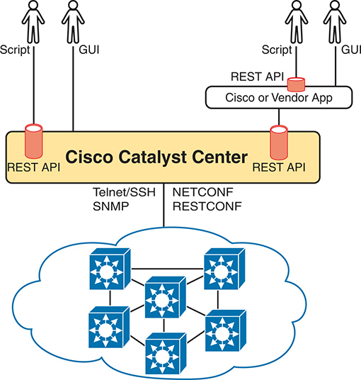

# Chapter 22


## Cisco Software-Defined Access (Cisco SD-Access)

This chapter covers the following exam topics:

1.0 Network Fundamentals

1.1 Explain the role and function of network components

1.1.e Controllers

6.0 Automation and Programmability

6.1 Explain how automation impacts network management

6.2 Compare traditional networks with controller-based networking

6.3 Describe controller-based, software-defined architecture (overlay, underlay, and fabric)

6.3.a Separation of control plane and data plane

6.3.b Northbound and Southbound APIs

6.4 Explain AI (generative and predictive) and machine learning in network operations

Cisco Software-Defined Access (SD-Access) is a software-defined approach to build converged wired and wireless campus networks or LANs. The word *access* in the name refers to the three-tier network architecture design that consists of the core, distribution, and access layers of a network. The access layer is where the endpoint devices connect to the network, while *software-defined* refers to many of the software-defined architectural features discussed in [Chapter 21](vol2_ch21.xhtml#ch21), "[Introduction to Controller-Based Networking](vol2_ch21.xhtml#ch21)." These features include a centralized controller—called Cisco Catalyst Center—and use both southbound and northbound protocols and APIs. It also includes a completely different operational model within Cisco SD-Access when compared to that of a traditional network. Cisco SD-Access creates a network fabric composed of an underlay network and an overlay network.

Note

Cisco DNA Center was rebranded to Cisco Catalyst Center; however, all features and functionality remain the same. Please visit [www.cisco.com/go/catalystcenter](http://www.cisco.com/go/catalystcenter) for more information.

Cisco SD-Access is Cisco's main campus offering and fits within Cisco Digital Network Architecture (DNA). Cisco DNA defines the entire architecture for the new world of software-defined networks, digitization, and how Cisco networks should be operated in the future. This chapter introduces Cisco SD-Access, which exists as one implementation of Cisco DNA.

The discussion of Cisco SD-Access and Cisco DNA provides a great backdrop to discuss a few other topics from the CCNA blueprint: Cisco Catalyst Center controller and network management. Cisco SD-Access uses the Cisco Catalyst Center controller to configure and operate Cisco SD-Access. However, Cisco Catalyst Center also acts as a complete network management platform. To understand Cisco Catalyst Center, you also need to understand traditional network management as well as the new management models using controllers.

### "Do I Know This Already?" Quiz

Take the quiz (either here or use the PTP software) if you want to use the score to help you decide how much time to spend on this chapter. The letter answers are listed at the bottom of the page following the quiz. [Appendix C](vol2_appc.xhtml#appc), found both at the end of the book as well as on the companion website, includes both the answers and explanations. You can also find both answers and explanations in the PTP testing software.

**Table 22-1** "Do I Know This Already?" Foundation Topics Section-to-Question Mapping

| Foundation Topics Section | Questions |
| --- | --- |
| Cisco SD-Access Fabric, Underlay, and Overlay | 1–3 |
| Cisco Catalyst Center and Cisco SD-Access Operation | 4, 5 |
| Cisco Catalyst Center as a Network Management Platform | 6 |
| Artificial Intelligence (AI), Machine Learning (ML), and Operational Management | 7 |

**[1](vol2_ch22.xhtml#ques22_1a).** In Cisco Software-Defined Access (Cisco SD-Access), which term refers to the devices and cabling, along with configuration that allows the network device nodes enough IP connectivity to send IP packets to each other?

1. Fabric
2. Overlay
3. Underlay
4. VXLAN

**[2](vol2_ch22.xhtml#ques22_2a).** In Cisco Software-Defined Access (Cisco SD-Access), which term refers to the functions that deliver endpoint packets across the network using tunnels between the ingress and egress fabric nodes?

1. Fabric
2. Overlay
3. Underlay
4. VXLAN

**[3](vol2_ch22.xhtml#ques22_3a).** In Software-Defined Access (Cisco SD-Access), which of the answers are part of the overlay data plane?

1. LISP
2. GRE
3. OSPF
4. VXLAN

**[4](vol2_ch22.xhtml#ques22_4a).** Which answers best describe options of how to implement security with scalable groups using Cisco Catalyst Center and Cisco SD-Access? (Choose two answers.)

1. A human user from the Cisco Catalyst Center GUI
2. An automation application using NETCONF
3. A human user using the CLI of a Cisco SD-Access fabric edge node
4. An automation application using REST

**[5](vol2_ch22.xhtml#ques22_5a).** Which of the following protocols or tools could be used as part of the Cisco Catalyst Center southbound interface? (Choose three answers.)

1. Ansible
2. SSH
3. NETCONF
4. SNMP
5. Puppet

**[6](vol2_ch22.xhtml#ques22_6a).** Which of the following are network management features performed by both traditional network management software as well as by Cisco Catalyst Center? (Choose two answers.)

1. Network device discovery
2. Software-Defined Access configuration
3. End-to-end path discovery with ACL analysis
4. Device installation (day 0), configuration (day 1), and monitoring (day n) operations

**[7](vol2_ch22.xhtml#ques22_7a).** What distinguishes Narrow AI from Generative AI?

1. Narrow AI lacks broad cognitive capabilities, while Generative AI thrives in a limited scope.
2. Narrow AI is designed for specific tasks, while Generative AI is capable of learning and decision-making.
3. Narrow AI includes applications like speech recognition, while Generative AI focuses on conversational platforms like ChatGPT.
4. Narrow AI relies on explicit programming, while Generative AI learns patterns and relationships from data sources.

Answers to the "Do I Know This Already?" quiz:

**[1](vol2_appc.xhtml#ques22_1)** C

**[2](vol2_appc.xhtml#ques22_2)** B

**[3](vol2_appc.xhtml#ques22_3)** D

**[4](vol2_appc.xhtml#ques22_4)** A, D

**[5](vol2_appc.xhtml#ques22_5)** B, C, D

**[6](vol2_appc.xhtml#ques22_6)** A, D

**[7](vol2_appc.xhtml#ques22_7)** B

### Foundation Topics

### Cisco SD-Access Fabric, Underlay, and Overlay

Cisco [Software-Defined Access](vol2_gloss.xhtml#gloss_322) ([Cisco SD-Access)](vol2_gloss.xhtml#gloss_072) creates an entirely new way to build campus LANs as compared to the traditional methods of networking discussed in most chapters of this book. In the mid-2010s, Cisco set about to reimagine campus networking, with Cisco SD-Access as the result.

Cisco SD-Access uses the software-defined architectural model introduced in [Chapter 21](vol2_ch21.xhtml#ch21), with a controller and various APIs. Cisco SD-Access networks are still built using a collection of physical networking equipment such as routers and switches as well as cables, and other various endpoint devices. At the top of the network is the Cisco Catalyst Center controller, as shown in [Figure 22-1](vol2_ch22.xhtml#ch22fig01). Cisco Catalyst Center is where users utilize a graphical user interface (GUI) for design, configuration, and implementation settings, and the controller provides automation by leveraging APIs. In short, Cisco Catalyst Center is the controller for Cisco SD-Access networks.


The diagram shows various users interacting with the controller through different interfaces. Controller: The central component of the architecture, labeled Controller, manages the network. It is connected to several Application Programming Interfaces, A P Is, that facilitate interaction with scripts, Graphical User Interfaces, G U Is, and third-party applications. Users: On the left side, a user interacts with the controller via a script and G U I through an A P I. On the right side, another user utilizes a script, G U I, and a Cisco or vendor application to interact with the controller. A P I and S B I: The A P I connections between users and the controller, as well as the Southbound Interface, S B I, connections from the controller to the network devices, are highlighted. These interfaces allow for efficient management and automation of the network. Network Devices: Below the controller, a network fabric composed of interconnected network devices is shown. These devices are managed and controlled by the controller to ensure seamless network operations and policy enforcement.

**Figure 22-1** *Cisco SD-Access Architectural Model with Cisco Catalyst Center*

In terms of architecture, the southbound side of the controller contains components such as the fabric, the underlay, and the overlay. By design in SDN implementations, most of the interesting new capabilities occur on the northbound side, which are examined in the second half of this chapter. This first half of the chapter examines the details south of the controller—namely, the underlay network, overlay network, and fabric.


[Underlay](vol2_gloss.xhtml#gloss_347)**:** The physical devices and connections, which include wired and wireless devices that provide IP connectivity to all nodes within the campus LAN. The main goal of an underlay network is to provide reachability to all Cisco SD-Access devices in order to support the dynamic creation of Virtual eXtensible Local-Area Network ([VXLAN](vol2_gloss.xhtml#gloss_373)) overlay tunnels.

[Overlay](vol2_gloss.xhtml#gloss_242)**:** The collection of devices that use VXLAN tunnels that are created between other Cisco SD-Access devices such as switches and fabric-enabled access points. Overlays are used to transport traffic from one endpoint to another over the fabric.

[Fabric](vol2_gloss.xhtml#gloss_140)**:** The combination of overlay and underlay technologies, which together provide all features to deliver data across the network with the desired features and attributes. This could be all devices or a subset of devices that make up the fabric. This also means that multiple fabrics can exist within a Cisco SD-Access network.

VXLAN is defined in RFC 7348 as a technology used to create virtual networks that can span different physical locations or devices. It allows for more flexible and scalable communication between devices. VXLAN encapsulates data and extends Layer 2 networks over Layer 3 networks and is often seen in data center and cloud environments. This technology can help improve network efficiency and support the growing needs of modern applications.

In Cisco SD-Access, one main use case is something called *host mobility*. As wireless becomes a more pervasive method of connectivity, it is more common for users to move from location to location during a typical workday. These locations can be from the user's desk to the break room or from the data center to the call center. In many cases, users no longer sit and work in the same location within the corporate campus environment. This includes being wired. Users can move and plug into network jacks at other desks or also in conference rooms.

Thinking through this scenario, in the simplest terms, means that a user can hop from one wireless network with one IP address and set of security rules to another VLAN or subnet with a different IP address and set of security rules or access lists. Typically, this capability was handled by means of DHCP and the hope that the network administrator had the appropriate security policies in place to make sure that, when users went from one area of the network to another, the same rules applied. This is very often a manual process in many networks. Something had to be done to change the way users were treated technically and also from a user-experience perspective. For example, if a user moves from one area of the building to another and then suddenly couldn't access a mission-critical application because of a missing access list entry, that causes a problem for the user who is trying to get a job done.

In less formal terms, the underlay exists as multilayer switches and their links, with IP connectivity—but for a special purpose. Traffic sent by the endpoint devices flows through VXLAN tunnels in the overlay using a completely different process than traditional LAN switching and IP routing.

For instance, think about the idea of sending packets from hosts on the left of a network, over Cisco SD-Access, to hosts on the right. For instance, imagine a packet enters on the left side of the physical network at the bottom of [Figure 22-2](vol2_ch22.xhtml#ch22fig02) and eventually exits the campus out switch SW2 on the far right. This underlay network looks like a more traditional network drawing, with several devices and links.


Overlay: The top part of the image represents the overlay network, which uses V X L A N, Virtual Extensible L A N, to create a virtualized layer over the physical network. This layer connects devices such as switches, S W 1 and S W 2, and computers, providing a seamless and flexible network experience. Underlay: The bottom part of the image represents the underlay network, which consists of the physical network infrastructure. It includes multiple interconnected network devices forming a mesh topology that provides the foundational connectivity for the overlay network.

**Figure 22-2** *Fabric, Underlay, and Overlay Concepts*

The overlay drawing at the top of the figure shows only two switches—called fabric edge nodes, because they happen to be at the edges of the Cisco SD-Access fabric—with a tunnel labeled VXLAN connecting the two. Both concepts (underlay and overlay) together create the Cisco SD-Access fabric.

The next few pages explain both the underlay and overlay in a little more depth.

#### The Cisco SD-Access Underlay

With Cisco SD-Access, the underlay exists to provide connectivity between the fabric edge nodes in the campus environment for the purpose of supporting VXLAN tunnels in the overlay network. To do that, the underlay includes the switches, routers, cables, and wireless links used to create the physical network. It also includes the configuration and operation of the underlay so it can support the work of the overlay network.

##### Using Existing Gear for the Cisco SD-Access Underlay

To build a Cisco SD-Access underlay network, companies have two basic choices. They can use supported models of their existing campus network and add new configuration to create an underlay network, while still supporting their existing production traffic with traditional routing and switching. Alternately, the company can purchase some new Catalyst switches and build the Cisco SD-Access network without concern for harming existing traffic, and migrate endpoints to the new network fabric over time.

To build Cisco SD-Access into an existing network, it helps to think for a moment about some typical campus network designs. The larger campus site may use either a two-tier or three-tier design as discussed in [Chapter 18](vol2_ch18.xhtml#ch18), "[LAN Architecture](vol2_ch18.xhtml#ch18)." It has a cluster of wireless LAN controllers (WLCs) to support a number of lightweight APs (LWAPs). Engineers have configured VLANs, VLAN trunks, IP routing, IP routing protocols, ACLs, and so on. And the LAN connects to WAN routers.

Cisco SD-Access can be added into an existing campus LAN, but doing so has some risks and restrictions. First and foremost, you have to be careful not to disrupt the current network while adding the new features to the network. The issues include

* Because of the possibility of harming the existing production configuration, [Cisco Catalyst Center](vol2_gloss.xhtml#gloss_070) should not be used to configure the underlay if the devices are currently used in production. (Cisco Catalyst Center will be used to configure the underlay with deployments that use all new hardware.)
* The existing hardware must be from the Cisco SD-Access compatibility list, with different models supported depending on their different roles (see a link at [www.cisco.com/go/sd-access](http://www.cisco.com/go/sd-access)).
* The device software levels must meet the requirements, based on their roles, as detailed in that same compatibility list.

For instance, imagine an enterprise happened to have an existing campus network that uses Cisco SD-Access-compatible hardware. That company might need to update the IOS versions in a few cases. Additionally, the engineers would need to configure the underlay part of the Cisco SD-Access devices manually rather than with Cisco Catalyst Center because Cisco assumes that the existing network already supports production traffic, so they want the customer directly involved in making those changes.

The Cisco SD-Access underlay configuration requires you to think about and choose the different roles filled by each device before you can decide which devices to use and which minimum software levels each requires. If you look for the hardware compatibility list linked from [www.cisco.com/go/sd-access](http://www.cisco.com/go/sd-access), you will see different lists of supported hardware and software depending on the roles. These roles include


[Fabric edge node](vol2_gloss.xhtml#gloss_141)**:** A switch that connects to endpoint devices (similar to traditional access or leaf switches)

**Fabric border node:** A switch that connects to devices outside the control of Cisco SD-Access—for example, switches that connect to the WAN routers or to an ACI data center

**Fabric control-plane node:** A switch that performs special control plane functions for the underlay (LISP), requiring more CPU and memory

For example, Cisco's compatibility list includes many Catalyst 9200, 9300, 9400, 9500, and 9600 series switches, but also some older Catalyst 3850 and 3650 switches, as fabric edge nodes. However, some products did not make the list as fabric edge nodes. For fabric control nodes, the list included higher-end Catalyst switch models (which typically have more CPU and RAM), plus several router models (routers typically have much more RAM for control plane protocol storage—for instance, for routing protocols).

The beginning of a Cisco SD-Access project will require you to look at the existing hardware and software to begin to decide whether the existing campus might be a good candidate to build the fabric with existing gear or to upgrade hardware when building the new campus fabric LAN.

##### Using New Gear for the Cisco SD-Access Underlay

When buying new hardware for the Cisco SD-Access fabric—that is, a greenfield design—you remove many of the challenges that exist versus deploying Cisco SD-Access on existing gear. You can simply order compatible hardware and software. Once it arrives, you can leverage Cisco Catalyst Center to then configure all the underlay features automatically.

At the same time, the usual campus LAN design decisions will still need to be made. Enterprises use Cisco SD-Access as a better way to build and operate a campus network, but it is still a campus network. It needs to provide access and connectivity to all types of users and devices. When planning a greenfield Cisco SD-Access design, plan to use appropriate compatible hardware, but also think about these traditional LAN design points:

* The number of ports needed in switches in each wiring closet
* The port speeds required
* The benefit of a switch stack in each wiring closet
* The cable length and types of cabling already installed
* The need for power (PoE/PoE+)
* The power available in each new switch versus the PoE power requirements
* Link capacity (speed and number of links) for links between switches

As far as the topology, traditional campus design does tell us how to connect devices, but Cisco SD-Access does not have to follow those traditional rules. To review, traditional campus LAN Layer 2 design (as discussed back in [Chapter 18](vol2_ch18.xhtml#ch18)) tells us to connect each access switch to two different distribution layer switches, but not to other access layer switches, as shown in [Figure 22-3](vol2_ch22.xhtml#ch22fig03). The access layer switch acts as a Layer 2 switch, with a VLAN limited to those three switches.


At the top, two distribution layer switches are shown, each labeled with H S R P 10 dot 1 dot 1 dot 1 and connected by Layer 2, L 2, links. The left switch is marked as the Root, indicating its role in the S T P topology. The right switch is connected to the left switch through two L 2 links, one of which is marked with R S T P for Rapid Spanning Tree Protocol. The bottom switch, labeled S W 3, is part of the access layer and connects to both distribution layer switches via L 2 links. One of these links is labeled B L O C K in red, indicating it is in a blocked state to prevent loops, as enforced by S T P. Additionally, there is a computer connected to S W 3, with the gateway, G W, set to 10 dot 1 dot 1 dot 1. This design demonstrates the use of S T P to manage redundant links and prevent network loops in a traditional Layer 2 access layer setup.

**Figure 22-3** *Traditional Access Layer Design: Three Switches in STP Triangle*

Think through some of the traditional features shown in the figure. The distribution layer switches—Layer 3 switches—act as the default gateway used by hosts and commonly implement HSRP for better availability. The design uses more than one uplink from the access to distribution layer switches, with Layer 2 EtherChannels to allow balancing in addition to redundancy. STP/RSTP manages the small amount of Layer 2 redundancy in the campus, preventing loops by blocking traffic on some ports.

In comparison, a greenfield Cisco SD-Access fabric uses a *routed access layer* design. Routed access layer designs were around long before Cisco SD-Access, but Cisco SD-Access makes good use of the design, and it works very well for the underlay with its goal to support VXLAN tunnels in the overlay network. A routed access layer design simply means that all the LAN switches are Layer 3 switches, with routing enabled, so all the links between switches operate as Layer 3 links. This also means that there are no links in a blocking state and not being used due to STP. This increases available bandwidth and capacity due to all links being used to route traffic versus some sitting idle.

When specifying a greenfield Cisco SD-Access deployment, you can identify what gear you want Cisco Catalyst Center to configure, and it will handle the configuration of the underlay on those devices. This includes using a *routed access layer*. Because this is a greenfield deployment, Cisco Catalyst Center knows that it can configure the switches and wireless devices without any concern of causing harm to a production network. Cisco Catalyst Center will choose the best underlay configuration to support the Cisco SD-Access fabric design.

The typical underlay configuration provided by Cisco Catalyst Center includes the following features but can be modified based on specific design requirements:


* All switches act as Layer 3 switches.
* The switches use the IS-IS routing protocol.
* All links between switches (single links, EtherChannels) are routed Layer 3 links (not Layer 2 links).
* As a result, STP/RSTP is not needed, with the routing protocol instead choosing which links to use based on the IP routing tables.
* The equivalent of a traditional access layer switch—a fabric edge node—acts as the default gateway for the endpoint devices, rather than distribution switches.
* As a result, HSRP (or any FHRP) is no longer needed.

[Figure 22-4](vol2_ch22.xhtml#ch22fig04) repeats the same physical design as in [Figure 22-3](vol2_ch22.xhtml#ch22fig03) but shows the different features with the routed access design as configured using Cisco Catalyst Center.


At the top, two distribution layer switches labeled S W 1 and S W 2 are each connected to a Layer 3 link, L 3, with H S R P, Hot Standby Router Protocol, I P 10 dot 1 dot 1 dot 1. The connection between S W 1 and S W 2 is marked with I S dash I S for Intermediate System to Intermediate System protocol, indicating the use of a routing protocol within the fabric. The bottom switch, labeled S W 3, connects to both distribution layer switches via L 3 links. A computer connected to S W 3 has its gateway, G W, set to 10 dot 1 dot 1 dot 1, the same as the H S R P I P. The diagram demonstrates the benefits of L 3 access in an S D dash Access fabric, including efficient routing and reduced complexity compared to traditional L 2 designs. This setup highlights the improved network performance and scalability achieved by using Layer 3 routing at the access layer in a modern S D dash Access environment.

**Figure 22-4** *Cisco SD-Access Fabric Layer 3 Access Benefits*

Note

Cisco Catalyst Center configures the underlay with consistent settings for each instance of Cisco SD-Access across an enterprise. This convention simplifies operation as an enterprise completes a migration to Cisco SD-Access.

#### The Cisco SD-Access Overlay

When you first think of the Cisco SD-Access overlay, think of this kind of sequence. First, an endpoint sends a frame that will be delivered across the Cisco SD-Access network. The first fabric edge node to receive the frame encapsulates the frame in a new message—using the tunneling specification VXLAN—and forwards the frame into the fabric. Once the ingress fabric edge node has encapsulated the original frame in VXLAN, the other fabric nodes forward the frame based on the VXLAN tunnel details. The last fabric edge node in the path removes the VXLAN details, leaving the original frame, and forwards the original frame on toward the destination endpoint.

While the summary steps of some of Cisco SD-Access's overlay in the previous paragraph may sound like a lot of work, all that work happens in each switch's ASIC. So, while it is more complex to understand, there is no performance penalty for the switches to perform the extra work as it is done in hardware.

Cisco's choice of using VXLAN tunnels opened up many possibilities for a number of new networking features that did not exist without VXLAN. This next topic begins with a closer look at the VXLAN tunnels in the overlay, followed by a discussion of how Cisco SD-Access uses Locator/ID Separation Protocol ([LISP](vol2_gloss.xhtml#gloss_193)) for endpoint discovery and location information needed to create the VXLAN tunnels.

##### VXLAN Tunnels in the Overlay (Data Plane)

Cisco SD-Access has many additional needs beyond the simple message delivery—needs that let it provide improved functions. To that end, the fabric does not only route IP packets or switch Ethernet frames; it encapsulates incoming data link frames in a tunneling technology for delivery across the fabric network. VXLAN must adhere to the following functions in a Cisco SD-Access fabric:


* The VXLAN tunneling (the encapsulation and de-encapsulation) must be performed by the ASIC on each switch so that there is no performance penalty. (That is one reason for the Cisco SD-Access hardware compatibility list: the switches must have ASICs that can perform the work. These are called the Unified Access Data Plane [UADP] ASICs.)
* The VXLAN encapsulation must supply header fields that Cisco SD-Access needs for its features, so the tunneling protocol should be flexible and extensible, while still being supported by the switch ASICs.
* The tunneling encapsulation needs to encapsulate the entire data link frame instead of encapsulating the IP packet. That allows Cisco SD-Access to support Layer 2 forwarding features as well as Layer 3 forwarding features.

To achieve those goals, when creating Cisco SD-Access, Cisco chose the VXLAN protocol to create the tunnels used by Cisco SD-Access. When an endpoint (for example, an end-user computer) sends a data link frame into a fabric edge node, the ingress fabric edge node encapsulates the frame and sends it across a VXLAN tunnel to the egress fabric edge node, as shown in [Figure 22-5](vol2_ch22.xhtml#ch22fig05).


At the left side, there is a computer labeled with the I P address 10 dot 1 dot 1 dot 1, connected to an Ingress Fabric Edge Node identified as S W 1. A L A N Frame is transmitted from the computer to S W 1, which then encapsulates the frame using V X L A N. This encapsulation process is detailed below the main diagram, showing the L A N Frame being wrapped by V X L A N, which in turn is encapsulated by U D P (User Datagram Protocol) and I P (Internet Protocol) headers. The encapsulated data is then transmitted through a V X L A N tunnel, depicted as a blue cylindrical connection, to the Egress Fabric Edge Node labeled S W 2. On the right side, another computer with the I P address 10 dot 1 dot 2 dot 2 receives the L A N Frame after it is decapsulated by S W 2.

**Figure 22-5** *Fundamentals of VXLAN Encapsulation in Cisco SD-Access*

To support the VXLAN encapsulation, the underlay uses a separate IP address space as compared with the rest of the enterprise, including the endpoint devices that send data over the Cisco SD-Access network. The overlay tunnels use addresses from the enterprise address space. For instance, imagine an enterprise used these address spaces:

* 10.0.0.0/8: Entire enterprise
* 172.16.0.0/16: Cisco SD-Access underlay

To make that work, first the underlay would be built using the 172.16.0.0/16 IPv4 address space, with all links using addresses from that address space. As an example, [Figure 22-6](vol2_ch22.xhtml#ch22fig06) shows a small Cisco SD-Access design, with four switches, each with one underlay IP address shown (from the 172.16.0.0/16 address space).


It shows a simple network topology with four interconnected switches labeled S W 1, S W 2, S W 3, and S W 4, each assigned an I P address within the 172 dot 16 dot x dot x subnet. S W 1 has the I P address 172 dot 16 dot 1 dot 1, S W 2 is 172 dot 16 dot 2 dot 2, S W 3 is 172 dot 16 dot 3 dot 3, and S W 4 is 172 dot 16 dot 4 dot 4. The switches are connected by lines representing network links, forming a mesh-like structure. This underlay network provides the physical and routing infrastructure for the overlay network, facilitating efficient data packet transmission and network segmentation within the Cisco S D dash Access architecture.

**Figure 22-6** *Cisco SD-Access Underlay Using 172.16.0.0*

The overlay tunnel creates a path between two fabric edge nodes in the overlay IP address space, which is in the same address space used by all the endpoints in the enterprise. [Figure 22-7](vol2_ch22.xhtml#ch22fig07) emphasizes that point by showing the endpoints (PCs) on the left and right, with IP addresses in network 10.0.0.0/8, with the VXLAN overlay tunnel shown with addresses also from 10.0.0.0/8.


On the left side, a device with I P address 10 dot 1 dot 1 dot 1 is connected to a switch labeled S W 1, which has an I P address of 10 dot 3 dot 3 dot 1. This switch is linked via a V X L A N tunnel to another switch labeled S W 2 on the right, which has an I P address of 10 dot 3 dot 3 dot 2. S W 2 is connected to a device with I P address 10 dot 1 dot 2 dot 1. The V X L A N tunnel is depicted as a blue connection between S W 1 and S W 2, enabling the two subnets (10 dot 1 dot 1 dot 0 slash 24 and 10 dot 1 dot 2 dot 0 slash 24) to communicate over the overlay network, despite potentially being physically separated.

**Figure 22-7** *VXLAN Tunnel and Endpoints with IPv4 Addresses in the Same IPv4 Space*

##### LISP for Overlay Discovery and Location (Control Plane)

Ignore Cisco SD-Access for a moment, and think about traditional Layer 2 switching and Layer 3 routing. How do their control planes work? In other words, how do these devices discover the possible destinations in the network, store those destinations, so that the data plane has all the data it needs when making a forwarding decision? To summarize:

* Traditional Layer 2 switches learn possible destinations by examining the source MAC addresses of incoming frames, storing those MAC addresses as possible future destinations in the switch's MAC address table. When new frames arrive, the Layer 2 switch data plane then attempts to match the Ethernet frame's destination MAC address to an entry in its MAC address table.
* Traditional Layer 3 routers learn destination IP subnets using routing protocols, storing routes to reach each subnet in their routing tables. When new packets arrive, the Layer 3 data plane attempts to match the IP packet's destination IP address to some entry in the IP routing table.

Nodes in the Cisco SD-Access network do *not* do these same control plane actions to support endpoint traffic. Just to provide a glimpse into the process for the purposes of CCNA, consider this sequence, which describes one scenario:

* Fabric edge nodes—Cisco SD-Access nodes that connect to the edge of the fabric—learn the location of possible endpoints using traditional means, based on their MAC address, individual IP address, and by subnet, identifying each endpoint with an endpoint identifier (EID).
* The fabric edge nodes register the fact that the node can reach a given endpoint (EID) into a database called the LISP map server.
* The LISP map server keeps the list of endpoint identifiers (EIDs) and matching routing locators (RLOCs) (which identify the fabric edge node that can reach the EID).
* In the future, when the fabric data plane needs to forward a message, it will look for and find the destination in the LISP map server's database.

For instance, switches SW3 and SW4 in [Figure 22-8](vol2_ch22.xhtml#ch22fig08) each just learned about different subnets external to the Cisco SD-Access fabric. As noted at Step 1 in the figure, switch SW3 sent a message to the LISP map server, registering the information about subnet 10.1.3.0/24 (an EID), with its RLOC setting to identify itself as the node that can reach that subnet. Step 2 shows an equivalent registration process, this time for SW4, with EID 10.1.4.0/24, and with R4's RLOC of 172.16.4.4. Note that the table at the bottom of the figure represents that data held by the LISP map server.


In this setup, there are two switches, S W 3 and S W 4, with respective R L O C (Routing Locator) addresses of 172 dot 16 dot 3 dot 3 and 172 dot 16 dot 4 dot 4. S W 3, associated with E I D 10 dot 1 dot 3 dot 0 slash 24, registers its prefix with the L I S P map server. Similarly, S W 4, associated with E I D 10 dot 1 dot 4 dot 0 slash 24, also registers its prefix with the L I S P map server. The L I S P map server facilitates the mapping of E I Ds to R L O Cs, enabling efficient routing within the network. The bottom of the image contains a table summarizing the E I Ds and their corresponding R L O Cs, providing a clear mapping for network traffic management.

**Figure 22-8** *Edge Nodes Register IPv4 Prefixes (Endpoint IDs) with the LISP Map Server*

When new incoming frames arrive, the ingress tunnel router (ITR)—the Cisco SD-Access fabric edge node that receives the new frame from outside the fabric—needs some help from the control plane. To where should the ITR forward this frame? Because Cisco SD-Access always forwards frames in the fabric over some VXLAN tunnel, what tunnel should the ITR use when forwarding the frame? For the first frame sent to a destination, the ITR must follow a process like the following steps. These steps begin at Step 3, as a continuation of [Figure 22-8](vol2_ch22.xhtml#ch22fig08), with the action referenced in [Figure 22-9](vol2_ch22.xhtml#ch22fig09):

3. An Ethernet frame to a new destination arrives at ingress fabric edge node SW1 (upper left), and the switch does not know where to forward the frame.
4. The ingress node sends a message to the LISP map server asking if the LISP server knows how to reach IP address 10.1.3.1.
5. The LISP map server looks in its database and finds the entry it built back at step 1 in the previous figure, listing SW3's RLOC of 172.16.3.3.
6. The LISP map server contacts SW3—the node listed as the RLOC—to confirm that the entry is correct.
7. SW3 completes the process of informing the ingress fabric edge node (SW1) that 10.1.3.1 can be reached through SW3.


The scenario begins with a packet destined for 10 dot 1 dot 3 dot 1 arriving at S W 1. S W 1 queries the L I S P Map Server to resolve the destination Endpoint Identifier, E I D, to a Routing Locator, R L O C. The L I S P Map Server, shown in the diagram, contains a table mapping E I Ds to R L O Cs. For the destination E I D 10 dot 1 dot 3 dot 0 slash 24, the Map Server returns the R L O C 172 dot 16 dot 3 dot 3, which corresponds to S W 3. S W 1 then forwards the packet towards S W 3, using the R L O C provided. The diagram includes a step-by-step flow, with steps numbered and arrows indicating the direction of the process, ensuring that the packet reaches the correct destination based on the L I S P mapping.

**Figure 22-9** *Ingress Tunnel Router SW1 Discovers Egress Tunnel Router SW3 Using LISP*

To complete the story, now that ingress node SW1 knows that it can forward packets sent to endpoint 10.1.3.1 to the fabric edge node with RLOC 172.16.3.3 (that is, SW3), SW1 encapsulates the original Ethernet frame as shown in [Figure 22-9](vol2_ch22.xhtml#ch22fig09), with the original destination IP address of 10.1.3.1. It adds the IP, UDP, and VXLAN headers shown so it can deliver the message over the Cisco SD-Access network, with that outer IP header listing a destination IP address of the RLOC IP address, so that the message will arrive through the Cisco SD-Access fabric at SW3, as shown in [Figure 22-10](vol2_ch22.xhtml#ch22fig10).


At the top left, S W 1 is depicted with a connection to a V X L A N tunnel, indicating the encapsulation process where the original packet is wrapped in V X L A N, U D P (User Datagram Protocol), and I P (Internet Protocol) headers. The encapsulated packet includes a destination address of 172 dot 16 dot 3 dot 3 for S W 3 and an inner destination address of 10 dot 1 dot 3 dot 1. The V X L A N tunnel is shown leading to S W 3, which has a Route Locator, R L O C, of 172 dot 16 dot 3 dot 3, and is part of the 10 dot 1 dot 3 dot 0 slash 24 network. Below this, S W 4 is displayed with an R L O C of 172 dot 16 dot 4 dot 4, part of the 10 dot 1 dot 4 dot 0 slash 24 network. Both S W 3 and S W 4 are shown to provide context on how L I S P maps and routes packets within the network.

**Figure 22-10** *Ingress Tunnel Router (ITR) SW1 Forwards Based on LISP Mapping to SW3*

Now that you have a general overview of how a fabric works, how VXLAN encapsulation is used to allow for line rate switching in hardware between fabric edge nodes, and how LISP maps endpoints as they move between fabric edge nodes, let's go back to the host mobility use case of Cisco SD-Access.

Consider the following story:

When a host moves from one area of the network to another, the control-plane node (LISP mapping server) keeps track of that user's EID or identity and updates the other fabric edge nodes as they move from location to location. Think about this like a post office for mail distribution. If you move from your home to another home and do not inform the post office that you moved and provide them with your new address, your mail will be incorrectly delivered to your old home and be rendered useless. However, if you inform the post office of your new address by using a change of address form, your mail will be delivered to your new home without interruption. This is how host mobility works within a Cisco SD-Access campus fabric.

Because the identity of the user or host is known to the fabric, the reliance on IP addresses as a means to identify the user or host is no longer as important as it once was. This greatly simplifies matters when it comes to things such as security policies. For example, because the network can know when you move from location or fabric edge to fabric edge, it can enforce security policies based on your identity versus your IP address. This means that regardless of what subnet you are in, what VLAN, what IP address you have, whether it is static or DHCP, your security policy follows the user. This simplifies many things such as access control lists that have to be constantly reviewed to ensure they are covering every subnet range you might move into or out of as well as all the protocols or applications you want to permit or deny access to. Because the network knows the identity of the user, the policy can follow them, providing greater security and reduced risk of human error of an access list missing an entry because a user moved into a different subnet.

At this point, you should have a basic understanding of how the Cisco SD-Access fabric works. The underlay includes all the switches and links, along with IP connectivity, as a basis for forwarding data across the fabric. The overlay adds a different level of logic, with endpoint traffic flowing through VXLAN tunnels. This chapter has not mentioned any reasons that Cisco SD-Access might want to use these tunnels, but you will see one example by the end of the chapter. Suffice it to say that with the flexible VXLAN tunnels, Cisco SD-Access can encode header fields that let Cisco SD-Access create new networking features, all without suffering a performance penalty, as all the VXLAN processing happens in the UADP ASIC.

The next section of this chapter focuses on Cisco Catalyst Center and its role in managing and controlling Cisco SD-Access fabrics.

### Cisco Catalyst Center and Cisco SD-Access Operation

Cisco Catalyst Center ([www.cisco.com/go/catalystcenter](http://www.cisco.com/go/catalystcenter)) has two notable roles:

* As the controller in a network that uses Cisco SD-Access
* As a network management platform for traditional (non-Cisco SD-Access) network devices

The first role as the Cisco SD-Access network controller gets most of the attention and is the topic of discussion in this second of the three major sections of this chapter. Cisco SD-Access and Cisco Catalyst Center go together, work closely together, and any serious use of Cisco SD-Access requires the use of Cisco Catalyst Center. At the same time, however, Cisco Catalyst Center can manage traditional network devices; the final major section of the chapter works through some comparisons.

#### Cisco Catalyst Center

Cisco Catalyst Center exists as a software application that Cisco delivers pre-installed on a Cisco Catalyst Center appliance or as a virtual appliance that can be run in a hypervisor environment. The software follows the same general controller architecture concepts as described in [Chapter 21](vol2_ch21.xhtml#ch21). [Figure 22-11](vol2_ch22.xhtml#ch22fig11) shows the general ideas.





At the top, various users interact with the Cisco Catalyst Center through different methods: some use scripts while others use graphical user interfaces, G U Is. These interactions occur via R E S T A P Is. Additionally, Cisco or vendor applications can also interact with the Catalyst Center through R E S T A P Is. The Cisco Catalyst Center acts as a centralized controller managing the network, and it communicates with the underlying network devices using southbound interfaces such as Telnet slash S S H, S N M P, N E T C O N F, and R E S T C O N F. The network fabric below the controller is composed of interconnected devices, forming a managed and controlled environment by the Cisco Catalyst Center to ensure efficient and automated network operations.

**Figure 22-11** *Cisco Catalyst Center with Northbound and Southbound Interfaces*

Cisco Catalyst Center includes a robust northbound REST API along with a series of southbound APIs. For most of us, the northbound API matters most, because as the user of Cisco SD-Access networks, you interact with Cisco SD-Access using Cisco Catalyst Center's northbound REST API or the GUI interface. ([Chapter 23](vol2_ch23.xhtml#ch23), "[Understanding REST and JSON](vol2_ch23.xhtml#ch23)," discusses the concepts behind REST APIs in more detail.)

Cisco Catalyst Center supports several southbound APIs so that the controller can communicate with the devices it manages. You can think of these as two categories:

* Protocols to support traditional networking devices/software versions: Telnet, SSH, SNMP
* Protocols to support more recent networking devices/software versions: NETCONF, RESTCONF

Cisco Catalyst Center needs the older protocols to be able to support the vast array of older Cisco devices and OS versions. Over time, Cisco has been adding support for NETCONF and RESTCONF to their more current hardware and software.

#### Cisco Catalyst Center and Scalable Groups

Cisco SD-Access creates many interesting new and powerful features beyond how traditional campus networks work. Cisco Catalyst Center not only enables an easier way to configure and operate those features, but it also completely changes the operational model. While the scope of CCNA does not allow us enough space to explore all of the features of Cisco SD-Access and Cisco Catalyst Center, this next topic looks at one feature as an example: scalable groups.

##### Issues with Traditional IP-Based Security

Imagine the life of one traditional IP ACL in an enterprise. Some requirements occurred, and an engineer built the first version of an ACL with three access control entries (ACEs)—that is, **access-list** commands—with a **permit any** at the end of the list. Months later, the engineer added two more lines to the ACL, so the ACL has the number of ACEs shown in [Figure 22-12](vol2_ch22.xhtml#ch22fig12). The figure notes the lines added for requests one and two with the circled numbers in the figure.


The diagram is split into two sections to illustrate changes made over time. Initially, the A C L contains entries A C E 1, A C E 2, and A C E 3 (highlighted in red). Two months later, two new entries, A C E 4 and A C E 5 (highlighted in yellow), have been added. The final entry in the A C L is a permit rule. This diagram effectively demonstrates how A C Es are added to an A C L over time, with the first request involving the initial three A C Es and the subsequent request, made two months later, adding two more A C Es, thereby showing the evolution and updates within an A C L configuration.

**Figure 22-12** *Lines (ACEs) in an ACL After Two Changes*

Now think about that same ACL after four more requirements caused changes to the ACL, as noted in [Figure 22-13](vol2_ch22.xhtml#ch22fig13). Some of the movement includes

* The ACEs for requirement two are now at the bottom of the ACL.
* Some ACEs, like ACE 5, apply to more than one of the implemented requirements.
* Some requirements, like requirement number five, required ACEs that overlap with multiple other requirements.


The diagram shows a vertical stack of A C Es, each labeled from A C E 1 to A C E 12. The entries are color-coded: A C E 1, A C E 2, and A C E 3 are in red; A C E 4, A C E 5, and A C E 6 are in yellow; A C E 7, A C E 8, A C E 9, and A C E 10 are in white; and A C E 11 and A C E 12 are in blue, with the note (Permit) next to A C E 12. Arrows indicate the insertion points for changes: at positions 1, 2, 3, 4, 5, and 6. It demonstrates the dynamic nature of A C L configurations, where entries can be added, modified, or removed to refine the access control policies applied to network traffic.

**Figure 22-13** *Lines (ACEs) in an ACL After Six Changes*

Now imagine your next job is to add more ACEs for the next requirement (7). However, your boss also told you to reduce the length of the ACL, removing the ACEs from that one change made last August—you remember it, right? Such tasks are problematic at best.

With the scenario in [Figure 22-13](vol2_ch22.xhtml#ch22fig13), no engineer could tell from looking at the ACL whether any lines in the ACL could be safely removed. You never know if an ACE was useful for one requirement or for many. If a requirement was removed, and you were even told which old project caused the original requirement so that you could look at your notes, you would not know if removing the ACEs would harm other requirements. Most of the time, ACL management suffers with these kinds of issues:

* ACEs cannot be removed from ACLs because of the risk of causing failures to the logic for some other past requirement.
* New changes become more and more challenging due to the length of the ACLs.
* Troubleshooting ACLs as a system—determining whether a packet would be delivered from end to end—becomes an even greater challenge.

##### Cisco SD-Access Security Is Based on User Groups

Imagine you could instead enforce security without even thinking about IP address ranges and ACLs. Cisco SD-Access does just that, with simple configuration, and the capability to add and remove the security policies at will.

First, for the big ideas. Imagine that over time, using Cisco SD-Access, six different security requirements occurred. For each project, the engineer would define the policy with Cisco Catalyst Center, either with the GUI or with the API. Then, as needed, Cisco Catalyst Center would configure the devices in the fabric to enforce the security, as shown in [Figure 22-14](vol2_ch22.xhtml#ch22fig14).


At the top, six policies (Policy 1 through Policy 6) are shown with arrows pointing downwards, indicating their input into the Cisco Catalyst Center, depicted as a blue horizontal block. Below the Cisco Catalyst Center, another arrow points to the Cisco S D dash Access Fabric, shown as a yellow rectangular block. This diagram highlights the role of the Cisco Catalyst Center in centralizing and managing security policies, which are then enforced across the S D dash Access Fabric to ensure a secure and streamlined network operation. The visual emphasizes the hierarchical structure and the flow of policy information from the management layer to the network fabric.

**Figure 22-14** *Cisco Catalyst Center IP Security Policies (Northbound) to Simplify Operations*

Note

The model in [Figure 22-14](vol2_ch22.xhtml#ch22fig14) helps demonstrate the concept of intent-based networking (IBN). The engineer configures the intent or outcome desired from the network—in this case, a set of security policies. The controller communicates with the devices in the network, with the devices determining exactly what configuration and behavior are necessary to achieve those intended policies.

The Cisco SD-Access policy model solves the configuration and operational challenges with traditional ACLs. In fact, all those real issues with managing IP ACLs on each device are no longer issues with Cisco SD-Access's group-based security model. For instance:

* The engineer can consider each new security requirement separately, without analysis of an existing (possibly lengthy) ACL.
* Each new requirement can be considered without searching for all the ACLs in the likely paths between endpoints and analyzing each and every ACL.
* Cisco Catalyst Center (and related software) keeps the policies separate, with space to keep notes about the reason for the policy.
* Each policy can be removed without fear of impacting the logic of the other policies.

Cisco SD-Access and Cisco Catalyst Center achieve this particular feature by tying security to groups of users, called scalable groups, with each group assigned a [scalable group tag (SGT)](vol2_gloss.xhtml#gloss_296). Then the engineer configures a grid that identifies which SGTs can send packets to which other SGTs. For instance, the grid might include SGTs for an employee group, the Internet (for the enterprise's WAN routers that lead to the Internet), partner employees, and guests, with a grid like the one shown in [Table 22-2](vol2_ch22.xhtml#ch22tab02).

**Table 22-2** Access Table for Cisco SD-Access Scalable Group Access

| **Source\Dest.** | Employee | Internet | Partner | Guest |
| --- | --- | --- | --- | --- |
| Employee | N/A | Permit | Permit | Deny |
| Internet | Permit | N/A | Permit | Permit |
| Partner | Permit | Permit | N/A | Deny |
| Guest | Deny | Permit | Deny | N/A |

To link this security feature back to packet forwarding, consider when a new endpoint tries to send its first packet to a new destination. The ingress Cisco SD-Access fabric edge node starts a process by sending messages to Cisco Catalyst Center. Cisco Catalyst Center then works with security tools in the network, like Cisco's Identity Services Engine (ISE), to identify the users and then match them to their respective SGTs. Cisco Catalyst Center then checks the logic similar to [Table 22-2](vol2_ch22.xhtml#ch22tab02). If Cisco Catalyst Center sees a permit action between the source/destination pair of SGTs, Cisco Catalyst Center directs the edge nodes to create the VXLAN tunnel, as shown in [Figure 22-15](vol2_ch22.xhtml#ch22fig15). If the security policies state that the two SGTs should not be allowed to communicate, then Cisco Catalyst Center does not direct the fabric to create the tunnel, and the packets do not flow.


The diagram shows two endpoints: a device with I P address 10 dot 1 dot 1 dot 1 connected to switch S W 1 on the left and a device with I P address 10 dot 1 dot 2 dot 2 connected to switch S W 2 on the right. These switches are linked via a V X L A N tunnel, represented by a blue line between S W 1 and S W 2, enabling communication between the two subnets over an overlay network. Below this setup, the V X L A N header structure is detailed. The header includes the following fields: I P: The standard I P header. U D P: The User Datagram Protocol header. Source S G T: The Security Group Tag of the source. Destination S G T: The Security Group Tag of the destination. Source V N I D: The Virtual Network Identifier of the source. Destination V N I D: The Virtual Network Identifier of the destination. Original Ethernet Frame: The original Ethernet frame is encapsulated by the V X L A N.

**Figure 22-15** *VXLAN Header with Source and Destination SGTs and VNIDs Revealed*

Note

The figure gives a brief insight into why Cisco SD-Access goes to the trouble of using VXLAN encapsulation for its data plane, rather than performing traditional Layer 2 switching or Layer 3 routing. The VXLAN header has great flexibility—in this case, used to define both a source and destination SGT, matching Cisco SD-Access's desired logic of allowing a subset of source/destination SGTs in the Cisco SD-Access fabric.

The operational model with scalable groups greatly simplifies security configuration and ongoing maintenance of the security policy, while focusing on the real goal: controlling access based on user, as mentioned previously in the section "[LISP for Overlay Discovery and Location (Control Plane)](vol2_ch22.xhtml#ch22lev3sec4)." From a controller perspective, the fact that Cisco Catalyst Center acts as much more than a management platform, and instead as a controller of the activities in the network, makes for a much more powerful set of features and capabilities.

### Cisco Catalyst Center as a Network Management Platform

Typically, a network management system (NMS) for the enterprise will include many useful features to help simplify the daily operation of your network. Although specific features will vary on a per-platform or vendor basis, many, if not most, of the following features can be found in a typical NMS:

* **Single-pane-of-glass:** Provides one GUI from which to launch all functions and features
* **Discovery, inventory, and topology:** Discovers network devices, builds an inventory, and arranges them in a topology map
* **Entire enterprise:** Provides support for traditional enterprise LAN, WAN, and data center management functions
* **Methods and protocols:** Uses SNMP, SSH, and Telnet, as well as CDP and LLDP, to discover and learn information about the devices in the network
* **Lifecycle management:** Supports different tasks to install a new device (day 0), configure it to be working in production (day 1), and perform ongoing monitoring and make changes (day *n*)
* **Application visibility:** Simplifies QoS configuration deployment to each device
* **Converged wired and wireless:** Enables you to manage both the wired and wireless LAN from the same management platform
* **Software Image Management (SWIM):** Manages software images on network devices and automates updates
* **Plug-and-Play:** Performs initial installation tasks for new network devices after you physically install the new device, connect a network cable, and power on

Cisco tends to shy away from specific product details in most of its career certifications, so it helps to think in general about network management products. It also helps to think about specific products—but temper that by focusing on the more prominent features and major functions.

#### Cisco Catalyst Center Similarities to Traditional Management

If you read the user's guide for Cisco Catalyst Center and look through all the features, you will find some of them are similar in nature to the traditional management features listed at the beginning of this section. For example, Cisco Catalyst Center can not only discover network devices like other network management systems but can also create a live topology map view of your network. Human operators (rather than automated processes) often start with the topology map, expecting at-a-glance notices (flashing lights, red colors) to denote issues in the network. In addition, most network management systems provide event and threshold alerting via email or SMS. As an example, [Figure 22-16](vol2_ch22.xhtml#ch22fig16) shows a topology map from Cisco Catalyst Center.


On the left, the sidebar lists various geographical locations and devices in a hierarchical structure, including North America, E M E A, Asia-Pacific, and South America. North America is further divided into Canada, Mexico, and the United States, with specific states and cities like California (Pasadena, San Francisco, Los Angeles), Texas, New York, Virginia, New Jersey, and Colorado. The main section shows a network topology map with a graphical representation of network devices and their connections. At the top, an icon labeled The Internet is connected to a device labeled W A N (O C S 1) with a green status indicator. Below W A N (O C S 1), multiple interconnected devices are displayed in a hierarchical structure. Core-A G G 2, also with a green status indicator, is connected to B L D 3-F L R 1-D I S T 1 and B L D 3-F L R 2-D I S T 2, both showing green indicators. B L D 3-F L R 1-D I S T 1 connects to B L D 3-F L R 2-D I S T 2 and B L D 3-F L R 3-D I S T 3, while B L D 3-F L R 2-D I S T 2 connects to B L D 3-F L R 3-D I S T 3 and B L D 3-F L R 4-D I S T 4. B L D 3-F L R 3-D I S T 3 connects to B L D 3-F L R 4-D I S T 4, with all devices displaying green status indicators. The top bar includes options for filtering and displaying devices, a Search Network bar for filtering devices by different criteria, and buttons for Filter, Display, Export (to export the topology view), Expand View (to enlarge the map), and Help. In the bottom right corner, buttons for Zoom In/Out, Full-Screen Mode, and Refresh are available.

**Figure 22-16** *Cisco Catalyst Center Topology Map*

The GUI mechanisms are relatively intuitive, with the ability to click into additional or less detail. [Figure 22-17](vol2_ch22.xhtml#ch22fig17) shows a little more detail after hovering over and clicking on one of the nodes in the topology from [Figure 22-16](vol2_ch22.xhtml#ch22fig16), typical actions and results in many management products.


The left sidebar remains the same, listing locations and devices. The main section again shows the network topology map with the same hierarchical structure. The user has hovered over or clicked on a device labeled B L D 3-F L R 1-D I S T 1, revealing a tooltip with detailed information: Device Name (B L D 3-F L R 1-D I S T 1), Model (Cisco Catalyst 9300), M A C Address, Platform (Cisco I O S-X E), and Role (Distribution). A new right sidebar appears, providing detailed information about the selected device. It includes Device Details such as Name (B L D 3-F L R 1-D I S T 1), Family (Switches and Hubs), Role (D I S T R I B U T I O N), I P Address, M A C Address, and Platform (Cisco I O S-X E). Tabs for more information include Checks (displaying health checks and status), P and P Tasks (pre and post-check tasks), and View Actions (additional actions that can be performed on the device). A hovering interaction shows a detailed tooltip with information about the device, providing easy access to specific data without navigating away from the main topology view. The top bar retains the same options for filtering, displaying, exporting, expanding the view, and accessing help as described in the first image.

**Figure 22-17** *Hover and Click Details About a Single Cisco Catalyst 9300 Switch from Cisco Catalyst Center*

I encourage you to take some time to use and watch some videos about Cisco Catalyst Center. The "[Chapter Review](vol2_ch22.xhtml#ch22lev1sec7)" section for this chapter on the companion website lists some links for good videos. Also, start at <https://developer.cisco.com> and look for Cisco Catalyst Center sandbox labs to find a place to experiment with Cisco Catalyst Center.

#### Cisco Catalyst Center and Differences with Traditional Management

In a broad sense, there are several fundamental differences between Cisco Catalyst Center and traditional network management platforms. The largest difference: Cisco Catalyst Center supports Cisco SD-Access, whereas other management apps do not. So, think of network management systems as analogous to traditional device management. Cisco Catalyst Center has many similar features, but it also has more advanced features that focus on newer technology solutions like Cisco SD-Access support.

In terms of intent and strategy, Cisco focuses their development of Cisco Catalyst Center features toward simplifying the work done by enterprises, with resulting reduced costs and much faster deployment of changes. Cisco Catalyst Center features help make initial installation easier, simplify the work to implement features that traditionally have challenging configuration, and use tools to help you notice issues more quickly. Some of the features unique to Cisco Catalyst Center include


* **Application policy:** Deploys QoS, one of the most complicated features to configure manually, with just a few simple choices from Cisco Catalyst Center
* **Encrypted Traffic Analytics (ETA):** Enables Cisco DNA to use algorithms to recognize security threats even in encrypted traffic
* **Device 360 and Client 360:** Gives a comprehensive (360-degree) view of the health of the device
* **Network time travel:** Shows past client performance in a timeline for comparison to current behavior
* **Path trace:** Discovers the actual path packets would take from source to destination based on current forwarding tables

Just to expound on one feature as an example, Cisco Catalyst Center's Path Trace feature goes far beyond a traditional management application. A typical network management app might show a map of the network and let you click through to find the configuration on each device, including ACLs. The path trace feature goes much further. The Cisco Catalyst Center user (from the GUI or the API) specifies a source and destination host and optionally, the transport protocol and ports. Then the path trace feature shows a map of the path through the network and shows which ACLs are in the path, and whether they would permit or deny the packet.

All of Cisco's Digital Network Architecture sets about to help customers reach some big goals: reduced costs, reduced risks, better security and compliance, faster deployment of services through automation and simplified processes, and the list goes on. Cisco Catalyst Center plays a pivotal role, with all the functions available through its robust northbound API, and with its intent-based networking approach for Cisco SD-Access. Cisco Catalyst Center represents the future of network management for Cisco enterprises.

### Artificial Intelligence (AI), Machine Learning (ML), and Operational Management

Cisco includes one exam topic in the CCNA 200-301 Version 1.1 blueprint that mentions Artificial Intelligence (AI):

6.4 Explain AI (generative and predictive) and machine learning in network operations

Tremendous amounts of industry buzz have emerged in the area of artificial intelligence and machine learning. Some of the early adopters sought benefits to alleviate some of the strain of their day-to-day operations while running the network. Before we can understand some of the benefits from AI and ML, we must first understand their definitions.

[Artificial Intelligence](vol2_gloss.xhtml#gloss_041) is defined as a computer or system that can do tasks that typically require human thinking, such as learning, problem-solving, and understanding various languages. There are two major types of AI:


* [Narrow AI](vol2_gloss.xhtml#gloss_220) is a type of AI that is designed to perform a specific task or a set of closely related tasks. Narrow AI thrives in a well-defined and limited scope. However, Narrow AI lacks the broad cognitive capabilities of human intelligence. Some common examples of Narrow AI include speech recognition systems or applications, image recognition software, and virtual personal assistants such as Amazon Alexa, Apple Siri, and Google Assistant. These assistants are often used for typical tasks like playing music, showing your calendar, or recalling a recipe when cooking.
* [Generative AI](vol2_gloss.xhtml#gloss_152), which could learn, be taught, and could potentially make decisions that consider facts and experiences similar to humans, is another form of AI.

AI also includes technologies like Machine Learning (ML). ML is used in numerous fields from healthcare to network operations and security. ML is a branch of AI that primarily focuses on the development of algorithms and complex data models. These models enable computers to learn from various data sources and not only make predictions but also make their own decisions without being explicitly programmed to. The goal of machine learning is to create systems that can continuously and automatically improve as they are fed more data or information sets.

In traditional computer programming, humans write explicit instructions to perform a task. However, in machine learning, there is a dichotomy. The computer can learn specific patterns and relationships from different data sources, which allows the computer or "AI" to make predictions on new data sets that it hasn't even seen yet. This is what the definition of [Predictive AI](vol2_ch22.xhtml#key_330a) is—being able to surmise what you are trying to accomplish with the least amount of prompts or input from the user.

Let's contemplate some of the benefits and use cases for the different forms of AI. Starting with a common example of Narrow AI, we can easily see the value of having virtual personal assistants. One less obvious use case is the ability to run home automation workflows and bind them to various schedules. This creates the "Smart Building" concept. Connecting and controlling various "things" such as lighting, thermostats, garage doors, and electronics typically introduces some form of intrinsic value for the user, especially when leveraging automation.

One very common advantage is creating a routine or automation that will turn off indoor lights, close the garage door, and set the temperature to a lower setting automatically when you leave your home for the day. The cost savings across all these domains can be significant. Especially if you extrapolate that out across the year. It is very frequent that lights and heat or garage doors get left on or open. Now there is a method to ensure that doesn't happen. In addition, to take this example one step further, you can automate turning on your home security system or alarm as part of this routine. It is pretty easy to see the value of how using a Narrow AI virtual personal assistant tied to automation techniques can provide real-world use cases.

Generative AI is where most of the attention seems to be these days, and for great reason. Generative AI has exploded as the next big thing and also the thing that has most of the industry cautious about the technology. Let's use the example of Microsoft's ChatGPT.

ChatGPT is a conversational artificial intelligence platform. Hence the term *chat*. Users can use text-based chat to ask ChatGPT endless amounts of questions or what the industry has termed *prompts*. This form of generative AI can be fed information to learn and can be taught and evolve. There's a lot of debate on the pros and cons of using generative AI. One example is using generative AI to create music and songs. Some think this takes the artistry out of the music creation process. But for some artists who want to quickly get some music built and distributed, this can be a mechanism to quickly and broadly create digital art. Especially if they don't have songwriting skills but have lyrics and a rhythm. Let's take a look at what ChatGPT does when having it create a song. [Figure 22-18](vol2_ch22.xhtml#ch22fig18) demonstrates how to prompt ChatGPT from the initial chat window to create lyrics to a song about CCNA study habits.


The screen displays the Chat G P T interface with a white background and green accents, typical of the Chat G P T design. The user's message is: Write me a song about studying for the C C N A certification. Chat G P T 3 dot 5 responds: Sure! Here's a song for your C C N A journey: In a world of networks, where data flows, There's a path to certify, as everyone knows. It's the path to C C N A, the journey's begun, Routing and switching, let's get this done. Pre-Chorus: Routers and switches, V L A N S and more, Studying protocols, down to the core. Access lists, N A T, and subnet masks, Keep pushing forward, you're up to the task. Chorus: It's a journey to C C N A, chasing the dream, Configuring networks, it's more than it seems. With every command line, you're paving the way, To certification, it's your C C N A day. Bridge: O S P F, E I G R P, and R I P, Coding static routes, and P P P links. Routing tables, packets, and I P schemes, Making changes in binary, it's more than it seems. Outro: Keep going, keep learning, you're almost there, C C N A awaits, in the networking sphere. Routers and switches, protocols, and I P, Studying bridges the gap to your C C N A dream.

**Figure 22-18** *ChatGPT 3.5 CCNA Song Prompt*

Here are the complete lyrics to the song ChatGPT created from the following prompt:

*"write me a song about studying for the CCNA Certification"*

(Verse 1)

In a world of networks, where data flows,

I'm on a journey, yeah, everybody knows.

Got my eyes on the prize, it's the CCNA,

Studying hard, night and day.

(Pre-Chorus)

Routers and switches, VLANs and more,

Subnetting dreams, I'm knocking on success' door.

TCP/IP, OSPF, EIGRP,

In this certification journey, I'm sailing the CCNA sea.

(Chorus)

Oh, I'm studying for CCNA, chasing that dream,

Binary digits, ones and zeros, it may seem.

Packet tracer nights and Wireshark days,

In the world of certifications, I find my ways.

(Verse 2)

CIDR notation, and subnet masks,

Routing tables, and DHCP tasks.

CLI commands, Cisco gear in hand,

I'm building bridges to the CCNA land.

(Pre-Chorus)

Spanning Tree Protocol, like branches on a tree,

Switches blinking, like stars, guiding me.

NAT, ACLs, and security,

I'm locking down knowledge, setting my own decree.

(Chorus)

Oh, I'm studying for CCNA, chasing that dream,

Binary digits, ones and zeros, it may seem.

Packet tracer nights and Wireshark days,

In the world of certifications, I find my ways.

(Bridge)

Late-night labs, under the moon's soft glow,

Simulations, configurations, letting my knowledge grow.

IP addressing, subnetting schemes,

I'm writing my fate in these CCNA dreams.

(Verse 3)

BGP, MPLS, and QoS,

In this networking journey, I face no loss.

Concepts intertwine like cables in a rack,

I'll conquer the CCNA, ain't no turning back.

(Pre-Chorus)

VTP and HSRP,

In this realm of routers, I'm sailing free.

Through the OSI layers, like climbing a stair,

I'll reach the summit, breathe the CCNA air.

(Chorus)

Oh, I'm studying for CCNA, chasing that dream,

Binary digits, ones and zeros, it may seem.

Packet tracer nights and Wireshark days,

In the world of certifications, I find my ways.

(Outro)

In the exam room, I'll stand tall,

Answers flowing like a waterfall.

CCNA, I'm ready to show,

In the world of networks, I'll let my knowledge glow.

ChatGPT is a very creative tool that can build out songs or configurations or anything you can think to ask it. The turnaround time is within seconds for it to create whatever you prompt it to create. There are free versions of ChatGPT like the one used in this chapter. There is also a paid version that gives you more features and access to the latest database of information and API access. These styles of data stores are called [Large Language Models (LLMs)](vol2_gloss.xhtml#gloss_191). The industry is seeing the need for privatized LLMs and customers are starting to build their own to house private data or knowledge bases. LLMs use a significant amount of memory, CPU, and GPU resources to look up and parse these data sources. However, for the right value to the organization, it can easily be seen as an investment to the business.

Let's now pick out a use case for ChatGPT on learning and educating yourself on various CCNA topics. It's always best to validate the source of the data, because you can find quite a lot of information on a specific subject that you may be trying to learn, but it isn't always accurate. For example, let's use ChatGPT to create a summary access list for the following subnets:

192.168.10.0/24

192.168.16.0/24

192.168.53.0/24

192.168.64.0/24

Note

Remember to validate anything you get from a generative AI platform especially if you plan to use any of the data for production purposes. Many issues have been created by using code or configuration from generative AI platforms and not first checking the validity of the code or configuration before deployment.

[Figure 22-19](vol2_ch22.xhtml#ch22fig19) showcases using ChatGPT to summarize the previously mentioned subnets in order to use an access list that will match all four subnets.


The sidebar on the left lists various geographical locations and devices in a hierarchical structure, including North America, which is further divided into Canada, Mexico, and the United States, with specific states and cities like California (Pasadena, San Francisco, Los Angeles), Texas, New York, Virginia, New Jersey, and Colorado, along with other regions such as E M E A, Asia-Pacific, and South America. The main section shows a network topology map with devices connected in a hierarchical structure. At the top of the map, there is an icon labeled The Internet, connected to a device labeled W A N (O C S 1) with a green status indicator. Below W A N (O C S 1), multiple interconnected devices are displayed, with Core-A G G 2 having a green status indicator, connected to B L D 3-F L R 1-D I S T 1 and B L D 3-F L R 2-D I S T 2, both also showing green indicators. B L D 3-F L R 1-D I S T 1 is connected to B L D 3-F L R 2-D I S T 2 and B L D 3-F L R 3-D I S T 3, while B L D 3-F L R 2-D I S T 2 is connected to B L D 3-F L R 3-D I S T 3 and B L D 3-F L R 4-D I S T 4, with all devices displaying green status indicators. When hovering over or clicking on the device labeled B L D 3-F L R 1-D I S T 1, a tooltip appears showing specific details: the device name B L D 3-F L R 1-D I S T 1, M A C address, platform (Cisco I O S-X E), and role (Distribution). A new sidebar on the right provides detailed information about the selected device, including name (B L D 3-F L R 1-D I S T 1), family (Switches and Hubs), role (Distribution), I P address, M A C address, and platform (Cisco I O S-X E). Tabs for additional information include Checks (displaying health checks and status), P and P Tasks (pre and post-check tasks), and View Actions (additional actions that can be performed on the device). The top bar includes options for filtering and displaying devices, with a search bar labeled Search Network. Buttons for Filter and Display allow customization of the view, while an Export button enables exporting the topology view. An Expand View option enlarges the map, and a Help button provides assistance. In the bottom right corner, there are buttons for various actions, including Zoom In/Out to adjust the view, Full-Screen Mode to expand the map to the entire screen, and a Refresh button to update the topology view.

**Figure 22-19** *ChatGPT 3.5 Access List Summary Prompt*

We can see from the initial prompt and response the four subnets we used as an example. We also can see that ChatGPT provided the bit-matching logic behind its decision on the summary to use based on the additional prompt *Show the bit matching logic as well* that we fed it. The four subnets and their bit boundaries are listed here:

192.168.10.0/24 = 11000000.10101000.00001010.00000000

192.168.16.0/24 = 11000000.10101000.00010000.00000000

192.168.53.0/24 = 11000000.10101000.00110101.00000000

192.168.64.0/24 = 11000000.10101000.01000000.00000000

Based on this output, we can see that the first 17 bits match identically. However, ChatGPT selected using a /16-bit mask vs. a /17-bit mask. Looking at [Figure 22-20](vol2_ch22.xhtml#ch22fig20), we can see the rest of the chat response and confirm that it has selected 192.168.0.0/16 as the summary address to use along with the appropriate commands to configure the access list on a Cisco device.


The user's initial message requests an access list that summarizes the subnets 192 dot 168 dot 10 dot 0 slash 24, 192 dot 168 dot 11 dot 0 slash 24, 192 dot 168 dot 12 dot 0 slash 24, and 192 dot 168 dot 13 dot 0 slash 24 into a single access entry using wildcard masks, with a full working out. Chat G P T 3 dot 5 responds by providing detailed steps. First, it converts the subnets to binary: 192 dot 168 dot 10 dot 0 slash 24 as 11000000 dot 10101000 dot 00001010 dot 00000000, 192 dot 168 dot 11 dot 0 slash 24 as 11000000 dot 10101000 dot 00001011 dot 00000000, 192 dot 168 dot 12 dot 0 slash 24 as 11000000 dot 10101000 dot 00001100 dot 00000000, and 192 dot 168 dot 13 dot 0 slash 24 as 11000000 dot 10101000 dot 00001101 dot 00000000. It then identifies the common bits from left to right, finding the common bits to be 11000000 dot 10101000 dot 00001, which totals 21 common bits. Next, it creates the wildcard mask by converting the bits that are not fixed to 1 (host bits) and the fixed bits to 0 (network bits), resulting in a wildcard mask of 00000000 dot 00000000 dot 00000111 dot 11111111 or 0 dot 0 dot 7 dot 255 in decimal. The network address is 192 dot 168 dot 8 dot 0 with a wildcard mask of 0 dot 0 dot 7 dot 255. Finally, Chat G P T provides the access list entry for all devices: access-list 10 permit 192 dot 168 dot 8 dot 0 0 dot 0 dot 7 dot 255. This entry permits traffic from all devices in the summarized range 192 dot 168 dot 8 dot 0 slash 21, encompassing the original subnets needed for matching. This detailed interaction shows the step-by-step logical approach Chat G P T 3 dot 5 uses to guide the user in creating an access list for network devices, ensuring the user understands each step in the process.

**Figure 22-20** *ChatGPT 3.5 Access List Summary Prompt, Continued*

Although this is a perfectly acceptable solution to the summary access list prompt that we fed ChatGPT, one could argue that it is not the most efficient access list entry that could have been provided. A more accurate access list would be to use the following as shown in [Figure 22-21](vol2_ch22.xhtml#ch22fig21):

[Click here to view code image](vol2_ch22_images.xhtml#f0522-01)

```
access-list access-list-number permit ip 192.168.0.0 0.0.127.255 any
```


The response is structured into four clear steps. First, it identifies the common bits from left to right by comparing the binary representations of the subnets: 172 dot 16 dot 0 dot 0 (10101100 dot 00010000 dot 00000000 dot 00000000) and 172 dot 16 dot 3 dot 0 (10101100 dot 00010000 dot 00000011 dot 00000000). The number of continuous common bits is counted, which in this case is 17. Next, it explains how to convert the wildcard mask to decimal form. The binary wildcard mask is 11111111 dot 11111111 dot 11100000 dot 00000000, which translates to 255 dot 255 dot 224 dot 0 in decimal. Finally, it shows how to use this information to create an access list entry: access-list 1 permit 172 dot 16 dot 0 dot 0 0 dot 0 dot 31 dot 255. Below these steps, the example demonstrates how to summarize access list entries. Two specific entries are provided. Line 1: access-list 10 permit 10 dot 1 dot 0 dot 0 0 dot 0 dot 255 dot 255. Line 2: access-list 10 permit 10 dot 2 dot 0 dot 0 0 dot 0 dot 255 dot 255. These entries are then summarized into a single entry: access-list 10 permit 10 dot 0 dot 0 dot 0 0 dot 1 dot 255 dot 255.

**Figure 22-21** *ChatGPT 3.5 Access List Summary Prompt with 17-bit Mask*

Notice that in the initial prompt, ChatGPT said that the first 16 bits were common, even though if you count them, the first 17 bits are common. This is one of the reasons we mention to validate everything you get as a response from any generative AI tool. It can be an incredible time saver. But as a wise person once mentioned: "You can automate failure just as fast as you can automate success."

Note

The version of ChatGPT used during the writing of this book may differ from the version you use or the most current version available. Features and response quality might have changed since this book was published.

There are many ways to operationalize the use of AI for networking. One of the most common methods is something called Artificial Intelligence for IT Operations ([AI Ops](vol2_gloss.xhtml#gloss_032)). AI Ops leverages AI and ML to optimize and automate various aspects of IT operations. The primary goal of AI Ops is to improve the efficiency, reliability, and performance of IT-related systems while reducing manual interaction. This in turn should reduce human error as AI Ops takes advantage of proven and pre-tested workflows or configurations that the user specifies as beneficial to the operational process. The following list are some of the most common use cases for AI Ops:

* **Automation:** Taking routine tasks and reducing human intervention using automated processes
* **Monitoring and Data Analytics:** Providing constant analysis of data by using advanced tools to identify patterns and anomalies
* **Predictive Analysis:** Leveraging machine learning to proactively predict issues by analyzing historical data and patterns
* **Collaboration and Communication:** Promoting information sharing and troubleshooting techniques across IT operations as a whole
* **Root Cause Analysis:** Determining the underlying causes of problems by having deep visibility into the various areas of an IT environment

Automation is typically the low hanging fruit when it comes to AI Ops. Many organizations would benefit from having more automated workflows and procedures. Most businesses typically have some charter to move to a more automated operational process. Automation is one of the most common ways to get started with AI Ops.

However, to understand what is happening in an IT environment, the first step is to be able to "see" the environment as a whole. Monitoring the network and associated applications is the best way to determine what the network's baseline is. *Baseline* is another way of describing how the network is functioning normally with average traffic flows, average amount of users, and average data transactions. By understanding what the network is doing with a baseline, it's then easier to determine when something behaves out of the ordinary. Consider this example: the network is performing at a baseline and all of a sudden hundreds of gigs worth of data are being out pulsed to another country. This could be indicative of a data leak or malicious behavior that needs to be investigated. Without having a baseline to compare this behavior to, it could be difficult to identify the issue or its legitimacy.

Having the ability to do predictive analytics is critical in this day and age. Once upon a time, there was a bandwidth issue and the internet link was pegged at 100% utilization. By having the appropriate monitoring and analysis tools the issue was identified. The root cause was that it was the FIFA World Cup Tournament and many users were streaming the games on their internal workstations. This impacted legitimate business transactions from functioning properly because the link was so saturated. This insight gave the IT operations staff the ability to forecast out what could happen during big events like this and how to prevent it from happening again by way of policy.

When there is an issue that is impacting the network, many organizations jump into an "all hands on deck mode" or meet in a "war room" to bring together all areas of the IT teams. This is to enhance communication with each other and to minimize the impact of the issue to the business. Often, AI Ops can be used to help with this collaborative approach. For example, it is very common to see collaboration tools being used to communicate in customer environments. This is where the term "[Chat Ops](vol2_gloss.xhtml#gloss_066)" comes from. Being able to leverage a Chat function of a tool to communicate with various teams and have video chats to discuss the current state of the network or issues that were identified can significantly streamline the path to resolution. These techniques typically lead to faster remediation and open communications between the different areas of the business.

Finally, AI Ops can help lead the IT operations staff to the Root Cause Analysis (RCA) or Root Cause of Failure (RCF) by determining what went wrong in the first place. By having tools like this in place, the process of getting to the resolution becomes a documented and repeatable procedure to follow in the event of a future outage or failure scenario.

### Chapter Review

One key to doing well on the exams is to perform repetitive spaced review sessions. Review this chapter's material using either the tools in the book or interactive tools for the same material found on the book's companion website. Refer to the "[Your Study Plan](vol2_appf.xhtml#appf)" element for more details. [Table 22-3](vol2_ch22.xhtml#ch22tab03) outlines the key review elements and where you can find them. To better track your study progress, record when you completed these activities in the second column.


**Table 22-3** Chapter Review Tracking

| Review Element | Review Date(s) | Resource Used |
| --- | --- | --- |
| Review key topics |  | Book, website |
| Review key terms |  | Book, website |
| Answer DIKTA questions |  | Book, PTP |

### Review All the Key Topics


**Table 22-4** Key Topics for [Chapter 22](vol2_ch22.xhtml#ch22)

| Key Topic Element | Description | Page Number |
| --- | --- | --- |
| List | Definitions for underlay, overlay, and fabric | [497](vol2_ch22.xhtml#page_497) |
| [Figure 22-2](vol2_ch22.xhtml#ch22fig02) | Cisco SD-Access overlay and underlay | [499](vol2_ch22.xhtml#page_499) |
| List | Cisco SD-Access fabric edge, fabric border, and fabric control-plane node roles | [500](vol2_ch22.xhtml#page_500) |
| List | Attributes of the Cisco SD-Access underlay | [502](vol2_ch22.xhtml#page_502) |
| List | Cisco SD-Access VXLAN tunneling benefits | [504](vol2_ch22.xhtml#page_504) |
| [Figure 22-5](vol2_ch22.xhtml#ch22fig05) | VXLAN encapsulation process with Cisco SD-Access | [504](vol2_ch22.xhtml#page_504) |
| [Figure 22-8](vol2_ch22.xhtml#ch22fig08) | Registering Cisco SD-Access endpoint IDs (EIDs) with the map server | [506](vol2_ch22.xhtml#page_506) |
| [Figure 22-14](vol2_ch22.xhtml#ch22fig14) | Cisco Catalyst Center shown controlling the fabric to implement group-based security | [512](vol2_ch22.xhtml#page_512) |
| List | Features unique to Cisco Catalyst Center | [516](vol2_ch22.xhtml#page_516) |
| List | Artificial intelligence, large language models | [517](vol2_ch22.xhtml#page_517) |

### Key Terms You Should Know

[AI Ops](vol2_ch22.xhtml#key_318)

[Artificial Intelligence](vol2_ch22.xhtml#key_319)

[Chat Ops](vol2_ch22.xhtml#key_320)

[Cisco Catalyst Center](vol2_ch22.xhtml#key_321)

[Cisco SD-Access](vol2_ch22.xhtml#key_322)

[fabric](vol2_ch22.xhtml#key_323)

[fabric edge node](vol2_ch22.xhtml#key_324)

[Generative AI](vol2_ch22.xhtml#key_325)

[Large Language Models (LLM)](vol2_ch22.xhtml#key_326)

[LISP](vol2_ch22.xhtml#key_327)

[Narrow AI](vol2_ch22.xhtml#key_328)

[overlay](vol2_ch22.xhtml#key_329)

[Predictive AI](vol2_ch22.xhtml#key_330)

[scalable group tag (SGT)](vol2_ch22.xhtml#key_331)

[Software-Defined Access](vol2_ch22.xhtml#key_332)

[underlay](vol2_ch22.xhtml#key_333)

[VXLAN](vol2_ch22.xhtml#key_334)