# Chapter 23


## Understanding REST and JSON

This chapter covers the following exam topics:

6.0 Automation and Programmability

6.5 Describe characteristics of REST-based APIs (CRUD, HTTP verbs, and data encoding)

6.7 Recognize components of JSON encoded data

To automate and program networks, some automation software does several tasks. The software analyzes data in the form of variables, makes decisions based on that analysis, and then may take action to change the configuration of network devices or report facts about the state of the network.

The different automation functions reside on different devices: the network engineer's device, a server, a controller, and the various network devices themselves. For these related automation processes to work well, all these software components need useful well-defined conventions to allow easy communication between software components.

This chapter focuses on two conventions that allow automation software to communicate. The first major section discusses application programming interfaces (APIs), specifically APIs that follow a style called REpresentational State Transfer (REST). APIs of any kind create a way for software applications to communicate, while RESTful APIs (APIs that use REST conventions) follow a particular set of software rules. Many APIs used in network automation today use REST-based APIs.

The second half of the chapter focuses on the conventions and standards for the data variables exchanged over APIs, with a focus on one: JavaScript Object Notation (JSON). If REST provides one standard method of how two automation programs should communicate over a network, JSON then defines how to communicate the variables used by a program: the variable names, their values, and the data structures of those variables.

### "Do I Know This Already?" Quiz

Take the quiz (either here or use the PTP software) if you want to use the score to help you decide how much time to spend on this chapter. The letter answers are listed at the bottom of the page following the quiz. [Appendix C](vol2_appc.xhtml#appc), found both at the end of the book as well as on the companion website, includes both the answers and explanations. You can also find both answers and explanations in the PTP testing software.

**Table 23-1** "Do I Know This Already?" Foundation Topics Section-to-Question Mapping

| Foundation Topics Section | Questions |
| --- | --- |
| REST-based APIs | 1–3 |
| Data Serialization and JSON | 4–6 |


**[1](vol2_ch23.xhtml#ques23_1a).** Which of the following are required attributes of a REST-based API? (Choose two answers.)

1. Uses HTTP
2. Objects noted as to whether they can be cached
3. Stateful operation
4. Client/server architecture

**[2](vol2_ch23.xhtml#ques23_2a).** Which answers list a matching software development CRUD action to an HTTP verb that performs that action? (Choose two answers.)

1. CRUD create and HTTP PATCH
2. CRUD update and HTTP PATCH
3. CRUD delete and HTTP PUT
4. CRUD read and HTTP GET

**[3](vol2_ch23.xhtml#ques23_3a).** Examine the following URI that works with a Cisco DNA Controller:

[Click here to view code image](vol2_ch23_images.xhtml#f0527-01)

```
https://dnac.example.com/dna/intent/api/v1/
network-device?managementIPAddress=10.10.22.74
```

Which part of the URI, per the API documentation, is considered to identify the resource but not any parameters?

1. https://
2. [dna.example.com](http://dna.example.com)
3. dna/intent/api/v1/network-device
4. managementIPAddress=10.10.22.74

**[4](vol2_ch23.xhtml#ques23_4a).** Which of the following data serialization and data modeling languages would most likely be used in a response from a REST-based server API used for networking applications? (Choose two answers.)

1. JSON
2. YAML
3. JavaScript
4. XML

**[5](vol2_ch23.xhtml#ques23_5a).** Which answers correctly describe the format of the JSON text below? (Choose two answers.)

```
{ "myvariable":[1,2,3] }
```

1. One JSON object that has one key:value pair
2. One JSON object that has three key:value pairs
3. A JSON object whose value is a second JSON object
4. A JSON object whose value is a JSON array

**[6](vol2_ch23.xhtml#ques23_6a).** Which answers refer to JSON values rather than JSON keys as found in the sample JSON data? (Choose two answers.)

[Click here to view code image](vol2_ch23_images.xhtml#f0528-01)

```
{
    "response": {
        "type": "Cisco Catalyst 9300 Switch",
        "family": "Switches and Hubs",
        "role": "ACCESS",
        "managementIpAddress": "10.10.22.66"
    }
}
```

1. "response"
2. "type"
3. "ACCESS"
4. "10.10.22.66"

Answers to the "Do I Know This Already?" quiz:

**[1](vol2_appc.xhtml#ques23_1)** B, D

**[2](vol2_appc.xhtml#ques23_2)** B, D

**[3](vol2_appc.xhtml#ques23_3)** C

**[4](vol2_appc.xhtml#ques23_4)** A, D

**[5](vol2_appc.xhtml#ques23_5)** A, D

**[6](vol2_appc.xhtml#ques23_6)** C, D

### Foundation Topics

### REST-Based APIs

Applications use *application programming interfaces (APIs)* to communicate. To do so, one program can learn the variables and data structures used by another program, making logic choices based on those values, changing the values of those variables, creating new variables, and deleting variables. APIs allow programs running on different computers to work cooperatively, exchanging data to achieve some goal.

In an API software world, some applications create an API, with many other applications using (consuming) the API. Software developers add APIs to their software so other application software can make use of the first application's features.

When writing an application, the developer will write some code, but often the developer may do a lot of work by looking for APIs that can provide the data and functions, reducing the amount of new code that must be written. As a result, much of modern software development centers on understanding and learning new APIs, along with the available libraries (prebuilt software that can be used to accomplish tasks rather than writing the equivalent from scratch).

Several types of APIs exist, each with a different set of conventions to meet different needs. The CCNA blueprint mentions one type of API—[REpresentational State Transfer (REST)](vol2_gloss.xhtml#gloss_289)—because of its popularity as a type of API in networking automation applications. This first major section of the chapter takes a closer look at REST-based APIs.

#### REST-Based (RESTful) APIs

[REST APIs](vol2_gloss.xhtml#gloss_292) follow a set of foundational rules about what makes a REST API and what does not. First, from a literal perspective, REST APIs include the six attributes defined a few decades back by its creator, Roy Fielding. (You can find a good summary at <https://restfulapi.net>). Those six attributes are


* Client/server architecture
* Stateless operation
* Clear statement of cacheable/uncacheable
* Uniform interface
* Layered
* Code-on-demand

The first three of these attributes get at the heart of how a REST API works. You can more easily see these first three features at work with networking REST APIs, so the next few paragraphs further explain those first three points.

##### Client/Server Architecture

Like many applications, REST applications use a client/server architectural model. First, an application developer creates a REST API, and that application, when executing, acts as a REST server. Any other application can make a REST API call (the REST client) by executing some code that causes a request to flow from the client to the server. For instance, in [Figure 23-1](vol2_ch23.xhtml#ch23fig01):

1. The REST client on the left executes a REST API call, which generates a message sent to the REST server.
2. The REST server on the right has API code that considers the request and decides how to reply.
3. The REST server sends back the response message with the appropriate data variables.

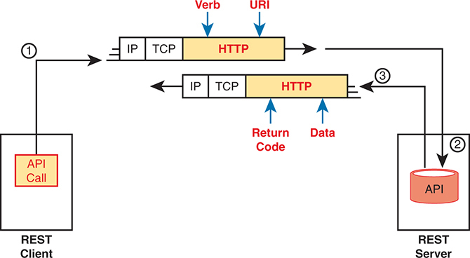


The process begins with the R E S T client making an A P I call, represented by a box labeled A P I Call. This call is sent over the network, passing through several protocol layers: I P (Internet Protocol), T C P (Transmission Control Protocol), and H T T P (Hyper Text Transfer Protocol). These layers are shown in sequence, with the H T T P layer annotated with Verb and U R I to indicate the method and endpoint used in the request. The R E S T server receives the request, processes it using its A P I, and sends back a response. The server's A P I is depicted by a box labeled A P I. The response travels back through the same protocol layers (H T T P, T C P, I P) to the client, with annotations indicating Return Code and Data to represent the response status and the data returned to the client.

**Figure 23-1** *Client/Server Operation with REST*

Note

[Figure 23-1](vol2_ch23.xhtml#ch23fig01) shows the use of HTTP. While many REST APIs use HTTP, the use of HTTP is not a requirement for an API to be considered RESTful.

##### Stateless Operation

The REST [stateless](vol2_gloss.xhtml#gloss_335) operation feature dictates that the REST server does not keep data (state information) about any prior REST requests or the REST clients. With REST, the server does not keep information from one response (state information) for use in later requests and responses. Instead, the REST client maintains all state data from prior requests to choose what future REST requests it needs to make to accomplish the app's goals.

As an example, imagine a REST server that maintains a product database. If supported by the API, a REST client could use a single request for a list of products weighing less than five pounds. The REST server would not remember the first REST request, which client made the request, or the data returned in that earlier request. As a result, when the client makes subsequent API calls, it cannot ask the server to base those future responses on the data from prior requests. Instead, the client must supply any data in each subsequent request so that each REST request is self-contained and does not require state information at the server.

##### Cacheable (or Not)

To appreciate what [cacheable](vol2_gloss.xhtml#gloss_057) means, consider what happens when browsing a website. When your browser loads a new web page, the page itself contains a variety of objects (text, images, videos, audio). Some objects seldom change, so it would be better to download the object once and not download it again; in that case, the server marks that object as cacheable. For instance, a logo or other image shown on many pages of a website would almost never change and would likely be cacheable. However, the product list returned in your most recent search of the website would not be cacheable because the server would want to update and supply a new list each time you request the page.

REST APIs require that any resource requested via an API call have a clear method by which to mark the resource as cacheable or not. The goals remain the same: improve performance by retrieving resources less often (cacheable). Note that cacheable resources are marked with a timeframe so that the client knows when to ask for a new copy of the resource again.

#### Background: Data and Variables

To appreciate a few of the upcoming topics, it helps to have a basic idea about how programming languages use variables. Anyone who has done even a small amount of programming should have enough background, but for those who have not written programs before, this next topic gives you enough background about data and variables inside programs to understand the next topic.

If you have some programming experience and already know about simple variables, [list variables](vol2_gloss.xhtml#gloss_194), and [dictionary variables](vol2_gloss.xhtml#gloss_112), then feel free to skip ahead to the section "[REST APIs and HTTP](vol2_ch23.xhtml#ch23lev2sec3)."

##### Simple Variables

Applications all process data with the same general actions, starting with some kind of input. The program needs data to process, so the input process reads files, sends database queries to a database server, or makes API calls to retrieve data from another application's API. The goal: gather the data that the program needs to process to do its work.

Programs then process data by making comparisons, making decisions, creating new variables, and performing mathematical formulas to analyze the data. All that logic uses variables. For instance, a program might process data with the following logic:

If the router's G0/0 interface has a configuration setting of

**switchport mode dynamic auto**

Then gather more data to ensure that interface currently operates as a trunk rather than as an access port.

In programming, a variable is a name or label that has an assigned value. To get a general sense for programming variables, you can think of variables much like variables from algebra equations back in school. [Example 23-1](vol2_ch23.xhtml#exa23_1) shows some samples of variables of different types in a Python program (the Python language is the most popular language today for writing network automation applications). This program begins with a comment (the top three lines with triple single quotes) and then creates four variables, assigning them to different values, and prints a line of output: "The product is –12."

**Example 23-1** *Simple Python Program That Shows a Product*

[Click here to view code image](vol2_ch23_images.xhtml#f0531-01)

```
'''
Sample program to multiply two numbers and display the result
'''
x = 3
y = -4
z = 1.247
heading = "The product is "
print(heading,x*y)
```

The variables in [Example 23-1](vol2_ch23.xhtml#exa23_1) can be called *simple variables* because each variable name has a single value associated with it. Simple variables have one variable name and one associated value, so they have a simple structure.

The values of simple variables can have a variety of formats, as shown in [Example 23-1](vol2_ch23.xhtml#exa23_1). The example includes variables that contain

* Unsigned integers (x)
* Signed integers (y)
* Floating-point numbers (z)
* Text (heading)

##### List and Dictionary Variables

While simple variables have many great uses, programs need variables with more complex *data structures*. In programming, a data structure defines a related set of variables and values. For instance, Python uses list variables so that one variable name is assigned a value that is a list of values rather than a single value. You could imagine that a network automation program might want to have lists, such as a list of devices being managed, a list of interfaces on a device, or a list of configuration settings on an interface.

First, consider the variable named list1 in [Example 23-2](vol2_ch23.xhtml#exa23_2); note that the lines that begin with a # are comment lines.

**Example 23-2** *Sample List and Dictionary Variables in Python*

[Click here to view code image](vol2_ch23_images.xhtml#f0532-01)

```
# Variable list1 is a list in Python (called an array in Java)
list1 = ["g0/0", "g0/1", "g0/2"]

# Variable dict1 is a dictionary (called an associative array in Java)
dict1 = {"config_speed":'auto', "config_duplex":"auto", "config_ip":"10.1.1.1"}
```

Even if you have never seen Python code before, you can guess at some of the meaning of the list1 variable. The code assigns variable list1 to a value that itself is a list of three text strings. Note that the list could include text, unsigned integers, signed integers, and so on.

[Figure 23-2](vol2_ch23.xhtml#ch23fig02) shows the data structure behind variable list1 in [Example 23-2](vol2_ch23.xhtml#exa23_2). The variable is assigned to the list, with the list having three list elements.

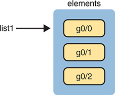


The list is labeled list 1 and contains three elements: G 0 slash 0, G 0 slash 1, and G 0 slash 2. These elements are visually represented as stacked boxes within a container labeled elements. Each element is highlighted in yellow, showing their order within the list.

**Figure 23-2** *The List Data Structure in Python*

Python supports a similar data structure called a *dictionary*. If you think of the contents of a dictionary for the English language, that dictionary lists a series of paired items: a term and a matching definition. With programming languages like Python, the dictionary data structure lists paired items as well: *keys* (like terms) and *values* (like definitions). [Figure 23-3](vol2_ch23.xhtml#ch23fig03) shows the structure of that dictionary value matching the dict1 variable at the bottom of [Example 23-2](vol2_ch23.xhtml#exa23_2). Note that each key and its value is called a [key:value pair](vol2_gloss.xhtml#gloss_190).

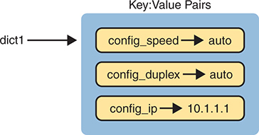


On the left side, there is an arrow labeled dict 1 pointing towards a blue box on the right, indicating that dict 1 is a dictionary object. Inside the blue box, there are three key-value pairs, each represented as a yellow rectangle with a key on the left side and a corresponding value on the right side. The first key-value pair is config underscore speed with the value auto, the second is config underscore duplex with the value auto, and the third is config underscore I P with the value 10 dot 1 dot 1 dot 1. These pairs are shown with rightward arrows connecting the keys to their respective values, demonstrating the association within the dictionary. The top of the blue box is labeled Key Pairs, emphasizing the structure of the dictionary as a collection of key-value pairs, which is a fundamental aspect of Python dictionaries used to store and retrieve data efficiently. The keys and values are shown inside rounded rectangular boxes, where the keys are prefixed with config underscore to indicate configuration parameters and the values follow to denote their respective settings.

**Figure 23-3** *Dictionary Data Structures in Python*

Data structures can get more complex. Additionally, the data structures can be nested. For instance, a single variable's value could be a list, with each list element being a dictionary, with the values in some key:value pairs being other lists, and so on. For now, be aware of the fact that programs use simple variables but also use list and dictionary variables to make it easier to perform different kinds of logic.

#### REST APIs and HTTP

APIs exist to allow two programs to exchange data. Some APIs may be designed as an interface between programs running on the same computer, so the communication between programs happens within a single operating system. Many APIs need to be available to programs that run on other computers, so an API must define the type of networking protocols supported by the API—and many REST-based APIs use the HTTP protocol.

The creators of REST-based APIs often choose HTTP because HTTP's logic matches some of the concepts defined more generally for REST APIs. HTTP uses the same principles as REST: it operates with a client/server model; it uses a stateless operational model; and it includes headers that clearly mark objects as cacheable or not cacheable. It also includes verbs—words that dictate the desired action for a pair of HTTP request and response messages—which matches how applications like to work.

This section breaks down the fundamentals of some programming terminology, how that matches HTTP verbs, and how REST APIs make use of Uniform Resource Identifiers (URIs) to specify the data desired from a RESTful API call.

##### Software CRUD Actions and HTTP Verbs

The software industry uses a memorable acronym—[CRUD](vol2_gloss.xhtml#gloss_099)—for the four primary actions performed by an application. Those actions are


**Create:** Allows the client to create some new instances of variables and data structures at the server and initialize their values as kept at the server

**Read:** Allows the client to retrieve (read) the current value of variables that exist at the server, storing a copy of the variables, structures, and values at the client

**Update:** Allows the client to change (update) the value of variables that exist at the server

**Delete:** Allows the client to delete from the server different instances of data variables

For instance, if using the northbound REST API of a Cisco DNA Center or Catalyst Center controller, as discussed in [Chapter 22](vol2_ch22.xhtml#ch22), "[Cisco Software-Defined Access (Cisco SD-Access)](vol2_ch22.xhtml#ch22)," you might want to create something new, like a new security policy. From a programming perspective, the security policy exists as a related set of configuration settings on the controller, internally represented by variables. To accomplish this, a user would leverage a compatible REST API client application such as Postman. Once the user has the client application set up with the appropriate HTTP methods necessary to communicate with Catalyst Center controller, a RESTful API call is made to "create" a new variable on the controller that represents the security policy mentioned previously. The variable or security policy that was built on the controller was performed using the Create function of the CRUD acronym.

Note

Cisco used the Cisco DNA Center controller product name for many years. In 2023, Cisco rebranded the product as the Cisco Catalyst Center controller. However, given the significant number of documents that refer to the old name and acronyms DNA and DNAC, this chapter continues to refer to the controller as the DNA Center controller.

Other examples of CRUD actions include a check of the status of that new configuration (a read action), an update to change some specific setting in the new configuration (an update action), or an action to remove the security policy definition completely (a delete action).

HTTP uses verbs that mirror CRUD actions. HTTP defines the concept of an HTTP request and response, with the client sending a request and with the server answering back with a response. Each request/response lists an action verb in the HTTP request header, which defines the HTTP action. The HTTP messages also include a URI, which identifies the resource being manipulated for this request. As always, the HTTP message is carried in IP and TCP, with headers and data, as represented in [Figure 23-4](vol2_ch23.xhtml#ch23fig04).

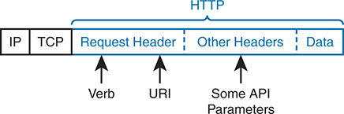


The diagram shows a packet divided into several sections. On the left, the packet starts with the I P and T C P headers, which are foundational for network communication. Following these headers, the H T T P section is depicted, starting with the Request Header labeled in blue. Within the request header, three key components are labeled: Verb, U R I, and Some A P I Parameters. The verb represents the H T T P method (such as GET, POST, etc.), the U R I (Uniform Resource Identifier) specifies the resource being requested, and the A P I parameters provide additional information for the request. The Verb is labeled with an arrow pointing downwards, indicating its position within the request header. Similarly, the U R I and Some A P I Parameters are labeled with arrows pointing downwards. Next to the request header, the Other Headers section includes any additional headers needed for the request. Finally, the Data section contains the body of the request if applicable.

**Figure 23-4** *HTTP Verb and URI in an HTTP Request Header*

To get some perspective about HTTP, ignore REST for a moment. Whenever you open a web browser and click a link, your browser generates an HTTP GET request message similar to [Figure 23-4](vol2_ch23.xhtml#ch23fig04) in structure. The message includes an HTTP header with the GET verb and the URI. The resources returned in the response are the components of a web page, like text files, image files, and video files.

HTTP works well with REST in part because HTTP has verbs that match the common program actions in the CRUD paradigm. [Table 23-2](vol2_ch23.xhtml#ch23tab02) lists the HTTP verbs and CRUD terms for easy reference and study.


**Table 23-2** Comparing CRUD Actions to REST Verbs

| Action | CRUD Term | REST (HTTP) Verb |
| --- | --- | --- |
| Create new data structures and variables | Create | POST |
| Read (retrieve) variable names, structures, and values | Read | GET |
| Update or replace values of some variable | Update | PATCH, PUT |
| Delete some variables and data structures | Delete | DELETE |

Note

While [Table 23-2](vol2_ch23.xhtml#ch23tab02) lists HTTP POST as a create action and HTTP PATCH and PUT as CRUD update actions, all three of these HTTP verbs might be used both for create and for update actions in some cases.

##### Using URIs with HTTP to Specify the Resource

In addition to using HTTP verbs to perform the CRUD functions for an application, REST uses URIs to identify what resource the HTTP request acts on. For REST APIs, the resource can be any one of the many resources defined by the API. Each resource contains a set of related variables, defined by the API and identified by a URI.

For instance, imagine a user creates a REST-based API. When doing so, the user creates a set of resources to make available via the API, and also assigns a unique URI to each resource. In other words, the API creator creates a URI and a matching set of variables, and defines the actions that can be performed against those variables (read, update, and so on).

The API creator also creates API documentation that lists the resources and the URI that identifies each resource, among other details. The programmer for a REST client application can read the API documentation, build a REST API request, and ask for the specific resource, as shown in the example in [Figure 23-5](vol2_ch23.xhtml#ch23fig05).

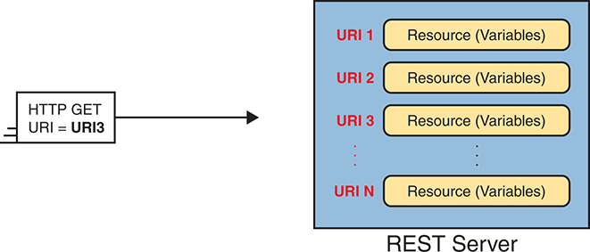


On the left, there is a box labeled H T T P GET U R I equals U R I 3, indicating a GET request for the resource identified by U R I 3. An arrow points from this box to the right, leading to a larger blue box labeled R E S T Server. Inside the R E S T Server box, multiple yellow rectangles represent different resources or variables. Each resource is associated with a unique U R I, listed on the left side of each rectangle. The U R Is are sequentially labeled as U R I 1, U R I 2, U R I 3, up to U R I N, indicating multiple distinct endpoints available on the server. Each U R I points to a specific resource or set of variables that can be accessed or manipulated via the A P I. This setup illustrates the R E S Tful principle of using U R Is to uniquely identify resources, allowing clients to perform operations on these resources through standard H T T P methods such as GET, POST, PUT, and DELETE.

**Figure 23-5** *One URI for Each API Resource—Conceptual View*

[Figure 23-5](vol2_ch23.xhtml#ch23fig05) shows generic URI values; however, today's network engineers need to be able to read API documentation, see URIs in that documentation, and understand the meaning of each part of the URI. [Figure 23-6](vol2_ch23.xhtml#ch23fig06) shows a URI specific to the Cisco DNA Center northbound REST API as an example of some of the components of the URI.


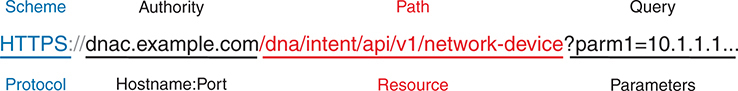


The complete U R I shown is H T T P S colon slash slash d n a c dot example dot com slash d n a slash intent slash a p i slash v 1 slash network hyphen device question mark parm equals 10 dot 1 dot 1 dot 1. The U R I is divided into distinct components with corresponding labels: the Scheme or Protocol is H T T P S, shown in blue; the Authority is d n a c dot example dot com, representing the hostname and port, shown in black; the Path is /d n a slash intent slash a p i slash v 1 slash network hyphen device, representing the resource path, highlighted in red; and the Query is ?parm equals 10 dot 1 dot 1 dot 1, which includes the parameters, shown in black. The labels at the bottom of the image specify: Protocol corresponds to H T T P S; Hostname hyphen Port corresponds to d n a c dot example dot com; Resource corresponds to /d n a slash intent slash a p i slash v 1 slash network hyphen device; and Parameters corresponds to ?parm equals 10 dot 1 dot 1 dot 1. This breakdown provides a comprehensive understanding of each part of the U R I, emphasizing how to structure a R E S Tful A P I request correctly.

**Figure 23-6** *URI Structure for REST GET Request*

The URI has a defined format as detailed in RFC 3986. The top of [Figure 23-6](vol2_ch23.xhtml#ch23fig06) lists the formal terms from the RFC. It also lists the more common terms used for those fields in some REST API documentation and tools.

* **Scheme (Protocol):** The HTTPS letters before the :// identify the scheme or protocol used—in this case, HTTP Secure (which uses HTTP with SSL encryption).
* **Authority (Host:Port):** This value sits between the // and first /, identifying the authority, which most people call the host. The authority field can list the hostname or IP address and, optionally, a transport port number. (If using a hostname, the REST client must perform name resolution to learn the IP address of the REST server.)
* [Path (Resource)](vol2_gloss.xhtml#gloss_355)**:** This value sits after the first / and finishes either at the end of the URI or before any additional fields (like a query field). The field uniquely identifies the resource as defined by the API. For REST, you can think of this field as data, passed from the client to the server, to identify the data referenced in the request.
* [Query (Parameter)](vol2_gloss.xhtml#gloss_356)**:** This value sits after the first ? at the end of the path. Following the ?, the query field allows the assignment of values to the variable names so that the URI passes data.

A tour of the API documentation for any REST-based API reveals much about the purpose and meaning of the path and query fields. For instance, [Figure 23-7](vol2_ch23.xhtml#ch23fig07) shows a copy of one doc page from the Cisco Catalyst Center API documentation. (To see for yourself, go to <https://developer.cisco.com> and search for "Cisco Catalyst Center API documentation.")

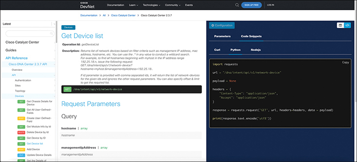


The screen is divided into two main sections: the left navigation pane and the main content area. The left navigation pane includes the title Cisco Catalyst Center, a search bar with the placeholder Search, section headers Guides and A P I Reference, and various links under A P I Reference including Overview, Authentication, and Network Device, with the Network Device section expanded to show options such as Get Device list. The main content area features the title Get Device list and the subheading Operation I D: get Network Device, providing details about the A P I call to get a list of network devices managed by Cisco D N A Center. The query parameters section details specific parameters such as hostname and management I P Address. An example request section displays a Python code snippet demonstrating how to make the A P I request, including necessary headers and the GET request U R L. This page provides all necessary details for developers to understand and use the A P I to list network devices, including a practical example of how to implement the A P I call.

**Figure 23-7** *Cisco Catalyst Center API Doc Page for the Network Device (List) Resource*

The API documentation identifies the path (resource) to use in a URI to ask for specific information. For instance, an API GET request, using the path listed at the top of [Figure 23-7](vol2_ch23.xhtml#ch23fig07), asks the Cisco Catalyst Center for a list of all known devices, with Cisco Catalyst Center returning a dictionary of values for each device.

That same API documentation also lists the query parameters to refine the REST request further. For instance, instead of a list of all network devices, you might want a dictionary of values for only one device. The lower left part of [Figure 23-7](vol2_ch23.xhtml#ch23fig07) lists some of the available query parameters with this API call, which allows for just that by tacking on the following to the end of the URI:

[Click here to view code image](vol2_ch23_images.xhtml#f0537-01)

```
?managementIPAddress=10.10.22.66&macAddress=f8:7b:20:67:62:80
```

#### Example of REST API Call to Cisco Catalyst Center

To pull some of the REST API concepts together, the next few pages work through a few sample API calls using a software application called an API development environment tool.

For a bit of development perspective, when working to automate some part of your network operation tasks, you would eventually use a program that made API calls. However, early in the process of developing an application, you might first focus on the data available from the API and ignore all the programming details at first. API development environments let you focus on the API calls. Later, that same tool can typically generate correct code that you can copy into your program to make the API calls.

The examples in this section use an app named Postman. Postman can be downloaded for free ([www.postman.co](http://www.postman.co)) and used as shown in this section. Note that Cisco DevNet makes extensive use of Postman in its many labs and examples.

When leveraging APIs to communicate with any software platform, application, or controller, it is important to think through what you are trying to accomplish—for example, if you wanted to use an API call to Cisco Catalyst Center to pull down an inventory of devices within the controller.

Think of making any API call to the destination application or controller like connecting to any other device in your network environment. There is an important step that must be followed to gain access to the software application or controller, and that is to authenticate. Programmatically interacting with these platforms is no different than you logging into a router from the CLI and typing in your credentials. This means that you first must authenticate to the device you're trying to connect to via API. However, there are exceptions to this rule; if the software is not secured it might not require authentication before manipulation. This is very rare and typically not seen on anything that can make changes to your network environment.

There are many different authentication methods for APIs, such as API keys, JSON Web Token (JWT), TLS/SSL client certificates, basic authentication, Java session IDs or cookies, and so on. Using Cisco Catalyst Center as an example, let's take a look at the documentation for the authentication or token API and what method is used to authenticate.

Note

This section focuses only on basic authentication because it is the current method of authentication used on Cisco Catalyst Center.

[Figure 23-8](vol2_ch23.xhtml#ch23fig08) showcases the Cisco Catalyst Center API reference on [developer.cisco.com](http://developer.cisco.com). Notice that the first API call available in the list on the left side of the screen is the Authentication API. The way this works is that once you successfully authenticate to Cisco Catalyst Center using an HTTP POST request method to send the login credentials, you then will receive a token, which is a Base64-encoded string of the username and password. Notice the text that says

"Description: API to obtain an access token, which remains valid for 1 hour. The token obtained using this API is required to be set as value to the X-Auth-Token HTTP Header for all API calls to Cisco DNA Center."

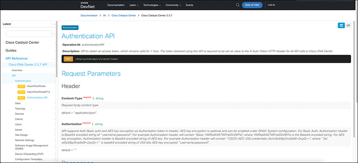


The screen is divided similarly into two main sections: the left navigation pane and the main content area. The left navigation pane includes the title Cisco Catalyst Center, a search bar with the placeholder Search, section headers Guides and A P I Reference, and various links under A P I Reference including Overview, Authentication, and Network Device, with the Authentication section selected. The main content area features the title Authentication A P I and the subheading Operation I D: post Auth Token, providing details about obtaining an authentication token for making subsequent A P I calls. The request parameters section details required headers such as Content hyphen Type and Authorization. Parameters include Content hyphen Type (Type: string, Required: true, Example: application slash json) and Authorization (Type: string, Required: true, Example: Basic <credentials>). An example request section displays a Python code snippet demonstrating how to obtain an authentication token. This A P I reference page provides detailed instructions on how to authenticate and obtain a token necessary for making secure A P I calls, ensuring developers have the information they need to access Cisco Catalyst Center services.

**Figure 23-8** *Cisco Catalyst Center API Reference on [developer.cisco.com](http://developer.cisco.com)*

This is stating that this API is used to authenticate to the controller, and something called an X-Auth-Token needs to be passed to the controller for all subsequent API calls after you have authenticated and received the token.

This means that once you authenticate and receive the token from Cisco Catalyst Center, you will then have to send that token back to Cisco Catalyst Center as an X-Auth-Token for all subsequent API calls you do after you initially authenticate. An example of this is done using an HTTP GET request to pull down the data or inventory from Cisco Catalyst Center.

Now that you understand where to find the API documentation, let's review the steps that you must authenticate to Cisco Catalyst Center and retrieve the token.

First, you must use the Authentication API to log in to the Cisco Catalyst Center and receive a token before you can make any subsequent API calls, such as pulling a device inventory from the controller. Let's look at how to authenticate using Postman. [Figure 23-9](vol2_ch23.xhtml#ch23fig09) illustrates the proper setup for Postman to authenticate to Cisco Catalyst Center. The following information is used to set up Postman:

* URI for Authentication API: <https://sandboxdnac2.cisco.com/dna/system/api/v1/auth/token>
* HTTP POST request method
* Basic authorization
* Username and password: devnetuser / Cisco123!

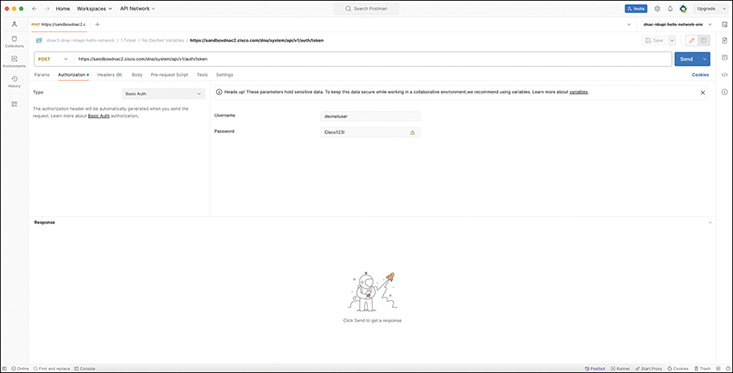


At the top, the browser window displays standard menu options like File, Edit, View, and Help, with the U R L H T T P S colon slash slash sandbox d n a c 2 dot cisco dot com slash d n a slash system slash a p i slash v 1 slash auth slash token entered in the U R L bar. Below the U R L bar, the active request method is set to POST and highlighted in orange. The current tab in focus is the Authorization tab, indicated by an orange underline, with a green dot and the text Authorization followed by a gray dot and the text Headers (9). The authorization type is set to Basic Auth, as seen in the Type drop-down menu. Below this menu, there is an information box stating, The authorization header will be automatically generated when you send the request. Learn more about Basic Auth authorization. Two input fields are present under the information box: Username and Password, filled with devnetuser and Cisco123! respectively. To the right of the password field, a small yellow triangle with an exclamation mark indicates a warning about the entered password. In the upper right corner, there are buttons for Save (grey) and Send (blue), with the send button intended to execute the A P I request. Below the request configuration area, the response section is currently empty, as indicated by the text Click Send to get a response below an illustration of a robot holding a flag with a rocket. To the left side, there are various navigation options, including Collections, Environments, and History, which are partially visible. The browser's address bar and window control buttons are visible at the very top, alongside the Postman application name, and the interface also includes buttons for Invite and Upgrade at the top right.

**Figure 23-9** *Postman Setup for Cisco Catalyst Center Authentication API*

Now Postman is set up to authenticate, click the Send button to issue the API call to Cisco Catalyst Center. [Figure 23-10](vol2_ch23.xhtml#ch23fig10) displays the response from Cisco Catalyst Center, along with the token and an HTTP status code of 200 OK, indicating the authentication was successful.

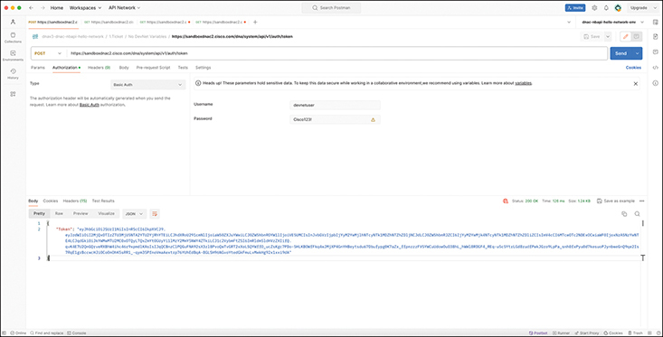


At the top, the browser window displays standard menu options such as File, Edit, View, and Help, with the U R L H T T P S colon slash slash sandbox d n a c 2 dot cisco dot com slash d n a slash system slash a p i slash v 1 slash auth slash token entered in the U R L bar. The request method is set to POST and highlighted in orange. The active tab is Authorization, as indicated by an orange underline, with Basic Auth selected in the Type drop-down menu. Below this menu, an information box states, The authorization header will be automatically generated when you send the request. Learn more about Basic Auth authorization. Two input fields are present under the information box: Username and Password, filled with devnetuser and Cisco123! respectively, with a yellow triangle warning icon next to the password field. In the upper right corner, there are buttons for Save (grey) and Send (blue), with the send button intended to execute the A P I request. Below the request configuration area, the response section is displayed, showing the Body tab active and the response format set to Pretty and J S O N. The J S O N response contains a single key Token with a long string value representing the authentication token. The response details at the bottom right indicate the status is 200 OK, the time taken is 126 milliseconds, and the size of the response is 1.24 kilobytes. There are options to Save as example and a small gear icon for settings. The illustration of a robot holding a flag remains at the bottom of the screen, indicating that the response has been received successfully. To the left side, there are various navigation options including Collections, Environments, and History, which are partially visible. The browser's address bar and window control buttons are at the top, alongside the Postman application name, and the interface includes buttons for Invite and Upgrade at the top right.

**Figure 23-10** *Execution of Cisco Catalyst Center Authentication API in Postman*

You use the token that was received to pass on to Cisco Catalyst Center to pull down the device inventory via an API. Looking back to the API documentation, you can see an API called Network-Device. This is the API to pull a device inventory from the Cisco Catalyst Center controller. [Figure 23-11](vol2_ch23.xhtml#ch23fig11) highlights the specifics of how to use the Network-Device API from the documentation on the DevNet website. Notice, however, that the URI is different for subsequent API calls versus what was used for the Authentication API. Compare the two following URIs:

* **Authentication URI:** <https://sandboxdnac2.cisco.com/dna/system/api/v1/auth/token>
* **Network-Device URI:** <https://sandboxdnac2.cisco.com/dna/intent/api/v1/network-device>

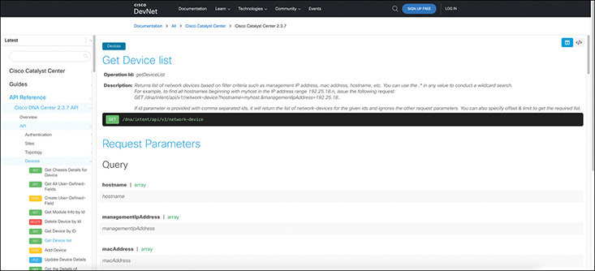


The screenshot includes the following elements: At the top, there is a black navigation bar with options such as Documentation, Learn, Technologies, Community, and Events. There is also a Sign Up Free button and a Log In button on the right side of the navigation bar. Below the navigation bar, there is a breadcrumb navigation path that reads Documentation greater than All greater than Cisco Catalyst Center greater than Cisco Catalyst Center 2 dot 3 dot 7. On the left side of the screen, there is a sidebar titled Cisco Catalyst Center with expandable sections. The A P I Reference section is expanded, showing subcategories including Overview, A P I, Authentication, Sites, Topology, and Devices. Within the Devices section, several A P I endpoints are listed with different H T T P methods such as GET, POST, DELETE, and PUT. The currently selected endpoint is Get Device list, highlighted in blue. The main content area has the title Get Device list followed by details about the operation. The operation I D is get Device List. The description states that this endpoint returns a list of network devices based on filter criteria such as management I P address, M A C address, and hostname. An example GET request is provided: GET slash d n a slash intent slash a p i slash v 1 slash network hyphen device question mark hostname equals myhost dot and management I P Address equals 192 dot 25 dot 18 dot . If the I D parameter is provided with comma-separated I Ds, it will return the list of network devices for the given I Ds and ignore other request parameters. Users can also specify offset and limit to get the required list. A green code block contains the example GET request: GET slash d n a slash intent slash a p i slash v 1 slash network hyphen device. Below the main description, there is a section titled Request Parameters which details the query parameters available for this A P I endpoint. The parameters listed include hostname (array), management I P Address (array), and mac Address (array), each with a brief description.

**Figure 23-11** *Documentation for Cisco Catalyst Center Network-Device API*

Now that you know how to use the API by reviewing the documentation, let's demonstrate how this is done in Postman. [Figure 23-12](vol2_ch23.xhtml#ch23fig12) displays the appropriate steps for using the existing token that was received via the authentication API completed earlier. In addition, the figure shows how to simply type the word X-Auth-Token into the key field under the Headers tab, then paste the token information into the Value field and ensure the appropriate URI for the Network-Device API call is being used. Once this is all confirmed, you can then issue the GET API call to Cisco Catalyst Center and pull down the device inventory.

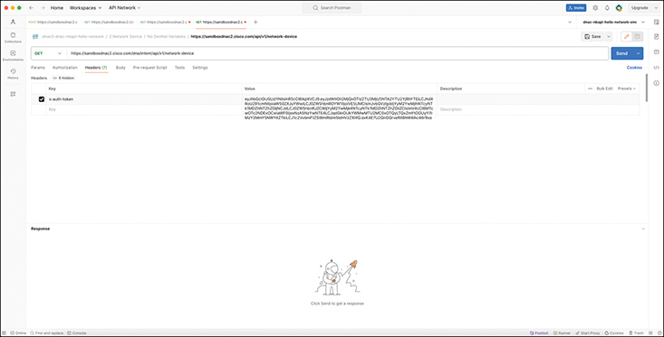


At the top, the Postman application interface is visible with several navigational tabs such as Home, Workspaces, and A P I Network. The U R L field is filled with H T T P S colon slash slash sandbox d n a c 2 dot cisco dot com slash a p i slash v 1 slash network hyphen device and the H T T P method is set to GET. Below the U R L field, there are tabs labeled Params, Authorization, Headers, Body, Pre-request Script, Tests, and Settings. The Headers tab is selected, showing an entry for the header key x hyphen auth hyphen token with a long token string as its value. The body of the response section is empty, indicated by a placeholder image of a cartoon astronaut holding a flag and a message saying, Click Send to get a response.

**Figure 23-12** *Postman Setup for Cisco Catalyst Center Network-Device API*

Following the same procedure done with the authentication API, click the Send button and issue the API call to Cisco Catalyst Center. In [Figure 23-13](vol2_ch23.xhtml#ch23fig13), you can see the inventory was successfully pulled down via API. You can also see the list of network devices in the response section of Postman. Also note that the HTTP status code of 200 OK is present again. The resource part of the URI shows the same resource listed earlier in [Figure 23-6](vol2_ch23.xhtml#ch23fig06), asking for a list of devices.

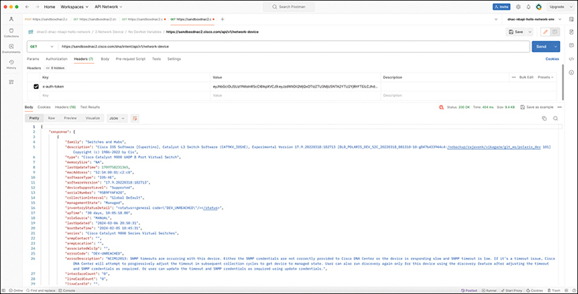


At the top of the interface, several tabs are visible, including Home, Workspaces, and A P I Network. Below these tabs, the U R L bar contains the endpoint H T T P S colon slash slash sandbox d n a c 2 dot cisco dot com slash a p i slash v 1 slash network hyphen device with the GET method selected, indicating that this is a GET request to retrieve network device information. To the right of the U R L bar, there are options to Save the request, Send the request, and other actions like Pre-request Script and Tests. The Headers tab is open, revealing six hidden headers, with a key named x hyphen auth hyphen token displayed. In the main section of the interface, the Body tab is open, showing the response in Pretty J S O N format. The J S O N response contains a detailed object with a response array. The array includes an object with various attributes such as family (Switches and Hubs), description (providing detailed software information), type (Cisco Catalyst 9000 U A P 8 Port Virtual Switch), and memory Size (N A). Other attributes include last Update Time (a timestamp), mac Address (52 colon 54 colon 00 colon 81 colon c 2 colon 00), software Type (I O S hyphen X E), software Version (17 dot 9 dot 20220318 colon 182713), and device Support Level (Supported). Additional fields include serial Number (9 S 9 B Y F 4 A 20 J), collection Interval (Global Default), management State (Managed), and inventory Status Detail (indicating a device status code). The uptime of the device is listed as 30 days, 10 colon 05 colon 18 dot 00, with a role source marked as MANUAL. Dates for the last update and notifications are also included, along with series information (Cisco Catalyst 9000 Series Virtual Switches) and S N M P details. Errors related to S N M P timeouts are noted, with an error code of D E V hyphen U N R E A C H E D and a detailed error description. At the bottom of the Body section, additional tabs such as Cookies, Headers, and Test Results are visible. The Headers tab includes sixteen items, providing detailed information about the H T T P headers of the response. The status of the response is displayed as 200 OK, with a time of 404 milliseconds and a size of 9.4 kilobytes. The interface also includes navigation options on the left sidebar, such as Collections, Environments, History, and more, allowing users to manage and organize their A P I requests and responses.

**Figure 23-13** *Execution of Cisco DNA Center Network-Device API in Postman*

Note

[sandboxdnac2.cisco.com](http://sandboxdnac2.cisco.com) is an always-on Cisco DNA Center instance available on the Cisco DevNet website. There is no cost to use this resource.

Take a moment to look through the data at the bottom of the Postman window in [Figure 23-13](vol2_ch23.xhtml#ch23fig13). The text follows a data modeling format called JavaScript Object Notation (JSON), which is one of the main topics for the remainder of the chapter. However, armed with just a knowledge of routers, you can find a few facts that look familiar. To help you see the text, [Example 23-3](vol2_ch23.xhtml#exa23_3) shows an edited (shortened to reduce the length) view of some of the JSON output in that window, just so you can see the format and some of the data returned in this single API call.

**Example 23-3** *JSON Output from a REST API Call*

[Click here to view code image](vol2_ch23_images.xhtml#f0541-01)

```
{
    "response": {
         "family": "Switches and Hubs",
        "type": "Cisco Catalyst 9000 UADP 8 Port Virtual Switch",
        "macAddress": "52:54:00:01:c2:c0",
        "softwareType": "IOS-XE",
        "softwareVersion": "17.9.20220318:182713",
        "serialNumber": "9SB9FYAFA2O",
        "upTime": "30 days, 10:05:18.00",
        "series": "Cisco Catalyst 9000 Series Virtual Switches",
        "hostname": "sw1.ciscotest.com",
        "managementIpAddress": "10.10.20.175",
        "platformId": "C9KV-UADP-8P",
        "role": "CORE"
    }
}
```

API development tools like Postman help you work out the particulars of each API call, save the details, and share with other engineers and developers. Eventually, you will be ready to make the API call from a program. With a simple click from the Postman UI, Postman supplies the code to copy/paste into your program so that it returns all the output shown in the center/bottom of the window back as a variable to your program.

By now, you have a good foundational knowledge of the mechanics of REST APIs. By learning some skills, and using the API documentation for any REST API, you could now experiment with and try to make REST API calls. For many of those, the data will return to you as text, often in JSON format, so the second half of the chapter examines the meaning of that text.

### Data Serialization and JSON

In your journey to become a modern network engineer with network automation skills, you will learn to understand several [data serialization languages](vol2_gloss.xhtml#gloss_101). Each data serialization language provides methods of using text to describe variables, with a goal of being able to send that text over a network or to store that text in a file. Data serialization languages give us a way to represent variables with text rather than in the internal representation used by any particular programming language.

Each data serialization language enables API servers to return data so that the API client can replicate the same variable names as well as data structures as found on the API server. To describe the data structures, the data serialization languages include special characters and conventions that communicate ideas about list variables, dictionary variables, and other more complex data structures.

This second major section of the chapter examines the concept of a data serialization language, with a focus on the one data modeling language as mentioned in the current CCNA blueprint: [JavaScript Object Notation (JSON)](vol2_gloss.xhtml#gloss_187).

#### The Need for a Data Model with APIs

This section shows some ideas of how to move variables in a program on a server to a client program. First, [Figure 23-14](vol2_ch23.xhtml#ch23fig14) and surrounding text show a nonworking example as a way to identify some of the challenges with copying variable values from one device to another. Later, [Figure 23-15](vol2_ch23.xhtml#ch23fig15) and its related text show how to use a data serialization language to solve the problems shown around [Figure 23-14](vol2_ch23.xhtml#ch23fig14).

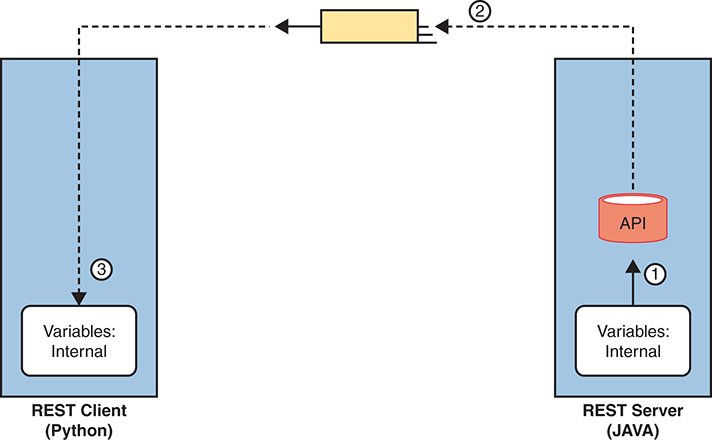


On the left side, there is a blue rectangular box labeled REST Client (Python) which contains a smaller white box with the text Variables: Internal. A dotted arrow labeled with the number 3 points downwards towards this white box. On the right side, there is another blue rectangular box labeled REST Server (J A V A) containing a similar white box with the text Variables: Internal. Above this white box, there is a red cylinder labeled A P I. An arrow labeled with the number 1 points upwards towards the A P I from the white box. Between the two blue boxes, there is a yellow rectangle with arrows labeled 2 pointing both left and right, indicating data exchange. The broken concept depicted here involves the direct exchange of internal variable representations between the client and server, which is generally not recommended in RESTful architecture.

**Figure 23-14** *Broken Concept: Exchanging Internal Representations of Variables*

First, for the nonworking example, consider the flow and numbered steps in [Figure 23-14](vol2_ch23.xhtml#ch23fig14). A REST client sits on the left. The REST client asks for a resource, and the server needs to reply. In REST, a resource is a set of variables as defined by the API, so the REST server needs to return a set of variables to the REST client on the left. The steps in the figure run as follows:

1. The REST server (a JAVA application) takes a copy of the stored variables in RAM (step 1) in response to the REST request.
2. The REST API code creates the REST response and sends it over the network, placing an exact replica of what the REST server had in RAM to represent the variables in that resource.
3. The REST client (a Python application) receives the REST response message, storing the exact same bits and bytes into its RAM, in an attempt to have a copy of the variables, data, and data structures on the server.

The process shown in [Figure 23-14](vol2_ch23.xhtml#ch23fig14) does not work (and is not attempted) because the REST client programs may not store variables in the same ways. First, programs written in different languages use different conventions to store their variables internally because there is no standard for internal variable storage across languages. In fact, programs written in the same language but with different versions of that language may not store all their variables with the same internal conventions.

To overcome these issues, applications need a standard method to represent variables for transmission and storage of those variables outside the program. *Data serialization languages* provide that function.

[Figure 23-15](vol2_ch23.xhtml#ch23fig15) shows the correct process flow in comparison to [Figure 23-14](vol2_ch23.xhtml#ch23fig14) with the data serialization process included:

1. The server collects the internally represented data and gives it to the API code.
2. The API converts the internal representation to a data model representing those variables (with JSON shown in the figure).
3. The server sends the data model in JSON format via messages across the network.
4. The REST client takes the received data and converts the JSON-formatted data into variables in the native format of the client application.


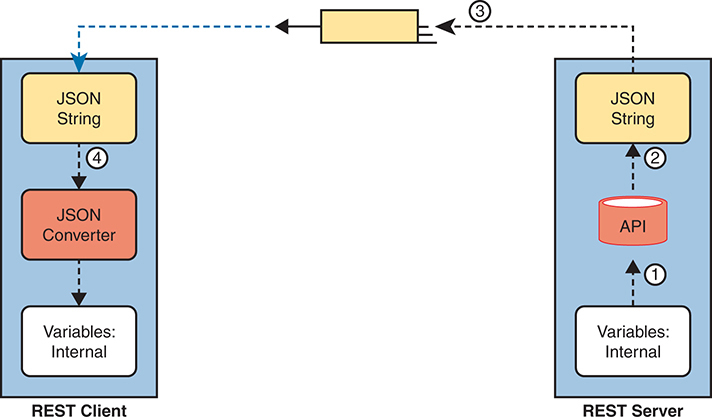


On the left side of the image, labeled REST Client, there is a blue vertical rectangle divided into three sections. The top section contains a yellow box labeled J S O N String. Below this, there is an orange box labeled J S O N Converter with a downward arrow pointing towards the bottom section, which contains a white box labeled Variables: Internal. On the right side of the image, labeled REST Server, there is a similar blue vertical rectangle also divided into three sections. The top section contains a yellow box labeled J S O N String. Below this, there is a red box labeled A P I with an upward arrow pointing towards the bottom section, which contains a white box labeled Variables: Internal. The communication process between the REST Client and REST Server is depicted with numbered steps and arrows. Step 1 starts at the Variables: Internal box in the REST Server, indicating the data being prepared internally. Step 2 shows the data being sent to the A P I box and then converted into a J S O N String. Step 3 is represented by a dashed line with arrows indicating the J S O N String being transmitted from the REST Server to the REST Client. Finally, step 4 depicts the J S O N String being received by the REST Client and converted by the J S O N Converter back into internal variables.

**Figure 23-15** *Correct Concept: Exchanging Internal Representations of Variables*

At the end of the process, the REST client application now has equivalent variables to the ones it requested from the server in the API call. Note that the final step—to convert from the data serialization language to the native format—can be as little as a single line of code!

Finally, note that while data serialization languages like JSON enable applications to exchange variables over a network, applications can also store data in JSON format.

#### Data Serialization Languages

You will hear about and eventually use several data serialization and data modeling languages the more you learn about network automation. While the current CCNA blueprint mentions only JSON, learning a few facts about some of the alternatives can be helpful to add a little context to your new knowledge of JSON. These different data serialization languages exist to meet different needs that have arisen over the years. This next short section highlights four such languages.

Note

The terms *data serialization language* and *data modeling language* should be considered equivalent for the purposes of this section.

##### JSON

JavaScript Object Notation attempts to strike a balance between human and machine readability. Armed with a few JSON rules, most humans can read JSON data, move past simply guessing at what it means, and confidently interpret the data structures defined by the JSON data. At the same time, JSON data makes it easy for programs to convert JSON text into variables, making it very useful for data exchange between applications using APIs.

You can find the details of JSON in IETF RFC 8259 and in a number of sites found with Internet searches, including [www.json.org](http://www.json.org).

##### XML

Back in the 1990s, when web browsers and the World Wide Web (WWW) were first created, web pages primarily used Hypertext Markup Language (HTML) to define web pages. As a markup language, HTML defined how to add the text or a web page to a file and then add "markup"—additional text to denote formatting details for the text that should be displayed. For instance, the markup included codes for headings, font types, sizes, colors, hyperlinks, and so on.

The [eXtensible Markup Language (XML)](vol2_gloss.xhtml#gloss_382) came later to make some improvements for earlier markup languages. In particular, over time web pages became more and more dynamic, and to make the pages dynamic, the files needed to store variables whose values could be changed and replaced over time by the web server. To define variables to be substituted into a web page, the world needed a markup language that could define data variables. XML defines a markup language that has many features to define variables, values, and data structures.

Over time, XML has grown beyond its original use as a markup language. XML's features also make it a useful general data serialization language, and it is used as such today.

While keeping human readability in mind, the creators of XML opted for less emphasis on human readability (as compared to JSON) to gain better features for computer processing. For instance, like HTML, XML uses beginning and ending tags for each variable, as seen in [Example 23-4](vol2_ch23.xhtml#exa23_4). In the highlighted line in the example, the <macAddress> and </macAddress> tags denote a variable name, with the value sitting between the tags.

**Example 23-4** *XML Output from a REST API Call*

[Click here to view code image](vol2_ch23_images.xhtml#f0545-01)

```
<?xml version="1.0" encoding="UTF-8"?>
<root>
   <response>
      <family>Switches and Hubs</family>
      <hostname>cat_9k_1</hostname>
      <interfaceCount>41</interfaceCount>
      <lineCardCount>2</lineCardCount>
      <macAddress>f8:7b:20:67:62:80</macAddress>
      <managementIpAddress>10.10.22.66</managementIpAddress>
      <role>ACCESS</role>
      <serialNumber>FCW2136L0AK</serialNumber>
      <series>Cisco Catalyst 9300 Series Switches</series>
      <softwareType>IOS-XE</softwareType>
      <softwareVersion>16.6.1</softwareVersion>
      <type>Cisco Catalyst 9300 Switch</type>
      <upTime>17 days, 22:51:04.26</upTime>
   </response>
</root>
```

##### YAML

[YAML Ain't Markup Language (YAML)](vol2_gloss.xhtml#gloss_383) has a clever recursive name, but the name does tell us something. YAML does not attempt to define markup details (while XML does). Instead, YAML focuses on the data model (structure) details. YAML also strives to be clean and simple: of the data serialization/modeling languages listed here, YAML is easily the easiest to read for anyone new to data models.

Ansible, one of the topics in [Chapter 24](vol2_ch24.xhtml#ch24), "[Understanding Ansible and Terraform](vol2_ch24.xhtml#ch24)," makes extensive use of YAML files. [Example 23-5](vol2_ch23.xhtml#exa23_5) shows a brief sample. And to make the point about readability, even if you have no idea what Ansible does, you can guess at some of the functions just reading the file. (Note that YAML denotes variables in double curly brackets: {{ }}.)

**Example 23-5** *YAML File Used by Ansible*

[Click here to view code image](vol2_ch23_images.xhtml#f0545-02)

```
---
# This comment line is a place to document this Playbook
- name: Get IOS Facts
  hosts: mylab
  vars:

    cli:
      host: "{{ ansible_host }}"
      username: "{{ username }}"
      password: "{{ password }}"

  tasks:
    - ios_facts:
        gather_subset: all
        provider: "{{ cli }}"
```

##### Summary of Data Serialization

As an easy reference, [Table 23-3](vol2_ch23.xhtml#ch23tab03) summarizes the data serialization languages mentioned in this section, along with some key facts.


**Table 23-3** Comparing Data Modeling Languages

| Acronym | Name | Origin/Definition | Central Purpose | Common Use |
| --- | --- | --- | --- | --- |
| JSON | JavaScript Object Notation | JavaScript (JS) language; RFC 8259 | General data modeling and serialization | REST APIs |
| XML | eXtensible Markup Language | World Wide Web Consortium ([W3C.org](http://W3C.org)) | Data-focused text markup that allows data modeling | REST APIs, Web pages |
| YAML | YAML Ain't Markup Language | [YAML.org](http://YAML.org) | General data modeling | Ansible |

#### Recognizing the Components of JSON

Cisco includes one exam topic in the CCNA 200-301 Version 1.1 blueprint that mentions JSON:

6.7 Recognize the components of JSON encoded data

You can think of that skill and task with two major branches. First, even ignoring the syntax and special characters, anyone who knows the topic can probably make intelligent guesses about the meaning of many of the key:value pairs. For example, without knowing anything about JSON syntax, you could probably determine from your prior knowledge of Cisco routers and switches that the JSON in [Example 23-6](vol2_ch23.xhtml#exa23_6) lists two devices (maybe their hostnames) and a list of interfaces on each device.

**Example 23-6** *Simple JSON That Lists a Router's Interfaces*

[Click here to view code image](vol2_ch23_images.xhtml#f0546-01)

```
{
    "R1": ["GigabitEthernet0/0", "GigabitEthernet0/1", "GigabitEthernet0/2/0"],
    "R2": ["GigabitEthernet1/0", "GigabitEthernet1/1", "GigabitEthernet0/3/0"]
}
```

Honestly, you probably already know everything needed to do this kind of intelligent guessing. However, to perform the second type of task, where you analyze the JSON data to find the data structures, including objects, lists, and key:value pairs, you need to know a bit more about JSON syntax. This final topic in the chapter gives you the basic rules, with some advice on how to break down JSON data.

##### Interpreting JSON Key:Value Pairs

First, consider these rules about key:value pairs in JSON, which you can think of as individual variable names and their values:


* **Key:Value Pair:** Each and every colon identifies one key:value pair, with the key before the colon and the value after the colon.
* **Key:** Text, inside double quotes, before the colon, used as the name that references a value.
* **Value:** The item after the colon that represents the value of the key, which can be

  * **Text:** Listed in double quotes.
  * **Numeric:** Listed without quotes.
  * **Array:** A special value (more details later).
  * **Object:** A special value (more details later).
* **Multiple Pairs:** When listing multiple key:value pairs, separate the pairs with a comma at the end of each pair (except the last pair).

To work through some of these rules, consider [Example 23-7](vol2_ch23.xhtml#exa23_7)'s JSON data, focusing on the three key:value pairs. The text after the example provides analysis.

**Example 23-7** *One JSON Object (Dictionary) with Three Key:Value Pairs*

```
{
    "1stbest": "Messi",
    "2ndbest": "Ronaldo",
    "3rdbest": "Maradona"
}
```

As an approach, just find each colon, and look for the quoted string just before each colon. Those are the keys ("1stbest", "2ndbest", and "3rdbest".) Then look to the right of each colon to find their matching values. You can know all three values are text values because JSON lists the values within double quotes.

As for other special characters, note the commas and the curly brackets. The first two key:value pairs end with a comma, meaning that another key:value pair should follow. The curly brackets that begin and end the JSON data denote a single JSON object (one pair of curly brackets, so one object). JSON files and JSON data exchanged over an API exist first as a JSON object, with an opening (left) and closing (right) curly bracket as shown.

##### Interpreting JSON Objects and Arrays

To communicate data structures beyond a key:value pair with a simple value, JSON uses [JSON objects](vol2_gloss.xhtml#gloss_189) and [JSON arrays](vol2_gloss.xhtml#gloss_188). Objects can be somewhat flexible, but in most uses, they act like a dictionary. Arrays list a series of values.

Note

Python, the most common language to use for network automation, converts JSON objects to Python dictionaries, and JSON arrays to Python lists. For general conversation, many people refer to the JSON structures as dictionaries and lists rather than as objects and arrays.

To begin, consider this set of rules about how to interpret the syntax for JSON objects and arrays:


* **{ }—Object:** A series of key:value pairs enclosed in a matched pair of curly brackets, with an opening left curly bracket and its matching right curly bracket.
* **[ ]—Array:** A series of values (not key:value pairs) enclosed in a matched pair of square brackets, with an opening left square bracket and its matching right square bracket.
* **Key:value pairs inside objects:** All key:value pairs inside an object conform to the earlier rules for key:value pairs.
* **Values inside arrays:** All values conform to the earlier rules for formatting values (for example, double quotes around text, no quotes around numbers).

[Example 23-8](vol2_ch23.xhtml#exa23_8) shows a single array in JSON format. Notice the JSON data begins with a [ and then lists three text values (the values could have been a mix of values). It then ends with a ].

**Example 23-8** *A JSON Snippet Showing a Single JSON Array (List)*

```
[
     "Messi",
     "De Bruyne",
     "Pedri"
]
```

While [Example 23-8](vol2_ch23.xhtml#exa23_8) shows only the array itself, JSON arrays can be used as a value in any key:value pair. [Figure 23-16](vol2_ch23.xhtml#ch23fig16) does just that, shown in a graphic to allow easier highlighting of the arrays and object. The JSON text in the figure includes two arrays (lists) as values (each found just after a colon, indicating they are values).

Now think about the entire structure of the JSON data in [Figure 23-16](vol2_ch23.xhtml#ch23fig16). It has a matched pair of curly brackets to begin and end the text, encapsulating one object. That object contains two colons, so there are two key:value pairs inside the object. When you think about the broader structure, as depicted in [Figure 23-17](vol2_ch23.xhtml#ch23fig17), this JSON file has one JSON object, itself with two key:value pairs. (Note that [Figure 23-17](vol2_ch23.xhtml#ch23fig17) does NOT show correct JSON syntax for the lists; it instead is intended to make sure you see the structure of the one object and its two key:value pairs.)


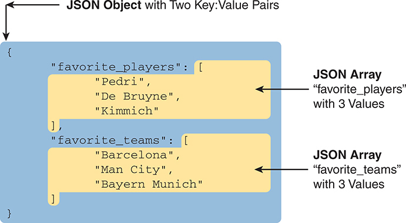


The diagram is color-coded with a blue background for the J S O N object and yellow backgrounds for the J S O N arrays. The J S O N object is labeled J S O N Object with Two Key Pairs. Within the J S O N object, there are two keys: favorite underscore players and favorite underscore teams. Each key is associated with a J S O N array. The first key, favorite underscore players, is followed by an array containing three string values: Pedri, De Bruyne, and Kimmich. This array is labeled J S O N Array 'favorite underscore players' with 3 Values, with an arrow pointing to the array. The second key, favorite underscore teams, is followed by an array containing three string values: Barcelona, Man City, and Bayern Munich. This array is labeled J S O N Array 'favorite underscore teams' with 3 Values, with another arrow pointing to the array.

**Figure 23-16** *Accurate/Complete JSON Data with One Object, Two Keys, Two JSON List Values*


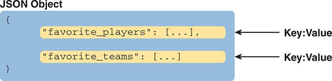


The primary J S O N Object is depicted as a blue rectangle with curly braces {} indicating the object boundaries. Inside this rectangle, there are two key-value pairs arranged vertically. The first key-value pair is represented by a yellow rectangle labeled favorite underscore players followed by a colon : and an ellipsis [...] indicating an array. An arrow points from this rectangle to a label Key on the right, explaining the structure. The second key-value pair is similarly represented by another yellow rectangle labeled favorite underscore teams followed by a colon : and an ellipsis [...] indicating another array. Another arrow points from this rectangle to a second Key label on the right.

**Figure 23-17** *Structural Representation of [Figure 23-16](vol2_ch23.xhtml#ch23fig16)'s Primary Object and Two Key:Value Pairs*

To drive home the idea of how to find JSON objects, consider the example shown in [Figure 23-18](vol2_ch23.xhtml#ch23fig18). This figure shows correct JSON syntax. It has the following:

* There is one object for the entire set because it begins and ends with curly brackets.
* The outer object has two keys (Wendells\_favorites and interface\_config).
* The value of each key:value pair is another object (each with curly brackets and three key:value pairs).

The JSON example in [Figure 23-18](vol2_ch23.xhtml#ch23fig18) shows how JSON can nest objects and arrays; that is, JSON puts one object or array inside another. Much of the JSON output you will see as you learn more and more about network automation will include JSON data with nested arrays and objects.


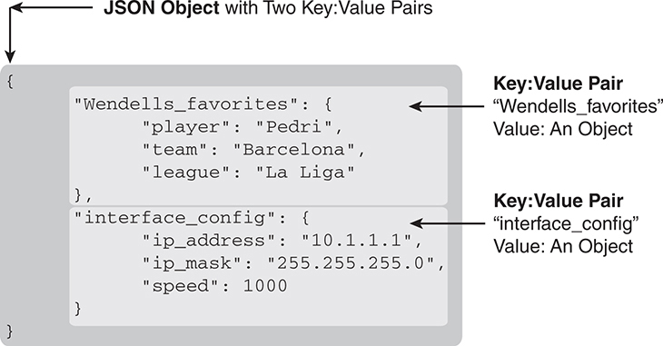


The J S O N object is visually represented with a curly brace on the left side, indicating the start of the object. The first key-value pair is labeled Wendells underscore favorites, with the key Wendells underscore favorites pointing to an object. This nested object contains three key-value pairs: player with the value Pedri, team with the value Barcelona, and league with the value La Liga. An arrow points to this nested object, emphasizing its structure within the primary J S O N object. Below this, the second key-value pair is labeled interface underscore config, with the key interface underscore config also pointing to an object. This nested object contains three key-value pairs: I P underscore address with the value 10 dot 1 dot 1 dot 1, I P underscore mask with the value 255 dot 255 dot 255 dot 0, and speed with the value 1000. Another arrow points to this nested object, illustrating its inclusion within the primary J S O N object. The entire J S O N object is enclosed in a gray shaded area, with descriptive labels and arrows clarifying the structure and components of the J S O N object and its nested objects.

**Figure 23-18** *A JSON Object, with Two Key:Value Pairs, Each Value Another Object*

##### Minified and Beautified JSON

So far, all the JSON examples show lots of empty space. JSON allows for whitespace, or not, depending on your needs. For humans, reading JSON can be a lot easier with the text organized with space and aligned. For instance, having the matched opening and closing brackets sit at the same left-offset makes it much easier to find which brackets go with which.

When stored in a file or sent in a network, JSON does not use whitespace. For instance, earlier in this section, [Example 23-7](vol2_ch23.xhtml#exa23_7) showed one JSON object with three key:value pairs, with whitespace, taking five lines. However, stored in a file, or sent over a network, the JSON would look like the following:

[Click here to view code image](vol2_ch23_images.xhtml#f0550-01)

```
{"1stbest": "Messi", "2ndbest": "Ronaldo", "3rdbest": "Maradona"}
```

Most of the tools you might use when working with JSON will let you toggle from a pretty format (good for humans) to a raw format (good for computers). You might see the pretty version literally called *pretty* or *beautified* or *spaced*, while the version with no extra whitespace might be called *minified* or *raw*.

### Chapter Review

One key to doing well on the exams is to perform repetitive spaced review sessions. Review this chapter's material using either the tools in the book or interactive tools for the same material found on the book's companion website. Refer to the "[Your Study Plan](vol2_appf.xhtml#appf)" element for more details. [Table 23-4](vol2_ch23.xhtml#ch23tab04) outlines the key review elements and where you can find them. To better track your study progress, record when you completed these activities in the second column.


**Table 23-4** Chapter Review Tracking

| Review Element | Review Date(s) | Resource Used |
| --- | --- | --- |
| Review key topics |  | Book, website |
| Review key terms |  | Book, website |
| Answer DIKTA questions |  | Book, PTP |
| Review memory tables |  | Website |
| Watch videos |  | Website |

### Review All the Key Topics


**Table 23-5** Key Topics for [Chapter 23](vol2_ch23.xhtml#ch23)

| Key Topic Element | Description | Page Number |
| --- | --- | --- |
| List | Attributes of REST APIs | [529](vol2_ch23.xhtml#page_529) |
| List | The meaning of the CRUD acronym | [533](vol2_ch23.xhtml#page_533) |
| [Table 23-2](vol2_ch23.xhtml#ch23tab02) | A comparison of CRUD actions and HTTP verbs | [534](vol2_ch23.xhtml#page_534) |
| [Figure 23-6](vol2_ch23.xhtml#ch23fig06) | Components of a URI | [535](vol2_ch23.xhtml#page_535) |
| [Figure 23-15](vol2_ch23.xhtml#ch23fig15) | The process of sending JSON data over a REST API | [543](vol2_ch23.xhtml#page_543) |
| [Table 23-3](vol2_ch23.xhtml#ch23tab03) | A comparison of JSON, XML, and YAML | [546](vol2_ch23.xhtml#page_546) |
| List | JSON rules related to key:value pairs | [547](vol2_ch23.xhtml#page_547) |
| List | JSON rules for arrays and objects | [548](vol2_ch23.xhtml#page_548) |

### Key Terms You Should Know

[cacheable](vol2_ch23.xhtml#key_335)

[CRUD](vol2_ch23.xhtml#key_336)

[data serialization language](vol2_ch23.xhtml#key_337)

[dictionary variable](vol2_ch23.xhtml#key_338)

[JSON (JavaScript Object Notation)](vol2_ch23.xhtml#key_339)

[JSON array](vol2_ch23.xhtml#key_340)

[JSON object](vol2_ch23.xhtml#key_341)

[key:value pair](vol2_ch23.xhtml#key_342)

[list variable](vol2_ch23.xhtml#key_343)

[REpresentational State Transfer (REST)](vol2_ch23.xhtml#key_344)

[REST API](vol2_ch23.xhtml#key_345)

[stateless](vol2_ch23.xhtml#key_346)

[URI path (resource)](vol2_ch23.xhtml#key_347)

[URI query (parameters)](vol2_ch23.xhtml#key_348)

[XML (eXtensible Markup Language)](vol2_ch23.xhtml#key_349)

[YAML (YAML Ain't Markup Language)](vol2_ch23.xhtml#key_350)