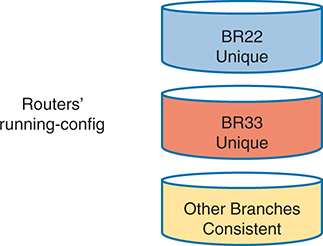
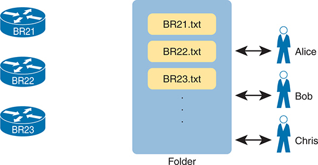
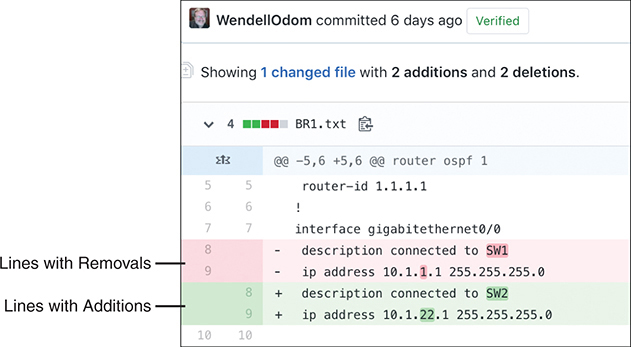
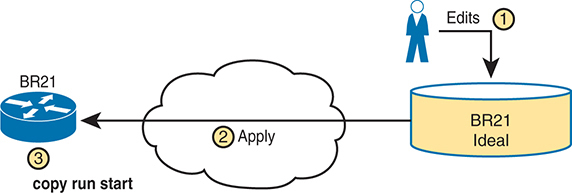
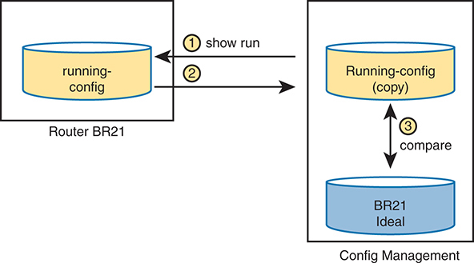
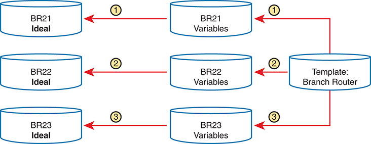
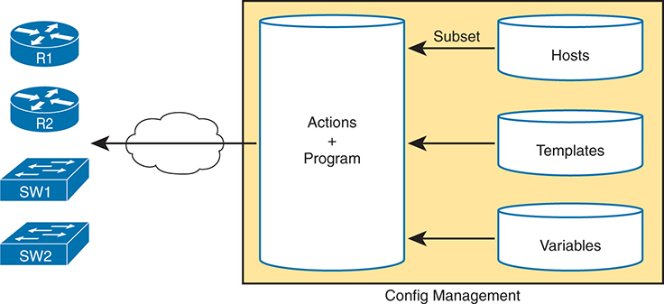
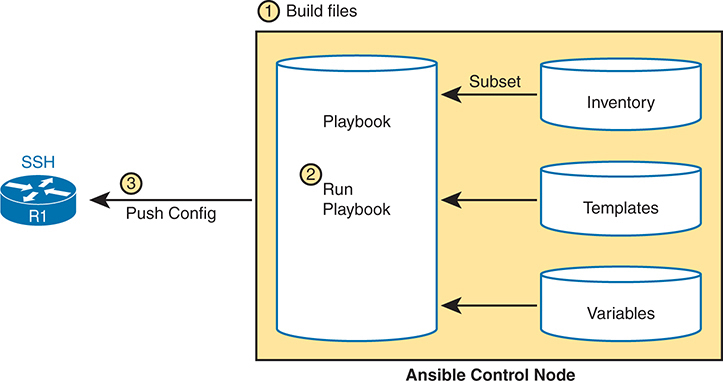
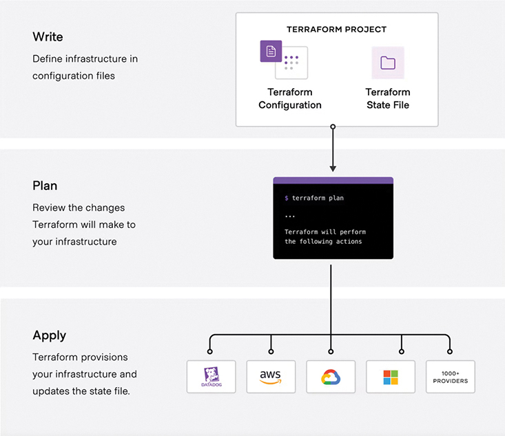

# Chapter 24


## Understanding Ansible and Terraform

This chapter covers the following exam topics:

6.0 Automation and Programmability

6.6 Recognize the capabilities of configuration mechanisms Ansible and Terraform

By now, you have seen how to use the IOS CLI to configure routers and switches. To configure using the CLI, you get into configuration mode, issue configuration commands (which change the running-config file), and eventually leave configuration mode. If you decide to keep those changes, you save the configuration to the startup-config file using the **copy running-config startup-config** command. Next time the router or switch boots, the device loads the startup-config file into RAM as the running-config. Simple enough.

This chapter discusses tools for configuration management that replace that per-device configuration process. To even imagine what these tools do first requires you to make a leap of imagination to the everyday world of a network engineer at a medium to large enterprise. In a real working network, managing the configuration of the many networking devices creates challenges. Those challenges can be addressed using that same old "use configuration mode on each device" process, plus with hard work, attention to detail, and good operational practices. However, that manual per-device process becomes more and more difficult for a variety of reasons, so at some point, enterprises turn to automated configuration management tools to provide better results.

The first section of this chapter takes a generalized look at the issues of configuration management at scale along with some of the solutions to those problems. The second major section then details two configuration management tools—Ansible and Terraform—to define some of the features and terms used with each. By the end of the chapter, you should be able to see some of the reasons why these automated configuration management tools have a role in modern networks and enough context to understand as you pick one to investigate for further reading.

### "Do I Know This Already?" Quiz

Take the quiz (either here or use the PTP software) if you want to use the score to help you decide how much time to spend on this chapter. The letter answers are listed at the bottom of the page following the quiz. [Appendix C](vol2_appc.xhtml#appc), found both at the end of the book as well as on the companion website, includes both the answers and explanations. You can also find both answers and explanations in the PTP testing software.


**Table 24-1** "Do I Know This Already?" Foundation Topics Section-to-Question Mapping

| Foundation Topics Section | Questions |
| --- | --- |
| Device Configuration Challenges and Solutions | 1–3 |
| Ansible and Terraform Basics | 4, 5 |

**[1](vol2_ch24.xhtml#ques24_1a).** Which answer best describes the meaning of the term *configuration drift*?

1. Changes to a single device's configuration over time versus that single device's original configuration
2. Larger and larger sections of unnecessary configuration in a device
3. Changes to a single device's configuration over time versus other devices that have the same role
4. Differences in device configuration versus a centralized backup copy

**[2](vol2_ch24.xhtml#ques24_2a).** An enterprise moves away from manual configuration methods, making changes by editing centralized configuration files. Which answers list an issue solved by using a version control system with those centralized files? (Choose two answers.)

1. The ability to find which engineer changed the central configuration file on a date/time
2. The ability to find the details of what changed in the configuration file over time
3. The ability to use a template with per-device variables to create configurations
4. The ability to recognize configuration drift in a device and notify the staff

**[3](vol2_ch24.xhtml#ques24_3a).** Configuration monitoring (also called configuration enforcement) by a configuration management tool generally solves which problem?

1. Tracking the identity of individuals who changed files, along with which files they changed
2. Listing differences between a former and current configuration
3. Testing a configuration change to determine whether it will be rejected or not when implemented
4. Finding instances of configuration drift

**[4](vol2_ch24.xhtml#ques24_4a).** Which of the following configuration management tools by default use a push model to configure network devices? (Choose two answers.)

1. Ansible
2. Both use a pull model
3. Terraform
4. Neither uses a push model

**[5](vol2_ch24.xhtml#ques24_5a).** Which of the following answers list a correct combination of configuration management tool and the term used for one of its primary configuration files? (Choose two answers.)

1. Ansible Configuration
2. Terraform Configuration
3. Ansible Playbook
4. Terraform Playbook

Answers to the "Do I Know This Already?" quiz:

**[1](vol2_appc.xhtml#ques24_1)** C

**[2](vol2_appc.xhtml#ques24_2)** A, B

**[3](vol2_appc.xhtml#ques24_3)** D

**[4](vol2_appc.xhtml#ques24_4)** A, C

**[5](vol2_appc.xhtml#ques24_5)** B, C

### Foundation Topics

### Device Configuration Challenges and Solutions

Think about any production network. What defines the exact intended configuration of each device in a production network? Is it the running-config as it exists right now or the startup-config before any recent changes were made or the startup-config from last month? Could one engineer change the device configuration so that it drifts away from that ideal, with the rest of the staff not knowing? What process, if any, might discover the configuration drift? And even with changes agreed upon by all, how do you know who changed the configuration, when, and specifically what changed?

Traditionally, CCNA teaches us how to configure one device using the **configure** terminal command to reach configuration mode, which changes the running-config file, and how to save that running-config file to the startup-config file. That manual process provides no means to answer any of the legitimate questions posed in the first paragraph; however, for many enterprises, those questions (and others) need answers, both consistent and accurate.

Not every company reaches the size to want to do something more with configuration management. Companies with one network engineer might do well enough managing device configurations, especially if the network device configurations do not change often. However, as a company moves to multiple network engineers and grows the numbers of devices and types of devices, with higher rates of configuration change, manual configuration management has problems.

This section begins by discussing a few of these kinds of configuration management issues so that you begin to understand why enterprises need more than good people and good practices to deal with device configuration. The rest of the section then details some of the features you can find in automated [configuration management tools](vol2_gloss.xhtml#gloss_085).

#### Configuration Drift

Consider the story of an enterprise of a size to need two network engineers, Alice and Bob. They both have experience and work well together. But the network configurations have grown beyond what any one person can know from memory, and with two network engineers, they may remember different details or even disagree on occasion.

One night at 1 a.m., Bob gets a call about an issue. He gets into the network from his laptop and resolves the problem with a small configuration change to branch office router BR22. Alice, the senior engineer, gets a different 4 a.m. call about another issue and makes a change to branch office router BR33.

The next day gets busy, and neither Alice nor Bob mentions the changes they made. They both follow procedures and document the changes in their change management system, which lists the details of every change. Because they both get busy, the topic never comes up, and neither mentions the changes to each for months.

The story shows how [configuration drift](vol2_gloss.xhtml#gloss_083) can occur—an effect in which the configuration drifts away from the intended configuration over time. Alice and Bob probably agree to what a standard branch office router configuration ought to look like, but they both made an exception to that configuration to fix a problem, causing configuration drift. [Figure 24-1](vol2_ch24.xhtml#ch24fig01) shows the basic idea, with those two branch routers now with slightly different configurations than the other branch routers.




The diagram consists of three horizontally aligned cylindrical shapes stacked vertically. The top cylinder is colored blue and labeled B R 22 Unique, indicating that the running configuration of branch router B R 22 is unique. The middle cylinder is colored orange and labeled B R 33 Unique, signifying that the running configuration of branch router B R 33 is also unique. The bottom cylinder is colored yellow and labeled Other Branches Consistent, suggesting that the running configurations of other branch routers are consistent with each other. To the left of these cylinders, the text Routers' running-config is displayed, indicating the overall focus of the diagram. This visual representation highlights the deviation in configurations for B R 22 and B R 33 compared to other branch routers.

**Figure 24-1** *Configuration Drift in Branch Routers BR22 and BR33*

Configuration drift becomes a much bigger problem if using only traditional manual configuration tools. For instance:


* The on-device manual configuration process does not track change history: which lines changed, what changed on each line, what old configuration was removed, who changed the configuration, when each change was made.
* External systems used by good systems management processes, like trouble ticketing and change management software, may record details. However, those sit outside the configuration and require analysis to figure out what changed. They also rely on humans to follow the operational processes consistently and correctly; otherwise, an engineer cannot find the entire history of changes to a configuration.
* Referring to historical data in change management systems works poorly if a device has gone through multiple configuration changes over a period of time.

#### Centralized Configuration Files and Version Control

The manual per-device configuration model makes great sense for one person managing one device. With that model, the one network engineer can use the on-device startup-config as the intended ideal configuration. If a change is needed, the engineer gets into configuration mode and updates the running-config until happy with the change. Then the engineer saves a copy to the startup-config as the now-current ideal config for the device.

The per-device manual configuration model does not work as well for larger networks, with hundreds or even thousands of network devices, with multiple network engineers. For instance, if the team thinks of the startup-config of each device as the ideal configuration, if one team member changes the configuration (like Alice and Bob each did in the earlier story), no records exist about the change. The config file does not show what changed, when it changed, or who changed it, and the process does not notify the entire team about the change.

As a first step toward better configuration management, many medium to large enterprises store configurations in a central location. At first, storing files centrally may be a simple effort to keep backup copies of each device's configuration. They would, of course, place the files in a shared folder accessible to the entire network team, as shown in [Figure 24-2](vol2_ch24.xhtml#ch24fig02).





On the left of the diagram, there are three router devices labeled as B R 21, B R 22, and B R 23. Each device is shown transferring a file, named respectively as B R 21 dot txt, B R 22 dot txt, and B R 23 dot txt, to a central folder. On the right side of the folder, there are three individuals labeled as Alice, Bob, and Chris respectively. Arrows indicate a two-way interaction between these individuals and the central folder.

**Figure 24-2** *Copying Device Configurations to a Central Location*

Which configuration file is the single source of truth in this model? The configuration files still exist on each device, but now they also exist on a centralized server, and engineers could change the on-device configuration as well as the text files on the server. For instance, if the copy of BR21's configuration on the device differs from the file on the centralized server, which should be considered as correct, ideal, the truth about what the team intends for this device?

In practice, companies take both approaches. In some cases, companies continue to use the on-device configuration files as the source of truth, with the centralized configuration files treated as backup copies in case the device fails and must be replaced. However, other enterprises make the transition to treat the files on the server as the single source of truth about each device's configuration. When using the centralized file as the source of truth, the engineers can take advantage of many configuration management tools and actually manage the configurations more easily and with more accuracy.

For example, configuration management tools use version control software to track the changes to centralized configuration files, noting who changes a file, what lines and specific characters changed, when the change occurred, and so on. The tools also allow you to compare the differences between versions of the files over time, as shown in [Figure 24-3](vol2_ch24.xhtml#ch24fig03).

The figure shows a sample of a comparison between two versions of a configuration file. The upper two highlighted lines, with the minus sign, show the lines that were changed, while the two lower highlighted lines, with the plus signs, show the new versions of each line.

Version control software solves many of the problems with the lack of change tracking within the devices themselves. [Figure 24-3](vol2_ch24.xhtml#ch24fig03) shows output from a popular Software-as-a-Service site called GitHub ([www.github.com](http://www.github.com)). GitHub offers free and paid accounts, and it uses open-source software ([Git](vol2_gloss.xhtml#gloss_153)) to perform the version control functions.





The changes were committed by a user named "WendellOdom" 6 days ago. The file shows two additions and two deletions. The additions are "plus description connected to S W E" and "plus ip address 10 dot 1 dot 1 dot 1 255 dot 255 dot 255 dot 0", and the deletions are "minus interface gigabitethernet 0/0" and "minus ip address connected to S W 1". The changes are highlighted with lines for additions and deletions where annotations pointing to these lines, labeled "Lines with Additions" and "Lines with Removals" respectively.

**Figure 24-3** *Showing File Differences in GitHub*

#### Configuration Monitoring and Enforcement

With a version control system and a convention of storing the configuration files in a central location, a network team can do a much better job of tracking changes and answering the who, what, and when of knowing what changed in every device's configuration. However, using that model then introduces other challenges—challenges that can be best solved by also using an automated configuration management tool.

With this new model, engineers should make changes by editing the associated configuration files in the centralized repository. The configuration management tool can then be directed to copy or apply the configuration to the device, as shown in [Figure 24-4](vol2_ch24.xhtml#ch24fig04). After that process completes, the central config file and the device's running-config (and startup-config) should be identical.




The process starts with a cylindrical database storage labeled "B R 21 Ideal," which holds the ideal configuration settings. From this database, modifications or updates to the configuration, labeled as "Edits," marked as action 1. These edits are then sent back towards the network device labeled "B R 21" on the left, which holds a "copy run start" command marked as action 3, through the action 2 represented by a network cloud in the center, indicating the processing or application of these updated settings.

**Figure 24-4** *Pushing Centralized Configuration to a Remote Device*

Using the model shown in [Figure 24-4](vol2_ch24.xhtml#ch24fig04) still has dangers. For instance, the network engineers should make changes by using the configuration management tools, but they still have the ability to log in to each device and make manual changes on each device. So, while the idea of using a configuration management tool with a centralized repository of config files sounds appealing, eventually someone will change the devices directly. Former correct configuration changes might be overwritten, and made incorrect, by future changes. In other words, eventually, some configuration drift can occur.

Configuration management tools can monitor device configurations to discover when the device configuration differs from the intended ideal configuration, and then either reconfigure the device or notify the network engineering staff to make the change. This feature might be called [configuration monitoring](vol2_gloss.xhtml#gloss_086) or *configuration enforcement*, particularly if the tool automatically changes the device configuration.

[Figure 24-5](vol2_ch24.xhtml#ch24fig05) shows the general idea behind configuration monitoring. The automated configuration management software asks for a copy of the device's running-config file, as shown in steps 1 and 2. At step 3, the config management software compares the ideal config file with the just-arrived running-config file to check whether they have any differences (configuration drift). Per the configuration of the tool, it either fixes the configuration or notifies the staff about the configuration drift.





The diagram is devided into two blocks representing configurations. The left block is labeled as Router BR 21 which contains a cylindrical shape with the text "running-config," indicating the current active configuration of the router. The left block is labeled as Config Management which contains two cylindrical shapes with the text "running-config (copy)", implying that the running configuration has been copied and "B R 21 Ideal" representing an ideal or baseline configuration. An arrow labeled "3" between both cylindrical shapes with an adjacent command "compare," indicating a comparison between the current running configuration and an ideal baseline. An arrow labeled "1" points from right block to left with a command "show run". Another arrow labeled "2" points from the running-config block to the running-config copied block.

**Figure 24-5** *Configuration Monitoring*

#### Configuration Provisioning

[Configuration provisioning](vol2_gloss.xhtml#gloss_087) refers to how to provision or deploy changes to the configuration once made by changing files in the configuration management system. Included among the primary functions of a configuration management tool, you would likely see features like these:


* The core function to implement configuration changes in one device after someone has edited the device's centralized configuration file
* The capability to choose which subset of devices to configure: all devices, types with a given attribute (such as those of a particular role), or just one device, based on attributes and logic
* The capability to determine whether each change was accepted or rejected, and to use logic to react differently in each case depending on the result
* For each change, the capability to revert to the original configuration if even one configuration command is rejected on a device
* The capability to validate the change now (without actually making the change) to determine whether the change will work or not when attempted
* The capability to check the configuration after the process completes to confirm that the configuration management tool's intended configuration does match the device's configuration
* The capability to use logic to choose whether to save the running-config to startup-config or not
* The capability to represent configuration files as templates and variables so that devices with similar roles can use the same template but with different values
* The capability to store the logic steps in a file, scheduled to execute, so that the changes can be implemented by the automation tool without the engineer being present

The list could go further, but it outlines some of the major features included in all of the configuration management tools discussed in this chapter. Most of the items in the list revolve around editing the central configuration file for a device. However, the tools have many more features, so you have more work to do to plan and implement how they work. The next few pages focus on giving a few more details about the last two items in the list.

##### Configuration Templates and Variables

Think about the roles filled by networking devices in an enterprise. Focusing on routers for a moment, routers often connect to both the WAN and one or more LANs. You might have a small number of larger routers connected to the WAN at large sites, with enough power to handle larger packet rates. Smaller sites, like branch offices, might have small routers, maybe with a single WAN interface and a single LAN interface; however, you might have a large number of those small branch routers in the network.

For any set of devices in the same role, the configurations are likely similar. For instance, a set of branch office routers might all have the exact same configuration for some IP services, like NTP or SNMP. If using OSPF interface configuration, routers in the same OSPF area and with identical interface IDs could have identical OSPF configuration.

For instance, [Example 24-1](vol2_ch24.xhtml#exa24_1) shows a configuration excerpt from a branch router, with the unique parts of the configuration highlighted. All the unhighlighted portions could be the same on all the other branch office routers of the same model (with the same interface numbers). An enterprise might have dozens or hundreds of branch routers with nearly identical configuration.

**Example 24-1** *Router BR1 Configuration, with Unique Values Highlighted*

[Click here to view code image](vol2_ch24_images.xhtml#f0559-01)

```
hostname BR1
!
interface GigabitEthernet0/0
 ip address 10.1.1.1 255.255.255.0
 ip ospf 1 area 11
!
interface GigabitEthernet0/1
!
interface GigabitEthernet0/1/0
 ip address 10.1.12.1 255.255.255.0
 ip ospf 1 area 11
!
router ospf 1
 router-id 1.1.1.1
```

Configuration management tools can separate the components of a configuration into the parts in common to all devices in that role (the template) versus the parts unique to any one device (the variables). Engineers can then edit the standard template file for a device role as a separate file rather than each device's variable file. The configuration management tool can then process the template and variables to create the ideal configuration file for each device, as shown in [Figure 24-6](vol2_ch24.xhtml#ch24fig06), which shows the configuration files being built for branch routers BR21, BR22, and BR23.




RAM, or Random Access Memory, serves as the working memory where the running configuration resides during device operation. Flash memory stores the Cisco I O S Software, the operating system of the switch. ROM, or Read-Only Memory, contains the Bootstrap Program, essential for booting the switch. NVRAM, or Non-Volatile RAM, holds the startup configuration, ensuring that configuration settings are retained even after a reboot.

**Figure 24-6** *Concept: Configuration Templates and Variables*

To give a little more insight, [Example 24-2](vol2_ch24.xhtml#exa24_2) shows a template file that could be used by Ansible for the configuration shown in [Example 24-1](vol2_ch24.xhtml#exa24_1). Each tool specifies what language to use for each type of file, with Ansible using the Jinja2 language for templates. The template mimics the configuration in [Example 24-1](vol2_ch24.xhtml#exa24_1), except for placing variable names inside sets of double curly brackets.


**Example 24-2** *Jinja2 Template with Variables Based on [Example 24-1](vol2_ch24.xhtml#exa24_1)*

[Click here to view code image](vol2_ch24_images.xhtml#f0560-01)

```
hostname {{hostname}}
!
interface GigabitEthernet0/0
 ip address {{address1}} {{mask1}}
 ip ospf {{OSPF_PID}} area {{area}}
!
interface GigabitEthernet0/1
!
interface GigabitEthernet0/1/0
 ip address {{address2}} {{mask2}}
 ip ospf {{OSPF_PID}} area {{area}}
!
router ospf {{OSPF_PID}}
 router-id {{RID}}
```

To supply the values for a device, Ansible calls for defining variable files using YAML, as shown in [Example 24-3](vol2_ch24.xhtml#exa24_3). The file shows the syntax for defining the variables shown in the complete configuration in [Example 24-1](vol2_ch24.xhtml#exa24_1), but now defined as variables.

**Example 24-3** *YAML Variables File Based on [Example 24-2](vol2_ch24.xhtml#exa24_2)*

```
---
hostname: BR1
address1: 10.1.1.1
mask1: 255.255.255.0
address2: 10.1.12.1
mask2: 255.255.255.0
RID: 1.1.1.1
area: '11'
OSPF_PID: '1'
```

The configuration management system processes a template plus all related variables to produce the intended configuration for a device. For instance, the engineer would create and edit one template file that looks like [Example 24-2](vol2_ch24.xhtml#exa24_2) and then create and edit one variable file like [Example 24-3](vol2_ch24.xhtml#exa24_3) for each branch office router. Ansible would process the files to create complete configuration files like the text shown in [Example 24-1](vol2_ch24.xhtml#exa24_1).

It might seem like extra work to separate configurations into a template and variables, but using templates has some big advantages. In particular:


* Templates increase the focus on having a standard configuration for each device role, helping to avoid snowflakes (uniquely configured devices).
* New devices with an existing role can be deployed easily by simply copying an existing per-device variable file and changing the values.
* Templates allow for easier troubleshooting because troubleshooting issues with one standard template should find and fix issues with all devices that use the same template.
* Tracking the file versions for the template versus the variables files allows for easier troubleshooting as well. Issues with a device can be investigated to find changes in the device's settings separately from the standard [configuration template](vol2_gloss.xhtml#gloss_088).

##### Files That Control Configuration Automation

Configuration management tools also provide different methods to define logic and processes that tell the tools what changes to make, to which devices, and when. For instance, an engineer could direct a tool to make changes during a weekend change window. That same logic could specify a subset of the devices. It could also detail steps to verify the change before and after the change is attempted, and how to notify the engineers if an issue occurs.

Interestingly, you can do a lot of the logic without knowing how to program. Each tool uses a language of some kind that engineers use to define the action steps, often a language defined by that company (a domain-specific language). But they make the languages straightforward, and they are generally much easier to learn than programming languages. Configuration management tools also enable you to extend the action steps beyond what can be done in the toolset by using a general programming language. [Figure 24-7](vol2_ch24.xhtml#ch24fig07) summarizes the files you could see in any of the configuration management tools.





Users operate in User Mode. By executing the enable command, users enter Enable Mode, also known as Privileged Mode, granting access to more advanced configuration commands. Within Enable Mode, users can enter Configuration Mode using the configure terminal command, enabling direct configuration of device settings. Exiting Configuration Mode can be achieved by entering end or pressing Ctrl-Z, returning users to Enable Mode.

**Figure 24-7** *Important Files Used by Configuration Management Tools*

### Ansible and Terraform Basics

This chapter focuses on one exam topic that asks about the capabilities of two configuration management tools: Ansible and Terraform. The first major section of the chapter describes the capabilities of both (and other) configuration management tools. This second major section examines a few of the features of each tool, focusing on terminology and major capabilities.

Ansible and Terraform are software packages. You can purchase each tool, with variations on each package. However, they also have different free options that allow you to download and learn about the tools, although you might need to run a Linux guest because some of the tools do not run in a Windows OS.

As for the names, most people use the words *Ansible* and *Terraform* to refer to the companies as well as their primary configuration management products. Both emerged as part of the transition from hardware-based servers to virtualized servers, which greatly increased the number of servers and created the need for software automation to create, configure, and remove VMs. Both also produce one or more configuration management software products that have become synonymous with their companies in many ways. (This chapter follows that convention, for the most part ignoring exact product names, and referring to products and software simply as Ansible and Terraform.) The sections that follow discuss the basics of each.

#### Ansible

To use [Ansible](vol2_gloss.xhtml#gloss_034) ([www.ansible.com](http://www.ansible.com)), you need to install Ansible on some computer: Mac, Linux, or a Linux VM on a Windows host. You can use the free open-source version or use the paid Ansible Tower server version.

Once it is installed, you create several text files, many of which use YAML (Yet Another Markup Language), including

* **Playbooks:** These files provide actions and logic about what Ansible should do.
* **Inventory:** These files provide device hostnames and information about each device, like device roles, so Ansible can perform functions for subsets of the inventory.
* **Templates:** Using Jinja2 language, the templates represent a device's configuration but with variables (see [Example 24-2](vol2_ch24.xhtml#exa24_2)).
* **Variables:** Using YAML, a file can list variables that Ansible will substitute into templates (see [Example 24-3](vol2_ch24.xhtml#exa24_3)).

Ansible uses an [agentless architecture](vol2_gloss.xhtml#gloss_031). That means Ansible does not rely on any code (agent) running on the network device. Instead, Ansible relies on features typical in network devices, specifically SSH and NETCONF, to make changes and extract information. When using SSH, the Ansible control node changes the device like any other SSH user, logging in and using configuration mode; however, the Ansible code does the work rather than a human user.

By default, Ansible uses a [push model](vol2_gloss.xhtml#gloss_274) (per [Figure 24-8](vol2_ch24.xhtml#ch24fig08)). However, it is also capable of using a [pull model](vol2_gloss.xhtml#gloss_273) with a program called Ansible-pull if you want that capability. After installing Ansible, an engineer must create and edit various Ansible files, including an [Ansible playbook](vol2_gloss.xhtml#gloss_034). The playbook details the actions the engineer wants to take, acting as a program with steps taken under different conditions. Then the engineer runs the playbook, and Ansible performs the steps. Those steps can include configuring one or more devices per the various files (step 3), with the control node seen as pushing the configuration to the device.





Users enter Enable Mode, granting access to more advanced configuration commands. From Enable Mode, users can enter Global Configuration Mode using the configure terminal command, facilitating global device configuration. Exiting Global Configuration Mode can be achieved by entering end or pressing Ctrl-Z, returning users to Enable Mode. Additionally, from Global Configuration Mode, users can enter specific interface, V LAN, console line, or V T Y line modes using corresponding commands, enabling configuration at the respective levels. Exiting these modes returns users to Global Configuration Mode.

**Figure 24-8** *Ansible Push Model*

Ansible can do configuration provisioning (configuring devices based on the changes made in the files) and configuration monitoring (checking to find out whether the device config matches the ideal configuration on the control node). However, Ansible's architecture more naturally fits with configuration provisioning, as seen in the figure. To do configuration monitoring, Ansible uses logic modules that detect and list configuration differences, after which the playbook defines what action to take (reconfigure or notify).

#### Terraform

[Terraform](vol2_gloss.xhtml#gloss_340) by HashiCorp ([www.terraform.io](http://www.terraform.io)) is an infrastructure as code (IaC) tool that enables you to create both cloud and on-premises resources by leveraging easy-to-read configuration files. These files use configuration version control, can be reused, and can be shared with other developers or code contributors. Terraform provides a straightforward workflow to provision and manage your infrastructure throughout its lifecycle, making day-to-day operations much simpler to manage. Terraform can also handle components such as compute, storage, and networking as well as components such as DNS and features from Software as a Service (SaaS) applications. The following list highlights some of the main components of Terraform and their associated roles in managing your infrastructure:

* **Configuration files:** Files that describe the desired state of the infrastructure and specify resources along with their configurations.
* **Providers:** Plugins that enable interaction with different infrastructure platforms (AWS, Azure, Google Cloud).
* **Resources:** Components you want to create and manage, such as virtual machines, networks, or databases.
* **Data sources:** Reference details about existing infrastructure within your configuration.
* **Variables:** A method to reuse code and make configurations more flexible.
* **State files:** Record the infrastructure's current state and track configuration changes that are made.
* **Modules:** Organize and reuse Terraform code. Modules encapsulate a set of resources and configurations that can be treated as a single unit. Modules promote code reusability and modularity.

Terraform works with cloud providers and other services by utilizing their associated APIs. This is enabled by the use of the providers mentioned previously. This enables Terraform to connect with almost any service or platform, which is why it has become widely used as a common approach to IaC.

Terraform has its own language called HashiCorp Configuration Language (HCL). The language is human readable and fairly easy to understand like Ansible; however, Ansible is best suited for device configurations whereas Terraform is more often used for infrastructure provisioning.

There are three stages to Terraform's core workflow:

1. **Write:** This is where you define the resources that will be used across multiple cloud providers or services.
2. **Plan:** An execution plan is created that describes the infrastructure that will be created, updated, or destroyed based on the current configuration and infrastructure.
3. **Apply:** Once the plan is approved, the proposed operations will be completed in the appropriate order.

The saying "A picture is worth a thousand words" fits nicely for this technology. [Figure 24-9](vol2_ch24.xhtml#ch24fig09) depicts the high-level architecture of Terraform, its core workflow, and how it interacts with various cloud providers and other infrastructure.





Within the Administration Options menu, the Command Line Interface (C LI) section is visible. The Exec circle is checked, indicating the current selection. Several buttons are available, including options to run a command, clear the interface, copy content, and export data. Additionally, the bottom section of the menu displays code lines for accessing the CLI directly from the Switch Web Server Interface.

**Figure 24-9** *High-level Terraform Architecture*

#### Summary of Configuration Management Tools

The configuration management tools discussed in this chapter have different strengths. When considering one of these tools it is best to first understand what you are trying to accomplish from a design perspective. For example, if you or your team is very fluent in CLI and want to automate device configurations across many devices, Ansible might be your first choice due to the similarity of the playbooks and the actual CLI.

However, if you are looking to lead with IaC, do more advanced capabilities of automation, need a means to keep track of configurations, and do provisioning for both on-premise or cloud infrastructure, you may consider Terraform. Sometimes, you might have both. That is the beauty of programmability and automation—there are many ways to solve business needs by leveraging different methods. Skill set, preference, and cost usually determine which tool(s) your organization will implement.

[Table 24-2](vol2_ch24.xhtml#ch24tab02) summarizes a few of the most common ideas about each of the automated configuration management tools.


**Table 24-2** Comparing Ansible and Terraform

| Attribute | Ansible | Terraform |
| --- | --- | --- |
| File type for actions or config | Playbook | Configuration |
| Protocol to network device | SSH, NETCONF | APIs |
| Execution Mode | Agentless | Client/server model |
| Push or pull model | Push (by default)  Pull w/Ansible-pull program | Push |
| Modeling language | YAML | HashiCorp Configuration Language (HCL) |

### Chapter Review

One key to doing well on the exams is to perform repetitive spaced review sessions. Review this chapter's material using either the tools in the book or interactive tools for the same material found on the book's companion website. Refer to the "[Your Study Plan](vol2_appf.xhtml#appf)" element for more details. [Table 24-3](vol2_ch24.xhtml#ch24tab03) outlines the key review elements and where you can find them. To better track your study progress, record when you completed these activities in the second column.

**Table 24-3** Chapter Review Tracking

| Review Element | Review Date(s) | Resource Used |
| --- | --- | --- |
| Review key topics |  | Book, website |
| Review key terms |  | Book, website |
| Answer DIKTA questions |  | Book, PTP |
| Review memory table |  | Book, website |
| Do DevNet Labs |  | DevNet |

### Review All the Key Topics


**Table 24-4** Key Topics for [Chapter 24](vol2_ch24.xhtml#ch24)

| Key Topic Element | Description | Page Number |
| --- | --- | --- |
| List | Issues that arise from configuration drift | [555](vol2_ch24.xhtml#page_555) |
| [Figure 24-3](vol2_ch24.xhtml#ch24fig03) | Sample of showing router configuration file differences with GitHub | [557](vol2_ch24.xhtml#page_557) |
| [Figure 24-5](vol2_ch24.xhtml#ch24fig05) | Basic configuration monitoring concepts | [558](vol2_ch24.xhtml#page_558) |
| List | Primary functions of a configuration management tool | [558](vol2_ch24.xhtml#page_558) |
| [Example 24-2](vol2_ch24.xhtml#exa24_2) | Sample Jinja2 Ansible template | [560](vol2_ch24.xhtml#page_560) |
| List | Advantages of using configuration templates | [561](vol2_ch24.xhtml#page_561) |
| [Figure 24-8](vol2_ch24.xhtml#ch24fig08) | Ansible's push model and other features | [563](vol2_ch24.xhtml#page_563) |
| [Figure 24-9](vol2_ch24.xhtml#ch24fig09) | Terraform's high-level architecture | [565](vol2_ch24.xhtml#page_565) |
| [Table 24-2](vol2_ch24.xhtml#ch24tab02) | Summary of configuration management features and terms | [566](vol2_ch24.xhtml#page_566) |

### Key Terms You Should Know

[agentless architecture](vol2_ch24.xhtml#key_351)

[Ansible](vol2_ch24.xhtml#key_352)

[Ansible Playbook](vol2_ch24.xhtml#key_353)

[configuration drift](vol2_ch24.xhtml#key_354)

[configuration management tool](vol2_ch24.xhtml#key_355)

[configuration monitoring](vol2_ch24.xhtml#key_356)

[configuration provisioning](vol2_ch24.xhtml#key_357)

[configuration template](vol2_ch24.xhtml#key_358)

[Git](vol2_ch24.xhtml#key_359)

[pull model](vol2_ch24.xhtml#key_360)

[push model](vol2_ch24.xhtml#key_361)

[Terraform](vol2_ch24.xhtml#key_362)

### Do DevNet Labs

The Cisco DevNet site (<https://developer.cisco.com>)—a free site—includes lab environments and exercises. You can learn a lot about configuration management, and Ansible in particular, with a few of the lab tracks on the DevNet site (at the time this book was published). Navigate to <https://developer.cisco.com> and search for learning labs about Ansible and Terraform.