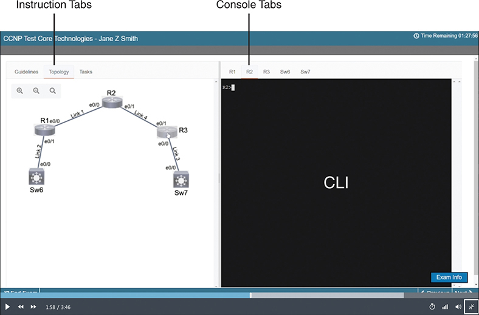
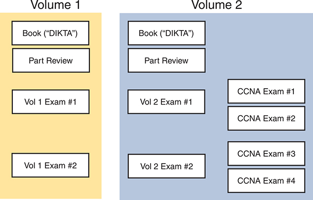
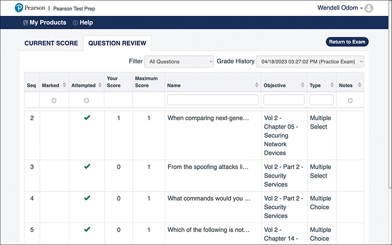
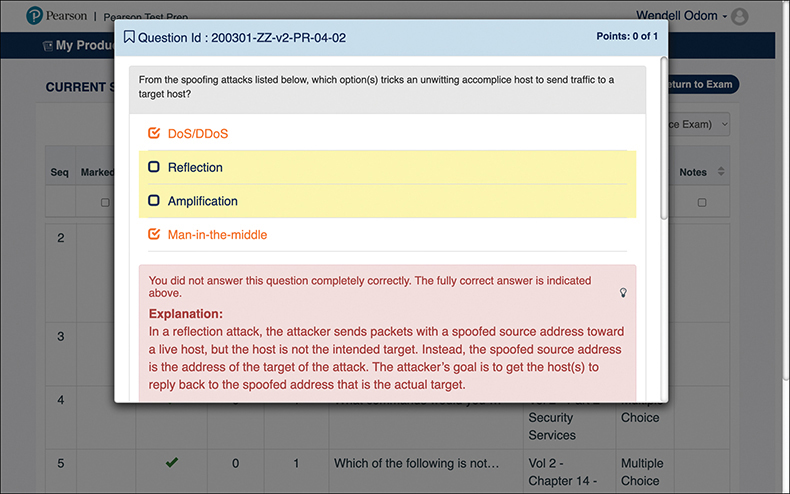
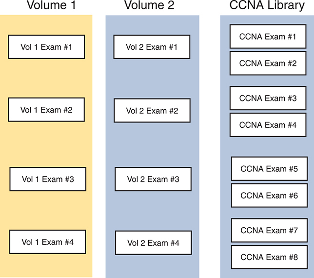

# Chapter 26

## Final Review

Congratulations! You made it through the books, and now it's time to finish getting ready for the exam. This chapter helps you get ready to take and pass the exam in two ways.

The first half of this chapter focuses on the exam event. Now you need to think about what happens during the exam and what you need to do in these last few weeks before taking the exam. At this point, everything you do should be focused on getting you ready to pass so that you can finish up this hefty task.

The second section of this chapter focuses on final content review. You should not just complete the chapters in the combined CCNA Volume 1 and 2 books. Instead, you need to review, refine, deepen, and assess your skills. This second section of this chapter gives advice and suggestions on how approach your final weeks of study before you take the CCNA 200-301 exam.

### Advice About the Exam Event

Now that you have finished the bulk of this book, you could just register for your Cisco CCNA exam; show up; and take the exam. However, if you spend a little time thinking about the exam event itself, learning more about the user interface of the real Cisco exams, and the environment at the Pearson VUE testing centers, you will be better prepared, particularly if this is your first Cisco exam.

This first of two major sections in this chapter gives some advice about the Cisco exams and the exam event itself, specifically about

* Question Types
* Your Time Budget
* An Example Time-Check Method
* The Final Week Before Your Exam
* 24 Hours Before Your Exam
* The Final 30 Minutes Before Your Exam
* The Hour After Your Exam

#### Learn About Question Types

In the weeks leading up to your exam, you should think more about the different types of exam questions and have a plan for how to approach those questions. To get started, watch the Cisco Certification Exam Tutorial Video. You can find it these ways:

* **Direct link:** <https://learningnetwork.cisco.com/s/certification-exam-tutorials>
* **Internet search:** Search for "Cisco Certification Exam Tutorial Video" and you will likely find it.
* **Blog post:** Use <https://www.certskills.com/final-review>, which links to a blog page with a link to the video page (as well as other links useful for final review).

Cisco does not give a definitive list of all question types used on any Cisco exam; however, the videos and this section describe all the question types used at the time this book was published.

While you're watching any of the videos about the exam tutorial, the exam user interface has these conventions:

* Shows circles beside the answers in single-answer questions.
* Shows squares beside the answers in multiple-answer questions.
* Prevents you from choosing too many or too few answers.
* Supplies a popup window to tell you if you have selected too few answers if you try to move to the next question, so you can stop and go back and answer with the correct number of answers.
* Applies no penalty for guessing—so you should always supply the number of answers that the question asks for.

**To emphasize: Cisco has no penalty for guessing, and the user interface helps ensure you choose the correct number of answers. Always answer, and answer with the stated number of correct answers.**

Drag-and-drop questions require you to move items in the user interface with mouse actions. The draggable items begin in one location, and you will drag-and-drop them to answer. The draggables may be words, but they can also be graphics.

Within one drag-and-drop question, you can change your mind until satisfied. To do so, after dragging an item, just drag it back to its original position. The user interface does not consider you to have answered the question until you click the next button.

Lab questions directly assess your CLI skills. They present you with a lab scenario with a lab pod of virtual routers and switches running in the background, giving you console access to a few devices. Your job: find the missing or broken configuration and reconfigure the devices so that the lab scenario works. Some of the key points to consider with lab questions include

1. Learn the lab question user interface as much as possible beforehand by watching the "Cisco Certification Exam Tutorial Video."
2. Expect to navigate often between the tabs on the left of the user interface, particularly the topology (drawing) and tasks tabs. The topology shows a figure of the network, with the tasks tab listing what you need to do to gain the points for the question. (The guidelines tab typically lists generic instructions that apply to every lab question.)
3. The right side of the user interface has tabs for the console of each device—just click the tab to get to the CLI of the device.
4. Lab questions run virtualized Cisco operating systems. They do not use simulations. So, the CLI should work like real devices, with all commands supported, all options, with navigation tools like ?, tab, and up arrow.
5. You answer by changing the configuration, so make sure to issue the **copy running-config startup-config** command (or **copy run start**) to save your configuration.
6. Cisco gives partial credit on lab questions, so do as much as you can, even if you do not know how to solve the entire lab.

[Figure 26-1](vol2_ch26.xhtml#ch26fig01) shows a screen capture from the video, noting the UI tabs.

The screenshot displays Network settings interface on a macOS operating system, showing a list of network connections on the left panel, including a connected "USB 10/100/1000 LAN". On the right panel, the status indicates Connected, "USB 10/100/1000 LAN is currently active and has the IP address 10.1.10.104". The configuration for IPv4 is set to Using DHCP, with an IP Address of "10.1.10.104", Subnet Mask of "255.255.255.0",and Router at "10.1.1.1". DNS Server addresses and a Search Domains field are also displayed.

**Figure 26-1** *Cisco Lab Question User Interface*

Note

Those of you with some prior experience with CCNA will notice that lab questions seem a lot like the old Sim question type. The old Sim questions required the same actions from us as test takers: read the scenario and fix the configuration. However, Sim questions used simulated Cisco devices with limited command support, which frustrated some test takers. Lab questions use virtualized Cisco operating systems, creating a much more realistic experience.

On a final note about question types, Cisco can and may change the question types, but in recent years, the CCNA exam has used the types listed here.

#### Think About Your Time Budget

Several factors about a Cisco exam experience make time management a challenge, including

1. The test has a time limit. The user interface shows the time count down to 0:00.
2. The test has a defined number of questions that you learn when you begin the test. The user interface shows the current question, counting up from 1 to the number of questions you will see.
3. You cannot skip a question or go back to an earlier question. Once you move on to the next question, you cannot navigate back to it.
4. You do not know how many time-consuming questions like lab questions exist on your exam, even after you start your exam. Instead, they just appear like any other question.

Because of Cisco's exam rules, you need to take extra care to manage your time and keep an eye on your speed. Going too slowly hurts you because you might not have time to answer all the questions. Going too fast hurts if you are rushing due to worry about running out of time. So, you need to be able to somehow know whether you are moving quickly enough to answer all the questions while not rushing.

You need a plan for how you will check your time, a plan that does not distract you from the exam. You can ponder the facts listed here and come up with your own plan. If you want a little more guidance, the next topic shows one way to check your time that uses some simple math so it does not take much time away from the test.

#### An Example Time-Check Method

As a suggestion, you can use the following math to do your time check in a way that weights the time based on those time-consuming questions. You do not have to use this method. But this math uses only addition of whole numbers, to keep it simple. It gives you a pretty close time estimate, in my opinion.

The concept is simple. Just do a simple calculation that estimates the time you should have used so far. Here's the math:

Number of questions answered so far + 7 per time-consuming question answered so far

Then you check the timer to figure out how much time you have spent:

* You have used exactly that much time, or a little more time: your timing is perfect.
* You have used less time: you are ahead of schedule.
* You have used noticeably more time: you are behind schedule.

For example, first you need to make a habit of keeping count of how many time-consuming questions you see. For instance, write "labs" on your note sheet and add a mark each time you see a lab question. For the math, for instance, if you have already finished 17 questions, 1 of which was a lab question, your time estimate is 17 + 7 = 24 minutes. If your actual time is also 24 minutes, or maybe 25 or 26 minutes, you are right on schedule. If you have spent less than 24 minutes, you are ahead of schedule.

So, the math is pretty easy: Questions answered, plus 7 per time-consuming question, is the guesstimate of how long you should have taken so far if you are right on time.

Note

This math is an estimate; I make no guarantees that the math will be an accurate predictor on every exam.

#### One Week Before Your Exam

I have listed a variety of tips and advice in the next few pages, broken down by timing versus the big exam event. First, this section discusses some items to consider when your exam is about a week away:

* **Get some earplugs:** Testing centers often have some, but if you do not want to chance it, come prepared with your own. (They will not let you bring your own noise-canceling headphones into the room if they follow the rules disallowing any user electronic devices in the room, so think low-tech disposable earplugs, or even bring a cotton ball.) The testing center is typically one room within a building of a company that does something else as well, often a training center, and almost certainly you will share the room with other test takers coming and going. So, there are people talking in nearby rooms and other office noises. Earplugs can help.
* **Create a note-taking plan:** Some people like to spend the first minute of the exam writing down some notes for reference, before actually starting the exam. For example, maybe you want to write down the table of magic numbers for finding IPv4 subnet IDs. If you plan to do that, practice making those notes between now and exam day. Before each practice exam, transcribe those lists, just like you expect to do at the real exam.
* **Plan your travel to the testing center:** Leave enough time in your schedule so that you will not be rushing to make it just in time.
* **Practice your favorite relaxation techniques for a few minutes before each practice exam:** That way you can enter the exam event and be more relaxed and have more success.

#### 24 Hours Before Your Exam

You wake up on the big day—what should you be doing and thinking? Certainly, the better prepared you are, the better chances you have on the exam. But these small tips can help you do your best on exam day:

* Rest the night before the exam rather than staying up late to study. Clarity of thought is more important than one extra fact, especially because the exam requires so much analysis and thinking rather than just remembering facts.
* Bring as few extra items with you as possible when leaving for the exam center. You may bring personal effects into the building and testing company's space, but not into the actual room in which you take the exam. So, save a little stress and bring as little extra stuff with you as possible. If you have a safe place to leave briefcases, purses, electronics, and so on, leave them there. However, the testing center should have a place to store your things as well. Simply put, the less you bring, the less you have to worry about storing. (For example, I have been asked to remove even my analog wristwatch on more than one occasion.)
* Plan time in your schedule for the day to not rush to get there and not rush when leaving, either.
* Do not drink a 64-ounce caffeinated drink on the trip to the testing center! After the exam starts, the exam timer will not stop while you go to the restroom.
* Use any relaxation techniques that you have practiced to help get your mind focused while you wait for the exam.

#### 30 Minutes Before Your Exam

It's almost time! Here are a few tips for those last moments.

* Ask the testing center personnel for earplugs if you did not bring any—even if you cannot imagine using them. You never know whether using them might help.
* Ask for extra pens and laminated note sheets. The exam center will give you a laminated sheet and dry erase markers with which to take notes. (Test center personnel typically do not let you bring paper and pen into the room, even if supplied by the testing center.) I always ask for a second pen as well.
* Test your pens and sheets before going into the room to take the exam. Better to get a replacement pen before the clock starts.
* Grab a few tissues from the box in the room, for two reasons. One, to avoid having to get up in the middle of the exam if you need to sneeze. Two, if you need to erase your laminated sheet, doing that with a tissue paper rather than your hand helps prevent the oil from your hand making the pen stop working well.
* Find a restroom to use before going into the testing center, or just ask where one is, to avoid needing to go during the approximately two-hour exam event. Note that the exam timer does not stop if you need to go to the restroom during the exam, and you first have to go find the exam center contact before just heading to the restroom, so it can cost you a few minutes.

#### The Hour After Your Exam

Some people pass these exams on the first attempt, and some do not. The exams are not easy. If you fail to pass the exam that day, you will likely be disappointed. And that is understandable. But it is not a reason to give up. In fact, I added this short topic to give you a big advantage in case you do fail.

**The most important study hour for your next exam attempt is the hour just after your failed attempt.**

Before you take the exam, prepare for how you will react if you do not pass. That is, prepare your schedule to give yourself an hour, or at least a half an hour, immediately after the exam attempt, in case you fail. Follow these suggestions to be ready for taking notes:

* Bring pen and paper, preferably a notebook you can write in if you have to write standing up or sitting somewhere inconvenient.
* Make sure you know where pen and paper are so that you can take notes immediately after the exam. Keep these items in your backpack if using the train or bus, or on the car seat in the car.
* Install an audio recording app on your phone, and be prepared to start talking into your app when you leave the testing center.
* Before the exam, scout the testing center, and plan the place where you will sit and take your notes, preferably somewhere quiet.

Then, once you complete the exam, if you do not pass on this attempt, use the following process when taking notes:

* Write down anything in particular that you can recall from any question.
* Write down details of questions you know you got right as well, because doing so may help trigger a memory of another question.
* Draw the figures that you can remember.
* Most importantly, write down any tidbit that might have confused you: terms, configuration commands, **show** commands, scenarios, topology drawings, anything.
* Take at least three passes at remembering. That is, you will hit a wall where you do not remember more. So, start on your way back to the next place, and then find a place to pause and take more notes. And do it again.
* When you have sucked your memory dry, take one more pass while thinking of the major topics in the book, to see if that triggers any other memory of a question.

Once collected, *you cannot share the information with anyone,* because doing so would break the Cisco nondisclosure agreement (NDA). Cisco considers cheating a serious offense and strongly forbids sharing this kind of information publicly. But you can and should use everything you can recall from your first attempt to prepare for your second attempt. See the section "[Adjustments for Your Second Attempt](vol2_ch26.xhtml#ch26lev2sec10)" in this chapter for the rest of the story.

### Exam Review

At this point, you should have read the other chapters in the *CCNA 200-301 Official Cert Guide, Volumes 1 and 2*, and you have done the Chapter Review and Part Review tasks. Now you need to do the final study and review activities before taking the exam, as detailed in this section.

This section suggests some new activities and repeats some activities that have been previously mentioned. However, whether the activities are new or old to you, they all focus on filling in your knowledge gaps, finishing off your skills, and completing the study process.

You need to be ready to take an exam, so the Exam Review asks you to spend a lot of time answering exam questions. The next several pages discuss the best ways to make use of the practice questions that come with this book for your final preparation. The rest of the chapter then offers other suggestions for final exam preparation.

#### Using Practice Questions

Both this book and the associated Volume 1 book come with a set of practice questions. The Pearson Test Prep (PTP) user interface, both web and desktop app, groups questions into exams. [Figure 26-2](vol2_ch26.xhtml#ch26fig02) lists the exams supplied with the Volume 1 and Volume 2 books. (You might recall some of this information from the "[Your Study Plan](vol2_appf.xhtml#appf)" section of the *CCNA 200-301 Official Cert Guide, Volume 1*, Second Edition, found just before [Chapter 1](vol2_ch01.xhtml#ch01) of that book.)

Both volumes have similar labels as follows: "DIKTA", a part review, and specific exams. In Volume 1, there are two exams listed: "Vol 1 Exam 1" and "Vol 1 Exam 2". In Volume 2, there are two exams listed: "Vol 2 Exam 1" and "Vol 2 Exam 2", and also lists four "C C N A" exams, numbered from 1 to 4.

**Figure 26-2** *Exams Included in the Combined CCNA 200-301 Official Cert Guide, Volumes 1 and 2*

Volume 1 comes with a set of four exams. The "book" exam holds copies of the chapter-beginning "Do I Know This Already?" quiz questions. The part review exam includes the questions meant for use during part review. Exams 1 and 2 supply additional practice questions about Volume 1 content that you could use anytime, even now during your final review.

Volume 2 includes an equivalent set of four exams, but with questions about the technologies discussed in Volume 2.

Additionally, the publisher delivers CCNA exams to you in the Volume 2 book. Those exams include questions about the technologies in both books, making them excellent candidates to be used for timed practice exams.

The next few pages suggest how to use the practice questions for review at this late stage in your CCNA journey.

##### Hold Practice Exam Events

One day soon, you need to pass a real Cisco exam at a Pearson VUE testing center. So, it's time to practice the real event as much as possible.

A practice exam using the PTP exam software lets you experience many of the same challenges as when taking a real Cisco exam. When you select *practice exam* mode, PTP software (both desktop and web) gives you a number of questions, with an upward question counter and a countdown timer shown in the window. When in practice exam mode, you cannot move backward to a previous question (yes, that's true on Cisco exams). And like the real exam, if you run out of time, the questions you did not answer count as incorrect.

The process of taking the timed practice exams helps you prepare in three key ways:

* To practice the exam event itself, including time pressure, the need to read carefully, and the need to concentrate for long periods
* To build your analysis and critical thinking skills when examining the network scenario built in to many questions
* To discover the gaps in your networking knowledge so that you can study those topics before the real exam

As much as possible, treat the practice exam events as if you were taking the real Cisco exam at a VUE testing center. The following list gives some advice on how to make your practice exam more meaningful, rather than just one more thing to do before exam day rolls around:

* Set aside 2.5 hours for taking a 120-minute timed practice exam.
* Make a list of what you expect to do for the 10 minutes before the real exam event. Then visualize yourself doing those things. Before taking each practice exam, practice those final 10 minutes before your exam timer starts. (The earlier section "[30 Minutes Before Your Exam](vol2_ch26.xhtml#ch26lev2sec6)" lists some suggestions about what to do.)
* You cannot bring anything with you into the VUE exam room, so remove all notes and help materials from your work area before taking a practice exam. You can use blank paper, a pen, and your brain only. Do not use calculators, notes, web browsers, or any other app on your computer.
* Real life can get in the way, but if at all possible, ask anyone around you to leave you alone for the time you will practice. If you must do your practice exam in a distracting environment, wear headphones or earplugs to reduce distractions.
* To your benefit, do not guess on the practice exam event, hoping to improve your score. Answer only when you have confidence in the answer. Then, if you get the question wrong, you can go back and think more about the question in a later study session.

Hold your practice exam events using the CCNA exams listed in the PTP user interface. Just select those exams, and de-select the others. Or, select CCNA exam 1 for one event and CCNA exam 2 for the other. Also, select a 100-question limit. Then you simply need to choose the **Practice Exam** option in the upper right and start the exam.

You should plan to take between one and three practice exams with the supplied CCNA exam databases. Even people who are already well prepared should do at least one practice exam, just to experience the time pressure and the need for prolonged concentration.

[Table 26-1](vol2_ch26.xhtml#ch26tab01) gives you a checklist to record your different practice exam events. Note that recording both the date and the score is helpful for some other work you will do, so note both. Also, in the Time Notes section, if you finish on time, note how much extra time you had; if you run out of time, note how many questions you did not have time to answer. Finally, note that you completed gap review (discussed later in this chapter).

**Table 26-1** CCNA Practice Exam Checklist

| Exam Bank(s) Used | Date Taken | Score | Time Notes | Completed Gap Review? |
| --- | --- | --- | --- | --- |
|  |  |  |  |  |
|  |  |  |  |  |
|  |  |  |  |  |

##### Exam Scoring on the Real Exam

When you take a practice exam with PTP, PTP gives you a score, on a scale from 300 to 1000. Why? Cisco gives a score of between 300 and 1000 as well. But the similarities end there.

With PTP, the score is a basic percentage but expressed as a number from 0 to 1000. For example, answer 80 percent correct, and the score is 800; get 90 percent correct, and the score is 900. If you start a practice exam and click through it without answering a single question, you get a 0.

However, Cisco does not score exams in the same way. The following is what we do know about Cisco exam scoring:

* Cisco uses a scoring scale from 300 to 1000.
* Cisco tells us that it gives partial credit but provides no further details.

So, what does an 800 or a 900 mean on the actual Cisco exams? Cisco doesn't reveal the details of scoring to us. They don't reveal the details of partial credit. It also seems like a lab question would be worth more points than a multiple-choice question. Also, some drag-and-drop questions require that you know many facts—but we do not know if Cisco weights those with more points.

##### Self-Assessment Suggestions

Are you ready to take and pass the real exam? We all want to be able to self-assess whether we are ready to pass. The next few pages give a few suggestions.

First, practice exam scores give you only a general indicator of exam readiness. In fact, some students use their practice exam scores as the main self-assessment tool. However, the scores give only a broad indication of your readiness given many variables that affect the scores.

As an example of a good use of the practice exam scores, imagine you hold one practice exam event and get a 650, and three weeks later (after more studying) hold another and make a 900. You probably improved your chances of passing. However, do not look at your practice exam score of 900 and think that means you're ready to get more than the 800–825 typically required on the real exam. There are too many other variables impacting the scoring to make that claim.

Why is the raw practice exam score a poor measure?

* One 100-question practice exam cannot come close to asking about the breadth and depth of CCNA topics. So the randomness of chosen questions versus your knowledge impacts your practice exam score.
* If you choose to guess like you would on the real exam, your practice test score becomes skewed by your success or failure rate at guessing, giving false confidence if you guess well and false doubts if you guess poorly.
* Question familiarity. If you have seen some of the questions before, you might get a falsely higher score.

So, use your practice exam scores as a general guide. Do not get upset with lower scores, or too excited about high scores.

In addition to practice exam scores, try some other study and review efforts that can give you a better sense of your readiness. For instance, the book identifies key topics and key terms. Those are the most important topics and terms in the books. You ought to be able to explain a few sentences about most of those topics and terms—so do just that. The following list gives some review activities that also help you assess your exam readiness:

1. **Explain each key topic:** Look at the key topic table at the end of each chapter as a reminder of each key topic. Without looking at the chapter's content, explain out loud to an imaginary colleague about the concept and technology. Note the percentage of key topics you could explain well as a measure of exam readiness (you can find the key topics in the companion website as well).
2. **Confirm mastery of subnetting math:** Review and practice all types of subnetting activities one more time. As for exam readiness, you should be able to do subnetting math confidently with 100 percent accuracy at this point.
3. **Practice config checklists:** The chapters include config checklists for the longer configuration tasks. Use the interactive versions of these checklists on the companion website. You should be able to remember most of the configuration commands for each process from memory. Practice them and note your scores, repeating until you remember all.
4. **Practice config labs:** You should be able to do all the Config Labs from my blog site, or labs of similar challenge level. Perform some of those labs to help internalize the commands and details you study in the configuration checklists. While performing all labs may be too time consuming, focus on practicing weak areas.
5. **Improve recall of show commands:** For chapters with **show** commands, scan the examples and look at the fields highlighted in gray. Without looking at the notes in the book, recall and remind yourself about which values list configuration settings and which show status information. As for exam readiness, do not expect to recall every command and output fact, but work to improve gaps.
6. **Explain key terms:** Use the key terms listed at the end of each chapter for a review exercise. Look at the list, and speaking out loud, describe each term with no other prompts. Try pretending to teach the topic to a fellow CCNA student. For any terms that make you pause too long, review the term. Note the percentage of key terms you can explain as a measure of exam readiness. (You can find the key terms in the companion website's key terms flashcards app, which can be very useful for this activity.)

##### Gap Analysis Using Q&A

Gap analysis refers to any activity that helps you identify differences between what you should know and what you actually know. Gap analysis helps increase your chances of passing more so than most last-stage tools, and you can use the PTP app to do effective gap analysis.

When you use exam mode in the PTP app, you cannot see the correct answers, and the app disables the answer button (which reveals a detailed explanation to the question). However, if you click Save to save your practice exam, the PTP software tracks each practice exam you take, remembering your answer for every question, and whether you got it wrong. You can view the results and move back and forth between seeing the question and seeing the results page.

[Figure 26-3](vol2_ch26.xhtml#ch26fig03) shows a sample Question Review page. To know which ones you answered correctly, examine the "Your Score" column, with a 0 meaning you answered incorrectly.

Under the T C P/I P tab, options for configuring I P version 4 and I P version 6 are visible. IPversion 4 settings include Configure I P version 4, I P version 4 address, Subnet Mask, and Router. I P version 6 settings include Configure I P version 6, with a table below showing I P version 6 address and Prefix. Additionally, on the right side, the D H C P client I D is displayed, along with an option to Renew D H C P lease.

**Figure 26-3** *PTP Grading Results Page*

To perform the process of reviewing questions and marking them as complete, you can move between this Question Review page and the individual questions. Just double-click a question to move back to that question, as shown in [Figure 26-4](vol2_ch26.xhtml#ch26fig04).

In the first 16 possible subnets of an IPv6 address with a 16-bit subnet field, each address starts with the consistent Global Routing Prefix "2001:0DB8:1111:" and is followed by a varying Subnet field ranging from "0000:" to "0009:" and "000A:" to "000F:" in hexadecimal format. From second to fifth IPv6 addresses are preceded by a check mark.

**Figure 26-4** *Reviewing a Question, with the Mark Feature in the Upper Left*

From the question, you can click the Close button to move back to the grading results and to the Question Review page shown in [Figure 26-3](vol2_ch26.xhtml#ch26fig03).

If you want to come back later to look through the questions you missed from an earlier exam, start at the PTP home screen. From there, instead of clicking the Start button to start a new exam, click the **Load Saved Exam** button to see your earlier exam attempts and work through any missed questions.

Find a place to track your cap analysis progress with a table like [Table 26-2](vol2_ch26.xhtml#ch26tab02). PTP lists your saved practice exams by date and time, so it helps to note those values in the table for comparison to the PTP menu.

**Table 26-2** Tracking Checklist for Gap Review of Practice Exams

| Original Practice Exam Date/Time | Date Gap Review Was Completed |
| --- | --- |
|  |  |
|  |  |
|  |  |
|  |  |
|  |  |
|  |  |

##### Advice on How to Answer Exam Questions

Our everyday habits have changed how we all read and think in front of a screen. Unfortunately, those same habits often hurt our scores when taking computer-based exams.

For example, open a web browser. Yes, take a break and open a web browser on any device. Do a quick search on a fun topic. Then, before you click a link, get ready to think about what you just did. Where did your eyes go for the first 5–10 seconds after you opened that web page. Now, click a link and look at the page. Where did your eyes go?

Interestingly, web browsers and the content in web pages have trained us all to scan. Web page designers actually design content expecting certain scan patterns from viewers. Regardless of the pattern, when reading a web page, almost no one reads sequentially, and no one reads entire sentences. People scan for the interesting graphics and the big words, and then scan the space around those noticeable items.

Other parts of our electronic culture have also changed how the average person reads. For example, many of you grew up using texting and social media, sifting through hundreds or thousands of messages—but each message barely fills an entire sentence. Also, we find ourselves responding to texts, tweets, and emails and later realizing we did not really understand what the other person meant.

If you use those same habits when taking the exam, you will probably make some mistakes because you missed a key fact in the question, answer, or exhibits. It helps to start at the beginning and read all the words—a process that is amazingly unnatural for many people today.

Note

I have talked to many college professors, in multiple disciplines, and Cisco Networking Academy instructors, and they consistently tell me that the number-one test-taking issue today is that people do not read the question well enough to understand the details.

When you are taking the practice exams and answering individual questions, consider these two strategies. First, before the practice exam, think about your personal strategy for how you will read a question. Make your approach to multiple-choice questions in particular be a conscious decision on your part. Second, if you want some suggestions on how to read an exam question, use the following strategy:

Step 1. Read the question itself, thoroughly, from start to finish.

Step 2. Scan any exhibit or figure.

Step 3. Scan the answers to look for the types of information. (Numeric? Terms? Single words? Phrases?)

Step 4. Reread the question thoroughly, from start to finish, to make sure that you understand it.

Step 5. Read each answer thoroughly, while referring to the figure/exhibit as needed. After reading each answer, before reading the next answer:

1. If correct, select as correct.
2. If for sure incorrect, mentally rule it out.
3. If unsure, mentally note it as a possible correct answer.

Note

Cisco exams will tell you the number of correct answers. The exam software also helps you finish the question with the right number of answers noted. For example, for standalone multichoice questions, the software prevents you from selecting too many or too few answers. And you should guess the answer when unsure on the actual exam—there is no penalty for guessing.

Use the practice exams as a place to practice your approach to reading. Every time you click to the next question, try to read the question following your approach. If you are feeling time pressure, that is the perfect time to keep practicing your approach, to reduce and eliminate questions you miss because of scanning the question instead of reading thoroughly.

##### Additional Exams with the Premium Edition

Many people add practice exams and questions other than those that come with this book. Frankly, using other practice exams in addition to the questions that come with this book can be a good idea, for many reasons. The other exam questions can use different terms in different ways, emphasize different topics, and show different scenarios that make you rethink some topics.

All Cisco Press CCNA Premium Edition products include:

* Kindle, Nook, and PDF versions of the book
* More PTP exams
* Links from each question to the related content in the book

Cisco Press publishes a Volume 1, Volume 2, and CCNA Library Premium Edition product. For practice questions, the CCNA Library Premium Edition is simply better. The Volume 1 and 2 products contain exams that cover only the respective book volume, whereas the CCNA Library Premium Edition has CCNA full exams, which contain exams from the full breadth of CCNA topics. (Plus, the CCNA Library Premium Edition is less expensive than buying both the Volume 1 and 2 Premium Edition products.)

Note

In addition to the extra questions, the Premium Editions have links to every test question, including those in the print book, to the specific section of the book for further reference. This is a great learning tool if you need more detail than what you find in the question explanations.

The diagram consists of three columns labeled "List of /22 Subnets", "List of /23 Subnets", and "List of /24 Subnets". In the "/22 Subnets" column, two subnets are listed: 172.16.0.0/22 (marked with a cross) and 172.16.4.0/22 (marked with a check mark). The "/23 Subnets" column lists four subnets, three of which (172.16.2.0 /23, 172.16.4.0 /23, and 172.16.6.0 /23) are marked with crosses, and one (172.16.0.0 /23) is highlighted at the top. The "/24 Subnets" column lists eight subnets from 172.16.0.0 /24 to 172.16.7.0 /24, where subnets from 172.16.4.0 /24 to 172.16.7.0 /24 are marked with crosses, and 172.16.3.0/24 is marked with a check mark.

**Figure 26-5** *CCNA Full Exams in the CCNA Library Premium Edition*

#### Practicing CLI Skills

To do well on lab questions, you need to be comfortable with many Cisco router and switch commands and how to use them from a Cisco CLI. As described in the Introduction to this book, lab questions require you to decide what configuration command(s) need to be configured to fix a problem or to complete a working configuration.

To be ready for the exam, you need to know the following kinds of information:

**CLI navigation:** Basic CLI mechanics of moving into and out of user, enable, and configuration modes

**Individual configuration:** The meaning of the parameters of each configuration command

**Feature configuration:** The set of configuration commands, both required and optional, for each feature

**Verification of configuration:** The **show** commands that directly identify the configuration settings

**Verification of status:** The **show** commands that list current status values, and the ability to decide incorrect configuration or other problem causes of less-than-optimal status values

To help remember and review all this knowledge and skill, you can do the tasks listed in the next several pages.

Wondering about all the topics in CCNA 200-301 that specifically include configuration or verification skills? You can just scan the CCNA 200-301 exam blueprint Version 1.1. However, [Table 26-3](vol2_ch26.xhtml#ch26tab03) and [Table 26-4](vol2_ch26.xhtml#ch26tab04) summarize the topics for which you could consider practicing your CLI skills. The tables organize the topics into the same order used in the *CCNA 200-301 Official Cert Guides, Volumes 1 and 2*, with chapter references.

**Table 26-3** Topics with Configuration Skills in CCNA 200-301 Official Cert Guide, Volume 1

| Topic | Volume 1 Chapter | Date You Finished Lab Review |
| --- | --- | --- |
| Verifying LAN switching | 5 |  |
| Switch IPv4 | 6 |  |
| Switch passwords | 6 |  |
| Switch interfaces | 7 |  |
| VLANs | 8 |  |
| VLAN trunking | 8 |  |
| STP and RSTP | 10 |  |
| Layer 2 EtherChannel | 10 |  |
| BPDU guard, BPDU filter, root guard, loop guard | 10 |  |
| Router interfaces | 16 |  |
| Router IPv4 addresses and static routes | 17 |  |
| Router on a stick | 18 |  |
| Layer 3 switching with SVIs | 18 |  |
| Layer 3 switching with routed interfaces and L3 EtherChannels | 18 |  |
| Switch interfaces on routers | 18 |  |
| DHCP Client and DHCP Relay | 19 |  |
| OSPF fundamentals | 22 |  |
| OSPF network types and other optional features | 23 |  |
| OSPF neighbor issues | 24 |  |
| IPv6 addressing on routers | 27 |  |
| IPv6 host addressing | 28 |  |
| IPv6 static routes | 29 |  |

**Table 26-4** Topics with Configuration Skills in CCNA 200-301 Official Cert Guide, Volume 2

| Topic | Volume 2 Chapter | Date You Finished Lab Review |
| --- | --- | --- |
| Wireless LANs | 4 |  |
| Standard ACLs | 6 |  |
| Extended ACLs | 7 |  |
| Filtering network protocols | 8 |  |
| Port security | 11 |  |
| DHCP Snooping | 12 |  |
| Dynamic ARP Inspection | 12 |  |
| Syslog, NTP, CDP, and LLDP | 13 |  |
| NAT, PAT | 14 |  |

You should research and choose your favorite methods and tools to get hands-on practice for CCNA. Those options include several that focus on giving you a specific activity to do. The options include the Pearson Network Simulator, Config Labs (on my blog), and Packet Tracer labs (on my blog). Look back to the Introduction to this book for more detail on the tools, and use these links for more information:

The Pearson Network Simulator (the Sim): <https://www.pearsonitcertification.com/networksimulator>

Config Labs at my blog: [www.certskills.com/config-labs](http://www.certskills.com/config-labs)

#### Adjustments for Your Second Attempt

None of us wants to take and fail any exam, but some of you will. And even if you pass the CCNA exam on your first try, if you keep going with Cisco certifications, you will probably fail some exams along the way. I mention failing an exam not to focus on the negative, but to help prepare you for how to pass the next attempt after failing an earlier attempt. This section collects some of the advice I have given to readers over the years who have contacted me after a failed attempt, asking for help about what to do next.

The single most important bit of advice is to change your mindset about Cisco exams. Cisco exams are not like high school or college exams where your failing grade matters. Instead, a Cisco exam is more like an event on the road to completing an impressive major accomplishment, one that most people have to try a few times to achieve.

For instance, achieving a Cisco certification is more like training to run a marathon in under 4 hours. The first time running a marathon, you may not even finish, or you may finish at 4:15 rather than under 4:00. But finishing a marathon in 4:15 means that you have prepared and are getting pretty close to your goal.

So change your mindset. You're a marathon runner looking to improve your time. And you are getting better skills every time you study, which helps you compete in the market.

With that attitude and analogy in mind, the rest of this section lists specific study steps that can help.

First, study the notes you took about your failed attempt. (See the earlier section "[The Hour After Your Exam](vol2_ch26.xhtml#ch26lev2sec7).") Do not share that information with others, but use it to study. Before you take the exam again, you should be able to answer every actual exam question you can remember from the last attempt. Even if you never see the exact same question again, you will still get a good return for your effort.

Second, spend more time on activities that uncover your weaknesses. Do more gap analysis. When doing that, you have to slow down and be more self-aware. For instance, answer practice questions in study mode, and *do not guess.* Do not click on to the next question, but pause and ask yourself if you are really sure about both the wrong and correct answers. If unsure, fantastic! You just discovered a topic for which to go back and dig in to learn it more deeply. Or when you do a lab, hide all notes and do not use tools like Internet searches—that might be a reminder that you have not mastered those commands yet.

Third, think about your time spent on the exam. Did you run out of time? Go too fast? Too slow? If too slow, were you slow on subnetting, or lab questions, or something else? Then make a written plan as to how you will approach time on the next attempt and how you will track time use. And if you ran out of time, practice for the things that slowed you down.

#### Other Study Tasks

If you got to this point and still feel the need to prepare some more, this last topic gives you three suggestions.

First, the Chapter Review and Part Review sections give you some useful study tasks.

Second, use more exam questions from other sources. You can always get more questions in the Cisco Press Premium Edition eBook and Practice Test products, which include an eBook copy of this book plus additional questions in additional PTP exam banks. However, you can search the Internet for questions from many sources and review those questions as well.

Note

Some vendors claim to sell practice exams that contain the literal exam questions from the official exam. These exams, called "brain dumps," are against the Cisco testing policies. Cisco strongly discourages using any such tools for study.

Finally, join in the discussions on the Cisco Learning Network. Try to answer questions asked by other learners; the process of answering makes you think much harder about the topic. When someone posts an answer with which you disagree, think about why and talk about it online. This is a great way to both learn more and build confidence.

#### Final Thoughts

You have studied quite a bit, worked hard, and sacrificed time and money to be ready for the exam. I hope your exam goes well, that you pass, and that you pass because you really know your stuff and will do well in your IT and networking career.

I encourage you to celebrate when you pass and ask advice when you do not. The Cisco Learning Network is a great place to make posts to celebrate and to ask advice for the next time around. I personally would love to hear about your progress through LinkedIn (<https://www.linkedin.com/in/WendellOdom>). I wish you well, and congratulations for working through the entire book!