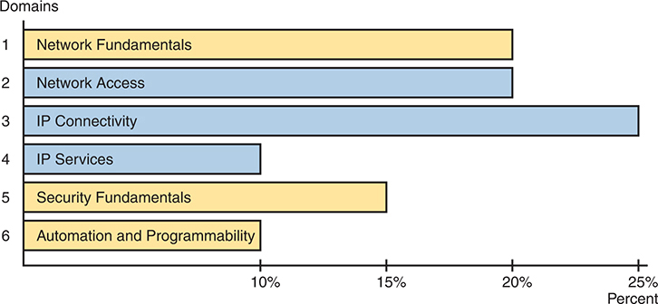

# Introduction

You are setting out on a journey to achieve your CCNA certification. For many, that step happens at the beginning of a new career path. For others, CCNA validates their knowledge and skills already learned on the job.

Surprisingly for an entry-level exam, the CCNA 200-301 exam includes more content by volume than many of the CCNP-level exams. As a result, Cisco Press publishes the Certification Guide for CCNA as two volumes. You can refer to the books as Volume 1 and Volume 2, but more formally, the books are

* *CCNA 200-301 Official Cert Guide, Volume 1*, Second Edition
* *CCNA 200-301 Official Cert Guide, Volume 2*, Second Edition (this book)

If you have already used the Volume 1 book and read or skimmed its Introduction, you do not need to read the entire Introduction to this book. This book has the same features and style as Volume 1. However, you might be interested to review the section titled "[Book Organization, Chapters, and Appendixes](vol2_pref08.xhtml#pref08lev1sec3)," for information specific to this book.

Regardless of your path to CCNA, the journey takes some time and effort. I encourage you to spend some time in the Introduction to learn more about CCNA and the books so you can have the best experience preparing for CCNA! To that end, this introduction discusses these main points:

Cisco Certifications and the CCNA

Book Features

Book Elements (Reference)

About Getting Hands-on Skills

About IP Subnetting

### Cisco Certifications and the CCNA

Congratulations! If you're reading far enough to look at this book's Introduction, you've probably already decided to go for your Cisco certification. Cisco has been the dominant vendor in networking for decades. If you want to be taken seriously as a network engineer, building your Cisco skills using Cisco certifications makes perfect sense. Where to start? CCNA.

#### Cisco Certifications as of 2024

CCNA acts as the entry point to a hierarchy of Cisco certifications. CCNA includes the foundational topics, with CCNP as the next higher challenge level, followed by CCIE. [Figure I-1](vol2_pref08.xhtml#ch00fig01) shows the hierarchy, with more detail about each in the list that follows.

**Figure I-1** *Cisco CCNA, CCNP, and CCIE Certifications*

**CCNA – Cisco Certified Network Associate:** Cisco began CCNA with a single CCNA certification back in 1998. They later expanded CCNA to include ten different CCNA certifications about different technology areas. Cisco retired all the varieties of CCNA back in 2020, leaving us again with a single CCNA certification, now referred to as simply "[CCNA](vol2_pref08.xhtml#pref08lev1sec1)."

**CCNP – Cisco Certified Network Professional:** Cisco followed the same progression with different CCNP certifications over time, starting with one in 1998. The big changes in 2020 consolidated the lineup to five CCNP certifications, all of which benefit from having knowledge of CCNA before moving on to CCNP.

**CCIE – Cisco Certified Internetwork Expert:** First introduced in 1993, these expert-level certifications require both a written exam plus a one-day practical exam with extensive hands-on lab challenges.

Beyond the CCNA, CCNP, and CCIE certifications, Cisco offers two other certification tracks—one for network automation and another for cybersecurity. The CCNA certification can be helpful as a foundation for those tracks as well. They are

**DevNet Certifications:** The DevNet Associate, DevNet Professional, and DevNet Expert certifications mirror the progression of CCNA/CCNP/CCIE, just without using those specific acronyms. The DevNet certifications focus on software development and APIs that matter to managing networks.

**CyberOps Certifications:** The CyberOps Associate and CyberOps Professional certifications mirror the progression of CCNA/CCNP. These security exams focus on security concepts, security monitoring, host-based analysis, network intrusion analysis, and security policies and procedures.

#### How to Get Your CCNA Certification

As you saw in [Figure I-1](vol2_pref08.xhtml#ch00fig01), all career certification paths now begin with CCNA. So how do you get the CCNA certification? Today, you have one and only one option to achieve CCNA certification:

Take and pass one exam: the Cisco 200-301 CCNA exam.

To take the 200-301 exam, or any Cisco exam, you will use the services of Pearson VUE. The process works something like this:

1. Establish a login at <https://vue.com/cisco> (or use your existing login).
2. Register for, schedule a time and place, and pay for the Cisco 200-301 exam, all from the VUE website.
3. Take the exam at the VUE testing center or from home with a video proctor watching to prevent cheating.
4. You will receive a notice of your score, and whether you passed, before you leave the testing center.

#### Content in the CCNA 200-301 Exam

We've all thought it, wondered, for almost every important test we ever took, and maybe even asked the teacher: "What's on the test?" For the CCNA exam, and for all Cisco certification exams, Cisco tells us.

Cisco publishes an exam blueprint for every Cisco exam, with the blueprint listing the exam topics for the exam. To find them, browse [www.cisco.com/go/certifications](http://www.cisco.com/go/certifications), look for the CCNA page, and navigate until you see the exam topics. And if you haven't already done so, create a bookmark folder for CCNA content in your web browser and bookmark a link to this page.

The exam blueprint organizes the exam topics into groups called domains. The document also tells us the percentage of points on the exam that come from each domain. For instance, every CCNA exam should score 25 percent of your points from the exam topics in the IP Connectivity domain. The exam does not tell you the domain associated with each question, but the percentages give us a better idea of the importance of the domains for the exam. [Figure I-2](vol2_pref08.xhtml#ch00fig02) shows the domains of the CCNA 200-301 Version 1.1 blueprint, the percentages, and the number of primary exam topics in each.

In the graph, the horizontal axis ranges from 0 to 25 percent, with each domain represented by a corresponding horizontal bar along the vertical axis. The domains and their respective percentages in the exam score are as follows: Network Fundamentals accounting for 20 percent, Network Access for 20 percent, I P Connectivity for 25 percent, I P Services for 10 percent, Security Fundamentals for 15 percent, and Automation and Programmability for 10 percent. Note that the values provided are approximate.

**Figure I-2** *CCNA 200-301 Domains and Percentage of Exam Score*

Within each domain, the exam topic document lists exam topics that follow two different styles of wording. The main exam topics use a verb in the phrase that tells you the level of mastery required; I call those primary exam topics. The exam topics document shows subtopics that I refer to as secondary exam topics. Those do not have a verb, but list more technology details (nouns), and assume the verb from the primary exam topic. For instance, the following excerpt from the exam topics document lists one primary exam topic with the *describe* verb, with more detail added by two secondary exam topics.

1.11 Describe wireless principles

1.11.a Nonoverlapping Wi-Fi channels

1.11.b SSID

##### Exam Topic Verbs (Depth) and Nouns (Breadth)

Understanding an exam topic requires that you think about each exam topic wording, focusing on the verbs and nouns. The nouns identify the technical topics, such as LAN switching, IP routing, protocols like OSPF, and so on. The verbs in each primary exam topic inform us about the type and depth of knowledge and skill tested per the exam topics.

For example, consider the following primary exam topic:

**Describe** IPsec remote access and site-to-site VPNs

I'm sure you know what the word *describe* means in the normal use of the term. But for people who build exams, the verb has special meaning as to what the exam questions should and should not require of the test taker. For instance, you should be ready to describe whatever "IPsec remote access and site-to-site VPNs" are. But the exam should not ask you to perform higher performance verbs, like *analyze* or *configure*.

[Figure I-3](vol2_pref08.xhtml#ch00fig03) shows a pyramid with verbs found in Cisco exam blueprints. It shows the lower-skill verbs at the bottom and higher skills at the top. An exam topic with a lower verb should not be tested with questions from higher knowledge and skill levels. For instance, with the exam topic "describe…first hop redundancy protocols," you should not expect to need to configure, verify, or troubleshoot the feature.

**Figure I-3** *Cisco Exam Topic Verbs*

Knowing that, how should you study? Well, instead of a many-layer pyramid, think of it as two layers: Knowledge and Skill. When learning content whose exam topics use verbs from the lower three rows of the pyramid, study the same way no matter which of those verbs the exam topic uses. Learn the topic well. Be ready to describe it, explain it, and interpret the meaning. For content with exam topics with the verbs *configure* and *verify*, think of those as including the first level of knowledge, plus also requiring configuration and verification skills. Also, think about the common configuration mistakes so you can troubleshoot those mistakes.

##### Comparing the Exam and Exam Topics

To understand what Cisco tells us about the exam versus the exam topics, return to cs.co/go/certifications or [cisco.com/go/ccna](http://cisco.com/go/ccna). Find the CCNA exam topics and open the PDF version (the text we need to consider is currently only in the PDF version). Open the PDF and spend 10–15 seconds scanning it.

Did you read the first two paragraphs, the ones before the list of exam topics? Or did you skip those and move straight to the long list of exam topics? Many people skip those paragraphs. One of those tells us much about the exam versus the exam topics, so I've copied it here, with emphasis added:

The following topics are *general guidelines* for the content likely to be included on the exam. However, *other related topics may also appear on any specific delivery of the exam*. To better reflect the contents of the exam and for clarity purposes, the *guidelines below may change at any time without notice*.

The first bold phrase mentions the most obvious point about the exam topics: They make a general statement. They do not detail every concept, fact, configuration option, and fact hidden in verification command output. Instead, anyone who cares about a Cisco exam like CCNA has to make a judgment about exactly what details the exam topic includes and excludes—and those judgements are subjective.

Our interpretation and expansion of the exam topics dictate what we choose to include and omit from the books. But we know from long experience that narrow interpretation can cover a large amount of CCNA content, but leave out too much. To cover as much as possible, we use a broad and deep interpretation. That has worked well throughout the 25 plus years for this book and its predecessors. It also matches the overwhelming feedback from reader surveys. In short, we shoot for the middle box in the concept drawing in [Figure I-4](vol2_pref08.xhtml#ch00fig04).

**Figure I-4** *Scope Concept: Exam Versus Exam Topics*

Cisco tells us the exam can ask questions about topics outside the exam topics. Look back again to the copy of the text that begins the exam blueprint PDF, to the bold phrase with the term "other related topics." Yes, the exam might ask things outside even a broad interpretation of the exam topics, as implied by the outer ring in [Figure I-4](vol2_pref08.xhtml#ch00fig04).

When choosing book content, I also make some predictions as to what those other related topics might be. Given the policies, we cannot possibly predict and include everything you might see on your exam. What we do promise is to cover each exam topic based on a broad and deep interpretation.

##### How to Prepare for the Generalized Exam Topics

Given the general nature of Cisco exam topics, plus the possibility of topic areas not listed in the exam topics, how should you go about preparing for the CCNA exam? Most importantly, strive to master all information and skills implied by the exam topics. On exam day, you may still see a few questions about topics you have not studied—but you should know far more than enough to pass the exam.

So, how do you master the topics listed in the exam blueprint? Let me give you a few suggestions.

1. Follow the suggestions in Volume 1's section "[Your Study Plan](vol2_appf.xhtml#appf)" just before [Chapter 1](vol2_ch01.xhtml#ch01) of that book.
2. Practice hands-on CLI skills. The later section of the Introduction titled "[About Building Hands-On Skills](vol2_pref08.xhtml#pref08lev1sec4)" discusses some ways to practice.
3. Pay close attention to troubleshooting topics in the book.
4. Practice all math-related skills, over time, until you master them.
5. Ensure you know all exam topic content as listed in the exam topics. Read the exam topics, consider your own literal interpretation, and when uncertain or confused, dig in and study further.
6. Trust that the book uses its broad interpretation of the exam topics to help you learn as much as possible that might be on the exam.

#### Types of Questions on the CCNA 200-301 Exam

You can expect the following kinds of questions on the exam; just be aware that the style of questions may change over time.

* Multiple-choice, single-answer
* Multiple-choice, multiple-answer
* Drag-and-drop
* Lab

For the multichoice questions, the exam software gives us a few important advantages:

* There is no penalty for guessing.
* Multichoice questions with a single correct answer require you to answer and allow only one answer.
* Multichoice questions with multiple correct answers tell you the number of correct answers and warn you if you have not selected that many answers.

For instance, if a question tells you there are two correct answers, and you select only one and then try to move to the next question, the app reminds you that you should choose another answer before moving on.

As for drag-and-drop, some questions use simple text blocks that you move from one list to another. However, you might see questions where you move items in a network diagram or some other creative use of drag-and-drop.

Finally, Cisco introduced lab questions (formally called performance-based questions) in 2022. Lab questions present you with a lab scenario with a lab pod of virtual routers and switches running in the background; you get console access to a few devices. Your job: find the missing or broken configuration and reconfigure the devices so that the lab scenario works. The best way to practice for these questions is to practice in lab; more on that in the section titled "[About Building Hands-On Skills](vol2_pref08.xhtml#pref08lev1sec4)."

As an aside, prior Cisco exams had Sim questions instead of lab questions. Sim questions required the same from us: read the scenario and fix the configuration. However, Sim questions used simulated Cisco devices with limited command support, which frustrated some test takers. The lab questions use real Cisco operating systems running in a virtual environment, so they provide a much more realistic experience compared to old Sim questions.

### Book Features

This book includes many study features beyond the core explanations and examples in each chapter. This section acts as a reference to the various features in the book.

#### The CCNA Books: Volume 1 and Volume 2

The CCNA exam covers a large amount of content, and it does not fit in a single volume. As a result, Cisco Press has long published books for the CCNA exam as a two-book set. Volume 1 covers about half of the content, and Volume 2 covers the rest, as shown in [Figure I-5](vol2_pref08.xhtml#ch00fig05). To best use both books, start in Volume 1 and work through the book in order, and then do the same with Volume 2.

**Figure I-5** *Two Books for CCNA 200-301*

When you start each new chapter, review the list of exam topics that begins the chapter. The book does not follow the same order of exam topics in the blueprint, but instead follows a more effective order for learning the topics. For reference, look to [Appendix B](vol2_appb.xhtml#appb), "[Exam Topics Cross-Reference](vol2_appb.xhtml#appb)," in the back of the book. The appendix includes:

* A list of exam topics and the chapter(s) covering each topic
* A list of chapters and the exam topics covered in each chapter

##### Exam Blueprint Versions and Book Editions

Cisco made minor changes to the CCNA exam blueprint in 2024, the first change to the CCNA 200-301 exam since the year 2020. The much more important change (announced in 2023) had to do with the entire Cisco certification program about how Cisco announces and releases new exams and exam blueprints. Before 2023, when Cisco changed any CCNA or CCNP exam, they also changed the exam number, and the announcement was sudden. Those days are gone.

You should read and understand Cisco's long-term strategy for being more forthright about exam plans as detailed at [www.cisco.com/go/certroadmap](http://www.cisco.com/go/certroadmap). Summarizing some key points, when Cisco changes an exam in the future, Cisco will keep the same exam number. To identify the changes, they will use a major.minor version numbering plan for every exam blueprint. More importantly, Cisco tells us when they will consider changing CCNA each year, but we know when Cisco will announce changes and when the new exam will be released, within a few months' timing.

The exam blueprint version changes based on two determinations: 1) whether Cisco will change the exam that year at all, and 2) if so, whether Cisco considers the changes to be major or minor. For instance, Cisco considered making a change to CCNA during February–April 2023 but chose not to change it, announcing that fact in the May–July 2023 timeframe. In 2024, Cisco chose to make minor changes to the CCNA blueprint. As a result, the former CCNA blueprint version 1.0 (major version 1, minor version 0) changed to version 1.1, increasing the minor version by 1.

Looking forward, if the next three future CCNA blueprint changes are also minor, they would be blueprint versions 1.2, 1.3, and 1.4. However, if any of them are major, that version would move to the next major version (2.0), with subsequent minor version changes as 2.1, 2.2, and so on.

Cisco also tells us that each year, internally, Cisco considers what to do with CCNA in the February–April timeframe. They will announce their plans to us all between May–July, and they will release the new exam (if changes are being made) sometime in the six months or so following the announcement.

As for the publishing plans to support that new update cycle, you should read and monitor the publisher's web page at [www.ciscopress.com/newcerts](http://www.ciscopress.com/newcerts). Also, opt in for communications on that page so the publisher will email you about future plans and updates.

Summarizing a few key points about the publisher's plans, this book, the second edition, was written for version 1.1 of the CCNA 200-301 blueprint, but it should be the book used for CCNA for subsequent blueprint versions as well. During the life of this second edition book, Cisco may update the CCNA 200-301 exam blueprint a few times, while this book (plus the Volume 1 Second Edition book) may remain unchanged. New exam content may be made available as electronic downloads. At some point, a new edition will be appropriate. ([Figure I-6](vol2_pref08.xhtml#ch00fig06) shows one example of what might happen over time, with downloadable PDFs between editions.)

**Figure I-6** *Possible Progression of Book Editions, New Content Release, Versus Exams*

Note

I cannot stress enough: monitor both the Cisco Press and Cisco pages linked in the preceding paragraphs, and opt in for communications at those pages, to stay aware of any exam and publishing plans. Also, consider watching my blog ([www.certskills.com](http://www.certskills.com)), where I expect to post about changes.

When you finish the technology chapters in this book ([Chapters 1](vol2_ch01.xhtml#ch01)–[24](vol2_ch24.xhtml#ch24)), make sure to also read [Chapter 25](vol2_ch25.xhtml#ch25), "[Exam Updates](vol2_ch25.xhtml#ch25)." We post updated versions of that chapter online. We use that chapter to deliver small content updates to you as well as to inform you about future content updates. Make sure to read through that chapter and learn how to download the latest version of the chapter, discovering if new content has been posted after this book was published.

Also, just to reduce confusion about the book titles, note that the prior edition of this book is nearly identical to this book's title. Comparing the titles:

* *CCNA 200-301 Official Cert Guide, Volume 2* (the prior edition, published in 2019 for 200-301 exam blueprint version 1.0)
* *CCNA 200-301 Official Cert Guide, Volume 2*, Second Edition (this edition, published in 2024 for 200-301 exam blueprint version 1.1 and beyond)

##### Comparing This Edition to the Previous

This book replaces a similar book that applied to the former CCNA 200-301 exam blueprint 1.0. Some of you may buy this book but have already begun studying with the prior edition. The following list of major changes to this book versus the previous may help you avoid rereading identical or similar content in this book.

**[Chapter 4](vol2_ch04.xhtml#ch04):** (Formerly Volume 1, Chapter 29) Added examples and GUI screenshots for wireless LAN configuration using a WLC with IOS XE.

**[Chapter 7](vol2_ch07.xhtml#ch07):** (Formerly [Chapter 3](vol2_ch03.xhtml#ch03)) Significant rewrite; added more about rules for ACL editing, and noted differences with ACLs between IOS and IOS XE.

**[Chapter 8](vol2_ch08.xhtml#ch08):** New chapter about matching different protocols using ACLs.

**[Chapter 10](vol2_ch10.xhtml#ch10):** (Formerly [Chapter 5](vol2_ch05.xhtml#ch05)) Revised password type discussion and added IOS versus IOS XE details.

**[Chapter 13](vol2_ch13.xhtml#ch13):** (Formerly [Chapter 9](vol2_ch09.xhtml#ch09)) Added CDP/LLDP timers and LLDP-MED with TLVs.

**[Chapter 14](vol2_ch14.xhtml#ch14):** (Formerly [Chapter 10](vol2_ch10.xhtml#ch10)) Revised NAT chapter to simplify and strengthen the examples.

**[Chapter 16](vol2_ch16.xhtml#ch16):** (Formerly [Chapter 12](vol2_ch12.xhtml#ch12)) Split FHRP into a separate chapter, expanding discussions to give more detail on VRRP and GLBP.

**[Chapter 17](vol2_ch17.xhtml#ch17):** (Formerly [Chapter 12](vol2_ch12.xhtml#ch12)) Split SNMP, FTP, and TFTP from FHRP into a separate chapter. Expanded the SNMP section and revised the IFS topic with IOS XE examples.

**[Chapter 18](vol2_ch18.xhtml#ch18):** (Formerly [Chapter 13](vol2_ch13.xhtml#ch13)) Added topics for UTP cabling, multigig Ethernet, multimode Ethernet for campus LANs, and improved PoE descriptions.

**[Chapter 19](vol2_ch19.xhtml#ch19):** (Formerly [Chapter 14](vol2_ch14.xhtml#ch14)) Updated notes about 5G WAN, and added detail on IPsec.

**[Chapter 20](vol2_ch20.xhtml#ch20):** (Formerly [Chapter 15](vol2_ch15.xhtml#ch15)) Added concepts of containers and VRFs, and adds cloud management topics including Meraki.

**[Chapters 21](vol2_ch21.xhtml#ch21)–[22](vol2_ch22.xhtml#ch22):** (Formerly [Chapters 16](vol2_ch16.xhtml#ch16) and [17](vol2_ch17.xhtml#ch17)) Updated for various software version updates and product rebranding, and adds the AI/ML topic.

**[Chapter 23](vol2_ch23.xhtml#ch23):** (Formerly [Chapter 18](vol2_ch18.xhtml#ch18)) Updated for exam topic change to include API authentication.

**[Chapter 24](vol2_ch24.xhtml#ch24):** (Formerly [Chapter 19](vol2_ch19.xhtml#ch19)) Updated for exam topic change to replace the descriptions of Puppet and Chef with new information about Terraform.

If you find the preceding information useful, consider looking in two other places that allow us to provide ongoing updates and to answer questions. First, I expect to post blog posts about the new CCNA exam changes, as always, at my blog ([www.certskills.com](http://www.certskills.com)). Look there for posts in the News section (click the General menu item and then News), for posts made mid-year 2024 when Cisco should announce their plans.

Second, look to the companion website for this book for details about future exam revisions and publishing plans. The companion website gives the publisher a place to list details about changes moving forward. See this Introduction's later section titled "[The Companion Website for Online Content](vol2_pref08.xhtml#pref08lev2sec8)" for the instructions for finding the site.

#### Chapter Features

Beginning to study CCNA can be overwhelming at first due to the volume. The best way to overcome that reaction requires a change in mindset: *treat each chapter as a separate study task*. Breaking your study into manageable tasks helps a lot.

Each chapter of this book is a self-contained short course about one small topic area, organized for reading and study. I create chapters so they average about 20 pages to cover the technology so that no one chapter takes too long to complete. Each chapter breaks down as follows:

**"Do I Know This Already?" quizzes:** Each chapter begins with a pre-chapter quiz so you can self-assess how much you know coming into the chapter.

**Foundation Topics:** This is the heading for the core content section of the chapter, with average length of 20 pages.

**Chapter Review:** This section includes a list of study tasks useful to help you remember concepts, connect ideas, and practice skills-based content in the chapter.

Do not read the "Foundation Topics" section of chapter after chapter without pausing to review and study. Each "Chapter Review" section uses a variety of other book features to help you study and internalize that chapter's content, including the following:

* **Review Key Topics:** All the content in the books matters, but some matters more. Cisco Press certification guides use a Key Topic icon next to those items in the "Foundation Topics" section. The "Chapter Review" section lists the key topics in a table. You can scan the chapter to review them or review the Key Topics more conveniently using the companion website.
* **Complete Tables from Memory:** We convert some tables in the book to interactive study tables called memory tables. You access memory tables from the companion website. Memory tables repeat the table, but with parts of the table removed. You can then fill in the table to exercise your memory and click to check your work.
* **Key Terms You Should Know:** The "Chapter Review" section lists the key terminology from the chapter. For a manual process with the book, think about each term and use the Glossary to cross-check your own mental definitions. Alternately, review the key terms with the "Key Terms Flashcards" app on the companion website.
* **Labs:** You should practice hands-on skills for any exam topics with the *configure* and *verify* verbs. The upcoming section titled "[About Building Hands-On Skills](vol2_pref08.xhtml#pref08lev1sec4)" discusses your lab options. Also, the Chapter and Part Reviews refer you to lab exercises specific to the chapter or part.
* **Command References:** Some book chapters discuss the configure and verify exam topics, so they list various router and switch commands. The "Chapter Review" section of those chapters includes command reference tables, useful both for reference and for study. Just cover one column of the table and see how much you can remember and complete mentally.
* **Review DIKTA Questions:** Even if you used the DIKTA questions to begin the chapter, re-answering those questions can prove a useful way to review facts. By design, I do not mention the DIKTA questions in the "Chapter Review" sections but do suggest using them again for all chapters in a part during Part Review. Use the Pearson Test Prep (PTP) web app to easily use those questions any time you have a few minutes, a device, and Internet access.

#### Part Features

Your second mindset change: Use the book parts as major milestones in your study journey. Each part groups a small number of related chapters together. Take the time at the end of each part to review all topics in the part, effectively rewarding yourself with a chance to deepen your knowledge and internalize more of the content before moving to the next part. [Figure I-7](vol2_pref08.xhtml#ch00fig07) shows the concept.

**Figure I-7** *Part Review: The Second Review of Most Content*

The Part Review element at the end of each part suggests review and study activities. Spaced reviews—that is, reviewing content several times over the course of your study—help improve retention. Using the Chapter and Part Review process, the Part Review serves as your second review of the content in each chapter. The Part Review repeats some Chapter Review activities and offers some new ones, including a reminder to use practice questions set aside specifically for Part Review.

#### The Companion Website for Online Content

Some Chapter and Part Review tasks can be done from the book. However, several of them work better as an interactive online tool. For instance, you can take a "Do I Know This Already?" quiz by reading the pages of the book, but you can also use the PTP testing software. As another example, when you want to review the key terms from a chapter, you can find all those in electronic flashcards.

This book's companion website hosts all the electronic components of the book. The companion website gives you a big advantage: you can do most of your Chapter and 
Part Review work from anywhere using the interactive tools on the site. The advantages include

* **Easier to use:** Instead of having to print out copies of the appendixes and do the work on paper, you can use these new apps, which provide you with an easy-to-use, interactive experience that you can easily run over and over.
* **Convenient:** When you have a spare 5–10 minutes, go to the book's website and review content from one of your recently finished chapters.
* **Good break from reading:** Sometimes looking at a static page after reading a chapter lets your mind wander. Breaking up your reading with some review from the keyboard can help keep you focused on the activity.

The interactive Chapter Review elements should improve your chances of passing as well. Our in-depth reader surveys over the years show that those who do the Chapter and Part Reviews learn more. Those who use the interactive review elements tend to do the review tasks more often. So, take advantage of the tools and maybe you will be more successful as well. [Table I-1](vol2_pref08.xhtml#ch00tab01) summarizes these interactive applications and the traditional book features that cover the same content.

**Table I-1** Book Features with Both Traditional and App Options

| Feature | Traditional | App |
| --- | --- | --- |
| Key Topic | The "Chapter Review" section lists the key topics. To review, flip pages in the chapter. | Key Topics Table app with links to view each key topic |
| Config Checklist | This list of steps, in text, describes how to configure a feature. | Config Checklist app, where you complete the checklist by adding commands |
| Key Terms | Terms are listed in each "Chapter Review" section; review using the end-of-book Glossary. | Key Terms Flash Cards app |
| Appendixes: ACL Practice | [Appendix E](vol2_appe.xhtml#appe) provides static text practice problems and answers in the PDF appendixes. | Apps with the same practice problems, found in the "Memory Tables and Practice Exercises" section |

The companion website also includes links to download, navigate, or stream for these types of content:

* Pearson Sim Lite Desktop App
* Pearson Test Prep (PTP) Desktop App
* Pearson Test Prep (PTP) Web App
* Videos

#### How to Access the Companion Website

To access the companion website, which gives you access to the electronic content with this book, start by establishing a login at [www.ciscopress.com](http://www.ciscopress.com) and register your book. To do so, simply go to [www.ciscopress.com/register](http://www.ciscopress.com/register) and enter the ISBN of the print book: **9780138214951**. After you have registered your book, go to your account page and click the **Registered Products** tab. From there, click the **Access Bonus Content** link to get access to the book's companion website.

Note that if you buy the *Premium Edition eBook and Practice Test* version of this book from Cisco Press, your book will automatically be registered on your account page. Simply go to your account page, click the **Registered Products** tab, and select **Access Bonus Content** to access the book's companion website.

#### How to Access the Pearson Test Prep (PTP) App

You have two options for installing and using the Pearson Test Prep application: a web app and a desktop app. To use the Pearson Test Prep application, start by finding the registration code that comes with the book. You can find the code in these ways:

* You can get your access code by registering the print ISBN 9780138214951 on [ciscopress.com/register](http://ciscopress.com/register). Make sure to use the print book ISBN, regardless of whether you purchased an eBook or the print book. After you register the book, your access code will be populated on your account page under the Registered Products tab. Instructions for how to redeem the code are available on the book's companion website by clicking the Access Bonus Content link.
* If you purchase the Premium Edition eBook and Practice Test directly from the Cisco Press website, the code will be populated on your account page after purchase. Just log in at [ciscopress.com](http://ciscopress.com), click Account to see details of your account, and click the digital purchases tab.

Note

After you register your book, your code can always be found in your account under the Registered Products tab.

Once you have the access code, to find instructions about both the PTP web app and the desktop app, follow these steps:

**Step 1.** Open this book's companion website as shown earlier in this Introduction under the heading, "[How to Access the Companion Website](vol2_pref08.xhtml#pref08lev2sec9)."

**Step 2.** Click the **Practice Exams** button.

**Step 3.** Follow the instructions listed there for both installing the desktop app and using the web app.

Note that if you want to use the web app only at this point, just navigate to [pearsontestprep.com](http://pearsontestprep.com), log in using the same credentials used to register your book or purchase the Premium Edition, and register this book's practice tests using the registration code you just found. The process should take only a couple of minutes.

#### Feature Reference

The following list provides an easy reference to get the basic idea behind each book feature:

* **Practice exam:** The book gives you the rights to the Pearson Test Prep (PTP) testing software, available as a web app and a desktop app. Use the access code on a piece of cardboard in the sleeve in the back of the book, and use the companion website to download the desktop app or navigate to the web app (or just go to [www.pearsontestprep.com](http://www.pearsontestprep.com)).
* **eBook:** Pearson offers an eBook version of this book that includes extra practice tests as compared to the print book. The product includes two versions of the eBook: PDF (for reading on your computer) and EPUB (for reading on your tablet, mobile device, or Kindle, Nook, or other e-reader). It also includes additional practice test questions and enhanced practice test features, including links from each question to the specific heading in the eBook file.
* **Mentoring videos:** The companion website also includes a number of videos about other topics as mentioned in individual chapters. Some of the videos explain common mistakes made with CCNA topics, whereas others provide sample CCNA questions with explanations.
* **CCNA 200-301 Network Simulator Lite:** This Lite version of the best-selling CCNA Network Simulator from Pearson provides you with a means, right now, to experience the Cisco command-line interface (CLI). No need to go buy real gear or buy a full simulator to start learning the CLI. Just install it from the companion website.
* **CCNA Simulator:** If you are looking for more hands-on practice, you might want to consider purchasing the CCNA Network Simulator. You can purchase a copy of this software from Pearson at <http://pearsonitcertification.com/networksimulator> or other retail outlets. To help you with your studies, Pearson has created a mapping guide that maps each of the labs in the simulator to the specific sections in each volume of the CCNA Cert Guide. You can get this mapping guide free on the Extras tab on the book product page: [www.ciscopress.com/title/9780138214951](http://www.ciscopress.com/title/9780138214951).
* **Author's website and blogs:** The author maintains a website that hosts tools and links useful when studying for CCNA. In particular, the site has a large number of free lab exercises about CCNA content, additional sample questions, and other exercises. Additionally, the site indexes all content so you can study based on the book chapters and parts. To find it, navigate to [www.certskills.com](http://www.certskills.com). Additionally, look for CCNA activities and lectures at his YouTube channel ([www.youtube.com/@networkupskill](http://www.youtube.com/@networkupskill)).

### Book Organization, Chapters, and Appendixes

This book contains 24 chapters about CCNA topics organized into seven parts. The core chapters cover the following topics:

* **[Part I](vol2_part01.xhtml#part01): [Wireless LANs](vol2_part01.xhtml#part01)**

  * **[Chapter 1](vol2_ch01.xhtml#ch01), "[Fundamentals of Wireless Networks](vol2_ch01.xhtml#ch01),"** includes the foundational concepts of wireless 802.11 LANs, including wireless topologies and basic wireless radio communications protocols.
  * **[Chapter 2](vol2_ch02.xhtml#ch02), "[Analyzing Cisco Wireless Architectures](vol2_ch02.xhtml#ch02),"** turns your attention to the questions related to the systematic and architectural issues surrounding how to build wireless LANs and explains the primary options available for use.
  * **[Chapter 3](vol2_ch03.xhtml#ch03), "[Securing Wireless Networks](vol2_ch03.xhtml#ch03),"** explains the unique security challenges that exist in a wireless LAN and the protocols and standards used to prevent different kinds of attacks.
  * **[Chapter 4](vol2_ch04.xhtml#ch04), "[Building a Wireless LAN](vol2_ch04.xhtml#ch04),"** shows how to configure and secure a wireless LAN using a Wireless LAN Controller (WLC).
* **[Part II](vol2_part02.xhtml#part02): [IP Access Control Lists](vol2_part02.xhtml#part02)**

  * **[Chapter 5](vol2_ch05.xhtml#ch05), "[Introduction to TCP/IP Transport and Applications](vol2_ch05.xhtml#ch05),"** completes most of the detailed discussion of the upper two layers of the TCP/IP model (transport and application), focusing on TCP and applications.
  * **[Chapter 6](vol2_ch06.xhtml#ch06), "[Basic IPv4 Access Control Lists](vol2_ch06.xhtml#ch06),"** examines how standard IP ACLs can filter packets based on the source IP address so that a router will not forward the packet.
  * **[Chapter 7](vol2_ch07.xhtml#ch07), "[Named and Extended IP ACLs](vol2_ch07.xhtml#ch07),"** examines both named and numbered ACLs, and both standard and extended IP ACLs.
  * **[Chapter 8](vol2_ch08.xhtml#ch08), "[Applied IP ACLs](vol2_ch08.xhtml#ch08),"** shows how to match overhead protocols like DNS, DHCP, and OSPF with ACLs.
* **[Part III](vol2_part03.xhtml#part03): [Security Services](vol2_ch03.xhtml#ch03)**

  * **[Chapter 9](vol2_ch09.xhtml#ch09), "[Security Architectures](vol2_ch09.xhtml#ch09),"** discusses a wide range of fundamental concepts in network security.
  * **[Chapter 10](vol2_ch10.xhtml#ch10), "[Securing Network Devices](vol2_ch10.xhtml#ch10),"** shows how to secure the router and switch CLI and introduces the concepts behind firewalls and intrusion prevention systems (IPSs).
  * **[Chapter 11](vol2_ch11.xhtml#ch11), "[Implementing Switch Port Security](vol2_ch11.xhtml#ch11),"** explains the concepts as well as how to configure and verify switch port security, a switch feature that does basic MAC-based monitoring of the devices that send data into a switch.
  * **[Chapter 12](vol2_ch12.xhtml#ch12), "[DHCP Snooping and ARP Inspection](vol2_ch12.xhtml#ch12),"** shows how to implement two related switch security features, with one focusing on reacting to suspicious DHCP messages and the other reacting to suspicious ARP messages.
* **[Part IV](vol2_ch04.xhtml#ch04): [IP Services](vol2_ch04.xhtml#ch04)**

  * **[Chapter 13](vol2_ch13.xhtml#ch13), "[Device Management Protocols](vol2_ch13.xhtml#ch13),"** discusses the concepts and configuration of some common network management tools: syslog, NTP, CDP, and LLDP.
  * **[Chapter 14](vol2_ch14.xhtml#ch14), "[Network Address Translation](vol2_ch14.xhtml#ch14),"** works through the complete concept, configuration, verification, and troubleshooting sequence for the router NAT feature, including how it helps conserve public IPv4 addresses.
  * **[Chapter 15](vol2_ch15.xhtml#ch15), "[Quality of Service (QoS)](vol2_ch15.xhtml#ch15),"** discusses a wide variety of concepts all related to the broad topic of QoS.
  * **[Chapter 16](vol2_ch16.xhtml#ch16), "[First Hop Redundancy Protocols](vol2_ch16.xhtml#ch16),"** explains the purpose, functions, and concepts of FHRPs, including HSRP, VRRP, and GLBP.
  * **[Chapter 17](vol2_ch17.xhtml#ch17), "[SNMP, FTP, and TFTP](vol2_ch17.xhtml#ch17),"** discusses three protocols often used for managing network devices: SNMP, TFTP, and FTP.
* **[Part V](vol2_ch05.xhtml#ch05): [Network Architecture](vol2_ch05.xhtml#ch05)**

  * **[Chapter 18](vol2_ch18.xhtml#ch18), "[LAN Architecture](vol2_ch18.xhtml#ch18),"** examines various ways to design Ethernet LANs, discussing the pros and cons, and explains common design terminology, including Power over Ethernet (PoE).
  * **[Chapter 19](vol2_ch19.xhtml#ch19), "[WAN Architecture](vol2_ch19.xhtml#ch19),"** discusses the concepts behind three WAN alternatives: Metro Ethernet, MPLS VPNs, and Internet VPNs.
  * **[Chapter 20](vol2_ch20.xhtml#ch20), "[Cloud Architecture](vol2_ch20.xhtml#ch20),"** explains the basic concepts and then generally discusses the impact that cloud computing has on a typical enterprise network, including the foundational concepts of server virtualization.
* **[Part VI](vol2_ch06.xhtml#ch06): [Network Automation](vol2_ch06.xhtml#ch06)**

  * **[Chapter 21](vol2_ch21.xhtml#ch21), "[Introduction to Controller-Based Networking](vol2_ch21.xhtml#ch21),"** discusses many concepts and terms related to how Software-Defined Networking (SDN) and network programmability are impacting typical enterprise networks.
  * **[Chapter 22](vol2_ch22.xhtml#ch22), "[Cisco Software-Defined Access (Cisco SD-Access)](vol2_ch22.xhtml#ch22),"** discusses Cisco's Software-Defined Networking (SDN) offering for the enterprise, including the Cisco Catalyst Center (formerly Cisco DNA Center) controller.
  * **[Chapter 23](vol2_ch23.xhtml#ch23), "[Understanding REST and JSON](vol2_ch23.xhtml#ch23),"** explains the foundational concepts of REST APIs, data structures, and how JSON can be useful for exchanging data using APIs.
  * **[Chapter 24](vol2_ch24.xhtml#ch24), "[Understanding Ansible and Terraform](vol2_ch24.xhtml#ch24),"** discusses the need for configuration management software and introduces the basics of each of these configuration management tools.
* **[Part VII](vol2_ch07.xhtml#ch07): [Exam Updates and Final Review](vol2_ch07.xhtml#ch07)**

  * **[Chapter 25](vol2_ch25.xhtml#ch25), "***CCNA 200-301 Official Cert Guide, Volume 2*, **Second Edition, Exam Updates,"** is a place for the author to add book content mid-edition. Always check online for the latest PDF version of this appendix; the appendix lists download instructions.
  * **[Chapter 26](vol2_ch26.xhtml#ch26), "[Final Review](vol2_ch26.xhtml#ch26),"** suggests a plan for final preparation after you have finished the core parts of the book, in particular explaining the many study options available in the book.
* **[Part VIII](vol2_ch08.xhtml#ch08): [Print Appendixes](vol2_ch08.xhtml#ch08)**

  * **[Appendix A](vol2_appa.xhtml#appa), "[Numeric Reference Tables](vol2_appa.xhtml#appa),"** lists several tables of numeric information, including a binary-to-decimal conversion table and a list of powers of 2.
  * **[Appendix B](vol2_appb.xhtml#appb), "[Exam Topics Cross-Reference](vol2_appb.xhtml#appb),"** provides some tables to help you find where each exam objective is covered in the book.
  * **[Appendix C](vol2_appc.xhtml#appc), "[Answers to the ‘Do I Know This Already?' Quizzes](vol2_appc.xhtml#appc),"** includes the explanations to all the "Do I Know This Already" quizzes.
  * The [**Glossary**](vol2_gloss.xhtml#gloss) contains definitions for many of the terms used in the book, including the terms listed in the "Key Terms You Should Know" sections at the conclusion of the chapters.
* **Part IX: Online Appendixes**

  * **[Appendix D](vol2_appd.xhtml#appd), "[Topics from Previous Editions](vol2_appd.xhtml#appd)"**
  * **[Appendix E](vol2_appe.xhtml#appe), "[Practice for Chapter 6: Basic IPv4 Access Control Lists](vol2_appe.xhtml#appe)"**
  * **[Appendix F](vol2_appf.xhtml#appf), "[Study Planner](vol2_appf.xhtml#appf),"** is a spreadsheet with major study milestones, where you can track your progress through your study.

### About Building Hands-On Skills

To do well on the CCNA exam, you need skills in using Cisco routers and switches, specifically the Cisco command-line interface (CLI). The Cisco CLI is a text-based command-and-response user interface; you type a command, and the device (a router or switch) displays messages in response.

For the exam, CLI skills help you in a couple of ways. First, lab questions require CLI skills. Each lab question can take 7–8 minutes if you know the topic, so poor CLI skills can cost several minutes per lab question. Additionally, any question type can ask about CLI commands, so the more comfortable you are remembering commands, parameters, and what they do, the more points you will pick up on the exam.

This next section walks through the options of what is included in the book, with a brief description of lab options outside the book.

#### Config Lab Exercises

I created some lab exercises called Config Labs and put them on my blog. Each Config Lab details a straightforward lab exercise. It begins with a scenario, a topology, and an existing configuration. You choose the configuration to add to each device to meet the goals of the scenario.

To make the labs accessible to all, the blog has no login requirements and no cost. You can do each lab just by viewing the page, reading, and writing your answer on paper or typing it in an editor. Optionally, you can attempt most labs in the Cisco Packet Tracer Simulator. In either case, the Config Lab page lists the intended answer, so you can check your work.

To find the Config Labs, first go to [www.certskills.com](http://www.certskills.com). Navigate from the top menus for "[Labs](vol2_part-p04.xhtml#p04lev1sec4)." Alternatively, use the advanced search link, from which you can combine search parameters to choose a book chapter or part, and to search for Config Lab posts.

Note that the blog organizes these Config Lab posts by book chapter, so you can easily use them at both Chapter Review and Part Review. See the "[Your Study Plan](vol2_appf.xhtml#appf)" element that follows the Introduction for more details about those review sections.

#### A Quick Start with Pearson Network Simulator Lite

The decision of how to get hands-on skills can be a little scary at first. The good news: You have a free and simple first step to experience the CLI—install a desktop simulator app called Pearson Network Simulator Lite (or NetSim Lite) that comes with this book.

Pearson builds a CCNA Simulator app designed to help you learn most of the CCNA configure and verify exam topics. They also make a free Lite version of the simulator, included with this book. The Lite version gives you the means to experience the Cisco CLI just after a 5–10-minute installation process. No need to go buy real gear or buy a full simulator to start learning the CLI. Just install the Sim Lite from the companion website.

This latest version of NetSim Lite for Volume 2 (which differs from the NetSim Lite that comes with Volume 1) includes labs about IP ACLs.

#### The Pearson Network Simulator

The Config Labs and the Pearson Network Simulator Lite both fill specific needs, and they both come with the book. However, you need more than those two tools.

The single best option for lab work to do along with this book is the paid version of the Pearson Network Simulator. This simulator product simulates Cisco routers and switches so that you can learn for CCNA certification. But more importantly, it focuses on learning for the exam by providing a large number of useful lab exercises. Reader surveys tell us that those people who use the simulator along with the book love the learning process and rave about how the book and simulator work well together.

Of course, you need to make a decision for yourself and consider all the options. Thankfully, you can get a great idea of how the full simulator product works by using the Pearson Network Simulator Lite product included with the book. Both have the same base code, same user interface, and same types of labs. Try the Lite version to decide if you want to buy the full product.

On a practical note, when you want to do labs when reading a chapter or doing Part Review, the Simulator organizes the labs to match the book. Just look for the Sort by Chapter tab in the Simulator's user interface.

At the time this book was published, Pearson had no plan to update its CCNA Simulator product to a new version, as the current edition covers the latest exam topics. A software update will be issued that maps the labs to the organization of the new Cert Guide chapter structure by the summer of 2024.

#### More Lab Options

Many other lab options exist. For instance, you can use real Cisco routers and switches. You can buy them, new or used, or borrow them at work. For example, you can buy routers and switches that are useful for CCNA learning, but are two or three product generations old. You can also find sites from which you can rent time on real devices or virtual devices.

Cisco also makes a free simulator that works very well as a learning tool: Cisco Packet Tracer. Unlike the Pearson Network Simulator, it does not include lab exercises that direct you as to how to go about learning each topic. However, you can usually find lab exercises that rely on Packet Tracer, like the Config Labs at my blog. If interested in more information about Packet Tracer, check out [www.certskills.com/ptinstall](http://www.certskills.com/ptinstall).

Cisco offers a virtualization product that lets you run router and switch operating system (OS) images in a virtual environment on your PC. This tool, the Cisco Modeling Labs–Personal Edition (CML PE), lets you create a lab topology, start the operating system for each device, and connect to the CLI of these real router and switch OS images. There is a fee, and you may need a PC hardware upgrade to use it effectively. Check out [www.cisco.com/go/cml](http://www.cisco.com/go/cml) for more information, and inquire for more information at the Cisco Learning Network's CML community ([learningnetwork.cisco.com](http://learningnetwork.cisco.com)).

The next two options work somewhat like CML PE, but with free software but no Cisco operating systems supplied. GNS3 ([gns3.com](http://gns3.com)) and EVE-NG ([eve-ng.net](http://eve-ng.net)) support creating topologies of virtual routers and switches that run real Cisco operating systems. Both have free options. However, both require that you provide the OS images. Also, as with CML PE, you may need to buy a small server or at least upgrade your personal computer to run more than a few routers and switches in a lab topology.

This book does not tell you what option to use, but you should plan on getting some hands-on practice somehow. For people starting with CCNA, many use some simulator like Pearson Sim Lite and the free Cisco Packet Tracer simulator. If you go far in your Cisco certification journey, you will likely try at least one of the virtualization options and also use real gear. The important thing to know is that most people need to practice using the Cisco CLI to be ready to pass these exams.

### For More Information

If you have any comments about the book, submit them via [www.ciscopress.com](http://www.ciscopress.com). Just go to the website, select **Contact Us**, and type your message.

Cisco might make changes that affect the CCNA certification from time to time. You should always check [www.cisco.com/go/ccna](http://www.cisco.com/go/ccna) for the latest details.

The *CCNA 200-301 Official Cert Guide*, *Volume 2*, Second Edition, helps you attain CCNA certification. This is the CCNA certification book from the only Cisco-authorized publisher. We at Cisco Press believe that this book certainly can help you achieve CCNA certification, but the real work is up to you! I trust that your time will be well spent.